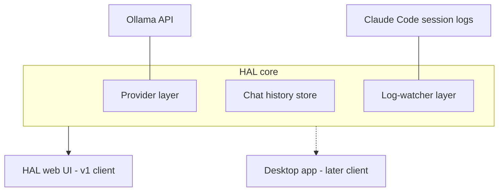

# HAL 1000 Harness — Requirements

## Summary

Build HAL 1000: a locally-run, HAL 9000-styled harness for chatting with LLMs. Version 1 is a local web app with two capabilities: persistent-history chat routed through the Ollama API, and a live pane where HAL narrates a running Claude Code session in plain language. The internals separate a core (providers, history, log-watchers) from the UI client so the desktop executable, additional providers, and additional log reviewers arrive as extensions, not rewrites.

---

## Problem Frame

The team currently tests models by running Ollama in a terminal. There is no persistent conversation history, no comfortable way to compare models, and no participation path for anyone who doesn't live in a terminal. A separate team is fine-tuning multiple models that need a consistent place to be exercised and evaluated.

At the same time, developers on the team run Claude Code sessions with no ambient awareness of what the agent is doing — the raw log stream exists on disk but nobody reads it. Nothing on the market combines a model-agnostic chat harness with live commentary on coding-agent sessions, and users of the harness will differ widely in what they need, so configuration must be swappable per user rather than baked in.

---

## Key Decisions

- **Local web app now, desktop executable later, core/UI seam from the first commit.** A browser page alone cannot tail log files on disk, so v1 ships as a single locally-run process that serves the UI, watches logs, and calls Ollama. Structuring that process internally as core vs. UI client keeps the later desktop wrap and additional client types cheap without paying for a separate service architecture before a second client exists.
- **Ollama is the only provider in v1, behind a provider abstraction.** This matches how the team tests today and is the fastest path to a useful build. Anthropic and OpenAI are fast-follows enabled by the abstraction, not day-one work.
- **Commentary ships in stages: narrator first, then critic, then interactive copilot.** V1 narration is a passive plain-language play-by-play. Flagging problems (loops, risky commands, intent drift) and chatting with HAL about the live session are planned upgrades, and the design should not preclude them.
- **Narration is generated by a user-selected Ollama model.** The same provider layer powers chat and narration, so the team's fine-tuned models can themselves be the narrator.
- **One watched session at a time.** V1 attaches to a single Claude Code session chosen by the user, not every session on the machine.
- **HAL persona is visual theme plus text tone.** The red-eye aesthetic and HAL-flavored narration voice are in scope; audio/voice output is deferred, not dropped.

---

## Actors

- A1. Developer / vibe coder — primary user; chats with models and runs Claude Code while HAL narrates.
- A2. Fine-tuning team member — loads fine-tuned models into Ollama and uses HAL 1000 to exercise them.
- A3. Claude Code — external process whose local session logs HAL watches; HAL never controls it.
- A4. Ollama — local model runtime serving both chat and narration requests.

---

## Requirements

**Chat**

- R1. The user can hold a conversation with a model served by Ollama, with streaming responses.
- R2. Conversations persist locally and can be reopened, continued, and deleted across app restarts.
- R3. The user can pick which installed Ollama model a conversation uses, including the team's fine-tuned models.

**Claude Code narration**

- R4. The user can attach HAL to a Claude Code session on the same machine and see a live narration feed.
- R5. Narration renders new session activity as plain-language, HAL-toned commentary near-live: what the agent is doing, which files it touched, what it decided.
- R6. The narration feed and the chat pane are visible together; narration does not interrupt or block chat.
- R7. The user selects which Ollama model generates narration, independently of the chat model.

**Provider and extensibility seams**

- R8. All model calls go through a provider abstraction; adding Anthropic or OpenAI later must not require changes to chat or narration features.
- R9. Log watching goes through a watcher abstraction; adding Codex logs or a generic file tail later must not require changes to the narration feed.

**Platform and configuration**

- R10. The v1 process runs on Windows, macOS, and Linux, serving its UI to a local browser.
- R11. Settings a user is expected to vary — provider endpoint, chat model, narration model, watched session, persona intensity — are editable in the app without touching code.

**Persona**

- R12. The UI presents the HAL 9000 aesthetic: dark theme, red-eye motif, HAL-toned copy in narration and system messages.

---

## Key Flows

- F1. Chat with history
  - **Trigger:** A1 or A2 opens HAL 1000 in a browser.
  - **Steps:** Pick a model → converse with streamed replies → close and later reopen the conversation intact.
  - **Covers:** R1, R2, R3.
- F2. Narrated Claude Code session
  - **Trigger:** A1 starts a Claude Code session and attaches HAL to it.
  - **Steps:** HAL detects the session's log activity → narration entries appear in the feed as the session progresses → chat remains usable alongside.
  - **Covers:** R4, R5, R6, R7.
- F3. Reconfigure per user
  - **Trigger:** A new user opens someone else's install, or a user's needs change.
  - **Steps:** Open settings → change provider endpoint, models, or watched session → changes take effect without restart or code edits.
  - **Covers:** R11.

---

## Acceptance Examples

- AE1. **Covers R4.** Given no Claude Code session is active, when the user opens the narration pane, HAL states that no session is attached and offers the available sessions rather than showing an empty or broken feed.
- AE2. **Covers R5, R6.** Given an attached session where Claude Code edits three files, when the log entries land, the feed shows HAL-toned summaries of those edits while an in-progress chat reply continues streaming unaffected.
- AE3. **Covers R2.** Given the app is restarted, when the user reopens a prior conversation, its full message history is present and the conversation can be continued with the same model.
- AE4. **Covers R1, R5.** Given Ollama is not reachable, when the user sends a chat message or a narration is attempted, HAL reports the provider is unavailable in persona without losing the conversation or the feed's prior entries.

---

## Success Criteria

- A teammate with Ollama installed reaches a working chat, from clone to first reply, in minutes without help.
- During a real Claude Code session, a developer can glance at the feed and correctly answer "what is it doing right now?" without reading raw logs.
- The narration feed reads as one consistent HAL voice, not raw log fragments.

---

## Scope Boundaries

**Deferred for later**

- Anthropic, OpenAI, and other provider integrations (the R8 seam is built for them).
- Critic-stage commentary (flagging loops, risky commands, intent drift) and interactive copilot (chatting about the live session).
- Codex log review and generic log-file tailing (the R9 seam is built for them).
- Packaged desktop executables and installers for Windows/macOS/Linux.
- Voice/audio output for the HAL persona.

**Outside this product's identity**

- Multi-user accounts, authentication, cloud sync, or any server deployment — HAL 1000 is a single-developer, single-machine tool.
- Controlling or steering Claude Code — HAL observes and comments; it does not drive the session.
- Model fine-tuning or management workflows — models arrive via Ollama; HAL consumes them.

---

## Dependencies / Assumptions

- Ollama is installed, running, and has models loaded; the fine-tuning team delivers models in Ollama-loadable form.
- Claude Code writes session activity to local log files in a machine-readable form the watcher can follow. The format is undocumented and may change between Claude Code versions — treat the watcher as version-fragile and verify the current format during planning (unverified assumption; no code exists yet to check against).
- First users are developers comfortable running a local process from a terminal; installability for non-technical users is not a v1 constraint.

---

## Outstanding Questions

**Deferred to Planning**

- How HAL discovers attachable Claude Code sessions (log directory layout, project-to-session mapping).
- Narration cadence: per-log-event vs. batched summarization, and how to keep narration near-live under slow local models.
- Local storage format and location for conversations and settings.
- Technology choices for the local process, UI, and the eventual desktop wrap.
