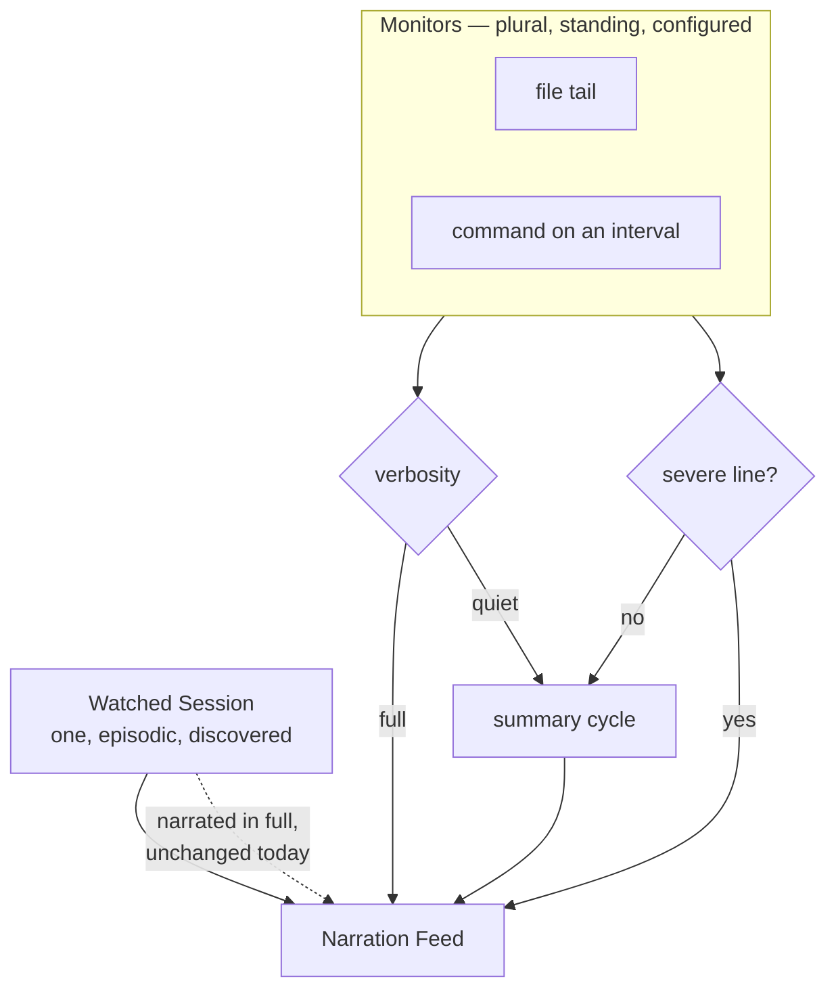

# Ambient log monitors

## Summary

Add the Monitor: a standing observation source pointed at a file path or a recurring command, running
alongside the Watched Session rather than replacing it. Monitors are plural and each is either quiet
— a periodic summary that interrupts immediately on a severe line — or narrated in full. HAL ships a
curated per-OS list of what is worth watching.

## Problem Frame

HAL observes exactly one thing. `WatcherRegistry` documents the rule in its own source — *"At most
one: the feed narrates a single session at a time"* — and enforces it by detaching one adapter before
attaching another. The assumption runs the full depth of the pipeline: `Coalescer` keeps a single
pending queue stamped with one adapter per drain, and `NarrationPane` renders the session picker
instead of the feed whenever nothing is attached.

That is the right shape for a coding session and the wrong one for a machine. A coding session is
episodic and every turn is interesting. A machine log is standing and almost every line is boring;
its value is the exception.

Two facts about the target platforms shape what is buildable. The logs that carry machine health are
not text files: on Windows they are the Application and System event logs (37,286 and 39,691 records
on the development machine), reachable only through `Get-WinEvent` or `wevtutil`; on systemd Linux
they are the journal, reachable through `journalctl`. The plain-text logs that *are* tailable on
Windows are servicing noise — `CBS.log` at 3.7 MB, `dism.log` at 17 MB. A file tail alone would not
deliver machine monitoring on either OS.

Nobody has established a practice here. The current answer to "what is wrong with this machine" is to
ask an agentic LLM or notice visually, and which logs are worth following is itself an open question.

## Key Decisions

**The Watched Session is untouched; Monitors are a second, distinct role.** The alternative was to
generalise the single watched session into a set of peer sources with one designated primary. That
gives one concept instead of two, but rewrites the invariant end to end and forces every existing
single-session behaviour — gap handling, sticky model, restore-on-restart, the picker — to be
re-answered in plural. The two things differ in kind, not degree, so they are modelled as two roles.

**Monitors carry a verbosity setting rather than being categorically quiet.** Quiet is the default and
the point, but a Monitor pointed at a dev-server log is worth narrating in full while a system log
beside it stays quiet. Setting it per Monitor keeps behaviour explicit rather than making it depend on
whether a coding session happens to be attached.

**A severe line interrupts its cycle but never takes over.** Waiting a full summary cycle to mention
a failing service defeats the purpose. Promoting that Monitor to primary would let a noisy log seize
attention repeatedly, so it speaks and stays where it is.

**Monitors are configured, not discovered.** A Session exists because another tool started working and
is found by looking. A Monitor exists because the user named a path or a command. It carries no
project identity and does not appear in the session picker.

**Two acquisition modes, because one would not reach the logs that matter.** A Monitor either tails a
file or runs a command on an interval and treats new output as events. Running a user-specified
command on a schedule is a sharper tool than reading a file; it is accepted deliberately, because it is
the only route to the Event Log and the journal.

**Monitors need their own prompt.** The shipped narration prompt hardcodes a Claude Code tag glossary
— `[thinking]`, `[tool-result]`, tool targets — that is meaningless for a log line and would actively
mislead. The per-adapter prompt question deferred in
`docs/brainstorms/2026-08-06-editable-system-prompts-requirements.md` returns here as a requirement.

## How the two roles reach the feed

A severe line reaches the feed without waiting for the cycle, and without changing which source is
narrated in full.

## Key Flows

- F1. **Adding a Monitor.** **Trigger:** the user opens settings and adds a Monitor. They pick from the
  suggested list for their OS or supply their own path or command, set verbosity, and it begins
  observing from the present moment. No restart.
- F2. **A quiet Monitor's routine cycle.** **Trigger:** the cycle elapses with only routine lines seen.
  HAL contributes one summary entry to the feed covering the period, attributed to the Monitor.
- F3. **A severe line arrives.** **Trigger:** a Monitor sees a line matching the severity rule. HAL
  speaks immediately, out of cycle, and the Monitor's verbosity is unchanged afterwards.
- F4. **Coding session and Monitor together.** **Trigger:** a Watched Session is attached while
  Monitors run. The session narrates as it does today; Monitor entries appear in the same feed,
  distinguished by their Adapter's colour.

## Requirements

**The Monitor**

- R1. A Monitor observes either a file path or a command run on an interval, and is created by the
  user supplying one of those.
- R2. Monitors are plural — several run at once — and each is enabled and removed independently.
- R3. A Monitor observes from the present moment when it starts, never replaying history, matching how
  attaching to a Session already behaves.
- R4. A Monitor survives a restart and resumes at the present.
- R5. A Monitor whose target is unreadable — file gone, command failing — reports that in the feed in
  persona and keeps trying, rather than disappearing.
- R6. Configured commands are visible and editable wherever Monitors are managed, so what HAL is
  running on a schedule is never hidden.

**Attention and narration**

- R7. Each Monitor is set to quiet or narrated in full, independently of every other Monitor and of
  whether a Watched Session is attached.
- R8. A quiet Monitor contributes one summary entry per cycle covering that period's activity.
- R9. A quiet Monitor speaks immediately, out of cycle, when it sees a line the severity rule matches.
- R10. Interrupting never changes which source is narrated in full.
- R11. Severity is judged without calling the model, so a severe line is never queued behind chat or
  narration before it is recognised.
- R12. Monitors narrate from a different system prompt than the Watched Session, editable on the same
  terms as the prompts already shipped.

**Suggested logs**

- R13. HAL suggests logs worth watching for the current OS, and a suggestion can be turned into a
  Monitor without the user composing a path or command.
- R14. Suggestions cover both acquisition modes, including the Windows event logs and the systemd
  journal, which are reachable only by command.
- R15. A suggestion whose target is absent on this machine is shown as unavailable rather than offered
  and then failing.

**Coexistence with the Watched Session**

- R16. The Watched Session keeps its current behaviour exactly: one at a time, discovered, narrated in
  full.
- R17. Monitor entries and Session entries share one feed, distinguished by their Adapter's colour.
- R18. Monitors run whether or not a Watched Session is attached, and attaching or detaching a Session
  does not disturb them.

## Acceptance Examples

- AE1. **Covers R7, R18.** Given no Watched Session and one quiet Monitor, when routine lines arrive,
  HAL contributes summaries on the cycle and nothing else.
- AE2. **Covers R9, R10.** Given a quiet Monitor mid-cycle, when a severe line arrives, HAL speaks
  immediately and the Monitor is still quiet on the next cycle.
- AE3. **Covers R11.** Given chat is streaming, when a severe line arrives, it is recognised as severe
  without waiting for the model.
- AE4. **Covers R16, R17, R18.** Given a Watched Session and a quiet Monitor both running, when the
  agent works and the machine stays healthy, session narration is unaffected and Monitor entries are
  distinguishable by colour.
- AE5. **Covers R5.** Given a Monitor whose file is deleted, when the next poll runs, HAL reports the
  loss in persona and recovers on its own if the file returns.
- AE6. **Covers R15.** Given a suggestion for a log absent on this machine, when the user opens the
  suggested list, it is marked unavailable rather than addable.
- AE7. **Covers R12.** Given the Monitor prompt is edited, when a Monitor next speaks, it uses the new
  text and Session narration is unchanged.

## Scope Boundaries

- Promoting a Monitor to narrated-in-full automatically when something looks wrong. Verbosity is the
  user's setting.
- Model-based severity judgment. The rule must run without the model (R11), so it is pattern-level.
- Alerting outside the app — notifications, email, webhooks. HAL speaks in its feed.
- Generalising the Watched Session into a set of peer sources. Considered and rejected above.
- Historical search, retention, or querying of log content. HAL narrates the present.

## Dependencies / Assumptions

- The value of ambient monitoring is anticipated, not observed. No monitoring practice exists today
  and which logs matter is an open question — which is why the suggested list (R13–R15) is load-bearing
  rather than convenience.
- This is a large single increment. Nothing was cut because the pieces interlock: simultaneity needs
  the second role, sane narration needs a separate prompt, and the ambient value needs the severity
  interrupt. Planning should phase it internally.
- The provider queue is single-lane, so several Monitors set to full narration produce queueing lag
  rather than concurrent load. Lag is the failure mode to watch, not saturation.
- Severity as a pattern rule will be wrong in both directions. Accepted; the remedy is that it is cheap
  to change.
- Windows is the primary development OS, so a Windows-first suggested list is worth more than a
  balanced one.

## Outstanding Questions

**Deferred to planning**

- What the severity rule matches, and whether it is per Monitor or global.
- The default cycle length for a quiet Monitor, and whether the user sets it.
- How much of a command's output counts as "new" between runs, given a command re-emits rather than
  appending like a file.
- How Monitor entries are visually distinguished from Session entries beyond Adapter colour, given
  summaries and interrupts read differently from narration.
- Whether the existing event shape generalises to a raw log line or needs a parallel one — the current
  shape names coding-agent concepts that a log line has none of.

## Sources / Research

- `server/src/watchers/registry.ts` — the at-most-one rule and the detach-before-attach behaviour.
- `server/src/watchers/watcher.ts` — the watcher seam, and the coding-agent-shaped event and session
  types a Monitor does not fit.
- `server/src/narration/coalescer.ts` — one pending queue, one adapter stamped per drain.
- `ui/src/components/NarrationPane.tsx` — the feed is gated on a single watched session.
- `CONCEPTS.md` — Watched Session, Adapter, Session Event, Narration Entry.
- `AGENTS.md` — "codex/generic watchers" listed under the deferred roadmap.
- `docs/brainstorms/2026-08-06-editable-system-prompts-requirements.md` — the per-adapter prompt
  question deferred there and required here.
- Development machine probe: `CBS.log` 3.7 MB and `dism.log` 17 MB are tailable but noise;
  `%LOCALAPPDATA%\Ollama\server.log` 1.9 MB is tailable and useful; Application and System event logs
  hold 37,286 and 39,691 records and are not text files.
