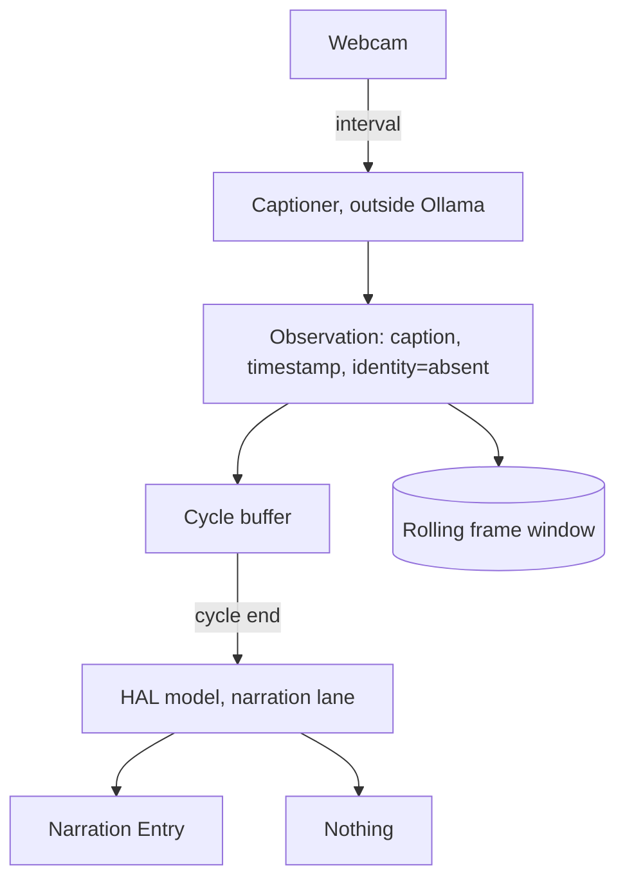

# Vision (webcam observation)

## Summary

Add Vision: a third observation role that captures the webcam on a fixed interval and narrates into
the same feed as the Watched Session and Monitors. A local captioner running outside Ollama turns
each frame into a structured observation; at the end of a cycle the HAL model turns the accumulated
observations into one Narration Entry, or into nothing when the cycle was unremarkable. Face
recognition is deferred, and the observation shape is cut so it slots in later as a second producer
rather than a subsystem.

## Problem Frame

The third section already exists as an empty frame. `ui/src/components/WebcamPane.tsx` ships a
titled, deliberately dead box and states the standing rule in its own source: nothing touches a
device until it is decided what watching a webcam means here — a third observation role alongside the
Watched Session and Monitors, or something else. The layout was built and lived with first so that
question could be answered on its own. This brief answers it.

Two facts about the machine constrain what is buildable. One local GPU already holds two tenants —
the chat model and the narration model — behind a single-lane queue where chat preempts narration.
The budget that matters is the target laptop's roughly 6GB, not the development machine's 12GB: a
captioner sized to what fits here would not ship. A captioner inside Ollama would be a third tenant
on the same card, and Ollama
evicts and reloads on every switch, so a standing capture loop would spend most of its interval
swapping weights rather than looking. The observation itself does not need HAL's model: describing a
frame and speaking about it are different jobs.

The second fact is that a camera is not a log. A Monitor stays quiet because a cycle with no new
lines produces nothing; a camera produces a full description every time it is asked, and the default
state of the scene is a person sitting still. Whatever keeps Vision quiet has to be built, not
inherited.

## Key Decisions

**Vision is a third role, not a Monitor pointed at a camera.** The Monitor contract is close —
standing, configured rather than discovered, quiet by default, running whether or not a Session is
attached — and Vision borrows its verbosity vocabulary directly. It is not the same thing, because a
Monitor's quiet default is a property of its source and Vision has to manufacture its own silence.
Modelling a camera as a `MonitorSource` variant would put that difference inside a union that
currently holds two interchangeable members.

**The captioner runs outside Ollama, and by default off the GPU entirely.** It never enters
`ProviderQueue`, never competes for the card with chat or narration, and Chat Preemption is unchanged
because Vision's only queued work is its cycle summary, which is an ordinary narration job. The cost
is a second local runtime with its own install, its own failure modes, and its own readiness leg.
Because a cycle is minutes long, that runtime does not need the GPU: placement is a dial from fully
offloaded to fully on CPU, and the free end still captions in under twenty seconds. Defaulting to CPU
removes the VRAM contest rather than winning it, and pays for the larger model that tells the truth.

**The captioner is treated as fallible.** It invents states and miscounts objects, and the HAL model
sees only its text — narration cannot audit what it did not observe. Vision's prompt therefore
constrains HAL to the observation rather than elaborating on it, which is the same guardrail
narration already carries against inventing agent activity, applied one stage earlier.

**Two stages, split by job.** The captioner produces details — what is in the frame, as structure.
The HAL model produces voice. Neither does the other's work, which is what keeps the captioner
swappable and the persona in one place.

**A fixed interval with no change gate.** A gate that compares frames before invoking the captioner
would make compute track events rather than clock ticks, and it was considered and dropped. The
repetition it prevents is a hypothesis, and the interval is a cheaper dial to turn than a sensitivity
threshold with its own two-sided failure mode. The gate stays a seam: observations are per-capture
and timestamped, so a gate can be inserted ahead of the captioner later without changing what the
summariser consumes.

**The summariser decides what was worth saying, at a sensitivity the user sets.** Captions accumulate
through the cycle and the HAL model is told how readily to speak. At the top of the scale it always
produces an entry; lower down it returns nothing unless the cycle held something worth remarking on.
This replaces a Monitor's structural silence with a dial rather than a rule, because where the line
sits is a matter of taste and only the person watching can place it. It costs one model call per
cycle either way, so the interval remains the cost dial.

**Face recognition is deferred, with the seam cut now.** An observation carries an identity field
that starts absent, filled later by a recogniser standing beside the captioner rather than replacing
it. Enrolment, a face gallery, and the embedding runtime are later work; nothing in v1 may make
identity harder to add, and nothing in v1 may pretend to have it.

## Key Flows

- F1. A cycle worth speaking about
  - **Trigger:** Vision is enabled and its interval elapses.
  - **Steps:** A frame is captured and handed to the captioner; the captioner returns an observation;
    the observation joins the cycle buffer and its frame joins the rolling window. At cycle end the
    buffer goes to the HAL model on the narration lane.
  - **Outcome:** One Narration Entry attributed to Vision appears in the feed. The buffer clears.
  - **Covered by:** R1, R2, R6, R7, R11

- F2. A cycle not worth speaking about
  - **Trigger:** As F1, but the cycle's observations describe an unchanged scene.
  - **Steps:** The summariser runs and returns nothing.
  - **Outcome:** No feed entry. The buffer clears and the next cycle begins.
  - **Covered by:** R7, R8

- F3. The user sends a chat message mid-cycle
  - **Trigger:** A chat request arrives while a Vision summary is in flight.
  - **Steps:** Chat Preemption applies unchanged — the summary is aborted and its buffer re-queued.
    Capture and the captioner are unaffected, because neither is on the queue.
  - **Outcome:** Chat answers immediately; the cycle's observations are summarised after.
  - **Covered by:** R3, R9

- F4. The captioner or camera is unavailable
  - **Trigger:** Vision is enabled but the captioner cannot be reached, or the camera is in use by
    another application.
  - **Steps:** The readiness leg reports the fault and the pane states it plainly. No capture is
    attempted until it clears.
  - **Outcome:** No Narration Entry of any kind. HAL does not remark on its own blindness.
  - **Covered by:** R16, R17

## Requirements

**The observation loop**

- R1. Vision captures a single frame on a fixed interval and hands it to the captioner.
- R2. Each capture produces one observation carrying at minimum a caption, a capture timestamp, and
  an identity field that is absent in v1.
- R3. Capture and captioning never enter `ProviderQueue` and never load a model into the
  Ollama-managed GPU allocation.
- R4. Vision runs whether or not a Session is attached, and attaching or detaching a Session does not
  disturb it.
- R5. The capture interval is user-configurable, with a default measured in minutes rather than
  seconds.

**What HAL says**

- R6. Observations accumulate for one cycle and are summarised together, not narrated per capture.
- R7. The summariser may return nothing, and nothing produces no feed entry.
- R23. A user-set sensitivity governs how readily the summariser speaks, with a setting at the top of
  the scale that always produces an entry.
- R8. A cycle that produces no entry leaves no trace in the feed — no placeholder, no all-clear.
- R9. The cycle summary is an ordinary narration job on the existing queue, so chat preempts it and
  an aborted summary re-queues its buffer rather than losing it.
- R10. Vision has its own System Prompt, defaulting the same way the narration and Monitor prompts do:
  one setting, tracking the shipped default while unedited, resettable.
- R11. Narration Entries from Vision are attributed to it, distinctly from Session commentary and
  Monitor output.
- R12. Vision carries a verbosity setting using the Monitor vocabulary — quiet summarises the cycle,
  full narrates each capture as it arrives.
- R22. Narration adds no detail the observation does not contain, and states what the captioner
  reported rather than asserting it as fact.

**Frames and retention**

- R13. Captured frames persist on a bounded rolling window so an entry can be traced to what produced
  it, and the window is user-configurable.
- R14. Disabling Vision purges the retained frames.

**Settings, readiness, and consent**

- R15. Vision is off by default and touches no device until it is explicitly enabled.
- R16. The captioner's availability appears as its own readiness leg alongside ollama, models, and
  claude code logs.
- R17. An unavailable captioner or camera produces no Narration Entry — the fault is reported through
  readiness and the pane only.
- R18. Vision has its own settings group, separate from session observation and log monitors, carrying
  the interval, verbosity, retention window, prompt, and enablement.
- R19. Every Vision behaviour is reachable through the WS protocol, not the UI alone.

**Seams for deferred work**

- R20. Observations are per-capture and independently timestamped, so a change gate can be added ahead
  of the captioner later without changing what the summariser consumes.
- R21. The identity field exists in the observation shape from v1 and is absent rather than omitted,
  so face recognition adds a producer rather than a field.

## Acceptance Examples

- AE1. Silence on a still scene
  - **Covers R7, R8.**
  - **Given:** Vision is enabled at a five-minute interval and the user has been sitting still.
  - **When:** the cycle ends and the summariser runs.
  - **Then:** no Narration Entry appears, and the feed is indistinguishable from one where Vision is
    off.

- AE2. Chat outranks the summary
  - **Covers R3, R9.**
  - **Given:** a Vision cycle summary is streaming.
  - **When:** the user sends a chat message.
  - **Then:** the summary aborts, chat answers immediately, and the cycle's observations are
    summarised after chat completes. Captures during the interruption continue normally.

- AE3. Enabling is the first device access
  - **Covers R15.**
  - **Given:** a fresh install with Vision never enabled.
  - **When:** the user opens the app and the webcam section.
  - **Then:** no camera permission is requested and no capture occurs.

- AE4. Turning it off leaves nothing behind
  - **Covers R14.**
  - **Given:** Vision has been running long enough to fill its rolling window.
  - **When:** the user disables it.
  - **Then:** capture stops and the retained frames are gone.

- AE5. A missing captioner is quiet
  - **Covers R17.**
  - **Given:** Vision is enabled and the captioner is not running.
  - **When:** an interval elapses.
  - **Then:** the readiness leg reports the fault and the pane states it, and no Narration Entry is
    produced.

## Scope Boundaries

**Deferred for later**

- Face recognition: enrolment, a face gallery, the embedding runtime, and identity in narration.
  R21 keeps the field waiting for it.
- A change gate ahead of the captioner, on frames or on captions. R20 keeps the insertion point open.
- Correlated narration — HAL reasoning across Vision, the Watched Session, and Monitors together
  rather than narrating each separately. This is the most valuable next layer and the most expensive:
  it needs cross-source provenance on a shared timeline and a narration prompt that can relate
  sources without inventing a relationship.

**Not planned**

- Video or continuous streaming, audio capture, and gesture input.
- More than one camera.
- Any remote or cloud vision service. The captioner is local or the feature is off.

## Measured Constraints

Taken on the development machine (RTX 3060, 12GB) with prebuilt llama.cpp CUDA binaries, captioning
one 1280x720 webcam frame. Footprints are the delta over an idle baseline.

**Placement is a dial, and every setting is fast enough.** Qwen2.5-VL-3B-Instruct Q4_K_M:

| Placement | GPU footprint | Encode | Generate |
|---|---|---|---|
| Fully offloaded | 3.6GB | 3.7s | 0.2s |
| Language model on CPU, projector on GPU | 1.6GB | 5.7s | 1.6s |
| Fully on CPU | 0.2GB | 17.4s | 1.5s |

Against an interval measured in minutes, even the slowest placement is ample. The 6GB budget that
motivated keeping the captioner out of Ollama does not have to be spent at all — which removes the
constraint rather than merely satisfying it, and makes the larger, more accurate model affordable on
the target laptop.

Context is not a dial: 2048 rather than 4096 saved 74MB. The excess over the 2.65GB of weights is
vision compute buffers. SmolVLM2-2.2B-Instruct sits at 2.5GB fully offloaded and encodes in 0.5s.

**The captioner is unreliable in ways narration cannot detect, and size does not predict which way.**
On one frame of a stationary, unlit ceiling fan, SmolVLM2-2.2B read the state correctly but ignored a
direct question about whether a person was present. Qwen2.5-VL-3B answered the question but reported
the fan as illuminated and its blades as spinning, and counted the five blades as three, four, and
five across three runs. The smaller model was the accurate one on state; the larger followed
instructions. The HAL model receives text alone and cannot tell an invented detail from an observed
one.

## Dependencies / Assumptions

- The captioner is llama.cpp's prebuilt CUDA build serving a small VLM. No compilation and no Python:
  this machine runs Python 3.14, which most inference wheels do not ship for. `llama-server` exposes
  an OpenAI-compatible endpoint, which is the sidecar contract.
- `llama-server` defaults to permissive CORS and no API key. It must be bound to loopback and treated
  as untrusted by the harness, in line with the binding rules in `AGENTS.md`.
- Frame capture needs no new dependency on Windows: ffmpeg with the DirectShow input grabs a single
  frame. The camera on this machine requires the `mjpeg` codec for 720p — its raw `yuyv422` modes top
  out below that.
- A webcam is an exclusive device on Windows. The first capture attempt failed because the Windows
  Camera app held it, which makes R17 a routine path rather than an edge case.
- `providers/ollama.ts` does not currently send images and does not need to — the HAL model receives
  text observations, never a frame.
- The single-lane queue, Chat Preemption, and the Sticky Model rule are unchanged by this feature.
- The repetition problem is a hypothesis. Shipping without a change gate is the experiment that
  settles it, and a long default interval is the mitigation until it does.

## Outstanding Questions

**Deferred to planning**

- Whether either captioner describes a person at a desk usefully. Both were measured against a scene
  with no person in it, so instruction-following and honesty are known but person-description is not.
- Whether constraining the captioner to a schema fixes the instruction-following failure, given
  llama.cpp can enforce one.
- Whether the captioner is a long-running process HAL supervises or one HAL merely talks to. It is
  currently one HAL talks to, which is the gap between "works" and "works after you start two
  things".
- Whether the retention window should also expire by age. It is bounded by count today, so its span
  in time moves with the interval.

## Sources

- `ui/src/components/WebcamPane.tsx` — the placeholder and the standing rule against device access.
- `docs/brainstorms/2026-08-06-collapsible-three-section-layout-requirements.md` — the frame this
  fills, and the explicit deferral of what a webcam section means.
- `docs/brainstorms/2026-08-06-ambient-log-monitors-requirements.md` — the second observation role,
  and the reasoning for modelling a new role rather than generalising an existing one.
- `server/src/providers/queue.ts` — the single lane and Chat Preemption.
- `server/src/monitors/` — the standing, configured, interval-driven observation pattern this borrows
  verbosity from.
- `CONCEPTS.md` — Watched Session, Monitor, Monitor Verbosity, Chat Preemption, System Prompt.
