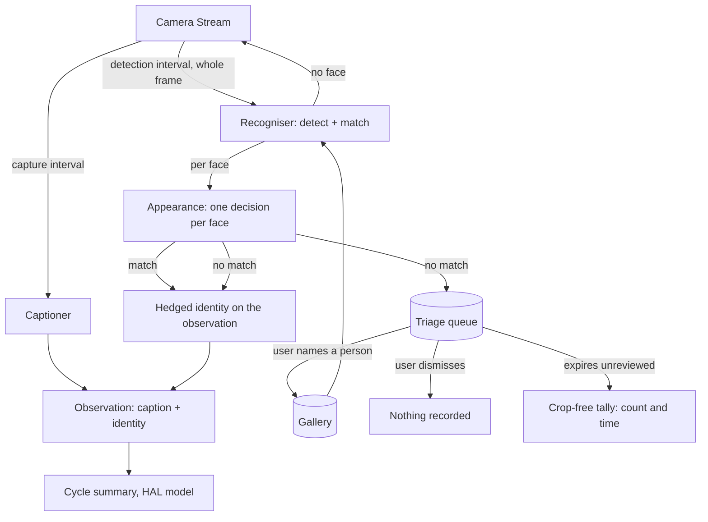

# Vision face recognition

## Summary

Add optional face recognition to Vision, answering one question about each face it sees: someone the
user named, or a potential stranger. A recogniser runs as a separate local process addressed by a
URL, so it can sit on this machine or another one. Unrecognised faces reach the narration feed and a
persistent triage queue; naming one from the queue is what enrols that person, so recognition
improves by being used rather than through an up-front ceremony.

## Problem Frame

Vision describes a scene but cannot tell one person from another. Every human in front of the camera
is "a person at the desk", which is enough for a room-describer and not enough for the thing the user
wants: telling coworkers, friends and family apart from strangers.

What the flag buys in v1 is retrospective rather than immediate. HAL does not alert, and a feed entry
is subject to the sensitivity dial, so the outcome the requirements are judged against is this: at
the end of a session the user can look at the queue and see whether anyone HAL did not know was in
front of the camera, and turn the ones who should be known into named people. Acting on a stranger in
the moment is a different product and is out of scope.

That review only works if the record is honest in both directions. An unreviewed appearance that
expires must leave a trace, or an empty queue reads as a quiet week when it was a missed one; and a
face matched wrongly above the threshold must still be reviewable, or a stranger is reported as
nobody. R14 and R25 exist for those two failures.

The seam for this was cut in the webcam brief. `VisionObservation` carries `identity` as present-and-null
(its R21), `server/src/vision/service.ts` already prefixes a non-null identity onto the caption line
handed to the summariser, and `ui/src/components/WebcamPane.tsx` renders an identity span. What is
missing is a producer, a place to keep enrolled faces, and a way to resolve a face HAL does not know.

Two facts from the shipped feature constrain this one. The captioner is unreliable in a specific way
— `docs/residual-review-findings/feat-vision.md` records it inventing object counts that the
summariser then narrated as events that never happened, and prompt-level mitigation was tried and
demonstrably failed. So a recogniser must not add a second source of confident invention, this time
about people. And Vision captures on a minutes-scale interval with no change gate, which suits
describing a room and does not suit noticing someone who walks through.

## Key Decisions

**Known-or-stranger is the unit of value; a name is the bonus.** The feature answers a category
question first. This is closer to a Monitor's Severity Interrupt than to personalised narration, and
it means v1 is useful with a single enrolled face rather than needing a populated roster.

**Enrolment is the triage loop, not a separate flow.** An unrecognised face becomes a queue item.
Resolving it by naming a person adds that face to the person's set, so the same person stops being
flagged; recognition accretes through use. Vision already holds a camera and retains frames, so
enrolment reuses what the feature produces rather than adding a capture surface of its own.

**Dismissal teaches HAL nothing.** Marking a detection as a stranger clears the queue item and
records no face. The cost is accepted: a recurring visitor who is never enrolled is flagged every
time. The benefit is the privacy line — HAL holds biometric data only for people the user
deliberately named, and someone who merely walked past leaves no lasting trace. That line does not
rest on the user working the queue: a pending item expires on its own, so neglect empties the queue
rather than turning it into the gallery of unnamed people this brief refuses to build. Expiry leaves
a crop-free tally behind, because a guarantee that deletes the evidence silently trades one failure
for another.

**The recogniser is a separate process addressed by a URL.** HAL ships the recogniser but never
launches or supervises it, exactly as it points at the captioner and at Ollama. The URL is what makes
"run it on this machine" and "run it on the GPU box" the same code path, and it keeps one mental
model for a local model server HAL talks to. The cost is that a fresh install now has a third thing
to start.

**That process is HAL's own Node sidecar, not a third-party server.** No off-the-shelf face
recogniser ships as a build-free cross-platform binary: every mature option is a container
(CompreFace, InsightFace-REST) or is Linux-only and detection-only. But `onnxruntime-node` publishes
prebuilt CPU binaries for Windows, Linux and macOS on x64 and arm64, so a small Node process clears
R33's portability bar by construction — HAL is already Node, and `npm install` is the entire build
step. The sidecar is its own workspace package, so `server/` keeps its single runtime dependency and
stays free of native modules.

**The models are YuNet and SFace, chosen for licence as much as for accuracy.** Both come from the
OpenCV Zoo under Apache 2.0 and both are small enough to commit, so there is nothing to download and
nothing that can fail on first run. The stronger pairing — SCRFD and ArcFace, shipped as `buffalo_l`
— was rejected because InsightFace releases its code under MIT but its pretrained weights for
non-commercial research only, which would put a licence question inside anything HAL distributes.
Matching against faces the user enrolled is one-to-few, not one-to-million, and SFace is sufficient
for that.

**Detection runs on its own interval, faster than captioning, and inside the recogniser.** Face
detection is milliseconds where captioning is tens of seconds, so watching for faces at a short
cadence costs little and catches people the capture interval would miss. HAL posts the current frame
and the recogniser answers with faces or none, which keeps the server free of a native inference
dependency and leaves one artifact carrying the portability bar rather than two. Recognition runs
only when detection finds a face. This gate sits ahead of recognition, not ahead of the captioner —
captioning keeps its own interval, so the seam the webcam brief's R20 reserved stays open rather than
being spent here.

The cost of that placement is what crosses the boundary: whole camera frames on the detection
cadence, not face crops. Everything in the room goes, including people who are not enrolled and never
will be. Locally that is a loopback write; pointed at another machine it is closer to streaming the
room than to sending a face, which is why R10 and R11 govern the frame rather than the face.

**An appearance, not a detection, is the unit — and it is per face.** Detection fires every few
seconds; a person stays in frame for minutes. Consecutive detections of the same face collapse into
one appearance carrying one identity decision and one queue item. Two people in frame are two
appearances, so a stranger standing beside an enrolled person is still queued. Without this the queue
fills with a hundred crops of a single visit, and identity flickers between matched and unmatched
across a cycle — which the summariser reads as arrivals and departures, reproducing against people
the fabricated-event defect `docs/residual-review-findings/feat-vision.md` records against the
captioner.

The gap that ends an appearance has a two-sided cost and no value satisfies both sides. Too short and
one visit refragments whenever a face turns away, restoring the flood and the flicker. Too long and a
departure merges with a different person's arrival, so the second person inherits the first's
identity and is never queued. The default errs short: a duplicate queue item is a nuisance the user
clears, while a missed stranger is the failure the feature exists to prevent.

**Identity attributes rather than asserts, and does so in the input.** A false match names the wrong
human, which is worse than a miscounted cup. The hedge is applied by the server as it builds the
caption line, in one shipped form rather than at each caller's discretion, so the summariser never
receives a bare name it could state as fact. A prompt rule telling narration to hedge is the lever
this project has already measured failing three times, and it fails hardest on the small local model
that writes the cycle summary. Because a model can still flatten a hedge, the guarantee is checked on
what the model produces, not only on what it was given.

**Biometric data outlives the Vision toggle.** This narrows the webcam brief's R14. Switching Vision
off still releases the camera and drops the rolling frame window; the gallery and the pending queue
survive, because a triage queue that empties whenever the feature is toggled cannot be triaged.
"Leaves nothing behind" becomes a control the user invokes rather than a side effect.

## Actors

- A1. The user — enrols people, triages unrecognised faces, and deletes what HAL holds.
- A2. HAL — posts frames, owns appearance continuity, narrates, and maintains the queue.
- A3. The recogniser — a local process HAL points at, which finds faces in a frame and turns each one
  into a comparable representation, returning per-face data with every response. It tracks nothing
  between calls.
- A4. An unenrolled person — appears in frame, is flagged, and is either named or forgotten. Never a
  participant, and never a party that consented.

## Key Flows

- F1. A known person is recognised
  - **Trigger:** Detection finds a face and the recogniser matches it to an enrolled person above the
    confidence threshold.
  - **Steps:** The appearance resolves to that identity once. The identity is attached to the
    observation for that period and travels with the caption into the cycle summary in its hedged
    form.
  - **Outcome:** HAL can speak about the person in narration. No pending item is created, but the
    appearance remains reviewable so a false match is not invisible.
  - **Covered by:** R3, R4, R9, R23, R25

- F2. An unrecognised face appears
  - **Trigger:** Detection finds a face and no enrolled person matches.
  - **Steps:** One pending item is created for the appearance, holding the face crop and the time. The
    observation carries the unrecognised state into the cycle summary, where sensitivity governs
    whether HAL speaks.
  - **Outcome:** A pending item exists regardless of what the feed did. A feed entry appears if
    sensitivity allows it.
  - **Covered by:** R4, R12, R13, R21, R22

- F3. The user names a queue item
  - **Trigger:** The user assigns a pending item to an existing person, or creates a person from it.
  - **Steps:** The face joins that person's set in the gallery and the item leaves the queue.
  - **Outcome:** The same person is recognised on subsequent appearances, and matching for that
    person improves with each addition.
  - **Covered by:** R16, R17

- F4. The user dismisses a queue item
  - **Trigger:** The user marks a pending item as a stranger and confirms.
  - **Steps:** The item and its face crop are deleted. No representation is retained.
  - **Outcome:** The queue shrinks. The same person appearing later is flagged again.
  - **Covered by:** R18, R19, R29

- F5. The recogniser is absent, unreachable, or too slow
  - **Trigger:** Recognition is enabled but the recogniser cannot be reached, or cannot answer fast
    enough to sustain the configured cadence.
  - **Steps:** The condition surfaces through readiness and the pane, distinguishing absent from slow.
    In-flight detections are skipped rather than queued; capture, captioning and the cycle summary run
    unchanged.
  - **Outcome:** Vision behaves exactly as it does today. No Narration Entry mentions the fault, and
    nothing is flagged.
  - **Covered by:** R6, R7, R8, R29

- F6. The user deletes what HAL holds
  - **Trigger:** The user deletes a person, clears the queue, or invokes the full purge — or a pending
    item reaches its expiry unattended.
  - **Steps:** The named records and their face crops are removed. An expiry additionally leaves a
    crop-free tally entry.
  - **Outcome:** Deleted faces stop being recognised immediately; a purged person's future
    appearances are flagged as unrecognised.
  - **Covered by:** R14, R26, R27, R28

## Requirements

**Recognition and the recogniser**

- R1. Recognition is optional and off until enabled. Its toggle is separate from Vision's but
  subordinate to it: recognition never causes camera access on its own and does nothing while Vision
  is off. Vision with recognition off behaves exactly as it does today.
- R2. The recogniser is a separate process HAL addresses by a configured URL and never starts,
  supervises, or stops.
- R3. Recognition runs only on frames where detection found a face.
- R4. Appearances are per face, not per frame: two people in frame produce two appearances and two
  identity states. Consecutive detections of the same face collapse into one appearance carrying one
  identity decision and one queue item for the observation period.
- R5. HAL owns appearance continuity. It holds the in-flight appearance's face data for the duration
  of that appearance only and discards it when the appearance ends, unless a pending item has already
  captured it.
- R6. The recogniser's availability appears as its own readiness leg, alongside ollama, models, claude
  code logs, and the captioner.
- R7. An unreachable recogniser degrades Vision to its current behaviour rather than disabling it, and
  produces no Narration Entry about the fault.
- R8. A detection still in flight when the next interval elapses is skipped rather than queued, and a
  recogniser too slow to sustain the configured cadence is surfaced as its own condition, distinct
  from unreachable.
- R9. A match below the configured confidence threshold is treated as unrecognised, never as a guess
  at the nearest person.
- R10. The recogniser URL defaults to a loopback address. Pointing it at a non-loopback host takes an
  explicit acknowledgement separate from typing the URL, and that acknowledgement names what actually
  leaves the machine: whole camera frames on the detection cadence, including people who are not
  enrolled.
- R11. Every frame HAL sends to a recogniser — for detection as much as for matching — reaches a
  non-loopback host only over an encrypted, authenticated channel.

**The triage loop**

- R12. An unrecognised appearance creates one pending queue item holding the face crop and the time it
  was seen.
- R13. The queue is persistent and survives both a restart and Vision being switched off.
- R14. A pending item expires after a stated age, defaulting to days rather than hours so it outlives
  an ordinary review gap. Expiry deletes the crop and leaves a crop-free tally — how many appearances
  expired unreviewed, and when — so an empty queue is never mistaken for a quiet one.
- R15. A pending item shows its age, and expiry is visible rather than silent: an item close to
  expiring is distinguishable from a fresh one.
- R16. Assigning a pending item to a person adds that face to the person's set; a person accumulates
  faces rather than being defined by one.
- R17. A person can be created directly from a pending item, so the first enrolment needs no separate
  flow.
- R18. Dismissing a pending item deletes it and its crop, and records nothing about the face.
- R19. Dismissal is a distinct, confirmed action, separated from naming so that neither is reachable
  by a misclick meant for the other.
- R20. The gallery holds many people from the first release, whatever number are enrolled.
- R21. The queue is bounded, and the bound is stated to the user rather than silently discarding.

**Narration**

- R22. An unrecognised appearance does not bypass Vision Sensitivity or the cycle timer. The queue, not
  the feed, is the discovery path — complete for items reviewed inside the expiry window, and a tally
  beyond it.
- R23. The caption line handed to the summariser never carries a bare name. The server renders identity
  in one shipped hedged form rather than at each caller's discretion, and the guarantee is verified on
  the entry the model produces, not only on the line it was given.
- R24. The match confidence behind a named identity is visible to the user. Correcting a wrong match
  clears the identity and returns that appearance to unrecognised as a pending item; the feed and the
  pane act on the same record. Narration already written is not revised — a correction applies from
  that point on.
- R25. Matched appearances are reviewable alongside pending ones, carrying identity, confidence, and
  time, so an above-threshold false match is visible to an end-of-session review rather than invisible.

**Retention, consent, and deletion**

- R26. Switching Vision off releases the camera and purges the rolling frame window, and leaves the
  gallery and the pending queue intact.
- R27. Deleting a person removes that person and every face held for them.
- R28. A single control purges everything biometric — gallery, queue, and crops — behind an explicit
  confirmation stating how many people, faces, and pending items will be lost. It is the replacement
  for the guarantee that switching Vision off used to carry.
- R29. HAL retains no face representation for anyone who is not enrolled. A representation computed to
  attempt a match is discarded once the match fails, beyond the in-flight appearance R5 allows and the
  pending item that a dismissal or an expiry deletes. What the recogniser process itself keeps is
  outside HAL's control and is a selection criterion on the artifact instead.

**Settings and protocol**

- R30. The interval between recognition attempts is a user setting, separate from the capture interval
  and the cycle length.
- R31. Recognition's settings live in Vision's existing settings group: enablement, recogniser URL,
  detection interval, confidence threshold, and pending-item expiry.
- R32. Every recognition behaviour — enrol, assign, dismiss, correct, delete, purge, list — is
  reachable through the WS protocol, not the UI alone.
- R33. The recogniser and any models it needs work on Windows and Linux at parity, with macOS
  reachable on the same shape.

## Acceptance Examples

- AE1. A stranger at low sensitivity
  - **Covers R22, R12.**
  - **Given:** recognition is on with one person enrolled, and Vision Sensitivity is at its quietest.
  - **When:** an unrecognised face is detected and the cycle ends without HAL speaking.
  - **Then:** no Narration Entry appears, and a pending queue item for that face exists.

- AE2. Naming stops the flagging
  - **Covers R16.**
  - **Given:** a pending item for a face seen yesterday.
  - **When:** the user assigns it to a person and that person appears again.
  - **Then:** the appearance is recognised and creates no new queue item.

- AE3. Dismissal leaves nothing
  - **Covers R18, R29.**
  - **Given:** a pending item for someone who walked past.
  - **When:** the user dismisses it.
  - **Then:** the item and its crop are gone, and the same person appearing tomorrow is flagged again
    as unrecognised.

- AE4. The toggle no longer purges everything
  - **Covers R26.**
  - **Given:** an enrolled person and two pending items.
  - **When:** the user switches Vision off and on again.
  - **Then:** the rolling frame window is empty, and the person and both pending items are still
    there.

- AE5. A missing recogniser is quiet
  - **Covers R7.**
  - **Given:** recognition is enabled and the recogniser is not running.
  - **When:** an interval elapses.
  - **Then:** readiness reports the fault, captions and cycle summaries continue unchanged, and no
    Narration Entry mentions recognition.

- AE6. An uncertain match is not a name
  - **Covers R9, R23.**
  - **Given:** a face that matches an enrolled person below the confidence threshold.
  - **When:** the cycle is summarised.
  - **Then:** HAL does not name that person, and the face is treated as unrecognised.

- AE7. Neither the summariser's input nor its output carries a bare name
  - **Covers R23.**
  - **Given:** recognition matched an enrolled person above the threshold.
  - **When:** the cycle is summarised.
  - **Then:** the line handed to the model carries the shipped hedged form rather than the name alone,
    and the Narration Entry the model produces does not state the name unqualified.

- AE8. One visit is one queue item
  - **Covers R4, R12.**
  - **Given:** an unenrolled person stays in frame across many detection intervals.
  - **When:** they leave and the cycle ends.
  - **Then:** the queue holds one pending item for the visit, and the cycle summary saw one identity
    state rather than an alternating sequence.

- AE9. Two people are two appearances
  - **Covers R4.**
  - **Given:** an enrolled person and an unenrolled person are in frame together.
  - **When:** detection runs.
  - **Then:** the enrolled person is recognised and the unenrolled one produces a pending item; the
    two do not collapse into a single appearance.

- AE10. A different person inside the gap window is not the same appearance
  - **Covers R4, R5.**
  - **Given:** one person leaves frame and a different person enters before the appearance gap
    elapses.
  - **When:** detection runs on the second person.
  - **Then:** a new appearance begins with its own identity decision, and the second person does not
    inherit the first's identity.

- AE11. An untriaged item does not persist forever, and does not vanish without trace
  - **Covers R14, R29.**
  - **Given:** a pending item the user never triages.
  - **When:** its expiry elapses.
  - **Then:** the item and its crop are deleted exactly as a dismissal would have deleted them, and a
    crop-free tally records that an appearance expired unreviewed and when.

## Measured Constraints

Taken on the development machine (Windows 10, Node 22.13, onnxruntime-node CPU) against the Logitech
C310 — the same camera the captioner's caption-variance defect was measured on. YuNet 2023mar and
SFace 2021dec from the OpenCV Zoo, 20 iterations each after a warm-up run.

| Stage | Mean | p50 | p95 |
|---|---|---|---|
| Detection (640x640) | 2.2ms | 2.0ms | 4.4ms |
| Embedding (112x112) | 5.3ms | 4.9ms | 12.1ms |
| Total per detected face | 7.5ms | — | — |

Detection found the face at score 0.93 and the crop was confirmed by eye to be a correctly framed
face. Cosine similarity was 0.92 between two independent captures of the same person, 0.35 against an
off-target crop beside the face, and 0.13 against a background patch — a wide enough margin to show
the embedding discriminates rather than returning a near-constant vector.

Three consequences for the requirements. A face costs single-digit milliseconds, so R30's
seconds-scale cadence is affordable by roughly three orders of magnitude and R8's too-slow condition
is about a remote or contended recogniser rather than a local one. YuNet's export takes a fixed
640x640 input, so detection cost does not scale with camera resolution — the frame is letterboxed on
the way in and the cost is constant. And `onnxruntime-node` installs at about 259MB, which is the real
weight of the sidecar; the two models add 38MB, of which SFace is 37MB.

Two limits on what this measured. Faces were cropped by bounding box rather than warped by the five
landmarks SFace expects, so accuracy here is a floor rather than a ceiling. And only one person was
available, so same-person-versus-different-person discrimination — the thing R9's threshold actually
has to get right — is still untested.

## Dependencies / Assumptions

- Detection is assumed cheap enough to run at a seconds-scale cadence on CPU without contending with
  chat or narration. R30 makes the cadence adjustable partly as insurance against this.
- Detection reads from the single camera stream that Vision already holds. No second consumer opens
  the device.
- One enrolled face is the starting state. Matching against a single identity is a materially easier
  accuracy problem than matching across a roster, and the roster grows through F3.
- The value of a one-face v1 assumes a room with a small, stable population. Where most faces are
  one-off visitors, "potential stranger" is the near-constant answer and carries little information.

## Scope Boundaries

**Deferred for later**

- Naming a full roster of coworkers, friends and family. The gallery supports it from R20; v1 is used
  with one entry.
- Folding the provider, captioner, and recogniser URLs into a shared notion of named inference
  targets. Recognition gets its own field, shaped so the consolidation is mechanical later.
- HAL supervising any of the local model processes. Whether HAL should start the captioner is already
  open in `docs/residual-review-findings/feat-vision.md`; the recogniser inherits that question rather
  than answering it.
- Detection-gated captioning. Detection gates recognition only; captioning keeps its own interval and
  continues to describe empty rooms and views.

**Outside this product's identity**

- A gallery of unrecognised people. Remembering faces nobody named would solve the repeat-visitor
  nuisance and would mean HAL holding biometric data for people who never agreed to it.
- Any remote or cloud recognition service. The recogniser is a process the user runs, on this machine
  or one of theirs.
- Inferring age, gender, emotion, or attention from a face. The question is who, not what kind of
  person.
- Alerting, alarms, or escalation on a stranger. HAL remarks and queues; it does not act.

## Outstanding Questions

**Resolve before planning**

- None. The artifact question and its measurement are both closed — see Key Decisions and Measured
  Constraints. Statelessness and no on-disk caching come free by building the sidecar rather than
  adopting one, which is what R29's guarantee about unenrolled people needed.

**Deferred to planning**

- How long a gap between detections ends one appearance and starts the next, given the two-sided cost
  stated in Key Decisions.
- Whether the face is warped by SFace's five-landmark template before embedding, rather than cropped
  by bounding box as the spike did. YuNet already returns the landmarks; the spike's numbers are a
  floor without the warp.
- Where R9's confidence threshold actually sits. The spike could not test same-person against
  different-person, so the threshold has no empirical basis yet and needs a second face to calibrate
  against.
- What a detection response carries per face — a bounding box, or a comparable representation. This
  decides whether R5's continuity and R29's no-retention rule can both hold, and is coupled to the gap
  question above.
- What the shipped hedged form of an identity claim is, and whether it belongs in
  `shared/src/prompts.ts` as a constant so it can be tested against the summariser's output.
- Whether the face crop kept for a pending item is stored separately from the rolling frame window or
  as a reference into it. R26 requires the crop to survive a purge of that window, and
  `server/src/vision/frames.ts` clears that window from three paths, not one.
- Whether recognition's confidence threshold is a raw number or a small named scale, as Vision
  Sensitivity is, and whether it carries a floor.
- How a person's accumulated faces are compared — nearest single face, or an aggregate — and whether
  that choice is visible to the user at all.
- Whether the detection interval and the capture interval need a stated relationship, or are
  independent settings that happen to both exist.

## Sources / Research

- `docs/brainstorms/2026-08-06-webcam-observation-requirements.md` — the parent brief. Its R14
  (purge on toggle), R20 (change gate seam), and R21 (identity field seam) are the three requirements
  this work touches directly.
- `docs/residual-review-findings/feat-vision.md` — records the captioner's fabricated detail and the
  resulting invented narration, which is why R9 and R23 exist. Also holds the open question about HAL
  supervising the captioner.
- `server/src/vision/service.ts` — the capture loop, the generation guard around teardown, and the
  existing identity prefix on the summariser's input lines. Its two-second reconcile tick is a
  practical floor on R30's interval, and its `cameraSource()` null-while-off behaviour is the consent
  rule R1 defers to.
- `server/src/vision/stream.ts` and `server/src/vision/capture.ts` — the single-owner camera stream
  detection must read from, and the per-platform device enumeration that sets the portability bar for
  R33.
- `server/src/vision/captioner.ts` — the HTTP-model-client shape the recogniser follows, including its
  deliberate split between slow and missing that R8 mirrors.
- `shared/src/vision.ts` — the pattern for shipping setup instructions for a process HAL points at
  but does not start, rendered from one constant rather than duplicated into the UI.
- ONNX Runtime's Node guide (onnxruntime.ai/docs/get-started/with-javascript/node.html) — the
  prebuilt-binary matrix that makes a Node sidecar portable across all three targets with no compiler.
- OpenCV Zoo (github.com/opencv/opencv_zoo) — YuNet and SFace in ONNX under Apache 2.0. Contrast
  deepinsight/insightface, whose code is MIT but whose pretrained weights are non-commercial research
  only; that restriction is why `buffalo_l` was not chosen.
- `server/src/origin.ts` and `docs/solutions/loopback-binding-is-not-an-origin-check.md` — the trust
  boundary R10 and R11 extend to a second endpoint, and why loopback binding alone is not one.
- `docs/solutions/exclusive-device-one-owner-many-consumers.md` and
  `docs/solutions/an-instruction-that-fights-its-own-input-loses.md` — the device-sharing rule
  detection inherits, and why R23 shapes the input rather than adding another prompt rule.

## Deferred / Open Questions

### From 2026-08-07 review

- **Queue bound voids the discovery guarantee R22 rests on** — R21 / R22 (P1, adversarial, design-lens, confidence 100)

  R22 deliberately withholds strangers from the feed on the grounds that the queue guarantees the user
  finds out, and R21 then makes the queue bounded. Once the bound is reached, a face is either not
  queued or an older one is dropped, and in both cases the user never learns about someone the feature
  exists to flag. Stating that the queue is full tells them the queue is full; it does not tell them
  who they missed. The overflow behaviour itself is unspecified — reject-and-block, evict-oldest, and
  pause-detection are three materially different outcomes with no basis in the document for choosing.

- **Where the triage queue lives in the UI** — Key Decisions / F2 (P1, design-lens, confidence 75)

  The queue is the feature's core interaction surface, but the document never says where the user
  encounters it: inside the Vision pane, as a separate pane, a modal, or a badge elsewhere. A builder
  cannot determine whether it competes for space with the live camera feed, whether it is always
  visible or opened on demand, or how a user who is not looking at Vision learns that items are
  waiting. This decides whether the feature is discoverable at all.

- **Whether one-shot enrolment removes the need for a queue in v1** — Key Decisions / Requirements (P2, product-lens, confidence 75)

  The triage queue is the largest new surface in the brief — persistence, bounding, assign, dismiss,
  delete, purge, WS coverage, and a UI to work it — and it exists mainly to avoid an up-front
  enrolment ceremony. With one enrolled face as the starting state, that ceremony is a single "this is
  me" capture from a frame Vision already holds. Shipping recognition against one enrolled person with
  the unrecognised state carried on the observation would remove roughly half the requirements while
  leaving the stated v1 value unchanged.

- **Whether multi-person matching belongs in v1 or defers with the roster** — R20 / Scope Boundaries (P2, scope-guardian, confidence 75)

  R20 requires the gallery to hold many people from the first release, so matching, disambiguation and
  storage must be built and validated for an arbitrary roster now — while the stated v1 goal is one
  enrolled face answering a binary question, and the Dependencies section itself calls single-identity
  matching the materially easier problem. The scope boundary deferring the roster therefore defers only
  populating the gallery, not the engineering behind it. Those paths also stay unexercised until a
  second person is enrolled, so the harder problem ships untested.

- **Biometric mutation over WS rests on the outstanding per-boot token** — R32 (P2, security-lens, confidence 75)

  The WS hub's missing per-boot token is an accepted residual for controlling HAL generally, but R32
  routes enrol, assign, dismiss, correct, delete and purge of a new biometric data class through that
  same unauthenticated channel. Anything able to reach the hub could create, rename, or permanently
  erase a person's identity records rather than merely trigger narration — a materially larger
  consequence than the original gap covered. Planning should treat the outstanding token fix as a
  prerequisite for shipping biometric mutation over WS rather than an independently deferrable item.

- **What the room's actual population is, and what counts as v1 succeeding** — Dependencies (P2, product-lens, confidence 75)

  The value band for a one-face v1 is narrow: enough churn that the queue ever holds anything, little
  enough that enrolment converges. In a genuinely small, stable room the enrolled face plus a few
  enrolments cover everyone and the end-of-session queue is empty essentially always — which is
  indistinguishable from the feature not working. Without a rough sense of how many distinct people
  appear in a week and how many are unknown, there is no basis for judging whether v1 succeeded or
  whether the recogniser process, the queue, and the purge controls were worth their standing cost.
  Name the observation that would count as success — for example, the queue holding at least one item
  the user chooses to name within the first weeks — so an empty queue reads as a verdict rather than as
  normal operation.
