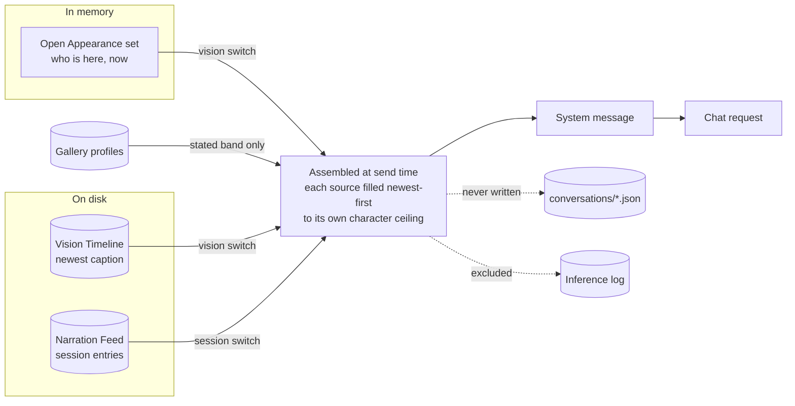

# Conversation context injection — vision and session observation

## Summary

Give every Conversation two independent switches — what HAL currently sees, and what it has been
narrating about observed Sessions — each with a character ceiling the user picks. HAL assembles the
chosen context at send time, fills each ceiling newest-first, and states what the bound left out.

## Problem Frame

Chat and Vision have never touched. `server/src/chat.ts` builds a request from a system message and
the thread's history with no awareness of the camera, the roster, or the narration feed, so a user
watching HAL's Vision pane describe the room cannot ask HAL about it. The want is direct: HAL should
see the user, or an area, and be able to talk about what is actually happening.

The obvious supply for that is the Narration Feed, and it is the wrong one on its own. Vision
narrates once per cycle — five minutes by default — and only when the sensitivity dial lets it
speak. At `medium` the instruction is to remark only on something worth a developer's attention, and
a cycle HAL says nothing about leaves no trace at all: no placeholder, no all-clear. Twenty quiet
minutes of work can therefore put **zero** vision entries in the feed. The feed is empty at exactly
the moment the user asks what HAL sees.

The Vision Timeline is never empty — a check every three seconds, a caption every sixty — but its
captions are the source a standing rule keeps out of conversations, because the captioner invents
object counts, and its checks are mostly `nobody found` and a bare confidence figure. Neither store
holds the thing that answers "what is happening now": the open Appearance set, which lives in memory
and is current to the last detection.

A second cost is invisible and arrives with any amount dial. Nothing in HAL sets `num_ctx`, so a
request takes the provider's default context. An entry count is not a unit anyone can convert into
that budget — a hundred narration entries is roughly thirty thousand characters — and past the
window the provider drops from the front, which is where the Conversation's own System Prompt sits.
A generous dial does not degrade; it silently deletes the user's instructions to HAL.

## Key Decisions

**Sight is the newest caption already on disk plus the live Appearance set, not a fresh capture.**
Captioning at send time would be genuinely current but adds seconds before the first token and a new
failure mode — a slow or absent Captioner while someone waits on a reply. The newest stored caption
is at most one capture interval old, the Appearance set is current to the last detection, and
neither costs anything. Freshness was traded for latency and for having no new way to fail.

**A level is named by its character ceiling.** The alternatives were a raw entry count and an opaque
named step. An entry count dials a unit that does not map to the constraint that bites; an opaque
step hides it. Naming the level by its ceiling makes the dial and the constraint the same number.
This is the third time this product has chosen discrete steps over a continuous slider — Vision
Sensitivity has four, Monitor Verbosity two — because the judgement being made is about kind and
cost, not about fine quantity.

**Raw captions reach a Conversation, carried as attribution rather than assertion.** This overrides
the standing rule that conversations receive narration entries and never raw captions. That rule
exists because the Captioner is unreliable, and the cycle summary was the filter; the Problem Frame
records why that filter cannot supply a live answer. The mitigation is placement, not a prompt rule:
the caption arrives quoted and timestamped as HAL's last look, in the same shape the Vision system
prompt already uses to attribute rather than assert. `docs/solutions/an-instruction-that-fights-its-own-input-loses.md`
records that shaping the input beats writing a rule against it.

**Context is assembled per request and never written to the Conversation.** Persisting it would put
profile text beyond the reach of per-person deletion and the biometric purge, and would freeze the
roster at the moment the thread was created so a rename never reached an open thread.

**The two switches are independent, and neither implies the other.** A user who wants HAL to see
them while they work does not necessarily want the coding-session commentary in the same request,
and the reverse holds. One combined switch would force a bundle neither half asked for.

**Session context follows the Watched Session, and nothing else.** Several Sessions are followed at
once, and a ceiling split across four of them follows none of them far enough to be a story. Scoping
to the one Session the user singled out buys depth, at the cost of a dependency between two controls
that are not next to each other: clearing the Watched Session empties the chat context. That cost is
paid by making the empty state visible on the switch rather than discoverable from HAL's reply — a
control that is on and sending nothing is worse than one that is noisy.

## Actors

- A1. **The user** — sets each switch and its ceiling per Conversation, and reads the cost of what
  they chose before sending.
- A2. **HAL** — receives the assembled context as part of its standing instruction and answers from
  it.
- A3. **The provider** — receives everything assembled. Whether it is on this machine governs the
  acknowledgement.

## Key Flows

- F1. **Asking what HAL sees, in a quiet room**
  - **Trigger:** The user sends a message in a Conversation with the vision switch on.
  - **Steps:** HAL reads the open Appearance set, takes the newest caption from the Vision Timeline,
    adds the profiles of anyone in the *stated* band, fills the vision ceiling newest-first, and
    sends. Nothing is written to the Conversation.
  - **Outcome:** HAL answers about the room even though the Narration Feed holds no vision entry for
    the last twenty minutes.
  - **Covered by:** R7, R8, R11, R12, R16

- F2. **Turning a switch on for the first time**
  - **Trigger:** The user turns on either switch in any Conversation.
  - **Steps:** HAL states what that switch will send and where it goes. If the provider in effect is
    not on this machine, the off-machine acknowledgement is required before the switch takes effect.
  - **Outcome:** The switch is on and the ceiling is set, or declining leaves it off and the request
    unchanged.
  - **Covered by:** R3, R17, R18, R19

- F3. **A ceiling that cannot hold the window**
  - **Trigger:** The chosen ceiling is smaller than the material available for that source.
  - **Steps:** HAL fills newest-first until the next item would exceed the ceiling, then stops and
    appends a note stating how many items were left out.
  - **Outcome:** The oldest material is dropped, the drop is visible to HAL and to the user's cost
    readout, and the Conversation's System Prompt is never the thing evicted.
  - **Covered by:** R5, R13, R14, R15

- F4. **Opening a thread that predates the feature**
  - **Trigger:** The user opens a Conversation created before this shipped.
  - **Steps:** Both switches read as off. The controls are present and settable.
  - **Outcome:** The request is byte-for-byte what it was, until the user changes it.
  - **Covered by:** R1, R2, R4

- F5. **Asking about the session being watched**
  - **Trigger:** The user sends a message in a Conversation with the session observation switch on.
  - **Steps:** HAL takes Narration Feed entries about the Watched Session, newest-first, to the
    session ceiling. With no Watched Session, nothing is taken and the control has already said so.
  - **Outcome:** HAL answers about the one Session the user singled out, or the user knew before
    sending that there was nothing to answer from.
  - **Covered by:** R6, R9, R9a, R10

## Requirements

**The controls**

- R1. Every Conversation carries two independent switches — vision context and session observation
  context — and each switch carries its own character ceiling.
- R2. The switches are present and settable on every Conversation, including ones created before this
  feature existed.
- R3. Both switches default off on every Conversation, new and existing, until the off-machine
  acknowledgement has been given once. After that, a settings-level default seeds newly created
  Conversations; changing that default never alters a thread already under way.
- R4. With both switches off, the chat request is unchanged from today, including a blank System
  Prompt sending no system message at all.
- R5. A ceiling is chosen from discrete levels named by the character count they permit, so the
  control and the constraint it governs are the same number. The shipped levels are 500, 2,000 and
  6,000 characters per source.
- R6. The controls show what the current setting will send before the user sends it — the character
  total and the item counts behind it.

**What is sent**

- R7. With the vision switch on, the context carries the open Appearance set as of the last
  detection, the newest caption from the Vision Timeline with its age, and the Character Profiles of
  anyone in the *stated* band.
- R8. The caption is carried as an attributed, timestamped report of HAL's last look, never as an
  assertion about the room.
- R9. With the session observation switch on, the context carries recent Narration Feed entries about
  the Watched Session only. Vision entries and Monitor entries are excluded — vision reaches a
  Conversation through its own switch, and Monitors are not a source here.
- R9a. With no Watched Session, the session segment is omitted, and the switch says so where the user
  can see it before sending. A control that is on and silently sending nothing is the failure this
  requirement exists to prevent.
- R10. Recognition check rows are never sent. They answer a question the Appearance set already
  answers, at a rate that would consume any ceiling with noise.
- R11. A source with nothing to contribute is omitted rather than sent empty, as the profile segment
  already is when no Operator is marked.
- R12. The Operator's Character Profile is delivered whenever the vision switch is on, whether or not
  they are currently in view. Who HAL is talking to is true with the camera off.

**Bounding, and saying what was lost**

- R13. Each source is filled newest-going-back until the next item would exceed its ceiling, then
  stops. Ceilings are per source and are not pooled.
- R14. What the ceiling excluded is stated in the assembled context rather than omitted in silence,
  following the rule the profile budget and the Candidate queue's eviction tally already follow.
- R15. Assembly is bounded such that it cannot displace the Conversation's own System Prompt.
- R16. Context is assembled for each request and never written to the Conversation record.

**Privacy**

- R17. Turning a switch on states what that switch will send and where it goes.
- R18. The acknowledgement that this data may leave the machine is gated on the provider in effect
  when a request is sent, not on the switch transition alone, so configuring a non-local provider
  afterwards cannot bypass it.
- R19. That acknowledgement names what leaves — enrolled names, Character Profiles, a record of who
  was in the room, and HAL's commentary on observed Sessions. Declining leaves both switches off and
  the request unchanged.
- R20. Character Profiles and assembled context are excluded from inference records, as the Vision
  system prompt already is.

**Reach**

- R21. Both switches and both ceilings are reachable through the WS protocol, not the UI alone.

## Acceptance Examples

- AE1. Vision switch on, Vision off entirely. No Appearance set, no caption, no vision segment — the
  request carries the session segment or nothing, and does not announce an empty camera. Covers R11.
- AE2. Vision switch on, Vision on, nobody in frame. The Appearance set is empty and says so; the
  newest caption still carries, with its age. An empty room is an observation. Covers R7, R11.
- AE3. Someone in view in the *hedged* band. Their reading is carried attributed and their Character
  Profile is withheld. Only a *stated* band unlocks a profile. Covers R7.
- AE4. Newest caption is four hours old because Vision was switched off overnight. Its age is stated
  alongside it, so HAL can weigh it rather than read it as current. Covers R7, R8.
- AE5. Session ceiling set to 500 characters with twelve recent entries available. Two entries send,
  and the context states that ten were left out. Covers R13, R14.
- AE6. Both switches on, both ceilings at maximum, and a long System Prompt. The System Prompt
  survives intact; the assembled context is what yields. Covers R15.
- AE7. Switch turned on while the provider is on this machine, then the provider endpoint is changed
  to a remote one. The next send requires the acknowledgement. Covers R18.
- AE8. A Conversation created before this feature, opened and sent with nothing changed. The request
  is identical to what it was. Covers R2, R4.
- AE9. Session switch on, four Sessions followed, none watched. No session segment sends, and the
  control says so before the user sends. Covers R9, R9a.
- AE10. Session switch on with a Watched Session set, and the user then clears it. The next send
  carries no session segment, and the control reflects that rather than the user discovering it from
  HAL's reply. Covers R9a.

## Scope Boundaries

**Deferred for later**

- Capturing and captioning a frame at send time. Rejected for this pass on latency and on adding a
  failure mode inside a chat turn; the decision is revisitable if a one-interval-old scene proves too
  stale in use.
- Monitors as a third context source. Not asked for, and the same shape would extend to them.
- Re-tuning the shipped ceiling levels against a real context window. The levels are discrete and
  changeable without a data migration.
- A band-aware check on HAL's chat replies. Narration gets one, but a chat reply streams token by
  token, so a post-hoc check cannot unsay what already rendered. The input gating carries it instead:
  only *stated* identities arrive as bare names. This is an accepted residual, not an oversight.

**Outside this product's identity**

- Recognition check rows in a Conversation. They are a measurement record, not an observation
  anybody reads.
- HAL deciding on its own how much context to take. The ceiling is the user's, for the same reason
  Vision Sensitivity is.
- Persisting assembled context into the Conversation. It would place profile text beyond deletion.

## Dependencies / Assumptions

- Assumes the provider drops from the front of the prompt on overflow. Nothing in HAL sets `num_ctx`,
  so the request takes the provider's default; the exact eviction order should be confirmed during
  planning, since R15 rests on it.
- Assumes a character count is a workable proxy for a token budget at this granularity. It is the
  unit the existing profile budget already spends in.
- Depends on the open Appearance set being readable outside the vision service, and on the newest
  Vision Timeline caption being readable as a bounded tail. Both stores already expose a
  recent-N read.
- The biometric purge and the exclusion of profile text from inference records are shipped. The
  off-machine acknowledgement is **not** — it remains on the deferred list, so R18 and R19 introduce
  it rather than extending it.

## Outstanding Questions

**Deferred to planning**

- Whether the "no Watched Session" state is surfaced in the cost readout, on the switch itself, or
  both. R9a requires it be visible before sending; where is a rendering choice.

- Whether the cost readout is live per keystroke or computed on open. Either satisfies R6.
- Where the two controls live relative to the existing per-Conversation System Prompt control.
- Whether the assembled context is one system message or is appended to the Conversation's own.

## Sources / Research

- `docs/plans/2026-08-08-001-feat-recognition-identity-and-profiles-plan.md` — Phase 4 (U13–U15), the
  paused vision-to-chat seam this brief supersedes and widens.
- `docs/brainstorms/2026-08-08-recognition-identity-and-character-profiles-requirements.md` — R25–R32,
  the original single-toggle identity context design. R28's ban on raw captions is the rule this
  brief overrides, with reasoning.
- `docs/residual-review-findings/feat-recognition-identity-and-profiles.md` — the three constraints
  established during that planning and explicitly recorded so they are not rediscovered.
- `docs/residual-review-findings/feat-vision.md` — the Captioner inventing object counts, which is why
  R8 attributes rather than asserts.
- `docs/solutions/an-instruction-that-fights-its-own-input-loses.md` — why R8 shapes placement instead
  of adding a prompt rule.
- `server/src/chat.ts` — request assembly today: a system message plus history, with no vision
  awareness. The seam R1 opens.
- `server/src/storage/observations.ts` and `server/src/vision/timeline.ts` — the two stores, each
  already exposing a bounded newest-first read.
- `server/src/vision/appearances.ts` — the open Appearance set and `currentMatch`, the only source of
  who is present right now.
- `server/src/vision/stream.ts` — the single camera stream and its latest frame, the affordance a
  deferred capture-at-send-time would use.
- `shared/src/prompts.ts` — the existing character-budget spend and its rule that what the bound
  dropped is stated rather than silently omitted. R14 follows it.
- `server/src/providers/ollama.ts` — `options` is passed through and `num_ctx` is never set, which is
  the basis for the Dependencies assumption.
- `CONCEPTS.md` — Vision Sensitivity, Identity Band, Character Profile, Operator, Vision Timeline,
  Narration Feed, Conversation.
