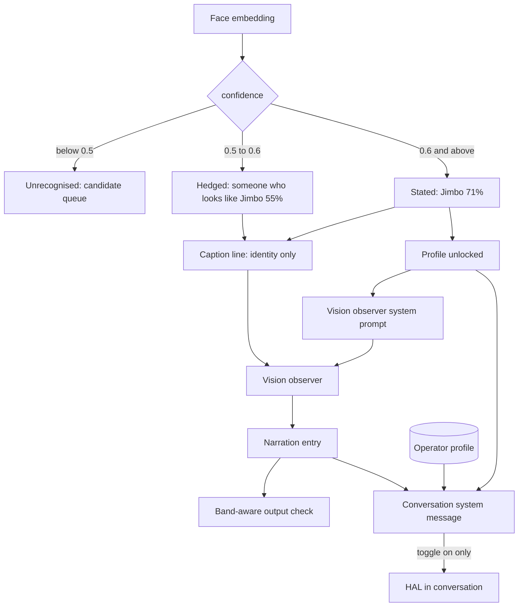

# Recognition identity and character profiles

## Summary

Replace the prose hedge on a recognised identity with a confidence-tiered statement — `Jimbo 71%`
above a second threshold, the hedge retained below it. Make the roster editable:
rename, prune a single face, enrol from a saved image. Give each person a character profile, mark one
as the operator, and deliver those profiles through the system prompt of whichever HAL role is
speaking — the vision observer always, and a conversation behind a toggle that also carries recent
vision narration.

## Problem Frame

HAL can tell who it is looking at and cannot say so. Every recognised identity is rendered
`someone who looks like Jimbo`, in the pane and in the line handed to the summariser, with the
percentage already present beside it. The hedge was built before the landmark warp landed, when a
real match could score as low as 0.61. The warp in `recogniser/src/warp.ts` has since shipped and two
people are now enrolled, so the phrasing hedges matches that are not marginal.

The deeper gap is that recognition produces a name and nothing else. HAL knows a face belongs to a
roster entry called Jimbo. It does not know that Jimbo is the person whose machine this is, or that
another face belongs to someone who matters, or why. The roster is a lookup table for a string.

That gap is load-bearing for where this is going: agents that see the user and talk to them.
`server/src/chat.ts` builds a conversation as a system message and a history, with no vision awareness
at all — the two subsystems have never touched. An agent that can see a face and cannot be told whose
it is has the recognition without the recognition's point.

Editing is missing for the same reason recognition was built enrolment-first. A name typed once is
permanent, a badly framed face is permanent, and enrolment reads only from the live camera. The cost
is already recorded: `docs/residual-review-findings/feat-enrolment-candidates.md` describes a roster
that reached `Steve x1, Steve x1, Liam x1, Liam x1, Liam x1` and a hand-run consolidation with a
backup file beside it, because nothing in the product could merge two records or drop one bad face.

Three observations would show this worked, and their absence would show it did not. No hand-run
consolidation of the roster is needed in the months after the editor ships. At least one narration
entry or reply uses profile context and is correct about who was present. And no narration entry
states a name for someone who was not there — the failure the tiering trades against.

## Key Decisions

**Identity states itself in three bands, not two.** Below the recognition threshold a face is
unrecognised and reaches the candidate queue. Between that threshold and a second, higher one, the
prose hedge stays. At or above the second, HAL states the bare name with its percentage.

**The statement threshold rests on field observation, not on the spike.** The often-quoted 0.93
same-person figure is not usable here: `docs/solutions/a-measurement-on-synthetic-variants-measures-your-own-transform.md`
records that it was measured over synthetic variants of a single frame and therefore measured the
embedder's invariance to rotation and scale. Genuinely independent captures of one person score 0.53
to 0.78, and a threshold set above that range would never fire.

What supports 0.6 is use rather than a spike. Two people are enrolled and running against each other
daily, and no cross-person false positive has been observed at the 0.5 recognition threshold — so
different-person similarity for that pair sits below 0.5, and 0.6 is above it with margin while
staying inside the range a real match reaches. This is an observation over one pair in one room, not
a measured ceiling, which is why both thresholds are settable and why the hedged band is retained
rather than removed.

**The percentage travels with the name into the model, not just onto the pane.** The pane has always
rendered the confidence; the summariser never saw it. Handing the number over makes the uncertainty
something HAL can speak about rather than something the server decides on its behalf.

**Both layers of the guarantee survive; only the form they enforce changes.** Identity is shaped on
the way in and checked on the way out. `enforceIdentityHedge` becomes band-aware rather than being
deleted: a bare enrolled name in the model's output is rewritten into whichever form its band
requires. Removing the output layer would leave the input shaping alone against a model that
reliably re-cases and re-words what it was handed.

**Profiles ride in the system prompt, never in the caption line.** The line the summariser reads is
built bare on purpose. `server/src/vision/service.ts:645` carries the finding: timestamps and ordinals
were both tried, both became the subject of the narration, and a prompt rule against that lost to the
label itself. A character profile is a richer label and would fail the same way, with HAL remarking on
someone's night shifts when all it saw was a person sitting down. The system prompt is a different
position — it is the frame observations are read through rather than a fact attached to one, which is
where `DEFAULT_VISION_PROMPT` already puts standing material.

This is the least-bad position, not a proof. The cited lesson is that anything supplied invites being
referred to, and a system prompt is still supplied — `shared/src/prompts.ts` records this very prompt
narrating its own rules back when it grew too long. So the position is a bet, and AE6 is what
falsifies it.

**The operator is a distinct concept from a roster entry with a profile.** Who HAL is talking to is
true with the camera off, with the recogniser down, and on the first message of a conversation. Who
else is in the room is situational and only true while they are in view. Collapsing the two would make
HAL's knowledge of its own operator contingent on a detection.

The nearer alternative is not a roster entry — it is the chat prompt the user can already edit, where
typing "you are speaking to Jimbo, who…" delivers standing context today with no new concept. The
operator earns its place on two counts the prompt field cannot cover: the same profile is read by the
vision observer as well as by chat, so the text is written once rather than kept in sync by hand; and
it is deleted by the biometric purge along with the person it describes, which text pasted into a
prompt is not. Where neither applies, the prompt field is the cheaper answer and this concept is not
worth its cost.

**A conversation opts in, and opting out is byte-for-byte silence.** `shared/src/prompts.ts` makes a
blank chat prompt send no system message at all, preserving pre-prompt behaviour exactly. A toggle
keeps that intact by construction: off means the request is unchanged, so the guarantee needs no
narrowing.

**Chat receives narration, not captions.** The captions come from the small vision model that
`docs/residual-review-findings/feat-vision.md` records inventing object counts, and the cycle summary
exists to filter it. Feeding raw captions into a conversation routes around the filter and hands HAL
its own unreliable source to reason over.

## Actors

- A1. The user — edits the roster, writes profiles, marks the operator, and decides which
  conversations can see any of it.
- A2. The vision observer — HAL narrating a cycle, reading bare caption lines through a system prompt
  that names who the stated identities are.
- A3. HAL in conversation — with the toggle on, knows who it is speaking to and who else is present.
- A4. A person on the roster who is not the operator — described, and surfaced only while in view.

## Key Flows

- F1. A confident match is stated
  - **Trigger:** A face matches an enrolled person at or above the statement threshold.
  - **Steps:** The identity is rendered as name and percentage in the pane and in the caption line.
    That person's profile is added to the vision observer's system prompt for the cycle.
  - **Outcome:** HAL names the person and can speak about them with the context the profile carries.
  - **Covered by:** R1, R4, R19, R20, R21

- F2. A marginal match is hedged
  - **Trigger:** A face matches between the recognition and statement thresholds.
  - **Steps:** The identity is rendered in the prose hedged form with its percentage. No profile is
    contributed.
  - **Outcome:** HAL attributes rather than asserts, and does not narrate a biography behind a
    maybe.
  - **Covered by:** R1, R5, R6, R21

- F3. The user renames a person onto an existing name
  - **Trigger:** A rename whose new name already belongs to another roster entry.
  - **Steps:** The two records merge, accumulating both face sets.
  - **Outcome:** One record with more faces, matching that person better than either did alone.
  - **Covered by:** R9, R10

- F4. The user enrols from a saved image
  - **Trigger:** The user offers an image file for an existing person or a new one.
  - **Steps:** The image is checked for exactly one detectable face; the face joins that person.
  - **Outcome:** A roster entry improves without waiting for the person to sit in front of the camera.
  - **Covered by:** R13, R14, R16

- F5. A conversation is given sight
  - **Trigger:** The user switches the identity-context toggle on for a conversation.
  - **Steps:** What will be sent is stated first, including its destination. With a non-local provider
    in effect, a separate acknowledgement names what leaves the machine, and declining it leaves the
    toggle off. From then on the conversation's system message carries the operator's profile, the
    stated identities in view with their profiles, and a bounded window of recent vision narration.
  - **Outcome:** HAL knows who it is talking to and what it has seen recently.
  - **Covered by:** R25, R27, R28, R29, R30, R31, R32

- F6. The user prunes a person's only face
  - **Trigger:** A face removal that would leave the person with none.
  - **Steps:** The removal is refused, and deleting the person is offered instead.
  - **Outcome:** No roster entry exists that can never match again.
  - **Covered by:** R11, R12, R15

## Requirements

**Stating an identity**

- R1. Identity resolves in three bands: unrecognised below the recognition threshold, hedged between
  the two thresholds, stated as a bare name at or above the statement threshold.
- R2. Both thresholds are user settings in the Vision settings panel, defaulting to 0.5 for
  recognition and 0.6 for statement.
- R3. The two thresholds keep a minimum separation, so no setting can empty the hedged band, and the
  statement threshold carries a floor below which it cannot be set at all.
- R4. A stated identity carries its confidence as a percentage wherever it appears — the pane, the
  caption line handed to the summariser, and the narration entry.
- R5. Where one person's confidence crosses a threshold during a cycle, the lowest band observed
  governs the form used for that person, so a name is never stated on the strength of its best frame.
- R6. The guarantee is checked on what the model produces as well as what it was given: a bare
  enrolled name in a narration entry is rewritten into the form its band requires.
- R7. The output check runs against the whole roster, not only the names matched during the cycle, and
  a name with no live band is rewritten into the hedged form. Over-hedging a name HAL did not see is
  the accepted cost, as over-hedging an ordinary word already is.
- R8. The output check is idempotent: a name already carrying its band's form is left as the model
  wrote it.

**Editing the roster**

- R9. A person can be renamed.
- R10. Renaming onto a name already on the roster merges the two records, matching enrolment's
  name-first behaviour. A rename that resolves to the record being renamed — a change of
  capitalisation or spacing — changes the stored spelling and merges nothing.
- R10a. A merge states its direction before it happens, as enrolment's existing hint does. It keeps
  the surviving record's id, concatenates faces without duplicating one already held, keeps both
  profiles by joining them, and keeps the operator marking if either record carried it.
- R11. A single face can be removed from a person, deleting its stored image.
- R12. Removing a person's last face is refused, and deleting the person is offered in its place.
- R13. A face can be added to a person from a pre-saved image file.
- R14. An image offered for enrolment is accepted only when exactly one face is detected in it.
- R15. A refusal or rejection surfaces at the point of the action with its reason, and where an
  alternative exists it is offered there rather than left to be found.
- R16. Roster editing works with Vision switched off, which places it outside the Vision pane — every
  control there is gated on Vision and recognition both being enabled.

**Character profiles and the operator**

- R17. A person carries a character profile: free text describing who they are and why they matter.
- R18. At most one person is marked as the operator, and marking a second moves the mark.
- R19. Profiles reach a model through a system prompt and never through the caption line.
- R20. The vision observer's system prompt carries the profiles of the people whose identity was
  stated during that cycle, and is sent even when the user has blanked the vision prompt.
- R21. Profile delivery is gated at the statement threshold: a hedged match contributes its name and
  confidence and no profile.
- R22. The operator's profile is standing context, present whether or not Vision is running and
  whether or not the camera has seen anyone.
- R23. A profile is bounded in length. The bound is enforced when the profile is saved, stating the
  limit rather than silently truncating what the user wrote.
- R24. The total profile text in one system prompt is bounded across all people, independent of R23's
  per-profile bound, and what the bound dropped is stated rather than silently omitted.

**Identity context in conversation**

- R25. A conversation carries a toggle governing whether it receives identity context. It is set when
  the conversation is created — on for new ones, off for any that existed before this feature — so a
  thread started under the old contract is never silently changed.
- R26. With the toggle off, the chat request is unchanged from today, including a blank prompt sending
  no system message at all.
- R27. With the toggle on, the conversation's system message carries the operator's profile, the
  stated identities currently in view with their profiles, and recent vision narration. With no
  operator marked, that segment is omitted rather than sent empty, as the narration segment is
  omitted while Vision is off.
- R27a. Identity context is assembled for each request and never written to the conversation record.
  Persisting it would put profile text beyond the reach of R33 and freeze the roster at the moment the
  thread was created.
- R28. Conversations receive narration entries, never raw captions.
- R28a. HAL's chat replies carry the same band check as narration entries. Without it a conversation
  states the operator's name on the strength of standing context alone, which is the failure AE4
  exists to prevent, arriving through the other surface.
- R29. The vision narration carried into a conversation is bounded to a recent window rather than the
  whole feed.
- R30. Switching the toggle on states what will be sent and where it goes.
- R31. The acknowledgement that identity data leaves the machine is gated on the provider in effect
  when a request is sent, not on the toggle transition alone, so configuring a non-local provider
  after the fact cannot bypass it.
- R32. That acknowledgement names what leaves — enrolled names, character profiles, and a record of
  who was in the room. Declining it leaves the toggle off and the request unchanged.

**Retention and deletion**

- R33. Deleting a person removes their profile along with their faces.
- R34. The biometric purge removes profiles and the operator marking, and its confirmation counts
  profiles alongside people and faces.
- R35. Profiles and the operator marking survive the Vision toggle, as the gallery does.

**Prerequisites**

- R38. The WS hub requires a per-boot token before any handler runs. It is generated at startup and
  written to the data dir so a protocol client can read it, and injected into the served UI. Requests
  carrying no Origin stay accepted, so agent parity survives the change.
- R39. A single control purges everything biometric — gallery, candidate queue, crops, profiles, and
  the operator marking — behind a confirmation stating how many people, faces, profiles, and pending
  items will be lost. This is the control R34 amends, and it does not exist yet.
- R40. Profile text is excluded from inference records. The log holds every prompt verbatim and is
  never pruned by design, so a profile written there would outlive R33 and R34 — a deletion that
  leaves the text on disk is not the deletion those requirements promise.

**Protocol**

- R36. Every behaviour here — rename, merge, remove a face, add a face from an image, set a profile,
  set the operator, set a conversation's toggle — is reachable over the WS protocol.
- R37. The per-boot WS token is a prerequisite for the profile and operator write paths. Character
  profiles describe named third parties who never consented, and shipping them as mutable over an
  unauthenticated hub widens an accepted residual onto a data class it was never weighed against.

## Acceptance Examples

- AE1. The bands are three, not two
  - **Covers R1, R4.**
  - **Given:** thresholds at 0.5 and 0.6.
  - **When:** three faces match at 0.44, 0.55 and 0.71.
  - **Then:** the first is unrecognised and queued, the second reads `someone who looks like Jimbo 55%`,
    and the third reads `Jimbo 71%`.

- AE2. A maybe does not carry a biography
  - **Covers R21.**
  - **Given:** Jimbo has a character profile and matches at 0.55.
  - **When:** the cycle is summarised.
  - **Then:** the vision observer's system prompt contains no profile for Jimbo.

- AE3. The output check follows the band
  - **Covers R6.**
  - **Given:** a hedged-band match whose name the model wrote bare.
  - **When:** the narration entry is recorded.
  - **Then:** the name carries the hedged form, and a stated-band name written bare carries its
    percentage instead.

- AE4. A name HAL never saw is not stated
  - **Covers R7.**
  - **Given:** an operator whose profile is standing context, and a cycle in which no face matched.
  - **When:** the model writes the operator's name into the narration entry.
  - **Then:** the name is rewritten into the hedged form rather than stated.

- AE5. The best frame does not decide the band
  - **Covers R5.**
  - **Given:** one person whose confidence reads 0.55 on one detection and 0.74 on another in the same
    cycle.
  - **When:** the cycle is summarised.
  - **Then:** the hedged form governs, and no profile is contributed.

- AE6. A profile is not an observation
  - **Covers R19, R20.**
  - **Given:** a stated identity whose profile describes facts not visible in the frame, and captions
    that mention none of them.
  - **When:** the cycle is summarised.
  - **Then:** the narration entry reports only what the captions carried and asserts no profile detail
    as something HAL saw.

- AE7. A rename that collides merges
  - **Covers R10.**
  - **Given:** two records, one with three faces named Steve and one with two named Steven.
  - **When:** the second is renamed to Steve.
  - **Then:** one record named Steve holds five faces.

- AE8. The last face cannot be pruned away
  - **Covers R12, R15.**
  - **Given:** a person holding one face.
  - **When:** the user removes it.
  - **Then:** the removal is refused and deleting the person is offered.

- AE9. A crowded photo is refused
  - **Covers R14, R15.**
  - **Given:** an image containing two faces.
  - **When:** it is offered for enrolment.
  - **Then:** it is rejected, and no face is added.

- AE10. The toggle off is silence
  - **Covers R26.**
  - **Given:** a conversation with a blank system prompt, an operator set, and the toggle off.
  - **When:** the user sends a message.
  - **Then:** the request carries no system message.

- AE11. The operator is known before the camera is
  - **Covers R22.**
  - **Given:** an operator with a profile, Vision switched off, and a conversation with the toggle on.
  - **When:** the user sends the first message.
  - **Then:** the system message carries the operator's profile.

- AE12. A purge takes the writing with the faces
  - **Covers R34.**
  - **Given:** three people with profiles, one of them the operator.
  - **When:** the user invokes the biometric purge.
  - **Then:** the confirmation states three profiles will be lost, and afterwards no profile or
    operator marking remains.

## Dependencies / Assumptions

- Same-person similarity across genuinely independent captures is 0.53 to 0.78. The 0.93 figure in
  `docs/residual-review-findings/feat-recognition-loop.md` was measured over synthetic variants of one
  frame and must not be used to place a threshold.
- Different-person similarity has still never been measured. What stands in for it is field
  observation: two enrolled people, in daily use, with no cross-person false positive seen at 0.5.
  That bounds the risk for one pair in one room and is not a ceiling.
- The 0.6 default is therefore provisional. A third enrolled person, or a genuine lookalike, is the
  event that would invalidate it, and the setting is where that gets corrected.
- This changes the direction the recogniser was tuned to fail in. The shipped 0.5 was chosen because
  "does not know you" beat "calls you by someone else's name"; a statement band accepts the second
  failure in exchange for the first, on a roster small enough that the user knows who is in the room.
- The configured provider is local — `server/src/providers/` holds only Ollama. R31 and R32 are
  therefore unexercisable at ship time and first run when a cloud provider lands.
- A profile is written by the user, not pasted from an untrusted source. Free text placed in a system
  prompt is an instruction surface, and nothing here validates it.

## Scope Boundaries

**Sequencing**

Four slices, in order. Slice 0 is prerequisite work this feature inherited rather than created; the
three after it are useful alone, and nothing later is a prerequisite for anything earlier.

0. **Prerequisites** (R38–R40). The per-boot WS token, the biometric purge, and the inference-log
   exclusion. None of the three exists today, and the token has been deferred by three prior features
   — this one adds a data class those deferrals were never weighed against.
1. **Bands and roster editing** (R1–R16). The strand with recorded cost, and the one that touches only
   code recognition already owns.
2. **Profiles and the operator** (R17–R24, R33–R37). Gated on slice 0. Adds the data class and delivers it to the vision
   observer.
3. **Identity context in conversation** (R25–R32). The only slice touching a subsystem that has never
   been vision-aware, and the only one carrying the off-machine exposure. If it slips, the first two
   still ship.

**Deferred for later**

- Structured profile fields — relationship, role, importance as separate values. Free text first; the
  structure can be extracted later if the text turns out to have a consistent shape.
- Profiles for the candidate queue. A face nobody named holds no description, which follows the
  existing line against a gallery of unrecognised people.
- Re-measuring the thresholds against a populated roster. Both are settable so the defaults can be
  corrected without a release, and the measurement needs a second person rather than more code.

**Outside this product's identity**

- Raw captions in a conversation. The cycle summary is the filter, and bypassing it hands HAL its own
  unreliable source.
- Profiles in the caption line, under any prompt-level mitigation. This is the lever measured failing
  three times.
- Inferring a profile from a face. The user writes it, or it does not exist.

## Outstanding Questions

**Resolve before planning**

- None.

**Deferred to planning**

- Where the roster editor lives — inside the Vision pane, a settings section, or its own surface. The
  prior brief left the same question open for the candidate queue and it is still open.
- How the vision-narration window carried into a conversation is bounded: by entry count, by age, or
  by the cycle boundary.
- Whether identity context is assembled per message or once per conversation, given that a
  conversation's system prompt is currently a copy taken at creation.
- Whether merging on rename needs a confirmation, given that it is irreversible and the colliding name
  may have been a typo.
- Whether a merge dedupes faces, since concatenating two records' face arrays keeps a face enrolled
  twice under two spellings twice over.
- Which record's id survives a merge, and what happens to the operator marking when both participants
  carry one — R18 allows at most one, and a merge can violate it with no user action.
- What the minimum separation in R3 is, and where the statement threshold's floor sits.
- Whether the chat identity context is read from the in-memory observation feed or from the persisted
  log, given the operator profile must work on the first message after a restart.
- How an image offered for enrolment reaches the recogniser, and whether it reuses the detection
  endpoint the live path already posts frames to.
- Whether the operator marking belongs on the person record or in settings as a reference to one.
- How an image reaching the recogniser is transcoded, given the sidecar accepts `image/jpeg` only.

## Sources / Research

- `docs/brainstorms/2026-08-07-vision-face-recognition-requirements.md` — the parent brief. Its R23
  (the hedge), R24 (visible confidence), R16 (a person accumulates faces) and R28 (the purge) are the
  four this work changes directly.
- `shared/src/prompts.ts` — `HEDGE_PREFIX`, `hedgedIdentity`, and `enforceIdentityHedge`, plus the
  comment recording why the hedge is applied to input rather than requested in a prompt. Also
  `DEFAULT_CHAT_PROMPT` and the blank-prompt behaviour R21 preserves.
- `server/src/vision/service.ts` — `identityFor` builds the identity string, and the comment above the
  caption-line assembly records the timestamp and ordinal experiments that make R19 necessary.
- `server/src/chat.ts` — the conversation request shape, which today is a system message and a history
  with no vision awareness. The seam R25 opens.
- `server/src/vision/people.ts` — `PeopleStore`, its per-store write lock, and `enrolByName`'s
  name-first merge that R10 extends to rename.
- `server/test/narration/hedge.test.ts` — the twelve cases locking in the current output enforcement,
  including the capitalisation and word-boundary failures a band-aware rewrite must not reintroduce.
- `docs/residual-review-findings/feat-enrolment-candidates.md` — the duplicate-record history and the
  hand-run consolidation, which is the cost the roster editor pays back.
- `docs/residual-review-findings/feat-vision.md` — the captioner inventing object counts, which is why
  a conversation receives narration entries rather than raw captions.
- `docs/residual-review-findings/feat-recognition-loop.md` — the 0.5 default chosen to fail toward
  "does not know you", and the record that different-person similarity has never been tested. Its
  0.93 figure is superseded by the synthetic-variants finding below.
- `docs/solutions/a-measurement-on-synthetic-variants-measures-your-own-transform.md` — why 0.93
  cannot place a threshold, and the 0.53–0.78 range for independent captures that can.
- `docs/solutions/an-instruction-that-fights-its-own-input-loses.md` — why R19 shapes position rather
  than adding a prompt rule. Its ordering — stop supplying a label before writing a rule against it —
  applies to R4's percentage too, which is a supplied label of the same class.
- `docs/solutions/a-threshold-guard-written-as-a-negation-fails-open-on-nan.md` — why every new band
  comparison is phrased as acceptance rather than negation.
- `docs/solutions/editing-state-a-running-process-caches-loses-the-edit.md` — why rename-as-merge must
  compose unlocked helpers inside `PeopleStore`'s existing chain rather than calling public mutators.
- `docs/residual-review-findings/feat-inference-logging-and-concurrent-sessions.md` — the unpruned,
  unredacted prompt log that R34a exists to keep profiles out of.
- `AGENTS.md` — the agent-native parity rule behind R36, and the provider seam behind R31.
