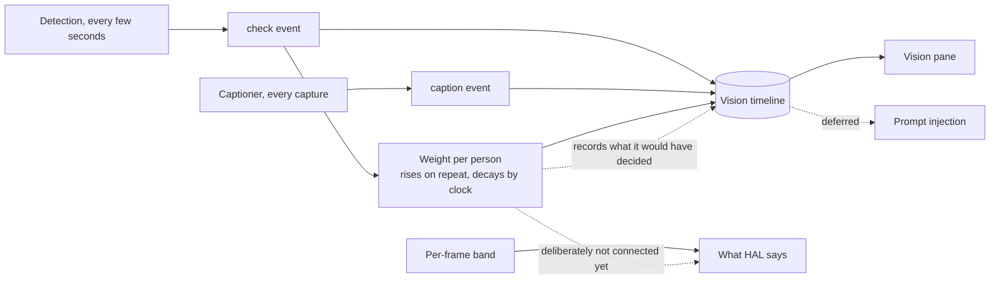

# Vision timeline and recognition weight

## Summary

Record every recognition check and every caption as timestamped events in one ordered, persistent
timeline, so what HAL saw and when survives a restart and can be read back accurately. Give each
person a weight that rises with consecutive recognitions and decays by wall-clock, recorded and shown
but deciding nothing yet — alongside the band weight *would* have chosen, so promoting it later is a
measurement rather than a hunch.

## Problem Frame

Nothing about seeing is kept. `server/src/storage/observations.ts` persists what HAL *said* — a
narration entry per cycle, shared with the session and monitor roles. Detection results are broadcast
live as appearances and discarded. Even the captioned observations live only in the browser, capped
at fifty, and are not replayed on reconnect. So the question "when was the face recognised, and when
was the image described" cannot be answered after the fact at all, for either half.

The two halves also run at different speeds and only one of them is sampled. Detection runs on its
own interval — three seconds by default, fifteen in practice — while captioning runs on the capture
interval, a minute or more apart. Identity is read once per capture, beside the frame grab, and
stamped onto that observation. Every other check in between happens, decides something, and vanishes.
At a fifteen-second detection interval against a sixty-second capture, three checks in four leave no
trace.

That gap matters more now that the record is meant to reach a model. The deferred chat seam would
inject "who is present" into a conversation, and what it has to draw on today is a handful of
minute-spaced snapshots rather than the continuous observation the recogniser is actually making.

There is a second, older problem the timeline makes addressable. A single frame's confidence is noisy
— independent captures of one person score 0.53 to 0.78 — so a per-frame threshold decides identity
on the least stable evidence available, and the band visibly flickers across a single continuous
visit. Nothing currently accumulates that evidence, because nothing keeps it.

Retention is not the constraint here. Everyone recorded has consented to being held; what the record
must not do is leave the machine.

## Key Decisions

**One timeline, two kinds of event.** Checks and captions are recorded in a single ordered stream
rather than two parallel logs. The question being asked is a comparison — recognised *versus*
described — and a comparison needs both sides in one place with one clock. It also means a later
reader assembles context from one source rather than reconciling two.

**Weight is evidence over time, and it observes before it decides.** A person's weight rises with
consecutive recognitions and falls with low confidence or absence, so it expresses what a minute of
watching supports rather than what one frame happened to score. It changes nothing HAL says: banding,
narration, and profile delivery all continue to read the current frame exactly as they do today. The
reason is that a signal which has never been checked against reality should not be given authority
over what HAL asserts about a person.

**Graduation is a measurement, not a judgement.** Each check also records the band weight *would*
have chosen alongside the band actually used. Where they agree, weight cost nothing; where they
disagree, there is a specific moment to review. Weight earns promotion by winning those
disagreements, and earns deletion by never producing any. Without this the decision to promote it
would be a feeling, which is how the current threshold got set.

**Weight decays by wall-clock, so a gap reads as absence.** Decaying only on checks would freeze a
person's weight whenever Vision is off — an evening of no observation would leave last night's
confidence looking current the next morning. Decay against elapsed time instead, which makes weight
well-defined even when nothing has been checked at all. That property is what makes it safe to read
into a prompt.

**Non-detection is an event.** A check that found nobody is recorded, because "HAL looked and saw
no one" is information, and because it is what makes decay observable rather than inferred. The cost
is that the timeline is never idle while Vision is on — roughly 5,700 entries a day at a
fifteen-second interval.

**The constraint is sharing, not keeping.** Everyone in the gallery has consented to being held, so
this record needs no expiry, no purge control, and no size cap for privacy reasons. It must not leave
the machine, which puts it under the same acknowledgement the recogniser endpoint and any non-local
provider already owe.

## Key Flows

- F1. A person is watched for a while
  - **Trigger:** Detection runs repeatedly and matches the same person.
  - **Steps:** Each check appends an event carrying who was matched, at what confidence, in which
    band, and their weight after the check. Weight climbs as the recognitions accumulate.
  - **Outcome:** The timeline shows a continuous presence rather than a scatter of snapshots, and the
    weight column shows evidence building.
  - **Covered by:** R1, R2, R6, R7

- F2. The room empties
  - **Trigger:** Detection runs and finds nobody.
  - **Steps:** A check event is recorded with no match. Weight for anyone previously seen continues
    to decay against elapsed time.
  - **Outcome:** Absence is visible in the record rather than being the gap between entries.
  - **Covered by:** R3, R8

- F3. Vision is switched off overnight and back on
  - **Trigger:** No checks occur for hours.
  - **Steps:** Nothing is appended. On the next read, weight is evaluated against elapsed wall-clock.
  - **Outcome:** Weight reads as near-nothing rather than as yesterday evening's value.
  - **Covered by:** R9

- F4. The user judges whether weight is any good
  - **Trigger:** The user reviews the timeline after some period of use.
  - **Steps:** Entries where the recorded band and the counterfactual band differ are identifiable.
  - **Outcome:** Promotion or deletion of weight is decided from those cases rather than from
    impression.
  - **Covered by:** R10, R11

- F5. The user reads what HAL saw
  - **Trigger:** The user opens the Vision pane.
  - **Steps:** The timeline is shown newest-first, with checks and captions interleaved and
    distinguishable.
  - **Outcome:** The user can see when a face was recognised versus when the image was described.
  - **Covered by:** R12, R13, R14

## Requirements

**The timeline**

- R1. Every recognition check appends one event carrying the time it ran and what it found.
- R2. A check that matched someone records who, the confidence, and the band that confidence fell in.
- R3. A check that found nobody is recorded as an event rather than omitted.
- R4. Every captioner result appends an event carrying the time and the caption.
- R5. Checks and captions share one ordered timeline, and an event's kind is distinguishable.
- R6. The timeline is persistent and survives a restart.

**Weight**

- R7. Each person carries a weight that rises as consecutive checks recognise them and falls as
  checks return low confidence or do not find them.
- R8. Weight is recorded on each check event, so its movement is visible in the timeline rather than
  only as a current value.
- R9. Weight decays against elapsed wall-clock, so a period with no checks reads as absence rather
  than holding its last value.
- R10. Each check also records the band weight would have chosen, alongside the band actually used.
- R11. Weight changes nothing HAL says or does. Banding, narration, profile delivery, and the
  uncertain-match queue all continue to read the current frame's confidence.

**Reading it**

- R12. The Vision pane shows the timeline, newest first, with checks and captions distinguishable at
  a glance.
- R13. A check's entry shows who was matched, the confidence, and the weight after it.
- R14. The pane is bounded in what it renders, and says so rather than silently truncating.

**Handling**

- R15. The timeline is never sent off this machine without the same explicit acknowledgement already
  owed for the recogniser endpoint and a non-local provider.
- R16. The timeline needs no expiry, purge control, or retention limit — everyone recorded has
  consented to being held.

## Acceptance Examples

- AE1. Every check leaves a trace
  - **Covers R1, R3.**
  - **Given:** detection running at its interval with nobody in front of the camera.
  - **When:** four intervals elapse.
  - **Then:** four events exist, each recording that nothing was found.

- AE2. The two eyes are distinguishable
  - **Covers R4, R5.**
  - **Given:** a detection interval faster than the capture interval.
  - **When:** a cycle runs.
  - **Then:** the timeline holds several check events between two caption events, and which is which
    is unambiguous.

- AE3. Weight accumulates and is visible
  - **Covers R7, R8.**
  - **Given:** one person recognised on ten consecutive checks.
  - **When:** the timeline is read.
  - **Then:** their weight is higher at the tenth than at the first, and every intermediate value is
    on the record.

- AE4. A gap reads as absence
  - **Covers R9.**
  - **Given:** a person at high weight, and then no checks for several hours.
  - **When:** weight is read before any new check runs.
  - **Then:** it has decayed toward nothing rather than holding its last value.

- AE5. Disagreements are findable
  - **Covers R10.**
  - **Given:** a check whose per-frame confidence falls in one band while weight suggests another.
  - **When:** the timeline is reviewed.
  - **Then:** that entry is identifiable as a disagreement without recomputing anything.

- AE6. Nothing HAL says changes
  - **Covers R11.**
  - **Given:** a person at high weight whose current frame scores below the statement threshold.
  - **When:** the cycle is summarised.
  - **Then:** the identity is hedged exactly as it is today, and no profile is delivered.

- AE7. Survives a restart
  - **Covers R6.**
  - **Given:** a timeline with events from this morning.
  - **When:** the server is restarted.
  - **Then:** those events are still readable.

## Dependencies / Assumptions

- Detection runs on its own interval, faster than capture. The timeline's resolution is that
  interval, and nothing here changes it.
- Weight's growth and decay rates are unknown and will be wrong at first. They are settings-shaped
  rather than constants, because the same was true of both identity thresholds and both needed
  correcting from real readings.
- The value of the counterfactual record assumes the disagreement set is non-empty. If per-frame and
  weighted banding never disagree, weight has been shown to be redundant, which is a useful outcome
  and not a failure.
- Roughly 5,700 events a day at a fifteen-second interval, most of them recording nothing found. The
  volume is accepted; it is what makes decay observable.

## Scope Boundaries

**Deferred for later**

- Weight influencing anything: banding, narration wording, profile delivery, or which faces reach the
  uncertain-match queue. Held until the counterfactual record shows it deserves to.
- Injecting the timeline into a conversation. That is the chat seam already deferred in
  `docs/residual-review-findings/feat-recognition-identity-and-profiles.md`; this brief builds the
  substrate it would read.
- Any summarisation or roll-up of the timeline — presence spans, daily digests, "who was here today".
  The raw events come first; a reader that condenses them is a separate question.

**Outside this product's identity**

- Retention policy, expiry, and purge controls for this record. Everyone in the gallery consented to
  being held; adding a deletion ceremony would imply a concern that does not apply here.
- Sending the timeline anywhere. It is a local record of a local room.
- Inferring anything beyond identity from the events — activity, mood, attention. The timeline says
  who was seen and when, and nothing about what kind of person they are.

## Outstanding Questions

**Resolve before planning**

- None.

**Deferred to planning**

- How fast weight rises and decays, and whether the two rates are independent.
- Whether weight is bounded to a range or unbounded, and what a fresh person starts at.
- Whether the counterfactual band needs its own threshold, or reuses the two identity thresholds
  against the weighted value.
- Whether the timeline extends the existing observation store or lives beside it.
- How much of the timeline the pane renders, and whether checks that found nothing are collapsed for
  reading while still being recorded in full.
- Whether a check event records the weight of everyone known or only of those it matched.

## Sources / Research

- `server/src/storage/observations.ts` — the day-stamped JSONL store this is a sibling of, and the
  reason its tail reader is the shape to follow.
- `server/src/vision/service.ts` — the detection and capture loops running at different intervals,
  and the point where identity is sampled beside the frame grab.
- `docs/brainstorms/2026-08-08-recognition-identity-and-character-profiles-requirements.md` — the
  bands this records against, and the deferred chat seam this is upstream of.
- `docs/residual-review-findings/feat-recognition-identity-and-profiles.md` — the standing note that
  the statement threshold rests on observation rather than measurement. Weight is the mechanism that
  could replace that observation with evidence.
- `docs/solutions/a-measurement-on-synthetic-variants-measures-your-own-transform.md` — where the
  0.53–0.78 range for independent captures comes from, and why a single frame is weak evidence.
- `docs/residual-review-findings/feat-vision.md` — the recorded gap that raw observations are not
  replayed to a client connecting late, which persisting captions closes.
