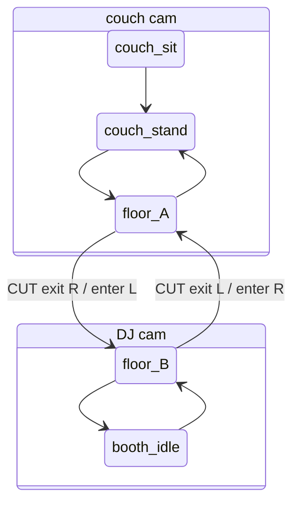

# Live scene-worlds

## Summary

A `/live` route where a character inhabits a room built entirely from short looping video
clips, moving between fixed camera views by cutting between an exit clip and an entry clip.
Behaviour is a Unity-style state machine: parameters and transition conditions, never a
"go here" command. Authoring happens on a top-down floorplan with camera cones, which is
also where the three failures that ruin a world get caught — uncovered positions, reversed
cuts, and states with no way out. Each project is a **World**: its own folder, its own
clips, its own graph.

---

## Problem Frame

Local video models are good at one narrow thing: a few seconds of a fixed shot, on a loop,
looking consistent. They are bad at long takes, at moving cameras, and at cutting. That
capability shape is close to how a room is actually covered on a film set — a small number
of locked-off angles, characters entering and leaving frame — and nothing like how a game
engine works.

So a pile of generated clips is already most of a place. What is missing is the thing that
decides which clip is on screen. Without it the clips are a folder; with it they are a room
someone lives in. Building that decider as a 3D engine would throw away the only asset that
exists, and building it as a video playlist would make the character a recording rather than
an inhabitant.

The immediate use is a nightclub-style streamer lounge, but the second World is a different
subject entirely, which is why isolation between projects is structural rather than a
setting.

---

## Key Decisions

**Steering is a parameter value, not a command.** There is no goto and no pathfinder. The user
sets `location` to `booth`, and the character arrives because an edge out of every intervening
state makes progress toward that value. The route exists only because it was authored. The cost
is real — a missing edge parks the character silently — and it buys the one property that
matters downstream: a caller sets a value and never has to know the map. HAL sets `energy` from
narration later without learning the floorplan.

**A Scene owns exactly one camera.** Changing camera is therefore always a Cut, never a property
of the character's state. This rules out cutting angles mid-idle, and in exchange it means no
clip ever has to contain a camera change — which no local model can generate.

**A Cut is two clips joined at the camera change.** The character walks to the edge of frame in
the outgoing Scene, the camera changes on the join, and a second clip carries them from frame
edge to destination in the incoming Scene. This is ordinary film coverage, and it is also the
only shape the generation workflow can produce.

**Cut believability is a stored property, not a matter of taste.** Because the join is a hard
cut, screen direction decides whether it reads as continuous motion or as the character turning
around. Each Cut records which frame edge is left through and which is entered through, so a
reversal is a check rather than something noticed three clips later.

**Coverage is derived from cones, then corrected.** Cameras declare an origin, a facing, a field of
view and a range; which Positions they see falls out of that. A Position seen by two cameras
therefore produces two States automatically, and the missing second clip is visible before it is
generated. Geometry cannot see walls, so the author can strike a pairing it gets wrong — correcting
a derived list rather than maintaining one.

**The World's folder is the World.** The manifest and the clips live together in one directory under
`worlds/`. Copy it to fork, zip it to ship it, delete it and nothing is orphaned. HAL's own data
holds only which World was last open.

**A World is portable, which makes its manifest untrusted input.** A folder that travels between
machines names file paths, and those paths reach a route that serves video. Confinement is therefore
part of loading a World rather than a hardening pass afterwards: a path that escapes its own World
directory is rejected where a missing clip would be reported, and the serving route refuses anything
outside a registered World.

**The engine ships before HAL touches it.** Parameters are set by the user today and by HAL later
over the same message, so the second era adds a caller rather than an integration.

**The harness stores nothing about the character and processes no video.** Clips arrive as finished
files. There is no character sheet, no reference image, no prompt record, and no import step that
inspects, normalises or re-encodes anything. A World is a graph plus the files it points at, and
whether two clips look like the same person is settled before the file reaches the folder.

---

## Vocabulary

- **World** — one project: a folder holding a manifest and a `clips/` directory. Worlds never
  share clips, Positions, Parameters or graphs.
- **Scene** — one camera's view. Owns exactly one camera.
- **Position** — a named place on the floorplan (`couch`, `floor`, `booth`). Exists independently
  of any camera.
- **State** — a Position seen by a particular Scene in a particular pose. The unit the character
  is in, and the owner of the looping clip that plays while it holds.
- **Edge** — a way out of a State. Three kinds: Pose, Travel, Cut.
- **Cut** — the Edge kind that changes Scene. Two clips, joined at the camera change. A Cut whose
  Position does not change is a **re-frame**.
- **Parameter** — a named value on the World that conditions read. The only thing anyone, user or
  agent, sets from outside.

---

## Requirements

**Route and shell**

- R1. `/live` is a route in the existing app, linked from the base HAL page, and openable directly
  by URL.
- R2. Opening `/live` with no World chosen shows a picker listing every World, with a way to create
  an empty one.

**Worlds and storage**

- R3. A World is a directory under a `worlds/` folder in the per-OS data directory, holding one
  manifest plus a `clips/` folder, complete on its own, such that copying the directory produces an
  independent working fork.
- R4. HAL's own data holds only which World was last open; the set of Worlds is whatever `worlds/`
  contains.
- R5. A World is playable at every stage of authoring, including one Scene with one clip and no
  edges.

**Scenes, Positions and cameras**

- R6. A Scene owns exactly one camera.
- R7. A Position is named, placed on the floorplan, and independent of any camera.
- R8. A camera declares an origin, a facing, a field of view and a range.
- R9. Which Positions a camera covers is derived from its cone rather than entered by hand, and the
  author can exclude a derived Position-camera pairing that geometry gets wrong.
- R10. A Position covered by two cameras yields one State per covering camera.

**States, clips and edges**

- R11. A State names the looping clip that plays while it holds, and that clip repeats until an edge
  is satisfied.
- R12. A Pose edge changes pose within one Scene and plays one clip.
- R13. A Travel edge moves the character between Positions inside one Scene and plays one clip.
- R14. A Cut edge changes Scene and plays an exit clip then an entry clip, with the camera change
  landing on the join between them.
- R15. A Cut edge records the frame edge left through and the frame edge entered through.
- R16. A Cut edge between two States at the same Position is a re-frame — two clips, no travel.
- R17. A clip path in the manifest is confined to its own World directory — absolute paths, `..`
  segments and symlink escapes are rejected at load time, and a rejected or missing clip leaves the
  World loadable with the affected State or edge reported as incomplete.

**Parameters and runtime**

- R18. A World declares named Parameters, each with a finite set of allowed values and a default,
  settable while it runs.
- R19. Every edge carries a condition over Parameters, fires on clip end, or both.
- R20. The runtime evaluates conditions when a Parameter changes and when a clip ends, and takes the
  first satisfied edge.
- R21. The runtime takes one edge at a time and never plans a multi-hop route.
- R22. The join between two clips plays without a stall or a black frame.

**The plan view**

- R23. The plan view draws Positions, cameras and their cones on a top-down floorplan, with edges
  drawn between Positions.
- R24. Placing Positions, placing and aiming cameras, and drawing edges all happen in the plan view.
- R25. Selecting an edge opens its conditions and clip assignments for editing.
- R26. The plan view reports Positions covered by no camera.
- R27. The plan view reports Cut edges whose recorded frame edges imply a reversed screen direction.
- R28. The plan view reports States with no satisfiable edge out for some allowed value of a
  Parameter.
- R29. The plan view shows live Parameter values and the current State while the World runs.

**Protocol and parity**

- R30. Setting a Parameter, reading the current State, reading the World's graph, and every World
  mutation the plan view can make — creating a World, placing Positions and cameras, adding and
  editing edges, assigning clips and conditions — are reachable over the WS protocol, with the plan
  view as one caller among others.
- R31. Clip video is served over an HTTP route carrying the same origin and host guard as the
  existing camera stream, and only from paths inside a registered World directory.

---

## Key Flows

- F1. Author the first circuit
  - **Trigger:** A new World, an empty floorplan, and a folder of generated couch clips.
  - **Steps:** Place `couch`, `floor` and `booth`; place the couch camera and the DJ camera and aim
    their cones; assign the couch idle clip and play it. Add the walk from couch to floor inside the
    couch camera, then the Cut from floor to floor across cameras, then the walk to the booth and its
    idle. Add the mirrored return edges.
  - **Outcome:** Setting `location` between `couch` and `booth` drives a full circuit and back.
  - **Covered by:** R5, R7, R9, R12, R13, R14, R18, R23, R24

- F2. A Cut plays
  - **Trigger:** The character is dancing on the floor in the couch camera and `location` becomes
    `booth`.
  - **Steps:** The floor idle finishes its current loop; the exit clip plays them out of frame; the
    camera changes on the join; the entry clip carries them in from the opposite frame edge; the walk
    to the booth plays; the booth idle takes over and loops.
  - **Outcome:** One parameter change produced four clips and a camera change that reads as
    continuous movement.
  - **Covered by:** R11, R14, R15, R20, R21, R22

- F3. A dead end is caught
  - **Trigger:** A fourth Position is added with a Travel edge in but none out.
  - **Steps:** The plan view marks the new State as having no satisfiable edge out for at least one
    value of `location`.
  - **Outcome:** The gap is visible before a clip is generated for it.
  - **Covered by:** R21, R28

---

## The first circuit as a graph

The two Cuts are mirrors of each other; reversing one is the error R27 exists to catch. Both
`floor_A` and `floor_B` are the same Position, which is why the dance loop has to be generated from
each camera.

---

## Acceptance Examples

- AE1. Coverage doubles the clip bill
  - **Covers R9, R10.**
  - **Given** the couch camera's cone contains `couch` and `floor`, and the DJ camera's contains
    `floor` and `booth`,
  - **When** the cones are placed,
  - **Then** three Positions yield five States, and `floor` is reported as needing an idle clip from
    each camera.

- AE2. A reversed Cut is flagged
  - **Covers R15, R27.**
  - **Given** the outbound Cut exits the right frame edge and enters the left,
  - **When** the return Cut is authored to also exit right,
  - **Then** the plan view flags the pair as reversed rather than accepting it.

- AE3. A dead end is visible without playing it
  - **Covers R28.**
  - **Given** a State whose only outbound edges require `location == "couch"`,
  - **When** `location` can also be `booth`,
  - **Then** the plan view reports that State as having no way out for `booth`.

- AE4. A half-built World runs
  - **Covers R5, R17.**
  - **Given** a World with one Scene, one idle clip and no edges,
  - **When** it is opened,
  - **Then** the clip loops and the plan view shows what is missing, rather than the World refusing
    to load.

- AE5. An agent moves the character
  - **Covers R30.**
  - **Given** a running World with `location` set to `couch`,
  - **When** an agent sets `location` to `booth` over the WS protocol,
  - **Then** the same transitions play as when the value is changed from the plan view.

---

## Success Criteria

- The couch → booth → couch circuit runs end to end from parameter changes alone, and the two Cuts
  read as continuous movement rather than as the character turning around.
- Adding a fourth Position costs a point, a cone check and clips — no change to the manifest's shape
  and no code change.
- A World folder copied to another machine runs there.
- Judged by inspection rather than by a metric: the standard is whether the loop looks like a place,
  and SW is the judge.

---

## Scope Boundaries

**Deferred for later**

- Generating clips inside the app, and any local video-model integration.
- Take history — keeping rejected generations with their prompts and seeds for one-click swaps.
- A node-graph canvas as a second authoring view alongside the floorplan.
- HAL driving Parameters from narration, vision or monitors.
- Audio, and more than one character in a World.
- Capture or streaming output.

**Outside this feature's identity**

- It is not a 3D engine. Nothing is rendered, simulated or camera-controlled at runtime; every frame
  the user sees was generated ahead of time.
- Cuts are hard cuts. Blending, easing and crossfades between clips are not the mechanism.
- Worlds are never shared or merged. Isolation is the point of the folder.

---

## Dependencies and Assumptions

- Clips are produced outside HAL by local video models. The harness consumes files and never
  generates, inspects or re-encodes them; a clip that loops badly or breaks continuity is fixed
  upstream and the file replaced.
- Cameras are locked off. A clip containing camera motion breaks the floorplan's claim that a cone
  describes what is on screen.
- Idle clips loop cleanly — first frame and last frame match well enough to repeat without a visible
  seam.
- A Scene's clips are visually consistent with each other: same room, same lighting, same character.
  Continuity across generations is a workflow property the harness cannot enforce.
- `/live` needs no server-side route work to be reachable: `server/src/http.ts` already falls back to
  `index.html` for unknown paths.
- The app has no client-side router today, so `/live` introduces the first one.

---

## Outstanding Questions

All deferred to planning; nothing blocks it.

- What provides client-side routing, given none exists.
- How clip video is served and how the join in R22 is hidden — element swapping, preloading, byte
  ranges.
- Manifest schema and how it versions as Worlds outlive changes to it.
- Whether Parameter values persist across restarts or reset to declared defaults.
- Whether one World is open at a time or several can run.

---

## Sources

- `AGENTS.md` — the agent-native parity rule that makes R30 non-optional, and the storage and
  fire-and-forget conventions any new store inherits.
- `shared/src/types.ts` — the WS wire contract every new message must join.
- `server/src/http.ts` — the SPA fallback that makes `/live` reachable, and the `/api/vision/stream`
  origin and host guard that R31 copies.
- `ui/src/App.tsx` — the single-shell UI that R1 has to open a route inside.
- `server/src/paths.ts` — where per-OS user data lives, and therefore where Worlds sit relative to it.
