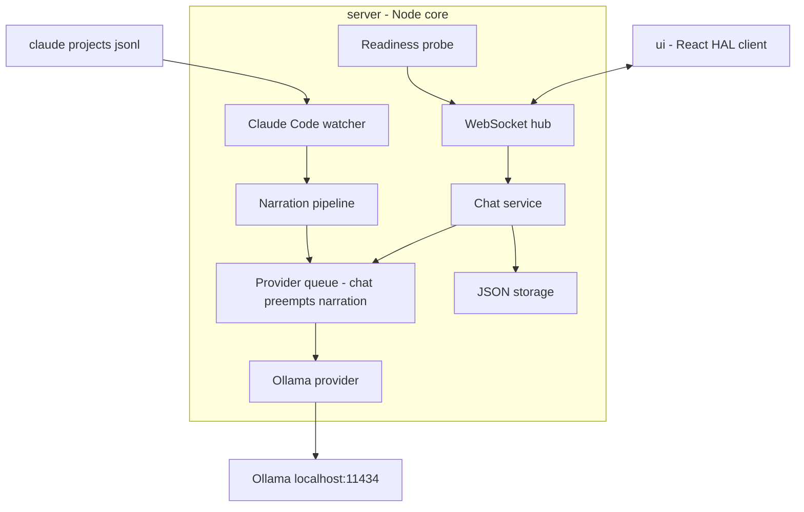
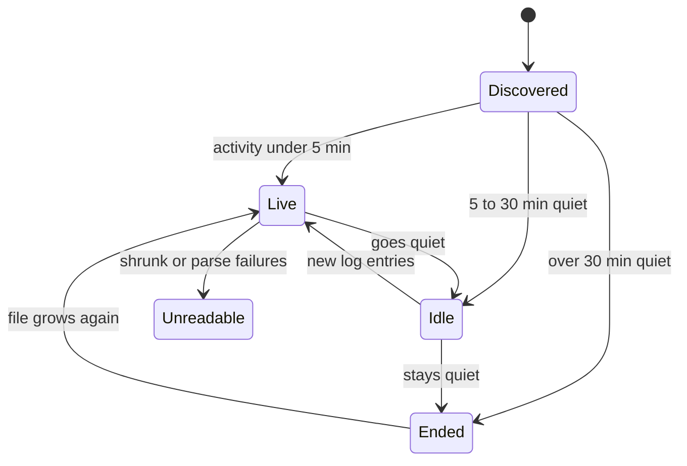
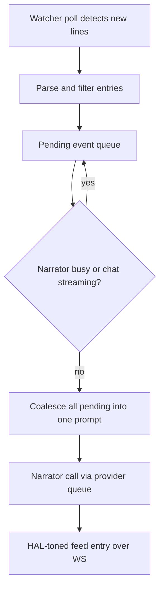

# feat: HAL 1000 harness v1 — Ollama chat + Claude Code narration

## Summary

Build HAL 1000 v1 as a TypeScript/Node application: a local core process (HTTP + WebSocket server, Ollama provider, Claude Code log watcher, JSON-file storage) serving a HAL 9000-styled React UI to the browser. Ships the full brainstorm scope — persistent-history chat against Ollama plus a live narrated Claude Code session feed — with the core/UI, provider, and watcher seams the origin doc requires (see origin: docs/brainstorms/2026-08-02-hal-1000-harness-requirements.md).

---

## Problem Frame

The team tests models via `ollama run` in a terminal — no history, no comparison, no narration of coding-agent activity. The origin doc defines the product; this plan defines the build. Flow analysis added four v1-blocking behaviors the origin deferred: session liveness detection, narration backpressure, restart re-attach, and first-run readiness.

---

## Requirements

R1–R12 are carried from the origin doc unchanged (chat with streaming and persistent history, model selection, live narration pane, provider and watcher abstractions, cross-platform local web app, in-app settings, HAL persona). The plan adds behavioral requirements from flow analysis:

**Session lifecycle**

- R13. The watcher classifies each discovered session as live (log activity < 5 min ago), idle (5–30 min), ended (> 30 min), or unreadable (file shrinkage or parse failures past a threshold), and the UI shows in-persona status copy for each state; thresholds are configurable constants.
- R14. On restart, HAL re-attaches to the last watched session at the persisted log offset's file end, posting one in-persona gap notice instead of replaying missed events.

**Narration under load**

- R15. Narration coalesces all pending log events into each narrator call; when events outpace the narrator, the feed shows a catching-up indicator rather than falling minutes behind.
- R16. Chat requests preempt narration on the shared Ollama instance: an in-flight chat stream is never queued behind narration, and narration waits while chat streams.

**Degraded states**

- R17. A first-run readiness probe distinguishes and guides through: Ollama unreachable, Ollama up with zero models, and Claude Code logs absent; session discovery skips project directories with no `.jsonl` files.
- R18. Settings changes apply to the next request only: an endpoint change never terminates an in-flight stream, and switching watched sessions detaches the old watcher cleanly.
- R19. When a conversation's model (or the narration model) no longer exists in Ollama, HAL reports it in persona and offers reselection; conversation records keep the original model name. Narration pauses with status rather than dying.

---

## Key Technical Decisions

- **Node core + React/Vite UI in one npm workspace (`server/`, `ui/`, `shared/`).** One language across the stack; the core serves the built UI in production and proxies in dev. Shared TypeScript types in `shared/` define the WebSocket message contract both sides compile against.
- **One WebSocket channel per client for chat tokens, narration entries, session status, and readiness events.** Bidirectional needs (send message, switch session) plus multiple server-push streams make WS a better fit than SSE; message types live in `shared/`.
- **Provider abstraction: `listModels()` + `chatStream()` behind a priority queue.** The Ollama implementation calls `/api/chat` (NDJSON streaming) and `/api/tags`. The queue enforces R16: chat jobs preempt narration jobs. Narration defaults to the conversation's chat model unless overridden — avoids VRAM load/unload thrash from running two models on one machine.
- **Watcher abstraction: filesystem polling, not `fs.watch`.** Polling with mtime/size checks is reliable cross-platform (fs.watch is flaky on Windows network/virtual paths) and doubles as the liveness heuristic input (R13). The Claude Code watcher tails `~/.claude/projects/<slug>/<uuid>.jsonl`, tracks byte offsets, and persists them for R14.
- **Log parsing is tolerant by design.** Only entry types `user`, `assistant`, and `system` feed narration; metadata types (`file-history-snapshot`, `permission-mode`, `mode`, `queue-operation`, `attachment`, `last-prompt`, `ai-title`) and `isSidechain: true` entries are skipped in v1. Unparseable lines increment an error counter and surface as "I can't fully read this session" past a threshold — never a crash. The format is undocumented and version-fragile; fixtures capture the observed shape.
- **Storage is plain JSON files** under a per-OS user-data directory: one file per conversation plus `settings.json` and watcher state. Zero native dependencies keeps the later desktop wrap trivial; single-user scale doesn't need a database.
- **Narration pipeline: poll → parse → coalesce → one narrator call → feed entry.** The coalescer drains the entire pending event queue into each narrator prompt (R15), which asks the narration model for a short HAL-toned summary of "what just happened."

---

## High-Level Technical Design

Component topology:



Session liveness states (R13, R14):



Narration data flow (R15, R16):



---

## Output Structure

Scope declaration for the new tree; per-unit **Files** lists are authoritative.

```text
package.json                  # npm workspaces: server, ui, shared
shared/src/types.ts           # WS message contract, provider/watcher interfaces
server/src/index.ts           # boot: http, ws, readiness, restore watcher state
server/src/http.ts
server/src/ws.ts
server/src/readiness.ts
server/src/providers/{provider,ollama,queue}.ts
server/src/watchers/{watcher,claude-code}.ts
server/src/narration/{coalescer,narrator}.ts
server/src/storage/{conversations,settings}.ts
server/test/                  # unit + integration tests, jsonl fixtures
ui/src/                       # App, HalEye, ChatPane, NarrationPane,
                              # SessionPicker, SettingsPanel
ui/test/
```

---

## Implementation Units

### U1. Workspace scaffolding and transport skeleton

- **Goal:** Bootable core process serving a placeholder UI with a connected WebSocket channel.
- **Requirements:** R10; foundation for all units.
- **Dependencies:** none.
- **Files:** `package.json`, `shared/src/types.ts`, `server/src/index.ts`, `server/src/http.ts`, `server/src/ws.ts`, `ui/` scaffold, `server/test/boot.test.ts`.
- **Approach:** npm workspaces; core serves `ui/dist` statically and exposes `/api/health`; WS hub with typed message envelope from `shared/`. Dev mode proxies Vite.
- **Test scenarios:** server boots and serves the UI on the configured port; `/api/health` returns ok; a WS client connects and receives a typed hello message; second instance on the same port fails with a clear error message.
- **Verification:** `npm run dev` yields a browser page connected over WS on Windows (primary dev OS).

### U2. Provider abstraction, Ollama implementation, priority queue

- **Goal:** Model listing and streaming chat through a seam that later admits Anthropic/OpenAI, with chat-preempts-narration scheduling.
- **Requirements:** R1, R3, R8, R16, R19.
- **Dependencies:** U1.
- **Files:** `server/src/providers/provider.ts`, `server/src/providers/ollama.ts`, `server/src/providers/queue.ts`, `server/test/providers/ollama.test.ts`, `server/test/providers/queue.test.ts`.
- **Approach:** `Provider` interface (`listModels`, `chatStream` yielding tokens); Ollama impl over `/api/tags` and `/api/chat` NDJSON. Queue holds two priority classes; enqueueing a chat job while a narration job waits reorders narration behind it; in-flight jobs are never cancelled by scheduling.
- **Test scenarios:** happy path — a chat request streams tokens in order and terminates; `/api/tags` empty list returns a typed zero-models result, not an error; Ollama connection refused surfaces a typed provider-unavailable error (feeds AE4); model-not-found from Ollama surfaces a typed missing-model error (R19); queue — narration job enqueued first, chat job enqueued second, chat runs first; a streaming chat job is not interrupted when narration jobs pile up; mid-stream disconnect yields a partial-result marker, not a rejection swallowing received tokens.
- **Verification:** unit tests pass against a mocked HTTP layer; one integration test passes against real local Ollama when reachable, skips otherwise.

### U3. Conversation and settings storage, chat service

- **Goal:** Persistent conversations wired end-to-end: create, list, continue, delete, streamed replies, durable across restarts.
- **Requirements:** R1, R2, R3, R11, R18, R19; AE3, AE4.
- **Dependencies:** U1, U2.
- **Files:** `server/src/storage/conversations.ts`, `server/src/storage/settings.ts`, chat service wiring in `server/src/ws.ts`, `server/test/storage/*.test.ts`, `server/test/chat-service.test.ts`.
- **Approach:** one JSON file per conversation (messages, model name, timestamps) in a per-OS data dir; atomic writes (write temp, rename). Settings changes apply next-request (R18). Interrupted streams persist the partial reply with an `interrupted` marker and offer regenerate.
- **Test scenarios:** Covers AE3 — restart the service, reopen a conversation, full history present and continuable with the same model; Covers AE4 — send with Ollama down, in-persona error, conversation intact; delete removes the file and the listing entry; mid-stream provider death persists partial reply marked interrupted; send to a conversation whose model was removed returns the missing-model state and the record retains the original model name (R19); settings write is atomic — a crash between temp-write and rename leaves the previous settings readable; changing chat model mid-conversation applies to the next message only.
- **Verification:** storage round-trip tests pass on Windows paths; chat flow works end-to-end against real Ollama.

### U4. HAL UI shell and chat experience

- **Goal:** The HAL 9000 face of the product: dark theme, red-eye motif, conversation sidebar, model picker, streaming chat, settings panel.
- **Requirements:** R1, R2, R3, R11, R12; F1, F3.
- **Dependencies:** U1, U3.
- **Files:** `ui/src/App.tsx`, `ui/src/components/HalEye.tsx`, `ui/src/components/ChatPane.tsx`, `ui/src/components/SettingsPanel.tsx`, `ui/src/ws-client.ts`, `ui/test/chat.test.tsx`.
- **Approach:** React + Vite; WS client with reconnect; HAL persona copy for system/error states; model picker fed by `listModels`, with an explicit empty state showing `ollama pull` guidance (R17 surface). Settings edits round-trip through the core, no restart (F3).
- **Test scenarios:** streamed tokens render incrementally into the active reply; conversation switch preserves scroll and draft state; model picker with zero models shows the pull-guidance empty state; provider-unavailable renders in-persona error copy, prior messages intact; settings change reflects on next send without reload.
- **Test expectation:** component tests for the scenarios above; visual HAL aesthetic verified by screenshot review, not automated assertion.
- **Verification:** a teammate can chat with a fine-tuned Ollama model, restart the app, and continue the conversation — all from the browser UI.

### U5. First-run readiness check

- **Goal:** A guided path from cold start to working app for each degraded state.
- **Requirements:** R17; success criterion "clone to first reply in minutes."
- **Dependencies:** U2, U4.
- **Files:** `server/src/readiness.ts`, readiness states in `ui/src/App.tsx`, `server/test/readiness.test.ts`.
- **Approach:** one probe sequence on boot and on demand: Ollama reachable → models present → `~/.claude/projects` exists with at least one `.jsonl`. Each failure maps to a distinct UI state with fix instructions; narration-related failures degrade only the narration pane, never chat.
- **Test scenarios:** all-green probe reports ready; Ollama down yields the unreachable state with retry; zero models yields the pull-guidance state; missing or empty Claude Code log dir yields "Claude Code not found" on the narration pane while chat remains usable; probe re-run after fixing a condition clears the state without restart.
- **Verification:** killing Ollama and deleting models each produce their guided state live.

### U6. Claude Code session watcher

- **Goal:** Discover sessions, classify liveness, tail the watched log, survive restarts and file weirdness.
- **Requirements:** R4, R9, R13, R14, R18; AE1 groundwork.
- **Dependencies:** U1.
- **Files:** `server/src/watchers/watcher.ts`, `server/src/watchers/claude-code.ts`, `server/test/watchers/claude-code.test.ts`, `server/test/fixtures/*.jsonl`.
- **Approach:** watcher interface emits parsed events + state changes; Claude Code impl polls the projects dir, maps project slugs to readable names, skips `.jsonl`-less dirs, classifies live/idle/ended by mtime (R13), tails the watched file from a persisted byte offset, and detects shrink/replacement as `unreadable`. Fixtures are sanitized copies of the observed format, including sidechain and metadata entries.
- **Execution note:** build against fixtures first; the tail logic is timing-sensitive and needs deterministic tests before touching live logs.
- **Test scenarios:** discovery lists sessions across project dirs and skips dirs with no `.jsonl`; mtime buckets classify live/idle/ended at the thresholds and transitions fire on re-poll; appended lines yield parsed events from the stored offset only; metadata types and `isSidechain: true` entries are filtered out; a truncated/shrunk file transitions to unreadable without throwing; malformed JSON lines are counted and skipped, threshold breach emits the unreadable-in-persona event; restart with persisted offset resumes at file end with a gap event (R14); watched-session switch stops the old tail cleanly (R18).
- **Verification:** attach to a real running Claude Code session and observe parsed events arriving near-live.

### U7. Narration pipeline

- **Goal:** Turn watcher events into HAL-toned feed entries under backpressure, sharing Ollama politely with chat.
- **Requirements:** R5, R7, R15, R16, R19.
- **Dependencies:** U2, U6.
- **Files:** `server/src/narration/coalescer.ts`, `server/src/narration/narrator.ts`, `server/test/narration/*.test.ts`.
- **Approach:** coalescer drains all pending events per narrator call into one prompt (event summaries, not raw JSON); narrator submits at narration priority (yields to chat, R16); catching-up indicator event when the pending queue exceeds a threshold during a call; narration model defaults to the active chat model, overridable (R7); missing narration model pauses the pipeline with an in-persona status event (R19).
- **Test scenarios:** Covers AE6 — burst of N events during one slow narrator call produces one coalesced entry covering all N, plus catching-up indicator while pending; single event narrates individually when idle; narration submitted while chat streams waits until the chat job completes (R16); narrator model deleted mid-watch emits paused status and resumes on reselect; re-attach gap produces the single "while I was away" entry (with U6); narrator prompt receives filtered event summaries only.
- **Verification:** with a deliberately slow model, the feed stays coherent and chat latency is unaffected.

### U8. Narration UI pane and session picker

- **Goal:** The visible narration experience: pick a session, watch HAL narrate, always know the session's state.
- **Requirements:** R4, R5, R6, R12, R13; F2; AE1, AE2, AE5.
- **Dependencies:** U4, U7.
- **Files:** `ui/src/components/NarrationPane.tsx`, `ui/src/components/SessionPicker.tsx`, `ui/test/narration.test.tsx`.
- **Approach:** pane renders alongside chat (R6); picker groups sessions by project with liveness badges; in-persona copy for no-session, idle, ended, unreadable, paused, and catching-up states; new-session-appeared notice with one-click switch when the watched session is presumed ended.
- **Test scenarios:** Covers AE1 — no attached session shows the offer-to-attach state listing available sessions; Covers AE2 — feed entries render while a chat reply streams, both progress; Covers AE5 — watched session goes quiet, pane shows idle then ended status in persona; unreadable state renders the can't-read copy; new session appears mid-watch, notice renders and click switches the watcher; detach clears live status but keeps prior feed entries visible.
- **Verification:** run a real Claude Code session beside a chat conversation; narration reads as one HAL voice and chat never stalls.

---

## Acceptance Examples

AE1–AE4 carry from the origin doc. Added:

- AE5. **Covers R13.** Given an attached session that stops producing log entries, when the idle then ended thresholds pass, the narration pane announces each state in persona rather than falling silent.
- AE6. **Covers R15, R16.** Given a narrator model slower than the event rate, when Claude Code emits a burst, the feed shows coalesced summaries with a catching-up indicator and a concurrently streaming chat reply is unaffected.

---

## Scope Boundaries

**Deferred for later** (carried from origin)

- Anthropic/OpenAI providers; critic and copilot commentary stages; codex/generic log watchers; desktop packaging (Electron vs Tauri chosen then, not now); voice output.

**Outside this product's identity** (carried from origin)

- Multi-user, auth, cloud sync, server deployment; controlling Claude Code; model fine-tuning workflows.

**Deferred to Follow-Up Work** (plan-local)

- Narrating sidechain/subagent activity (skipped in v1 parsing).
- Single-instance lock / port-conflict handling beyond a clear startup error.
- Auto-following a new session in the same project without user confirmation.
- Configurable liveness thresholds exposed in the settings UI (constants in v1).

---

## Risks & Dependencies

- **Claude Code log format is undocumented and version-fragile.** Mitigation: tolerant parser (R-skip unknown types), fixture-based tests, unreadable-state degradation instead of crashes. Verified against the format observed on this machine (2026-08); re-verify fixtures when Claude Code majors bump.
- **Two models on one Ollama instance can thrash VRAM.** Mitigation: narration defaults to the chat model; document the override cost.
- **Event bursts + slow narrator can starve the feed.** Mitigation: coalescing design (R15) is load-tested in U7 scenarios with synthetic bursts.
- Ollama ≥ 0.3x assumed for `/api/chat` streaming (0.32.5 verified locally).

---

## Open Questions

**Deferred to implementation**

- Exact HAL narrator prompt wording and how much persona to inject per entry (tune against real sessions in U7).
- Poll interval and catching-up threshold values (start 1s / 25 pending; tune in U6/U7).
- Whether the model picker needs pull-progress display or `ollama pull` instructions suffice (U5).

---

## Sources & Research

- Origin requirements: `docs/brainstorms/2026-08-02-hal-1000-harness-requirements.md`.
- Log format verified locally at `~/.claude/projects/<slug>/<uuid>.jsonl`: entry types observed (`user`, `assistant`, `system`, `mode`, `file-history-snapshot`, `attachment`, `last-prompt`, `queue-operation`, `permission-mode`, `ai-title`), `parentUuid` chains, `isSidechain` flag, no end-of-session marker, multiple session files per project dir, some project dirs contain no `.jsonl`.
- Ollama 0.32.5 verified at `localhost:11434` (`/api/version`); chat via `/api/chat` NDJSON streaming, models via `/api/tags`.
- Flow analysis (this planning session) produced R13–R19, AE5–AE6, and the follow-up items in Scope Boundaries.
