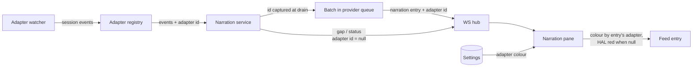
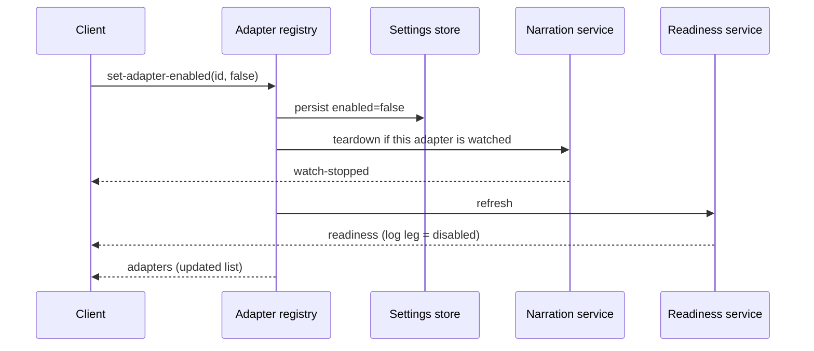
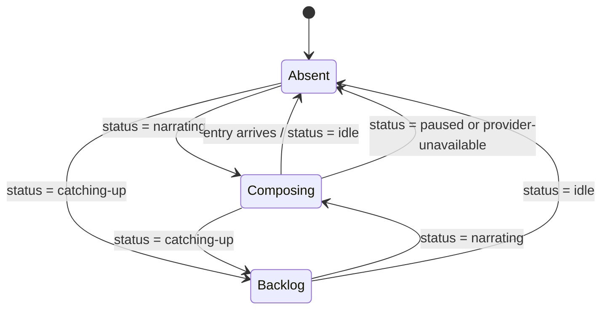

# feat: Composing lens and adapter theming for session observation

## Summary

Add a pulsing lens at the tail of the observation feed that animates while the narrator is
composing, turn the single hardcoded watcher into a registry of switchable adapters, and give both
adapters and the chat pane configurable text colours. Attribution is stamped onto each narration
entry when its batch is drained, so colour survives adapter switches, mid-inference detaches, and
reloads.

---

## Problem Frame

The narrator runs for seconds at a time on a local model and emits an entry only when it finishes.
Between those moments the feed is inert, and the only signal is a text badge in the pane header far
from where text lands.

Separately, `ClaudeCodeWatcher` is constructed directly in `server/src/app.ts` and handed to
`NarrationService` as *the* watcher. There is no way to stop it, no notion of which source an
observation came from, and `probeReadiness` treats an empty Claude Code log directory as a fault
regardless of whether anyone wants those logs read.

---

## Requirements

Carried from origin. R-IDs are the origin's.

**Composing lens** — R1–R6. Lens renders at the feed tail during composition (R1), yields to the
finished text (R2), stays absent when paused or unreachable (R3), distinguishes backlog from normal
composition (R4), defers to the header badge when scrolled away (R5), reuses the eye's visual
language (R6).

**Adapters** — R7–R12. Settings lists adapters with on/off control (R7); disabling detaches and stops
polling (R8); existing entries survive (R9); re-enabling does not auto-resume (R10); no enabled
adapter yields an in-persona empty state and a quiet readiness leg (R11); adapter state is reachable
over the protocol (R12).

**Colour** — R13–R19. Per-adapter observation colour (R13), attribution recorded at creation (R14),
HAL's own kinds keep HAL's colour (R15), curated palette plus custom (R16), readability floor (R17),
separate chat colours for user and assistant (R18), persistence across clients (R19).

---

## Key Technical Decisions

**Adapter control gets dedicated protocol messages.** Enabling, disabling, and listing adapters ride
their own client/server messages handled by the registry, which persists the resulting state. Colour
stays on `update-settings`. Routing lifecycle through a settings patch would make starting and
stopping watchers a side effect of a settings write, and nothing observes those patches today —
`update-settings` is handled in `server/src/chat.ts`, and `NarrationService`'s handler returns early
for any patch without a model key.

**Settings merge per adapter id on both paths.** `SettingsStore.load` and `update` both spread
shallowly. A patch carrying one adapter's state would replace the whole adapters map and silently
drop that adapter's stored colour — surfacing as a colour reverting to default rather than as an
error. Both paths merge per id against registry defaults.

**Colour is normalized on write and on load.** Normalization enforces two rules: a readability floor
against the pane background, and a minimum perceptual distance from HAL's red and the status amber,
since colour is the only carrier of provenance and a collision silently defeats the feature.
Applying it on load as well as write covers values that never passed through `update` — a
hand-edited settings file in this local-only tool, or existing values after the floor is retuned.

**Attribution is captured when the batch is drained, not when the entry is appended.** `pump()`
checks the watched session before draining but calls `addEntry` after awaiting the provider queue.
Resolving the adapter after that await returns null when a detach or disable lands mid-inference,
and a null id renders as HAL red — an observation about a session masquerading as HAL talking about
himself. The id travels with the batch. Gap and status entries carry no adapter by design
(see origin: R15).

**Disabling an adapter runs the full `unwatch` teardown.** Detaching and stopping the poll is not
enough: a batch already inside the provider queue still resolves and appends, a pending retry timer
still fires, and `watchedSessionId` keeps pointing at a session nothing will watch — which
`restoreWatch` re-attaches on the next boot. Disable clears the retry timer, drains the coalescer,
resets the session state, persists a null watched session, and broadcasts watch-stopped.

**UI logic is extracted into pure modules; rendering is verified by screenshot.** `vitest.config.ts`
runs `environment: "node"` and includes only `**/*.test.ts`; the repo has no jsdom or render library,
and `AGENTS.md` states the HAL aesthetic is verified by screenshot rather than assertions. Colour
resolution and lens-state derivation become pure functions with real unit tests; what they produce
on screen is checked by eye.

**Session summaries carry their adapter.** The picker has to know which adapter owns a session to
route an attach, and the feed needs the id to resolve a colour. This extends the wire contract
beyond what the origin named.

**Readiness gains a disabled state rather than becoming per-adapter.** `Readiness.claudeLogs`
accepts a third value meaning "no adapter wants these logs". Every client conditional that treats
the leg as two-valued has to grow a third branch; generalizing readiness into a per-adapter probe is
a larger refactor and is deferred.

**The lens is a separate component sharing the eye's CSS.** `HalEye` carries app-level states
(disconnected, error) that are meaningless at the feed tail. A distinct component reuses the shared
gradient tokens and keyframes so the two read as the same object without overloading one state
machine (see origin: R6).

---

## High-Level Technical Design

Attribution path — where the adapter id is attached and where it is consumed:

Control path — how a toggle reaches the watcher and the readiness probe:

Lens state, driven entirely by narration status — no new signal crosses the wire:

---

## Implementation Units

### U1. Wire contract, settings shape, and colour normalization

- **Goal:** Extend the shared contract for adapters, attribution, and colours, and make settings
  storage merge and normalize correctly on both paths.
- **Requirements:** R12, R13, R14, R16, R17, R18, R19.
- **Dependencies:** none.
- **Files:** `shared/src/types.ts`, `server/src/storage/settings.ts`, `server/src/storage/colors.ts`,
  `server/test/storage/storage.test.ts`, `server/test/storage/colors.test.ts`.
- **Approach:** Add an adapter descriptor (id, label, enabled) and per-adapter settings (enabled,
  colour); add the adapter listing and toggle messages plus an adapters broadcast; add the adapter id
  to `NarrationEntry` and `SessionSummary`; add the disabled value to the readiness log leg; add
  chat colours per role. Colour normalization is one exported function applying the contrast floor
  and the minimum-distance rule, called from both `load` and `update`. Both merge the adapters map
  per id rather than relying on the top-level spread.
- **Patterns to follow:** `DEFAULT_SETTINGS` and the `update` merge in
  `server/src/storage/settings.ts`; the message-shape conventions in `shared/src/types.ts`.
- **Test scenarios:**
  - Patching one adapter's enabled state preserves that adapter's stored colour and every other
    adapter's entry.
  - A stored settings file mentioning one adapter still yields defaults for an adapter it omits.
  - Covers AE4. A colour below the contrast floor is stored lifted; the returned settings carry the
    lifted value, not the submitted one.
  - A colour within the minimum distance of HAL red is moved away from it.
  - A colour that already clears both rules round-trips unchanged.
  - A stored settings file containing a below-floor colour loads with the lifted value.
  - A malformed colour value is dropped from the patch, leaving the prior stored value intact.
  - Settings written by a prior version (no adapter or colour keys) load with defaults applied.
- **Verification:** settings and colour round-trip tests pass; typecheck clean across both tsconfigs.

### U2. Adapter registry, lifecycle, and control messages

- **Goal:** Replace the single injected watcher with a registry that owns adapters, answers the
  adapter protocol, and tears down completely on disable.
- **Requirements:** R7, R8, R9, R10, R12.
- **Dependencies:** U1.
- **Files:** `server/src/watchers/registry.ts`, `server/src/watchers/watcher.ts`,
  `server/src/app.ts`, `server/src/narration/narrator.ts`, `server/test/watchers/registry.test.ts`,
  `server/test/narration/narration.test.ts`.
- **Approach:** The registry holds one entry per adapter with its `LogWatcher`, label, and enabled
  state, and subscribes to the hub for the adapter messages. Discovery unions enabled adapters and
  tags each summary with its adapter; attach resolves the owning adapter from the session id.
  Disabling runs the same teardown as the existing `unwatch` handler — clear the retry timer, drain
  the coalescer, reset the session state, persist a null watched session, broadcast watch-stopped,
  set status idle — then stops polling, and finally triggers a readiness refresh. Enabling starts
  polling without attaching. Each adapter's persisted tail state gets its own file path so a second
  adapter cannot clobber the first.
- **Patterns to follow:** the `unwatch` case in `server/src/narration/narrator.ts` is the teardown
  reference; the `LogWatcher` interface in `server/src/watchers/watcher.ts`; hub handlers must
  `.catch` (see `docs/solutions/ws-library-reemits-server-errors.md`).
- **Test scenarios:**
  - Covers F2. Disabling the adapter holding the watched session detaches it, stops polling, and
    broadcasts watch-stopped.
  - A narration batch in flight when the adapter is disabled produces no entry.
  - A pending narration retry timer does not fire after its adapter is disabled.
  - Disabling the watched adapter clears the persisted watched session, so a restart does not
    re-attach it.
  - Covers AE5. Entries already in the ring buffer remain in the backlog after a disable.
  - Re-enabling an adapter does not re-attach; no session is watched until the client asks.
  - Discovery omits sessions belonging to a disabled adapter.
  - Every discovered summary carries the adapter that produced it.
  - Listing adapters returns every registered adapter, including ones absent from stored settings.
  - Attaching a session id that no enabled adapter owns yields a watch-failure error rather than
    throwing.
  - Toggling an already-enabled adapter is a no-op and does not restart polling.
- **Verification:** watcher and narration suites pass; disabling an adapter leaves no active timers
  and no queued narration work.

### U3. Entry attribution

- **Goal:** Stamp every observation with the adapter whose events produced it, and none on HAL's own
  kinds.
- **Requirements:** R14, R15.
- **Dependencies:** U1, U2.
- **Files:** `server/src/narration/narrator.ts`, `server/src/narration/coalescer.ts`,
  `server/test/narration/narration.test.ts`.
- **Approach:** The adapter id is captured when the coalescer is drained and carried with the batch
  through the provider queue to `addEntry`, so an await that outlives the attachment cannot erase it.
  Gap and status entries carry no adapter. The backlog replay sent on connect carries recorded ids
  unchanged.
- **Patterns to follow:** the drain-and-requeue flow in `pump()` and the `addEntry` ring-buffer
  append, both in `server/src/narration/narrator.ts`.
- **Test scenarios:**
  - A narration entry produced while an adapter is attached carries that adapter's id.
  - Detaching while a narration call is in flight still yields an entry attributed to the adapter
    that supplied the events.
  - A batch requeued after chat preemption retains its adapter id when it re-narrates.
  - Gap and status entries carry no adapter id.
  - Covers AE3. After switching adapters, previously recorded entries retain their original ids.
  - Backlog replayed to a reconnecting client preserves every recorded id.
- **Verification:** narration suite passes; no entry leaves the service without an explicit
  attribution decision.

### U4. Readiness is adapter-aware

- **Goal:** Stop reporting an adapter's missing prerequisites as a fault when that adapter is off.
- **Requirements:** R11 (server half).
- **Dependencies:** U1, U2.
- **Files:** `server/src/readiness.ts`, `server/src/app.ts`, `server/test/readiness.test.ts`.
- **Approach:** The probe consults the registry. With the adapter disabled the log leg reports the
  disabled value instead of missing, and that adapter's discovery is skipped rather than run and
  ignored. The registry triggers a refresh on toggle so the value changes without a restart.
- **Patterns to follow:** the `Promise.allSettled` leg structure in `server/src/readiness.ts`.
- **Test scenarios:**
  - With the adapter disabled and no log directory, the log leg reports disabled, not missing.
  - With the adapter enabled and no log directory, the leg still reports missing.
  - With the adapter enabled and sessions present, the leg reports ok.
  - A disabled adapter's discovery is not invoked during the probe.
  - Toggling an adapter broadcasts refreshed readiness without a `check-readiness` message.
- **Verification:** readiness suite passes; toggling an adapter changes the broadcast readiness live.

### U5. Settings UI for adapters and colours

- **Goal:** Expose adapter toggles, adapter colour, and chat colours in the drawer, and stop showing
  a disabled adapter as a failure.
- **Requirements:** R7, R11 (readiness row), R16, R18, R19.
- **Dependencies:** U1, U2, U4.
- **Files:** `ui/src/components/SettingsPanel.tsx`, `ui/src/components/ColorField.tsx`,
  `ui/src/palette.ts`, `ui/src/store.ts`, `ui/src/styles.css`, `ui/test/store.test.ts`.
- **Approach:** An adapters section — a labelled fieldset following the persona-intensity pattern —
  lists each adapter from the adapters broadcast with a toggle and a colour field, above the
  readiness list so the most-used control is reachable without scrolling. A colour field renders the
  curated swatches plus a custom input; the palette is a UI convenience and the stored value stays a
  plain colour. Chat colours get their own section. The readiness row helper grows a third, neutral
  state so a disabled leg is not styled as a fault. Toggles send adapter messages; colours send
  settings patches.
- **Patterns to follow:** the `field` and `segmented` markup and the `readinessRow` helper in
  `ui/src/components/SettingsPanel.tsx`; the `:root` custom properties in `ui/src/styles.css`.
- **Test scenarios:**
  - The reducer stores the adapters list from an adapters broadcast.
  - The reducer applies a settings update carrying colours without dropping unrelated settings.
  - An adapter present in the broadcast but absent from stored settings resolves to default colour
    and enabled state.
  - A colour the server lifted is reflected from the settings broadcast, not from the submitted
    value.
- **Verification:** store tests pass; the drawer renders adapters with no adapter-specific
  conditionals in the component, and a disabled adapter's readiness row is visibly neutral rather
  than red.

### U6. Colour application and the no-adapter empty state

- **Goal:** Render observations in their adapter's colour, HAL's own kinds in HAL red, chat messages
  in their per-role colours, and an in-persona empty state when no adapter is enabled.
- **Requirements:** R11 (pane half), R13, R15, R18.
- **Dependencies:** U1, U3, U5.
- **Files:** `ui/src/colors.ts`, `ui/src/components/NarrationPane.tsx`,
  `ui/src/components/ChatPane.tsx`, `ui/src/persona.ts`, `ui/src/styles.css`,
  `ui/test/colors.test.ts`, `ui/test/store.test.ts`.
- **Approach:** A pure module resolves an entry's colour from its own adapter id and the settings
  map, falling back to HAL red when the id is absent or its adapter is no longer registered, and
  resolves chat colours by role. Components pass the result as a CSS custom property so the
  stylesheet keeps ownership of how it is used. A new persona copy key carries the no-adapter
  message, rendered as the pane's empty state when the readiness log leg reports disabled — a branch
  parallel to the existing `noClaude` one, which must not swallow the new case.
- **Patterns to follow:** the `noClaude` branch and the `personaCopy` call sites in
  `ui/src/components/NarrationPane.tsx`; the existing `.feed-entry.*` and `.message.*` rules in
  `ui/src/styles.css`; the typed `PersonaCopyKey` union in `ui/src/persona.ts`.
- **Test scenarios:**
  - An entry with an adapter id resolves that adapter's colour.
  - Gap and status entries resolve HAL red even while an adapter with a different colour is attached.
  - An entry whose adapter is no longer registered resolves HAL red rather than undefined.
  - User and assistant roles resolve their respective configured colours.
  - The no-adapter persona key exists at all three intensities.
- **Verification:** with two adapter colours configured, one session's entries render distinctly from
  another's after a switch, HAL's own notices stay red, and disabling every adapter shows HAL's
  message rather than an empty session picker.

### U7. Composing lens

- **Goal:** Animate a lens at the feed tail while the narrator composes, keep it absent otherwise,
  and keep it visible for a pinned reader.
- **Requirements:** R1, R2, R3, R4, R5, R6.
- **Dependencies:** U6 — no logical dependency, but both edit `ui/src/components/NarrationPane.tsx`
  and `ui/src/styles.css`, so landing U7 second avoids a conflict.
- **Files:** `ui/src/lens.ts`, `ui/src/components/NarrationLens.tsx`,
  `ui/src/components/NarrationPane.tsx`, `ui/src/styles.css`, `ui/test/lens.test.ts`.
- **Approach:** A pure function maps narration status to lens state; the component renders from it
  and nothing else. The lens renders after the last entry inside the feed's scroll container so it
  sits where the next observation will land. The pinned auto-scroll effect currently depends on
  `[narration.length, atBottom]` and only acts when entries were added, so appending the lens grows
  the scroll height without scrolling — narration status joins the dependency list and a pinned feed
  scrolls when lens visibility changes. The existing header badge already covers the scrolled-away
  case (R5) — verify rather than build. Extract the eye's gradient and keyframes into shared CSS.
- **Patterns to follow:** `ui/src/components/HalEye.tsx` and its `.hal-eye` rules; the pinned-scroll
  effect in `ui/src/components/NarrationPane.tsx`. A new child of the `.feed` flex column needs
  `flex: none` — the idiom `.feed-time` already uses — and an explicit `min-height`, because
  `min-height: auto` silently disabled `overflow-y` in this exact pane
  (`docs/solutions/flexbox-min-height-scroll-trap.md`).
- **Test scenarios:**
  - Covers R1. Status narrating maps to the composing state.
  - Covers R4. Status catching-up maps to a distinct backlog state.
  - Covers AE2, R3. Statuses paused-missing-model and provider-unavailable map to absent.
  - Covers R2. Status idle maps to absent.
  - Covers AE1, R5. The header status badge renders whenever status is not idle, independent of
    scroll position.
- **Verification:** against a running session the lens pulses through a real narration cycle and is
  visible without manual scrolling while pinned; the finished observation lands in its place; the
  feed still scrolls and holds position when scrolled up. Confirmed by screenshot, per the repo's
  convention for the HAL aesthetic.

---

## Scope Boundaries

- A second adapter. This builds the registry, the toggle, and the colour seam; a Codex or generic
  watcher is separate work and remains on the deferred roadmap in `AGENTS.md`.
- Streaming narration text token by token — the lens signals composition rather than partial text
  (see origin).
- General theming: light mode, surface and background colours, fonts, per-entry overrides.
- A UI component-testing stack. Render behaviour is verified by screenshot; only pure logic is
  unit-tested.

### Deferred to Follow-Up Work

- Generalizing `Readiness` into a per-adapter probe. U4 adds a disabled state instead; the full shape
  is worth doing when the second adapter lands.
- Extending adapter colour to the session picker and session badges (see origin: Outstanding
  Questions).
- A `prefers-reduced-motion` pass over the eye and lens animations. Neither is gated today; the lens
  makes the exposure worse by putting continuous motion inside the content area.
- Accessible names for palette swatches, and a non-colour provenance cue for readers who cannot rely
  on hue.
- Promoting `shared/` to a real workspace. Every new import here inherits the hand-computed `../`
  depth problem recorded in `docs/residual-review-findings/feat-hal-1000-v1.md`.

---

## Open Questions

**Deferred to implementation**

- U7 ships an empty tail when HAL is idle. Whether a dormant lens reads better as an anchor is a
  taste call to revisit against a running build (see origin).
- Whether backlog and composing differ by animation speed alone or by distinct motion.
- The exact contrast floor and minimum-distance threshold, and whether the floor is measured against
  the pane background or the feed background — the two differ slightly in the current stylesheet.
  Chat role colours sit on a different surface again.
- Whether disabling the last adapter should forget the watched session entirely or remember it so
  re-enabling can offer it back. R10 forbids auto-resume but says nothing about offering.

---

## Risks & Dependencies

- **Wire-contract additions are load-bearing.** `NarrationEntry`, `SessionSummary`, `Readiness`, and
  `Settings` all gain fields, and `toSessionSummary` changes signature. Every consumer compiles
  against `shared/src/types.ts`, so a missed one is a typecheck failure rather than a runtime
  surprise. Typecheck is the gate.
- **The readiness log leg becomes three-valued.** Any client conditional treating it as two-valued
  silently mishandles the new value; U5 and U6 both fix a site, and there may be others.
- **The registry refactor touches the narration service's constructor.** `NarrationService` takes a
  single `LogWatcher` today and the narration suite constructs it directly; the suite moves with it.
- **Colour normalization can surprise.** A user who picks a dark or HAL-red-adjacent colour gets a
  different one back. The settings broadcast must echo the stored value or the UI will show a colour
  the server did not keep.
- **U6 and U7 both edit the narration pane and the stylesheet.** U7 is sequenced after U6 for that
  reason alone.
- **The registry is exercised with one adapter.** Id routing and union discovery only see the
  degenerate single-owner case; a second adapter may expose ordering or collision assumptions this
  plan cannot test.

---

## Sources & Research

- Origin: `docs/brainstorms/2026-08-05-session-observation-lens-and-adapter-theming-requirements.md`
- `ui/src/components/HalEye.tsx`, `ui/src/styles.css` — the eye's states, gradients, and keyframes
  reused by U7.
- `ui/src/components/NarrationPane.tsx` — the feed, the pinned-scroll effect U7 amends, the
  `noClaude` branch U6 parallels, and the status badge that already satisfies R5.
- `ui/src/components/SettingsPanel.tsx` — the drawer, and the two-valued `readinessRow` U5 widens.
- `server/src/narration/narrator.ts` — the `unwatch` teardown U2 reuses and the `pump()` drain U3
  amends.
- `server/src/storage/settings.ts` — the shallow merge on both `load` and `update`.
- `server/src/chat.ts` — where `update-settings` is actually handled, and why lifecycle does not ride
  on it.
- `server/src/readiness.ts` — the log leg U4 makes adapter-aware.
- `vitest.config.ts` — node environment and `.test.ts`-only include, behind the pure-helper testing
  decision.
- `docs/solutions/flexbox-min-height-scroll-trap.md` — the scroll trap U7 must avoid.
- `docs/solutions/ws-library-reemits-server-errors.md` — the `.catch` discipline for the registry's
  handlers.
- `AGENTS.md` — agent-native parity behind R12; screenshot-verification convention; the deferred
  roadmap keeping the second adapter out.
