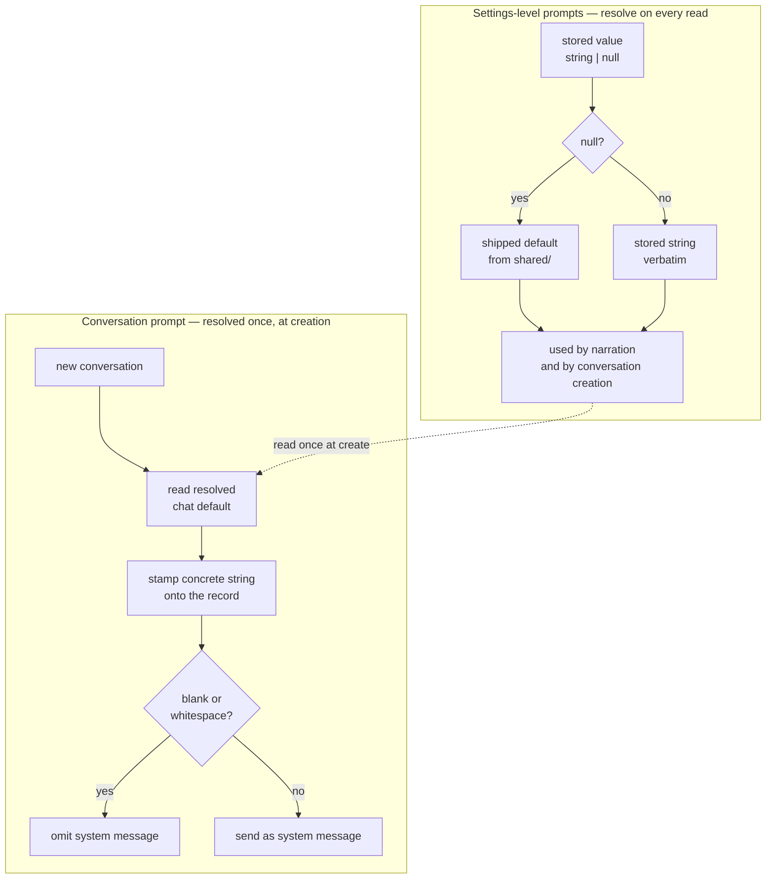

# feat: Editable system prompts for narration and chat

## Summary

Replace the hardcoded `personaPrompt()` with a stored, editable narration prompt, and give each
Conversation its own system prompt seeded from a global default at creation. Both are plain text
with reset-to-default and both travel over the WS contract. Persona Intensity stops composing the
narration prompt and narrows to what it already half is — the interface copy tone.

---

## Problem Frame

The narration system prompt is built by `personaPrompt()` in `server/src/narration/narrator.ts`,
fusing HAL's voice, the tag glossary, and the honesty rules into one hardcoded string. The only
control is a three-way intensity switch that swaps the closing sentence. Chat sends no system
prompt at all — `server/src/chat.ts` maps stored messages straight to the provider.

Research surfaced one constraint the origin document could not have known: `personaIntensity` has a
second consumer. `ui/src/persona.ts` indexes a 14-key copy table by intensity, threaded through
`ui/src/App.tsx` into the chat pane, narration pane, and session picker. Removing the setting
outright would delete working UI behavior that has nothing to do with the system prompt.

---

## Requirements

Carried from origin. R-IDs are the origin's.

**Narration prompt** — R1–R6. Whole prompt editable as one block (R1), one prompt across all
Adapters (R2), three presets seed it (R3), seeding over edited text warns first (R4), Persona
Intensity removed as a prompt input (R5), edits apply to the next narration and never rewrite the
feed (R6).

**Chat prompt** — R7–R11. Per-Conversation prompt (R7), copied from the global default at creation
(R8), editing the default leaves existing Conversations untouched (R9), the shipped default is
empty (R10), a blank prompt omits the system message entirely (R11).

**Defaults, reset, upgrades** — R12–R14. Reset to shipped default (R12), an unedited prompt follows
the shipped default across upgrades (R13), an edited prompt is never overwritten (R14).

**Reach** — R15. Both prompts readable and writable over the protocol.

**R5 amendment.** Research showed R5's literal reading would also delete the interface copy tone
table. `personaIntensity` is kept and narrowed to interface copy only; it stops feeding the
narration prompt, which is R5's intent. `CONCEPTS.md` gets a narrowed definition rather than a
deletion.

---

## Key Technical Decisions

**`null` means "never edited"; the shipped default resolves at read time.** The two settings-level
prompts are stored as `string | null`. `null` resolves to the shipped constant every time it is
read, so a release that changes a default reaches anyone who never touched it (R13), while any
stored string is returned verbatim (R14). This avoids comparing stored text against historical
defaults. The existing merge in `server/src/storage/settings.ts` already supports it: `keep()`
preserves a value only when the patch key is `undefined`, so a patch carrying `null` is a reset
(R12) and needs no new message type.

**An empty string is not `null`.** Nullish coalescing distinguishes a prompt the user deliberately
blanked (stays blank) from one never touched (follows the default). This matters most for chat,
where blanking is a legitimate end state.

**A Conversation's prompt is a concrete copy, not a reference.** `Conversation.systemPrompt` holds
a string stamped at creation from the resolved global default, never a null that re-resolves. A
re-resolving field would make an edit to the global default retroactively change every existing
thread, contradicting R9. An absent field on Conversations written before this change reads as
empty, which is exactly today's behavior.

**Shipped defaults and presets live in `shared/`.** Both sides need the same text: the server to
resolve `null` at send time, the client to render an unedited prompt and to seed a preset. Putting
them in `shared/src/` keeps `shared/` the single source of truth per `AGENTS.md` and means presets
are seeded by an ordinary `update-settings` patch rather than a new round trip.

**Presets are decoupled from `PersonaIntensity`.** The three preset entries carry their own ids and
labels rather than reusing the intensity union. Reusing it would re-couple prompt composition to a
setting R5 exists to disconnect, and the two would drift the moment a fourth preset appears.

**The narration prompt needs no new plumbing to apply next-narration.** `narrate()` calls
`settings.get()` at request time, matching the settings-apply-next-request rule the store documents.
R6 falls out of the existing design; the only change is which field it reads.

**Preset-warning logic is a pure module.** The decision to warn before overwriting (R4) moves into
a small pure helper in `ui/src/`, mirroring `ui/src/lens.ts` and `ui/src/colors.ts`. The repo has no
component-test harness — UI tests cover pure modules and the HAL aesthetic is screenshot-verified —
so this is how R4 gets real coverage without introducing one.

---

## High-Level Technical Design

The two legs resolve defaults differently, which is the subtlest part of this plan.

The dotted edge is the only coupling: after creation a Conversation never consults the global
default again, which is what keeps R9 true.

---

## Implementation Units

### U1. Prompt defaults, wire contract, and settings storage

**Goal:** Land the shipped defaults and presets, extend the wire contract with the two
settings-level prompts, and teach the settings store to persist them with null-means-default.

**Requirements:** R1, R2, R10, R12, R13, R14, R15.

**Dependencies:** none.

**Files:**
- `shared/src/prompts.ts` (new) — `DEFAULT_NARRATION_PROMPT`, `DEFAULT_CHAT_PROMPT`,
  `NARRATION_PRESETS`
- `shared/src/types.ts` — add `narrationPrompt: string | null` and `chatDefaultPrompt: string | null`
  to `Settings`; `SettingsPatch` picks them up through the existing `Partial<...>`
- `server/src/storage/settings.ts` — defaults and merge entries
- `server/test/storage/storage.test.ts`

**Approach:** `DEFAULT_NARRATION_PROMPT` is the current `personaPrompt("medium")` output as a single
literal — base text plus the medium closing sentence — so nothing changes on screen for a user who
never opens the editor. `NARRATION_PRESETS` is an ordered list of `{ id, label, text }` carrying the
three current wordings. `DEFAULT_CHAT_PROMPT` is the empty string. Both new `Settings` fields default
to `null` and join the explicit key list in `merge()`; no new merge helper is needed, since `keep()`
already gives reset-by-null and preserve-on-undefined.

**Patterns to follow:** the explicit key list in `merge()` and the comment above it explaining why
keys are listed rather than spread; `DEFAULT_SETTINGS` as the single defaults object.

**Test scenarios:**
- A stored settings file with no prompt keys loads both prompts as `null`.
- A patch carrying a prompt string stores it verbatim and leaves the other prompt untouched.
- A patch carrying `null` for an already-stored prompt clears it back to `null` (covers R12).
- A patch carrying an empty string stores an empty string, distinct from `null` (covers the
  blanked-on-purpose case).
- Against a changed shipped default, an unedited prompt resolves to the new text while a stored
  string resolves to itself (covers R13, R14, AE4).
- A patch touching only `providerEndpoint` leaves both prompts unchanged.
- `DEFAULT_NARRATION_PROMPT` is character-identical to the current medium-intensity output, guarding
  the no-visible-change claim.

**Verification:** typecheck passes across both tsconfigs; the settings suite covers store, clear,
and preserve for both prompts.

---

### U2. Narration sends the resolved narration prompt

**Goal:** Narration reads the stored prompt instead of composing one from intensity, and
`personaPrompt()` is deleted.

**Requirements:** R1, R2, R5, R6.

**Dependencies:** U1.

**Files:**
- `server/src/narration/narrator.ts`
- `server/test/narration/narration.test.ts`

**Approach:** `narrate()` resolves `narrationPrompt ?? DEFAULT_NARRATION_PROMPT` and sends it as the
system message. The user message carrying the `Session activity:` envelope is unchanged — this plan
does not touch how events are assembled. Delete `personaPrompt()` and its `PersonaIntensity` import;
existing tests that assert on its output move to asserting on the message the narrator sends. One
prompt serves every Adapter (R2) because the field is global and nothing in `narrate()` is adapter-
aware.

**Patterns to follow:** `narrate()` already calls `settings.get()` per request — keep that, do not
cache the prompt on the service.

**Test scenarios:**
- With no stored prompt, the system message equals the shipped default.
- With a stored prompt, the system message equals it verbatim.
- With a stored prompt saved between two narrations, the second narration uses the new text and the
  first entry in the feed is unchanged (covers R6, AE7).
- Narration for events from any registered Adapter sends the same system message (covers R2).
- The `Session activity:` user message is byte-identical to today's for a fixed event batch.

**Verification:** narration suite green; no remaining reference to `personaPrompt` in the server.

---

### U3. Conversations carry a system prompt, seeded at creation and omitted when blank

**Goal:** Give each Conversation a stored prompt, stamp it from the resolved global default at
creation, send it as a system message, and omit the message entirely when it is blank.

**Requirements:** R7, R8, R9, R10, R11, R15.

**Dependencies:** U1.

**Files:**
- `shared/src/types.ts` — `systemPrompt?: string` on `ConversationMeta`; a
  `SetConversationPromptMessage` added to `ClientMessage`
- `server/src/storage/conversations.ts` — `create` takes the prompt; new `setSystemPrompt`
- `server/src/chat.ts` — seed at create, handle the new message, build the outgoing message list
- `server/test/chat-service.test.ts`

**Approach:** `create` gains a prompt parameter and stamps a concrete string. `ChatService` resolves
`chatDefaultPrompt ?? DEFAULT_CHAT_PROMPT` server-side at creation rather than trusting a
client-supplied value, mirroring how the handler already pins `chatModel` server-side on a fresh
install. `setSystemPrompt` follows `setModel` exactly — same lock, same broadcast. In
`runGeneration`, the system message is prepended only when the resolved prompt has non-whitespace
content; otherwise the message list is exactly what it is today. The new client message carries a
`conversationId` and so inherits the existing UUID guard at the top of `handle`.

**Patterns to follow:** `setModel` for the store method and its broadcast; the UUID validation guard
in `handle`; server-side defaulting as done for `chatModel` in the `new-conversation` case.

**Test scenarios:**
- A Conversation created with a blank global default sends no system message at all (covers R11,
  AE1, AE6).
- A Conversation created with a non-empty global default sends it as the system message.
- Editing the global default after creation leaves an existing Conversation's stored prompt
  unchanged (covers R9, AE5).
- A prompt of only whitespace is treated as blank and omits the system message.
- `set-conversation-prompt` updates the target Conversation, broadcasts it, and leaves others alone.
- `set-conversation-prompt` with a non-UUID id is rejected before reaching the store.
- A Conversation record written without the field loads and behaves as blank.
- An edited prompt is used for the next message while messages already stored are unchanged.

**Verification:** chat-service suite green; a Conversation JSON written before this change still
opens and sends.

---

### U4. Settings drawer: prompt editors, presets, and the narrowed tone control

**Goal:** Add the narration prompt editor with presets and reset, add the chat default prompt
editor, and relabel the intensity control to what it now means.

**Requirements:** R1, R3, R4, R5, R12.

**Dependencies:** U1.

**Files:**
- `ui/src/prompts.ts` (new) — pure helpers: is a stored prompt edited, should seeding warn
- `ui/src/components/SettingsPanel.tsx`
- `ui/src/styles.css` — textarea styling for the drawer
- `ui/test/prompts.test.ts` (new)

**Approach:** A `system prompts` fieldset holds two textareas. Each shows the resolved text — the
stored string when present, the shipped default when `null` — with a reset control that sends the
prompt key as `null`. Preset buttons seed the narration textarea; when the stored value is a string
the user has edited, seeding confirms first (R4). Writes go through the existing `update-settings`
patch, so no new server handling is needed. The `persona intensity` legend becomes an
interface-copy label with a short note that it no longer affects narration; the control itself and
the three values are unchanged.

**Patterns to follow:** the existing `field` / `fieldset` / `segmented` structure in the drawer; the
endpoint field's local-state-plus-apply shape for text that should not patch on every keystroke;
pure-module-plus-test as in `ui/src/lens.ts` and `ui/src/colors.ts`.

**Test scenarios:**
- `ui/test/prompts.test.ts`: a `null` stored prompt is reported unedited, so seeding does not warn
  (covers R4, AE3).
- A stored string differing from the shipped default is reported edited, so seeding warns
  (covers R4, AE2).
- A stored string identical to the shipped default is reported unedited — clicking reset then a
  preset should not nag.
- An empty stored string is reported edited, since blanking is a deliberate act.
- Resolution returns the shipped default for `null` and the stored value for any string, including
  empty.

**Verification:** the pure-helper suite is green and the drawer renders both editors; the HAL
aesthetic of the new fieldset is confirmed by screenshot per repo convention, not asserted.

---

### U5. Chat pane: per-conversation prompt editor

**Goal:** Let the active Conversation's prompt be viewed, edited, and reset from the chat pane.

**Requirements:** R7, R12.

**Dependencies:** U3, U4.

**Files:**
- `ui/src/components/ChatPane.tsx`
- `ui/src/styles.css`

**Approach:** A collapsed disclosure in the conversation header, beside the model switcher, opening
a textarea over the active Conversation's stored prompt. Saving sends `set-conversation-prompt`;
reset sends the resolved global chat default, since a Conversation's default is a copy rather than a
live reference. Collapsed by default so the common case — never touching it — costs no vertical
space. Reuses the resolution and edited-state helpers from U4 rather than restating the rules.

**Patterns to follow:** `switchModel` in the same component for the send-on-change shape; the
existing conversation header layout; the flex `min-height` guard recorded in
`docs/solutions/flexbox-min-height-scroll-trap.md` when adding a growable element above the
scrolling message list.

**Test expectation:** none — presentation over the helpers already covered in U4 and the store state
already covered by the conversation broadcast in U3. Verified by screenshot and by exercising the
flow in the running app.

**Verification:** opening a Conversation shows its stored prompt; editing and sending a message uses
the new text; the message list still scrolls with the editor expanded.

---

### U6. Vocabulary and guide updates

**Goal:** Bring the domain vocabulary and the agent guide in line with what the code now does.

**Requirements:** R5.

**Dependencies:** U1, U2, U4.

**Files:**
- `CONCEPTS.md`
- `AGENTS.md`

**Approach:** Narrow the Persona Intensity entry to interface copy only, stating plainly that it no
longer affects narration. Add a System Prompt entry covering both legs and the difference between a
prompt that tracks the shipped default and a Conversation's copy taken at creation. Point the key
documents list at this plan and its origin brief.

**Patterns to follow:** the existing `CONCEPTS.md` entry shape — a short definition, then the
non-obvious consequence, with `*Avoid:*` only where a term is genuinely confusable.

**Test expectation:** none — documentation.

**Verification:** no `CONCEPTS.md` entry still claims Persona Intensity governs narration.

---

## Scope Boundaries

Carried from origin:

- A view of the assembled request — system prompt plus the real `Session activity:` block. The
  natural next step if narration debugging becomes the pressure.
- A live preview pane streaming requests while editing.
- Per-Adapter narration prompts.
- Saved prompt profiles, prompt history, or versioning.
- Validation or enforcement of what the user writes, including deleting the honesty rules.

### Deferred to Follow-Up Work

- Promoting `shared/` to a real workspace. This plan adds `shared/src/prompts.ts`, a fourth
  hand-computed `../` depth, worsening the P2 residual in
  `docs/residual-review-findings/feat-hal-1000-v1.md`. It stays a standalone mechanical change.

---

## Risks & Dependencies

- **Deleting the tag glossary or honesty rules degrades narration.** Accepted in the origin brief as
  the user's call; reset is the remedy and nothing guards against it.
- **Retiring `personaPrompt()` is a breaking wire-contract change** in the sense that
  `personaIntensity` no longer affects narration. HAL is local and single-user with no external
  clients, so no compatibility shim is planned.
- **Presets freeze today's wordings.** Once the shipped default changes in a later release, presets
  and default can drift apart. Acceptable while all four strings live in one file.
- **U5 adds a growable element above a scrolling list**, the exact shape that produced the scroll
  trap in `docs/solutions/flexbox-min-height-scroll-trap.md`.

---

## Open Questions

**Deferred to implementation**

- Whether the drawer textareas need an explicit apply control like the endpoint field, or can patch
  on blur. Depends on how a multi-paragraph prompt feels to edit.
- Exact preset labels. The origin brief calls them low, medium, and high; the ids are decoupled from
  `PersonaIntensity`, so friendlier labels are available if they read better in the drawer.

---

## Sources & Research

- `server/src/narration/narrator.ts` — `personaPrompt()` and the `narrate()` request; `settings.get()`
  per request is what makes R6 free.
- `server/src/chat.ts` — `runGeneration` builds the message list with no system message;
  `new-conversation` already pins `chatModel` server-side, the pattern U3 mirrors.
- `server/src/storage/settings.ts` — `merge()` and `keep()`; the undefined-vs-null distinction the
  null-means-default decision rests on.
- `server/src/storage/conversations.ts` — `create` and `setModel`, the precedent for per-Conversation
  state.
- `ui/src/persona.ts`, `ui/src/App.tsx` — the second consumer of `personaIntensity` that amended R5.
- `ui/src/components/SettingsPanel.tsx` — the drawer's field patterns and the intensity control.
- `AGENTS.md` — agent-native parity; `shared/src/types.ts` as the single source of truth.
- `docs/solutions/flexbox-min-height-scroll-trap.md` — the layout trap U5 risks re-creating.
- `docs/residual-review-findings/feat-hal-1000-v1.md` — the `shared/` workspace residual this plan
  adds to.
