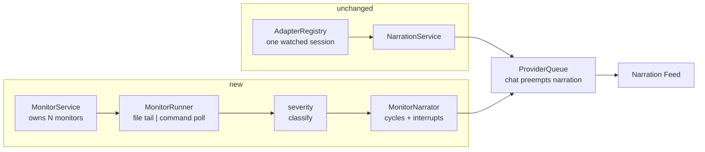
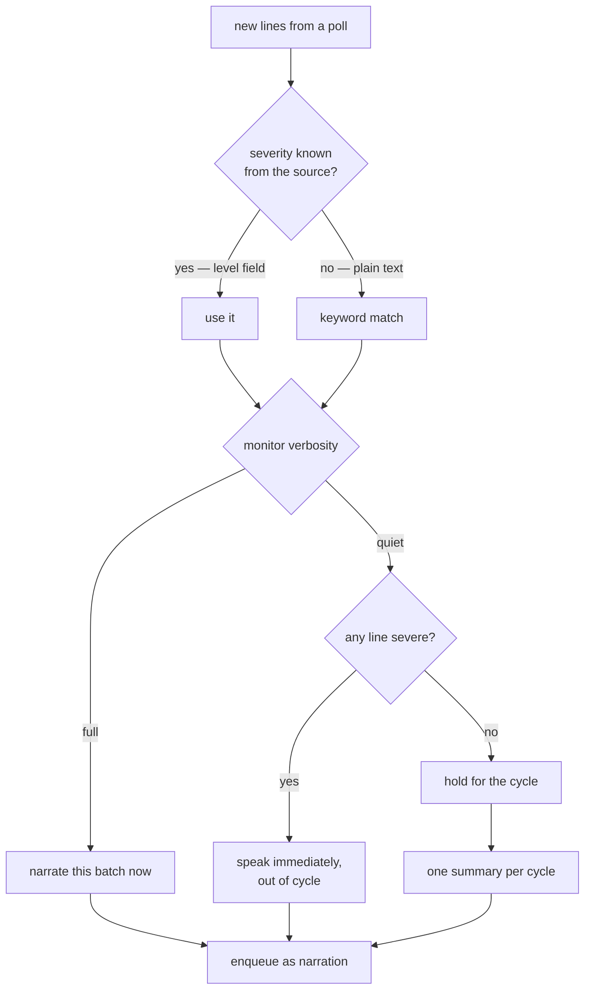

# feat: Ambient log monitors

## Summary

Add the Monitor: a standing observation source, pointed at a file path or a recurring command, that
runs alongside the unchanged Watched Session. Monitors are plural, each quiet or narrated in full,
and a severe line interrupts the quiet cadence without changing what HAL narrates. HAL ships a
per-OS suggestion list and marks entries unavailable when their target is absent.

---

## Problem Frame

`AdapterRegistry` holds one `watched` adapter and detaches before attaching another; `Coalescer`
keeps one pending queue stamped with one adapter per drain; `NarrationPane` renders the picker
instead of the feed when nothing is attached. That shape fits a coding session and not a machine.

The origin brief chose to keep it. Rather than generalising the Watched Session into peer sources,
Monitors become a second role with their own owner, their own cadence, and their own prompt
(see origin: `docs/brainstorms/2026-08-06-ambient-log-monitors-requirements.md`).

Two platform facts constrain what is buildable, both verified on the development machine. The logs
carrying machine health are not text files — Windows Application and System hold 37,286 and 39,691
records behind `Get-WinEvent`, and systemd exposes the journal through `journalctl`. And those
command sources re-emit: `Get-WinEvent -MaxEvents 3` returns the same three records every run, so a
byte offset is not a watermark.

---

## Requirements

Carried from origin. R-IDs are the origin's.

**The Monitor** — R1–R6. File or command source (R1), plural and independently managed (R2), starts
at the present (R3), survives restart (R4), reports an unreadable target in persona and keeps trying
(R5), configured commands stay visible and editable (R6).

**Attention and narration** — R7–R12. Per-Monitor quiet or full (R7), one summary per cycle when
quiet (R8), immediate speech on a severe line (R9), interrupting never changes what is narrated in
full (R10), severity judged without the model (R11), Monitors narrate from their own editable prompt
(R12).

**Suggested logs** — R13–R15. Per-OS suggestions (R13), covering both acquisition modes including
the Windows event logs and the journal (R14), absent targets shown unavailable (R15).

**Coexistence** — R16–R18. The Watched Session is unchanged (R16), one shared feed with visual
distinction (R17), Monitors run independently of any Session (R18).

---

## Key Technical Decisions

**Monitors live outside `AdapterRegistry`.** That class exists to discover Sessions, resolve which
adapter owns one, and hold the single `watched` id. A Monitor is none of those things — it is
configured, plural, and never discovered. Routing Monitors through it would force `watched` to become
plural, which is the peer-source generalisation the brief rejected. A parallel owner keeps the
rejected design rejected.

**Each Monitor carries its own colour.** Origin R17 says "their Adapter's colour," written when
Monitors were assumed to be Adapters. They are not, and several Monitors need to be told apart from
each other, not just from Sessions. Colour normalisation reuses `server/src/storage/colors.ts`
unchanged, so the readability floor and the distance from HAL's reserved red still apply.

**Severity is two-tier: read it when the source states it, guess it otherwise.** `Get-WinEvent`
exposes `LevelDisplayName` and `journalctl -o json` exposes `PRIORITY`; those are authoritative and
need no heuristic. A plain text tail has nothing — the Ollama server log is raw llama.cpp slot output
with no timestamps or levels — so keyword matching is the only option there. Treating both the same
would either discard real signal or invent it.

**Command output is diffed by line identity, not by offset.** A re-emitting command needs a
watermark. The general mechanism is a retained set of recently emitted line hashes; lines absent from
it are new. Suggestions whose command supports incremental output additionally carry a `since`
template that the runner substitutes with the last poll time, so `journalctl` and `Get-WinEvent` do
the filtering themselves and the hash window stays small.

**Monitor events are their own type; `SessionEvent` is untouched.** `SessionEvent.kind` names
coding-agent concepts — `thinking`, `tool-result`, `toolUses` — that a log line has none of. A
Monitor event carries a timestamp, an optional severity, an optional source label, and text.
Widening the union would push agent-shaped optionality into the session path for no benefit.

**Monitor narration reuses the `narration` job class rather than widening the queue.** `JobClass` is
`chat | narration`, and chat preempting narration is the documented scheduling rule. Monitor work
enqueues as narration, so chat still wins and nothing about the existing contract changes. Ordering
*within* monitor work — a severe line ahead of a routine summary — is decided by the monitor narrator
before it enqueues, not by a third class. Consequence, accepted: a severe line is recognised
instantly (R11) but its narration can still wait behind an in-flight session narration.

**Commands run through the platform shell, bounded.** `Get-WinEvent` and `journalctl` are shell
constructs, so an argv-only runner would not reach the logs this feature exists for. Mitigations are
that commands only run because the user added them, stay visible and editable (R6), never request
elevation, run under a timeout, and have their output capped before it reaches the event path.

**Monitors poll on an interval, like the existing watcher.** `ClaudeCodeWatcher` polls rather than
using filesystem events, which is what makes its Windows behaviour predictable. Monitors match it
rather than introducing a second liveness model.

---

## High-Level Technical Design

Two owners, one feed, one provider queue.



How a Monitor's events reach the feed:



Interrupting emits an entry and returns the Monitor to its cadence; it never changes verbosity and
never changes which source is narrated in full (R10).

---

## Output Structure

```text
server/src/monitors/
  monitor.ts        # Monitor + MonitorEvent shapes, the runner seam
  runner.ts         # file tail and command acquisition, watermarking
  severity.ts       # two-tier classification (pure)
  service.ts        # owns monitors, lifecycle, the monitor protocol
  narrator.ts       # cadence, interrupts, monitor prompt
  catalog.ts        # per-OS suggestions and availability probing
```

The per-unit `**Files:**` lists remain authoritative; this is the shape, not a constraint.

---

## Implementation Units

### Phase 1 — Foundation

### U1. Monitor shapes, storage, and wire contract

**Goal:** Define what a Monitor is, persist a list of them, and expose create/update/remove over the
protocol.

**Requirements:** R1, R2, R4, R6, R7, R17.

**Dependencies:** none.

**Files:**
- `shared/src/types.ts` — `Monitor`, `MonitorEvent`, `MonitorSource`, monitor client/server messages
- `server/src/monitors/monitor.ts` (new) — server-side shapes and the runner seam
- `server/src/storage/monitors.ts` (new) — persistence
- `server/test/storage/monitors.test.ts` (new)

**Approach:** A Monitor holds an id, a label, a source (a file path, or a command with an interval), a
verbosity, a colour, and an enabled flag. Storage mirrors `ConversationStore`: one JSON file, written
through `storage/atomic.ts`, mutations serialised per monitor id. Colour goes through
`storage/colors.ts` on write and on load, exactly as adapter colour already does, so a hand-edited
file is corrected rather than trusted. Monitor ids are server-generated UUIDs, never client-supplied,
which sidesteps the path-segment validation the conversation store needs.

**Patterns to follow:** `server/src/storage/conversations.ts` for the per-id lock and atomic write;
`server/src/storage/settings.ts` `mergeAdapters` for per-id merge and colour normalisation on both
paths; `SelectModelMessage`/`SetConversationPromptMessage` for message shape.

**Test scenarios:**
- Create, list, update, and remove round-trip through a fresh store instance (restart survival, R4).
- A monitor colour below the readability floor is lifted on write and again on load.
- Updating one monitor leaves the others' fields untouched.
- A stored file with an unknown extra key loads without error.
- A malformed monitor entry is dropped rather than crashing the load.
- Removing a monitor that does not exist is a no-op, not a throw.

**Verification:** monitors persist across a restart with normalised colours; typecheck passes on both
tsconfigs.

---

### Phase 2 — Acquisition

### U2. File-tail acquisition

**Goal:** A Monitor pointed at a path emits new lines from the present, and reports an unreadable
target without dying.

**Requirements:** R1, R3, R5.

**Dependencies:** U1.

**Files:**
- `server/src/monitors/runner.ts` (new)
- `server/test/monitors/runner-file.test.ts` (new)

**Approach:** Poll on an interval, holding a byte offset per monitor. Start at end-of-file so a new
Monitor never replays history (R3), matching how attaching to a Session already behaves. A file that
shrank or was replaced resets the offset and reports a gap rather than emitting garbage — the same
`unreadable` reasoning `ClaudeCodeWatcher` already implements. A missing file is a recoverable state,
not a terminal one: keep polling and recover silently when it returns.

**Patterns to follow:** `server/src/watchers/claude-code.ts` for offset tracking, truncation
detection, and the poll loop; the `unreadable` semantics documented in `CONCEPTS.md`.

**Test scenarios:**
- A monitor started against an existing file emits nothing until new lines are appended (R3).
- Appended lines are emitted once and not re-emitted on the next poll.
- Truncating the file resets the offset and reports the loss rather than emitting the whole file.
- Deleting the file reports unreadable in persona; recreating it resumes without a restart (AE5).
- A partial trailing line without a newline is held until it completes.
- A file with CRLF line endings yields lines without carriage returns (Windows is the primary OS).

**Verification:** a monitor pointed at a live-appended fixture emits each appended line exactly once
and survives deletion and recreation.

---

### U3. Command acquisition and watermarking

**Goal:** A Monitor backed by a command runs it on an interval and emits only genuinely new output.

**Requirements:** R1, R5, R6, R14.

**Dependencies:** U1, U2.

**Files:**
- `server/src/monitors/runner.ts`
- `server/test/monitors/runner-command.test.ts` (new)

**Approach:** Run the command through the platform shell under a timeout, capping captured output.
New-ness is decided by a retained window of recently emitted line hashes; a line absent from the
window is new. A source may also carry a `since` template — a placeholder the runner substitutes with
the last successful poll time — so `journalctl --since` and `Get-WinEvent`'s time filter narrow the
output at the source and the hash window stays small. A non-zero exit or a timeout is reported the
same way an unreadable file is (R5) and does not stop the schedule.

**Execution note:** Start with a failing test for the re-emission case — a command whose output is
identical on consecutive runs must yield events once. That is the defect this unit exists to prevent
and the easiest one to write past accidentally.

**Patterns to follow:** the poll-and-recover shape from U2; `server/src/providers/ollama.ts` for
timeout-bounded external calls.

**Test scenarios:**
- A command whose output is identical on consecutive polls emits events on the first poll only.
- A command that appends one new line per poll emits exactly that line each time.
- A command that re-emits its window with one new line at the end emits only the new line.
- The `since` placeholder is substituted with the previous poll time and is absent from the first run.
- A non-zero exit is reported in persona and the schedule continues.
- A command that exceeds the timeout is killed, reported, and retried next interval.
- Output beyond the cap is truncated rather than buffered without bound.
- A command producing no output emits nothing and is not treated as a failure.

**Verification:** a command monitor against a script that re-emits a fixed window yields each line
once; killing and restarting the process does not replay history.

---

### Phase 3 — Judgment and voice

### U4. Severity classification

**Goal:** Decide whether a line is severe, using the source's own level when it has one.

**Requirements:** R9, R11.

**Dependencies:** U1.

**Files:**
- `server/src/monitors/severity.ts` (new)
- `server/test/monitors/severity.test.ts` (new)

**Approach:** A pure module, no model call and no I/O, so R11 holds by construction. Two tiers. When
an event arrives with a level already attached — parsed from structured command output — that level
decides. Otherwise match keywords against the text. Keyword matching is deliberately conservative:
false negatives are quieter than false positives, and a monitor that cries wolf gets switched off.
The rule is a named export so it is changeable in one place, which is the stated remedy for it being
wrong (see origin: Dependencies / Assumptions).

**Patterns to follow:** `ui/src/lens.ts` and `server/src/storage/colors.ts` as pure, separately tested
modules.

**Test scenarios:**
- A structured event carrying an error-equivalent level is severe regardless of its text.
- A structured event carrying an informational level is not severe even when its text contains an
  alarming word.
- An unstructured line containing an error keyword is severe.
- Keyword matching is case-insensitive.
- A line where the keyword appears inside an unrelated word is not severe.
- An empty or whitespace-only line is not severe.
- **Covers AE3.** Classification of a large batch completes without I/O — the module has no async
  surface, so severity is recognised even while chat is streaming.

**Verification:** the severity suite passes and the module imports nothing from the provider or
storage layers.

---

### U5. Monitor narration — cadence, interrupts, and prompt

**Goal:** Turn monitor events into feed entries: one summary per cycle when quiet, immediate speech
on severity, continuous narration when full.

**Requirements:** R7, R8, R9, R10, R12, R17, R18.

**Dependencies:** U1, U4.

**Files:**
- `server/src/monitors/narrator.ts` (new)
- `shared/src/prompts.ts` — the monitor default prompt and its preset
- `shared/src/types.ts` — `monitorPrompt` on `Settings`; monitor fields on `NarrationEntry`
- `server/src/storage/settings.ts` — the new prompt field
- `server/test/monitors/narrator.test.ts` (new)

**Approach:** Per-monitor pending buffers with per-monitor cycle timers. Quiet monitors hold events
until the cycle elapses, then enqueue one summarising narration; a severe line short-circuits that
and enqueues immediately, leaving verbosity and cadence unchanged (R10). Full monitors enqueue as
events arrive, like session narration. Everything enqueues as the `narration` job class so chat still
preempts. The monitor prompt is a new settings-level prompt following exactly the pattern shipped for
the narration and chat prompts — `string | null`, null resolving to a shipped default, reset by
patching null. Entries carry their monitor's id so the feed can colour and label them.

**Patterns to follow:** `server/src/narration/narrator.ts` for the enqueue-and-append shape and the
epoch guard that drops results outliving their attachment; `shared/src/prompts.ts` for
null-means-default resolution; `server/src/narration/coalescer.ts` for buffering with a char budget.

**Test scenarios:**
- A quiet monitor with only routine events produces exactly one entry per cycle (AE1).
- A quiet monitor seeing a severe event produces an entry immediately, before the cycle elapses (AE2).
- After interrupting, the monitor is still quiet and its next cycle behaves normally (AE2, R10).
- Interrupting does not change which source the session narrator is narrating (R10).
- A full monitor narrates arriving batches without waiting for a cycle.
- Two monitors run independently — one interrupting does not flush the other's buffer.
- Monitor entries carry their monitor id and session narration entries do not (R17).
- With no Watched Session attached, monitors still produce entries (R18, AE1).
- An edited monitor prompt applies to the next entry and leaves prior entries unchanged (AE7).
- The shipped monitor prompt is used when none is stored.
- A monitor removed mid-cycle produces no further entries.

**Verification:** a quiet monitor fed routine then severe events produces one cycle summary and one
immediate entry, in that order, with session narration unaffected.

---

### U6. MonitorService and lifecycle

**Goal:** Own the monitors, run their runners, answer the monitor protocol, and restore on boot.

**Requirements:** R2, R4, R5, R18.

**Dependencies:** U1, U2, U3, U5.

**Files:**
- `server/src/monitors/service.ts` (new)
- `server/src/app.ts` — wiring alongside the registry
- `server/test/monitors/service.test.ts` (new)

**Approach:** Mirrors `AdapterRegistry`'s role without its single-watched constraint: hold the
monitors, start a runner per enabled monitor, broadcast the list on connect and after every change,
and handle the monitor messages. Monitors resume on boot from storage (R4) and start at the present
(R3). Disabling stops that monitor's runner and leaves its prior entries in the feed, matching how
disabling an adapter already behaves. Every fire-and-forget handler catches, per the repo's crash
lesson.

**Patterns to follow:** `server/src/watchers/registry.ts` for the hub wiring, broadcast-on-connect,
and the `.catch` on the message handler; `server/src/app.ts` for construction order.

**Test scenarios:**
- Monitors present in storage start on boot and emit from the present, not from history (R4, R3).
- Adding a monitor starts its runner without a restart.
- Disabling a monitor stops its runner; entries it already produced remain in the feed.
- Re-enabling starts it again from the present rather than replaying.
- Removing a monitor stops its runner and drops it from the broadcast list.
- A runner that throws is caught and does not crash the process or stop other monitors.
- The monitor list is broadcast on client connect.
- Monitors run with no Watched Session attached and are undisturbed by attach and detach (R18, AE4).

**Verification:** the app boots with stored monitors running, and attaching or detaching a session
leaves them untouched.

---

### Phase 4 — Surfaces

### U7. Suggested-log catalog with availability probing

**Goal:** Offer per-OS suggestions and mark the ones this machine cannot serve.

**Requirements:** R13, R14, R15.

**Dependencies:** U1.

**Files:**
- `server/src/monitors/catalog.ts` (new)
- `shared/src/types.ts` — suggestion shape and its message
- `server/test/monitors/catalog.test.ts` (new)

**Approach:** A static per-OS list, each entry naming a label, a source, a one-line reason it is worth
watching, and an availability check. File suggestions probe for the path; command suggestions probe
for the executable. Availability is computed on request rather than cached, because a target can
appear after install. Windows-first, since it is the primary development OS: the Application and
System event logs via `Get-WinEvent`, the Ollama server log (verified present at 1.9 MB and genuinely
useful — model loads and request failures), and the servicing logs marked as high-volume. Linux:
`journalctl` for the system and for a named unit, plus `/var/log/syslog` and `/var/log/auth.log`
where they exist.

**Patterns to follow:** `server/src/readiness.ts` for probing local prerequisites and reporting a
three-valued result rather than a boolean.

**Test scenarios:**
- The suggestion list is filtered to the current platform.
- A file suggestion whose path exists is available; one whose path does not is unavailable (AE6).
- A command suggestion whose executable is missing is unavailable rather than offered.
- Availability is re-evaluated per request, so a target created after boot becomes available.
- Every suggestion carries a non-empty label and reason — guards a half-filled catalog entry.
- Turning a suggestion into a monitor produces a monitor whose source matches the suggestion.

**Verification:** on this machine the Windows list marks the event-log and Ollama entries available;
the Linux-only entries do not appear.

---

### U8. Monitor management UI

**Goal:** Add, configure, and remove monitors, including from suggestions.

**Requirements:** R2, R6, R7, R13, R15.

**Dependencies:** U6, U7.

**Files:**
- `ui/src/components/MonitorsPanel.tsx` (new)
- `ui/src/components/SettingsPanel.tsx` — mount the section and the monitor prompt editor
- `ui/src/monitors.ts` (new) — pure helpers
- `ui/src/styles.css`
- `ui/test/monitors.test.ts` (new)

**Approach:** A monitors section in the settings drawer listing each monitor with its verbosity, its
colour, and enable and remove controls, plus a suggestion picker showing unavailable entries as
disabled with their reason. The monitor prompt editor reuses the shipped prompt-editor shape exactly,
including the preset-seeding warning. Command sources render their full command text so R6 holds
visibly. Pure helpers carry the testable decisions — suggestion availability presentation, whether a
monitor's configuration is complete enough to enable — because the repo has no component harness.

**Patterns to follow:** `ui/src/components/SettingsPanel.tsx` for `field`/`fieldset` structure, the
draft-then-apply shape, and the reset control; `ui/src/prompts.ts` as the pure-helper-plus-test
precedent; `ui/src/components/ColorField.tsx` for colour input.

**Test scenarios (pure helpers):**
- A suggestion marked unavailable is presented as disabled and carries its reason (AE6).
- A file monitor with an empty path is incomplete and cannot be enabled.
- A command monitor with an empty command or a non-positive interval is incomplete.
- A complete monitor of either source type is enableable.
- A command monitor's summary text includes the full command rather than eliding it (R6).

**Test expectation for the components themselves:** none — no component harness exists; verified by
screenshot and by exercising the flow in the running app, per repo convention.

**Verification:** a monitor added from a suggestion appears, runs, and produces entries without a
restart; its command is visible in the drawer.

---

### U9. Monitor entries in the feed

**Goal:** Render monitor entries in the shared feed, distinguishable from session narration.

**Requirements:** R17.

**Dependencies:** U5, U6.

**Files:**
- `ui/src/components/NarrationPane.tsx`
- `ui/src/colors.ts` — resolve a monitor's colour for an entry
- `ui/src/styles.css`
- `ui/test/colors.test.ts`

**Approach:** Entries resolve colour from their monitor when they carry a monitor id, and from the
adapter otherwise, leaving HAL's own gap and status kinds on HAL's colour as they are today. Beyond
colour, monitor entries carry a small source label, since several monitors can share a hue after
normalisation and a summary reads differently from narration. The feed's existing empty-state logic
is adjusted so monitors alone produce a populated feed rather than the session picker — the one place
where the pane's single-watched-session assumption has to give.

**Patterns to follow:** `ui/src/colors.ts` `entryColor` and the provenance rules already shipped;
`ui/src/components/NarrationPane.tsx` feed-entry rendering.

**Test scenarios:**
- An entry carrying a monitor id resolves that monitor's colour.
- An entry carrying an adapter id resolves the adapter's colour, unchanged from today.
- Gap and status entries keep HAL's colour regardless of what else is running.
- An entry whose monitor has been removed falls back to HAL's colour rather than rendering undefined.

**Verification:** with a session and a monitor both running, entries from each are visually
distinguishable; with only monitors running, the feed renders instead of the picker.

---

### Phase 5 — Vocabulary

### U10. Vocabulary and guide updates

**Goal:** Record the Monitor in the project's shared vocabulary and point the guide at this work.

**Requirements:** R16.

**Dependencies:** U1, U5, U6.

**Files:**
- `CONCEPTS.md`
- `AGENTS.md`

**Approach:** Add Monitor, Monitor Verbosity, and Severity Interrupt as entries, each with the
non-obvious consequence rather than only a definition. Amend Watched Session to say it is one of two
observation roles and that its at-most-one rule is deliberate rather than incidental — the entry is
currently correct but reads as though it is the only way HAL observes. Extend the System Prompt entry
to cover the monitor prompt. Point the guide's key documents at this plan and its origin, and note
the monitors seam beside the existing watcher seam.

**Patterns to follow:** existing `CONCEPTS.md` entries — short definition, then the consequence, with
`*Avoid:*` only where a term is genuinely confusable.

**Test expectation:** none — documentation.

**Verification:** no `CONCEPTS.md` entry implies the Watched Session is HAL's only observation role.

---

## Scope Boundaries

Carried from origin:

- Promoting a Monitor to narrated-in-full automatically when something looks wrong.
- Model-based severity judgment.
- Alerting outside the app — notifications, email, webhooks.
- Generalising the Watched Session into a set of peer sources.
- Historical search, retention, or querying of log content.

### Deferred to Follow-Up Work

- Promoting `shared/` to a real workspace. This plan adds monitor shapes and a monitor prompt to
  `shared/`, deepening the hand-computed `../` depth problem recorded in
  `docs/residual-review-findings/feat-hal-1000-v1.md`. It remains a standalone mechanical change.
- A `conversation_missing`-style broadcast for operations on a removed monitor. The monitor handlers
  reproduce the existing silent-no-op shape; folding them into that accepted P3 fix is cheaper than
  solving it here.

---

## Risks & Dependencies

- **Severity will be wrong in both directions.** A conservative keyword rule under-reports; a
  structured level over-reports when a provider marks routine events as warnings. The remedy is that
  the rule is one pure module, changeable without touching the pipeline.
- **Command execution is the sharpest surface this project has added.** It is bounded by user
  authorship, visibility, a timeout, an output cap, and no elevation — but it is still scheduled
  execution of user-supplied shell text on the developer's machine.
- **Monitor volume can starve session narration.** Both classes share one narration lane. Several
  full-verbosity monitors will queue behind each other and behind chat; the visible failure is lag,
  not overload. Quiet-by-default is the mitigation.
- **The value is anticipated, not observed** (see origin: Dependencies / Assumptions). No monitoring
  practice exists today, which is why the catalog carries the weight. If it ships and goes unused,
  the catalog is the first thing to examine.
- **Windows event-log access may be slower than a file tail.** `Get-WinEvent` against a 39,691-record
  log is not instantaneous; the `since` template exists partly to bound it, and the interval default
  should assume seconds, not milliseconds.

---

## Open Questions

**Deferred to implementation**

- The default cycle length for a quiet monitor, and whether it is per monitor or global. It interacts
  with the command interval and is better chosen against real output volume.
- The size of the line-hash window in U3, which trades memory against the chance of re-emitting a
  line that scrolled out of it.
- The exact keyword set in U4, which should be chosen against real lines from the shipped suggestions
  rather than invented.
- Whether the monitor prompt needs its own preset list or a single shipped default is enough.

---

## Sources & Research

- `server/src/watchers/registry.ts` — the single `watched` adapter, `attach` detaching first, and the
  hub wiring the monitor service mirrors.
- `server/src/watchers/watcher.ts` — the agent-shaped `SessionEvent` and `SessionInfo` a Monitor does
  not fit.
- `server/src/watchers/claude-code.ts` — offset tracking, truncation handling, and the poll loop the
  file runner follows.
- `server/src/narration/narrator.ts`, `server/src/narration/coalescer.ts` — enqueue-and-append,
  the epoch guard, and buffering with a char budget.
- `server/src/providers/queue.ts` — `JobClass` is `chat | narration`; chat preempts and narration is
  aborted and re-queued.
- `server/src/storage/colors.ts`, `server/src/storage/conversations.ts` — colour normalisation on both
  paths, and the per-id lock plus atomic write.
- `shared/src/prompts.ts` — null-means-default prompt resolution the monitor prompt reuses.
- `ui/src/components/NarrationPane.tsx` — the feed's single-watched-session gate, adjusted in U9.
- Development machine probe: Windows Application and System event logs hold 37,286 and 39,691 records
  and expose `LevelDisplayName`; `Get-WinEvent -MaxEvents N` re-emits, establishing the watermark
  requirement; `%LOCALAPPDATA%\Ollama\server.log` is 1.9 MB of unstructured llama.cpp output with no
  levels or timestamps, establishing the keyword tier.
