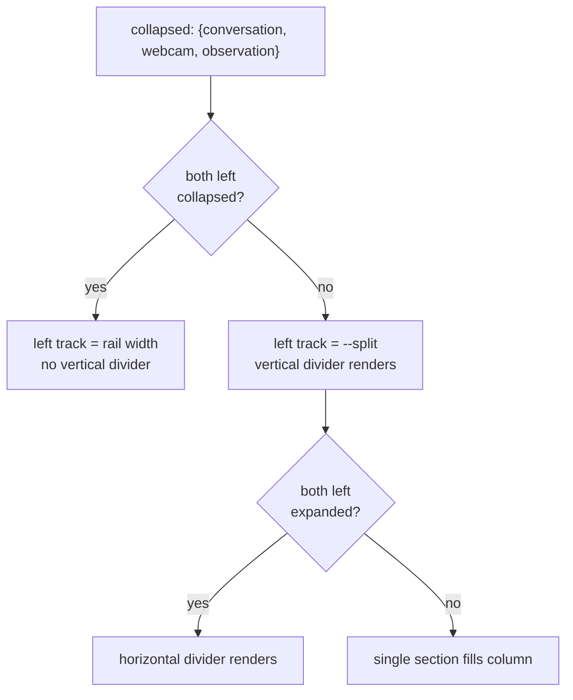

# feat: Collapsible three-section layout

## Summary

Replace the fixed two-column body with three independently collapsible sections: Conversation
and a new webcam placeholder stacked in a left column, Session Observation on the right. A
collapsed section becomes a labeled rail on its own edge that clicks to restore. Collapse state
and both divider positions persist in the browser. The webcam section ships as an empty framed
box.

---

## Problem Frame

`ui/src/App.tsx` renders the body as a two-column grid with a pointer-dragged `--split` clamped
between 30% and 80%, so neither section can get out of the other's way. The narration feed can
never reach the left edge, and a third of the window stays spent on an idle chat thread.

That clamp also blocks the webcam work. Adding a third section to a fixed grid shrinks all three
permanently. Collapsibility is what buys the room, which is why the layout change lands before
anything the webcam section will eventually do.

---

## Requirements

Carried from the origin document (see origin: `docs/brainstorms/2026-08-06-collapsible-three-section-layout-requirements.md`).

**Collapse and restore**

- R1. Each of the three sections has a control that collapses it.
- R2. A collapsed section renders as a rail on its own edge with its name and an expand
  affordance; activating the rail restores it.
- R3. The collapse control of the last visible section is disabled.
- R4. All three sections render together when none are collapsed.

**Layout geometry**

- R5. Conversation and Webcam stack vertically in a left column, Conversation on top; Session
  Observation is the right column.
- R6. The vertical divider is draggable and present only when at least one left-column section is
  expanded.
- R7. With both left sections collapsed, the left column is the rail strip alone and Session
  Observation fills the rest with no divider.
- R8. The horizontal divider between Conversation and Webcam is draggable and present only when
  both are expanded.
- R9. With Session Observation collapsed, the left column fills the remaining width.

**Persistence and defaults**

- R10. Collapse state for all three sections persists across reloads, in the browser.
- R11. Divider positions persist on the same terms.
- R12. First load with nothing stored shows all three sections.

**Webcam placeholder**

- R13. The webcam section renders a title and an empty body styled like the other two.
- R14. It carries no capture, device access, or permission prompt.

**Narrow viewports**

- R15. Below the existing breakpoint the sections stack in one column and dividers are inert;
  collapse, restore, and persistence still work.

---

## Key Technical Decisions

**Layout state lives in a pure module, not in `App.tsx`.** `ui/src/layout.ts` owns the state shape,
the storage round-trip, and the collapse rules as pure functions. `App.tsx` holds the value in
`useState` and calls into the module. This matches how `ui/src/lens.ts`, `ui/src/monitors.ts`, and
`ui/src/prompts.ts` are already split from their components, and it puts the last-visible guard and
the malformed-storage path under node-environment unit tests instead of jsdom.

**The grid template is derived, not stored.** `.layout` keeps three columns, and the left column's
track resolves to the rail width when both left sections are collapsed and to `var(--split)`
otherwise. The divider elements render conditionally rather than collapsing to zero width, so R7's
"no dividing bar" is literally true in the DOM and there is no invisible drag target at the seam.

**Storage failures degrade to defaults, never to a crash.** Reads are wrapped and any
throw or malformed payload yields the all-visible default. `localStorage` throws on access in some
privacy modes, and a layout module that can take the whole UI down is a worse trade than losing a
preference.

**Collapse state stays out of the WS contract.** `AGENTS.md` requires meaningful behavior to be
reachable through `shared/src/types.ts`. Collapsing a pane starts and stops nothing HAL does — no
observation, no narration — so it is a view preference and does not enter the protocol (see origin).
This is a deliberate carve-out, recorded here because a reviewer will look for it.

**Each section owns its own collapse control.** Session Observation already has
`.narration-header`; the webcam section gets one by construction; Conversation gains a slim header
row, which turns `.chat-pane` into a flex column wrapping its existing sidebar/main grid. A shared
button component keeps the three consistent without a wrapper component that would have to
re-plumb every pane's props.

---

## High-Level Technical Design

Collapse state is three booleans, and the body's grid resolves from them. The eight combinations
reduce to five distinct layouts:

| Conversation | Webcam | Observation | Left column track | Vertical divider | Horizontal divider |
|---|---|---|---|---|---|
| shown | shown | shown | `var(--split)` | yes | yes |
| shown | collapsed | shown | `var(--split)` | yes | no |
| collapsed | shown | shown | `var(--split)` | yes | no |
| collapsed | collapsed | shown | rail width | no | no |
| any | any | collapsed | `1fr` | no | per left state |

The last row is R9: with Observation collapsed the left column takes the remaining width and the
right edge becomes the Observation rail. Rails are children of their own column, so a fully
collapsed left column is a single rail-width track holding two stacked rail buttons.

---

## Implementation Units

### U1. Layout state module

- **Goal:** Own the collapse/split state shape, its storage round-trip, and the collapse rules as
  pure functions.
- **Requirements:** R3, R10, R11, R12
- **Dependencies:** none
- **Files:** `ui/src/layout.ts` (create), `ui/test/layout.test.ts` (create)
- **Approach:** Export a `LayoutState` holding a `collapsed` record keyed by the three section ids
  plus the two split percentages. Provide `defaultLayout`, `loadLayout`, `saveLayout`,
  `canCollapse`, and `toggleCollapse`. `canCollapse` is false only for the last visible section.
  `toggleCollapse` returns the input unchanged when `canCollapse` is false, so the guard cannot be
  bypassed by a caller that forgot to check. Reads validate the parsed shape and fall back to
  `defaultLayout` on anything unexpected.
- **Patterns to follow:** `ui/src/lens.ts` and `ui/src/monitors.ts` — small pure modules with a
  named exported type and node-environment tests.
- **Test scenarios:**
  - `defaultLayout` has all three sections visible (Covers R12).
  - Collapsing one section leaves the other two visible and `canCollapse` true for both.
  - With two collapsed, `canCollapse` is false for the remaining section and `toggleCollapse` on it
    returns an unchanged state (Covers R3, AE2).
  - Expanding a collapsed section restores `canCollapse` for every section.
  - `saveLayout` then `loadLayout` round-trips collapse flags and both split values (Covers R10,
    R11, AE3).
  - `loadLayout` returns `defaultLayout` when storage holds unparseable text.
  - `loadLayout` returns `defaultLayout` when storage holds valid JSON of the wrong shape.
  - `loadLayout` returns `defaultLayout` when the storage accessor throws.
- **Verification:** The module's tests pass under the node environment with no jsdom dependency.

### U2. Collapse control and rail components

- **Goal:** Provide the two small presentational pieces every section shares.
- **Requirements:** R1, R2, R3
- **Dependencies:** U1
- **Files:** `ui/src/components/SectionRail.tsx` (create),
  `ui/test/components/SectionRail.test.tsx` (create)
- **Approach:** One file exporting a collapse button and a rail. The button takes a label and a
  disabled flag and renders an accessible control; the rail takes a label and an expand handler.
  Both carry `aria-label` text naming the section so the component tests and screen readers can
  address them.
- **Patterns to follow:** `ui/src/components/HalEye.tsx` for a small presentational component with
  a typed prop union.
- **Test scenarios:**
  - The collapse button renders disabled when its disabled flag is set and fires no handler on
    click (Covers R3, AE2).
  - The rail invokes its expand handler once when activated (Covers R2).
- **Verification:** Both sections can be driven entirely through these two controls.

### U3. Webcam placeholder section

- **Goal:** Ship the third section as an empty framed box.
- **Requirements:** R13, R14
- **Dependencies:** U2
- **Files:** `ui/src/components/WebcamPane.tsx` (create)
- **Approach:** A `section.pane.webcam-pane` with a header carrying the title and the collapse
  button, and a body holding a single persona-neutral empty-state line. No device access, no
  effects, no props beyond the collapse handler and disabled flag.
- **Patterns to follow:** `ui/src/components/NarrationPane.tsx` header structure and the
  `.pane-title` / `.empty-state` classes in `ui/src/styles.css`.
- **Test scenarios:** Test expectation: none — the unit is static markup with no behavior; its
  presence and collapse wiring are covered by U5's shell tests.
- **Verification:** The section renders with the same header treatment as Session Observation and
  requests no camera permission on mount.

### U4. Collapse controls in the two existing panes

- **Goal:** Give Conversation and Session Observation their collapse controls without disturbing
  what they already do.
- **Requirements:** R1
- **Dependencies:** U2
- **Files:** `ui/src/components/ChatPane.tsx`, `ui/src/components/NarrationPane.tsx`,
  `ui/src/styles.css`
- **Approach:** Session Observation places the button at the end of its existing
  `.narration-header`. Conversation gains a slim header row above its sidebar/main grid, which
  means `.chat-pane` becomes a flex column whose second child is the existing grid. Both panes take
  the collapse handler and disabled flag as new props.
- **Patterns to follow:** The existing `.narration-header` row and its `detach` ghost button.
- **Test scenarios:**
  - Session Observation renders its collapse control and calls the handler once when clicked.
  - Conversation renders its collapse control and calls the handler once when clicked.
  - The existing conversation list, composer, and feed still render after the header change —
    guarding the flex restructure against regressing what `.chat-pane` already showed.
- **Verification:** Existing `ui/test/components/**` tests still pass; the chat composer and
  narration feed still scroll.

### U5. Layout shell — columns, rails, and dividers

- **Goal:** Wire the three sections and two dividers into the derived grid.
- **Requirements:** R2, R4, R5, R6, R7, R8, R9
- **Dependencies:** U1, U2, U3, U4
- **Files:** `ui/src/App.tsx`, `ui/src/styles.css`,
  `ui/test/components/LayoutShell.test.tsx` (create)
- **Approach:** `App.tsx` holds layout state from U1, seeds it from storage once at mount, and
  persists on change. The body renders a left column (Conversation, optional horizontal divider,
  Webcam) and the right Session Observation, with rails standing in for collapsed sections. Both
  dividers render conditionally per the design matrix and reuse the existing pointer-drag idiom,
  the vertical one writing `--split` and the horizontal one writing the left column's row split.
  Every new flex or grid child in the nesting chain gets `min-height: 0` — see
  `docs/solutions/flexbox-min-height-scroll-trap.md`, which is exactly this pane structure with a
  new level added.
- **Execution note:** Add the `min-height: 0` chain as the columns are introduced, not after the
  scroll bug reappears.
- **Patterns to follow:** The existing `onDividerDown` pointer handler in `ui/src/App.tsx`; the
  `.layout` grid and `.pane` rules in `ui/src/styles.css`.
- **Test scenarios:**
  - With nothing stored, all three sections render (Covers R4, R12).
  - Collapsing Conversation renders its rail and keeps Webcam and Session Observation mounted
    (Covers R2).
  - Collapsing both left sections renders two rails and no vertical divider (Covers R7, AE1).
  - Activating the Conversation rail remounts Conversation and renders the horizontal divider when
    Webcam is also expanded (Covers R8, AE4).
  - With two sections collapsed, the remaining section's collapse control is disabled (Covers R3,
    AE2).
  - Collapsing Session Observation renders its rail and leaves the left column mounted (Covers R9).
  - State written by a collapse survives a remount of the shell (Covers R10, AE3).
  - Mounting the shell sends no client messages — the layout is local and must not add traffic,
    the failure this suite exists to catch.
- **Verification:** Each of the five layouts in the design matrix is reachable by clicking controls
  alone, and the narration feed reaches the left edge when both left sections are collapsed.

### U6. Narrow-viewport behavior

- **Goal:** Keep the stacked fallback coherent with three sections.
- **Requirements:** R15
- **Dependencies:** U5
- **Files:** `ui/src/styles.css`
- **Approach:** Extend the existing `max-width: 900px` block to a single column with three rows,
  and keep both dividers hidden there. Rails and collapse controls stay active, so a collapsed
  section drops out of the stack rather than shrinking.
- **Patterns to follow:** The existing `@media (max-width: 900px)` rule in `ui/src/styles.css`.
- **Test scenarios:** Test expectation: none — media-query geometry is verified by screenshot per
  `AGENTS.md`; the collapse behavior it preserves is already covered by U5.
- **Verification:** At a narrow width the three sections stack, neither divider is draggable, and
  collapsing still removes a section from the stack.

---

## Assumptions

- Rail width is a styling choice, not a contract. The origin's "~24px" is scale guidance; the
  implementer picks what fits a legible vertical label in the existing type scale.
- The rail label reads vertically rather than as an icon with a tooltip. The origin left this to
  planning and vertical text keeps the section name readable without hover, which matters on a
  rail that may sit collapsed for a long time.
- Restoring a section that was collapsed while its sibling held the full column returns to the
  stored split rather than an even division, since the split is persisted independently of collapse
  state.
- Topbar duplicates of the three collapse controls are not built. The origin listed this as open;
  the rails already satisfy R2, and a second path would be redundant surface.

---

## Scope Boundaries

Carried from the origin document.

### Non-goals

- Webcam capture, device permissions, frame analysis, and any narration derived from it.
- Deciding whether webcam observation becomes a third observation role, and any `CONCEPTS.md`
  vocabulary that would follow.
- Exposing layout state over the WS protocol or in stored settings.
- Reordering sections, moving a section between columns, or detaching one into a window.
- Redesigning the narrow-viewport experience beyond keeping R15 true.

### Deferred to Follow-Up Work

- None. The webcam section's behavior is a separate brainstorm, not a follow-up to this plan.

---

## Risks & Dependencies

- **The scroll trap recurs.** The left column adds a nesting level between the fixed-height root and
  two existing scroll containers, which is the precise shape of
  `docs/solutions/flexbox-min-height-scroll-trap.md`. Mitigated by U5's execution note and by
  U4's regression scenarios on the composer and feed.
- **The chat pane restructure is the riskiest edit.** `.chat-pane` currently *is* the sidebar/main
  grid; U4 makes it a flex column wrapping that grid. A missed `min-height: 0` here breaks the
  conversation list and the composer at once. U4 covers this with explicit render assertions rather
  than trusting the visual.
- **Component tests need jsdom.** U2, U4, and U5 add files under `ui/test/components/`, which is
  the only path `environmentMatchGlobs` in `vitest.config.ts` routes to jsdom. New component tests
  placed elsewhere would fail on a missing DOM.

---

## Sources & Research

- `ui/src/App.tsx` — the two-column grid, `--split` state clamped 30–80%, and the `onDividerDown`
  pointer handler the new dividers reuse.
- `ui/src/styles.css` — `.layout`, `.divider`, `.pane`, `.narration-header`, and the
  `max-width: 900px` stacked fallback.
- `ui/src/components/ChatPane.tsx`, `ui/src/components/NarrationPane.tsx` — current pane roots and
  the header pattern the collapse controls join.
- `ui/test/components/harness.tsx` — `testState`, `mount`, and the recording `send` with
  `countOf`, used for U5's no-traffic assertion.
- `docs/solutions/flexbox-min-height-scroll-trap.md` — the scroll failure this pane structure has
  already hit once.
- `AGENTS.md` — the agent-native parity rule the layout-state decision carves out of, and the
  component-test scope rules.
- `CONCEPTS.md` — two observation roles today; the webcam section deliberately adds no vocabulary.
