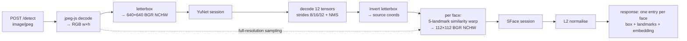

# feat: Recogniser sidecar package

## Summary

A new workspace package, `@hal1000/recogniser`, that runs as its own process and answers one
question over HTTP: given a frame, where are the faces, and what does each one look like as a
comparable vector. It ships YuNet in the repo, fetches SFace once on first run and verifies it
against a hash published by the source repository, and applies the five-landmark warp the spike
skipped — the change the origin brief's Measured Constraints identifies as a prerequisite rather
than a refinement.

Nothing in `server/` changes. This plan builds the producer that the Vision seam is waiting for and
stops at its boundary.

---

## Problem Frame

The origin brief closed its artifact question with a measurement: a Node process using
`onnxruntime-node` detects a face in 2.2ms and embeds it in 5.3ms on CPU, on Windows, with no
compiler. `docs/spikes/2026-08-07-face-recognition.mjs` is the throwaway that produced those numbers
and is a working reference for the three things that cost iterations — YuNet's 12-tensor decode
across strides 8/16/32, the fixed 640x640 input that forces letterboxing rather than squashing, and
the BGR/NCHW/0-255 tensor layout that fails silently when it is wrong.

The spike also recorded what it did **not** establish. It cropped faces by bounding box rather than
warping them by the five landmarks SFace expects, and the same person embedded twice, seconds apart,
scored 0.92 on one run and 0.61 on another — against 0.34 for a crop that is not a face at all. A
threshold cannot be placed in that gap. The brief names landmark alignment as the likely cause and
therefore a prerequisite, and the requirement subset in scope here is where that gets fixed.

This plan covers six requirements and deliberately stops short of the rest:

- **R2** — the recogniser is a separate process HAL addresses by URL and never supervises.
- **R4** — per-face results, so two people in frame produce two independent identity decisions.
- **R5** — HAL owns appearance continuity; the recogniser tracks nothing between calls.
- **R33** — Windows and Linux at parity, macOS on the same shape.
- **R34** — installs through ordinary `npm install`: no compiler, no container, no per-OS step.
- **R35** — an uncommitted model is fetched once and hash-verified before use, and a failed fetch
  reports itself rather than leaving the process silently unable to match.

R4 and R5 are in scope only in their sidecar-facing half. HAL's appearance continuity — collapsing
consecutive detections into one appearance, holding in-flight face data, ending an appearance on a
gap — is server work and is not built here. What this package owes those requirements is a response
shape that makes them possible: every face independently described, with the box, the landmarks and
the embedding HAL needs to decide continuity itself, and no state carried between calls that would
let the sidecar quietly make that decision instead.

---

## Requirements

| ID | Requirement | Where it lands |
|---|---|---|
| R2 | Separate process addressed by a configured URL; HAL never starts or stops it | U1 — standalone entry point, own port, no HAL coupling |
| R4 | Per-face results; two faces produce two independent entries | U4, U6 — array response, one element per detected face |
| R5 | Recogniser tracks nothing between calls; HAL owns continuity | U6 — statelessness verified, response self-contained |
| R33 | Windows and Linux at parity, macOS same shape | U1, U3 — pure-JS decode, prebuilt ORT binaries, no per-OS branch |
| R34 | Ordinary `npm install`; no compiler, container, or per-OS setup step | U1 — dependency choice is the whole mechanism |
| R35 | Uncommitted model fetched once, hash-verified, failure surfaced | U2 — fetch, verify, atomic install, model state on `/health` |

Origin actor **A3** ("finds faces in a frame and turns each one into a comparable representation,
returning per-face data with every response. It tracks nothing between calls") is the contract this
package implements in full. **A2** and **A1** are HAL-side and out of scope.

No Acceptance Example from the origin brief targets the sidecar directly — AE1 through AE11 all
describe HAL-side behaviour. Coverage here is by requirement, not by AE.

---

## Key Technical Decisions

**KTD1. The package is `recogniser/`, a third npm workspace.**
Root `package.json` currently lists `server` and `ui`. Adding `recogniser` is what makes R34 true by
construction: `npm install` at the root installs `onnxruntime-node`, and there is no second command
to run. The accepted cost is that every clone pays roughly 259MB for ORT whether or not it ever
enables recognition — the brief already priced this ("`onnxruntime-node` installs at about 259MB,
which is the real weight of the sidecar"). `server/` keeps `ws` as its single runtime dependency and
gains no native module, which is the property the brief was protecting.

**KTD2. Frames arrive as JPEG and are decoded in pure JavaScript, not by ffmpeg.**
The spike used `ffmpeg -f rawvideo -pix_fmt rgb24` and noted that this removes the JPEG-decoder
dependency. That reasoning holds for a spike running beside a camera; it does not hold for a sidecar
that R2 says may run on another machine. Requiring ffmpeg on the recogniser host is exactly the
"platform-specific setup step" R34 forbids, and raw RGB on the wire is 1.2MB per frame against
roughly 50KB for the JPEG Vision already holds — which matters most in the remote case the brief
worries about. `jpeg-js` is pure JavaScript, MIT, and has no build step, so decoding in-process keeps
the install to `npm install` on every target. The letterbox the spike delegated to ffmpeg's
`scale`/`pad` filters moves into our own code, where it has to live anyway because the inverse
mapping is needed to return coordinates in the caller's frame.

*Alternative rejected:* accept raw RGB alongside JPEG. Two ingest paths for one caller is complexity
without a caller asking for it; if a raw path is ever wanted, it is additive.

**KTD3. Detection and embedding coordinates are returned in the caller's frame, not the letterboxed
one.** YuNet's export takes a fixed 640x640 input, so every frame is letterboxed on the way in. The
caller does not know or care about that padding — HAL needs the box to cut a face crop for a pending
queue item out of the frame it sent. The letterbox transform is therefore inverted before the
response is built, and the inverse is part of the tested contract rather than an implementation
detail.

**KTD4. The warp is a least-squares similarity transform from YuNet's five landmarks to SFace's
canonical 112x112 template.** Five point pairs over-determine a four-parameter similarity (scale,
rotation, translation), which is the right amount of freedom: it corrects the head roll and framing
drift that a bounding-box crop cannot, without the perspective freedom that would let a bad landmark
distort the whole face. Sampling is bilinear from the **original decoded frame**, not from the
letterboxed 640x640 one, so the crop keeps the camera's full resolution instead of inheriting
detection's downscale.

**KTD5. Embeddings are returned L2-normalised.** SFace's raw output is unnormalised; cosine
similarity ignores magnitude anyway, so normalising at the boundary makes HAL's comparison a plain
dot product and makes the contract unambiguous about what a client may do with the numbers.

**KTD6. SFace's known hash comes from the source repository's git-LFS pointer, not from our own first
download.** `opencv_zoo` stores its ONNX files in git LFS, and the pointer file — served by
`raw.githubusercontent.com` at the same path — carries `oid sha256:<digest>` for the exact blob. That
digest is published by the model's own repository and is therefore independent provenance, not a
hash we invented by trusting whatever arrived first. The constant recorded in source is that digest.
The same check is applied once to the committed YuNet file so both models are accounted for by the
same rule.

**KTD7. Inference is serialised behind a single-flight lock; overflow is refused, not queued.**
A face costs 7.5ms and the cadence is seconds, so there is no throughput problem to solve. Serialising
keeps ORT's CPU work from fanning out across concurrent requests and contending with chat and
narration on the same machine, which the brief's Dependencies section flags as the thing R30's
adjustable cadence insures against. A request arriving while another is in flight waits; a third
beyond a small bound is refused with 503 rather than growing an unbounded queue. This is the
sidecar's own hygiene — R8's "skipped rather than queued" is a HAL-side rule and is not built here.

**KTD8. `/health` reports what it is and what it can do, never a bare 200.**
`docs/solutions/diagnosing-a-process-that-isnt-your-code.md` records four instances of the same
lesson, the most recent being a readiness probe that was satisfied by a *previous run's* process
still holding the port, and screenshotted a stale build as proof. A liveness probe answers "is
something listening", never "is this mine". `/health` therefore returns a service identifier, the
detector's state, and the embedder's state as distinct values, so R35's failed-fetch condition is
legible as itself rather than as generic unavailability. `server/src/vision/captioner.ts` probes
llama.cpp's `/health` with a boolean today; a richer body here costs the future HAL-side leg nothing
and gives it something true to report.

---

## High-Level Technical Design

The pipeline and the two coordinate spaces it moves between:



Coordinate spaces, which is where this kind of code goes wrong quietly:

| Space | Dimensions | Produced by | Consumed by |
|---|---|---|---|
| Source frame | camera `w × h` | `jpeg-js` decode | warp sampling; the response |
| Letterboxed | fixed `640 × 640` | `fit`, `offsetX`, `offsetY` | YuNet only |
| Aligned crop | fixed `112 × 112` | similarity transform | SFace only |

Nothing in the letterboxed space escapes to the caller. The forward transform is
`fit = min(640/w, 640/h)`, `offset = (640 − round(dim × fit)) / 2` on each axis; the inverse divides
out `fit` after subtracting the offset. The spike's ffmpeg filter chain padded only vertically
because it controlled the capture size; ours centres on both axes because it does not.

The warp, as directional guidance rather than specification:

```
given src[5] (YuNet landmarks, source coords) and dst[5] (SFace canonical template)
  estimate similarity s, R(2×2), t minimising Σ ‖ s·R·src_i + t − dst_i ‖²
  invert: for each output pixel p in 112×112
            sample = (1/s)·Rᵀ·(p − t)
            bilinear-sample the source frame at `sample`
  emit BGR, NCHW, values left at 0-255
```

The canonical template is the standard five-point reference SFace and ArcFace were trained against,
ordered to match YuNet's landmark order. **That ordering is the single highest-risk assumption in
this plan** — YuNet emits the subject's right eye first, which is the *left*-most point in the image,
and getting it backwards produces a horizontally mirrored crop that still embeds happily and scores
plausibly. U5 verifies the correspondence empirically rather than assuming it.

---

## Output Structure

```
recogniser/
  package.json                 @hal1000/recogniser — onnxruntime-node, jpeg-js
  tsconfig.json
  README.md                    how to run it; the R33/R34 claim in prose
  .gitignore                   the fetched SFace weights
  models/
    face_detection_yunet_2023mar.onnx     committed, 227KB
  src/
    index.ts                   entry: config from argv/env, start, log the URL
    server.ts                  node:http routing, /health and /detect
    config.ts                  port, host, models dir, thresholds
    models.ts                  paths, fetch-once + hash verify, ready state
    frame.ts                   jpeg decode, letterbox, inverse transform
    tensor.ts                  RGB → BGR NCHW float32 at 0-255
    detect.ts                  YuNet session, 12-tensor decode, NMS
    warp.ts                    similarity estimate + bilinear resample to 112×112
    embed.ts                   SFace session, L2 normalise
    pipeline.ts                decode → detect → warp → embed, single-flight
  test/
    fixtures/                  one committed face frame; everything else generated
    frame.test.ts
    detect.test.ts
    warp.test.ts
    models.test.ts
    pipeline.test.ts
    server.test.ts
    models-required.ts         loud skip helper for SFace-dependent suites
```

The per-unit **Files** lists below are authoritative; this tree is the shape, not a constraint.

---

## Implementation Units

### U1. Workspace package and HTTP skeleton

**Goal:** `@hal1000/recogniser` exists as a third workspace, starts as its own process on its own
port, and answers `/health` honestly. This is R2, R33 and R34 in one unit — after it, the portability
and install claims are either true or falsified.

**Requirements:** R2, R33, R34

**Dependencies:** none

**Files:**
- `recogniser/package.json` (create) — `onnxruntime-node`, `jpeg-js`; `dev`/`start` scripts via `tsx`
- `recogniser/tsconfig.json` (create) — extends `../tsconfig.base.json`, `types: ["node"]`
- `recogniser/src/index.ts`, `recogniser/src/server.ts`, `recogniser/src/config.ts` (create)
- `recogniser/README.md`, `recogniser/.gitignore` (create)
- `package.json` (modify) — add `recogniser` to `workspaces`; add `dev:recogniser` and
  `start:recogniser`; extend `typecheck` with `recogniser/tsconfig.json`
- `vitest.config.ts` (modify) — add `recogniser/test/**/*.test.ts` to `include`
- `AGENTS.md` (modify) — one Layout entry for the new workspace and what it is for
- `recogniser/test/server.test.ts` (create)

**Approach:** `node:http` directly — the server workspace already runs without a web framework and
one route plus a health endpoint does not earn a dependency. Binds `127.0.0.1` by default, matching
the hard rule in `AGENTS.md`; a non-loopback bind is an explicit flag rather than a bare host string,
so the default cannot drift. Default port 8100, sitting beside the captioner's 8099. Relative imports
carry the `.js` suffix, as `server/` does. `/health` returns `{ service: "hal1000-recogniser", version,
detector, embedder }` per KTD8.

**Patterns to follow:** `server/src/vision/captioner.ts` for the shape of an HTTP model client and
its deliberate split between "slow" and "missing"; `shared/src/vision.ts` for stating setup
instructions once in a constant rather than duplicating prose.

**Test scenarios:**
- `GET /health` on a freshly started server returns 200 with `service` set to the recogniser's own
  identifier — a bare 200 from an unrelated process on the port would fail this.
- `GET /health` reports `detector` and `embedder` as distinct fields, so one can be ready while the
  other is not.
- An unknown path returns 404 with a JSON body, not an HTML default or a hang.
- `POST /detect` with a non-JPEG content type returns 415 and names the accepted type.
- The default bind address is `127.0.0.1` when no host is configured.
- `npm run typecheck` covers `recogniser/` — asserted by the config change, verified by running it.

**Verification:** `npm install` at the repo root, from a clean `node_modules`, installs the package
with no compiler invocation and no per-OS step. `npm run start:recogniser` serves `/health` on 8100.
`npm run typecheck` and `npm test` both include the new workspace.

---

### U2. Model assets: YuNet committed, SFace fetched and hash-verified

**Goal:** R35, end to end. YuNet is in the repo; SFace arrives once on first run, is checked against
a digest published by its own repository, and a failure to fetch or verify is a reported state rather
than a silent inability to match.

**Requirements:** R35, R34

**Dependencies:** U1

**Files:**
- `recogniser/models/face_detection_yunet_2023mar.onnx` (create — committed binary, ~227KB)
- `recogniser/src/models.ts` (create)
- `recogniser/.gitignore` (modify) — ignore `models/face_recognition_sface_2021dec.onnx`
- `recogniser/test/models.test.ts` (create)

**Approach:** Both model URLs are pinned to the exact `2023mar` / `2021dec` filenames the spike used
and the brief's Measured Constraints were taken against — not to a moving `main` alias of "the
current model". The SFace digest is obtained per KTD6 by reading the git-LFS pointer at
`raw.githubusercontent.com/opencv/opencv_zoo/main/models/face_recognition_sface/face_recognition_sface_2021dec.onnx`,
which is a text file containing `oid sha256:<digest>` and `size <bytes>`; both are recorded as
constants. The bytes themselves come from the LFS media host, the same URL the spike documents. The
committed YuNet file is verified against its own pointer digest once, at authoring time, and that
digest is recorded as a constant too so a corrupted checkout is detectable rather than assumed sound.

Download writes to a unique temp name in the models directory, verifies the digest and the byte
length, then renames into place — the same discipline `storage/atomic.ts` applies to conversation
writes, for the same reason: a truncated 37MB file that looks installed is worse than no file. A
digest mismatch deletes the temp file and leaves the model absent, so the next start retries rather
than pinning a bad artifact. Fetch is attempted once at startup and its outcome is held as state
(`"ok" | "fetching" | "unreachable" | "corrupt" | "absent"`) surfaced on `/health`.

**Patterns to follow:** `server/src/storage/atomic.ts` for temp-then-rename; `captioner.ts`'s
"a slow thing is not a missing thing" distinction, applied here to "a failed download is not a
corrupt file".

**Test scenarios:**
- A byte stream whose digest matches the recorded constant installs, and the final file is at the
  expected path with the expected byte length.
- A byte stream whose digest does not match is rejected: no file at the destination path, no temp
  file left behind, and `embedder` reports `corrupt`.
- A stream truncated mid-transfer (correct prefix, short length) is rejected on length before the
  digest is even considered.
- A fetch that throws (host unreachable) leaves `embedder` as `unreachable`, and `detector` stays
  `ok` — one model's failure does not mask the other's health.
- With SFace already present and matching, startup performs no network request at all.
- With SFace present but corrupted on disk, startup detects it and does not serve embeddings from it.
- The committed YuNet file's digest matches its recorded constant — this test guards the checkout,
  and fails loudly if the binary is ever replaced without updating the constant.

**Verification:** Deleting the SFace file and starting the process downloads exactly one file,
verifies it, and reports `embedder: "ok"`. Corrupting one byte of it and restarting reports
`embedder: "corrupt"` and refuses to embed, rather than returning nonsense vectors.

---

### U3. Frame decode and letterbox, with an invertible transform

**Goal:** A JPEG becomes a 640x640 BGR NCHW tensor YuNet accepts, and the mapping back to the
caller's coordinates is a first-class, tested function rather than arithmetic scattered through the
detector.

**Requirements:** R33 (pure-JS decode is what keeps parity), R34

**Dependencies:** U1

**Files:**
- `recogniser/src/frame.ts` (create)
- `recogniser/src/tensor.ts` (create)
- `recogniser/test/frame.test.ts` (create)
- `recogniser/test/fixtures/` (create) — one committed JPEG frame containing a face

**Approach:** `jpeg-js` decode yields RGBA; drop alpha to RGB and keep the source dimensions. Compute
`fit`, `offsetX`, `offsetY` per the High-Level Technical Design, resample bilinearly into a 640x640
canvas with black padding, and emit BGR NCHW float32 at 0-255 through `tensor.ts` — the exact layout
the spike's item 4 warns about, where getting it wrong runs happily and detects nothing. `frame.ts`
exports the inverse alongside the tensor so U4 never recomputes it.

The committed fixture is a single frame from the development machine's camera — the same Logitech
C310 the brief's constraints were measured on, and a photo of the sole user of this single-user
harness. Everything else the tests need (blank frames, rotated variants) is generated in code with
`jpeg-js`'s encoder, so the repo carries one image rather than a gallery.

**Patterns to follow:** the spike's `toTensor` for the plane layout; its `-vf scale/pad` chain for
what the letterbox is replacing.

**Test scenarios:**
- A 640x480 frame letterboxes to 640x640 with equal top and bottom padding and no horizontal padding;
  a 480x640 frame pads horizontally instead.
- A frame already 640x640 passes through with `fit === 1` and zero offsets.
- Padding pixels are zero in all three channels — a non-zero pad would be a phantom edge for the
  detector.
- Round trip: a point mapped forward into letterbox space and back lands within a pixel of where it
  started, across portrait, landscape and square inputs.
- The tensor's channel order is BGR, not RGB — asserted against a synthetic image with a known
  single-channel value, so a swap cannot pass.
- Tensor shape is `[1, 3, 640, 640]` and values stay in 0-255 rather than being scaled to 0-1.
- A truncated or non-JPEG buffer raises a typed decode error rather than producing a garbage tensor.

**Verification:** The fixture frame decodes to its true dimensions and produces a tensor whose
statistics (min, max, mean per channel) are consistent with a photograph rather than with a mis-strided
buffer.

---

### U4. YuNet detection: decode, NMS, and per-face output

**Goal:** Faces out of a frame — box, score, and five landmarks each, in the caller's coordinate
space. This is where R4's per-face unit is established.

**Requirements:** R4, R33

**Dependencies:** U2, U3

**Files:**
- `recogniser/src/detect.ts` (create)
- `recogniser/test/detect.test.ts` (create)

**Approach:** Port the spike's `decodeYunet` and `iou` with the corrections a shipped version needs.
The session is created once at startup and reused — the spike's own warm-up comment records that the
first run pays graph init. `ort.env.logLevel = "fatal"` and `logSeverityLevel: 4` are not optional
noise control: item 5 of the spike header records that these models emit one warning per initializer,
hundreds of lines, which in a long-running server is a log flood rather than a nuisance.

Two things the spike left rough. Its greedy NMS keeps a face if no kept face overlaps it above 0.3
IoU, which is correct, but it runs across all strides pooled — that stays. And its score threshold is
a bare default argument; here it is configuration, defaulting to the 0.6 the spike used and the 0.93
the brief observed comfortably clearing. Detected boxes and landmarks are mapped back through
`frame.ts`'s inverse before leaving the module, so nothing downstream sees letterboxed coordinates.

**Patterns to follow:** `docs/spikes/2026-08-07-face-recognition.mjs` — `decodeYunet` and `iou`
directly; its stride loop, `sqrt(cls * obj)` score, and cell-offset box arithmetic in stride units are
the non-obvious parts and should be transcribed rather than re-derived.

**Test scenarios:**
- The committed fixture yields exactly one face, with a score above the configured threshold.
- The returned box lies inside the source frame's bounds and has positive width and height.
- Five landmarks are returned, all inside the returned box's neighbourhood, ordered consistently
  across repeated runs.
- A generated blank frame yields zero faces — and returns an empty array, not an error.
- A frame containing two faces, synthesised by tiling the fixture's face region side by side, yields
  two entries with distinct boxes: R4's per-face unit, proven rather than asserted.
- Two overlapping candidate boxes above the IoU threshold collapse to one; two adjacent
  non-overlapping ones do not — exercised against `iou` directly with constructed boxes.
- Detection on a non-square frame returns coordinates in source space: the box's centre corresponds to
  the face's actual position in the original image, not to its letterboxed position.
- Running detection twice on the same buffer returns identical results — no accumulated state.

**Verification:** Detection on the fixture reproduces the brief's measured shape: one face, score near
0.93, and a box that when cut from the source frame contains a face. Latency stays in single-digit
milliseconds after warm-up, consistent with the 2.2ms mean the brief recorded.

---

### U5. Five-landmark warp and SFace embedding

**Goal:** The prerequisite. Replace the spike's bounding-box crop with a landmark-aligned similarity
warp, and demonstrate that it closes the gap the brief identified — same-person similarity that
ranged 0.61 to 0.92 against 0.34 for a non-face.

**Requirements:** R4, R33

**Dependencies:** U2, U3, U4

**Execution note:** Write the discrimination test first. This unit exists because a measurement said
the previous approach was not good enough, and the only way to know the replacement is better is to
have the comparison in place before the warp is. Implementing first and measuring afterwards is how a
warp that mirrors the face gets shipped looking plausible.

**Files:**
- `recogniser/src/warp.ts` (create)
- `recogniser/src/embed.ts` (create)
- `recogniser/test/warp.test.ts` (create)
- `recogniser/test/models-required.ts` (create)

**Approach:** `warp.ts` estimates the similarity transform per KTD4 — a closed-form least-squares fit
over the five point pairs, no iteration — then inverse-maps each of the 112x112 destination pixels and
bilinearly samples the **source-resolution** frame. `embed.ts` owns the SFace session, runs the warped
tensor through it, and L2-normalises the 128-dimension output per KTD5.

The landmark ordering risk flagged in the High-Level Technical Design is resolved empirically, not by
assertion: warp the fixture, write the aligned 112x112 crop out for eyeball confirmation exactly as
the spike wrote `crop.raw`, and assert in code that the transform maps the first landmark to the
template's first point within a small tolerance. A mirrored correspondence fails that assertion
because the residual explodes; a correct one leaves it near zero.

SFace weighs 37MB and arrives on first run, so tests that need it cannot assume it is present.
`models-required.ts` skips those suites **loudly** — printing why, and asserting that the skip path
itself is reachable only when the model is genuinely absent. A suite that silently passes because a
model was missing is the false-evidence failure
`docs/solutions/diagnosing-a-process-that-isnt-your-code.md` records; the geometry tests below need no
model and always run.

**Patterns to follow:** the spike's `cropResize` for the bilinear sampling loop and plane layout, and
its `cosine` for similarity; the spike's own correctness section for the shape of the argument — it
already establishes that consistency alone proves nothing, because a degenerate embedder scoring 1.0
against itself would pass.

**Test scenarios:**

*Geometry — no model needed, always runs:*
- Identity case: landmarks already at the template positions produce a transform with scale 1, zero
  rotation, zero translation.
- A synthetically rotated landmark set (roll of 15°) produces a transform whose rotation component
  recovers that angle, and whose application maps the landmarks back onto the template within
  tolerance.
- A uniformly scaled landmark set recovers the scale factor and leaves rotation at zero.
- The residual after fitting the fixture's real landmarks is small — the guard against a mirrored or
  mis-ordered template.
- Output tensor is `[1, 3, 112, 112]`, BGR, values at 0-255.
- Bilinear sampling near the frame edge clamps rather than reading out of bounds, on all four edges.

*Embedding — requires SFace, skips loudly when absent:*
- The embedding has 128 dimensions and unit L2 norm after normalisation.
- **The discrimination comparison.** From the fixture, generate variants under transforms a head turn
  produces — roll of ±12°, a small scale change, a translation. Embed each twice: once via the spike's
  bounding-box crop, once via the landmark warp. The warp's minimum same-person similarity across the
  variant set must be higher than the bounding-box crop's minimum, and must sit clearly above the 0.34
  an off-target crop scores. This is the unit's reason for existing and its assertion is the
  requirement, not a nice-to-have.
- A crop of background rather than a face scores far below any same-person pair — the spike's
  degeneracy check, retained, so a warp that returns a near-constant vector cannot pass by being
  self-consistent.
- Embedding the same warped tensor twice returns identical vectors.

**Verification:** The written-out aligned crop, inspected by eye, shows an upright, centred, correctly
framed face — not a mirror image and not an off-centre one. The discrimination comparison passes with
margin rather than marginally, and the measured floor is recorded in the unit's commit message so the
threshold work the brief defers has a number to start from.

---

### U6. The `/detect` contract, statelessness, and single-flight

**Goal:** One endpoint that takes a frame and returns faces, holds nothing between calls, and behaves
under overlap. This is where R5's half of the bargain is kept and R2's URL becomes real.

**Requirements:** R2, R4, R5

**Dependencies:** U1, U2, U3, U4, U5

**Files:**
- `recogniser/src/pipeline.ts` (create)
- `recogniser/src/server.ts` (modify) — wire `/detect`
- `recogniser/test/pipeline.test.ts` (create)
- `recogniser/test/server.test.ts` (modify)
- `recogniser/README.md` (modify) — document the request and response shape

**Approach:** `POST /detect` takes `image/jpeg` bytes and returns
`{ width, height, faces: [{ box: { x, y, w, h }, score, landmarks: [[x, y] × 5], embedding: number[128] }] }`.
Coordinates are the caller's, per KTD3. Every field a caller needs to decide continuity itself is in
the response, and nothing about a previous call is: no cache keyed on frame content, no last-seen
face, no rolling state of any kind. That is A3's "tracks nothing between calls" and it is what lets
R5 place appearance continuity in HAL where the brief puts it.

The single-flight lock from KTD7 is a promise chain with a small waiting bound; past the bound the
handler returns 503 with a body naming the condition, so a future HAL-side reader can tell "busy"
from "absent". Requests are size-capped before decode so a large body cannot exhaust memory ahead of
the JPEG header being read.

When SFace is unavailable — R35's failure path — `/detect` still detects and returns faces with boxes
and landmarks and a null embedding, rather than failing wholesale. Detection is the half that works,
and the state is already legible on `/health`.

**Patterns to follow:** `server/src/vision/captioner.ts` for typed error kinds that distinguish
conditions a caller must act on differently.

**Test scenarios:**
- Posting the fixture returns one face with a box, five landmarks and a 128-value embedding, and
  echoes the source dimensions.
- Posting the two-face synthetic frame returns two entries with distinct boxes and distinct
  embeddings — R4 at the wire boundary.
- Posting a blank frame returns `faces: []` with 200, not an error.
- Posting the same frame twice returns byte-identical responses — statelessness, checked at the
  contract rather than inferred from the implementation.
- Posting frame A then frame B then frame A again returns the same result for both A calls, so no
  state leaked from B.
- No file is written anywhere outside the models directory across a sequence of detects — asserted
  against a temp `HOME`/cwd, so a stray debug dump or cache cannot pass unnoticed.
- Two concurrent posts both succeed and return correct, non-interleaved results.
- Concurrency beyond the waiting bound returns 503 with a body identifying the condition, and the
  server recovers to 200 once the burst clears.
- A body exceeding the size cap is rejected before decode, with 413.
- With SFace absent, `/detect` returns faces with null embeddings and 200, and `/health` reports
  `embedder` as not ok — the two agree.
- A malformed JPEG returns 400 with a typed reason, and the server continues serving afterwards.

**Verification:** With the process started per the README on a clean checkout, posting a saved frame
from `curl` returns the documented shape. The server survives a burst of posts and the fixture's face
is detected identically before and after.

---

## Scope Boundaries

**Not in this plan (rest of the brief, unchanged)**

R1, R3, R6-R32 are HAL-side or later. Specifically not built here: the recogniser readiness leg (R6),
degradation when unreachable (R7), the too-slow-versus-absent distinction (R8), the confidence
threshold (R9), the non-loopback acknowledgement and encrypted channel (R10, R11), the entire triage
queue and gallery (R12-R21), narration and the hedged identity form (R22-R25), retention and deletion
controls (R26-R29), and settings and WS protocol coverage (R30-R32).

**Deferred to follow-up work**

- **Where R9's threshold sits.** The brief defers it explicitly and correctly: it cannot be chosen
  until the warp lands and a second face is available. U5's discrimination comparison produces the
  floor measurement that work will start from, and stops there.
- **Raw-RGB ingest.** Only if a caller ever wants it (KTD2).
- **GPU execution providers.** ORT's CPU binaries are what make R34 true; a GPU provider is a
  different install story and 7.5ms per face does not need one.
- **Folding the recogniser URL into shared inference targets.** Already deferred by the brief.

**Outside this package**

Appearance continuity, the gap window that ends an appearance, and any retention of face data beyond
a single request. The sidecar returning per-face data and holding nothing is precisely what keeps
those decisions in HAL, where R5 puts them.

---

## Risks and Open Questions

**The landmark template ordering is the highest-risk assumption.** A mirrored correspondence produces
a face-shaped crop that embeds without complaint and scores plausibly against itself, so it can pass
every test that does not specifically look for it. U5's residual assertion and the written-out crop
are the two independent checks; neither alone is sufficient, and the plan keeps both.

**The discrimination comparison uses synthetic variants, not two real captures.** Rotating and scaling
one photograph is not the same as a person turning their head — the real case changes what the camera
sees, not just how it is framed. The synthetic version is deterministic, runs in CI, and directly
tests the property the warp is supposed to buy; it is a lower bound on the improvement, in the same
way the brief's similarity figures are a lower bound on accuracy. Confirming against two real captures
is a manual step at the end of U5, not an automated assertion.

**Only one face is available to test against.** Same-person-versus-different-person discrimination —
the thing R9's threshold actually has to get right — stays untested here, exactly as the brief records.
This plan does not close that gap and should not be read as closing it.

**Hash provenance is pinned, not chained.** KTD6's LFS digest is published by the model's own
repository, which is materially better than trusting our first download — but it is a digest fetched
over the same transport as the file. It protects against corruption, truncation and later substitution;
it is not a signature.

**`jpeg-js` decode cost is unmeasured.** Decoding a 640x480 JPEG in pure JS is expected in the tens of
milliseconds, which against a seconds-scale cadence is comfortable but is nonetheless the largest
single cost in the pipeline — an order of magnitude above the 7.5ms of inference. U3's verification
should record the actual number so the cadence conversation later has it.

**Every clone pays 259MB.** Accepted and priced by the brief, restated here because it is the visible
consequence of the workspace choice and someone will notice it before they notice the feature.

---

## Sources and Research

- `docs/brainstorms/2026-08-07-vision-face-recognition-requirements.md` — origin. Measured Constraints
  is the section this plan is answerable to; its two stated limits define U5.
- `docs/spikes/2026-08-07-face-recognition.mjs` — working reference for the YuNet decode, the
  letterbox, and the tensor layout. Its header lists five non-obvious things; this plan carries all
  five forward and replaces the sixth thing it deliberately did not do.
- `server/src/vision/captioner.ts` — the HTTP-model-client shape, and the slow-versus-missing split
  U2 and U6 mirror.
- `shared/src/vision.ts` — stating setup instructions once, in a constant.
- `docs/solutions/diagnosing-a-process-that-isnt-your-code.md` — a liveness probe answers "is
  something listening", never "is this mine". KTD8 and U5's loud-skip helper both come from it.
- `AGENTS.md` — loopback binding, `.js` import suffixes, atomic storage writes, tests mirroring source.
- OpenCV Zoo (github.com/opencv/opencv_zoo) — YuNet 2023mar and SFace 2021dec under Apache 2.0, and
  the git-LFS pointers KTD6 reads the digests from.
- ONNX Runtime Node guide — the prebuilt CPU binary matrix that makes R33 and R34 hold with no
  compiler on any of the three targets.
