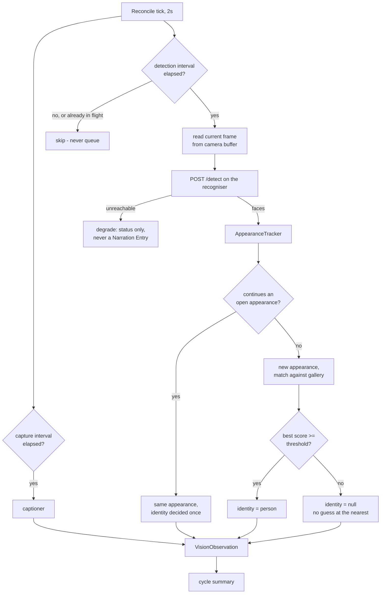
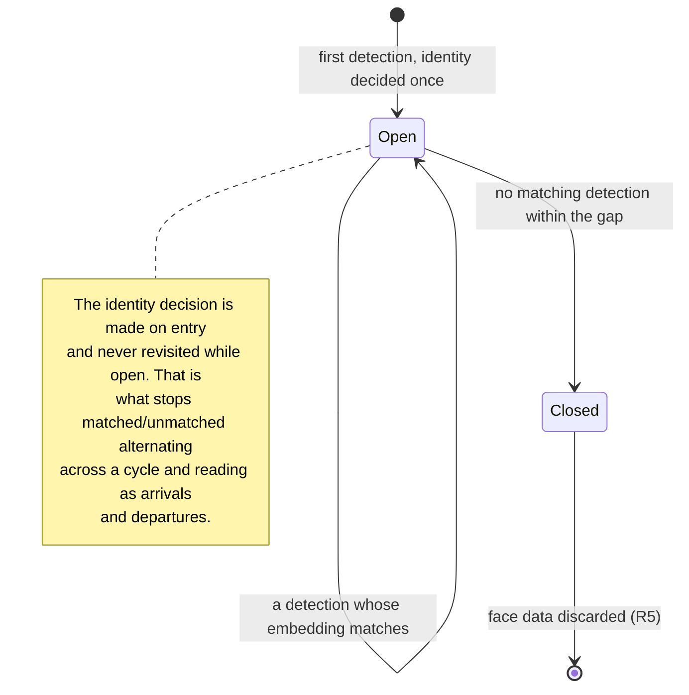

# feat: The HAL-side recognition loop

## Summary

The recogniser sidecar exists and works. This slice builds the consumer: a client for it, a readiness
leg, recognition settings, a detection loop on its own interval, appearance continuity so a person
standing in frame is one appearance rather than a hundred detections, a confidence threshold, and a
small gallery of enrolled people.

It ends where the seam the webcam brief cut has finally got a producer: a matched face puts a hedged
identity on `VisionObservation`, and that hedge travels into the cycle summary without ever handing
the model a bare name.

The triage queue is not in this slice. That means enrolment needs a path of its own, so this adds a
one-shot "this is <name>" from the current frame, and deletion of a person — because holding face
data with no way to remove it is not a state to ship, even briefly.

---

## Problem Frame

`docs/plans/2026-08-07-001-feat-recogniser-sidecar-package-plan.md` shipped the far end: post a JPEG
to `recogniser/`, get back one entry per face with a box, five landmarks, and a 128-value normalised
embedding, in the caller's coordinates, with no state held between calls. Its README is the wire
contract.

Nothing consumes it. `VisionObservation.identity` is still present-and-null with no producer,
readiness has four legs and none of them is the recogniser, and Vision's settings have no notion that
recognition exists.

The gap this closes is the whole reason the sidecar is stateless. The brief puts appearance
continuity in HAL deliberately (R5), and the sidecar was built so it *cannot* quietly make that
decision instead. That design only pays off once HAL actually makes it.

Two failures shape the work more than the requirements list does:

**Identity flicker is the fabricated-event defect wearing a different hat.**
`docs/residual-review-findings/feat-vision.md` records the captioner inventing object counts that the
summariser narrated as events that never happened. If identity alternates between matched and
unmatched across a cycle, the summariser reads that as arrivals and departures — the same failure,
now about a person. R4's per-appearance collapse is what prevents it, and it is the hardest part of
this slice.

**A wrong name is worse than a wrong cup.** R9 and R23 both exist for that. The threshold refuses to
guess at the nearest person, and the hedge is applied in the input rather than asked for in a prompt
rule — `docs/solutions/an-instruction-that-fights-its-own-input-loses.md` records that lever failing
three times here already, hardest on the small local model that writes the cycle summary.

---

## Requirements

| ID | Requirement | Where it lands |
|---|---|---|
| R1 | Recognition optional, off until enabled, subordinate to Vision | U2, U5 |
| R3 | Recognition only on frames where detection found a face | U5 — the sidecar embeds only detected faces; HAL calls it only while watching |
| R4 | Per-face appearances; two people are two appearances | U4 |
| R5 | HAL owns continuity; in-flight face data discarded when the appearance ends | U4 |
| R6 | Recogniser availability is its own readiness leg | U1 |
| R7 | Unreachable degrades Vision rather than disabling it; no Narration Entry about the fault | U5 |
| R8 | In-flight detection skipped, not queued; too-slow is its own condition | U5 |
| R9 | Below-threshold is unrecognised, never a guess at the nearest person | U3, U4 |
| R23 | No bare name in the caption line; one shipped hedged form; verified on the model's output | U6 |
| R27 | Deleting a person removes that person and every face held for them | U3, U7 |
| R30 | Detection interval is a user setting, separate from capture and cycle | U2 |
| R31 | Recognition settings live in Vision's existing group | U2, U7 |

Origin flows: **F1** (a known person is recognised) is the slice's end state. **F5** (recogniser
absent, unreachable, or too slow) is U5's failure path. **F2**, **F3**, **F4**, **F6** depend on the
triage queue and are out of scope, except F6's deletion half, which R27 carries here.

Acceptance examples in reach: **AE5** (a missing recogniser is quiet), **AE6** (an uncertain match is
not a name), **AE7** (neither the summariser's input nor its output carries a bare name), **AE9** (two
people are two appearances), **AE10** (a different person inside the gap window is not the same
appearance). **AE1**, **AE2**, **AE3**, **AE4**, **AE8**, **AE11** need the queue and are out of scope.

---

## Key Technical Decisions

**KTD1. Appearances are matched by embedding first and position second.**
AE10 is the constraint: one person leaves frame and a different person enters before the gap elapses,
and the second must not inherit the first's identity. Position alone cannot tell them apart — the new
face may occupy the same pixels. So a detection continues an existing appearance only when its
embedding is close to that appearance's, with box overlap used to break ties when two appearances are
both plausible. The continuity threshold is deliberately stricter than the identity threshold: mixing
two people into one appearance is the failure that produces a wrong name, and it is worse than
splitting one visit into two.

**KTD2. The appearance gap is a constant, not a setting.**
R31 enumerates the recognition settings and the gap is not among them; the brief deferred the *value*
to planning, not the *knob* to the user. It defaults short, per the brief's stated asymmetry — a
duplicate appearance is a nuisance, a missed stranger is the failure the feature exists to prevent.
It is exported and named so it is findable and testable rather than buried.

**KTD3. The threshold is a raw number with a conservative default, not a named scale.**
The brief leaves this open. Vision Sensitivity is a named scale because we know what its levels mean;
here we do not — nothing is calibrated until a second face exists, and naming levels would imply
knowledge this slice does not have. The default sits well above OpenCV's published same-identity
figure for SFace and well below the 0.93 same-person floor the warp measured, so it errs toward
"unrecognised". The number is visible and adjustable, and the plan does not pretend it is final.

**KTD4. A person matches on their nearest single face, not an aggregate.**
R16 has a person accumulating faces. With a handful of faces each, a maximum is more robust than a
mean: one poorly-framed enrolment drags an average down and quietly stops matching that person,
whereas it merely fails to be the nearest. This is invisible to the user by design.

**KTD5. The hedge is a shipped constant applied to the input, and re-checked on the output.**
R23 wants one form rather than each caller's discretion, so it lives in `shared/src/prompts.ts` where
it can be tested against what the summariser produces. Applying it to the input is the primary
mechanism; the output check is a second pass that rewrites any bare enrolled name the model emitted
anyway. AE7 asks for both halves and the project's own learning says the prompt-rule lever loses.

**KTD6. The readiness leg carries `degraded`, not just up-or-down.**
The sidecar reports its detector and embedder separately, precisely so a failed SFace fetch is
legible. Collapsing that to reachable/unreachable would throw away the distinction R35 was built to
preserve — a recogniser that detects but cannot match is a different thing to tell the user than one
that is not running.

**KTD7. Detection runs off the existing two-second reconcile tick, not a second timer.**
`VisionService` already derives every schedule from current settings on each tick, which is what makes
an interval change take effect with no respawn. Detection joins that pattern with its own
`lastDetectAt`. The cost is that the tick is a practical floor on R30's interval — the brief already
names this. Detection reads the current frame from the camera buffer rather than awaiting one, so a
detection never blocks on the device the capture loop also wants.

**KTD8. Enrol and delete ship over WS, with the exposure recorded.**
R32 routes biometric mutation through the hub whose per-boot token is still outstanding, and the brief
calls that token a prerequisite. Confirmed decision: ship, and write the gap into
`docs/residual-review-findings/` as a knowing choice. The reasoning is proportionality — the same
unauthenticated channel already schedules and runs shell commands via `add-monitor`, which is a
strictly larger capability than enrolling a face. This widens an accepted exposure rather than opening
a new kind of one. It does not discharge the token; it stops the debt being invisible.

---

## High-Level Technical Design

Two loops on one tick, with recognition gated behind detection:



The appearance lifecycle, which is where identity flicker would come from if it were wrong:



Where identity travels, and what each stage is allowed to see — directional, the prose governs:

| Stage | Sees | Never sees |
|---|---|---|
| `AppearanceTracker` | embeddings, boxes, gallery scores | — |
| `VisionObservation.identityMatch` | person id, name, confidence (for the UI, R24's half) | — |
| `VisionObservation.identity` | the shipped hedged string | the bare name |
| Line handed to the summariser | the hedged string | the bare name |
| Narration Entry the model produced | re-checked, bare names rewritten | — |

---

## Implementation Units

### U1. Recogniser client and readiness leg

**Goal:** HAL can talk to the sidecar and can say what state it is in, distinguishing not-running from
running-but-unable-to-match.

**Requirements:** R6, R35 (consumed)

**Dependencies:** none

**Files:**
- `server/src/vision/recogniser.ts` (create)
- `shared/src/types.ts` (modify) — add the `recogniser` leg to `Readiness`
- `server/src/readiness.ts` (modify) — probe it alongside the captioner
- `server/test/vision/recogniser.test.ts` (create)
- `server/test/readiness.test.ts` (modify)

**Approach:** Mirror `captioner.ts` closely — it is the shape the brief points at for this, including
its deliberate split between "slow" and "missing". `RecogniserError` carries
`"unreachable" | "slow" | "failed"`; a blown deadline is `slow`, a refused connection is
`unreachable`, and a 4xx/5xx is `failed`. The timeout is short where the captioner's is generous:
detection costs single-digit milliseconds, so seconds of silence means something is wrong, not that
the model is thinking.

`probe()` returns the sidecar's parsed health rather than a boolean, because `/health` reports the
detector and the embedder separately and that distinction is the whole point of KTD6. It also checks
the `service` field — a bare 200 from something else on 8100 must not read as a healthy recogniser,
which is the lesson `docs/solutions/diagnosing-a-process-that-isnt-your-code.md` records four times.

The readiness leg is `"ok" | "degraded" | "unreachable" | "disabled"`, three-valued-plus like the
captioner and log legs: `disabled` when recognition is off, because nobody wants the prerequisite and
its absence is not a fault. `degraded` is reachable with the embedder unavailable.

**Patterns to follow:** `server/src/vision/captioner.ts` for the client and its error kinds;
`server/src/readiness.ts` for how a leg is probed, defaulted, and made three-valued.

**Test scenarios:**
- A well-formed `/detect` response parses into faces with box, score, landmarks and embedding.
- A response whose faces carry `embedding: null` parses, and the null is preserved rather than
  coerced — this is the sidecar's SFace-unavailable path and HAL must not treat it as a zero vector.
- A connection refusal raises `unreachable`; a request that outlives the deadline raises `slow`; a
  500 raises `failed`. All three are distinguishable by kind.
- A 413 or 415 from the sidecar raises `failed` with the sidecar's own message preserved.
- An abort signal cancels in flight and does not surface as `unreachable`.
- `probe()` on a healthy sidecar reports `ok` for both legs.
- `probe()` against a server returning 200 with a different `service` value reports not-ok — a
  liveness probe answers "is something listening", never "is this mine".
- `probe()` against a sidecar whose embedder is `corrupt` or `absent` reports the detector ok and the
  embedder not ok, separately.
- Readiness reports `disabled` when recognition is off, and does not probe at all in that case.
- Readiness reports `ok`, `degraded`, and `unreachable` for the three sidecar states.
- One leg's failure does not disturb the others: an unreachable recogniser leaves ollama, models,
  claudeLogs and captioner unchanged.

**Verification:** With the sidecar running, readiness shows `recogniser: "ok"`. Stopping it shows
`unreachable` and every other leg is untouched. Deleting the sidecar's SFace file shows `degraded`.

---

### U2. Recognition settings

**Goal:** The four knobs R31 names, defaulted so a fresh install has recognition off and nothing to
configure before Vision behaves exactly as it does today.

**Requirements:** R1, R30, R31

**Dependencies:** U1

**Files:**
- `shared/src/types.ts` (modify) — extend `VisionSettings` and `SettingsPatch`
- `server/src/storage/settings.ts` (modify) — extend `DEFAULT_VISION` and `mergeVision`
- `server/test/storage/settings.test.ts` (modify)

**Approach:** Add `recognitionEnabled` (false), `recogniserEndpoint`
(`http://127.0.0.1:8100`, matching the sidecar's default), `detectionIntervalSeconds` (seconds-scale,
clamped at the reconcile tick as its floor per KTD7), and `confidenceThreshold` (KTD3).

R1's subordination is enforced in the loop rather than in the merge: `recognitionEnabled` is stored
independently but does nothing while `enabled` is false, so toggling Vision off and on does not
silently lose the recognition preference. Numeric fields are clamped on merge rather than rejected —
`mergeColor` already establishes that a malformed value keeps the prior one rather than erroring, and
a local single-user tool should not throw at a settings patch.

**Patterns to follow:** `mergeVision` in `server/src/storage/settings.ts` — particularly its treatment
of `device: null` as meaningful rather than absent, and its per-field merge that never replaces the
whole object.

**Test scenarios:**
- A fresh settings file yields recognition off, the loopback recogniser endpoint, and the documented
  interval and threshold defaults.
- A patch setting only `recognitionEnabled` leaves every other Vision field untouched.
- A patch with a detection interval below the reconcile floor clamps to the floor rather than being
  stored as-is.
- A patch with a threshold outside 0..1 clamps; a non-numeric threshold keeps the prior value.
- A stored settings file written before this slice (missing all four fields) reads back with the
  defaults filled in, and does not lose its existing Vision settings.
- Turning Vision off and on again preserves `recognitionEnabled` — the preference is not a casualty
  of the toggle.

**Verification:** An existing `settings.json` from before this change loads without error and gains
the new fields at their defaults.

---

### U3. The gallery: enrolled people and their faces

**Goal:** Somewhere to keep enrolled people, a way to match an embedding against them, and a delete
that actually removes the biometric data.

**Requirements:** R9, R16 (partial — accumulation without the queue), R20 (many people supported),
R27

**Dependencies:** U1

**Files:**
- `server/src/vision/people.ts` (create)
- `server/src/paths.ts` (modify, if a new data subdirectory needs naming)
- `shared/src/types.ts` (modify) — the `Person` shape the UI and protocol share
- `server/test/vision/people.test.ts` (create)

**Approach:** A `PeopleStore` over a single JSON file written through `storage/atomic.ts`, with face
thumbnails as separate small JPEGs in their own data subdirectory. The split is deliberate: the JSON
stays small enough to read on every match, and `FrameStore` already establishes the pattern for image
files in the data dir.

Matching takes an embedding and returns the best person and score, where a person's score is the
maximum over their faces (KTD4). Below-threshold returns no person at all rather than the nearest —
R9 is explicit that this is not a ranking problem, and returning a nearest-with-low-score invites a
caller to use it.

Deletion removes the person from the JSON first, then unlinks their thumbnails. That order matters:
if the unlink fails the person is already ungone from matching, which is the guarantee R27 actually
makes, and an orphaned thumbnail is reported rather than silently retried. The reverse order could
leave a person matchable with no thumbnail.

Every embedding is stored normalised, matching what the sidecar returns, so matching stays a dot
product and there is no path where an unnormalised vector enters the gallery.

**Patterns to follow:** `server/src/storage/atomic.ts` for the write discipline;
`server/src/vision/frames.ts` for an image directory under the data dir.

**Test scenarios:**
- Creating a person from a name and one face persists, and survives a store reload.
- A person accumulates faces: adding a second face to an existing person keeps the first.
- Matching returns the person whose nearest face is closest, not the one with the best average — a
  person with one excellent and one poor face still matches on the excellent one.
- Matching below the threshold returns no person, and does not return the nearest with a low score.
- Matching against an empty gallery returns no person and does not throw.
- Matching is stable regardless of enrolment order.
- Two people whose faces are far apart match to themselves and not to each other.
- Deleting a person removes them from subsequent matches immediately.
- Deleting a person removes every thumbnail file they held.
- Deleting a person whose thumbnail file is already missing still removes the person and reports the
  orphan rather than throwing.
- A malformed or truncated people file loads as an empty gallery rather than crashing the server, and
  says so — a corrupt gallery must not take Vision down with it.
- Names are not unique keys: two people may share a name and remain distinct records.

**Verification:** Enrolling, restarting the server, and matching the same face still recognises the
person. Deleting them makes the same face unrecognised on the next appearance.

---

### U4. Appearance continuity

**Goal:** The hardest correctness property in the slice: consecutive detections of one face collapse
into one appearance carrying one identity decision, two faces in frame stay two appearances, and a
different person entering inside the gap window does not inherit the first's identity.

**Requirements:** R4, R5, R9

**Dependencies:** U3

**Execution note:** Write the acceptance-example tests first. AE9 and AE10 are the specification here,
and they are easier to state as tests than as prose. Implementing first and testing after is how a
tracker that merges two people ships looking correct.

**Files:**
- `server/src/vision/appearances.ts` (create)
- `server/test/vision/appearances.test.ts` (create)

**Approach:** A pure `AppearanceTracker` with no I/O and no clock of its own — time is passed in, the
same injection `VisionService` already uses for `now`. It holds open appearances, each with the
identity decided once on creation, a representative embedding, the last box, and the last-seen time.

Each observation call takes the detected faces and the current time, assigns each face to an open
appearance or opens a new one, closes appearances not seen within the gap, and returns the current
set. Assignment is greedy by embedding similarity above the continuity threshold, with box overlap
breaking ties, and each open appearance may take at most one face per call — two faces in one frame
cannot collapse into one appearance no matter how similar they look.

R5's retention rule is a property of this module: a closed appearance's face data is dropped, not
archived. Nothing here writes to disk. The identity decision is made once on entry and never revisited
while the appearance is open, which is what prevents the flicker that would read as arrivals and
departures.

**Technical design** — directional, the prose governs:

```
observe(faces, now):
  close appearances whose lastSeen is older than GAP
  for each face, best-scoring first:
    candidates = open appearances, unclaimed this call,
                 with cosine(face, appearance) >= CONTINUITY
    pick the highest cosine; break ties by box overlap
    if a candidate won: extend it (lastSeen, box, embedding)
    else: open a new appearance and decide identity once
  return open appearances
```

**Patterns to follow:** the generation-guard discipline in `server/src/vision/service.ts` for
reasoning about state that outlives an await; injected `now` for testability.

**Test scenarios:**
- Covers AE9. An enrolled face and an unenrolled face in one frame produce two appearances with
  distinct identity states, and do not collapse.
- Covers AE10. One person leaves and a different person enters before the gap elapses: a new
  appearance opens with its own identity decision, and the second does not inherit the first's.
- Covers AE8 (partially — the appearance half). The same face across many consecutive observations is
  one appearance with one identity decision, not one per detection.
- An appearance survives a single missed detection inside the gap — a face that turns away briefly
  does not refragment the visit.
- An appearance closes once the gap elapses with no matching detection, and a later detection of the
  same person opens a new appearance rather than resurrecting the old one.
- Two faces in one frame with near-identical embeddings still produce two appearances — the
  one-face-per-appearance-per-call rule, which similarity alone would violate.
- The identity decision is not revisited while an appearance is open: a mid-appearance detection that
  would have scored below the threshold does not flip an already-matched appearance to unrecognised.
- An unmatched appearance stays unmatched for its lifetime rather than re-querying the gallery on
  every detection.
- A closed appearance's embedding is not retained — asserted on the tracker's own state, since R5 is a
  retention guarantee and not merely a behaviour.
- Zero detections closes everything and returns an empty set without throwing.
- An appearance whose face arrives with a null embedding (SFace unavailable) is tracked by box overlap
  alone and is never assigned an identity — degraded detection must not become a guess.

**Verification:** A scripted sequence of detections standing in for a two-minute visit produces one
appearance and one identity decision; the same sequence with a second person interleaved produces two.

---

### U5. The detection loop

**Goal:** Detection on its own interval inside `VisionService`, gating recognition, skipping rather
than queueing, and degrading quietly when the recogniser is absent.

**Requirements:** R1, R3, R7, R8, R30

**Dependencies:** U1, U2, U4

**Files:**
- `server/src/vision/service.ts` (modify)
- `shared/src/types.ts` (modify) — extend `VisionState`
- `server/src/app.ts` (modify) — wire the recogniser client and people store in
- `server/test/vision/service-recognition.test.ts` (create)

**Approach:** Detection joins the existing tick per KTD7, with its own `lastDetectAt` and a
`detecting` flag. When the flag is set and the interval elapses, the detection is skipped and counted
— R8 says skipped, not queued, and a queue here would turn a slow recogniser into an ever-growing
backlog of stale frames.

The frame comes from `camera.grab()` — the current buffer, no await — rather than `grabWhenReady()`.
Detection must never block on the device, and a detection that waited eight seconds for a frame would
be describing a moment that has passed.

R7 is the shape `captioner.ts` already models and the one AE5 tests: an unreachable recogniser
publishes status and nothing else. It does not disable Vision, does not stop capture or captioning,
and produces no Narration Entry — a fault is HAL's own condition, not an observation about the
developer. `VisionState` gains a recogniser-absent value alongside `no-captioner`.

R8's too-slow condition is distinct from unreachable and is surfaced as its own: consecutive skips
past a small threshold publish a status naming the interval that cannot be sustained, rather than
being silently absorbed. The existing generation guard is extended to cover detection, so a detection
mid-await when Vision is switched off cannot repaint state or feed a tracker that should be gone.

R1's subordination lands here: recognition runs only when Vision is enabled *and* recognition is
enabled. Vision with recognition off must behave exactly as it does today, which is a test, not a
comment.

**Patterns to follow:** `captureOnce` in `server/src/vision/service.ts` — the generation guard, the
stamp-before-attempt so a failing device retries on its interval rather than every tick, and the
error-to-status mapping that never narrates a fault.

**Test scenarios:**
- With Vision on and recognition off, no request reaches the recogniser and observations are
  byte-identical to today's — R1's "behaves exactly as it does today", asserted rather than assumed.
- With Vision off and recognition on, nothing happens: no camera access, no recogniser request.
- Detection fires on its own interval, independently of the capture interval, and a changed interval
  takes effect without a restart.
- A detection interval below the reconcile floor does not produce more than one detection per tick.
- A detection still in flight when the interval elapses is skipped, not queued: the recogniser sees one
  request, not two, and the backlog does not grow across many ticks.
- Covers AE5. An unreachable recogniser leaves captures and cycle summaries running unchanged, publishes
  a recogniser-absent status, and records no Narration Entry mentioning recognition.
- Sustained skips publish the too-slow condition, and it is distinguishable from the unreachable one.
- Recovery: after the recogniser returns, status clears and detection resumes without a restart.
- Switching Vision off mid-detection does not repaint status afterwards, and the tracker is reset —
  the generation guard, extended.
- A recogniser returning zero faces advances the loop without opening an appearance or touching the
  gallery.
- A recogniser returning faces with null embeddings is handled per U4's degraded rule and produces no
  identity.
- Vision's existing behaviour is untouched: the current `server/test/vision/service.test.ts` suite
  passes unmodified.

**Verification:** With the sidecar running and recognition on, standing in front of the camera opens
one appearance and holds it. Stopping the sidecar mid-session leaves captions and summaries running,
with the fault visible only as status.

---

### U6. Hedged identity onto the observation and into the summary

**Goal:** The slice's payoff. A matched appearance puts a hedged identity on `VisionObservation`, that
hedge reaches the summariser, and the entry the model produces is checked rather than trusted.

**Requirements:** R23, R24 (the confidence-visible half)

**Dependencies:** U4, U5

**Execution note:** Write the output-guarantee test first. AE7 asks for a property of what the model
produces, and the project has three recorded instances of a prompt rule failing to deliver exactly
this kind of guarantee — the test is what distinguishes a real check from a hope.

**Files:**
- `shared/src/prompts.ts` (modify) — the shipped hedged form and the output check
- `shared/src/types.ts` (modify) — extend `VisionObservation`
- `server/src/vision/service.ts` (modify) — attach identity, hedge the caption line, check the output
- `server/test/vision/service-recognition.test.ts` (modify)
- `server/test/narration/hedge.test.ts` (create)

**Approach:** `VisionObservation.identity` keeps its shape and meaning as the seam the webcam brief
reserved — it becomes the *hedged string*, never a bare name, so every existing consumer is correct by
construction. A sibling `identityMatch` carries person id, name and confidence for the UI, which is
R24's visible-confidence half. It is an array: AE9 has two people in frame, and a singular field would
force a choice the brief does not make.

The hedge is one exported constant applied in one place — the server building the caption line — so
the summariser can never receive a bare name from any caller. The existing line format already
prefixes a non-null identity; this changes what that identity contains, not the mechanism.

The output check is a second pass over the text the model returned, rewriting any bare enrolled name
into the hedged form before the entry is recorded. Not a prompt rule: this project has measured that
lever losing three times, hardest on the small local model that writes exactly this summary. Rewriting
is chosen over rejecting because dropping the entry would lose a real observation to fix a phrasing
problem.

**Patterns to follow:** `visionSensitivityInstruction` and `VISION_SILENCE_TOKEN` in
`shared/src/prompts.ts` for a shipped constant that behaviour is tested against;
`docs/solutions/an-instruction-that-fights-its-own-input-loses.md` for why the input is shaped rather
than the instruction strengthened.

**Test scenarios:**
- Covers AE7 (input half). A matched appearance produces a caption line carrying the shipped hedged
  form, and the bare name appears nowhere in the string handed to the model.
- Covers AE7 (output half). A model response containing a bare enrolled name is rewritten to the
  hedged form before the entry is recorded.
- A model response that already carries the hedged form is left alone — the check must not double-hedge
  into "someone who looks like someone who looks like Alice".
- A model response mentioning a name that belongs to nobody enrolled is untouched.
- Name matching in the output check is case-correct and respects word boundaries: a person named "Al"
  does not cause "Also" to be rewritten.
- A person whose name contains regex metacharacters is handled literally, not as a pattern.
- Covers AE6. An appearance matched below the threshold produces no identity on the observation and no
  hedged prefix on the line — the face is simply unrecognised.
- An unrecognised appearance leaves `identity` null and `identityMatch` empty, exactly as today.
- `identityMatch` carries the confidence, so the UI can show it.
- Two recognised people in one frame both reach the observation without either being dropped.
- Silence still works: a cycle the summariser declines to speak about records no entry, with or
  without a recognised identity present.

**Verification:** With a person enrolled and recognition on, a cycle summary names them only in the
hedged form, and the inference log shows the hedged line was what the model received.

---

### U7. Enrol, delete, and the protocol and UI for both

**Goal:** A way to get a person into the gallery and out of it, reachable over the protocol and not
only the UI.

**Requirements:** R27, R31, R32 (partial — enrol and delete only)

**Dependencies:** U3, U5, U6

**Files:**
- `shared/src/types.ts` (modify) — client and server messages for enrol, delete, list
- `server/src/vision/service.ts` (modify) — handle the three messages
- `ui/src/store.ts` (modify) — hold the roster
- `ui/src/components/WebcamPane.tsx` (modify) — enrol from the current frame, show a recognised identity
- `ui/src/components/SettingsPanel.tsx` (modify) — the four recognition settings and the roster
- `docs/residual-review-findings/feat-recognition-loop.md` (create) — the WS-token exposure per KTD8
- `server/test/vision/service-recognition.test.ts` (modify)
- `ui/test/components/WebcamPane.test.tsx` (modify)
- `ui/test/components/SettingsPanel.test.tsx` (modify)

**Approach:** Enrolment is one-shot and takes a name plus the current frame: detect, require exactly
one face, warp and embed via the sidecar, store the person with that face and its thumbnail. Requiring
exactly one face is the point — enrolling from a frame with two people in it would silently attach the
wrong face to a name, and this slice has no queue in which to correct that.

The three messages follow the protocol shape in `shared/src/types.ts` and are handled in
`VisionService` alongside the existing Vision messages, so agent-native parity holds: everything the
pane can do is reachable over WS. The roster is broadcast on change and on connection, like adapters
and monitors.

The pane shows the current identity when an appearance is matched, with its confidence per R24, and
offers "this is…" when a face is detected and unrecognised. Deletion lives in settings beside the
roster and is confirmed, because R27 destroys data — this is not the queue's separate
naming-versus-dismissal separation (R19), which is out of scope, but a delete still asks.

The residuals file records KTD8's exposure in the project's established form: what was accepted, why,
and what would discharge it.

**Patterns to follow:** the Vision message handlers in `server/src/vision/service.ts`; the roster
broadcast pattern used for adapters and monitors; `ui/src/components/MonitorsPanel.tsx` for a list with
a destructive confirmed action; `ui/test/components/harness.tsx` for state fixtures and a recording
`send`.

**Test scenarios:**
- Enrolling with a name and a frame containing one face creates a person reachable by a subsequent
  match.
- Enrolling from a frame with two faces is refused with a stated reason, and creates nothing.
- Enrolling from a frame with no face is refused with a stated reason distinct from the two-face one.
- Enrolling while the recogniser is unreachable is refused and says so, rather than creating a person
  with no face.
- Enrolling while the embedder is degraded is refused — a person with a null embedding would never
  match and would look enrolled.
- Enrolling with a blank or whitespace-only name is refused.
- Covers R27. Deleting a person over the protocol removes them and their faces, and the roster
  broadcast reflects it.
- Deleting an id that does not exist is a no-op, not an error.
- The roster is broadcast on connection so a reconnecting client is not blank.
- Every behaviour is reachable over WS without the UI — enrol, delete and list each work from a
  protocol message alone (the agent-native parity rule in `AGENTS.md`).
- The pane shows a recognised identity with its confidence, and offers enrolment only when a face is
  detected and unrecognised.
- The pane shows nothing recognition-related when recognition is off.
- Deletion in the settings panel requires a confirmation step; the disabled and confirming states are
  asserted, not the appearance.
- The settings panel sends the recogniser endpoint, interval and threshold, and does not send on every
  keystroke — the unstable-`send` loop `AGENTS.md` warns about.

**Verification:** Enrol yourself from the pane, confirm the identity appears with a confidence, restart
the server, confirm it still recognises you, then delete and confirm the next appearance is
unrecognised. Screenshot the pane and the settings category, per the project's rule that the HAL
aesthetic is verified by eye rather than by assertion.

---

## Scope Boundaries

**Deferred for later** *(carried from origin)*

- Naming a full roster of coworkers, friends and family. The gallery supports it; v1 is used with one
  entry.
- Folding the provider, captioner, and recogniser URLs into a shared notion of named inference targets.
- HAL supervising any of the local model processes.
- Detection-gated captioning. Detection gates recognition only.

**Outside this product's identity** *(carried from origin)*

- A gallery of unrecognised people.
- Any remote or cloud recognition service.
- Inferring age, gender, emotion, or attention from a face.
- Alerting, alarms, or escalation on a stranger.

**Deferred to follow-up work** *(plan-local)*

- **The triage queue and everything that hangs off it** — R12 through R22, R25, R26, R28, R29. Pending
  items, expiry, the crop-free tally, dismissal, correction of a wrong match, and the full purge.
  This is the next slice and it is the larger one.
- **R10 and R11 — the non-loopback acknowledgement and the encrypted channel.** The endpoint setting
  accepts any URL in this slice and defaults to loopback. Pointing it at another host must take an
  explicit acknowledgement naming what leaves the machine, and that is not built here. Until it is,
  a non-loopback endpoint is unguarded, which is recorded in the residuals file.
- **The per-boot WS token.** Per KTD8, recorded rather than built.
- **R9's calibration.** The threshold ships at a conservative default. Choosing its real value needs a
  second enrolled face, which no amount of code produces.

---

## Risks and Open Questions

**The threshold is a guess with a good excuse.** Same-person similarity was measured at 0.93 after the
warp and a non-face at 0.21, but different-person-versus-same-person — the discrimination the threshold
actually arbitrates — is still untested because only one face has ever been available. The default errs
toward unrecognised, so the failure mode is "does not recognise you" rather than "calls you by someone
else's name". That is the right way round, and it is still a guess.

**Enrolment from one frame is thin.** The queue's version accumulates faces over time; this one takes a
single capture. A person enrolled from one badly-lit frame will match poorly and the only remedy in this
slice is to delete and re-enrol. The sidecar's alignment residual is available and could gate a bad
enrolment; whether to use it is left to implementation, since the threshold for "bad" is unknown for
the same reason the identity threshold is.

**The output hedge check is string matching.** It rewrites bare enrolled names in the model's output.
It will not catch a model that refers to someone by description, by a nickname, or by a possessive
construction the check does not anticipate. It is a second line of defence behind shaping the input,
not a guarantee on its own — and the brief asks for both halves precisely because neither is sufficient.

**Two people in frame is untested against reality.** AE9 and AE10 are covered by constructed test
sequences, and U4's logic is where a wrong answer produces a wrong name. Confirming it needs a second
person in front of the camera, which is the same gap the threshold has.

**A corrupt gallery file is a new failure mode.** It loads as empty rather than crashing, which keeps
Vision alive, but it means a damaged file silently un-enrols everyone. The alternative — refusing to
start — is worse for a local tool. Reported loudly at load.

---

## Sources and Research

- `docs/brainstorms/2026-08-07-vision-face-recognition-requirements.md` — origin. Its Key Decisions on
  per-face appearances, the two-sided cost of the gap, and identity attributing rather than asserting
  are what U4 and U6 implement.
- `docs/plans/2026-08-07-001-feat-recogniser-sidecar-package-plan.md` and `recogniser/README.md` — the
  wire contract this slice consumes, including the separate detector and embedder health legs and the
  alignment residual.
- `server/src/vision/service.ts` — the capture loop, the two-second reconcile tick, the generation
  guard, and the existing identity prefix on the summariser's input line.
- `server/src/vision/captioner.ts` — the HTTP-model-client shape and the slow-versus-missing split R8
  mirrors.
- `server/src/readiness.ts` — how a leg is probed and made three-valued, including `disabled` for a
  prerequisite nobody wants.
- `server/src/storage/settings.ts` and `storage/atomic.ts` — per-field merge that never drops a
  sibling, and the write discipline the gallery inherits.
- `docs/residual-review-findings/feat-vision.md` — the fabricated-detail defect that makes identity
  flicker a known risk rather than a hypothetical.
- `docs/residual-review-findings/feat-ambient-log-monitors.md` — the outstanding per-boot WS token and
  the shell-command exposure KTD8 weighs against.
- `docs/solutions/an-instruction-that-fights-its-own-input-loses.md` — why R23 shapes the input.
- `docs/solutions/diagnosing-a-process-that-isnt-your-code.md` — why the readiness probe checks the
  service identity rather than accepting a 200.
- `docs/solutions/exclusive-device-one-owner-many-consumers.md` — why detection reads the shared
  camera buffer rather than opening the device.
