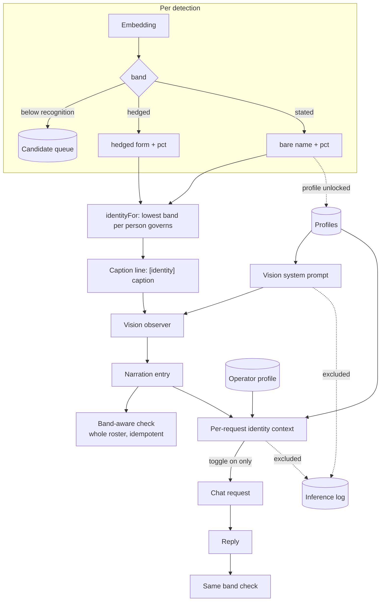
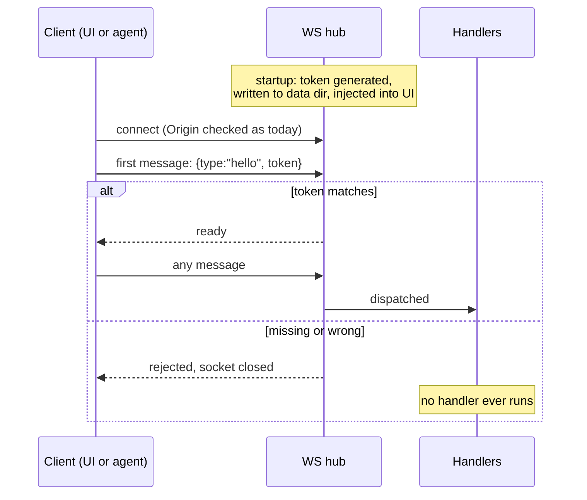

# feat: Recognition identity bands, roster editing, and character profiles

## Summary

Replace the prose identity hedge with a three-band confidence scheme, make the roster editable, give
each person a character profile delivered through system prompts, and let a conversation opt into
seeing who is present. Three prerequisites the feature inherited — a per-boot WS token, the biometric
purge, and keeping profile text out of the inference log — land first as Phase 0.

---

## Problem Frame

Recognition works and cannot say what it knows. Every match renders as `someone who looks like Jimbo`
in both the pane and the line handed to the summariser, and the roster is a lookup table for a string:
HAL knows a face belongs to an entry called Jimbo and nothing about who Jimbo is. Chat has never been
vision-aware at all.

Two things make this more than a phrasing change. The hedge is a **two-layer, tested guarantee** —
shaped on the way into the model and enforced on the way out by a regex whose fifteen cases each
encode a defect found by review. And the identity path's failure mode inverts: today a wrong match is
wrongly hedged, after this it is a wrong name stated flatly.

The prerequisites are not scope creep. The per-boot WS token has been deferred by three features in
a row; this one adds free-text descriptions of named third parties to what an unauthenticated local
client can write. The biometric purge was specified in the parent brief and never built. And the
inference log records every prompt verbatim and is never pruned, so without a change, "deleting a
person removes their profile" would be false the moment it was written.

---

## Status — 2026-08-08

Phases 0 to 3 are shipped: the per-boot WS token, the biometric purge, the inference-log redaction
seam, both identity thresholds, three-band rendering, the band-aware output check, the pane, the
roster editor (rename with merge, prune a face, add a face from a picture), and character profiles
with an operator mark.

**Phase 4 — U13, U14, U15 — is paused, not abandoned.** The vision-to-chat seam is unstarted at the
user's direction, in favour of iterating on what is built. The units below stand as written; three
constraints established during planning and review are restated in
`docs/residual-review-findings/feat-recognition-identity-and-profiles.md` so they are not
rediscovered. Nothing shipped depends on Phase 4.

Two things shipped unverified and are recorded in that same file: whether a profile in the system
prompt stays out of the narration (needs a narration model and several cycles), and whether a
photograph of an enrolled person actually enrols (needs a photograph).

## Requirements Trace

| Origin | Covered by |
|---|---|
| R1–R8 — three bands, thresholds, band-aware output check | U4, U5, U6, U7 |
| R9–R16 — rename/merge, face pruning, enrol from image, refusals | U8, U9, U10 |
| R17–R24 — profiles, operator, system-prompt delivery, bounds | U11, U12 |
| R25–R32 — conversation toggle, per-request assembly, acknowledgement | U13, U14, U15 |
| R33–R35 — deletion and purge coverage for profiles | U2, U11 |
| R36 — protocol reachability | U8, U9, U10, U11, U13 |
| R37, R38 — per-boot WS token | U1 |
| R39 — biometric purge | U2 |
| R40 — profile text excluded from inference records | U3 |
| AE1, AE5 — band boundaries, lowest band governs | U5 |
| AE2 — hedged match contributes no profile | U12 |
| AE3, AE4 — output check follows the band, no live band hedges | U6 |
| AE6 — profile detail is not narrated as observation | U12 |
| AE7 — rename that collides merges | U9 |
| AE8, AE9 — last-face refusal, crowded photo refused | U9, U10 |
| AE10 — toggle off is byte-for-byte silence | U14 |
| AE11 — operator known before the camera is | U14 |
| AE12 — purge takes profiles | U2 |

---

## Key Technical Decisions

**The band is computed once, in `identityFor`, and rendered into a string there.** `narrate()`
interpolates exactly one field per observation, so anything the summariser is to see must already be
inside `o.identity`. Keeping band logic in one function also keeps the pane and the caption line from
drifting, which they currently do — `WebcamPane.tsx` rebuilds the hedge as literal JSX rather than
calling `hedgedIdentity`.

**Every band comparison is phrased as acceptance, never as a negated inequality.**
`docs/solutions/a-threshold-guard-written-as-a-negation-fails-open-on-nan.md` records
`if (confidence < threshold) return null` shipping a confident identification for `NaN`. This feature
multiplies that comparison surface roughly fivefold and each one decides whether a human gets named.
R5's "lowest band observed" is reduced with an explicit finite filter rather than `Math.min`, which
propagates `NaN`.

**The percentage stays in the caption line, as a recorded bet.** The user chose this knowing the
counter-argument: `docs/solutions/an-instruction-that-fights-its-own-input-loses.md` records
timestamps and ordinals both becoming the subject of narration, and its first rule is to stop
supplying a label rather than write a rule against it. The pane already renders the confidence, so
supplying it to the model is the same class of label. Because it ships anyway, it gets a falsifying
test (U5) rather than a caveat — writing the caveat is what that document says is not enough.

**Image transcoding happens in the browser, not the server.** A canvas re-encode with
`imageOrientation: 'from-image'` applies EXIF rotation and accepts HEIC, which ffmpeg cannot decode
without libheif. It also produces a single JPEG used for both detection and cropping — re-encoding
between those two stages would shift the returned box off the face, since the box is in the
coordinates of the buffer detection ran on.

**Identity context is assembled per request and never persisted.** Folding it into
`conversation.systemPrompt` would write profile text into `conversations/*.json`, beyond the reach of
both per-person deletion and the purge — the same hazard U3 closes for the inference log — and would
freeze the roster at thread creation so a rename never reached an open thread.

**Rename-as-merge composes unlocked helpers inside `PeopleStore`'s existing chain.**
`docs/solutions/editing-state-a-running-process-caches-loses-the-edit.md` records a cached array
overwriting a completed merge. `withLock` is not reentrant — `enrolByNameUnlocked` calls
`addFaceUnlocked`, not `addFace` — so a merge calling public mutators would deadlock.

**The token is a first-message handshake, not a query parameter.** It must be readable by a protocol
client, so it is written to the data dir rather than only injected into the served UI. Requests with
no `Origin` stay accepted, preserving the agent-parity rule `AGENTS.md` is explicit about.

---

## High-Level Technical Design

Where identity reaches a model, and what is gated where:

The token handshake, and why it runs before any handler:

---

## Implementation Units

### Phase 0 — Prerequisites

### U1. Per-boot WS token

- **Goal:** No handler runs for a client that has not presented the boot token.
- **Requirements:** R37, R38
- **Dependencies:** none
- **Files:** `server/src/ws.ts`, `server/src/app.ts`, `server/src/paths.ts`, `server/src/http.ts`,
  `ui/src/ws-client.ts`, `shared/src/types.ts`, `AGENTS.md`,
  `server/test/ws-token.test.ts`, `server/test/readiness.test.ts`
- **Approach:** Generate a random token in `startApp`, write it to the data dir beside `settings.json`,
  and inject it into the served HTML so the UI reads it without a fetch. The hub holds each socket in
  an unauthenticated state until a first `hello` message carries a matching token; anything else closes
  the socket. Origin checking is unchanged and stays first — the token is an additional gate, not a
  replacement. Requests with no `Origin` remain accepted so an agent can connect, which is exactly why
  the token file must be readable rather than UI-only. Read
  `docs/residual-review-findings/feat-ambient-log-monitors.md` before touching `ws.ts`; it holds the
  design and the reason the origin allowlist alone is insufficient.
- **Patterns to follow:** `server/src/origin.ts` for the existing gate ordering; `server/src/paths.ts`
  for data-dir resolution; the `hub.onConnection` greeting in `server/src/vision/service.ts` for what
  must now wait until after the handshake.
- **Test scenarios:**
  - A socket that sends a valid `hello` first receives its greeting and can send further messages.
  - A socket that sends any other message first is closed and no handler observes it.
  - A socket presenting a wrong token is closed; a socket presenting no token is closed.
  - A connection with no `Origin` header and a valid token succeeds — the agent-parity path.
  - A connection with a disallowed `Origin` is rejected before the token is even considered.
  - Two consecutive boots produce different tokens, and a token from the previous boot is rejected.
  - The token file is written before the listener accepts connections.
- **Verification:** The UI connects and functions unchanged. A raw `ws` client without the token is
  refused; the same client reading the token from the data dir succeeds.

### U2. Biometric purge

- **Goal:** One control removes everything biometric, including profiles once they exist.
- **Requirements:** R34, R39, AE12
- **Dependencies:** U1
- **Files:** `shared/src/types.ts`, `server/src/vision/service.ts`, `server/src/vision/people.ts`,
  `server/src/vision/candidates.ts`, `ui/src/components/SettingsPanel.tsx`, `ui/src/store.ts`,
  `server/test/vision/purge.test.ts`, `ui/test/components/SettingsPanel.test.tsx`
- **Approach:** A `purge-biometrics` message clears the gallery, the candidate queue, every crop
  directory, and the overflow tally. `CandidateStore.clear()` already exists with no production
  caller; `PeopleStore` needs the equivalent. A preceding count message drives a confirmation that
  states how many people, faces, and pending items will be lost — profiles join that count in U11.
  Reset the appearance tracker afterward so an open appearance cannot keep trading on a purged
  identity, exactly as `delete-person` does.
- **Patterns to follow:** `delete-person` in `server/src/vision/service.ts` for the mutate → reset →
  rebroadcast sequence; the two-stage `confirmingDelete` state in `SettingsPanel.tsx` for a
  destructive control whose confirm label restates the consequence.
- **Test scenarios:**
  - Purging with two people, five faces, and three candidates leaves the gallery and queue empty.
  - Every crop file under both face and candidate directories is gone afterward.
  - The overflow tally resets, so a purged queue does not report historical drops.
  - The confirmation reports counts matching what is actually stored.
  - A purge while an appearance is open resets the tracker; the next detection decides afresh.
  - A purge with an unwritable crop directory still empties the gallery and reports the failure rather
    than leaving people matchable.
- **Verification:** After a purge, a previously enrolled person appears as unrecognised and produces a
  candidate.

### U3. Profile-safe inference logging

- **Goal:** Profile text never reaches `inference/**`, so deletion and purge promises stay true.
- **Requirements:** R40
- **Dependencies:** none
- **Files:** `server/src/logging/instrument.ts`, `shared/src/types.ts`,
  `server/test/logging/instrument.test.ts`
- **Approach:** `withInferenceLogging` wraps the provider factory once and records `system` plus every
  message verbatim — "logged by construction" is its stated design intent, so the exclusion must be
  explicit rather than incidental. Carry the profile segment as a separately-identified part of the
  request so the logger can omit it and record a placeholder noting that a profile segment was present
  and its length. The rest of the prompt continues to be logged verbatim; the log keeps its purpose of
  recording what was actually asked, minus the one class of text that must be deletable.
- **Patterns to follow:** the existing `source` discriminator on the log record for carrying
  structured provenance alongside the message array.
- **Test scenarios:**
  - A call whose system message contains a profile segment writes a record with the segment absent.
  - The same record notes that a profile segment was present, so the omission is visible rather than
    silent.
  - A call with no profile segment is logged byte-for-byte as it is today.
  - The omission survives the `finally` path — a consumer that breaks early still writes a redacted
    record, not an unredacted one.
- **Verification:** Enable a profile, run a vision cycle, and grep `inference/` for the profile text.
  It is absent, and the record still shows the vision prompt.

### Phase 1 — Identity bands

### U4. Two thresholds, finite-safe

- **Goal:** Recognition and statement thresholds are settable, separated, and safe against non-finite
  values.
- **Requirements:** R2, R3
- **Dependencies:** none
- **Files:** `shared/src/types.ts`, `server/src/storage/settings.ts`,
  `ui/src/components/SettingsPanel.tsx`, `ui/test/components/harness.tsx`,
  `server/test/storage/settings-vision.test.ts`
- **Approach:** Add `statementThreshold` to `VisionSettings` defaulting to 0.6, clamped with
  `clampFloat`. R3's minimum separation is the first cross-field rule `mergeVision` has carried — every
  existing rule is per-field — so it is applied after both fields resolve, and a patch carrying either
  or both must land in the same valid state. Give the default a comment recording its provenance: it
  rests on field observation of two enrolled people with no cross-person false positive, not on the
  0.93 spike figure, which
  `docs/solutions/a-measurement-on-synthetic-variants-measures-your-own-transform.md` shows measured
  the embedder's rotation invariance rather than same-person similarity.
- **Patterns to follow:** `confidenceThreshold` at `server/src/storage/settings.ts:69` and its clamp at
  :187; `numberField` in `SettingsPanel.tsx:159` — its `key` union is hand-maintained and must gain the
  new field or the UI will not typecheck.
- **Test scenarios:**
  - A statement threshold below the recognition threshold is rejected up to the minimum separation.
  - A patch raising the recognition threshold above the statement threshold pushes the statement
    threshold up rather than leaving an inverted pair.
  - `NaN`, `null`, a string, and `Infinity` in either field leave the previous value intact.
  - A hand-edited settings file with an inverted pair loads into a valid separated pair.
  - The statement threshold cannot be set below its floor.
  - `Test expectation` for the UI: the new control appears in the recognition fieldset and commits on
    blur, not per keystroke.
- **Verification:** Both thresholds are adjustable in the Vision settings panel and take effect on the
  next detection with no restart.

### U5. Three-band identity rendering

- **Goal:** `identityFor` produces the band-correct string, with the lowest band observed governing.
- **Requirements:** R1, R4, R5, AE1, AE5
- **Dependencies:** U4
- **Files:** `server/src/vision/service.ts`, `server/src/vision/appearances.ts`,
  `shared/src/prompts.ts`, `shared/src/types.ts`, `server/test/vision/service-recognition.test.ts`,
  `server/test/vision/bands.test.ts`
- **Approach:** Add a band resolver beside `hedgedIdentity` in `shared/src/prompts.ts` so the server
  and the pane share one formatter rather than duplicating the literal. `identityFor` currently keeps
  the **highest** confidence per person; R5 inverts that, so it must retain the lowest band observed
  while keeping the existing dedupe-per-person rule, which exists because without it the line read
  "someone who looks like SW and someone who looks like SW and…". `Appearance` carries a single
  decided `match` and no confidence history, so per-cycle band minima need confidences accumulated
  across the capture buffer rather than read off the appearance. Reduce with an explicit finite filter.
  Update the `VisionObservation.identity` type comment, which currently asserts the field never holds
  a bare name — that invariant changes here and two other places encode it.
- **Patterns to follow:** the existing dedupe map in `identityFor`; the sampling position in
  `captureOnce`, which reads identity beside the frame grab and before the caption await for a
  recorded reason.
- **Test scenarios:**
  - Covers AE1. Matches at 0.44, 0.55, 0.71 with thresholds 0.5/0.6 produce unrecognised, hedged with
    percentage, and stated with percentage.
  - Covers AE5. One person reading 0.55 then 0.74 within a cycle renders hedged, not stated.
  - A confidence of exactly the statement threshold states; exactly the recognition threshold hedges.
  - A `NaN` confidence renders unrecognised and never stated — supplied deliberately, since nothing
    else finds this class.
  - Two people, one hedged and one stated, render both forms in one line without collapsing.
  - The same person detected twice in one cycle still produces one entry, not "Jimbo 71% and Jimbo 68%".
  - The recorded bet on the percentage: a cycle whose captions describe only posture produces a
    narration entry that does not discuss the confidence number itself. This is the falsifying test for
    keeping the percentage in the caption line.
- **Verification:** The pane and the caption line agree on the band for the same person.

### U6. Band-aware output check

- **Goal:** A bare enrolled name in model output is rewritten into the form its band requires, over
  the whole roster, idempotently.
- **Requirements:** R6, R7, R8, AE3, AE4
- **Dependencies:** U5
- **Files:** `shared/src/prompts.ts`, `server/src/vision/service.ts`,
  `server/test/narration/hedge.test.ts`, `server/test/narration/bands-output.test.ts`
- **Approach:** `enforceIdentityHedge` gains a band map instead of a bare name list. Its four hard-won
  properties must survive: the prefix matched as an optional group rather than a lookbehind, full
  case-insensitivity, longest-name-first ordering, and whitespace-run tolerance. Idempotence gets
  harder — the function must now recognise two already-correct forms and leave each alone, and the
  stated form has no prior art, so `Jimbo 71% 71%` is the new failure to prevent. R7 changes the input
  contract: names come from the whole roster rather than the cycle's matches, so `summarise` needs a
  roster read, and a name with no live band defaults to hedged. Accept the over-hedging cost
  explicitly, as the file already does for ordinary words.
- **Execution note:** Characterization first. The fifteen existing cases each name a defect they
  prevent; get them green against the new signature before adding band behaviour.
- **Patterns to follow:** the existing regex construction and its comments, each of which records a
  review finding.
- **Test scenarios:**
  - All fifteen existing cases stay green, adapted to the new signature with an explicit all-hedged
    band map so their intent is stated rather than implied.
  - Covers AE3. A hedged-band name written bare gains the hedge; a stated-band name written bare gains
    its percentage.
  - Covers AE4. An enrolled name with no live band — the operator, with nothing detected — is hedged.
  - Idempotence in the stated band: `Jimbo 71%` echoed back is unchanged, not doubled.
  - Idempotence across re-casing: `jimbo 71%` and `Jimbo (71%)` are recognised as already-stated.
  - A sentence-initial capitalised hedge is not double-hedged, the case that shipped as a P1 before.
  - A person named `Al` does not rewrite `Also`; `Ann` does not partially rewrite `Ann Marie`.
  - Fixtures are drawn from plausible model output — re-cased, re-punctuated — not from what the model
    was handed.
- **Verification:** Reintroduce the bare-name bug deliberately and watch the new tests fail. A
  regression test that has only ever been green has not been shown to test anything.

### U7. Band rendering in the pane

- **Goal:** The pane renders all three bands from the shared formatter.
- **Requirements:** R4, R15
- **Dependencies:** U5
- **Files:** `ui/src/components/WebcamPane.tsx`, `ui/src/store.ts`, `ui/src/styles.css`,
  `ui/test/components/WebcamPane.test.tsx`
- **Approach:** `RecognitionStrip` hardcodes the hedge as literal JSX. Replace it with the shared
  formatter so the pane cannot drift from the caption line. Distinguish the bands visually enough that
  a stated identity does not read as a hedged one.
- **Patterns to follow:** the existing `vision-identity` / `vision-confidence` spans and
  `vision-enrol-error` for fault text.
- **Test scenarios:**
  - A stated-band appearance renders the bare name with its percentage.
  - A hedged-band appearance renders the hedged form and **never** the bare name — assert the negative,
    since falling through to the more confident presentation is the dangerous direction.
  - An unrecognised appearance renders the existing unknown copy.
  - Mixed bands in one frame render both forms.
- **Verification:** Screenshot the pane with a stated and a hedged identity in view.

### Phase 2 — Roster editing

### U8. Roster surface

- **Goal:** A place to see and edit people that works with Vision off.
- **Requirements:** R16, R36
- **Dependencies:** U1
- **Files:** `ui/src/components/SettingsPanel.tsx`, `ui/src/store.ts`, `ui/src/persona.ts`,
  `ui/src/styles.css`, `ui/test/components/roster.test.tsx`
- **Approach:** Every control in `WebcamPane` is gated on Vision and recognition both being enabled, so
  R16 places the roster outside it. The settings panel already renders a person list with thumbnail,
  name, and face count — extend that into the editing surface rather than inventing a second one.
- **Patterns to follow:** the `person-row` list in `SettingsPanel.tsx:527` and its panel-level
  `confirmingDelete` state, which holds one confirmation at a time.
- **Test scenarios:**
  - The roster renders with Vision switched off and recognition disabled.
  - A person with no faces and a person with several both render correctly.
  - Opening a second row's confirmation closes the first.
  - The list updates when a `vision-people` broadcast arrives.
- **Verification:** Switch Vision off, open settings, and edit a person.

### U9. Rename-as-merge and face pruning

- **Goal:** Rename with merge-on-collision, and remove a single face.
- **Requirements:** R9, R10, R10a, R11, R12, R15, R36, AE7, AE8
- **Dependencies:** U8
- **Files:** `shared/src/types.ts`, `server/src/vision/people.ts`, `server/src/vision/service.ts`,
  `ui/src/components/SettingsPanel.tsx`, `ui/src/store.ts`,
  `server/test/vision/people-merge.test.ts`, `ui/test/components/roster.test.tsx`
- **Approach:** `renameUnlocked` composes other `*Unlocked` helpers inside one `withLock` — the chain
  is not reentrant, so calling public mutators from inside it deadlocks. A rename resolving to the
  record being renamed changes the stored spelling and merges nothing; without this carve-out, fixing
  capitalisation self-collides and either no-ops or folds a record into itself. A merge keeps the
  surviving id, concatenates faces skipping any embedding already held, joins both profiles, and keeps
  the operator marking if either side had it. Reset the tracker afterward, since buffered observations
  and open appearances still carry the losing id. Delete the JSON first and the thumbnail second, so a
  failed unlink leaves an orphaned file rather than a record pointing at a missing image.
  Refusals get their own typed result rather than a shared error field, so two actions cannot overwrite
  each other's message.
- **Patterns to follow:** `enrolByNameUnlocked` for the case-insensitive trimmed match; the merge hint
  in `WebcamPane.tsx:205`, which states which way a submit will go and exists because retyping a name
  and hoping is how one person became several records; `delete-person` for mutate → reset →
  rebroadcast.
- **Test scenarios:**
  - Covers AE7. Renaming a two-face `Steven` to `Steve` with three faces yields one record of five.
  - Renaming `steve` to `Steve` changes the spelling, merges nothing, and does not delete the record.
  - A merge keeps the surviving record's id; buffered observations referencing the losing id do not
    resurrect it.
  - A merge where both records carry the operator marking leaves exactly one operator.
  - A merge concatenating an embedding already held does not double the face count.
  - Covers AE8. Removing the only face is refused and the refusal names deleting the person instead.
  - Removing one of three faces leaves two and deletes exactly one thumbnail.
  - A thumbnail unlink failure still removes the face from the record and reports the failure.
  - An empty or whitespace-only rename is refused.
  - Concurrent rename and enrolment do not lose either write.
- **Verification:** Consolidate two duplicate records through the UI; the roster shows one person with
  the combined faces and matching improves.

### U10. Enrol from a saved image

- **Goal:** Add a face from a file on disk.
- **Requirements:** R13, R14, R15, R36, AE9
- **Dependencies:** U8
- **Files:** `shared/src/types.ts`, `ui/src/components/SettingsPanel.tsx`, `ui/src/store.ts`,
  `server/src/vision/service.ts`, `server/src/vision/recogniser.ts`,
  `server/test/vision/enrol-image.test.ts`, `ui/test/components/roster.test.tsx`
- **Approach:** The browser re-encodes the chosen file to JPEG through a canvas with
  `imageOrientation: 'from-image'`, which applies EXIF rotation and accepts HEIC — a phone portrait is
  stored sideways, and without this the detector misses a face the user can plainly see. The same
  JPEG bytes go to detection and cropping; re-encoding between them shifts the box off the face. The
  UI downscales before encoding so the payload clears the sidecar's 16MB pre-decode cap after base64
  inflation, and states its own limit rather than surfacing a socket close. Bytes cross as a base64
  string on the message, the first large client-to-server payload in the protocol. The server reuses
  the existing enrol sequence: detect, require exactly one face, require an embedding, crop. The three
  failure causes get three distinct messages — no face found, the file could not be read, a face was
  found but could not be embedded — because the existing three messages are all worded for a camera.
  The source image is not retained; only the crop is written, preserving the rule that whole frames
  are never stored as one person's face. Reset the tracker afterward so the new face counts on the
  next interval. An upload while Vision is running can lose the recogniser's single-flight lane, so a
  `busy` response retries rather than surfacing as a fault.
- **Patterns to follow:** the `enrol-person` handler for the detect-and-crop sequence and its typed
  result; `cropFace` in `server/src/vision/thumbnail.ts` for the ffmpeg discipline and timeout.
- **Test scenarios:**
  - Covers AE9. A two-face image is refused and no face is added.
  - A zero-face image is refused with the no-face message, distinct from an undecodable file.
  - A one-face image adds a face to the named person and the face count increments.
  - An image whose face detects but yields no embedding is refused with its own message.
  - A file over the stated size limit is refused client-side with the limit named, before any request.
  - A `busy` response from the recogniser retries rather than reporting the recogniser as slow.
  - Enrolling from an image while Vision is off succeeds — the path must not touch the camera stream.
  - The source image is not written anywhere; only the crop exists afterward.
  - Enrolling a name that already exists adds to that person, matching live enrolment.
- **Verification:** Enrol a face from a phone photo taken in portrait orientation. It is detected, and
  the crop is upright and correctly framed.

### Phase 3 — Profiles and the operator

### U11. Profile and operator on the person record

- **Goal:** People carry a profile; one is the operator; both are deleted with them.
- **Requirements:** R17, R18, R23, R33, R34, R35, R36
- **Dependencies:** U2, U8
- **Files:** `shared/src/types.ts`, `server/src/vision/people.ts`, `server/src/vision/service.ts`,
  `ui/src/components/SettingsPanel.tsx`, `ui/src/store.ts`,
  `server/test/vision/profiles.test.ts`, `ui/test/components/roster.test.tsx`
- **Approach:** `profile?: string` and an operator marking are optional fields on `Person`, so existing
  on-disk records read them as absent with no migration — the same upgrade style
  `ConversationMeta.systemPrompt` uses. Both must be added to `PersonSummary` explicitly or the UI
  never sees them, and embeddings must stay out of that projection. Marking a second person as
  operator moves the mark rather than creating two. The length bound is enforced at save with the
  limit named, not by blocking keystrokes. The purge's confirmation gains a profile count.
- **Patterns to follow:** the optional-field precedent in `shared/src/types.ts:36`; `summarize()` in
  `people.ts:79` for the projection; the roster row and its confirmation staging.
- **Test scenarios:**
  - A person written before this feature loads with no profile and no operator marking.
  - Saving a profile persists it and it survives a restart.
  - Marking a second person operator clears the first; exactly one marking exists.
  - Deleting the operator leaves no operator marked and no dangling reference.
  - Deleting a person removes their profile with their faces.
  - A purge removes all profiles and the operator marking, and its confirmation counts them.
  - A profile over the bound is refused at save with the limit stated; nothing is truncated.
  - Concurrent profile save and enrolment do not lose either write.
- **Verification:** Set a profile and an operator, restart, and both are still there.

### U12. Profiles into the vision observer's system prompt

- **Goal:** Stated identities contribute their profiles to the observer's standing context.
- **Requirements:** R19, R20, R21, R24, AE2, AE6
- **Dependencies:** U5, U11
- **Files:** `server/src/vision/service.ts`, `shared/src/prompts.ts`,
  `server/test/vision/profile-prompt.test.ts`
- **Approach:** The profile segment is appended to the resolved vision prompt and sent **even when the
  user has blanked it**, so its presence is independent of the `isBlankPrompt` branch that currently
  omits the system message entirely. Only stated-band identities contribute — a hedged match gives its
  name and percentage and no biography. Phrase the segment as standing knowledge rather than as a
  document: `docs/solutions/an-instruction-that-fights-its-own-input-loses.md` records that calling
  captions "what your eye reported" made HAL discuss the document. Bound the total across all people
  independently of the per-profile bound, and state what was dropped; the observer prompt is the one
  that was measured working *worse* when it grew three times longer. Mark the segment so U3's logger
  can exclude it.
- **Patterns to follow:** `DEFAULT_VISION_PROMPT` for standing-material phrasing and length discipline;
  `resolvePrompt` for the stored-null-means-default convention.
- **Test scenarios:**
  - Covers AE2. A 0.55 match contributes no profile to the prompt.
  - A 0.71 match contributes its profile.
  - Covers AE6. A stated person whose profile names facts absent from the captions produces a narration
    entry that reports only what the captions carried. Exercise this at the `always` sensitivity, where
    the model must speak every cycle and reaches for whatever material it has.
  - A blanked vision prompt still carries the profile segment.
  - Several people in view stay within the total bound, and what was dropped is stated.
  - A person with no profile contributes nothing rather than an empty heading.
  - The profile segment does not appear in the caption line under any configuration.
- **Verification:** With a profile set, a stated identity in view produces narration that reflects who
  the person is without asserting profile detail as something seen.

### Phase 4 — Identity context in conversation

### U13. Conversation toggle

- **Goal:** Each conversation carries an identity-context flag, defaulting on for new threads.
- **Requirements:** R25, R36
- **Dependencies:** U1
- **Files:** `shared/src/types.ts`, `server/src/storage/conversations.ts`, `server/src/chat.ts`,
  `ui/src/store.ts`, `ui/src/components/*` (conversation controls),
  `server/test/chat/identity-toggle.test.ts`
- **Approach:** An optional boolean on `ConversationMeta`, set at creation. Absent must read as **off**
  — any `?? true` silently changes a thread started under the old contract, which R25 forbids. The
  mutator follows `setSystemPrompt`: read-modify-write inside `withLock`, bump `updatedAt`. The
  message inherits UUID validation from the structural `conversationId` guard.
- **Patterns to follow:** `set-conversation-prompt` and `ConversationStore.setSystemPrompt`.
- **Test scenarios:**
  - A conversation created before this feature reads the flag as off.
  - A new conversation defaults on.
  - Toggling persists and survives a restart.
  - A non-UUID conversation id is rejected by the existing guard.
  - Toggling off mid-thread governs only the next request; history is not rewritten.
- **Verification:** An old conversation shows the toggle off; a new one shows it on.

### U14. Per-request identity context

- **Goal:** With the toggle on, the request carries operator, in-view identities, and recent narration.
- **Requirements:** R26, R27, R27a, R28, R29, R30, AE10, AE11
- **Dependencies:** U11, U12, U13
- **Files:** `server/src/chat.ts`, `server/src/app.ts`, `server/src/storage/observations.ts`,
  `shared/src/types.ts`, `server/test/chat/identity-context.test.ts`
- **Approach:** `ChatService` has no vision dependency and is constructed before `VisionService`, so
  the context source is a structural interface resolved lazily — the file already does this for the
  camera. Assembly happens inside `runGeneration`'s existing `try`, per request, never written to the
  conversation record. With the toggle off the expression is untouched, which is what makes AE10
  byte-for-byte rather than approximately true. Narration comes from the persisted observation log
  filtered to vision entries, bounded to a recent window, so it works on the first message after a
  restart. While Vision is off the narration segment is omitted rather than carrying entries from
  before the camera was released — the parent brief releases the rolling window on toggle-off and this
  should not contradict it. Mark the profile parts for U3's exclusion.
- **Patterns to follow:** the lazy `camera: () => vision?.cameraSource() ?? null` wiring in
  `server/src/app.ts:53`; `ObservationLog.recent`; the `fromVision` discriminator.
- **Test scenarios:**
  - Covers AE10. Toggle off with a blank prompt sends a request with no system message at all.
  - Covers AE11. Toggle on, Vision off, operator set: the first message carries the operator's profile.
  - Toggle on with nobody in view omits the in-view segment rather than sending it empty.
  - Toggle on with no operator marked omits the operator segment.
  - Only stated-band identities appear; a hedged match contributes name and confidence, no profile.
  - The narration window is bounded and contains only vision entries, not session or monitor ones.
  - Vision off omits the narration segment rather than serving stale entries.
  - Nothing is written to the conversation record — the stored file is unchanged by assembly.
  - A rename between two messages is reflected in the second request, proving per-request assembly.
- **Verification:** Ask HAL who it is talking to in a toggled-on conversation with Vision off. It knows.

### U15. Chat band check and provider acknowledgement

- **Goal:** Chat replies get the same band guarantee as narration, and identity data does not leave the
  machine unannounced.
- **Requirements:** R28a, R31, R32
- **Dependencies:** U6, U14
- **Files:** `server/src/chat.ts`, `shared/src/types.ts`, `ui/src/store.ts`,
  `ui/src/components/*` (conversation controls), `server/test/chat/band-check.test.ts`
- **Approach:** Apply the band-aware check to the reply stream, so a conversation cannot state the
  operator's name on the strength of standing context alone — the failure AE4 exists to prevent,
  arriving through the other surface. The acknowledgement is gated on the provider **in effect at send
  time**, not on the toggle transition, because a provider configured later would otherwise bypass it
  entirely. Check before the user's message is appended and broadcast, so declining leaves the request
  genuinely unchanged rather than stranding a persisted message with a locked conversation. Record the
  acknowledgement in settings so it is reachable and satisfiable by a protocol client, not only by a
  dialog — a UI-only acknowledgement is precisely the bypass this requirement closes.
- **Execution note:** Test-first on the decline path. It is the branch whose failure mode is silent
  data egress.
- **Patterns to follow:** the streaming loop in `runGeneration`; the settings-backed acknowledgement
  shape used for the recogniser endpoint.
- **Test scenarios:**
  - A reply stating an enrolled name with no live band is rewritten to the hedged form.
  - A reply stating a stated-band name in view is left alone.
  - Rewriting does not corrupt a streamed reply mid-token.
  - With a local provider, no acknowledgement is required and behaviour is unchanged.
  - With a non-local provider and the toggle already on, the acknowledgement fires before the user's
    message is appended.
  - Declining leaves the toggle off, the message unsent, and the conversation unlocked for a retry.
  - Acknowledging persists, so it is not asked again for the same provider.
  - Switching from a local to a non-local provider re-arms the acknowledgement for already-on threads.
  - A protocol client can acknowledge without the UI.
- **Verification:** Configure a non-local provider with an identity-context conversation open, send a
  message, and confirm the acknowledgement fires and declining sends nothing.

---

## Risks & Dependencies

**The 0.6 statement threshold rests on observation, not measurement.** Two enrolled people with no
observed cross-person false positive bounds the risk for one pair in one room. A third person, or a
genuine lookalike, invalidates it. Both thresholds are settable, and the hedged band is retained
rather than removed, so the correction is a setting rather than a release.

**The output check loses its oracle.** Its previous invariant — a bare name in a narration entry is a
defect — stops holding, because a bare name is now sometimes correct. Nothing replaces it, so U6's
tests are the only thing standing between a band bug and silence.

**The token changes how every client connects.** U1 touches the seam that all three observation roles
and chat share. It is first precisely so that everything after it is built against the final shape,
but a mistake here is felt everywhere.

**Self-review will not find the failures that matter here.**
`docs/solutions/self-review-finds-mechanism-bugs-not-outcome-bugs.md` records that on the recognition
feature, self-review found three mechanism bugs and none of the four P1s in the identity path. This
feature converts the identity failure mode from "wrongly hedged" to "wrong name stated flatly", which
is squarely the wrong-answer class that document says needs someone who did not write it. Budget an
independent review pass and hand the reviewers `docs/solutions/`.

**Residuals discharged:** the name-keyed merge and the edit-the-file-behind-a-running-server hazard
(U9); one-frame enrolment (U10); unauthenticated biometric mutation (U1); the unbuilt purge (U2).

---

## Open Questions

**Deferred to implementation**

- The exact minimum separation between the two thresholds, and the statement threshold's floor.
- The size of the narration window carried into a conversation — entry count, age, or cycle boundary.
- Whether the total profile bound drops whole profiles or truncates the last one, and how that is
  stated.
- Whether the token is presented as a first message or a WS subprotocol; both satisfy R38 and the
  choice is visible only to protocol clients.
- Whether the roster editor's profile field is inline per row or a detail view, once the row has a
  name, a face list, a profile, and an operator control.

---

## Sources & Research

- Origin: `docs/brainstorms/2026-08-08-recognition-identity-and-character-profiles-requirements.md`
- `docs/solutions/a-measurement-on-synthetic-variants-measures-your-own-transform.md` — why 0.93 cannot
  place a threshold, and the 0.53–0.78 range that can.
- `docs/solutions/a-threshold-guard-written-as-a-negation-fails-open-on-nan.md` — the acceptance-phrasing
  rule every band comparison follows.
- `docs/solutions/an-instruction-that-fights-its-own-input-loses.md` — why profiles are positioned
  rather than prohibited, and the counter-argument to the percentage in the caption line.
- `docs/solutions/editing-state-a-running-process-caches-loses-the-edit.md` — why merge composes
  unlocked helpers inside the existing chain.
- `docs/solutions/tests-that-lock-in-the-bug.md` — fixture discipline for the band tests.
- `docs/solutions/a-removed-precondition-blinds-every-test-that-set-it.md` — why U6's band tests live in
  a block that never passes a bare name list.
- `docs/solutions/self-review-finds-mechanism-bugs-not-outcome-bugs.md` — the review posture this
  feature needs.
- `docs/solutions/a-flag-nothing-reads-looks-shipped.md` — why each refusal and each band needs a
  consumer-side test, not only a producer-side one.
- `docs/residual-review-findings/feat-ambient-log-monitors.md` — the token design, and the reason the
  origin allowlist alone is not enough.
- `docs/residual-review-findings/feat-inference-logging-and-concurrent-sessions.md` — the unpruned,
  unredacted prompt log U3 addresses.
- `docs/residual-review-findings/feat-recognition-loop.md`, `feat-enrolment-candidates.md`,
  `feat-vision.md` — required reading before touching recognition code.
