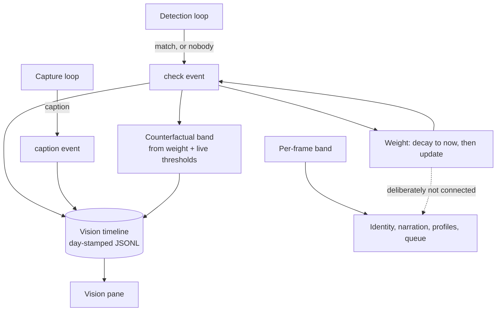
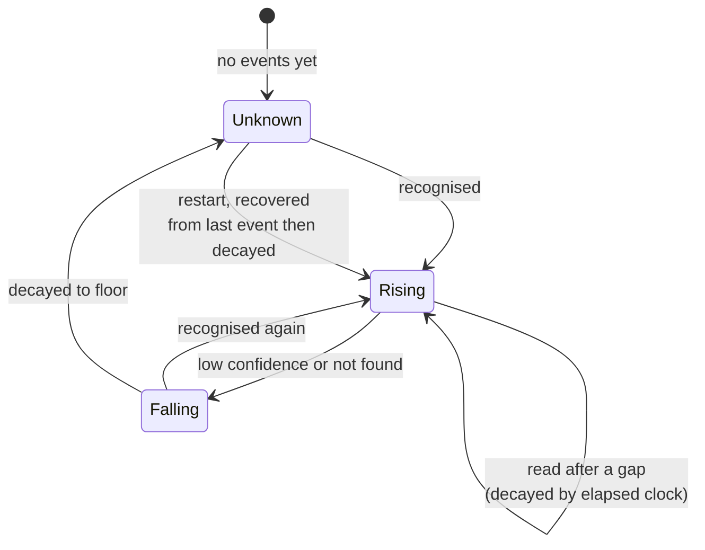

# feat: Vision timeline and recognition weight

## Summary

Persist every recognition check and every caption as timestamped events in one ordered stream, and
give each person a weight that rises with repeated recognition and decays by wall-clock. Weight and
the band it would have chosen are recorded and displayed; nothing HAL says changes.

---

## Problem Frame

Nothing about seeing is kept. `server/src/storage/observations.ts` persists narration entries — what
HAL *said* — and detection results are broadcast as appearances and discarded. Captioned observations
live only in the browser, capped at fifty, and are not replayed on reconnect. So "when was the face
recognised, and when was the image described" has no answer after the fact for either half.

The two loops also run at different speeds and only one is sampled. Detection fires on its own
interval; identity is read once per capture, beside the frame grab, and stamped onto that observation.
At a fifteen-second detection interval against a sixty-second capture, three checks in four leave no
trace at all.

Separately, a single frame's confidence is the least stable evidence available — independent captures
of one person score 0.53 to 0.78 — and the band visibly flickers across one continuous visit. Nothing
accumulates that evidence today because nothing keeps it.

---

## Requirements Trace

| Origin | Covered by |
|---|---|
| R1–R3 — check events, including non-detection | U2 |
| R4, R5 — caption events, one distinguishable stream | U3 |
| R6 — persistence across restart | U1 |
| R7, R8 — weight rises and falls, recorded per event | U4 |
| R9 — wall-clock decay | U4 |
| R10 — the counterfactual band | U5 |
| R11 — weight changes nothing HAL says | U4, U5 |
| R12–R14 — the pane reads the timeline, bounded | U6 |
| R15, R16 — stays local, no retention controls | U1 |
| AE1, AE2 — every check traced, two eyes distinguishable | U2, U3 |
| AE3, AE4 — weight accumulates and decays | U4 |
| AE5 — disagreements findable | U5 |
| AE6 — nothing HAL says changes | U4 |
| AE7 — survives a restart | U1 |

---

## Key Technical Decisions

**The timeline is a sibling of the observation log, not a variant of it.** Both are append-only,
day-stamped JSONL read as a bounded tail, and `server/src/storage/jsonl.ts` already provides the
append serialisation and the truncated-line-tolerant tail reader. A separate store rather than a new
event kind inside `ObservationLog`, because that log is the narration feed shared by all three
observation roles and its records are what HAL *said* — mixing in what HAL *saw* would change what
every existing reader of that feed receives.

**Weight is stored as a value plus the time it was computed, and evaluated on read.** Decay is a
function of elapsed wall-clock, so a stored scalar that is only updated on checks would be wrong
exactly when nothing is happening — which is the case the decay rule exists for. Reading it applies
decay from its timestamp to now.

**Weight recovers from the timeline after a restart rather than resetting.** The last check event for
a person carries their weight and its time; decaying that by elapsed wall-clock is already the
defined read. A restart is therefore just another gap, and needs no special case. Resetting to zero
would discard evidence for no reason and would make a mid-session restart look like a departure.

**Non-detection writes an event.** It is what makes decay observable rather than inferred, and it is
information in its own right. The cost is a timeline that is never idle while Vision is on.

**The counterfactual band is computed and stored at check time, not derived later.** Deriving it
later would require the thresholds in force at that moment, which are user-settable and change. The
value of the record is that it says what *would* have happened under the settings that were live.

**Weight is wired to nothing.** Banding, narration, profile delivery, and the uncertain-match queue
all continue to read the current frame's confidence. This is the load-bearing constraint of the whole
plan and the easiest thing to violate by accident — the uncertain-match queue in particular reads the
band to decide what to keep, and is the natural place for someone to "just use weight here".

---

## High-Level Technical Design

Where events come from and what reads them:

Weight's lifecycle, including the restart case:

---

## Implementation Units

### U1. The timeline store

- **Goal:** An append-only, day-stamped record of vision events that survives a restart.
- **Requirements:** R6, R15, R16, AE7
- **Dependencies:** none
- **Files:** `server/src/vision/timeline.ts`, `shared/src/types.ts`, `server/src/app.ts`,
  `server/test/vision/timeline.test.ts`
- **Approach:** A store in the shape of `ObservationLog` — one file per day, `appendJsonl` for writes,
  `readJsonlTail` for reads, and a newest-first `recent(limit)` that walks day files backwards and
  stops once it has enough. Two event kinds behind one discriminated union so a reader can tell a
  check from a caption without inspecting fields. No expiry, no cap, no purge: everyone recorded has
  consented to being held, and the constraint is that the record does not leave the machine.
- **Patterns to follow:** `server/src/storage/observations.ts` for the day-walk and the
  reported-and-swallowed write failure; `server/src/storage/jsonl.ts` for append serialisation and
  `flushJsonl` in tests.
- **Test scenarios:**
  - Covers AE7. Events written, store reconstructed, events still readable.
  - `recent(n)` returns the newest n across two day files, oldest first within the result.
  - A truncated or hand-edited line is skipped rather than failing the whole read.
  - A write failure is reported and swallowed — the caller is not taken down by a full disk.
  - Reading an empty or absent directory returns nothing rather than throwing.
  - Both event kinds round-trip and stay distinguishable after a read.
- **Verification:** Events written before a restart are readable after it, in order.

### U2. Check events from the detection loop

- **Goal:** Every recognition check appends an event, including the ones that found nobody.
- **Requirements:** R1, R2, R3, AE1
- **Dependencies:** U1
- **Files:** `server/src/vision/service.ts`, `server/test/vision/timeline-events.test.ts`
- **Approach:** The detection pass already resolves faces to matches against the gallery; this appends
  one event per pass carrying the time, and for each face the person matched, the confidence, the band
  that confidence fell in, and the source width already recorded for enrolment. A pass that matched
  nobody appends an event saying so rather than appending nothing. Writes are fire-and-forget with a
  `.catch`, like every other log in the app — a timeline that cannot be written must not stop
  detection.
- **Patterns to follow:** the fire-and-forget-with-catch shape used for the observation and inference
  logs; `identityBand` in `shared/src/prompts.ts` for the band, so the recorded band is the one the
  rest of the system used rather than a second computation.
- **Test scenarios:**
  - Covers AE1. Four detection passes with nobody in frame produce four events, each recording that
    nothing was found.
  - A pass matching one person records their name, confidence, and band.
  - A pass with two faces records both within one event.
  - A face detected but not embedded is recorded as found-but-unidentified, not as nobody.
  - Recognition disabled produces no events at all.
  - A store that throws on append does not stop the detection loop or the appearance broadcast.
- **Verification:** With recognition on and nobody present, the timeline grows on the detection
  interval.

### U3. Caption events from the capture loop

- **Goal:** Captions land in the same timeline, distinguishable from checks.
- **Requirements:** R4, R5, AE2
- **Dependencies:** U1
- **Files:** `server/src/vision/service.ts`, `server/test/vision/timeline-events.test.ts`
- **Approach:** Append one event when a caption returns, carrying the time it was taken and the text.
  Deliberately not carrying identity: identity is the checks' job, and duplicating it here would
  create a second, slower, less accurate answer to the same question. This also closes a recorded gap
  — captioned observations currently vanish on reload, noted in
  `docs/residual-review-findings/feat-vision.md`.
- **Patterns to follow:** the capture path's existing generation guard, so a caption that outlived its
  own teardown does not write into a timeline for a session that ended.
- **Test scenarios:**
  - Covers AE2. A detection interval faster than the capture interval produces several checks between
    two captions, and the kinds are distinguishable.
  - A caption event carries the time the frame was taken, not the time the captioner answered.
  - A capture superseded by Vision being switched off mid-caption writes nothing.
  - A captioner failure writes no event and does not disturb the checks around it.
- **Verification:** One cycle produces an interleaved stream of both kinds in time order.

### U4. Weight

- **Goal:** A per-person weight that rises with repeated recognition, decays by wall-clock, and
  changes nothing.
- **Requirements:** R7, R8, R9, R11, AE3, AE4, AE6
- **Dependencies:** U2
- **Files:** `server/src/vision/weight.ts`, `server/src/vision/service.ts`,
  `shared/src/types.ts`, `server/src/storage/settings.ts`,
  `server/test/vision/weight.test.ts`
- **Approach:** Weight is a value and the time it was computed. Reading it decays from that time to
  now; a check decays first and then applies the outcome, so growth and decay never fight over
  ordering. Recovered after a restart by reading the person's most recent check event and decaying
  it, which needs no special case because it is the same read. Growth and decay rates are settings
  rather than constants — both identity thresholds needed correcting from real readings, and there is
  no reason to expect these to be different.
- **Execution note:** Write the weight arithmetic test-first. Its failure modes are silent and
  arithmetic, and the loop is a slow and noisy way to discover them.
- **Patterns to follow:** `clampFloat` and the settings-merge shape in `server/src/storage/settings.ts`
  for the new rates; the acceptance-phrased comparison rule from
  `docs/solutions/a-threshold-guard-written-as-a-negation-fails-open-on-nan.md` — every comparison
  here decides a number that will later be read into a prompt.
- **Test scenarios:**
  - Covers AE3. Ten consecutive recognitions leave weight higher than one, and each intermediate value
    is recorded.
  - Covers AE4. A high weight read after a long simulated gap has decayed toward the floor.
  - Covers AE6. A person at high weight whose current frame scores below the statement threshold is
    still hedged, and no profile is delivered — asserted through the service, not the arithmetic.
  - Weight after a restart equals the last recorded value decayed by elapsed time, not zero.
  - A non-finite confidence does not corrupt weight — supplied deliberately, since nothing else finds
    this class.
  - Weight has a floor and does not go negative, and a ceiling that repeated recognition cannot exceed.
  - Two people accumulate independently within one cycle.
  - Decay applied twice in a row for the same elapsed span does not double-count.
- **Verification:** Weight visibly climbs while someone is present and falls away after they leave,
  and every existing recognition test still passes unchanged.

### U5. The counterfactual band

- **Goal:** Each check records the band weight would have chosen, so promotion is a measurement.
- **Requirements:** R10, R11, AE5
- **Dependencies:** U4
- **Files:** `server/src/vision/service.ts`, `shared/src/types.ts`,
  `server/test/vision/timeline-events.test.ts`
- **Approach:** Alongside the band actually used, each check records the band that banding weight
  against the live thresholds would have produced. Computed at check time because the thresholds are
  user-settable and the record's value is that it says what would have happened under the settings in
  force then. Where the two agree the field costs a token; where they differ, that entry is the
  evidence for or against promoting weight.
- **Patterns to follow:** `identityBand` for both computations, so the counterfactual differs from the
  actual only in its input.
- **Test scenarios:**
  - Covers AE5. A check where per-frame confidence and weight fall in different bands records two
    different values, identifiable without recomputation.
  - Agreement records the same value in both, rather than omitting one.
  - A check that matched nobody records no counterfactual rather than a default.
  - Changing the thresholds changes the counterfactual on subsequent checks and leaves earlier events
    untouched.
- **Verification:** A period of use produces some entries where the two disagree, or demonstrates
  there are none — both are informative.

### U6. The Vision pane reads the timeline

- **Goal:** The user can see when a face was recognised versus when the image was described.
- **Requirements:** R12, R13, R14
- **Dependencies:** U1, U2, U3
- **Files:** `shared/src/types.ts`, `server/src/vision/service.ts`, `ui/src/store.ts`,
  `ui/src/components/WebcamPane.tsx`, `ui/src/styles.css`,
  `ui/test/components/WebcamPane.test.tsx`
- **Approach:** The timeline is greeted on connection and appended to live, in the shape the roster
  and candidate queue already use. Checks and captions render distinguishably; a check shows who was
  matched, the confidence, and the weight after it. Consecutive checks that found nobody collapse into
  one row saying how many and over what span — the record keeps them all, and a pane that renders
  5,700 rows a day is a pane nobody reads. The rendered window is bounded and says so.
- **Patterns to follow:** the greet-on-connection pattern in `server/src/vision/service.ts`, which
  exists because a client joining mid-visit otherwise sees nothing; the bounded-with-a-notice shape
  the candidate overflow tally uses.
- **Test scenarios:**
  - A check row and a caption row are distinguishable, and a check shows name, confidence and weight.
  - Five consecutive nobody-found checks render as one collapsed row naming the count and span.
  - A collapsed run broken by a match renders as two runs with the match between them.
  - The bound is stated rather than silently truncating.
  - An empty timeline renders an empty state rather than nothing.
  - A client connecting mid-session is greeted with the recent timeline rather than staying blank.
- **Verification:** Screenshot the pane with both kinds present and a collapsed run of absences.

---

## Scope Boundaries

**Deferred for later**

- Weight influencing anything — banding, narration, profile delivery, or which faces reach the
  uncertain-match queue. Held until the counterfactual record earns it.
- Injecting the timeline into a conversation. That is the chat seam deferred in
  `docs/residual-review-findings/feat-recognition-identity-and-profiles.md`; this is the substrate it
  would read.
- Roll-ups over the timeline — presence spans, daily digests, "who was here today". Raw events first.

**Outside this product's identity**

- Retention policy, expiry, or purge for this record. Everyone in the gallery consented to being held.
- Sending the timeline anywhere. It is a local record of a local room.
- Inferring anything beyond identity from the events — activity, mood, attention.

### Deferred to Follow-Up Work

- Backfilling weight for people enrolled before this shipped. They start unknown and accumulate from
  first sight, which is correct and needs no migration.

---

## Risks & Dependencies

**The easiest way to get this wrong is to let weight decide something.** Four call sites read the
per-frame band today — identity rendering, the output check, profile delivery, and the
uncertain-match queue — and each is a plausible place for someone to substitute weight while "wiring
it up". U4 carries an explicit test that a high-weight person below the statement threshold is still
hedged; that test is the guard.

**The rates will be wrong at first.** Both identity thresholds needed correcting against real
readings, and there is no reason to expect growth and decay to be different. They are settings for
that reason, and the plan does not pretend a good default is knowable from here.

**The counterfactual may show nothing.** If per-frame and weighted banding never disagree, weight is
redundant and the right response is to delete it. That is a successful outcome of the measurement,
not a failed feature, and it is recorded as such in the origin document.

**Volume is accepted, not solved.** Roughly 5,700 events a day at a fifteen-second interval, most
recording nothing found. The pane collapses runs for reading; the record does not.

---

## Open Questions

**Deferred to implementation**

- The exact growth and decay curves, and whether the two rates are independent settings or one.
- Whether weight is bounded to a range, and what value a person starts at before any sighting.
- Whether the counterfactual reuses both identity thresholds against the weighted value, or wants its
  own pair once real readings exist.
- Whether a check event records the weight of everyone known or only of those it matched — the second
  is smaller and makes "decayed while absent" implicit rather than recorded.
- How many entries the pane holds before the bound applies.

---

## Sources & Research

- Origin: `docs/brainstorms/2026-08-08-vision-timeline-and-recognition-weight-requirements.md`
- `server/src/storage/observations.ts` and `server/src/storage/jsonl.ts` — the day-stamped append-only
  shape this reuses, including the newest-first day walk and the tolerant tail reader.
- `server/src/vision/service.ts` — the detection and capture loops, their differing intervals, and the
  generation guard a caption must respect.
- `shared/src/prompts.ts` — `identityBand`, used for both the actual and counterfactual bands so they
  differ only in input.
- `docs/solutions/a-threshold-guard-written-as-a-negation-fails-open-on-nan.md` — why every comparison
  added here is phrased as acceptance.
- `docs/solutions/a-measurement-on-synthetic-variants-measures-your-own-transform.md` — the 0.53–0.78
  range for independent captures, and why a single frame is weak evidence.
- `docs/residual-review-findings/feat-vision.md` — the recorded gap that observations are not replayed
  to a late-connecting client, which persisting captions closes.
