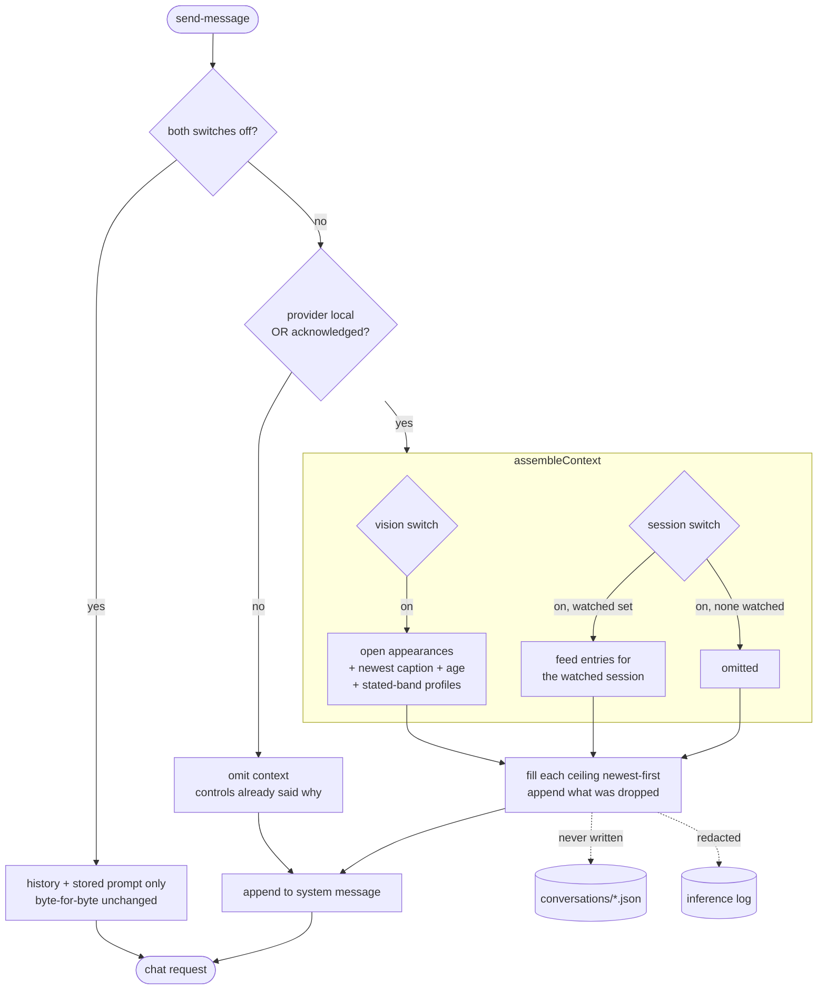
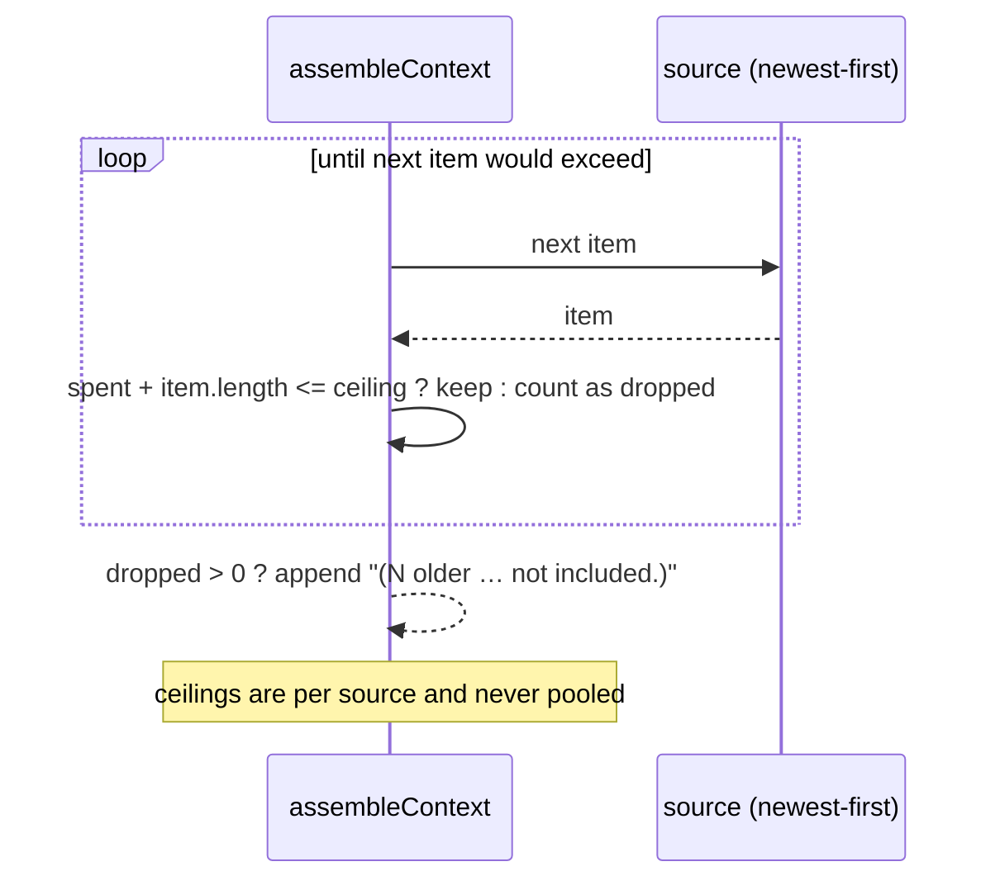

# feat: Conversation context injection — vision and session observation

## Summary

Give each Conversation two independent switches — vision context and session observation context —
each bounded by a character ceiling the user picks. Assemble the chosen context at send time from the
live Appearance set, the newest Vision Timeline caption, and Narration Feed entries about the Watched
Session, and gate any of it leaving the machine behind a real acknowledgement.

---

## Problem Frame

`server/src/chat.ts` builds a request from an optional system message plus history and knows nothing
about Vision, the Gallery, or the Narration Feed. The two subsystems have never touched, so a user
watching the Vision pane describe the room cannot ask HAL about it.

The obvious supply is the wrong one. Vision narrates once per `cycleSeconds` (300 by default) and only
when `sensitivity` permits; at `medium` the summariser is told to remark only on something worth a
developer's attention, and a silent cycle writes nothing at all. Twenty quiet minutes can leave zero
vision entries in `observations/`. The Vision Timeline is never empty — a check every
`detectionIntervalSeconds` (3) and a caption every `intervalSeconds` (60) — but captions are the
source the origin brief's predecessor banned from conversations, and checks are mostly `nobody found`
plus a confidence figure. Neither store holds who is present *now*; `AppearanceTracker.open()` does,
in memory.

An amount dial in entries would also be a dial on an invisible constraint. Every narration path sets
`options: { num_ctx: NARRATION_NUM_CTX }` and pairs it with `EVENT_BUDGET_CHARS`, a character budget
sized to stay inside that window. Chat is the only path that sets nothing, so it takes the provider's
default and overflow costs the front of the prompt — where the Conversation's own System Prompt sits.

A fixed character ceiling cannot work either, because the window is a property of the model and the
user picks the model per Conversation. Locally installed models span 2,048 to 262,144 tokens: 6,000
characters is 0.6% of a `hal1000b5` window and 73% of a `wizard-vicuna` one. The same label would mean
two unrelated things. Ollama already reports the figure on the endpoint `listModels` calls, and HAL
discards it.

One prerequisite the origin brief assumed exists does not. The off-machine acknowledgement is still
on the deferred list in `AGENTS.md`; `AcknowledgeOverflowMessage` is the candidate-queue drop tally,
unrelated. This plan builds the acknowledgement.

---

## Requirements Trace

| Origin | Covered by |
|---|---|
| R1, R2, R5 — two switches, ceilings, per-Conversation | U2, U7, U8 |
| R3 — default off everywhere until acknowledged; settings-level seed | U2, U6, U7 |
| R4 — both off is byte-for-byte unchanged | U5 |
| R6 — cost readout before sending | U7, U8 |
| R7, R8, R12 — appearances, newest caption, profiles, attribution | U1, U3, U5 |
| R9, R9a, R10 — Watched Session only, visible empty state, no check rows | U4, U5, U7 |
| R11 — a source with nothing omits rather than sends empty | U3, U4 |
| R13, R14, R15 — per-source fill, drop note, prompt never evicted | U3, U4, U5, U8 |
| R16 — assembled per request, never persisted | U5 |
| R17, R18, R19 — acknowledgement, provider-gated, names what leaves | U6, U7 |
| R20 — excluded from inference records | U5 |
| R21 — reachable over the protocol | U2, U6 |
| F1, F5 — the two asking flows | U3, U4, U5 |
| F2 — turning a switch on | U6, U7 |
| F3 — a ceiling that cannot hold the window | U3, U4 |
| F4 — a thread that predates the feature | U2, U5 |
| AE1–AE4, AE6 | U3, U5 |
| AE5, AE9, AE10 | U4, U7 |
| AE7 | U6 |
| AE8 | U5 |

---

## Key Technical Decisions

**Context is composed in `shared/src/prompts.ts`, not in `chat.ts`.** Every other prompt-shaping
concern in this codebase lives there — `knownPeopleSection`, `formatIdentity`, `enforceIdentityBands`,
`visionSensitivityInstruction` — and they are pure functions the tests drive directly. Putting
assembly there keeps `ChatService` a wiring layer and makes the budget behaviour testable without a
provider, a camera, or a socket.

**The character budget reuses `knownPeopleSection`'s spend-and-report shape.** That function already
walks candidates in priority order, skips any line that would exceed the budget, and appends a note
stating what it dropped. Two more budgets with the same shape is a pattern application, not a new
mechanism, and the note is what keeps a truncated context from reading as a complete one.

**Every budget and threshold comparison is written as acceptance, never as a negated inequality.**
`docs/solutions/a-threshold-guard-written-as-a-negation-fails-open-on-nan.md` records
`if (confidence < threshold) return null` shipping a confident identification for `NaN`. A ceiling
arriving as `NaN` from a hand-edited store must send nothing, not everything.

**The assembled context is appended to the Conversation's system message, not sent as a second one.**
A blank prompt with a switch on therefore produces exactly one system message where today it produces
none — the change R4 bounds. Two system messages is a shape no provider in the seam is guaranteed to
treat identically, and the origin brief left the choice to planning.

**The acknowledgement is one persisted flag covering identity data leaving the machine, checked
against the endpoint in effect at send time.** Gating on the switch transition alone is the failure
`docs/solutions/a-gate-that-checks-one-direction-is-half-a-gate.md` describes in a different costume:
the WS token gated `onMessage` and gave every broadcast away, because the check sat at the wrong
chokepoint. The chokepoint here is the send, not the toggle. Scoping the flag to identity data rather
than to chat also discharges the recogniser-endpoint gate deferred since the recognition work.

**Vision exposes a read-only accessor for the open Appearance set.** `AppearanceTracker.open()` is
reached only from inside `VisionService` today. Chat needs a snapshot, not the tracker, and
`docs/solutions/a-value-frozen-for-one-caller-is-stale-for-the-next.md` is the reason it is read at
send time rather than cached: a value captured once for the vision loop is stale for the next caller.

**A ceiling is a share of the model's window, rendered as the character count it works out to.**
R5 asked for the control to be labelled by the characters it permits, and it still is — but the number
is derived rather than fixed, because a fixed one means 0.6% of the window on one model and 73% on
another. The stored value is the share; the label is what that share buys on the model this
Conversation uses, and it re-renders when the model changes. Shares are 5%, 12% and 25% of the usable
window, so both sources at maximum consume half of it and leave the rest for the System Prompt and
history. That ceiling sits just inside a ratio this codebase already trusts:
`EVENT_BUDGET_CHARS` against `NARRATION_NUM_CTX` is about 37% at four characters per token.

**The usable window is `min(model window, a settable cap)`, and `num_ctx` is set from it.** The two
are different numbers: a model advertising 262,144 tokens is advertising what it was trained for, not
what its KV cache may occupy on a card already holding the narration model. The cap is a setting with
a conservative default rather than a constant, because it is the one value that is about the user's
hardware. A model whose window cannot be determined falls back to the conservative default rather
than to optimism.

**Switch and ceiling live on the Conversation; the acknowledgement, the cap, and the new-thread
defaults live in Settings.** The switches are per-thread because that is the control the user asked for. The seed
follows `chatDefaultPrompt`'s established shape — copied at creation, never consulted again — so
changing the default cannot rewrite a thread already under way.

---

## High-Level Technical Design

Where each source enters, and what gates it:



Ceiling behaviour, per source, independently:



---

## Implementation Units

### U1. Read-only access to the live Appearance set

**Goal:** Let a caller outside `VisionService` learn who is in front of the camera right now, without
reaching into the tracker.

**Requirements:** R7, R12

**Dependencies:** none

**Files:**
- `server/src/vision/service.ts`
- `server/test/vision/service.test.ts`

**Approach:** Add an accessor returning a snapshot of the open Appearances with each one's standing
identity decision and its current reading, plus whether recognition is enabled at all. Return an empty
snapshot when Vision is off or recognition is off, so a caller cannot distinguish "nobody there" from
"not looking" by accident — the two read differently in the assembled text, which is U3's job. The
accessor computes nothing new; it reads what the detection loop already maintains.

**Patterns to follow:** `identityFor` in `server/src/vision/service.ts` for how an Appearance's
standing decision is turned into a caller-facing shape, and the Appearance/currentMatch distinction
documented in `server/src/vision/appearances.ts`.

**Test scenarios:**
- Vision off — the snapshot is empty and flagged as not-looking, not as nobody-present.
- Recognition off, Vision on — the snapshot reports the camera is on with no identities.
- Two Appearances open — both are returned, each carrying its own standing decision.
- An Appearance whose standing decision is unmatched — returned as present-but-unidentified rather
  than dropped.
- The snapshot is a copy: mutating it does not disturb the tracker's state on the next detection.

**Verification:** A caller outside the vision module can obtain the current set without importing
`AppearanceTracker`.

---

### U2. Wire contract and persistence for the switches

**Goal:** Give a Conversation two switches and two ceilings, settable over the protocol, absent
reading as off.

**Requirements:** R1, R2, R3, R5, R21, F4

**Dependencies:** none

**Files:**
- `shared/src/types.ts`
- `server/src/storage/conversations.ts`
- `server/src/chat.ts`
- `server/test/chat-service.test.ts`
- `server/test/storage/storage.test.ts`

**Approach:** Add optional context fields to `ConversationMeta` and a client message that sets them,
handled beside `set-conversation-prompt`. Optional is what makes a pre-existing thread read as off
without a migration — the same shape `systemPrompt` and `adapterId` already use. What is stored per
source is a **level**, not a character count: the count is derived from the model at send and render
time, so storing it would freeze a number that is only true for the model in use when it was picked.
Levels are validated against the shipped set on the way in; anything else falls back to the smallest
rather than being trusted, since the value governs how much text reaches a model. Mutations go through
the store's existing per-conversation lock.

**Patterns to follow:** `setSystemPrompt` in `server/src/storage/conversations.ts` for the
lock-get-mutate-save chain; the `"conversationId" in msg` UUID guard at the top of `ChatService.handle`;
`normalizeVision` in `server/src/storage/settings.ts` for validating a value against a permitted set.

**Test scenarios:**
- A Conversation written before this feature loads with both switches off and no field invented.
- Setting a switch persists it and broadcasts the updated Conversation.
- A ceiling outside the shipped levels falls back to the smallest level, not to the largest and not to
  the raw value.
- A ceiling arriving as a non-number falls back to the smallest level.
- A non-UUID conversation id is rejected before reaching the store.
- Two concurrent switch mutations on one Conversation both land; neither reverts the other.

**Verification:** A protocol client can turn either switch on and set either ceiling without the UI.

---

### U3. Vision context assembly

**Goal:** Turn the live Appearance set, the newest caption, and the relevant profiles into bounded,
attributed text.

**Requirements:** R7, R8, R11, R12, R13, R14, AE1–AE4

**Dependencies:** U1

**Files:**
- `shared/src/prompts.ts`
- `server/test/chat/vision-context.test.ts`
- `server/src/vision/timeline.ts`

**Approach:** A pure function taking the Appearance snapshot, the newest caption with its timestamp,
the roster, and a ceiling. The caption is rendered as a quoted report with its age — HAL's last look,
not a claim about the room. Only *stated*-band identities carry a name and unlock a Character Profile;
hedged ones render through the existing attributed form and carry none. The Operator's profile is
included whenever the switch is on, whether or not they are in view, and is ordered first so the
ceiling never drops the person HAL is talking to. A source with nothing to say returns empty string
rather than a header with nothing under it. Add a timeline read for the newest caption event, bounded
the way `lastSeen` is.

**Technical design** *(directional, not specification)*:

```
appearances empty + camera off  -> "I am not looking at anything right now."
appearances empty + camera on   -> "Nobody is in view."
stated match                    -> "<Name> is in view (<pct>)."   + profile
hedged match                    -> hedgedIdentity(name) + " (<pct>)."  no profile
unmatched                       -> "Someone I do not recognise is in view."
caption                         -> 'My last look, <age> ago: "<caption>"'
dropped > 0                     -> "(<N> older … not included.)"
```

**Patterns to follow:** `knownPeopleSection` in `shared/src/prompts.ts` for operator-first ordering,
budget spend, and the dropped-count note; `formatIdentity` and `identityBand` for band rendering;
`hedgedIdentity` for the attributed form; `VisionTimeline.lastSeen` for a bounded backward walk.

**Test scenarios:**
- Covers AE1. Vision off — no vision segment at all, and no empty header.
- Covers AE2. Vision on, nobody in frame — the absence is stated and the newest caption still carries.
- Covers AE3. A hedged-band person — attributed form, no profile text anywhere in the output.
- Covers AE4. A four-hour-old caption — its age appears alongside it.
- Covers AE6. Ceiling too small for every profile — the Operator's survives and the note states how
  many were left out.
- A ceiling of zero produces empty string, not a bare note.
- A ceiling arriving as `NaN` produces empty string rather than passing every acceptance check.
- Two people in view, one stated and one hedged — one profile, one attributed line, both present.
- The caption text is always quoted and always carries an age; no branch emits it bare.

**Verification:** Given a fixed snapshot and roster, the function's output is stable and every profile
in it belongs to someone in the stated band or to the Operator.

---

### U4. Session observation context assembly

**Goal:** Turn recent Narration Feed entries about the Watched Session into bounded text, and make the
no-Watched-Session case explicit.

**Requirements:** R9, R9a, R10, R11, R13, R14, AE5

**Dependencies:** none

**Files:**
- `shared/src/prompts.ts`
- `server/test/chat/session-context.test.ts`
- `server/src/storage/observations.ts`

**Approach:** A pure function taking feed entries, the Watched Session id, and a ceiling. Entries are
filtered to that session id, taken newest-first to the ceiling, and rendered oldest-first so the model
reads them in the order they happened. Entries from Vision and Monitors are excluded by the same
filter — a session id is what qualifies an entry, so the exclusion is structural rather than a second
rule that could drift. With no Watched Session the function returns empty string; the visible
explanation is U7's job, and the two are tested separately so a silent server and a silent control
cannot both be assumed to be the other's responsibility.

**Patterns to follow:** `ObservationLog.recent` for the bounded newest-first read;
`knownPeopleSection` for the budget spend and dropped note; `NarrationEntry.sessionLabel` for how an
entry names its session.

**Test scenarios:**
- Covers AE5. Twelve entries with a ceiling that fits two — two send, and the note states ten were
  left out.
- No Watched Session — empty string, with no header and no note.
- Feed contains vision and monitor entries alongside session ones — only the watched session's
  entries appear.
- Entries from a different followed session are excluded.
- Rendered order is oldest-first even though selection was newest-first.
- A ceiling of `NaN` produces empty string.
- Gap and status entries belonging to the watched session are carried, since they are what HAL said
  about it.

**Verification:** Given a mixed feed and a watched id, output contains only that session's entries and
states any shortfall.

---

### U8. The model's window, and an explicit `num_ctx` for chat

**Goal:** Learn how much context the Conversation's model can hold, cap it to what the machine can
afford, and set `num_ctx` on chat requests from the result.

**Requirements:** R5, R6, R15

**Dependencies:** none

**Files:**
- `server/src/providers/provider.ts`
- `server/src/providers/ollama.ts`
- `server/src/storage/settings.ts`
- `shared/src/types.ts`
- `shared/src/prompts.ts`
- `server/test/providers/model-window.test.ts`

**Approach:** `ModelInfo` gains an optional window in tokens. `listModels` maps it from the payload it
already fetches; a model that omits it is filled from the per-model detail endpoint, whose key is
architecture-prefixed rather than fixed, so the lookup scans for the suffix instead of guessing the
prefix. A model whose window cannot be determined at all reports none, and callers fall back to the
conservative default — unknown must not read as unlimited. Settings gains the allocation cap. A shared
pure function turns window, cap and level into a character budget, so the server and the UI cannot
disagree about what a level means. Chat requests carry `num_ctx` from the usable window, the way every
narration path already does.

**Patterns to follow:** `NARRATION_NUM_CTX` and `EVENT_BUDGET_CHARS` in `server/src/narration/coalescer.ts`
for the num_ctx-plus-char-budget pairing and the chars-per-token heuristic; `listModels` in
`server/src/providers/ollama.ts` for the fetch already being made; `normalizeVision` in
`server/src/storage/settings.ts` for validating a numeric setting.

**Test scenarios:**
- A model reporting its window in the list payload is carried through without a second request.
- A model omitting it is filled from the detail endpoint via the architecture-prefixed key.
- A model whose window cannot be determined anywhere reports none, and the budget falls back to the
  conservative default rather than to the cap.
- The cap clamps a model advertising far more; the smaller of the two always wins.
- A cap or window arriving as `NaN` or zero yields the conservative default, not an unbounded budget.
- The same level against two different windows yields two different budgets, and against the same
  window yields the same budget in server and UI.
- A chat request carries `num_ctx`; a request with both switches off carries it too, since the window
  is a property of the model rather than of this feature.
- The detail endpoint being unreachable degrades to the conservative default without failing the send.

**Verification:** Against the running Ollama, the reported window matches `/api/tags` for models that
publish it and `/api/show` for those that do not.

---

### U5. Send-time assembly in the chat path

**Goal:** Compose the enabled sources into the request, per send, without persisting anything.

**Requirements:** R4, R13, R15, R16, R20, F1, F5, AE8

**Dependencies:** U1, U2, U3, U4, U8

**Files:**
- `server/src/chat.ts`
- `server/src/app.ts`
- `server/test/chat-service.test.ts`
- `server/test/chat/context-assembly.test.ts`

**Approach:** In `runGeneration`, before the history is built, assemble context for whichever switches
are on and append it to the resolved system prompt. Both off takes the existing path untouched,
including a blank prompt sending no system message — that branch is not merely preserved but pinned by
a test, because it is the one guarantee a regression here would be invisible in. Ceilings are spent per
source and never pooled, so a large vision ceiling cannot starve the session segment. `ChatService`
gains read-only dependencies on the vision accessor, the timeline, the gallery, the observation log,
and the watched-session source; each is read at send time rather than captured at construction.
Assembled text is redacted from inference records through the existing profile-redaction seam.

**Execution note:** Start with the both-switches-off characterization test asserting the exact request
shape today, before adding any assembly.

**Patterns to follow:** `isBlankPrompt` and `resolvePrompt` usage already in `runGeneration`; the
per-request provider resolution in `ChatService.provider()` as the model for reading state at send
time; `server/src/logging/instrument.ts` for the redaction seam.

**Test scenarios:**
- Covers AE8. Both switches off — the request is identical to the pre-feature shape, including no
  system message when the prompt is blank.
- Vision on with a blank conversation prompt — exactly one system message is sent, carrying only the
  assembled context.
- Both switches on — both segments appear, and each respects its own ceiling independently.
- The Conversation file on disk is unchanged after a send with both switches on.
- A roster rename between two sends is reflected in the second send, proving per-request assembly.
- Assembled profile text does not appear in the inference record for that request.
- The vision accessor throwing does not fail the send; the vision segment is omitted and the reply
  still streams.
- Ceilings at maximum with a long stored prompt — the stored prompt survives in full.

**Verification:** Boot the server, send with both switches off and confirm the inference record matches
a pre-feature request; turn vision on and confirm the record gains the context and no profile text.

---

### U6. The off-machine acknowledgement

**Goal:** Require a stated, persisted acknowledgement before identity data reaches a provider that is
not on this machine, checked at send.

**Requirements:** R3, R17, R18, R19, R21, AE7

**Dependencies:** U2

**Files:**
- `shared/src/types.ts`
- `server/src/storage/settings.ts`
- `server/src/chat.ts`
- `server/test/storage/settings-acknowledgement.test.ts`
- `server/test/chat/context-assembly.test.ts`

**Approach:** One persisted flag in Settings, set by its own client message, recording that the user
has been told what leaves. At send time the provider endpoint is classified as on-machine or not; a
non-loopback endpoint without the flag omits all assembled context rather than failing the send. The
classification is written as acceptance — an endpoint is local only when it positively resolves to
loopback — so an unparseable endpoint is treated as remote. The flag also unblocks the recogniser
endpoint gate deferred since the recognition work, which reads the same flag.

**Patterns to follow:** `server/src/origin.ts` for how loopback is already recognised in this codebase;
`SettingsStore.update` and its per-field validation for the persisted flag;
`docs/solutions/a-gate-that-checks-one-direction-is-half-a-gate.md` for why the check sits at the send
and not at the toggle.

**Test scenarios:**
- Covers AE7. Acknowledged, local provider, then endpoint changed to a remote host — context still
  sends, because the acknowledgement covers it.
- Not acknowledged, remote provider — context is omitted and the reply still streams.
- Not acknowledged, loopback provider — context sends; the gate does not fire for local use.
- An endpoint that cannot be parsed is treated as remote.
- An endpoint on loopback with a non-default port is treated as local.
- The flag survives a settings round-trip and is not reset by unrelated patches.
- Setting the flag is reachable over the protocol.

**Verification:** With the flag unset, point the provider endpoint at a non-loopback address and
confirm a send carries no assembled context and no error.

---

### U7. The controls and the cost readout

**Goal:** Put both switches, both ceilings, the live cost, and the empty-state explanation in front of
the user.

**Requirements:** R1, R2, R5, R6, R9a, R17, R19, AE9, AE10

**Dependencies:** U2, U6

**Files:**
- `ui/src/components/ConversationContext.tsx`
- `ui/src/components/ChatPane.tsx`
- `ui/src/store.ts`
- `ui/src/styles.css`
- `ui/test/components/ConversationContext.test.tsx`

**Approach:** A collapsible block beside the existing conversation prompt control, following its shape:
a summary line when closed, controls when open. Each source gets a switch and a level picker whose
options are labelled by their character count. Under them, a line stating what the current setting will
send. When the session switch is on with no Watched Session, that line says so — the dependency between
two controls that are not adjacent is made visible here rather than discovered from a reply. Turning
either switch on states what will be sent and where it goes; when the provider is off-machine and
unacknowledged, the acknowledgement is presented and declining leaves the switch off.

**Patterns to follow:** `ui/src/components/ConversationPrompt.tsx` for the collapsible shape, the
`key={conversation.id}` remount that stops drafts leaking between threads, and the disabled-while-busy
convention; `ui/test/components/harness.tsx` for state fixtures and the recording `send`.

**Test scenarios:**
- Covers AE9. Session switch on with no Watched Session — the readout states nothing will send.
- Covers AE10. Watched Session cleared while the switch is on — the readout updates without a reply
  being sent.
- Switching threads remounts the control; one Conversation's setting never renders under another.
- Toggling a switch sends exactly one message, and the component survives an unstable `send` without
  looping.
- Controls are disabled while a generation is in flight.
- A remote, unacknowledged provider — the acknowledgement is presented on switch-on and declining
  leaves the switch off and sends nothing.
- The cost readout reflects the selected level rather than a hardcoded figure.

**Verification:** Screenshot the pane with both switches on and with the session switch on and nothing
watched. Green component tests are not the evidence here — the readout has to be legible.

---

## Scope Boundaries

**Deferred for later** *(carried from origin)*

- Capturing and captioning a frame at send time.
- Monitors as a third context source.
- Re-tuning the shipped ceiling levels against a real context window.
- A band-aware check on HAL's chat replies. The reply streams token by token, so a post-hoc check
  cannot unsay what rendered; input gating carries it instead.

**Outside this product's identity** *(carried from origin)*

- Recognition check rows in a Conversation.
- HAL deciding on its own how much context to take.
- Persisting assembled context into the Conversation.

**Deferred to follow-up work** *(plan-local)*

- Applying the new acknowledgement flag to the recogniser endpoint. U6 builds the flag broadly enough
  to cover it; wiring the recogniser's own check is a separate change to the vision settings path.
- Measuring the chars-per-token ratio against the models actually in use, rather than inheriting the
  approximation the narration budget already runs on.

---

## Risks & Dependencies

- **R15 is now enforced rather than assumed.** U8 sets `num_ctx` explicitly and sizes the budgets
  against it, so the plan no longer rests on how the provider evicts. What remains unverified is the
  chars-per-token heuristic: four is an approximation, and a token-dense prompt spends the window
  faster than the label implies. The shares leave half the window free, which is the margin that
  absorbs it.
- **The allocation cap is a real hardware knob.** Raising it grows the KV cache on the card that
  already holds the chat and narration models — the contention that moved the Captioner off the GPU
  entirely. The default is conservative for that reason, and raising it is the user's call.
- **A caption reaching chat is the rule this plan overrides.** The mitigation is placement, and
  placement is only as good as the branch coverage — U3's test that no branch emits a caption bare is
  the guard, and it must not be relaxed.
- **`ChatService` gains five read-only dependencies.** That is a real widening of a class that was a
  thin wiring layer. Keeping assembly in `shared/src/prompts.ts` is what stops it becoming a second
  vision service.
- **The full suite flakes on timing under load** — roughly one run in four fails on a different test
  each time. Re-run a failing file alone before attributing it to a change here.

---

## Open Questions

**Deferred to implementation**

- Whether the cost readout recomputes on level change alone or also as the feed and camera move. Both
  satisfy R6; the second costs a subscription.
- Whether the acknowledgement copy lives in `shared/src/vision.ts` beside the captioner install text
  or in the UI persona copy. It is user-facing text with a single source-of-truth rule either way.
- The exact wording of the not-looking versus nobody-in-view lines. U3 pins that they differ, not what
  they say.

---

## Sources & Research

- `docs/brainstorms/2026-08-08-conversation-context-injection-requirements.md` — origin.
- `docs/plans/2026-08-08-001-feat-recognition-identity-and-profiles-plan.md` — Phase 4 (U13–U15), the
  paused seam this plan supersedes, and the three constraints recorded so they are not rediscovered.
- `docs/residual-review-findings/feat-recognition-identity-and-profiles.md` — why the seam paused, and
  what was already established about it.
- `docs/residual-review-findings/feat-vision.md` — the captioner inventing object counts.
- `docs/solutions/a-gate-that-checks-one-direction-is-half-a-gate.md` — the chokepoint argument behind
  U6's send-time check.
- `docs/solutions/a-threshold-guard-written-as-a-negation-fails-open-on-nan.md` — why every ceiling and
  band comparison is phrased as acceptance.
- `docs/solutions/a-flag-nothing-reads-looks-shipped.md` — why U7's verification is a screenshot and
  not a passing assertion.
- `docs/solutions/a-value-frozen-for-one-caller-is-stale-for-the-next.md` — why state is read at send
  time rather than captured at construction.
- `docs/solutions/an-instruction-that-fights-its-own-input-loses.md` — why R8 shapes placement instead
  of adding a prompt rule.
- `docs/solutions/editing-state-a-running-process-caches-loses-the-edit.md` — why U2's mutations
  compose inside the store's existing lock chain.
- `shared/src/prompts.ts` — `knownPeopleSection`'s budget spend and dropped-count note; `formatIdentity`,
  `identityBand`, `hedgedIdentity`, `enforceIdentityBands`.
- `server/src/chat.ts` — request assembly today, and the blank-prompt branch U5 must preserve.
- `server/src/vision/service.ts`, `server/src/vision/appearances.ts` — `identityFor`, the tracker, and
  the Appearance-versus-currentMatch distinction.
- `server/src/vision/timeline.ts`, `server/src/storage/observations.ts` — the two bounded newest-first
  reads.
- `server/src/storage/conversations.ts` — the per-conversation lock chain.
- `server/src/providers/ollama.ts` — `num_ctx` is never set.
- `ui/src/components/ConversationPrompt.tsx` — the collapsible control shape U7 follows.
- `AGENTS.md`, `CONCEPTS.md` — the agent-native parity rule, and the canonical names used throughout.
