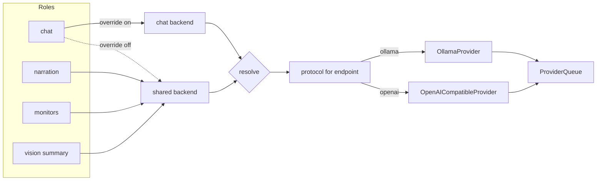
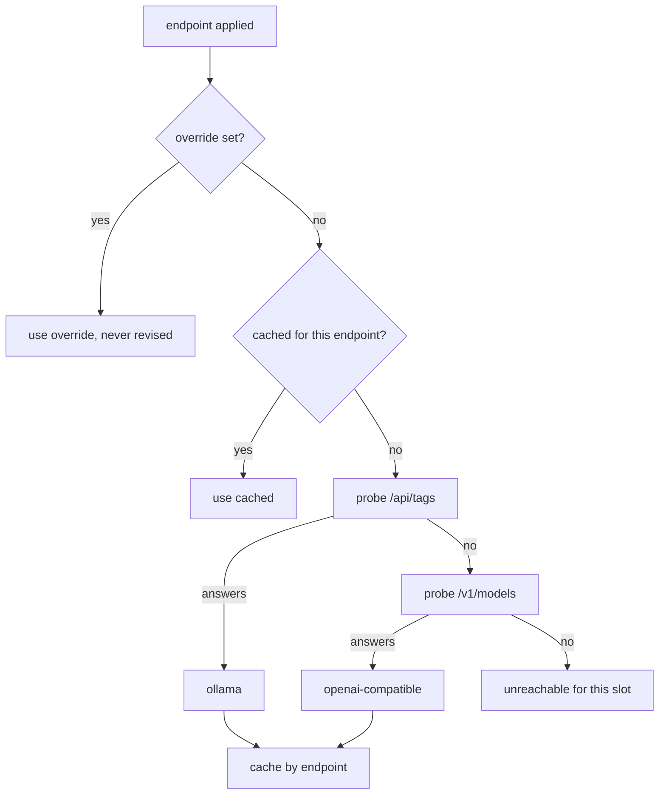

# feat: An OpenAI-compatible provider, and one place that names what HAL talks to

## Summary

Widen the provider seam from an Ollama-shaped endpoint string to a named backend configuration, add
an `OpenAICompatibleProvider` beside `OllamaProvider`, and decide which one an endpoint needs by
probing it. Chat may optionally resolve to a second backend while narration, monitors and Vision stay
on the shared one. The endpoints HAL talks to are gathered into one settings area labelled by role.

Two latent defects are fixed here rather than deferred, because this change is what activates them:
Vision's cycle summariser sends Character Profiles and enrolled names with no Off-Machine
Acknowledgement check, and the chat window cache is keyed by model name without regard to which
endpoint served it.

---

## Problem Frame

`ProviderFactory` is `(endpoint: string) => Provider` (`server/src/providers/provider.ts`), and
`OllamaProvider` is its only implementation. Four call sites resolve a provider per request from one
`Settings.providerEndpoint` — `server/src/chat.ts`, `server/src/narration/narrator.ts`,
`server/src/monitors/narrator.ts`, and `server/src/vision/service.ts`. Nothing in the type, the
setting, or the UI label says Ollama; everything behind them assumes its wire protocol.

HAL already speaks the protocol that would lift the assumption. `HttpCaptioner`
(`server/src/vision/captioner.ts`) posts to `/v1/chat/completions` and probes `/health` — the shape
`llama-server`, LM Studio, vLLM and every hosted API answer. That client is walled inside the Vision
seam and cannot serve chat or narration.

Two consequences fall out of one endpoint having always been loopback Ollama, and neither is visible
until a second backend exists:

- **The Vision summariser is the one identity sender with no gate.** There are exactly two
  `isLocalEndpoint` call sites in the server: the chat context path and the recogniser path. The
  summariser assembles profiles for anyone in the *stated* band plus the Operator, formats banded
  names, and streams them to `providerEndpoint` unguarded.
- **The window cache is endpoint-blind.** `windowFor` in `server/src/chat.ts` memoises model name to
  window. Two backends can serve a model of the same name with different windows, and the first
  answer would be served for the second backend — the failure shape recorded in
  `docs/solutions/a-value-frozen-for-one-caller-is-stale-for-the-next.md`.

---

## Requirements

Carried from `docs/brainstorms/2026-08-08-openai-compatible-provider-requirements.md`. R1–R26 and
AE1–AE10 are traced by the units below; the origin document is authoritative on their wording.

| Group | Origin | Units |
|---|---|---|
| Provider seam | R1–R6 | U1, U2 |
| Protocol discovery | R7–R10 | U3 |
| Backends and roles | R11–R14 | U4, U5 |
| Keys | R15–R17 | U4 |
| Consequences that must not be silent | R18–R23 | U5, U6, U7, U8 |
| The settings area | R24–R26 | U8 |

Two origin Outstanding Questions are resolved here as KTD2 and KTD4. The third (re-probe cadence) is
resolved as KTD3.

---

## Key Technical Decisions

**KTD1 — A backend is a named configuration, not a string.** `ProviderFactory` widens to take a
resolved backend carrying the endpoint, the protocol, and an optional key. The alternative — a second
factory parameter — leaves the endpoint string as the identity of a backend, and identity is exactly
what U5's preemption rule and U7's cache need to compare.

**KTD2 — The probe tries Ollama first, and a test pins the order.** Ollama answers both `/api/tags`
and its own `/v1/models`, so detection order decides which provider a stock Ollama gets. Native must
win: the OpenAI schema has no field for `num_ctx`, all four call sites set one, and Context Level
sizes injected context against a window HAL requests per request. Detecting Ollama as
OpenAI-compatible would degrade a shipped feature with no error. Order is load-bearing behaviour, so
it is asserted rather than left to implementation sequence (see origin Outstanding Questions).

**KTD3 — The protocol cache is keyed by endpoint and invalidated on settings change; nothing
re-probes in the background.** A background re-probe would let a value change under a caller that has
already read it. Invalidation on change is the narrow correct trigger, and it is the trigger the two
cache learnings point at — `docs/solutions/editing-state-a-running-process-caches-loses-the-edit.md`
and `a-value-frozen-for-one-caller-is-stale-for-the-next.md`. A server restarted into a different
mode is corrected by re-applying the endpoint, which is what the readiness refresh already does.

**KTD4 — Preemption keys on the resolved endpoint, not the slot.** The shared and chat backends may
point at the same endpoint with different models — a large model for chat and a small one for
narration on one `llama-server` is a real setup. Two jobs contend when their resolved endpoints
match after normalisation, regardless of which slot named them (resolves an origin Outstanding
Question).

**KTD5 — The acknowledgement check becomes one helper both senders call.** The current two checks are
open-coded, and the bug this plan fixes is a third sender that never got one. A shared
`identityMayLeave(backend, settings)` makes the omission visible: a sender that does not call it is a
sender that does not mention the gate at all.

**KTD6 — Keys are stored in the settings file in plain text, and the plan says so.** The data
directory already holds the per-boot WS token, the server binds loopback only, and this is a
single-user local tool. Encrypting a key next to its own key material would be ceremony, not
security. What is enforced is narrower and real: the key never crosses the wire to a client, never
reaches the inference log, and never appears in an error message.

**KTD7 — `readiness.ollama` is replaced, not supplemented.** It is a typed field in the shared wire
contract with one server and one UI behind it. Keeping it as an alias would leave a field whose name
asserts a backend the user may not be running.

---

## High-Level Technical Design

Directional. The prose above is authoritative where the two disagree.

**Role resolution.** Three roles are pinned to the shared backend by construction, so there is no
code path in which narration silently follows chat to a metered endpoint.

**Protocol decision.** An explicit override short-circuits the probe entirely; an endpoint answering
nothing is unreachable rather than undetermined.

**Protocol surface mapping.** What each provider implements against.

| `Provider` member | Ollama | OpenAI-compatible |
|---|---|---|
| `chatStream` | `POST /api/chat`, NDJSON | `POST /v1/chat/completions`, SSE |
| `listModels` | `GET /api/tags` | `GET /v1/models` |
| `modelWindow` | `POST /api/show`, `<arch>.context_length` | `GET /props` → `n_ctx`, else null |
| liveness | `/api/tags` | `/v1/models` |
| per-request window | `options.num_ctx` | none — server-fixed |

---

## Implementation Units

### U1. Widen the provider seam to a backend configuration

**Goal:** `ProviderFactory` takes a resolved backend instead of an endpoint string, with no
behavioural change anywhere.

**Requirements:** R2, R3.

**Dependencies:** none.

**Files:**
- `shared/src/types.ts` — the backend configuration shape, exported for settings and the wire
- `server/src/providers/provider.ts` — widen `ProviderFactory`
- `server/src/logging/instrument.ts` — `withInferenceLogging` passes the config through and keeps
  logging the endpoint
- `server/src/app.ts` — construct the factory
- `server/src/chat.ts`, `server/src/narration/narrator.ts`, `server/src/monitors/narrator.ts`,
  `server/src/vision/service.ts` — build a config from `providerEndpoint` at each site
- `server/src/readiness.ts` — same
- `server/test/providers/seam.test.ts`

**Approach:** Pure widening. Each call site wraps the existing `providerEndpoint` in a config with
protocol `ollama`, so the diff is mechanical and the suite should pass untouched. The config carries
endpoint, protocol, and optional key; nothing reads the key yet.

**Patterns to follow:** `withInferenceLogging` already wraps a factory and threads a value it does not
interpret — mirror that shape rather than reaching into the provider.

**Test scenarios:**
- Existing provider, narration, chat and readiness suites pass with no assertion changes. This is the
  unit's main signal.
- A factory built from a config with protocol `ollama` produces a provider that hits `/api/chat`.
- The inference log still records the endpoint, and the config's key field never appears in a log
  entry even when set.

**Verification:** `npm run typecheck` clean across both tsconfigs; the full suite passes with no test
edits beyond the new file.

---

### U2. The OpenAI-compatible provider

**Goal:** A second `Provider` speaking `/v1/chat/completions` with SSE, `/v1/models`, and `/props`.

**Requirements:** R1, R4, R5, R6.

**Dependencies:** U1.

**Files:**
- `server/src/providers/openai.ts`
- `server/test/providers/openai.test.ts`

**Approach:** Mirror `HttpCaptioner`'s request construction and error mapping — it is the same
protocol and the same house style. Streaming reads SSE `data:` lines, stops on `[DONE]`, and yields
`choices[0].delta.content`. `listModels` maps `data[].id` to `ModelInfo` with no `contextTokens`,
because `/v1/models` does not report one. `modelWindow` reads `/props` `n_ctx` and returns null on
any failure — including an endpoint with no `/props` at all, which is every hosted API. Usage arrives
on the final chunk when `stream_options.include_usage` is honoured and is simply absent otherwise;
absent means no metrics reported, never zero. A bearer header is attached only when a key is set.

**Patterns to follow:** `server/src/vision/captioner.ts` for request shape, timeout composition via
`AbortSignal.any`, and the reachable-versus-failed error split. `server/src/providers/ollama.ts` for
the header-phase deadline that does not bound the stream, and for `isPositiveInt` — acceptance-shaped
rather than a negated comparison, per
`docs/solutions/a-threshold-guard-written-as-a-negation-fails-open-on-nan.md`.

**Test scenarios:**
- A canned SSE stream of three deltas yields three tokens in order and terminates on `[DONE]`.
- A stream whose final chunk carries usage reports prompt and output tokens through `onMetrics`; a
  stream without usage reports nothing rather than zeroes.
- `404` or a body naming an unknown model raises `model_not_found`; a `500` raises
  `provider_unavailable`; a connection failure raises `provider_unavailable`.
- An aborted signal mid-stream raises `aborted`, not `provider_unavailable`.
- Headers never respond within the deadline → `provider_unavailable`, and the timer is cleared.
- `listModels` maps `data[].id` and tolerates an absent `data` array.
- `modelWindow` returns `n_ctx` from `/props`; returns null when `/props` 404s, returns a
  non-numeric, returns zero, or the request throws.
- A key set on the config produces an `Authorization` header; no key produces no header.
- Covers AE2. Pointed at a `/v1`-shaped endpoint, models list and chat streams token by token.

**Verification:** Provider suite green. Then run it against a real `llama-server` and confirm a
streamed reply and a populated model list — `docs/solutions/` and this project's history both record
that green tests are not evidence a process outside our code behaves as assumed.

---

### U3. Protocol detection and its cache

**Goal:** Decide an endpoint's protocol by probe, cache it per endpoint, and let an explicit override
win permanently.

**Requirements:** R7, R8, R9, R10.

**Dependencies:** U1.

**Files:**
- `server/src/providers/detect.ts`
- `server/test/providers/detect.test.ts`

**Approach:** `detectProtocol(endpoint)` probes `/api/tags`, then `/v1/models`, returning `ollama`,
`openai`, or null. A module-level map caches by normalised endpoint string; an exported
`forgetProtocol(endpoint)` clears one entry and is called by the settings path in U4. An override
carried on the backend configuration short-circuits before any probe and is never written into the
cache, so clearing an override falls back to probing rather than to a stale detected value.

**Execution note:** Write the both-answer test first. It is the one behaviour a later refactor is
most likely to reverse silently, and KTD2 exists because reversing it degrades Context Level with no
error.

**Test scenarios:**
- An endpoint answering only `/api/tags` detects `ollama`; only `/v1/models` detects `openai`.
- **An endpoint answering both detects `ollama`.** This is the pinned order from KTD2.
- An endpoint answering neither returns null.
- A second call for the same endpoint issues no further requests.
- A different endpoint string is probed independently and does not read the first one's entry.
- `forgetProtocol` causes the next call to re-probe.
- An override returns immediately with no request issued at all, and leaves the cache untouched;
  clearing it re-probes.
- Endpoints differing only by trailing slash resolve to one cache entry.
- Covers AE3. Nothing listening → null, which U8 renders as unreachable rather than as an
  undetermined protocol.
- Covers AE4. An override survives a probe that would have said otherwise.

**Verification:** Detection suite green, including the both-answer case named in the test title.

---

### U4. Backend settings, migration, and key handling

**Goal:** Settings describe a shared backend and an optional chat backend, migrate cleanly from
`providerEndpoint`, and never hand a key to a client.

**Requirements:** R11, R12, R14, R15, R16, R17.

**Dependencies:** U1.

**Files:**
- `shared/src/types.ts` — `Settings` gains the backend shapes; `SettingsPatch` follows the nested
  partial convention already used for `adapters` and `vision`
- `server/src/storage/settings.ts` — defaults, per-field merge, normalisation, migration
- `server/src/ws.ts` or the settings broadcast path — redact keys on the way out
- `server/test/storage/settings.test.ts`
- `server/test/storage/settings-migration.test.ts`

**Approach:** The shared backend carries endpoint, an optional protocol override, and an optional
key. The chat backend is the same shape plus an enabled flag, and is absent by default. Migration
reads a stored `providerEndpoint` into the shared backend's endpoint on first load and writes the new
shape back through `storage/atomic.ts`. Keys merge like colours and the context cap do — validated
and per-field, never wholesale replacement — because this file is hand-editable and a non-string in
the key slot would otherwise reach a header. Outbound redaction replaces a set key with a marker the
UI renders as "a key is set"; an inbound patch omitting the key leaves it, an empty string clears it.

**Patterns to follow:** `mergeVision` and `mergeAdapters` in `server/src/storage/settings.ts` for
nested partial merging; `normalizeCap` for acceptance-shaped validation of a hand-editable field.

**Test scenarios:**
- A settings file holding only the old `providerEndpoint` loads with that endpoint on the shared
  backend and no chat backend.
- A fresh install defaults to the Ollama loopback endpoint with no override and no key.
- A patch setting the chat backend leaves the shared backend and every unrelated field untouched.
- A patch omitting the key preserves the stored key; an empty-string key clears it; a non-string key
  is dropped and the prior value kept.
- The broadcast settings payload never contains a key value, only the set/unset marker. Assert on the
  serialised payload, not on an intermediate object.
- Turning the chat override off preserves its configuration for when it is turned back on.
- Covers AE8. Round-tripping settings through the panel does not blank a stored key.

**Verification:** Storage suite green. Then boot the server against a data directory holding a
pre-migration settings file and confirm it starts, migrates, and serves the old endpoint.

---

### U5. Role resolution and cross-backend preemption

**Goal:** Each role resolves its backend through one function, and `ProviderQueue` stops aborting
narration for a chat job on a different backend.

**Requirements:** R11, R12, R13, R14, R20.

**Dependencies:** U1, U3, U4.

**Files:**
- `server/src/providers/resolve.ts` — role to backend, including protocol resolution
- `server/src/providers/queue.ts` — preemption keyed on the resolved endpoint
- `server/src/chat.ts`, `server/src/narration/narrator.ts`, `server/src/monitors/narrator.ts`,
  `server/src/vision/service.ts` — resolve by role
- `server/test/providers/queue.test.ts`
- `server/test/providers/resolve.test.ts`

**Approach:** `backendForRole(role, settings)` is the only way a role obtains a backend. Narration,
monitors and vision pass a role the function maps to the shared backend unconditionally — there is no
branch that could route them elsewhere, which is what makes R13 structural rather than a convention.
`enqueue` grows a normalised endpoint alongside the job class; preemption fires only when an arriving
chat job's endpoint matches the in-flight narration job's. Everything else about the queue is
unchanged: one job at a time, chat first, in-flight chat never aborted by scheduling.

Retaining the single lane across distinct backends is deliberate and is not the bug being fixed. The
bug is destroying narration work for a job that was never going to contend with it. Concurrency
across backends is out of scope (origin Scope Boundaries).

**Test scenarios:**
- Narration in flight, chat arrives on the same endpoint → narration aborts and chat runs first, the
  behaviour the existing queue tests already pin.
- **Narration in flight, chat arrives on a different endpoint → narration is not aborted.** Both
  complete, and the narration job's signal never fires.
- Endpoints differing only by trailing slash count as the same backend.
- Chat in flight is never aborted by an arriving job of either class.
- With the chat override off, every role resolves to the same backend and queue behaviour is
  byte-for-byte what it was.
- `backendForRole` returns the shared backend for narration, monitors and vision even when a chat
  override is configured and enabled.
- Covers AE5. Chat remote, narration local, a job in flight — narration survives.
- Covers AE1. Override off, everything resolves as before.

**Verification:** Queue and narration suites green. Per
`docs/solutions/` history and the known timing flake in this suite, re-run
`server/test/providers/queue.test.ts` alone before attributing a failure to this change.

---

### U6. Per-role acknowledgement, and Vision's missing gate

**Goal:** The Off-Machine Acknowledgement is evaluated against the backend the sending role resolved
to, and the Vision cycle summariser is gated at all.

**Requirements:** R21.

**Dependencies:** U5.

**Files:**
- `server/src/origin.ts` — `identityMayLeave(backend, settings)` beside `isLocalEndpoint`
- `server/src/chat.ts` — call the helper with the chat backend
- `server/src/vision/service.ts` — call it in `recogniserFrom` with the recogniser endpoint, and in
  the cycle summariser with the shared backend
- `server/test/vision/acknowledgement.test.ts`
- `server/test/chat/context-acknowledgement.test.ts`

**Approach:** One helper, three callers. In the summariser, withholding follows the shape chat already
uses — HAL says less rather than refusing. The profile section is dropped and banded names fall back
to their unattributed form, so a remark still lands describing the scene without naming anyone. The
summariser is not skipped: a cycle that produces nothing is the `narrateToFeed` behaviour and means
something different.

This is a real behaviour change under a remote backend with the acknowledgement ungiven, and it is
intended: today those names and profiles leave unacknowledged, which is the promise
`CONCEPTS.md` records the acknowledgement making.

**Execution note:** Add the failing summariser test first. The gate's absence is invisible from every
angle except a remote endpoint, which is the pattern
`docs/solutions/a-gate-that-checks-one-direction-is-half-a-gate.md` records — a positive-path test
would pass against the unfixed code.

**Test scenarios:**
- **Summariser, remote shared backend, acknowledgement not given → no profile section reaches the
  provider, and no enrolled name appears in the outgoing messages.** Assert on what was sent, not on
  a flag.
- Summariser, remote backend, acknowledgement given → profiles and banded names are carried exactly
  as today.
- Summariser, local backend, acknowledgement not given → unchanged from today. No regression for the
  ordinary setup.
- Withholding still produces a remark; the cycle is not skipped and the feed is not silent.
- Chat remote and narration local: the chat context is gated, and a vision summary on the local
  shared backend in the same window is not.
- Chat local via override while the shared backend is remote: the chat context is not gated.
- An endpoint that will not parse as a URL is treated as remote in all three callers.
- Redaction still names the profile text so the inference log withholds it, on the paths where
  profiles are carried.
- Covers AE6, AE7.

**Verification:** Vision and chat suites green. Then, with a remote endpoint configured and the
acknowledgement withheld, read the inference log for a vision cycle and confirm no enrolled name
appears in the prompt.

---

### U7. Window sizing under a second protocol

**Goal:** The window cache stops confusing two backends, and Context Level states which window it is
sizing against and where the number came from.

**Requirements:** R18, R19.

**Dependencies:** U5.

**Files:**
- `server/src/chat.ts` — key the window cache by endpoint and model; carry provenance
- `shared/src/types.ts` — the `models` message carries window provenance
- `ui/src/components/ChatPane.tsx` or the context-level control — render it
- `server/test/providers/model-window.test.ts`
- `ui/test/components/ChatPane.test.tsx`

**Approach:** The cache key becomes the normalised endpoint plus the model name. Provenance is a
three-valued tag travelling with the window — requested per request, reported by the server, or
unknown and assumed — derived from the protocol and whether a window was obtained. Under
OpenAI-compatible, `num_ctx` is simply not sent; `usableWindowTokens` and `contextBudgetChars` are
unchanged, and an unknown window continues to take `FALLBACK_CONTEXT_TOKENS`, never unbounded.

The UI change is the requirement, not a nicety. A field that exists, is set, and is asserted in a
server test is still missing if nothing renders it —
`docs/solutions/a-flag-nothing-reads-looks-shipped.md`.

**Test scenarios:**
- **The same model name on two endpoints yields two cache entries and two windows.** The second read
  does not serve the first's answer.
- Changing the endpoint and returning to the first serves the first's window, not a re-probe result
  from the second.
- An OpenAI-compatible backend reporting `n_ctx` sizes against it and tags the window as
  server-reported.
- An OpenAI-compatible backend reporting nothing falls back to the conservative window and tags it
  unknown; the budget is finite.
- No `num_ctx` is present in an OpenAI-compatible chat request; it is still present on every Ollama
  request.
- The context-level control renders the provenance tag, and renders the unknown case distinctly from
  the server-reported case.
- Covers AE10, and AE1 for the unchanged Ollama path.

**Verification:** Model-window and component suites green. Then, in the running app, switch the
endpoint between Ollama and a `llama-server` and confirm the control's stated window changes.

---

### U8. Readiness per slot, and the connections settings area

**Goal:** Readiness reports one row per configured slot, and every endpoint HAL talks to is
configured in one place labelled by role.

**Requirements:** R10, R22, R23, R24, R25, R26.

**Dependencies:** U5.

**Files:**
- `shared/src/types.ts` — `Readiness` replaces `ollama` with per-slot rows
- `server/src/readiness.ts` — probe each configured slot
- `ui/src/components/SettingsPanel.tsx` — the connections area
- `server/test/readiness.test.ts`
- `ui/test/components/SettingsPanel.test.tsx`

**Approach:** `probeReadiness` gains a row for the shared backend and, when enabled, the chat backend,
each named by the role it serves; the captioner, recogniser and log legs keep their current
three-valued shapes and their disabled semantics. An endpoint whose protocol could not be determined
reports unreachable.

In the settings panel, the provider category becomes a connections area holding four labelled slots —
shared backend, chat backend, captioner, recogniser. Each keeps its own fields and its own apply
button; the captioner and recogniser controls move without changing what they send, so their
`update-settings` patches stay `vision`-shaped. The chat backend slot is collapsed until enabled. All
of it must be reachable through `update-settings` on the WS protocol, not UI-only, per the
agent-native parity rule in `AGENTS.md`.

**Test scenarios:**
- With no chat override, readiness reports one backend row; with an override enabled, two.
- A slot whose protocol probe returned null reports unreachable, not a distinct undetermined state.
- The captioner leg still reports disabled when Vision is off and the recogniser leg when recognition
  is off — moving the field changes neither.
- A backend reporting an empty model list still reports the backend reachable, preserving the
  existing "reachable but no models" distinction.
- A backend reporting several hundred models leaves the chat and narration pickers usable and does
  not stall the panel. Covers R23.
- Applying a captioner endpoint from the new location sends the same `vision`-shaped patch as before.
- Applying an endpoint clears its cached protocol so the next resolve re-probes.
- The panel does not issue requests in a render loop when `send` is unstable — the failure
  `ui/test/components/MonitorsPanel.test.tsx` exists to prevent.
- Covers AE3, AE9.

**Verification:** Readiness and component suites green. Then boot the app and screenshot the
connections area with all four slots, one deliberately unreachable, and confirm the rows read
correctly — the HAL aesthetic is verified by eye, not by assertion.

---

## Scope Boundaries

### Carried from origin — deferred for later

- Codex and Claude Code as CLI-subprocess providers.
- Per-backend queue lanes beyond U5's preemption fix.
- Moving the Captioner onto `ProviderQueue` or onto the widened `Provider` seam.
- Per-role overrides for narration, monitors and Vision.
- An automatic fallback chain when a backend is down.

### Carried from origin — outside this feature's identity

- Vendor-specific provider implementations. One protocol reaching many backends is the point.

### Deferred to follow-up work

- Generalising the `claudeLogs` readiness leg per adapter. `LOG_LEG_ADAPTER` in
  `server/src/readiness.ts` marks the coupling and U8 touches the same function, but a second adapter
  is what should motivate it.
- Encrypting stored credentials (see KTD6).

---

## Risks & Dependencies

| Risk | Mitigation |
|---|---|
| SSE framing differs across OpenAI-compatible servers (comment lines, chunk splits mid-event, keep-alives). | Parse defensively against a buffer rather than per network chunk, as `OllamaProvider` already does for NDJSON. Test with events split across reads. |
| `/props` is llama.cpp-specific and absent on most `/v1` servers. | R18's fallback is the designed path, not an error path. U2 tests the 404 case explicitly. |
| The `readiness.ollama` rename breaks any client reading it. | One UI, one repo, typecheck is the gate. |
| Settings migration loses a configured endpoint. | Dedicated migration test; writes go through `storage/atomic.ts`. |
| U6 makes vision remarks quieter under a remote backend, which reads as a regression if unexplained. | Intended and documented in the origin's Key Decisions; the settings copy should say what is withheld and why. |
| The known timing flake in this suite misattributes a failure to this change. | Re-run the single file before diagnosing; roughly one full run in four fails on a timing test, a different one each time. |

**Prerequisite for verification:** a running `llama-server` for U2 and U7. `shared/src/vision.ts`
already carries the install steps and the exact command — the captioner uses the same binary.

---

## Deferred to Implementation

- Exact naming of the backend configuration type and of `backendForRole`.
- Whether the protocol cache lives in a module-level map or on a small class. U3's tests describe the
  behaviour; either shape satisfies them.
- Whether the chat backend slot renders as a collapsed panel or a disabled fieldset.
- Whether `stream_options.include_usage` is worth requesting by default, or only when the endpoint
  proves to honour it.

---

## Sources & Research

- Origin: `docs/brainstorms/2026-08-08-openai-compatible-provider-requirements.md`
- `server/src/providers/provider.ts`, `ollama.ts`, `queue.ts`; `server/src/logging/instrument.ts`
- `server/src/vision/captioner.ts` — the OpenAI-compatible client to mirror
- `server/src/chat.ts` (`windowFor`, `listModels`, `assembleContext`), `server/src/readiness.ts`,
  `server/src/origin.ts`, `server/src/storage/settings.ts`
- `server/src/vision/service.ts` — the ungated summariser and the gated `recogniserFrom`
- `shared/src/prompts.ts` — `usableWindowTokens`, `contextBudgetChars`, `FALLBACK_CONTEXT_TOKENS`
- `ui/src/components/SettingsPanel.tsx` — the two sections that own endpoints today
- Learnings: `a-gate-that-checks-one-direction-is-half-a-gate.md`,
  `a-value-frozen-for-one-caller-is-stale-for-the-next.md`,
  `editing-state-a-running-process-caches-loses-the-edit.md`,
  `a-flag-nothing-reads-looks-shipped.md`,
  `a-threshold-guard-written-as-a-negation-fails-open-on-nan.md`
- `AGENTS.md` — agent-native parity, atomic storage writes, import suffix convention, loopback
  binding; `CONCEPTS.md` — Off-Machine Acknowledgement, Context Level, Chat Preemption
