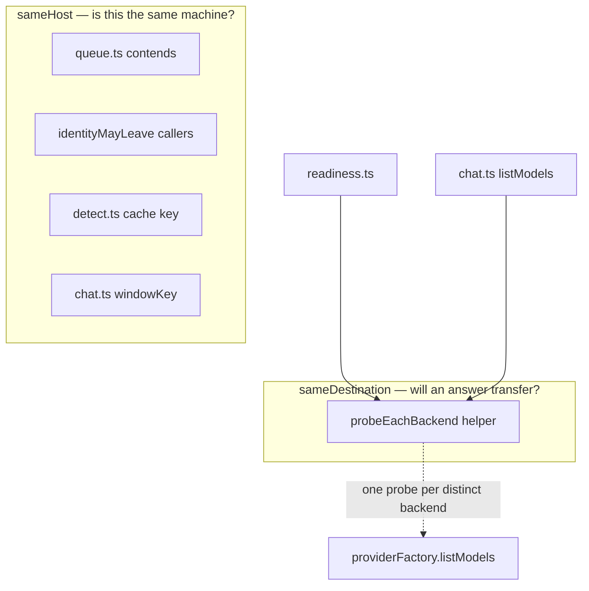

# refactor: One name for two questions — the backend-identity invariant

## Summary

Split `sameBackend` into `sameHost` and `sameDestination`, then replace the two
call sites that wanted the second question with a helper that asks each distinct
backend once per pass. Extend the readiness `models` leg to cover the backend
chat sends to. Pin the queue's host-level contention with a test, so the next
reader does not "correct" the one comparison that is deliberately endpoint-only.

Closes three of the five review findings left open after `ba3cf38`, `110ed6b`
and `5d80894`.

---

## Problem Frame

`server/src/providers/provider.ts` declares `sameBackend(a: string, b: string)`.
Its comment states the assumption — *"Both need one value to compare, and
`endpoint` is it"* — which was true before a backend gained a protocol and a
key, and has been false since.

The audit in the origin document found seven identity sites. Five are correctly
endpoint-scoped. Two are wrong, and both ask a question the endpoint cannot
answer: *will one slot's answer transfer to the other?* Both are short-circuits
whose purpose is to avoid a duplicate round trip when the slots name one server
(see origin: `docs/brainstorms/2026-08-09-backend-identity-invariant-requirements.md`).

So the fix is not to widen every comparison. Widening `contends` in
`server/src/providers/queue.ts` would be a regression: contention is about VRAM
on one machine, and two slots on one host contend whatever their keys say.

---

## Key Technical Decisions

**KTD1. Two predicates, and the name carries the question.** `sameHost` keeps
the current body and takes the five correct sites. `sameDestination` compares
normalised endpoint, resolved protocol, and key presence. A caller picking
wrongly is now visibly picking rather than complying with a signature.

**KTD2. Per-pass dedupe, not a cache.** This supersedes the origin document's
Outstanding Question about where a probe cache lives. Both short-circuit sites
call `listModels()`, and a model list is not stable for a process lifetime — a
newly pulled model must appear on the next readiness refresh without touching
settings. A memo scoped to one pass and discarded has the round-trip saving with
none of the staleness, and needs no invalidation point.

**KTD3. `sameDestination` has exactly one caller: the dedupe helper.** It is not
called from readiness or chat directly. One place asks whether two slots share a
destination, which is what makes the invariant hold by construction rather than
by everyone remembering.

**KTD4. Key presence, not key value.** Two slots with different keys are
different destinations whatever the keys are, and comparing secrets puts a
credential on a comparison path for no gain.

**KTD5. `sameBackend` is deleted, not deprecated.** A name that meant one thing
and now means one of two is worse than either replacement, and the compiler finds
every caller in one pass.

**KTD6. The queue is not touched, and a test says so.** Its `contends` moves to
`sameHost` and its behaviour is unchanged. Without a test naming the reason, the
next reader sees an endpoint-only comparison next to a whole-backend one and
"fixes" it — restoring the stall `decc1ea` removed.

---

## Requirements

| ID | Requirement | Origin |
|---|---|---|
| R1 | `sameHost(a: string, b: string)` exists with the current body; comment states it ignores protocol and key, and why | R1 |
| R2 | `sameDestination(a, b)` compares normalised endpoint, resolved protocol, key presence | R2 |
| R3 | `sameBackend` no longer exists; typecheck passes | R3 |
| R4 | Readiness probes both slots independently; no verdict is copied between slots | R4 |
| R5 | `list-models` lists both slots independently, on the same terms | R5 |
| R6 | Two slots differing only by key produce two probes; two identical slots produce one | R6 |
| R7 | The readiness `models` leg reports on the chat backend as well as the observation one | R7 |
| R8 | Queue contention is unchanged; a test asserts two slots sharing a host but differing by key still contend | R8 |

---

## High-Level Technical Design

Where the two questions live after the split:

The dedupe helper's shape, as direction rather than specification: given the
slots and a per-slot probe, resolve each slot's backend, group slots whose
backends satisfy `sameDestination`, run the probe once per group, and return a
result per slot. A slot whose backend cannot be resolved gets its own failure
rather than a neighbour's.

---

## Implementation Units

### U1. Split the predicate

**Goal.** `sameHost` and `sameDestination` exist; `sameBackend` does not.

**Requirements.** R1, R2, R3, R4 (partial).

**Dependencies.** None.

**Files.**
- `server/src/providers/provider.ts` — modify
- `server/test/providers/seam.test.ts` — modify

**Approach.** `sameHost` takes `sameBackend`'s body and comment verbatim, with a
sentence added on what it deliberately ignores. `sameDestination` takes two
`ResolvedBackend` values and compares `sameHost(a.endpoint, b.endpoint)`,
`a.protocol === b.protocol`, and `Boolean(a.apiKey) === Boolean(b.apiKey)`. Its
comment names the two review findings that motivated it, in the style of the
existing seam comments.

Update the four `sameHost` callers in the same unit — `queue.ts` (import only,
call site unchanged) and `readiness.ts`/`chat.ts` temporarily, so the tree
typechecks between units. U2 and U3 then remove those two.

`ollamaBackend` in `provider.ts` is dead (review finding, below the reporting
cap); delete it here since the file is open.

**Patterns to follow.** The comment style in `server/src/providers/provider.ts`
— state what the function refuses to do and why, not just what it does.

**Test scenarios.**
- `sameHost` treats `http://h:11434` and `http://h:11434/` as one host.
- `sameHost` returns true for two backends differing only by key. *(Covers the
  invariant KTD6 protects.)*
- `sameDestination` returns false for equal endpoints with different key presence.
- `sameDestination` returns false for equal endpoints with different protocols.
- `sameDestination` returns true for two backends identical in all three fields.
- `sameDestination` treats trailing-slash endpoint spellings as the same
  destination.

**Verification.** `sameBackend` appears nowhere in `server/src`; typecheck clean.

---

### U2. Ask each distinct backend once per pass

**Goal.** One helper owns the "do these two slots share a destination" question.

**Requirements.** R6, and the mechanism R4/R5 depend on.

**Dependencies.** U1.

**Files.**
- `server/src/providers/probe.ts` — create
- `server/test/providers/probe.test.ts` — create

**Approach.** A function taking the slots to cover, the settings store, and a
probe callback; returning a per-slot result. It resolves each slot's backend via
`backendForRole`, groups by `sameDestination`, runs the callback once per group,
and fans the result back out. A slot whose `backendForRole` returns null gets its
own null result rather than inheriting a neighbour's.

Generic over the probe's return so readiness and chat both use it — readiness
wants a model list to judge reachability, chat wants the list itself.

The memo is local to the call. Nothing is retained between passes, which is the
whole point (KTD2).

**Execution note.** Test-first. The unit exists to make a defect impossible, and
the tests are the statement of which defect.

**Test scenarios.**
- Two slots with identical backends: the probe callback runs once, both slots get
  the result. *(Covers AE3.)*
- Two slots on one endpoint, key on one only: the callback runs twice, and each
  slot gets its own result. *(Covers AE1.)*
- Two slots on one endpoint, protocol pinned differently: callback runs twice.
- Two slots on different endpoints: callback runs twice.
- One slot's backend fails to resolve, the other succeeds: the failure does not
  propagate to the working slot. *(Covers AE2.)*
- A probe callback that throws for one group leaves the other group's result
  intact.

**Verification.** The callback's invocation count is asserted in every scenario,
not just the results.

---

### U3. Readiness probes both slots

**Goal.** No readiness verdict is copied between slots.

**Requirements.** R4, R7.

**Dependencies.** U1, U2.

**Files.**
- `server/src/readiness.ts` — modify
- `server/test/readiness.test.ts` — modify

**Approach.** `chatIsSeparate` and the `if (!chatIsSeparate)` copy both go. The
chat and observation legs become one call to the U2 helper covering both slots.
`observationBackend` and `chatBackend` are each set from their own slot's result.

For R7, the `models` leg widens: it currently reports on the observation backend
only. Report `"none"` when *either* slot's backend resolved and listed nothing,
so "nothing pulled where chat sends" is visible. The existing test
`reports a chat backend reachable even when it lists no models` stays true —
`chatBackend` remains reachability-only; it is `models` that gains the coverage.

**Patterns to follow.** The `Promise.allSettled` shape already in
`probeReadiness` — legs stay independent and a rejected leg degrades one row.

**Test scenarios.**
- Both slots on one endpoint, key on observation only: observation `ok`, chat not
  `ok`. *(Covers AE1.)* This is the reviewed defect inverted.
- Both slots identical: one `listModels` call reaches the factory, both rows
  report. *(Covers AE3.)*
- Chat backend resolves but lists nothing, observation stocked: `models` is
  `"none"`. *(Covers AE5.)*
- Observation unreachable, chat reachable: `observationBackend` unreachable,
  `chatBackend` ok — neither copied.
- The captioner, recogniser and logs legs are unaffected by the restructure.

**Verification.** No `sameHost`/`sameDestination` call remains in `readiness.ts`;
the identity question is entirely inside U2's helper.

---

### U4. `list-models` lists both slots

**Goal.** The `same` short-circuit in `ChatService.listModels` goes.

**Requirements.** R5.

**Dependencies.** U1, U2.

**Files.**
- `server/src/chat.ts` — modify
- `server/test/chat-service.test.ts` — modify

**Approach.** Replace the `sameBackend(endpointForRole(...), endpointForRole(...))`
short-circuit and its `listed` loop with the U2 helper over `BACKEND_SLOTS`. The
per-slot broadcast shape is unchanged — one `models` message per slot, windows
and `windowSource` still riding only on chat's.

`endpointForRole` stays in use elsewhere in the file (`windowKey`,
`identityMayLeave`, the queue endpoint); only the identity comparison leaves.

**Test scenarios.**
- Chat keyless, observation keyed, one endpoint: observation's picker populates;
  chat reports `provider_unavailable`. *(Covers AE2.)* The reviewed defect,
  inverted.
- Both slots identical: one `listModels` call, two `models` broadcasts.
  *(Covers AE3.)*
- Windows and `windowSource` still ride only on the chat message.
- A slot that fails to resolve broadcasts `provider_unavailable` for itself only.

**Verification.** `sameBackend`/`sameHost`/`sameDestination` appear nowhere in
`chat.ts`.

---

### U5. Pin the queue's host-level contention

**Goal.** The one deliberately endpoint-only comparison survives a future reader.

**Requirements.** R8.

**Dependencies.** U1.

**Files.**
- `server/test/providers/queue.test.ts` — modify
- `server/src/providers/queue.ts` — comment only

**Approach.** No behaviour change. A test named for the reason, in the style of
`detects ollama when a server answers BOTH, because num_ctx depends on it` — the
existing precedent for pinning a decision by naming its rationale in the test
title. The comment above `contends` gains a line stating that it compares hosts
and not destinations *on purpose*, and pointing at the test.

**Test scenarios.**
- Narration in flight on an endpoint; a chat job arrives for the same endpoint
  with a different key: narration is aborted. *(Covers AE4.)*
- Narration in flight; chat arrives for a different endpoint: narration is not
  aborted. *(Existing behaviour, kept adjacent so the pair reads as one rule.)*

**Verification.** The pair of tests reads as a statement of the rule, not two
unrelated assertions.

---

## Scope Boundaries

**In scope.** U1–U5.

### Deferred to Follow-Up Work

- `chat.ts` `windowSource` reporting `"reported"` when no window was obtained.
- `server/src/providers/openai.ts` `modelWindow` ignoring its `model` argument.

Both are about a *window's* provenance rather than a *backend's* identity, and
the origin document defers them by name. Bundling them would make this plan's
diff harder to read for no shared mechanism.

### Not doing

- Widening every comparison to whole backends — the audit shows this regresses
  the queue and is unnecessary in three other places.
- Re-keying `chat.ts` `windowKey` to include protocol. The edge is real and has
  produced no observed defect; inventing a key for it here is speculative.
- The module-contract question (what the seam becomes for a provider with no URL
  and no model list). It is the natural successor and should inherit a seam that
  is not lying about what a backend is.

---

## Risks & Dependencies

**The readiness restructure is the risky unit.** `probeReadiness` resolves six
legs in one `Promise.allSettled` and four of them are unrelated to this work.
U3 must leave the captioner, recogniser and logs legs untouched, and its test
list says so explicitly.

**A behaviour change rides in U3.** Widening the `models` leg means an install
whose chat backend lists nothing now sees `models: "none"` where it previously
saw `"ok"`. That is R7 working, and it is the only user-visible change in the
plan — worth naming in the commit rather than discovering in the UI.

**Test-suite load flakiness.** The suite fails ~1 in 4 full runs on a timing test
in `monitors/`, `narration/` or `vision/`, a different one each time, unrelated
to this work. Re-run a failing file alone before attributing it to a unit.

---

## Verification

Typecheck and vitest are the only gate; there is no linter. Beyond green tests,
the two reviewed defects should be checked against a running server the way the
first five fixes were — two slots on one endpoint with a key on one of them, and
confirm readiness reports them differently.

---

## Sources & Research

- Origin: `docs/brainstorms/2026-08-09-backend-identity-invariant-requirements.md`
- Review of `d5aa105..d5033e9`: 10 findings, 5 fixed in `ba3cf38`, `110ed6b`,
  `5d80894`; 3 addressed here; 2 deferred above.
- `docs/solutions/a-value-frozen-for-one-caller-is-stale-for-the-next.md` and
  commit `d5033e9` — this class named before it recurred.
- `AGENTS.md` "Providers and backends" — `slotForRole` as the one route from a
  role to a backend, and the per-slot `list-models` contract this plan preserves.
