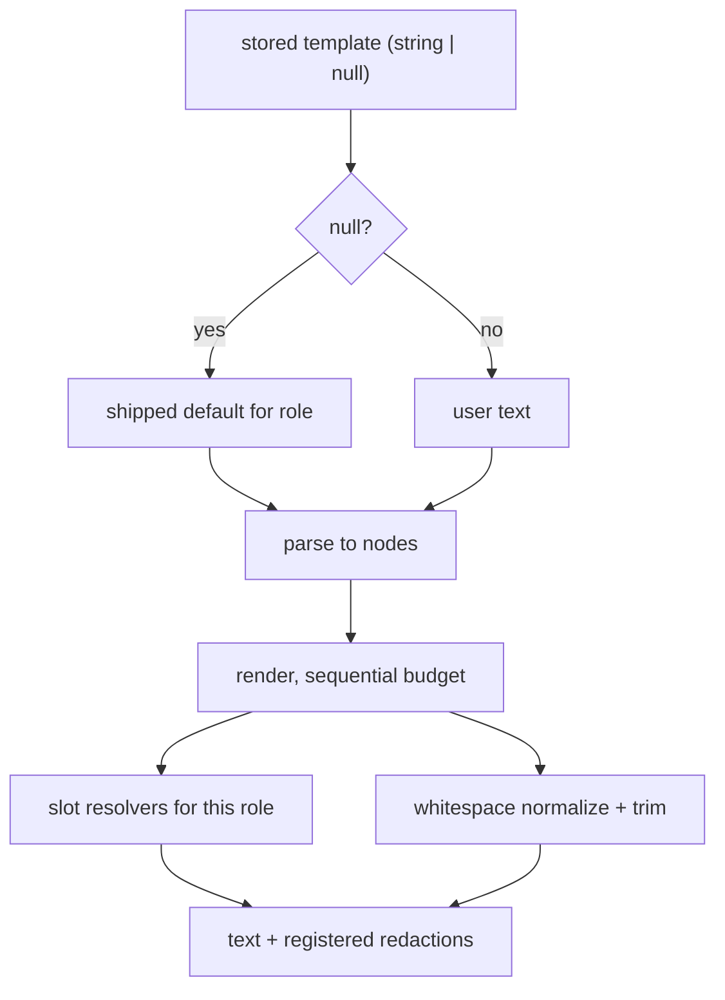
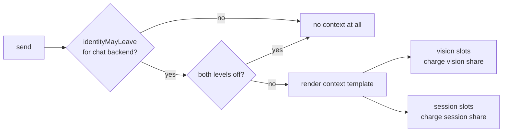

# feat: Editable prompt templates (phase one)

## Summary

Replace the hardcoded assembly of every message HAL sends with a small template
language the user owns. Named slots pull live readings in; conditional blocks drop the
wording around a slot that resolved empty. Phase one templates only what has no editor
today — the chat context block, the narration, Monitor and Vision user and system
messages, and the Captioner's question — and references the six existing prompt settings
from the shipped defaults through a slot rather than absorbing them.

---

## Problem Frame

Six prompt strings are editable. Everything else HAL sends a model is hardcoded: every
user message across four roles, and roughly a dozen frame sentences that
`shared/src/prompts.ts` assembles into the chat context block. The settings panel shows a
worked example of the assembled result and marks it as something to look at rather than
edit.

That conflicts with the product's own stated position, and it bounds tuning: the
project's measured prompt failures were fixed by editing text, and half the text has no
editor. See origin for the full framing, including which classes of failure this
deliberately does *not* reach.

---

## Requirements

Carried from origin. Phase one covers R1–R22 and R29–R37. R23–R28 and R39 are phase two.

**Template language** — R1 (text, slots, blocks), R2 (slot syntax), R3 (count argument),
R4 (conditional block), R5 (brace escaping), R6 (unknown slot rejected at apply), R7
(malformed block rejected), R8 (stored template always renderable), R29 (one slot per
branch value), R33 (composition in renderers), R35 (rename migrates, removal flags).

**Coverage** — R9 (every message template-driven), R10 (system and user per role), R11
(vocabulary per role), R12 (chat context slots), R13 (narration, Monitor, Vision slots),
R14 (readable and writable over the protocol).

**Defaults** — R15 (`null` tracks shipped), R16 (byte-identical rendering), R17 (reset),
R18 (baseline save and revert), R19 (three-state indicator), R32 (rationale note per
default), R37 (default-changed diff and adopt).

**Authoring** — R30 (slot list in the editor), R31 (rendered preview), R36 (identity slot
warning).

**Budgets and safety** — R20 (budget charges literals, per-source in chat), R21
(truncation notice belongs to the slot), R22 (closed gate suppresses the whole context
render), R34 (slots register rendered profile text for redaction).

**Out of scope this phase** — R23–R28 (migrating the six prompt settings), R39 (retiring
the reference slots). The per-Conversation system template is phase two with them: a
Conversation's prompt is already editable, so templating it buys nothing now and would
pull frozen-copy semantics into the release that introduces the renderer.

---

## Key Technical Decisions

**The language lives in `shared/`, beside the prompts it replaces.** The server renders
and the UI validates and previews the same text; two implementations would drift, and the
drift would be invisible — the editor would accept what the renderer rejects. This
follows the reason `contextBudgetChars` already lives in `shared/src/prompts.ts`.

**Composition is a resolver concern, not syntax.** Three behaviours of the current
assembly cannot be written as slots and single-slot conditionals: the give-back loop that
pops emitted lines to make room for a truncation notice, the blank line that appears only
*between* surviving sections, and the preamble that disappears when everything beneath it
came back empty. Rather than grow expressions, each is pushed down:

- Give-back stays inside the list slot's renderer, which emits its own notice (R21).
- Between-section separation becomes whitespace normalization in the renderer — runs of
  blank lines collapse to one and the result is trimmed. This is not the auto-prune
  heuristic the brainstorm rejected: it never removes a line that still has literal text.
- Preamble omission becomes a resolver rule. `{context_preamble}` resolves empty when no
  other context slot produced output, so it drops without a disjunction in the language
  and without a composite slot that would freeze session-before-sight ordering.

**Budget is charged sequentially in template order.** Literal text and separators charge
as encountered, and a list slot receives what remains at its position — which is exactly
what `sessionContextSection` does today with `spent = header.length`. Reordering a
template therefore changes what fits, which is honest: the user moved the thing.

**Chat carries two budgets, not one.** `ConversationContext` has independent `vision` and
`session` levels, either settable to `off`. Each chat context slot declares its source and
charges that source's `contextBudgetChars`. A source at `off` makes its slots resolve
empty, so the block around them drops (R20).

**Redaction is an output of rendering.** Today `chat.ts` finds profile text by
substring-matching against the assembled section. Once the surrounding text is
user-authored there is no section to match, so the profile slot returns the exact strings
it rendered and the renderer accumulates them (R34).

**The acknowledgement gate wraps the whole context render.** `assembleContext` returns
early today; the template equivalent is to skip rendering the context template entirely
when `identityMayLeave` is false, not to null individual slots (R22).

**Phase one keeps the six prompts as settings.** Each shipped default template references
its prompt through a slot — `{narration_prompt}`, `{monitor_prompt}`, `{vision_prompt}`,
`{caption_prompt}`, `{context_preamble}`. Presets, reset and the `null` convention keep
working untouched, and nothing irreversible ships.

---

## High-Level Technical Design

Render pipeline, one role per request:



Node shapes the parser produces — directional, not a type declaration:

```
Text   { value }
Slot   { name, count?, at }
Block  { slot, children[], at }     // {#slot} ... {/}
```

A resolver answers one slot:

```
resolve(name, { count, budgetLeft, sources }) ->
  { text, spent, redact[] }         // text "" means empty: the block drops
```

Gate and budget placement for the chat role:



---

## Implementation Units

### U1. Template parser and validator

**Goal:** Turn template text into nodes, and reject bad text at apply time with a usable
message.

**Requirements:** R1, R2, R3, R4, R5, R6, R7, R8.

**Dependencies:** none.

**Files:**
- `shared/src/templates.ts` (create)
- `server/test/templates/engine.test.ts` (create)

**Approach:** One pass producing `Text | Slot | Block` nodes. Slot syntax
`{name}` and `{name[N]}`; block syntax `{#name}…{/}`. Literal braces escape as `{{` and
`}}`. Validation takes the parsed nodes plus a role's vocabulary and returns either ok or
a list of errors carrying kind, offending name, and character offset — the offset is what
R7 promises and what U8's editor needs to point at.

Validation is a separate exported function from parsing, because the renderer must parse a
stored template that references a withdrawn slot without rejecting it (R8, R35).

**Patterns to follow:** `isBlankPrompt` and `resolvePrompt` in `shared/src/prompts.ts` for
the defensive posture — a hand-edited settings file can put anything in the slot, so
`unknown` inputs are handled rather than assumed to be strings.

**Test scenarios:**
- A template with only literal text parses to one text node and renders unchanged.
- `{clock}` parses as a slot; `{session_remarks[5]}` parses with count 5.
- `{session_remarks[0]}` and `{session_remarks[-1]}` are rejected as invalid counts.
- `{{` and `}}` render as single literal braces and are never read as a slot.
- `{#a}x{/}` parses as a block containing one text node; nested blocks parse.
- An unclosed `{#a}x` is rejected, and the error carries the offset of `{#a}`.
- A stray `{/}` with no open block is rejected with its offset.
- A slot not in the role's vocabulary is rejected, and the error names it and lists the
  role's valid slots.
- A slot valid for one role and not another is accepted for the first and rejected for the
  second.
- Parsing never throws on arbitrary input: a fuzz-ish set of unbalanced braces returns
  errors rather than exceptions.

**Verification:** Parsing and validating every shipped default template for its own role
produces zero errors.

---

### U2. Slot vocabulary and the resolver contract

**Goal:** Declare what each role may reference, and the shape a resolver answers with.

**Requirements:** R11, R12, R13, R29, R32, R34.

**Dependencies:** U1.

**Files:**
- `shared/src/templates.ts` (modify — vocabulary tables and types)
- `server/test/templates/engine.test.ts` (modify)

**Approach:** A per-role table of slot specs: name, one-line meaning, whether it takes a
count, which budget source it charges (chat only), and whether it is identity-bearing
(drives U8's R36 warning). The resolver result carries `text`, `spent`, and `redact`, so
redaction registration is structural rather than a caller's afterthought.

Value-selected text becomes one slot per value (R29): `{monitor_reason_interrupt}`,
`{monitor_reason_full}`, `{monitor_reason_cycle}`, and one per Vision sensitivity plus
`{vision_silence_sentinel}` which resolves empty at sensitivity `always` — mirroring
`visionSensitivityInstruction`'s existing branch.

Each spec carries the R32 rationale note. Source these from the existing comments in
`shared/src/prompts.ts` — the reasoning is already written there, it has simply never
reached the surface.

**Patterns to follow:** `MONITOR_SEVERITY` and `VISION_SENSITIVITIES` in
`shared/src/types.ts` for const-tuple-plus-derived-union; `BACKEND_SLOT_LABELS` for a
label table keyed by a union.

**Test scenarios:**
- Every slot named in every shipped default template exists in that role's vocabulary.
- Every slot in every vocabulary carries a non-empty meaning and a non-empty rationale
  note.
- Chat slots each declare a budget source; non-chat slots declare none.
- The identity-bearing flag is set on the faces slot and the profiles slot, and on nothing
  else.
- Sensitivity slots: exactly one resolves non-empty for a given sensitivity, and
  `{vision_silence_sentinel}` resolves empty at `always` and non-empty otherwise.

**Verification:** A table-driven test walks every role and asserts the vocabulary is
complete and self-consistent.

---

### U3. Renderer: budgets, blocks, redaction, normalization

**Goal:** Turn nodes plus resolvers into the final message text.

**Requirements:** R4, R20, R21, R33, R34, R35.

**Dependencies:** U1, U2.

**Files:**
- `shared/src/templates.ts` (modify)
- `server/test/templates/engine.test.ts` (modify)

**Approach:** Walk the nodes in order. Literal text charges its own length against the
active budget. A slot is resolved with the remaining budget for its source and charges
what it spent. A block renders its children into a buffer and is discarded whole if its
named slot resolved empty; a discarded block refunds what its children charged. After the
walk, collapse runs of two or more blank lines to one and trim the ends.

A slot whose name is absent from the vocabulary renders empty and is reported in the
render result, so U8 can mark the template degraded (R35) without the renderer throwing.

**Execution note:** Write the byte-identity tests (U4's first two scenarios) before the
chat resolvers exist, using the current assembly as the oracle. The whole point of R16 is
that the two agree, and discovering a mismatch after the call sites move is the expensive
order.

**Test scenarios:**
- A block whose slot resolves empty removes its literal text; a block whose slot resolves
  non-empty keeps it.
- Blank-line collapsing: two surviving blocks separated by a dropped block render with
  exactly one blank line between them, and no leading or trailing whitespace.
- A line holding literal text and one empty slot keeps the literal text — normalization
  never removes a non-blank line.
- Budget: literal text charges; a list slot receives budget minus what literals already
  spent.
- A dropped block refunds its children's spend, so a later slot sees the larger budget.
- Two sources: exhausting the vision budget does not reduce what session slots may spend.
- Redaction: a resolver returning `redact` entries surfaces them in the render result;
  entries from a dropped block are not surfaced.
- An unknown slot renders empty and is listed in the result's degraded-slot set rather
  than throwing.

**Verification:** Rendering a template of only literals returns them unchanged; rendering
every shipped default with stub resolvers produces no exceptions and no stray blank runs.

---

### U4. Chat context through templates

**Goal:** Replace `assembleContext`'s hand-assembly with a rendered template, preserving
the gate, the budgets, the ordering default, and the redaction list.

**Requirements:** R12, R16, R20, R21, R22, R34; origin AE1, AE7, AE8.

**Dependencies:** U1, U2, U3.

**Files:**
- `shared/src/prompts.ts` (modify — section functions become slot resolvers; the shipped
  strings stay, relocated into the default template)
- `server/src/chat.ts` (modify — `assembleContext`)
- `server/src/templates/chatSlots.ts` (create — resolver wiring over `ContextSources`)
- `server/test/chat-context.test.ts` (modify)
- `server/test/templates-chat.test.ts` (create)

**Approach:** The default chat context template reproduces today's output: session block
first, sight second, preamble above both, each wrapped in a conditional block.
`visionContextSection` and `sessionContextSection` become the bodies of list-slot
resolvers, keeping their give-back loops intact per R33. The gate stays where it is — the
whole render is skipped when `identityMayLeave` is false, and skipped when both levels are
`off`.

The profile resolver returns the profile strings it rendered; `chat.ts` reads them from the
render result instead of substring-matching.

**Patterns to follow:** the existing early returns at the top of `assembleContext`; the
`redact` plumbing already accepted by `provider.chatStream`.

**Test scenarios:**
- **Covers AE3.** Byte identity: for a matrix of readings — camera off, watching with
  nobody, one stated face, one hedged face, two faces, a caption present and absent, a
  watched session with and without remarks, truncation active — the rendered default
  produces a string identical to the pre-change assembly.
- **Covers AE1.** Camera off and a session watched renders only the session block; the
  sight heading does not appear.
- **Covers AE7.** A remote chat backend with no acknowledgement produces no context at
  all — no session block, no preamble — and the request carries only the Conversation's
  own prompt.
- **Covers AE8.** A template that moves the profile slot and wraps it in the user's own
  wording still produces a redaction list containing that profile's exact text.
- Both levels `off` renders nothing and does not consult the camera or the feed.
- Vision `off`, session `large` renders only session, and the session budget is unchanged
  by vision being off.
- A truncated remarks slot emits the "earlier remarks not recalled here" notice, and the
  notice fits inside the budget.
- A profile withheld by the Identity Band is neither rendered nor added to the redaction
  list.
- Ordering: a template with sight before session renders in that order, proving placement
  is the template's.

**Verification:** The existing chat-context suite passes unchanged, plus the byte-identity
matrix.

---

### U5. Narration and Monitor messages through templates

**Goal:** Move both roles' system and user messages onto templates.

**Requirements:** R9, R10, R13, R16, R29.

**Dependencies:** U1, U2, U3.

**Files:**
- `server/src/narration/narrator.ts` (modify)
- `server/src/monitors/narrator.ts` (modify)
- `server/src/templates/narrationSlots.ts` (create)
- `server/src/templates/monitorSlots.ts` (create)
- `server/test/narration-templates.test.ts` (create)
- `server/test/monitor-templates.test.ts` (create)

**Approach:** Narration's system template defaults to `{narration_prompt}`; its user
template reproduces `Session activity:\n{session_lines}\n\nNarrate this activity now.`
Monitor's system template defaults to `{monitor_prompt}`; its user template uses the three
reason slots from U2 inside conditional blocks, so exactly one framing survives.

A blank prompt must continue to omit the system message — with templates that means the
rendered system text being empty, which falls out of the normalization in U3.

**Test scenarios:**
- Narration byte identity against the current assembly for a batch of log lines.
- Monitor byte identity for each of the three reasons.
- A blank `narrationPrompt` produces no system message, exactly as today.
- A Monitor template that deletes two reason blocks still renders the third.
- The monitor label appears wherever `{monitor_label}` is typed, including twice.
- Narration and Monitor vocabularies reject each other's slots.

**Verification:** Existing narration and monitor suites pass; the byte-identity tests pass
for every reason value.

---

### U6. Vision summariser and Captioner through templates

**Goal:** Move the cycle summary and the caption question onto templates, including the
profile section's placement.

**Requirements:** R9, R10, R13, R16, R29; origin AE10.

**Dependencies:** U1, U2, U3.

**Files:**
- `server/src/vision/service.ts` (modify — `narrate` and the caption call)
- `server/src/templates/visionSlots.ts` (create)
- `server/test/vision-templates.test.ts` (create)

**Approach:** The Vision system template defaults to `{vision_prompt}` followed by
`{#known_people}{known_people}{/}`, which is what makes the blank-prompt-with-profiles
behaviour a property of the render rather than a special case in the call site. The user
template carries the sensitivity slots, `Frames from the last period:`, and
`{vision_caption_lines}`.

The Captioner has no system-message path and its message carries an image part alongside
the text. Phase one templates the text part only and passes the rendered string where
`prompt` goes today; the role exposes no system template, and `templates.ts` records that
asymmetry in the role table rather than pretending R10 holds uniformly.

**Test scenarios:**
- Vision byte identity across all four sensitivities, with and without profiles.
- **Covers AE10.** A blank `vision.prompt` with two profiled people still produces a
  system message containing the profile section.
- A blank `vision.prompt` with no profiles produces no system message.
- The silence sentinel appears for every sensitivity except `always`.
- Identity-banded caption lines render unchanged — the hedge is produced by the resolver,
  not the template.
- The Captioner receives the rendered text and the image part is unaffected.
- The Captioner role exposes no system template, and asking for one is a typed error
  rather than an empty string.

**Verification:** Existing vision suites pass; a live captioner is not required — the
captioner is stubbed, as it is today.

---

### U7. Settings, protocol, and default-change detection

**Goal:** Store templates, carry them and their vocabulary over the wire, and detect when a
shipped default has moved.

**Requirements:** R14, R15, R17, R18, R19, R32, R35, R37.

**Dependencies:** U2.

**Files:**
- `shared/src/types.ts` (modify — `Settings.templates`, `PromptCatalog`, patch shape)
- `server/src/storage/settings.ts` (modify — merge per template key)
- `server/src/chat.ts` (modify — catalog construction)
- `server/test/settings-templates.test.ts` (create)

**Approach:** `Settings` gains a `templates` map keyed by role-and-slot-position, each
entry `{ text: string | null; baseline?: string; baselineOf?: string }`. `null` text keeps
the existing meaning. `baseline` is the user's saved text; `baselineOf` records the shipped
default in force when it was saved, which is what R37 compares against to decide a template
is behind.

`PromptCatalog` gains the shipped default template for every role, each role's slot
vocabulary with meanings and rationale notes, and — fixing a gap this research found — the
Monitor prompt's shipped default, which the catalog has never carried, plus a declaration
for `contextPreambleDefault`, which `PROMPT_CATALOG` already ships while the interface does
not declare it.

**Test scenarios:**
- A patch setting one template leaves the others untouched.
- `null` resolves to the shipped default at read time; a later change to the shipped
  default reaches an install that left it `null`.
- Saving a baseline records the shipped default in force; changing the shipped default
  afterwards marks the template behind.
- A template equal to the shipped default reports state `shipped default`; equal to the
  baseline reports `user baseline`; neither reports `edited`.
- Reverting to baseline restores the saved text, not the shipped default.
- The catalog carries a default and a vocabulary for every role, and a rationale note for
  every slot.
- The catalog carries the Monitor prompt default and the context preamble default, and
  `PromptCatalog` declares both.
- A settings file hand-edited to hold a non-string in a template slot does not crash a
  read.

**Verification:** `npm run typecheck` passes both tsconfigs; a protocol-only client can
read every shipped default and reproduce a reset from the settings broadcast alone.

---

### U8. Template editors in the settings panel

**Goal:** Make the templates authorable — slot list, preview, validation errors, the three
states, and the two warnings.

**Requirements:** R19, R30, R31, R35, R36, R37; origin AE2, AE5.

**Dependencies:** U1, U2, U7.

**Files:**
- `ui/src/components/TemplateField.tsx` (create)
- `ui/src/components/SettingsPanel.tsx` (modify)
- `ui/src/store.ts` (modify — templates in settings state)
- `ui/test/components/TemplateField.test.tsx` (create)
- `ui/test/components/SettingsPanel.test.tsx` (modify)

**Approach:** `TemplateField` extends the existing `PromptField` shape rather than
replacing it — textarea, apply, reset — and adds: the role's slot list with meanings and
click-to-insert, a rendered preview beneath, a state line, and buttons for save-baseline
and revert-to-baseline. Validation runs client-side on the shared parser as the user types
and again server-side on apply, so a protocol client cannot store an invalid template.

The doubled editor count needs its own home. Templates go in a dedicated section per role
rather than inline beside the tool, since each role now has two editors carrying five
controls; the existing six prompt fields stay where they are in phase one.

The preview samples current readings when available and a fixed sample otherwise, so the
pane is never blank on a fresh install with the camera off.

**Test scenarios:**
- **Covers AE2.** Applying a template with an unknown slot shows an error naming the slot
  and listing valid ones, and does not send an update.
- A malformed block shows an error and moves the cursor to the offending offset.
- **Covers AE5.** Edit, save baseline, edit again, revert — the text returns to the
  baseline and the state line reads `user baseline`.
- The state line reads `shipped default` when the stored value is `null`.
- Save-baseline is disabled when the text already equals the baseline; revert is hidden
  when no baseline was ever saved.
- Clicking a slot in the list inserts it at the cursor.
- A template referencing a withdrawn slot renders the degraded marker naming that slot.
- A template whose shipped default has moved shows the behind marker and a diff, and
  taking the new default replaces the text.
- An identity-bearing slot shows the R36 note.
- The preview updates as the template changes and marks dropped blocks as dropped.
- The component survives an unstable `send` — no effect depends on its identity.

**Verification:** Screenshot the settings panel with a template edited, a validation error
showing, and the preview populated. Then boot the app and confirm a chat send with both
context switches on still produces the same message as before the change.

---

## Scope Boundaries

- **Phase two, not this plan:** migrating the six prompt settings into templates (origin
  R23–R28), retiring the reference slots (R39), and templating the per-Conversation system
  prompt.
- `enforceIdentityBands` stays outside the template system — it rewrites model output.
- Off-Machine Acknowledgement stays in code; a template cannot reach it.
- No loops, arithmetic, or general expressions.
- Line rendering stays code-owned: whether a log line carries a timestamp or an ordinal,
  and what the Captioner is asked upstream.

### Deferred to Follow-Up Work

- A change gate ahead of the captioner and correlated narration across observation roles
  (already on the deferred roadmap; untouched here).
- Retiring `PromptField` once phase two removes the six standalone prompt editors.

---

## Risks & Dependencies

**Byte identity is the load-bearing risk.** If a shipped default renders even one
character differently, every existing install silently changes what HAL says on upgrade,
and the change is most likely in the truncation paths that only fire under a tight budget.
Mitigated by writing the byte-identity matrix first (U3 execution note) with the current
assembly as oracle, and by covering the truncation cases explicitly rather than only the
happy path.

**The redaction seam is a privacy regression risk.** The current substring match is
load-bearing for keeping profile text out of a log that is never pruned. U4 changes how the
list is built; a resolver that forgets to register is a silent leak. Mitigated by making
`redact` part of the resolver result type, so omitting it is a type error rather than an
oversight, and by AE8's placement-independent test.

**Test suite parallelism.** Per `AGENTS.md`, any test that resolves a backend must pin the
protocol with `pinnedSettings`, and waits must use `waitFor` rather than fixed sleeps. The
new server suites resolve backends and will flake without both.

**No new dependencies.** The parser is a few hundred lines of hand-written scanning; a
template library would bring an expression language this deliberately does not want.

---

## System-Wide Impact

- **Agent-native parity:** templates are readable and writable over the WS protocol and the
  vocabulary ships in the settings broadcast, so a protocol-only client can author them.
  This is the AGENTS.md rule, and U7 is where it is satisfied.
- **`shared/src/prompts.ts` changes shape** — the section functions become resolvers and the
  frame strings move into default templates. Every current importer is in `server/`.
- **`CONCEPTS.md`** gains Template, Slot, and Conditional Block once the vocabulary is
  settled in U2 — not before, since the terms are still proposals until then.

---

## Open Questions

**Deferred to implementation**
- Whether the shipped default templates read better with blocks on their own lines or
  inline; decide against the rendered output once U3 exists.
- Whether client-side validation debounces or runs per keystroke.
- Exact slot names. The vocabulary in U2 is the contract; the spellings are cheap to change
  before U4 lands and expensive after.

**Deferred to phase two**
- Whether phase two's migration is destructive or keeps the six settings readable for a
  release.
- How a Conversation copy frozen under an older vocabulary is treated by R35.

---

## Sources & Research

- Origin: `docs/brainstorms/2026-08-09-editable-prompt-templates-requirements.md`
- `shared/src/prompts.ts` — the assembly being replaced, and the rationale comments that
  become R32's notes
- `server/src/chat.ts` — `assembleContext`, the gate, the redaction list
- `server/src/narration/narrator.ts`, `server/src/monitors/narrator.ts`,
  `server/src/vision/service.ts` — the user messages with no editor
- `server/src/vision/captioner.ts` — confirms the Captioner has no system-message path and
  carries an image part
- `shared/src/types.ts` — `Settings`, `SettingsPatch`, `PromptCatalog`; the catalog gap this
  plan fixes
- `AGENTS.md` — protocol parity, `pinnedSettings`, `waitFor`, `tmpDir`
- `docs/solutions/an-instruction-that-fights-its-own-input-loses.md` — why the shipped
  wording is what it is
