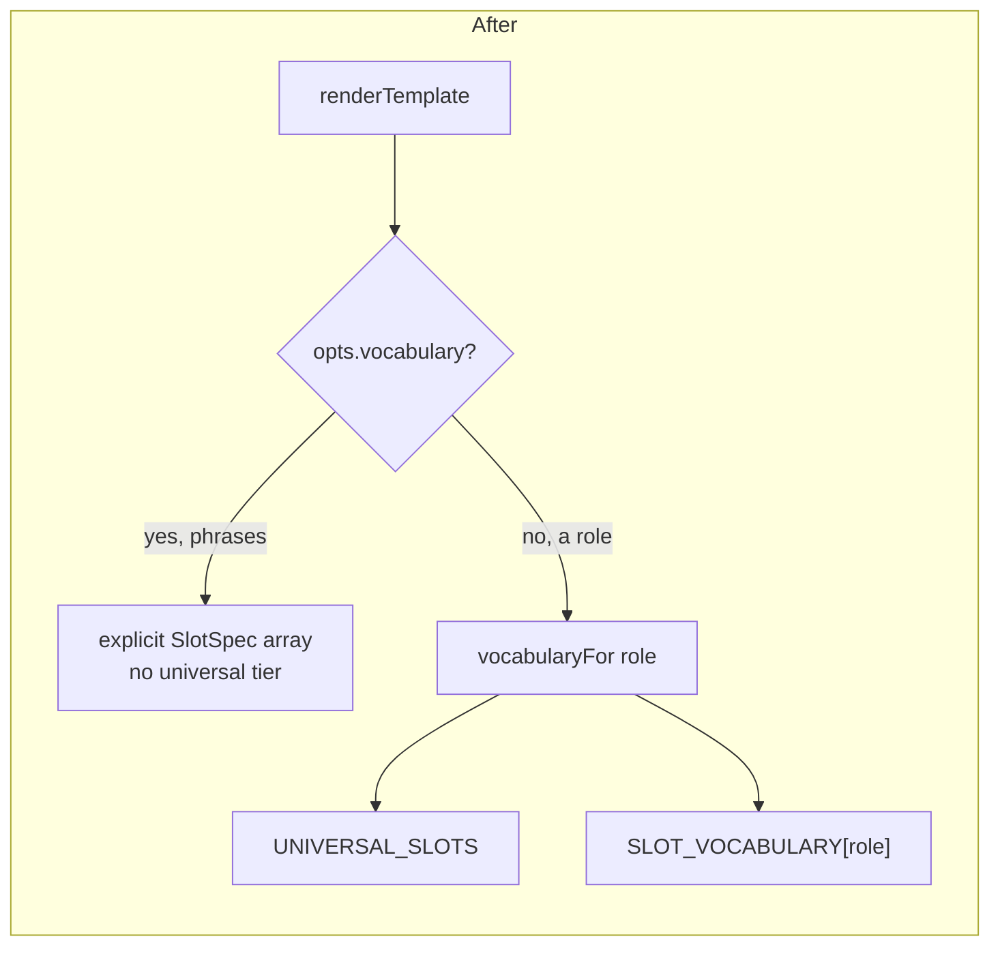
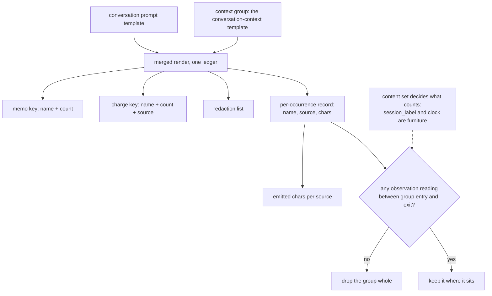
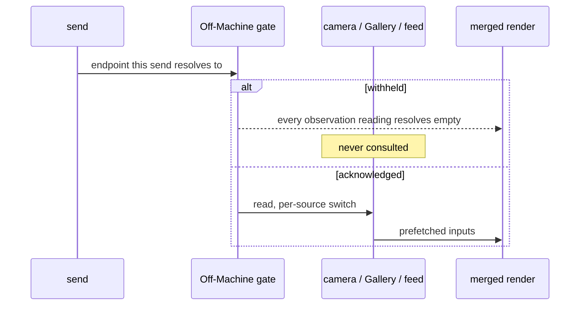

# feat: One template language for every editable prompt

## Summary

Finish what phase one started. The six prompts still edited as plain textareas become
Templates; a universal vocabulary tier reaches every role without per-role registration; and
`{context}` decomposes into the individual readings behind it, so a Conversation prompt places
sight, session and Monitor material itself. Delivered in two stages — the conversions first,
which touch no ledger, and the render merge second.

---

## Problem Frame

Phase one shipped the language and stopped at its own boundary. Its plan named the remainder
explicitly: *"Phase two merges those six and retires the references."* That never happened, so
nine roles are Templates and six prompts are literal text injected into them through a slot.

The seam is visible in one screen. A Conversation's own prompt is a Template; the default
conversation prompt in settings that seeds it is a textarea. Same text, two languages, decided
by which screen it was opened from.

The vocabulary gap is worse than the seam. A Conversation prompt has three names, and readings
that already exist and work — who was recognised lately, with a count; the most recent room
description — are reachable only from the context Template. That Template is a single global
setting. A thread that wants the caption at the top and the rest beneath cannot have it without
changing every other thread. Editor changes cannot reach that; only the merge can.

Research surfaced three live defects inside this surface, two of which block requirements this
plan carries (see U2 and U5).

---

## Key Technical Decisions

**The oracle is recorded before anything else, including the conversions.** The origin's
byte-identity requirement says "before any of this work begins", and research found the reason
it must be taken literally: the existing goldens snapshot the *pre-template hand assembly*, not
today's renderer; `context-cross-source.test.ts` funds vision and session together but never
funds the Monitor budget; and `legacyContextSections.ts` has no Monitor equivalent, so
`monitor_remarks` has no byte-identity guard at all today. A new oracle is new construction, not
an extension of the old one. It is U1 and nothing precedes it.

**Three keys, named separately.** The engine already distinguishes a memo key (name + count)
from a charge key (name + count + budget source), and collapsing them is the defect
`docs/solutions/a-sweep-that-varies-one-input-cannot-see-the-other.md` records — `{clock}` in two
headings, charged once, eight characters, a different truncation point. The origin's emission
bound adds a third key (emitted characters per source) that has never existed. U6 states all
three and tests each; conflating any two reproduces a shipped bug.

**The group-alive verdict reads a per-occurrence emission record, not `emitted`.** This decision
has been written wrongly twice by the same author —
`docs/solutions/a-fix-teaches-a-pattern-go-looking-for-it.md` documents both instances — and the
obvious third attempt is also wrong. `ledger.emitted` pushes inside `if (!ledger.charged.has(key))`,
so it is a name-deduped, charge-gated set: a reading named in the prompt and again inside the
group is recorded once, at its first occurrence, outside. A verdict reading it would drop the
group in exactly the case the origin's first acceptance example describes.

The ledger therefore gains a per-occurrence record — one entry per `emitSlot` reach, carrying the
name, its budget source and the characters it produced, appended whether or not the charge key was
already spent. The verdict is: did any *observation reading* land between the group's entry and
exit. Carrying a budget source is not the test — `session_label` has one and is deliberately
excluded from today's content set, because a heading whose list the budget emptied must not count
as having something to say. The existing content set moves with the group and stays its source of
truth. `emitted` stays what it is and is explicitly not the input. A boolean assigned inside a
resolver remains the forbidden implementation, and a grep for that shape runs before the merged
pass is written, not after review.

**The group is a new node kind, and saying otherwise would mislead the implementer.** An earlier
draft of this plan claimed it was the existing block drop applied to a named expansion. That is
false against the code and would get U6 built as a small change. A block's hold is decided by a
slot of its own name (`producedAny`, falling back to `resolveSlot`), and a group named `context`
has no such slot. A block also drops only when its body trims to empty, while the group must drop
while its body is non-empty — the preamble and the literal headings are there and are not
observations. Two predicates and a node kind with no backing slot is a new construct. What stays
unchanged is the surface syntax: the four rules are still four, and nothing the user types is new.
`swallowNewline`, `snapshot` and `rollback` carry over from the block branch explicitly.

**Redaction is producer-reported, never recovered by searching output.** This is the P0 from
`docs/solutions/a-rule-that-is-right-for-the-whole-is-wrong-for-the-part.md`. The merge widens
its blast radius: after this work a Character Profile can be placed by a per-thread prompt whose
surrounding wording is entirely the user's, so nothing about the finished string is predictable.

**The universal tier is a Template tier, not a phrase tier.** The engine chooses its vocabulary
at `renderTemplate`'s `opts.vocabulary ?? SLOT_VOCABULARY[opts.role]`. The explicit-vocabulary
path is how phrases reuse the engine, and it must not pick up universal slots. A single
`vocabularyFor(role)` helper replaces every `SLOT_VOCABULARY[role]` lookup — three in `shared/`,
two in `ui/` — and the explicit path stays untouched.

**The preamble gets the universal-tier-only vocabulary in stage one.** Settling the origin's
first deferred question this way means stage two moves its call site into the merged pass without
changing its vocabulary — one change instead of two. Its emptiness rule then becomes a property
of the named group rather than of its own render.

**The Monitor and Vision system prompts gain the universal tier only.** Settling the origin's
second deferred question. Their role readings are one name each and describe the message they
are embedded in; adding them to the prompt that is itself that slot's value would be circular.

**Slot notes are reviewed for the new scope, not copied.** The origin requires new slots to carry
their meaning and note. `docs/solutions/an-instruction-that-fights-its-own-input-loses.md` records
that a rule right in one place damaged another — the same sentence protected narration and hurt
chat. A note written to protect the context block may be wrong when the slot is reachable from a
per-thread prompt.

---

## High-Level Technical Design

Where the vocabulary comes from, before and after. The change is that one lookup becomes one
helper, and the explicit-vocabulary path is deliberately excluded.

The render pass, stage two. One ledger, and `{context}` as a group the renderer can drop whole
rather than a second render whose result is discarded.

The consent gate keeps its current position — above every read, not around the wording.

---

## Implementation Units

### Phase A — Oracle and prerequisites

### U1. Record the byte-identity oracle

**Goal.** Capture what every role renders today, from today's renderer, before any change.

**Requirements.** R20, R21.

**Dependencies.** None. Nothing else starts until this lands.

**Files.**
- `server/test/templates/oracle.test.ts` (new)
- `server/test/templates/__snapshots__/oracle.test.ts.snap` (new, recorded)
- `docs/solutions/byte-identity-needs-an-oracle-recorded-first.md` (new — the argument this unit
  rests on currently lives outside the repo, and the test file cites it)
- `AGENTS.md` (add the new snapshot path to the existing do-not-re-record rule)

**Approach.** A new oracle, separate from `context-golden.test.ts.snap` — that file snapshots the
pre-template era, and mixing the two would make a diff ambiguous about which era changed. Record
per role: the rendered text plus `redact`, `emitted`, `degraded` and `dropped`. Sweep budgets by
1, not by 7, and run past where truncation begins; the recorded lesson names a defect that sat at
~1075 while the sweep stopped at 900. Fund all three sources non-zero in at least one sweep —
one-at-a-time sweeps are what let two byte-identity defects ship.

**Patterns to follow.** `server/test/chat/context-cross-source.test.ts` for the mismatch-collecting
sweep shape (it names how many budgets disagreed rather than failing on the first).
`const NOW = new Date(2026, 7, 9, 18, 22, 4)` — local components, never a UTC string.
`server/test/tmp.ts` for temp dirs, `pinnedSettings` from `server/test/settings.ts` for anything
that resolves a backend.

**Test scenarios.**
- Each of the nine roles renders its shipped default; text and all four side-channel lists recorded.
- Each of the six plain prompts renders through its host role; recorded the same way. The default
  conversation prompt has no host role — it is blank and is copied into a Conversation's own
  prompt — so the oracle constructs a Conversation fixture for it rather than recording nothing.
- Vision × session × Monitor budgets swept together, step 1, from 0 past the truncation point;
  every disagreement collected rather than failing fast.
- A Character Profile containing a blank line, one containing CRLF, and a multi-line one — the
  shapes that produced the redaction P0.
- Zero budgets, absent sources, and camera-off recorded explicitly as branches, not skipped.

**Verification.** The snapshot file exists, is committed, and every subsequent unit runs against
it unchanged. `AGENTS.md` names three snapshot paths under the do-not-re-record rule, not two.

### U2. Persist the Monitor Context Level

**Goal.** Make Monitor context reachable at all, so the readings later units expose can be exercised.

**Requirements.** Prerequisite for R10; no origin requirement states it because the origin assumed
it worked.

**Dependencies.** U1.

**Files.**
- `server/src/storage/conversations.ts` (`setContext`)
- `server/test/storage/storage.test.ts`

**Approach.** `setContext` writes `{ vision, session }` and drops `monitor`. The type declares it,
the UI sends it, and `assembleContext` reads it — so the control is dead end to end and nothing
fails. Add the third level to the write. This is not scope creep: without it, every Monitor
reading U7 makes reachable renders empty for a reason unrelated to this work.

**Test scenarios.**
- Setting the Monitor level persists it and reads back through the store.
- Setting all three persists all three.
- A conversation stored before this change, with no Monitor level, reads back as off rather than
  undefined-shaped.

**Verification.** Setting the Monitor Context Level in the UI and reopening the conversation shows
the level that was set.

---

### Phase B — Stage one: conversions and the universal tier

### U3. The universal vocabulary tier

**Goal.** One registration reaches every role, resolved from one send description.

**Requirements.** R6, R7, R7a, R7b, R8, R9, R9a.

**Dependencies.** U1.

**Files.**
- `shared/src/templates.ts` (`UNIVERSAL_SLOTS`, `vocabularyFor`, wire into `validateTemplate`,
  `slotSpec`, `slotNames`, `renderTemplate`)
- `shared/src/prompts.ts` (the shared universal resolver; remove `clock`/`date` from the two role
  vocabularies that carry them)
- `server/src/templates/roleMessages.ts`, `chatContext.ts`, `conversationSystem.ts` (accept and
  pass the send description)
- `server/src/chat.ts`, `server/src/narration/narrator.ts`, `server/src/monitors/narrator.ts`,
  `server/src/vision/service.ts` (build the send description)
- `shared/src/types.ts` (send description shape if it crosses the wire)
- `server/test/templates/universal-tier.test.ts` (new)

**Approach.** `vocabularyFor(role)` concatenates the universal tier onto the role's own and
replaces every `SLOT_VOCABULARY[role]` lookup. The explicit-`vocabulary` path stays untouched so
phrases do not acquire universal slots. Each render site builds one send description — model,
Backend, whether this send leaves the machine — and a single shared resolver answers the whole
tier from it. `{model}` names the model *this message* is going to, which is why the captioner
resolves the Captioner.

This unit also fixes a live defect: `{date}` is in the Conversation vocabulary and accepted by the
validator, but `composeSystemMessage`'s resolver answers only `clock` and `context`, so it renders
empty and is not even reported as degraded. Name it as a fix, not a side effect of a refactor.

Backend resolution is async and resolvers are synchronous — the send description is built before
the render, never fetched inside it.

The captioner is the awkward one and the origin's acceptance example depends on it.
`HttpCaptioner.caption` posts no model field, and `VisionSettings` carries a captioner endpoint but
no captioner model, so nothing in the process currently knows what model the captioner runs. Add a
cached `modelName()` probe reading `/v1/models` from the captioner endpoint, following the shape
`providers/windows.ts` already uses, and build the captioner's send description from it.
`{backend}` for this role resolves to the captioner endpoint, because the captioner is not a
Backend and bypasses role-to-backend resolution.

**Patterns to follow.** Acceptance-shaped comparisons throughout
(`docs/solutions/a-boundary-guard-is-not-defence-for-the-comparisons-behind-it.md`). Slot notes
written to this codebase's standard: what the wording protects and which measured failure produced
it, never a placeholder.

**Test scenarios.**
- Effect test, one per site: for each of the nine roles × each universal slot, set the value to
  something distinctive and assert it appears in the render. Threading through N call sites and
  asserting the plumbing exists is the shape that landed on five of six last time.
- A phrase render does not accept a universal slot — it reports the name as unknown.
- `{model}` in the captioner prompt renders the Captioner; in a Conversation prompt, the chat model.
- `{date}` in a Conversation prompt renders today's date (the defect above).
- `{clock}` appears exactly once in each role's slot list, not twice.
- A universal slot inside a budgeted section charges that section; the oracle from U1 is unchanged
  by this unit.

**Verification.** U1's snapshots pass untouched. A distinctive value set for each universal slot
appears in all nine roles.

### U4. Convert the six prompts to Templates

**Goal.** Every editable prompt is a Template, with its own is-template marker and no silent
rewriting of stored text.

**Requirements.** R1, R2, R3, R3a, R5, R5a, R5b.

**Dependencies.** U3.

**Files.**
- `shared/src/types.ts` (six markers; two of them inside `VisionSettings`; `PromptCatalog` gains
  the universal tier and a per-prompt vocabulary map)
- `shared/src/prompts.ts` (`PROMPT_CATALOG` carries both, following the `phrases` precedent)
- `server/src/storage/settings.ts` (`DEFAULT_SETTINGS`, `merge`, and `mergeVision` for the two
  nested ones)
- `server/src/storage/conversations.ts` (`create` takes an is-template argument)
- `server/src/chat.ts` (the `new-conversation` handler, which is where the default is resolved and
  is the only place that knows whether it was a Template)
- `shared/src/prompts.ts` (the per-prompt vocabularies; the preamble gets the universal tier only)
- `server/src/narration/narrator.ts`, `server/src/monitors/narrator.ts`,
  `server/src/vision/service.ts`, `server/src/templates/chatContext.ts` (render the inner prompt
  before it enters the outer slot)
- `server/test/storage/settings-templates.test.ts`, `server/test/chat/conversation-system.test.ts`

**Approach.** Each of the six keeps its own settings field and gains its own marker — they are not
becoming template *roles*, so `TEMPLATE_ROLES`, `mergeTemplates` and the baselines map are the
wrong home. `validateTemplate` already accepts a `SlotSpec[]` instead of a role; that is the seam
these six use, exactly as phrases do.

Two of the six live inside `VisionSettings` and merge through `mergeVision`, not `merge`. Nothing
will type-error if that is missed.

An inner prompt renders first and its output enters the outer slot as inert text — slot results
are never re-parsed. Enumerate what the whole-message renderer does (CRLF normalisation, blank-run
collapse, trim) and decide per behaviour whether the inner render gets it, rather than inheriting
all three by default; that default is what produced the phrase-layer P0.

Nothing migrates until the user saves through the editor. This is not only a UX choice — it keeps
the change inside the running app's single-writer path, which
`docs/solutions/editing-state-a-running-process-caches-loses-the-edit.md` recommends over touching
the file.

`reportDegraded` is keyed by role, so a converted prompt rendering against an explicit vocabulary
has no key and its degraded slots would go unreported — the exact silence that report exists to
prevent. Generalise it to take a prompt identity alongside a role.

The six vocabularies and the universal tier must reach the wire catalog. `AGENTS.md` requires all
meaningful behaviour to be reachable through the protocol, and the catalog's own comment states the
standard — a protocol-only client cannot author what it cannot read. Since the six are deliberately
not template roles, the existing role-keyed slot map has no place for them; they need their own
entry.

**Test scenarios.**
- A prompt stored before conversion containing `{"tone": "dry"}` renders literally, unchanged.
- The same prompt saved through the editor stores escaped braces and renders identically.
- A brace-containing prompt is never silently dropped — the parser skips an unrecognised brace
  rather than rendering it, so the marker must gate parsing at all.
- Applying a preset sets the marker to template; resetting sets it too.
- A Conversation created while the default conversation prompt is a Template is itself a Template.
- A Conversation created while the default is literal is literal.
- Hand-edited garbage in the marker field is dropped by the merge rather than accepted.
- The preamble accepts a universal slot and rejects a vision reading.
- Blank still means blank: a blanked prompt sends no system message.
- A converted prompt containing a leading newline, a CRLF pair and a three-newline run renders
  through its host role byte-identically to the same text injected literally today. This pins the
  per-behaviour whitespace decision rather than leaving it to the implementer — the shipped
  defaults carry no such shape, so U1's oracle cannot catch it.
- Every editable prompt's vocabulary is readable from the wire catalog.

**Verification.** U1's snapshots pass. A brace typed into each of the six survives a save and a
reload with the same rendered output.

### U5. Editor surface for the converted prompts

**Goal.** The six edit like Templates, and slot lists stay legible as vocabularies grow.

**Requirements.** R1, R23, R24, R25, and the escaping-visible clause in Scope Boundaries.

**Dependencies.** U4.

**Files.**
- `ui/src/components/SettingsPanel.tsx` (the six `PromptField` uses become `TemplateField`)
- `ui/src/components/TemplateField.tsx` (accept an explicit vocabulary; tier and source grouping)
- `ui/src/components/TemplateHelp.tsx` (describe the tiers; the four syntax rules stay four)
- `ui/src/templatePreview.ts` (universal-slot samples for every role)
- `ui/test/components/SettingsPanel.test.tsx`, `ui/test/components/TemplateField.test.tsx`

**Approach.** Reuse `TemplateField` rather than writing a new editor — it already holds the draft,
the `seen` re-seed latch, validation and preview. It already takes a slots array; what is
role-keyed is `validateTemplate(draft, role)`, `renderPreview(role, draft)` and the required role
prop. Make the role optional, drive validation from the slots prop, and change the preview to take
a sample map plus a vocabulary. Each of the six then needs its own sample map — the preview is
backed by a role-keyed sample record today and has no entry for a non-role prompt.

The slot list splits universal from the role's own, and sub-groups the role's own by Observation
Source. The escaping a save applies is shown before it is applied and the escaped form is displayed
afterwards, so the change to the user's text is never silent.

Note the baseline consequence and decide it here: `TemplateBaseline` is keyed by `TemplateRole`, so
the six get validation and preview but not the saved-baseline machinery unless it is generalised.

**Test scenarios.**
- Each of the six renders a slot list, a validation message on a bad name, and a preview.
- The slot list shows universal and role-owned under distinct headings, and role-owned grouped by
  source.
- Saving a prompt containing a brace shows the escaping before applying it.
- An invalid template blocks apply and names what is valid.
- Reachability: every slot listed in an editor is rendered by something — assert per entry, not per
  catalogue. A control rendered by nothing shipped in this repo last week.

**Verification.** Screenshot review, not the suite — `node scripts/screenshot.mjs [scene] --width N`
and read the PNGs. Two defects shipped past a green suite here and were visible in a minute of
looking at the running app.

---

### Phase C — Stage two: decomposition and the merged render

### U7. Decompose the conversation vocabulary

**Goal.** A Conversation prompt reaches every context reading and places it where it wants.

**Requirements.** R10, R11a, R22.

**Dependencies.** U4.

**Files.**
- `shared/src/templates.ts` (`CONVERSATION_SYSTEM_SLOTS` gains the context readings)
- `shared/src/prompts.ts` (notes reviewed for the new scope)
- `server/test/chat/context-new-slots.test.ts`, `server/test/chat/conversation-system.test.ts`

**Approach.** This lands **before** the merged pass, not after. `renderTemplate` resolves against
one vocabulary, and anything absent from it is marked degraded and rendered empty — so a merged
pass running under `conversation-system` before this unit would blank every context reading. The
union-vocabulary escape hatch is the path U3 deliberately excludes from the universal tier, so it
is not available here.

Every context reading becomes reachable, not only the four whose behaviour changes. The
append-when-omitted fallback narrows: the block is appended beneath a prompt that omits
`{context}` only when no observation reading was named anywhere in that prompt, so a prompt that
places readings individually gets exactly what it placed.

Each slot's note is reviewed against its new scope rather than copied. A note written to protect
the context block may be wrong when the reading is placed by a per-thread prompt whose surrounding
wording is the user's.

One behaviour change is accepted deliberately rather than engineered around. A stored Conversation
prompt already marked as a template that names a reading which was *not* in the three-name
vocabulary renders empty today and still receives the appended block. After this unit that name
resolves, so the thread gains the reading and — because it now names an observation — loses the
appended block. The editor's validation gates apply, so reaching that state requires a hand-edited
conversation file or a vocabulary that changed underneath; keying the fallback on what was valid at
save time would be machinery for an edge case. It is asserted as a test and stated in U11.

**Test scenarios.**
- Each context reading renders from a Conversation prompt with the same text it renders from the
  context Template.
- A prompt placing one reading and omitting `{context}` gets that reading and no appended block.
- A prompt omitting both gets the block appended, as today.
- A stored template prompt naming a previously-dead reading now renders it and no longer receives
  the appended block — the accepted change above, pinned so it cannot happen silently again.
- Every existing slot keeps its name, budget source, meaning and note; counts change only where U9
  adds one.
- Reachability: every entry in the conversation vocabulary is rendered by something.

### U6. The merged render pass

**Goal.** One pass, one ledger, the keys stated separately, and `{context}` as a droppable group.

**Requirements.** R11, R12, R12a, R13, R13a, R14.

**Dependencies.** U1, U4, U7. U5 and U6 may proceed in parallel once U4 lands — nothing in this
unit consumes anything U5 produces, and gating engine work behind a screenshot pass would be
backwards.

**Files.**
- `shared/src/templates.ts` (the group node, the emission counter, rollback completeness)
- `server/src/templates/conversationSystem.ts` (replaced by the merged pass)
- `server/src/templates/chatContext.ts` (becomes the group's body rather than its own render)
- `server/src/chat.ts` (one call where there were two)
- `server/test/templates/engine.test.ts`, `server/test/chat/context-cross-source.test.ts`

**Approach.** Before writing anything: grep for the forbidden shape — a boolean assigned inside a
resolver, a callback, or a visitor.

State the keys explicitly in code and in comments, because collapsing any two is a shipped defect:
- memo key — name + count
- charge key — name + count + budget source
- per-occurrence record — every `emitSlot` reach, carrying name, source and characters produced,
  appended whether or not the charge key was already spent

The first two exist and stay separate. The third is new and does two jobs: it answers the
group-alive verdict (any observation reading between the group's entry and exit, judged by the
content set relocated from the context render — not by whether the slot carries a budget source,
since `session_label` carries one and is furniture), and it feeds the emission counter. `ledger.emitted` is name-deduped and charge-gated; it is not the input
to either.

The emission counter counts characters produced by source-carrying slots only — not literal
headings, not the preamble. Charged characters are deliberately not emitted characters: a slot that
joins its own lines reports `spent` covering the line text and not the joining newlines, which is
why the two cannot share a counter. The bound is **per source**, each against its own Context
Level, not one total across the three — a total would let a saturated sight source absorb an
unused Monitor allowance, which is not what a per-source level means.

The remedy when the bound would be exceeded: a further occurrence of an already-emitted reading
renders empty. It does not truncate mid-text, and the first occurrence is left intact. That keeps
the shipped defaults untouched, because the default names no reading twice.

Phrase the comparison as acceptance (`!(emitted <= cap)`), not rejection — `NaN` fails every
comparison and the negated form fails open.

A Conversation whose prompt is not a Template is fed to the merged pass as a single pre-parsed text
node followed by the context group, so it shares the one ledger and its braces are never parsed.
The literal branch is the default install; it must not be an afterthought of the template branch.

`{context}` becomes a group the renderer can drop whole, with its own hold predicate. Rollback
restores every ledger field including the new occurrence record — a ledger has more than one field
and every one of them has to be restored.

**Execution note.** Write the failing test for the group-drop verdict first, and watch it fail —
this decision has been implemented wrongly twice, and the obvious third attempt is wrong too.
Reproducing before fixing is the recorded practice here.

**Test scenarios.**
- Covers AE1. A reading named in the prompt and again inside the group renders twice, charges the
  vision level once, and the group survives — the case a verdict reading `emitted` would drop.
- The discriminating case: camera on, the prompt places `{vision_faces}` in its own words, and the
  group's body would emit only its preamble and headings. The group drops, the placed reading
  stays, and no heading block is sent.
- Covers AE9. The same reading at two different counts renders both, charges twice, and the second
  reached is the one the budget truncates.
- Covers AE2. Prompt has its own words, camera off, no Watched Session, Monitor off — no
  observation block; the prompt's words are unchanged.
- A `{#context}` block that holds without containing `{context}` does not make the context vanish —
  the exact regression from the prior round.
- A literal (non-Template) prompt containing a brace renders unchanged under the merged pass.
- The shipped default at a saturated vision budget does not trip the emission bound, so U1's oracle
  stays byte-identical.
- A reading repeated past the bound renders empty on the later occurrence, not truncated, with the
  first intact.
- The emission bound helper tested directly, not only through the render.
- A reading inside a dropped block, then named outside it, resolves against the same instant —
  one message never states two times.
- Rollback restores spent, redact, emitted, dropped, memo, produced and the occurrence record.
- U1's oracle unchanged for every shipped default.

**Verification.** U1's snapshots pass. The cross-source sweep, extended to fund all three budgets,
reports zero disagreements.

### U8. Consent and redaction through the merge

**Goal.** The gate keeps its scope and its position; redaction survives the seam.

**Requirements.** R4, R19, R19a.

**Dependencies.** U6, U7. Its acceptance examples place readings directly in a Conversation prompt,
which is vocabulary U7 supplies. It should land immediately after U7 rather than trailing the
phase: until it does, an intermediate commit can make Character Profile text placeable from a
Conversation prompt before the redaction-seam and consent tests for that path exist, and the
never-pruned inference log is what pays for the gap.

**Files.**
- `server/src/chat.ts` (`assembleContext` — the gate stays above every read)
- `server/src/templates/chatContext.ts`, `shared/src/prompts.ts` (producer-reported redaction)
- `server/test/templates/redaction-seam.test.ts`, `server/test/chat/` (new consent test)

**Approach.** The gate today sits above every read and returns empty for the whole block — session
and Monitor as well as sight. The merge must not narrow it to identity readings, and must not turn
it into an output filter: withheld consent means the camera, the Gallery and the feed are never
consulted, not that their text is dropped afterwards.

Redaction strings are reported by the producer and carried up through the seam. Never recover a
sensitive value by searching finished output for it — that is the P0 this codebase already paid
for, and after this work the surrounding wording is the user's, so nothing about the finished
string is predictable.

**Test scenarios.**
- Covers AE8. Remote Backend, unacknowledged, prompt names a session reading directly — nothing
  observational sent, no source consulted, prompt's own words unchanged.
- Covers AE4. A profile placed by a Conversation prompt is withheld from the inference log by exact
  string.
- Covers AE7. An attributed-band face renders hedged from a Conversation prompt and unlocks no
  profile.
- A profile containing a blank line, and one containing CRLF, are both withheld — the shapes the
  earlier fuzzing was blind to.
- The redaction seam test runs per phrase edited in turn, as today.

**Verification.** Boot a throwaway instance on a spare port with its own data dir, drive it over
the socket, and read the inference log. The log is the direct evidence for both acceptance
examples and is stronger than a unit test of them. Do not touch the instance on port 9000.

### U9. Vision granularity

**Goal.** Counts on the two vision readings the origin names, fetched before the render.

**Requirements.** R17, R18, R18a.

**Dependencies.** U7.

**Files.**
- `server/src/vision/timeline.ts` (a plural caption reader beside `newestCaption`)
- `server/src/chat.ts` (`ContextSources` gains a counted caption method; parse before prefetch;
  fetch the largest count named)
- `server/src/app.ts` (the only implementation of `ContextSources` — the wiring object must supply
  the new method, and the chat-context test fakes construct the same shape)
- `server/src/templates/chatContext.ts` (`ChatContextInputs` gains the caption list)
- `shared/src/prompts.ts` (`visionCaptionSlot` takes a count; `visionFacesSlot` takes a count)
- `server/test/vision/`, `server/test/chat/context-new-slots.test.ts`

**Approach.** The slot resolver is synchronous and reads only from prefetched inputs, so a count
larger than what was fetched cannot be satisfied. The merged pass parses both templates first,
takes the largest count named for each counted reading, and fetches that many. `newestCaption`
scans backward and stops at the first hit; the plural reader continues, and the scan window sized
for finding one caption is not sized for finding several — captions are far rarer than checks in
the timeline.

**Test scenarios.**
- Covers AE5. Three requested, two on record — both render, newest first, nothing invented.
- Zero captions on record renders nothing rather than an empty quoted line.
- A count larger than the fetch bound renders what was fetched and says what it dropped.
- `{vision_faces[2]}` with three people in view lists two.
- Each rendered caption stays quoted and dated, and the identity band still governs what may be
  said.
- The largest count across both templates is what gets fetched, not the first one parsed.

### U10. The Conversation prompt editor and preview

**Goal.** The surface this work exists for shows the vocabulary properly and can demonstrate
repetition.

**Requirements.** R24a, R25a.

**Dependencies.** U5, U7, U9. It reuses the editor changes U5 makes, so it cannot land before them.

**Files.**
- `ui/src/components/ConversationPrompt.tsx`
- `ui/src/templatePreview.ts` (decompose the conversation-system context sample)
- `ui/test/components/ConversationPrompt.test.tsx`

**Approach.** Today the chat-side editor is a row of chips whose meanings appear only on hover,
and it is about to go from three names to roughly eighteen. Bring it up to the Settings format —
visible meaning, the note reachable, tiers and sources distinguished — by reusing `TemplateField`
rather than forking its slot-list rendering.

The preview's `context` sample must decompose into the same substrings the standalone readings
use, or a reading named twice cannot visibly repeat in the one place a user goes to check that it
worked.

**Test scenarios.**
- The slot list shows universal, and role-owned grouped by source, with visible meanings.
- A prompt naming a reading and `{context}` previews with that text appearing twice.
- Opting an existing literal prompt into templates escapes braces once, not twice.

**Verification.** Screenshot review of the chat pane with the prompt editor open, at more than one
width.

### U11. Update the guides

**Goal.** `AGENTS.md` stops describing a guard that no longer exists.

**Requirements.** None directly; required because the guide is currently authoritative and about to
be wrong.

**Dependencies.** U6, U7.

**Files.** `AGENTS.md`, `CONCEPTS.md`

**Approach.** `AGENTS.md` documents the three-name Conversation vocabulary as a deliberate guard,
with its reasoning — that sight and session slots stay in the context template so a reading is
never rendered twice outside the budget, the gate and the redaction list. Stage two overturns the
mechanism while keeping the property. Rewrite it to say how the property is now held (one pass,
one ledger) rather than deleting the reasoning. `CONCEPTS.md` entries for Template, Slot,
Conditional Block and Conversation Prompt need the same treatment, and Conditional Block gains the
named group as a sibling.

Also record the one accepted behaviour change from U7: a stored Conversation prompt naming a
reading that used to be dead now renders it, and stops receiving the appended block.

**Test expectation: none — documentation.**

**Verification.** The paragraph describes what the code does, and a reader following it does not
reach a contradiction.

---

## Scope Boundaries

- The language gains no expressions — no loops, comparisons or arithmetic. The engine gains one
  new node kind for the droppable group, with its own hold predicate; the surface syntax is
  unchanged and the four rules stay four.
- The phrase layer keeps its per-phrase field sets. Universal slots do not reach it.
- No stored prompt is rewritten except at save time, through the editor, visibly.
- Presets and reset behaviour for the six are unchanged.

### Deferred to Follow-Up Work

- **`shared/` as a real workspace.** The server/UI import asymmetry (`.js` suffix on one side,
  extensionless on the other) is on the roadmap as do-not-build-uninvited. Do not standardise it
  here.
- **Generalising `TemplateBaseline` beyond role keys**, so the six converted prompts get saved
  baselines. U5 decides whether they need it; if not, this is the follow-up.
- **Clearing a Conversation's template flag.** It is one-way today and already recorded as a
  follow-up in the residuals file.

---

## Risks

- **The merge is where byte identity breaks, and the existing guards do not cover it.** Monitor
  remarks have no byte-identity test at all today, and no sweep funds all three budgets. U1 is the
  mitigation and it is sequenced first for that reason.
- **The universal tier makes an existing hazard worse before it makes it better.** `{clock}` is the
  slot whose charge-key defect cost 29 disagreeing budget values; this work puts it in every role.
  The effect test per role × per slot is the mitigation.
- **Two review rounds, not one.** Phase one needed two, and the second found a P0 in code written
  to fix the first round's findings. Budget the second round for stage two explicitly, scoped from
  the last reviewed commit and told which commits are fixes.
- **N dated captions in one message is an unmeasured shape.** The summariser previously narrated
  the timestamps it was given. The dating is deliberate and defended, but if wording misbehaves,
  A/B the prompt across the same retained frames and count, replaying from the inference log.

---

## Sources & Research

- `docs/brainstorms/2026-08-10-prompt-template-standardization-requirements.md` — origin.
- `docs/plans/2026-08-09-003-feat-editable-prompt-templates-plan.md` — phase one; its unstarted
  phase two is Phase B here.
- `docs/residual-review-findings/feat-editable-prompt-templates.md` — required reading before
  changing the engine or any render call site.
- `docs/solutions/a-sweep-that-varies-one-input-cannot-see-the-other.md` — the charge-key defect
  and why sweeps must fund every source.
- `docs/solutions/resolve-and-charge-are-two-steps-when-the-caller-may-discard.md` — why the memo
  key and the charge key are different keys.
- `docs/solutions/a-fix-teaches-a-pattern-go-looking-for-it.md` — the group-alive verdict, written
  wrongly twice.
- `docs/solutions/a-rule-that-is-right-for-the-whole-is-wrong-for-the-part.md` — producer-reported
  redaction.
- `docs/solutions/assert-the-effect-not-the-existence.md` — the effect and reachability tests U3
  and U5 carry.
- `docs/solutions/a-boundary-guard-is-not-defence-for-the-comparisons-behind-it.md` — acceptance
  form for the new emission bound.
- `docs/solutions/an-instruction-that-fights-its-own-input-loses.md` — why slot notes are reviewed
  for scope rather than copied.
- `docs/solutions/editing-state-a-running-process-caches-loses-the-edit.md` — why conversion goes
  through the protocol rather than the file.
- `AGENTS.md` — test rules (pinned protocol, wait-for-condition, local-component fixture dates,
  temp dirs), the agent-native parity rule, and the do-not-re-record rule U1 extends.
