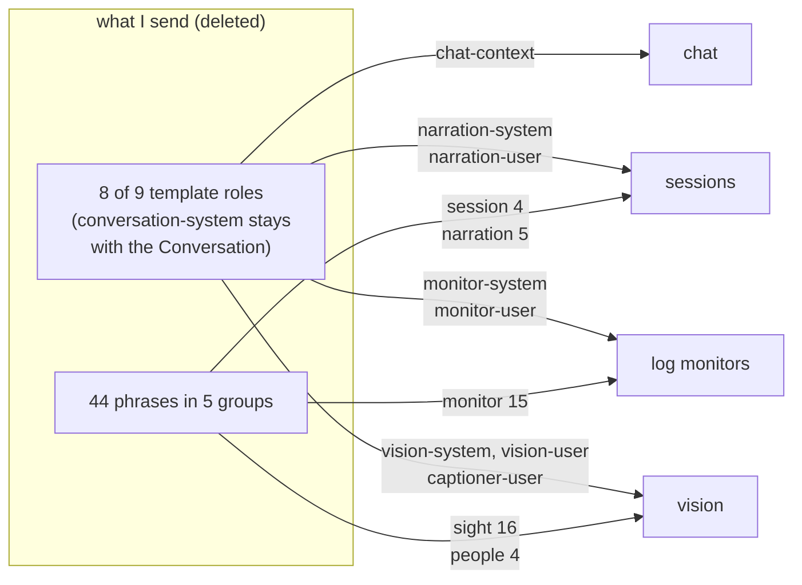

# refactor: group prompts by subject and retire the "what I send" category

## Summary

The settings drawer keeps every model-facing wording in one catch-all category called *what I send*: 8 template editors and 44 phrase editors, none of which belong to each other. Each one already names the section that owns it. This plan moves all 52 into `chat`, `sessions`, `log monitors` and `vision`, hangs each envelope template under the prompt it wraps, and deletes the category.

The move is not a flattening. Five of the six settings-level prompts are rendered *into a slot inside* the template being moved next to them, and the UI must show that nesting rather than presenting two peer prompts.

---

## Problem Frame

`what I send` was a deliberate trade, recorded when the templates shipped:

> "The doubled editor count needs its own home. Templates go in a dedicated section per role rather than inline beside the tool, since each role now has two editors carrying five controls; the existing six prompt fields stay where they are in phase one."
> — `docs/plans/2026-08-09-003-feat-editable-prompt-templates-plan.md`, U8

The volume argument was real. The consequence is that a user configuring vision now edits vision wording in two places, and the drawer's most-used category is named after a sentence fragment. Both halves of that trade are now payable: the volume problem is solvable with progressive disclosure, and the split is the thing users actually trip on.

### Two cheaper alternatives, and why neither is enough

**Rename the category.** `what I send` → `wording`, three lines at `SettingsPanel.tsx:100`, `1341`, `1318`. Zero test risk, zero screenshot churn, no new component. It answers half the ask — the request was that the label "isnt very professional" *and* that the prompts "need to be more organized and grouped with each other properly". A rename leaves vision wording split across two categories, which is the half a name cannot fix. Recorded because it is genuinely the cheaper move if the grouping complaint ever turns out to be the smaller one.

**Disclosure without redistribution.** Apply U1 inside `what I send` — collapse the 44 phrases and 8 templates behind carets where they already live. One unit, no `CategoryId` change, no screenshot navigation change, no reachability guard, and it validates the disclosure control before betting a move on it. Rejected because the volume problem is not the one the user raised: a scannable catch-all is still a catch-all, and co-location with the tool being configured is the load-bearing benefit. It remains the fallback if U1 lands and the disclosure pattern turns out not to work — U1 is deliberately sequenced first and independently useful.

**What this is not.** `AGENTS.md` records that phase two — merging the six prompt settings into their templates — is not started. This plan puts the outer template *next to* the inner prompt and says so in copy. It must not read as having merged them, and it changes no stored setting, no template resolution, and no shipped default text.

---

## Requirements

- **R1.** Every template role and phrase currently under `what I send` renders under exactly one other settings section, chosen by subject.
- **R2.** Where a settings-level prompt is rendered into a slot of a template, that template appears beneath that prompt and is labelled as the wording wrapped around it.
- **R3.** No section becomes unscannable. The prompts and controls a user reaches for stay above the fold; the exact wording is one click away.
- **R4.** The `templates` category disappears from the nav and the `CategoryId` union.
- **R5.** Storage shape, template resolution, shipped defaults, and server behaviour are untouched. Byte-identity guards stay green without re-recording.
- **R6.** The five `scripts/screenshot.mjs` scenes that navigate by the string `"what I send"` keep working against the new layout.
- **R7.** A guard exists proving each template role and phrase id reaches exactly one section — not zero, not two.

---

## Key Technical Decisions

### KTD1. Disclosure is a caret toggle with `{open && body}`, latched open after first use

The repo has three disclosure patterns. `<details>` (`TemplateField.tsx:332`, `PhraseField.tsx:158`) is styled as small print for per-slot rationale — wrong weight for structural grouping, and it keeps its children in the DOM. The caret toggle in `ConversationPrompt.tsx:85-89` and `ConversationContext.tsx:95-134` is the structural one: a `<button aria-expanded>` with a caret and a **live summary in the collapsed header**, plus `{open && <div className="…-body">}`.

Use the caret pattern, for a reason beyond consistency — but a narrower one than it first appears. `ui/test/components/SettingsPanel.test.tsx` contains two index-based queries, `getAllByRole("button", { name: "on" })[1]` at line 120 and `getAllByRole("button", { name: "apply" })[1]` at line 135. Role queries default to `hidden: false` and exclude subtrees hidden from the accessibility tree, so the seven inactive sections are already invisible to them: editors added to `sessions` or `monitors` cannot shift a vision index. Both of those tests click `category("vision")` first, and this plan adds editors to the vision section — that is the real and only exposure. Rendering disclosure bodies only when open keeps them out of the accessible tree in the one section that matters, so both tests pass untouched.

The corollary is a standing constraint worth stating plainly: **no disclosure may default to open.** One that did would put visible buttons into the vision section and move both indices.

`getByRole("list")` at line 234 is *not* at risk — it runs after `category("readiness")`, where `readiness-list` (`SettingsPanel.tsx:1446`) is the only list in the accessible tree. The `<ul>`s inside `TemplateField` and `PhraseField` are both conditional and, in that test, inside hidden sections.

**The latch.** `TemplateField` and `PhraseField` each own their draft (`TemplateField.tsx:144`, `PhraseField.tsx:76`). Unmounting on collapse would discard unapplied text — the exact defect class already fixed once in this component, and guarded at `SettingsPanel.test.tsx:86-98`. So the disclosure renders nothing until first opened, and from then on stays mounted and toggles via `hidden`. Closed-and-never-opened costs nothing; closed-after-opening preserves drafts.

**State does not survive the drawer.** The panel mounts as `{settingsOpen && …}` (`ui/src/App.tsx:91`), so it unmounts on close and every disclosure returns to collapsed. R3's "one click away" is one click *per visit*, not once. Accepted: persisting open ids would mean either a new setting (which agent-native parity would then oblige us to expose on the wire, for a scroll position) or module-level state outliving the component. Neither is worth it for a control whose collapsed header already says what is inside. Recorded here so the next reader sees a decision rather than an oversight.

### KTD2. `chatDefaultPrompt` gets no envelope

Five settings-level prompts nest into a template slot. Each carries its role's *pair* where one exists — the `-user` half is the same envelope's other message, so it belongs in the same disclosure:

| prompt | envelope templates beneath it |
|---|---|
| `narrationPrompt` | `narration-system`, `narration-user` |
| `monitorPrompt` | `monitor-system`, `monitor-user` |
| `visionPrompt` | `vision-system`, `vision-user` |
| `captionPrompt` | `captioner-user` |
| `chatContextPreamble` | `chat-context` |
| `chatDefaultPrompt` | *none — see below* |

(see `ui/src/templatePreview.ts:25,41,48,62,74` and `server/src/narration/narrator.ts:489-502`.)

`chatDefaultPrompt` is the exception. It seeds a Conversation, whose own prompt is the `conversation-system` role — not a slot inside `chat-context` (`shared/src/prompts.ts:1030`). It gets no disclosure beneath it. Attaching one would assert a containment that does not exist.

Because R2 teaches containment by position, an absence reads as a missing control rather than a statement. So `chatDefaultPrompt` gets one line of copy saying why it has none — a conversation carries its own wording — rather than an unexplained gap. U2 specifies it.

### KTD3. Each section moves in one unit; nothing is ever mounted twice

Because sections are all mounted simultaneously, a role rendered in both its old and new home would make React Testing Library queries ambiguous and would defeat the R7 guard. Each per-section unit therefore *moves* its entries — removing them from `TEMPLATE_FIELDS`/the phrase map's rendering in the templates section as it adds them to the new home. The templates section is empty by the end of U5, and U6 deletes an empty shell.

### KTD4. The cheat sheet becomes per-section, with a suffixed testid

`helpOpen` and the `TemplateHelp` render site (`SettingsPanel.tsx:429`, `1409`) already sit outside every section and stay put. Only the trigger moves: one ghost button per section that has an envelope — all four, since chat has `chat-context` — with testid `open-template-help-<section>`.

This is the one deliberate exception to the "do not rename an existing testid" rule in Scope Boundaries. `open-template-help` becomes four buttons; a shared id would break `getByTestId`, which throws on multiple matches. The rule exists because testids are consumed by `scripts/screenshot.mjs` — and U7 rewrites the consuming scene in the same change, which is exactly the condition under which a rename is safe. No other testid is touched.

### KTD5. `onSaveBaseline` / `onRevertToBaseline` travel with the role templates

Those two props are passed only by the templates section (`SettingsPanel.tsx:1366-1383`) and `TemplateBaseline` is keyed by `TemplateRole`, so the six settings-level prompts deliberately do not have them (`docs/plans/2026-08-10-001-feat-prompt-template-standardization-plan.md:404-405`). Redistributing without carrying them would silently drop the saved-baseline machinery. The asymmetry — outer editor has baseline buttons, inner one does not — becomes visible for the first time when they sit together. That is accurate and is left as-is; generalising `TemplateBaseline` is out of scope.

---

## High-Level Technical Design

Where the 52 editors land:



The per-section shape, using vision as the worst case (3 templates, 20 phrases, on top of a section already 520 lines of JSX):

```
vision
  watching / sensitivity / faces / retention      ← unchanged, above the fold

  vision prompt                    [TemplateField]
    ▸ the wording I wrap it in — 2, shipped       ← collapsed; vision-system, vision-user

  caption prompt                   [TemplateField]
    ▸ the wording I wrap it in — 1, shipped       ← collapsed; captioner-user

  ▸ the lines inside them — 20, shipped           ← collapsed; sight (16), people (4)

  syntax cheat sheet                              ← ghost button, opens TemplateHelp
```

Collapsed-header summaries are live, following `ConversationContext.tsx:78-84`, so a user can see something has been customised without expanding. Because the body is not rendered until opened, the summary is the **only** channel by which a contained editor can ask for attention — including `TemplateField`'s `behind` notice (the shipped default changed under a stored template) and its `degraded` notice (a stored template names a slot the release withdrew). A vocabulary that reports only shipped-vs-edited would bury both behind a click the user has no reason to make.

Summary precedence, worst state wins: `"2, 1 needs attention"` when any contained template is behind or degraded; else `"2, 1 edited"` when any differs from shipped; else `"2, shipped"`.

---

## Implementation Units

### U1. Extract the settings disclosure control

**Goal:** One reusable caret-toggle disclosure, used eight times across four sections — chat 1, sessions 2, monitors 2, vision 3.

**Requirements:** R3

**Dependencies:** none

**Files:**
- `ui/src/components/SettingsDisclosure.tsx` (new)
- `ui/src/styles.css` (new `.settings-disclosure*` rules)
- `ui/test/components/SettingsDisclosure.test.tsx` (new)

**Approach:** Props: `label`, `summary` (string, shown beside the label while collapsed), `testId`, `children`. Internal `open` state plus an `opened` latch; render `null` until first open, then keep children mounted and drive visibility with `hidden` on the body wrapper. `<button className="settings-disclosure-toggle" aria-expanded={open}>` with a `▸`/`▾` caret span, mirroring `ConversationPrompt.tsx:85-89`. Toggle testid `disclosure-<testId>`, body testid `disclosure-body-<testId>`; U7's screenshot scenes depend on this convention, so fix it here rather than choosing it ad hoc in U2-U5.

**The `hidden` trap — read before writing the CSS.** The pattern being mirrored, `.convo-prompt-body`, sets `display: flex` (`styles.css:697`). A `display` declaration beats the UA `[hidden] { display: none }` rule. This stylesheet already documents the trap at `styles.css:1870-1876`, where `.settings-group[hidden] { display: none }` exists precisely because the flex rule above it won. If `.settings-disclosure-body` carries any `display` value without its own `[hidden]` override, every disclosure collapses once and then never collapses again — and **no test catches it**: vitest runs jsdom with no stylesheet loaded, so the `toBeVisible()` scenario below passes on the UA rule alone while the shipped UI is broken. Ship `.settings-disclosure-body[hidden] { display: none; }` alongside the body rule.

Do **not** put the label alone in the accessible name where it could collide with a nav category name — `SettingsPanel.test.tsx:13` and `Connections.test.tsx:262` query `getByRole("button", { name })` document-wide, and a button named `vision` would make those ambiguous. The summary text is part of the accessible name, which keeps them distinct; U6 also scopes those helpers.

**Patterns to follow:** `ui/src/components/ConversationPrompt.tsx:85-89` for markup and caret; `ui/src/components/ConversationContext.tsx:78-84` for computing a useful collapsed summary; `ui/src/styles.css:670-698` for the toggle/body styling to mirror.

**Test scenarios:**
- Renders no children before first open — `queryByTestId` of a child testid returns null, and `getAllByRole("button")` inside the disclosure has length 1.
- Clicking the toggle reveals children; `aria-expanded` flips `false` → `true`; caret text changes.
- Clicking twice leaves children **mounted but not visible**: the child element is still in the document and `toBeVisible()` is false. This is the draft-preservation contract — a `queryByTestId(...)` returning null here is a failure.
- Typing into a child input, collapsing, and re-expanding shows the typed value still present.
- The collapsed header renders the `summary` string beside the label.

**Verification:** The new test file passes and no existing test's query indices shift, because nothing renders it yet. Because jsdom cannot distinguish a working `hidden` body from one a `display` declaration keeps visible, land a throwaway instance in any section and confirm collapse-after-open in a browser before moving on. Do not defer this to U7 — five units of work would sit on top of it.

---

### U2. Move the chat envelope and repair the dangling cross-reference

**Goal:** `chat-context` sits beneath `chatContextPreamble`; the chat section stops pointing at a category that is about to vanish.

**Requirements:** R1, R2, R4

**Dependencies:** U1

**Files:**
- `ui/src/components/SettingsPanel.tsx` (chat section ~1270-1338; templates section ~1340-1407)
- `ui/test/components/SettingsPanel.test.tsx`

**Approach:** Render a `SettingsDisclosure` directly after the `chatContextPreamble` `TemplateField`, containing the `chat-context` `TemplateField` with its `onSaveBaseline`/`onRevertToBaseline` handlers carried over verbatim (KTD5). Remove `chat-context` from `TEMPLATE_FIELDS` consumption in the templates section (KTD3). Chat receives no phrases.

Chat also gets an `open-template-help-chat` ghost button at the section foot, same as the other three sections (KTD4) — it has an envelope, so it needs the cheat sheet.

No disclosure under `chatDefaultPrompt` (KTD2), but a one-line `small` note beneath it saying why: a conversation carries its own wording, and that wording is the conversation's prompt rather than anything set here. Without it the absence reads as a control that failed to render.

Chat's disclosure holds a single editor, unlike the seven others which hold two or more. Keep the disclosure anyway: the collapsed summary is what tells a user the envelope exists at all, and a section that alone omits the affordance teaches that chat has no envelope. Uniformity is the point when the pattern is what carries the meaning.

Rewrite the prose at `SettingsPanel.tsx:1318`. It currently reads *"the wording around them and where each one goes is yours, under **what I send**."* It must now point at the disclosure immediately above it, and must not imply the preamble and the template have merged (AGENTS.md phase-two constraint). Keep the lowercase first-person voice and stay consistent with `CONCEPTS.md:450-463` on what a Template versus a Phrase does.

**Patterns to follow:** the existing `TemplateField` call sites at `SettingsPanel.tsx:1272-1311` for prop shape; `SettingsPanel.tsx:1364-1383` for the baseline handler closures being moved.

**Test scenarios:**
- The chat section's first `textarea` is still `chatDefaultPrompt`'s — pins the ordering that `SettingsPanel.test.tsx:86-98` depends on.
- `template-chat-context` is absent from the document until the disclosure under `chatContextPreamble` is expanded, then present.
- Expanding it and clicking `apply` sends `update-settings` with `templates: { "chat-context": … }` — the same patch shape the templates section sent.
- No element in the chat section contains the text `what I send`.
- `chatDefaultPrompt` has no disclosure beneath it (assert the chat section contains exactly one `settings-disclosure-toggle`) but does carry the explanatory note.
- `open-template-help-chat` is present and renders `template-help` when clicked.

**Verification:** Chat section renders with one collapsed disclosure; the `context-shape` fieldset copy reads coherently without the removed category.

---

### U3. Move the session narration envelope and phrases

**Goal:** `narration-system` and `narration-user` hang under `narrationPrompt`; the `narration` and `session` phrase groups land in the sessions section.

**Requirements:** R1, R2, R3

**Dependencies:** U1

**Files:**
- `ui/src/components/SettingsPanel.tsx` (sessions section ~647-717)
- `ui/test/components/SettingsPanel.test.tsx`

**Approach:** A `SettingsDisclosure` beneath the `narrationPrompt` `TemplateField` (which keeps its `extraActions` preset strip at lines 707-715 untouched) holding both narration role templates. A second disclosure at the section foot, *the lines inside them*, holding the `narration` group (5) and `session` group (4) under their existing `<h5>` subheadings so `.phrase-group h5` styling survives. One `open-template-help-sessions` ghost button at the section foot.

This is the first section to move, so it fixes two shapes the rest follow. **Where the mapping lives:** each section's JSX names its own roles and phrase groups as literals — `PHRASE_GROUPS` stops being consumed by a single `.map` and no central section-assignment table is introduced. U7's expectation is then an independent second opinion rather than a mirror (see U7). **Where the summary comes from:** a small pure helper takes the contained templates' resolved states and returns the collapsed-header string per KTD1's precedence, so `SettingsDisclosure` stays dumb and takes `summary` as a plain prop.

Note `narrationPrompt` is a preset-seeded field with an unsaved-changes confirm (`seedNarration`, lines 498-512). Nothing about that changes; the disclosure sits after it.

**Test scenarios:**
- `template-narration-system` and `template-narration-user` are absent until the envelope disclosure is expanded.
- The narration preset buttons still sit with `narrationPrompt`, above the disclosure, and clicking one still fires the confirm path.
- Expanding the phrase disclosure reveals exactly 9 `phrase-*` editors, and both `phrase-group-narration` and `phrase-group-session` are present.
- Editing a narration phrase and applying sends `update-settings` with `phrases: { <id>: … }`.
- Clicking `open-template-help-sessions` renders `template-help`.

**Verification:** Sessions section collapsed height is close to today's; expanding both disclosures shows 2 templates and 9 phrases.

---

### U4. Move the monitor envelope and phrases

**Goal:** `monitor-system`/`monitor-user` under `monitorPrompt`; the 15-entry `monitor` phrase group in the section.

**Requirements:** R1, R2, R3

**Dependencies:** U1

**Files:**
- `ui/src/components/SettingsPanel.tsx` (monitors section ~719-744)
- `ui/test/components/SettingsPanel.test.tsx`

**Approach:** Same shape as U3. This is the section that grows most in proportion — 26 lines today — but `MonitorsPanel` (line 726) must keep rendering exactly where it does. Do not reorder around it and do not wrap it: it is the component the all-mounted architecture exists to protect, and `SettingsPanel.test.tsx:59-70` asserts it issues its list requests exactly once across six category switches.

**Test scenarios:**
- `list-monitors` and `list-monitor-suggestions` are each still sent exactly once across a six-category navigation — the unchanged existing test must stay green.
- Expanding the phrase disclosure reveals 15 `phrase-*` editors under `phrase-group-monitor`.
- `template-monitor-system` / `template-monitor-user` appear only after the envelope disclosure is expanded.
- Expanding the envelope, editing `monitor-user`, and applying sends the same `templates` patch shape as before.

**Verification:** `MonitorsPanel` renders in place; monitor request counts unchanged.

---

### U5. Move the vision envelopes and phrases

**Goal:** `vision-system`/`vision-user` under `visionPrompt`, `captioner-user` under `captionPrompt`, and the `sight` (16) + `people` (4) phrase groups in the vision section. The templates section is empty after this unit.

**Requirements:** R1, R2, R3

**Dependencies:** U1

**Files:**
- `ui/src/components/SettingsPanel.tsx` (vision section ~749-1268)
- `ui/test/components/SettingsPanel.test.tsx`

**Approach:** The heaviest move — 3 templates and 20 phrases into a section already 520 lines. Two envelope disclosures (one per prompt, per KTD2's mapping), one phrase disclosure holding both groups, one `open-template-help-vision` button.

The vision section holds the largest existing fieldset (`recognition-settings`, lines 824-1153), and this is the **one** section where the index-sensitive tests bite: `getAllByRole("button", { name: "on" })[1]` at `SettingsPanel.test.tsx:120` and `getAllByRole("button", { name: "apply" })[1]` at line 135 both click `category("vision")` first, and role queries see only the active section. Because disclosure bodies do not render until opened (KTD1), those indices are unaffected. Do not "helpfully" default any disclosure to open; that would break both tests, and it is the reason KTD1 states the no-default-open constraint.

No new scroll container. The section stays inside `.settings-content`'s existing scroller, whose `min-height: 0` chain is load-bearing (`docs/solutions/flexbox-min-height-scroll-trap.md`).

**Test scenarios:**
- `getAllByRole("button", { name: "apply" })[1]` still resolves to the recogniser endpoint's apply button — pins that collapsed disclosures contribute nothing to the accessible tree.
- The same holds after a disclosure has been opened and re-collapsed within the test: the latched body is `hidden`, so it stays out of role queries. This is the case a future implementer is most likely to break.
- Expanding the `visionPrompt` envelope reveals `template-vision-system` and `template-vision-user`; expanding the `captionPrompt` envelope reveals `template-captioner-user` and nothing else.
- Expanding the phrase disclosure reveals 20 editors across `phrase-group-sight` and `phrase-group-people`.
- Applying an edited `captioner-user` template sends `templates: { "captioner-user": … }` — not a `vision:` patch. The captioner *prompt* is vision-scoped storage; the captioner *template* is not, and this is where they could be confused.
- Saving a baseline on `vision-system` sends both `templates` and `templateBaselines` in one patch (KTD5 regression guard).

**Verification:** All three vision disclosures collapsed by default; section scrolls within the existing container at 1280px and at the narrow breakpoint (`styles.css:1272-1317`).

---

### U6. Retire the templates category, its nav entry, and its orphaned styles

**Goal:** The category is gone from the union, the nav, the DOM, and the stylesheet.

**Requirements:** R4, R5

**Dependencies:** U2, U3, U4, U5

**Files:**
- `ui/src/components/SettingsPanel.tsx`
- `ui/src/styles.css`
- `ui/test/components/SettingsPanel.test.tsx`
- `ui/test/components/Connections.test.tsx`

**Approach:** Delete the `templates` member of `CategoryId` (line 60), the nav entry (line 100), and the now-empty `group-templates` section (~1340-1407). `TEMPLATE_FIELDS` (69-82) has been consumed piecewise by U2-U5 — decide whether it survives as a shared table the sections index into, or dissolves into per-section literals. Prefer keeping it as a table so a future role addition has one obvious place to land, and **relocate the rationale comment at lines 64-68 rather than deleting it**: it records why templates were separated, and the answer is now "they no longer are, because disclosure solved the volume problem". The house convention is that non-obvious decisions carry their history.

Keep `helpOpen` (429) and the `TemplateHelp` render at 1409 — they are already outside every section (KTD4).

CSS: `.templates-intro` becomes fully orphaned and is **defined twice** (`styles.css:2472-2477` and `2499-2513`, the second silently overriding the first for both usages) — delete both blocks. `.phrases-head` (2515-2522) is orphaned unless the divider is reproduced; delete it if the disclosure header replaces it. `.phrase-group h5` (2524-2531) survives if U3-U5 keep the group `<h5>` subheadings, which they do.

Test scoping, per the learnings on all-mounted ambiguity: change the category helper at `SettingsPanel.test.tsx:13` from `screen.getByRole` to `within(screen.getByTestId("settings-nav")).getByRole`, and do the same for the unscoped nav click at `Connections.test.tsx:262`. This mirrors what `scripts/screenshot.mjs:266-270` already does and already documents.

**Test scenarios:**
- The nav lists exactly seven categories; `what I send` is absent (the existing list assertion at `SettingsPanel.test.tsx:18` already omits it — confirm it still passes rather than assuming).
- `queryByTestId("group-templates")` returns null.
- Navigating to every remaining category still shows its group and hides the others; `aria-current` tracks.
- The monitors request-count test still passes.
- Repo-wide: no source file outside `docs/` contains the string `what I send`.

**Verification:** `npm test` and `npm run typecheck` both clean. Grep confirms no orphaned class or dangling label.

---

### U7. Reachability guard and screenshot scenes

**Goal:** Prove nothing was dropped or duplicated in the move, and restore visual verification.

**Requirements:** R1, R6, R7

**Dependencies:** U6

**Files:**
- `ui/test/components/SettingsPanel.test.tsx` (new reachability test)
- `scripts/screenshot.mjs`

**Approach:** A catalogue test, per `docs/solutions/assert-the-effect-not-the-existence.md` and `docs/solutions/extending-a-catalogue-is-not-auditing-it.md`. A 52-entry move has 52 chances to land an editor nowhere or twice, and a test asserting only "every phrase has a label" stays green through both failures.

**`TEMPLATE_ROLES` has nine members, not eight.** `conversation-system` (`shared/src/templates.ts:232`) is a Conversation's own prompt, edited in `ConversationPrompt.tsx`; it has never had a settings editor and is absent from `TEMPLATE_FIELDS`. A guard that enumerates the catalogue and demands each role render once goes red on first run. Resolve it by **partition, not exemption** — the distinction `docs/solutions/a-completeness-guard-is-only-as-honest-as-its-exemptions.md` is about. Assert that every member of `TEMPLATE_ROLES` is either in the drawer's role→section table (and renders exactly once, under the expected group) or in a single named `NOT_A_SETTING` constant co-located with `TEMPLATE_FIELDS`, and that the two sets are disjoint and cover the catalogue. A tenth role added tomorrow must then be classified rather than silently skipped. Settings-rendered: 8. Catalogue: 9.

**The expectation is a second opinion, deliberately.** The guard's role→section and phrase-group→section mapping is written in the test, derived from R1's subject rule — not imported from the component. A guard that reads the same table the renderer reads proves only that the component agrees with itself.

**Traversal.** "Expand everything" is not one sweep: role queries exclude hidden sections, so seven of the eight toggles are invisible at any moment. For each of the four sections, click its nav button, then expand each toggle found by `within(screen.getByTestId("group-<id>")).getAllByRole("button", { expanded: false })` — a role query, so the guard proves the toggles are reachable the way a user reaches them. Clicking a hidden toggle by testid would assert reachability of a control no user could click, which is the failure this test exists to prevent.

`scripts/screenshot.mjs` — five scenes navigate by `category(page, "what I send")` and must be rewritten to their new homes:

| line | scene | new navigation |
|---|---|---|
| 72-75 | `grouped-slots` | `chat` → expand the `chatContextPreamble` envelope → `template-chat-context` slots |
| 190-197 | `settings-templates` | rename to reflect a section; navigate to `vision`, expand both envelopes |
| 219-227 | `settings-help` | `vision` → `open-template-help-vision` → wait for `template-help` |
| 228-236 | `settings-phrases` | `vision` → expand the phrase disclosure → scroll `phrase-group-sight` into view |
| 237-249 | `settings-templates-working` | `monitors` → expand envelope → `template-monitor-user` |

The `converted-prompt` scene at lines 58-62 already navigates to `sessions` and drives `template-narrationPrompt` — use it as the model for how a redistributed scene should read.

**Test scenarios:**
- Every entry in `TEMPLATE_ROLES` is either rendered exactly once under its expected `settings-group` testid, or listed in `NOT_A_SETTING`. The two sets are disjoint and their union is the catalogue.
- `NOT_A_SETTING` contains exactly `conversation-system` — pinned, so removing the partition's only member does not quietly make the assertion vacuous.
- Every entry in `PHRASES` renders exactly once, under its expected `settings-group` testid.
- Every section's disclosure toggles are reachable by role from within that section after navigating to it — the traversal itself is an assertion, not just setup.
- The test fails if an id is removed from a section without being added elsewhere — verify by temporarily deleting one role's render and watching it go red before committing. A guard nobody has watched fail is not yet a guard.
- Totals: 8 rendered roles + 1 classified, and 44 phrases, so an id added to the catalogue with no home fails too.

**Verification:** `node scripts/screenshot.mjs settings --width 1280` plus all five rewritten scenes under their final names produce readable PNGs — **then read them**. `docs/plans/2026-08-10-001-…-plan.md:416-418` records that two defects shipped past a green suite here and were visible in a minute of looking at the running app. Boot the server (`npm run start` does not auto-reload — rebuild the UI first, per `docs/solutions/rebuilding-assets-under-a-running-server-is-a-version-skew.md`) and open the drawer.

---

## Scope Boundaries

**In scope:** the settings drawer's structure, the disclosure control, the stylesheet rules those touch, the affected tests, and the screenshot scenes.

**Not in scope:**
- **Phase two.** Merging the six settings-level prompts into their templates stays unstarted. This plan makes the nesting *visible*; it does not perform it.

  **What survives phase two, and what does not.** Durable: the four per-section homes, the phrase disclosures, the per-section cheat sheets, the `SettingsDisclosure` control, the U7 guard. Removed by phase two: the five envelope disclosures (their outer prompt ceases to exist), KTD2's `chatDefaultPrompt` exception, and KTD5's baseline asymmetry. So roughly a third of this work is scaffolding for a two-editor world that phase two collapses. Doing it first is still right: the four homes are the layout phase two needs anyway, and phase two is a storage migration with an undecided destructiveness question (`docs/plans/2026-08-09-003-…-plan.md:601-605`) that should not be gated on a drawer reorganisation. If phase two is scheduled within a release, reconsider — the two efforts share their whole surface.
- **Generalising `TemplateBaseline` beyond `TemplateRole`** so the six legacy prompts gain baseline buttons. The asymmetry becomes more visible after this change but is pre-existing and correct.
- **Renaming any template role id, phrase id, or existing `data-testid`.** Role renames have no migration — `mergeTemplates` iterates the current `TEMPLATE_ROLES` and would orphan stored templates under the old key. Testids are consumed by the screenshot script.
- **Any change to shipped default template or phrase text.** Byte identity is pinned by `server/test/templates/oracle.test.ts` and the context-golden tests; those are not to be re-recorded.

### Deferred to follow-up work

- Splitting `ui/src/styles.css` (2713 lines) or `SettingsPanel.tsx` (1473 lines) into per-section files. Both are tempting while in here and both are separate changes; a partial split is worse than either whole.
- Fixing the duplicate `.templates-intro` definition as a general audit of the stylesheet for other silently-overridden blocks. This plan deletes that one because it is orphaned, not because it is being fixed.
- A `/ce-compound` entry once this lands. "Redistributing a settings category" is an unrecorded shape, and the screenshot-script coupling is the kind of trap the next person would otherwise rediscover.

---

## Risks

**A green suite proves almost nothing here.** No existing vitest test asserts on `group-templates`, `phrase-group-*`, `open-template-help`, or the label `what I send`. The category could be deleted outright and the suite would stay green while five screenshot scenes broke silently. U7 exists specifically to close this, and the screenshot rewrite belongs in the same change as the move, not after it.

**Index-based tests are load-bearing in an unobvious way.** Two assertions in `SettingsPanel.test.tsx` (lines 120 and 135) depend on button position within whichever section is active when they run — vision, for both. KTD1's render-nothing-until-opened choice is what keeps them valid. Anyone who later defaults a disclosure to open, or swaps the caret pattern for `<details>` (which keeps children in the accessible tree), breaks tests in the vision roster that have no visible connection to this work. The disclosure component's own test asserts the not-rendered-before-first-open contract so the reason is discoverable. The cheaper permanent fix — scoping those two queries with `within(getByTestId("group-vision"))` — is worth doing in U5 if it is free; it removes the constraint rather than documenting it.

**Draft loss on collapse.** Straightforward `{open && children}` without the latch would discard unapplied editor text — a defect this component has had before. Guarded by a U1 scenario that types, collapses, re-expands, and checks the value survives.

**Copy that overstates the merge.** Disclosure headers say the prompt is *placed inside* these templates. Wording that implies they are now one setting contradicts `AGENTS.md` and would misinform anyone deciding whether phase two has happened.

---

## Open Questions

- **Is there still a way to answer "what have I customised?"** The old category was, whatever else, a single index over every model-facing string. After the move a user auditing their edits opens four sections and eight disclosures. The collapsed summaries make each one answerable at a glance, which is a real improvement locally and a regression globally. Deliberately unaddressed here: a rollup (say, an edit count on the nav item) is a separate feature with its own design, and inventing one inside a reorganisation is how reorganisations stop landing. Flagged so it is a known trade rather than a discovered one.
- **U6:** `TEMPLATE_FIELDS` — U3 settles the *rendering* side (per-section literals, no central assignment table). What is still open is whether the label/note text stays in one table the sections index into, or moves inline. Decide during U6, once U2-U5 have shown how much per-section wording each entry needs.
- **U7:** whether `settings-templates` remains a meaningful scene name once there is no templates category, or whether it splits into `settings-vision-wording` and similar. Naming call at implementation time; U7's rewrite table assumes it is renamed.

---

## Sources

- `docs/plans/2026-08-09-003-feat-editable-prompt-templates-plan.md` — U8, the original rationale for a separate category and the phase-one/phase-two boundary
- `docs/plans/2026-08-10-001-feat-prompt-template-standardization-plan.md` — U5, why the six legacy prompts became `TemplateField`s and why they lack baselines
- `docs/solutions/assert-the-effect-not-the-existence.md` — a catalogue of controls needs a reachability test
- `docs/solutions/extending-a-catalogue-is-not-auditing-it.md` — audit the domain, not the catalogue
- `docs/solutions/flexbox-min-height-scroll-trap.md` — the `min-height: 0` chain under `.settings-body`
- `docs/solutions/css-tracks-with-two-sources-of-truth.md` — jsdom does no layout; presence assertions are blind to it
- `docs/solutions/rebuilding-assets-under-a-running-server-is-a-version-skew.md` — verifying against a stale bundle proves nothing
- `AGENTS.md:27-28, 58-126` — screenshot verification for visual work; byte identity; phase two not started
- `CONCEPTS.md:418-463` — Template and Phrase definitions the drawer copy must stay consistent with
