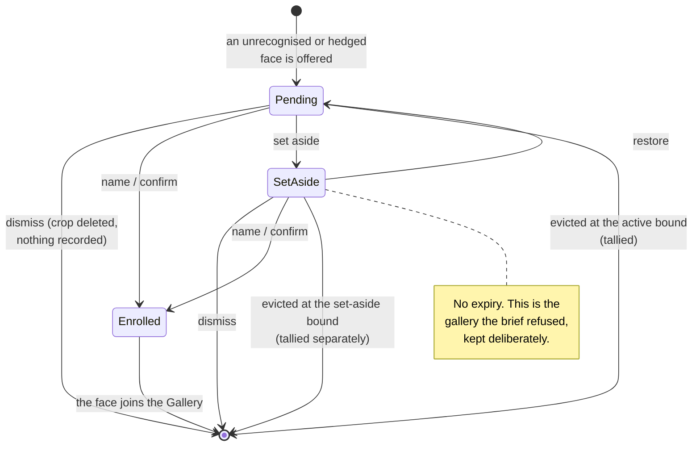
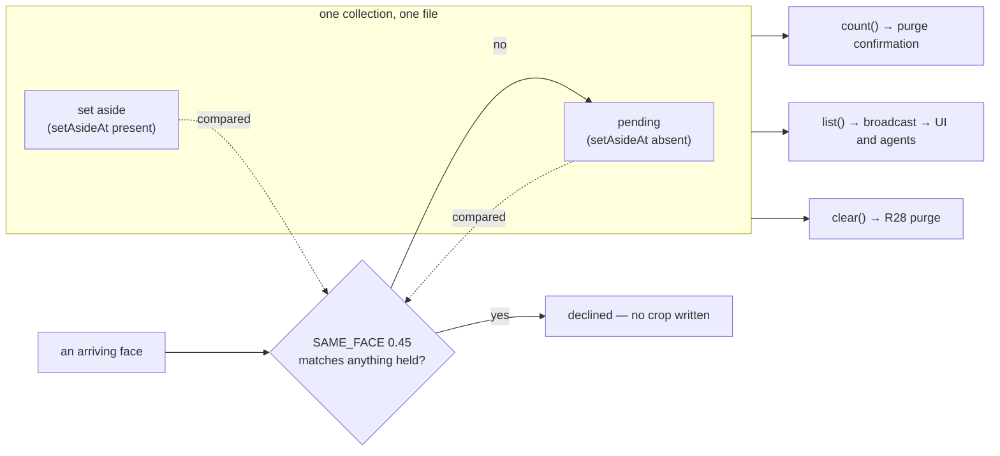

# feat: set a face aside

## Summary

A Candidate can be named or dismissed. Both end it. There is no way to say *not now*, so a face you
are unsure about sits in the triage queue looking like work you have not done, and the only way to
clear it is to make a decision you are not ready to make.

This adds a third outcome: **set aside**. The face leaves the active queue, keeps its crop and
embedding, and waits in a separate bounded pool until you name or dismiss it. It never expires.

Two costs, both stated plainly below rather than buried.

**The retention cost.** These are faces of people who did not consent to being held. The brief rested
its privacy position on them leaving on their own; they now stay until you act. That was offered as a
choice against a bounded-clock alternative and chosen deliberately.

**The cost the first draft missed.** A face on the shelf stays in the duplicate check forever, so a
genuinely new visitor who merely *resembles* anything you set aside is never queued, never mentioned,
and — before this revision — never counted. The queue is the only way a stranger is ever surfaced, so
that is a person the machine saw and never told you about. The dedupe threshold was priced for a
20-item queue that empties, not a 200-item shelf that does not.

---

## Problem Frame

The brief (`docs/brainstorms/2026-08-07-vision-face-recognition-requirements.md`) built the queue
around one property: an item leaves quickly, so neglect empties it.

> a pending item expires on its own, so neglect empties the queue rather than turning it into the
> gallery of unnamed people this brief refuses to build

**R14 — the expiry that guarantees that — was specified and never built.** It is an accepted residual
(`docs/residual-review-findings/feat-enrolment-candidates.md`): *"what it cannot do is empty itself if
the user never looks."*

So the gallery already exists, accidentally and undocumented. This change does not create it. It
makes it **explicit, bounded, visible, and deliberate** — and says so in the four places that
currently claim the opposite.

**What this is not.** It is not R14. Expiry stays unbuilt and is now owed against two pools rather
than one. The user was offered expiry and chose indefinite retention.

---

## Requirements

- **R1.** A Candidate can be set aside from the active queue, from both kinds — unrecognised (`name`,
  `dismiss`) and uncertain (`yes, <name>`, `someone else`, `dismiss`).
- **R2.** A set-aside Candidate can still be named or dismissed, and can be returned to the active
  queue.
- **R3.** Set-aside Candidates do not appear in the active queue and do not count toward its bound.
- **R4.** The set-aside pool has its own bound, its own eviction, and **its own tally** — "N faces you
  set aside were dropped" is a different sentence from "N strangers you never looked at were dropped".
- **R5.** The set-aside bound is **stated to the user**, not merely counted after it bites (brief R21).
- **R6.** A face already set aside does not re-enter the active queue when that person returns.
- **R7.** The R28 biometric purge reaches set-aside faces, and its confirmation counts them.
- **R8.** Every set-aside operation is reachable over the WebSocket (brief R32).
- **R9.** The four places claiming HAL keeps no gallery of unrecognised people are rewritten to
  describe what HAL now does, with the trade recorded as an accepted residual.
- **R10.** A face HAL declines to queue because it resembles something already set aside leaves a
  trace. The queue is the only discovery path for a stranger (brief R22); a silent decline removes a
  person from it entirely.

---

## Alternatives Considered

The first draft weighed one array against two — a *how* question inside a *what* already assumed. The
cheaper shapes were never named. They are named here because at least one of them satisfies the stated
need for a fraction of the cost, and the difference between them is a product decision, not a
technical one.

**A. A UI-only marker.** A client-side "later" flag collapses the card and sorts it to the bottom.
Retention, bounds, eviction and the protocol are untouched. Cost is roughly U3 alone — no stored
shape, no wire change, no doc rewrite, no privacy inversion.
*Fails:* the marker dies with the browser tab, and a deferred face still competes for the active
bound, so setting eight faces aside can evict a ninth the user has not seen. It answers "stop looking
cluttered" and not "keep this while I think".

**B. Eviction-exempt, one pool, one bound.** A flag that makes the eviction scan skip a face. One
collection, one bound, one tally, one setting, and the deferred face is protected.
*Fails:* with 20 slots and no expiry, exempting faces shrinks the working queue until it cannot hold
new arrivals — eight exemptions leave twelve slots, and the twelfth exemption leaves none. The bound
would have to grow, at which point this is the chosen design with worse accounting.

**C. Set-aside with its own, longer clock.** Everything below, plus expiry measured in weeks. This is
R14 built where it was always specified, and it preserves the property the brief rested on: neglect
empties the store.
*Fails only on the user's decision.* This was offered explicitly, alongside indefinite retention and a
shared-bound variant, and indefinite retention was chosen. It is recorded here because it is the
option a future reader will ask about, and because it remains the cheapest route back if the pool
turns out to accumulate rather than drain.

**D. What this plan does.** A second bounded pool with no expiry. The most expensive option, and the
only one that satisfies "keep this indefinitely while I decide" without touching the active bound.

---

## Key Technical Decisions

### KTD1. A flag on one collection, not a second list

`StoredCandidate` gains an optional `setAsideAt?: string`. Absent means "in the active queue" — the
same absent-means-the-original-kind convention `suspected?` already uses in this file.

**Zero migration.** `load()` validates only that `candidates` is an array; an absent field reads as
undefined. Old files, in-flight writes and `clear()` all keep working.

A second array was the alternative and is worse in three specific ways, each verified:

1. **The corruption guard covers one key.** `candidates.ts` checks only `candidates` is an array; a
   damaged second key would pass the guard and throw later, deeper.
2. **`count()` feeds the purge confirmation.** A second list not summed in makes R28's stated figure
   understate what it destroys — the one number the brief requires to be true.
3. **It breaks the dedupe, which breaks the feature.** See KTD2.

`docs/solutions/splitting-a-singleton-leaves-every-lookup-keyed-to-the-old-one.md` records this exact
shape costing three subsystems: every `list`, `count`, `offer`, `overflow` and purge path is currently
correct *only because there is one bucket*.

### KTD2. The dedupe spans both pools, and that is the point

`SAME_FACE = 0.45` compares an arriving face against `state.candidates` and declines if it matches.
With a flag, set-aside faces stay in that comparison **for free** — which is exactly R6.

Get this wrong and the feature does nothing. The service keys its in-flight set by *appearance id*,
so a returning person is a new appearance every visit. If set-aside faces left the compared set, a
face you deliberately deferred would be re-queued on every visit, forever, with no expiry to end it —
the user would be doing the same triage repeatedly on someone they had already handled.

The existing comment on `SAME_FACE` does not cover this case because the case did not exist. It must
be extended to say what a match against a set-aside face does, per
`docs/solutions/a-safeguard-that-worked-by-accident-breaks-when-a-case-is-added.md`.

**And this is where the threshold stops being priced correctly.** `SAME_FACE = 0.45` carries its own
justification in the file:

> Deliberately looser than the identity threshold: over-merging costs one queue item, while
> under-merging costs the flood.

That trade was priced against ~20 items that leave quickly. Against 200 items that never leave, the
cost of over-merging changes completely: a genuinely new visitor who scores ≥0.45 against **any** face
in a permanent pool is declined by `offerUnlocked`, which writes no crop, creates no queue item, and
increments no tally. Brief R22 withholds strangers from the feed precisely because the queue is the
discovery path — so that person is never queued, never fed, and never counted. Nothing anywhere says
they were here.

The probability rises with pool size and never decays. This is a real regression in the discovery
guarantee, caused by the feature rather than by the bound, and it is the one finding that could change
whether the feature is worth building as specified.

**The plan's answer, in two parts.** First, follow the repo's own mitigation pattern and *count what
was discarded*: a decline against a set-aside face increments its own tally, so a suppressed stranger
leaves a trace the same way an evicted one does. Second, treat the shared threshold as unfinished —
comparing arrivals against a permanent pool likely wants a tighter number than comparing them against
a transient queue, but nobody has measured what that number should be, and guessing it is how the
recognition thresholds went wrong before. See Open Questions.

**R6 has a cost the requirement does not state.** A face is often set aside *because* the crop is
poor — too small, badly lit, ambiguous. R6 then blocks any better capture of that person from ever
being offered. The deferred face is frozen at the quality that made it undecidable, and the only way
to get a better one is to dismiss the crop you kept and hope.

The fix is cheap and belongs in U1: when an arriving face matches a set-aside face, keep the item and
its marker but **replace the stored crop and embedding with the better capture** where `sourceWidth`
is larger. Deferral then improves the evidence instead of freezing it.

### KTD3. Two pools, two bounds, two tallies

The set-aside pool gets its own setting (default 200) alongside `candidateFaces` (default 20), and its
own `CandidateOverflow`-shaped counter.

Reuse the *shape*, not the instance. The existing overflow copy reads *"Raise the limit in settings to
keep more"* and points at the active bound. One counter serving both pools would tell a user that
faces they deliberately kept were dropped, in wording about a limit that is not the one that bit.

Moving an item between pools is two-pool accounting: it frees an active slot and consumes a set-aside
slot, and a full set-aside pool must evict-and-tally rather than silently fail or double-count. See
`docs/solutions/resolve-and-charge-are-two-steps-when-the-caller-may-discard.md`.

**The store is settings-free, so both bounds arrive as arguments.** `CandidateStore` is constructed
with a `dataDir` and nothing else; every cap reaches it as a parameter, which is why lowering
`candidateFaces` prunes on the next arrival rather than needing a settings listener. The new methods
follow that convention — `setAside(id, cap)` and `restore(id, cap)` — and the service supplies each
pool's number. A signature without the cap cannot enforce the bound, and a bound enforced only on
entry would let a lowered setting sit there being false, which is exactly what R5 forbids.

**Restore into a full active pool: it refuses, and says so.** The alternative — evict a pending face
to make room — charges the active tally for a drop the *user* caused, and the pane then reads "1 face
dropped before you looked at it. Raise the limit in settings to keep more", which is a lie about a
stranger. Refusing is the only option that keeps the active tally meaning what it says. This makes
`restore` the one new verb that can fail, so unlike `set-aside` it needs a reply the UI can render.

**The set-aside pool evicts by `setAsideAt`, not by `at`.** With a flag rather than a second list, an
item keeps its original array position and its original sighting time. Oldest-by-sighting is the wrong
order for a shelf: a face first seen in June and set aside today would be evicted ahead of one seen
yesterday and set aside a week ago. The tally's `since` must be stamped from `setAsideAt` too, or the
notice describes a period in which nobody set anything aside.

### KTD4. WebcamPane gets its own disclosure, not the settings one

`SettingsDisclosure` is structurally generic but carries three couplings: its CSS lives in the
settings-drawer block with sibling rules keyed to `.template-field`, its testids occupy a global
`disclosure-*` namespace that five screenshot scenes depend on, and its never-default-open invariant
exists to protect index-based assertions in the settings suite.

Borrowing it drags drawer typography into the vision pane and puts a sixth block into a namespace
scoped to the drawer. The set-aside section needs a header with a count and a body — small enough to
write locally with vision-pane classes.

### KTD5. Set-aside is a fourth verb, not a UI state

Per brief R32, `set-aside-candidate` and `restore-candidate` are `ClientMessage`s. The existing
handlers are the pattern: mutate the store, then `broadcastCandidates()`. The client receives the
whole list on every change and on connection greet, so an agent sees the pools exactly as the UI does
— provided the wire shape distinguishes them, which is R1's real requirement and the trap KTD6 covers.

### KTD6. The wire field must have a reader, asserted

`docs/solutions/a-flag-nothing-reads-looks-shipped.md` records `fromVision` shipping on the wire, set
by the server, covered by a test, reviewed by eleven people including a parity specialist — and never
read by the client. Its warning names this exact situation:

> a `?` on a new field is a quiet invitation to never read it. Optional is right for wire
> compatibility and wrong as a reason to skip the consumer.

So the tests that matter here are consumer-side: a set-aside candidate renders in the set-aside
section and not the active one, and the set-aside eviction notice is visible. Asserting the field is
set proves nothing.

---

## High-Level Technical Design

A Candidate's lifecycle gains one state and three transitions. Everything else is unchanged.

Where each pool is read, and by what. The dedupe reaching **both** pools is the load-bearing edge:

---

## Implementation Units

### U1. Two pools in one collection

**Goal:** The store holds set-aside faces, bounds them separately, tallies their eviction separately,
and keeps them in the dedupe comparison.

**Requirements:** R3, R4, R6, R7

**Dependencies:** none

**Files:**
- `server/src/vision/candidates.ts`
- `server/src/vision/service.ts` (the interface change lands at its call sites)
- `shared/src/types.ts` (`StoredCandidate` is server-local; `CandidateOverflow` shape is shared;
  `CandidateFile` gains `setAsideOverflow`)
- `server/src/storage/settings.ts` (the second bound)
- `server/test/vision/candidates.test.ts`
- `server/test/vision/fakes.ts`

**Approach:** Add `setAsideAt?: string` to `StoredCandidate` and `setAsideOverflow: CandidateOverflow`
to `CandidateFile` — the file currently holds exactly one `overflow`, and the two tallies R4 requires
need two homes. Add `setAside(id, cap)` and `restore(id, cap)` to the `CandidateQueue` interface, both
through `withLock` like every other mutation, with the cap as an argument per KTD3.

`offerUnlocked`'s eviction currently scans from the front while over `cap`; it must now evict only
*pending* items against the active cap. A second pass handles the set-aside cap, sorting by
`setAsideAt` rather than array order.

**Two existing methods bypass the lock, and R7 rests on both.** `clear()` assigns `this.cache` and
writes directly, and `count()` reads the cache unguarded. An `offer` holding the lock across a purge
loaded its state before and calls `persist` after, restoring the pre-purge list to cache *and* to
disk — a purge that silently un-purges. Today that resurrects faces seconds old; against a pool
intended to hold faces for years it is a different order of failure. Route both through `withLock` as
part of this unit.

**The crop upgrade.** Per KTD2, a decline against a set-aside face is not a plain no-op: when the
arriving capture has a larger `sourceWidth`, replace the stored crop and embedding in place, keeping
the id, the `setAsideAt` and the queue position. A decline against a *pending* face keeps its current
behaviour.

**The decline tally.** A decline against a set-aside face increments its own counter, so a stranger
suppressed by the dedupe leaves a trace rather than vanishing (KTD2's P0).

`list()` keeps returning everything (the client needs both pools) with the flag carried through.
`count()` must keep counting **records**, not listable items, and now spans both pools — it feeds the
purge confirmation and the comment at its definition already explains why it counts the way it does.

**Patterns to follow:** `suspected?` for an optional field whose absence has a stated meaning; the
existing `withLock`/`persist` discipline; `CandidateOverflow` for the tally shape.

**Execution note:** Write the dedupe-across-pools case first. It is the one that decides whether the
feature works at all, and it is cheap to get backwards.

**Test scenarios:**
- A set-aside face is not evicted when the *active* pool exceeds its cap, and a pending face is.
- A set-aside face **is** evicted when the set-aside pool exceeds its own cap, oldest first, and its
  crop goes with it.
- Eviction from each pool increments **its own** tally; the two counters never cross. Verify by
  filling one pool and asserting the other's `dropped` is still 0.
- An arriving face matching a set-aside face at 10° is declined and leaves no crop — R6, and the case
  the whole feature rests on.
- An arriving face matching nothing at 80° is queued as pending.
- `count()` includes set-aside faces. Pin the number against a mixed store.
- `setAside` on an unknown id is a no-op returning false; `restore` likewise.
- A set-aside face survives a restart with its flag intact.
- `take()` and `dismiss()` work on a set-aside face exactly as on a pending one, and `take()` reports
  which pool the face came from (U2 depends on this).
- Eviction order is by `setAsideAt`, not `at`: two faces set aside in the reverse order of their
  sightings, and the one shelved first goes first. The tally's `since` reads from `setAsideAt`.
- Restoring into a full active pool refuses, returns false, and leaves both tallies at zero — nothing
  the user did is reported as something dropped before they looked.
- Lowering the set-aside bound prunes down to it on the next set-aside, so the stated bound is never
  larger than what the pane shows.
- An arriving face matching a set-aside face with a **larger** `sourceWidth` replaces the stored crop
  and embedding, keeps the id and `setAsideAt`, and does not create a second item.
- An arriving face matching a set-aside face with a smaller `sourceWidth` is declined and leaves the
  stored crop untouched.
- A decline against a set-aside face increments the decline tally; a decline against a pending face
  does not.
- `clear()` removes both pools, all crops, and both tallies.
- Concurrent `setAside` and `dismiss` on the same id: exactly one wins, no orphan crop.
- A purge racing an in-flight `offer` leaves zero records and zero crops — the un-purge the unguarded
  `clear()` allows today.

**Verification:** The store's suite passes against a real temp dir. Revert the pool-aware eviction and
watch the "not evicted by the active bound" case go red before trusting it.

---

### U2. The fourth and fifth verbs

**Goal:** Set aside and restore are reachable over the WebSocket, and the wire distinguishes the pools.

**Requirements:** R1, R2, R8

**Dependencies:** U1

**Files:**
- `shared/src/types.ts`
- `server/src/vision/service.ts`
- `ui/src/store.ts` (it holds one overflow field and must hold both)
- `server/test/vision/service-recognition.test.ts`

**Approach:** Declare `SetAsideCandidateMessage` and `RestoreCandidateMessage` beside
`DismissCandidateMessage`, add both to the `ClientMessage` union, and add `setAside?: string` (the
timestamp) to the broadcast `VisionCandidate`.

**The wire carries one tally and needs three.** `VisionCandidatesMessage` declares a single
`overflow`; the reducer stores it in a single field; `acknowledge-overflow` clears the one counter.
R4's separate tallies and KTD2's decline tally have nowhere to travel until the message and the
reducer carry all three, and `acknowledge-overflow` gains a discriminator for which is being cleared.

**Three existing rollback paths put a taken face back, and none of them knows about pools.** `enrol()`
and both `confirm-candidate` failure branches re-`offer()` a face that `take()` removed, using the
*active* cap. So naming a set-aside face and having enrolment fail returns it as pending, with a new
id and no marker, consuming an active slot, possibly evicting a pending face, and charging that
eviction to the tally the user reads as "dropped before you looked". The put-back must restore the
face to the pool it came from, against that pool's cap — which is why U1's `take()` reports it.

`set-aside` follows `dismiss-candidate`'s shape: mutate, rebroadcast, no reply. `restore` cannot —
per KTD3 it refuses when the active pool is full, so it follows `confirm-candidate`'s shape and
returns a typed result the UI can render.

Two stale doc comments sit in this file and should be corrected while here: the block above
`ConfirmCandidateMessage` describes dismissal, and `EnrolPersonMessage`'s comment still says "this
slice has no triage queue".

**Patterns to follow:** the three existing candidate handlers; the whole-list rebroadcast contract
documented on `VisionCandidatesMessage`.

**Test scenarios:**
- `set-aside-candidate` moves the face and triggers exactly one `vision-candidates` broadcast.
- The broadcast carries the set-aside marker, and pending faces carry no marker.
- The broadcast carries all three tallies, and the reducer stores all three.
- `restore-candidate` returns it to pending and rebroadcasts.
- `restore-candidate` into a full active pool returns a refusal the UI can render, and moves nothing.
- Naming a set-aside face against a failing gallery leaves it **set aside**, not pending, and leaves
  the active tally at zero. This is the rollback path; assert the pool, not just that it came back.
- An unknown id on either message broadcasts nothing and throws nothing.
- A socket connecting after a set-aside receives both pools in its greet.

**Verification:** An agent driving only the WebSocket can set aside, restore, name and dismiss without
touching the UI.

---

### U3. The button, and where the faces go

**Goal:** Both candidate kinds gain a `later` action, and set-aside faces live in their own collapsed
section with their own eviction notice.

**Requirements:** R1, R2, R4, R5

**Dependencies:** U2

**Files:**
- `ui/src/components/WebcamPane.tsx`
- `ui/src/styles.css`
- `ui/test/components/WebcamPane.test.tsx`

**Approach:** Split `queue` into pending and set-aside by the marker. The active row renders pending
only. A collapsed section below it holds the set-aside faces with a count in its header.

**The early return is the trap here.** `TriageQueue` opens with
`if (queue.length === 0 && overflow.dropped === 0) return null`. There are now four inputs, not two —
and the commonest state after actually using this feature is *zero pending, N set aside*. Narrow the
guard to the pending list, which is the natural edit, and setting aside your only candidate makes the
section holding it disappear. The guard must consider both pools and all three tallies. This is KTD6's
failure one level up: the field is read, and the thing reading it is unreachable.

**Both sections render inside one `TriageQueue`.** The component holds one `naming` id, one `name`
draft, one `zoomed`, one `<datalist id="vision-known-people">` and one `<FaceZoom>`. Splitting into
two components duplicates the datalist id — `list="vision-known-people"` then resolves to whichever
renders first, possibly inside a collapsed section — and roster autocomplete quietly stops working in
one of the two places R2 requires naming to work.

`later` joins both action rows. Set-aside cards keep `name` and `dismiss` and gain `restore`, which
can be refused and must render the refusal.

The set-aside eviction notice is its own line with its own wording, and **states the bound** rather
than pointing at a setting (R5, and see Alternatives on why the bound is not configurable). The
decline tally from KTD2 needs its own line too: faces HAL did not queue because they resembled one
already on the shelf.

**Before adding the button:** grep this suite for positional `getAllByRole(...)[n]`. Inserting a
control into an existing action row is precisely the edit
`docs/solutions/an-index-based-query-couples-a-test-to-unrelated-components.md` was written about, and
the breakage surfaces in tests that never mention the button.

**Patterns to follow:** the existing `triage-*` testid convention; the vision pane's own classes, not
`.settings-disclosure` (KTD4).

**Test scenarios:**
- A set-aside face does not render in the active row; a pending one does. This is the KTD6 assertion —
  it must fail if the client ignores the marker.
- `later` sends `{type: "set-aside-candidate", id}` and nothing else.
- `later` appears on both an unrecognised card and a suspected card.
- `restore` sends `{type: "restore-candidate", id}`.
- Naming a set-aside face sends `enrol-person` with its `candidateId`, unchanged from the active path.
- The section is absent when the set-aside pool is empty, present with a count when it is not.
- **Zero pending, one set aside: the block still renders and the set-aside section is present.** This
  is the state the feature produces most often and the one the early return would swallow.
- Zero pending, zero set aside, non-zero set-aside tally: the notice still renders.
- The set-aside eviction notice renders with its own wording and does not appear when only the active
  tally is non-zero — and the converse.
- Naming a set-aside face offers roster autocomplete and shows the merge hint, proving the shared
  datalist reaches both sections.
- A refused `restore` renders the refusal rather than failing silently.
- The component survives an unstable `send` (repo convention).

**Verification:** Screenshot the pane with faces in both pools, and read it.

---

### U4. The purge tells the truth about both pools

**Goal:** The R28 confirmation counts set-aside faces, and names them separately.

**Requirements:** R7

**Dependencies:** U1

**Files:**
- `ui/src/components/SettingsPanel.tsx`
- `ui/test/components/SettingsPanel.test.tsx`

**Approach:** `count()` spanning both pools (U1) makes the total honest, but a single merged figure
contradicts this plan's own reasoning: R4 exists because *"N faces you set aside"* and *"N strangers
you never looked at"* are different sentences. The one irreversible action in the feature should not
merge them. The confirmation names both counts.

The existing settings copy — *"unrecognised faces held until you name or dismiss them… The oldest is
dropped when full"* — describes one bound and must stop implying it describes both.

**The set-aside bound is stated, not configurable.** R21 asks that a bound be stated to the user, not
that it be tunable, and a second number field is a control nobody asked for. The number lives in the
set-aside section's own copy (U3). See Alternatives.

**Test scenarios:**
- The purge confirmation counts set-aside faces, and names pending and set-aside separately. This
  suite already asserts the figure, so the assertion changes shape rather than appearing.
- The settings copy no longer implies one bound governs both pools.

**Verification:** Set aside a face, open the purge confirmation, and check the number moved.

---

### U5. Say what HAL now does

**Goal:** Four claims that HAL keeps no gallery of unrecognised people are rewritten, and the trade is
recorded.

**Requirements:** R9

**Dependencies:** U1, U3

**Files:**
- `CONCEPTS.md` (the Candidate entry)
- `server/src/vision/candidates.ts` (the module header)
- `shared/src/types.ts` (the `VisionCandidate` doc block)
- `ui/src/components/WebcamPane.tsx` (the `TriageQueue` docstring)
- `docs/residual-review-findings/feat-enrolment-candidates.md`

**Approach:** There are **four** copies of the "held until named or dismissed, and both outcomes end
it" claim, not the two originally scoped. Research found the other two. All four are wrong after U1.

Rewrite them to admit the inversion rather than redefining terms to keep the old sentence technically
true. HAL now keeps a bounded, visible, deliberately-retained pool of unnamed faces, because the user
chose that over expiry.

Watch for the failure `a-property-declared-twice-keeps-the-last-value-and-the-first-comment.md`
records — it applies to prose as much as CSS. Leaving the old sentence adjacent to the new behaviour
produces a comment describing a value the code no longer has.

The residual entry must be **re-stated, not reused**. The existing "no expiry" acceptance was taken
for a queue whose defining property was that items leave it quickly. A 200-slot indefinite pool
changes that argument, and the new entry should say so, name R14 as now owed against two pools, and
record that the user was offered expiry and declined.

**Test expectation: none** — prose. But check `server/test/templates/surface.test.ts`, which exempts
`candidates.ts` from the wording completeness guard on the grounds that *"nothing in it is language"*.
If U1 or U3 puts a user-facing string in that file, the exemption becomes false, and
`a-completeness-guard-is-only-as-honest-as-its-exemptions.md` records that all fourteen wording
defects found so far were sitting inside an exemption.

**Verification:** Grep for the old claim. No copy survives.

---

### U6. A scene, and the camera

**Goal:** The triage queue becomes screenshot-verifiable, and the feature is confirmed against the
live loop rather than the fakes.

**Requirements:** all

**Dependencies:** U3

**Files:**
- `scripts/screenshot.mjs`

**Approach:** No triage scene exists — `vision-timeline` is the only vision-pane scene and it does not
enable recognition, so the queue cannot render in it. A new scene seeds `vision-candidates.json` plus
real crop files (`list()` drops items whose crop is missing) and enables recognition in seeded
settings, using the existing pre-boot `seed(dataDir)` hook.

The SCENES duplicate-name guard parses this file's own source and requires exactly two-space
indentation with the brace on the same line.

**Verification:** Both residual documents in this area say the same thing from different angles: the
queue was *"verified by unit test, not against the live loop"*, and the timeline feature's first real
session exposed a defect every test had missed *"because a fake gallery returning one constant match
cannot distinguish a fresh reading from a frozen one — the entire suite was blind to the bug by
construction"*. `fakeCandidates` will be blind in the same shape. Set a real face aside at the camera,
confirm it does not re-queue on the next visit, and rebuild before looking (`npm run start` does not
auto-reload).

---

## Scope Boundaries

**Not in scope:**

- **R14 expiry.** Offered and declined. Now owed against two pools; the residual entry records that.
- **Provenance on a face** (whether it arrived by offer, confirmation, or set-aside-then-named). The
  identity residual wants it for a bulk-undo of confirmation-added faces, and touching the stored
  shape makes it nearly free — but it is a separate feature with its own UI.
- **Off-machine acknowledgement (R10).** Still owed, and a longer-lived pool of crops raises its
  stakes without changing its shape.

### Sequenced before U1

- **A real defect found during research.** `candidates.ts`'s public `offer()` accepts `sourceWidth`
  and never forwards it to `offerUnlocked`, so the real store never persists it and the `triage-width`
  tile can never render in production. Invisible because every server test uses `fakeCandidates`,
  which *does* forward it, and the UI tests inject the value directly into state — the exact shape of
  `a-flag-nothing-reads-looks-shipped.md`.

  It was first written as follow-up work. It goes first instead: it is one line in the file U1
  rewrites, it restores a capability users are already told they have, and **KTD2's crop upgrade
  depends on `sourceWidth` actually being persisted** — building the upgrade on a field that is always
  undefined would make it silently never fire. Its own commit and its own regression test, before U1.

### Deferred to follow-up work

- Migrating `server/test/vision/candidates.test.ts` off hand-rolled `fs.mkdtemp` onto `server/test/tmp.ts`.

---

## Risks

**The dedupe is the feature, and it is also the biggest risk.** If a set-aside face leaves the
compared set, a person you deferred returns to the active queue every visit forever. If it stays — as
it must — the comparison set becomes large and permanent, and a genuinely new visitor who resembles
anything on the shelf is silently never queued at all (KTD2). Both failures are invisible without
instrumentation, which is why the decline tally is part of U1 rather than a follow-up. The comment on
`SAME_FACE` must carry both halves.

**The purge confirmation can lie.** `count()` feeds the one number R28 requires to be true. It lives
in the store; the purge lives in the service; the confirmation lives in the settings UI. Three files,
one invariant, and the tests for each pass independently.

**Two tallies read as one.** Sharing the overflow counter would report faces the user deliberately
kept using wording about a limit that did not bite. Separate counters, separate sentences.

**Every vision suite depends on `fakeCandidates`.** Any method added to `CandidateQueue` must be added
there too or nothing typechecks — which is the good failure. The bad one is `fakeCandidates` behaving
differently from the real store, which is how the `sourceWidth` defect above survived.

---

## Open Questions

- **What threshold should an arriving face be compared against a permanent pool at?** `SAME_FACE`'s
  0.45 was priced for a transient queue (KTD2). A tighter number for set-aside comparisons is probably
  right, but nobody has measured it, and this repo has already been burned once by a recognition
  threshold chosen by reasoning rather than observation. The decline tally exists partly to produce
  that measurement: if it climbs, the threshold is too loose.
- **Is 200 a number or a guess?** It is a guess — ten times the active bound, with no estimate of how
  many faces reach triage per week or how long a deferral lasts. The decline tally and the pool's own
  fill rate will answer it. Until then a lower default a user can actually work through in one sitting
  may serve better than a high one they never face.
- **How does the pool drain?** Today: one click per face, or eviction. There is no bulk action and no
  age cutoff, so decision debt accumulates behind a disclosure until eviction starts removing the
  oldest — the one mechanism the user has no say in. If the pool fills in practice, a bulk dismiss over
  an age cutoff is the first thing to add.
- **Should a hedged candidate be set aside at all?** A `suspected` candidate carries an unconfirmed
  guess at a named person — "probably Alice, 58%". Transient, that is a prompt. Held indefinitely, it
  is a stored, possibly-wrong association between a face and a real name, with nothing forcing it to be
  confirmed or corrected. Either the guess should be dropped on set-aside, or the card must keep saying
  loudly that it is a guess and how old it is.
- **What happens to a set-aside face whose `suspected` person is later deleted from the roster?** The
  same dangling reference already exists for pending candidates, so this is pre-existing rather than
  new — but a face can now sit there long enough to make it near-certain rather than rare.
- **Does a set-aside face show its age differently?** Brief R15 wants a pending item's age visible
  because expiry was coming. With no expiry, age is informational rather than a warning — but the two
  questions above both want age surfaced, so this may answer itself.

---

## Sources

- `docs/brainstorms/2026-08-07-vision-face-recognition-requirements.md` — R12–R22, R28, R32; the
  gallery-refusal paragraph this plan overturns
- `docs/residual-review-findings/feat-enrolment-candidates.md` — the accepted no-expiry and
  bound-discards trades, and the note that expiry needs no stored-shape change
- `docs/residual-review-findings/feat-recognition-identity-and-profiles.md` — the R28 purge, and
  face provenance as a wanted-but-unbuilt capability
- `docs/solutions/a-flag-nothing-reads-looks-shipped.md` — the optional wire field nothing renders
- `docs/solutions/splitting-a-singleton-leaves-every-lookup-keyed-to-the-old-one.md` — why one
  collection with a flag beats two collections
- `docs/solutions/a-safeguard-that-worked-by-accident-breaks-when-a-case-is-added.md` — `SAME_FACE`
  is such a safeguard
- `docs/solutions/an-index-based-query-couples-a-test-to-unrelated-components.md` — grep before
  adding a button to an action row
- `docs/solutions/a-completeness-guard-is-only-as-honest-as-its-exemptions.md` — the `candidates.ts`
  wording exemption
- `docs/solutions/editing-state-a-running-process-caches-loses-the-edit.md` — stop HAL before touching
  `vision-candidates.json`
