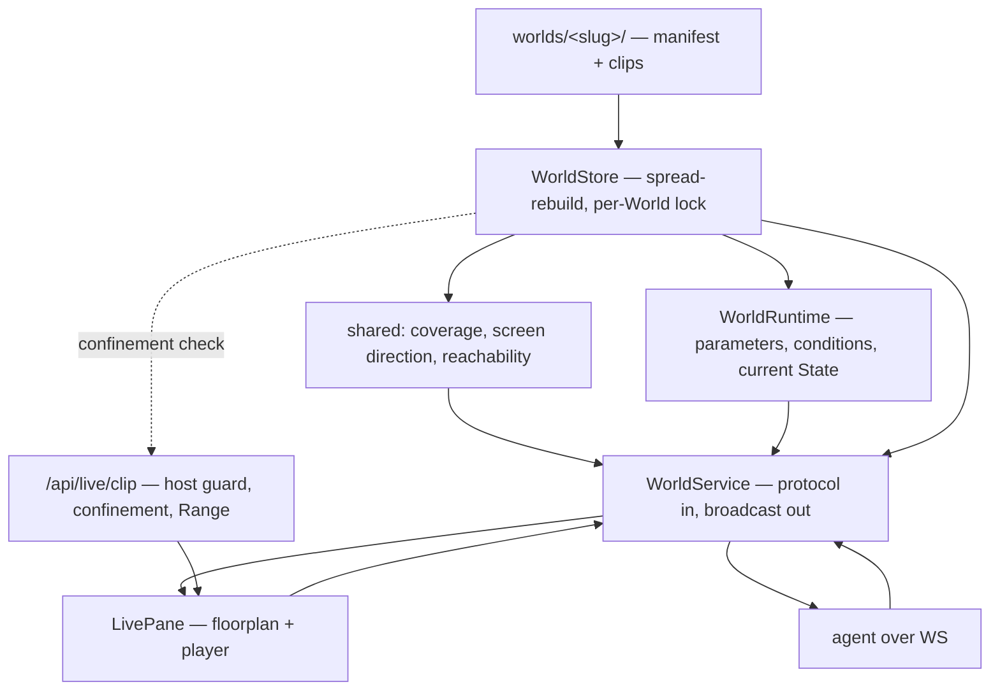
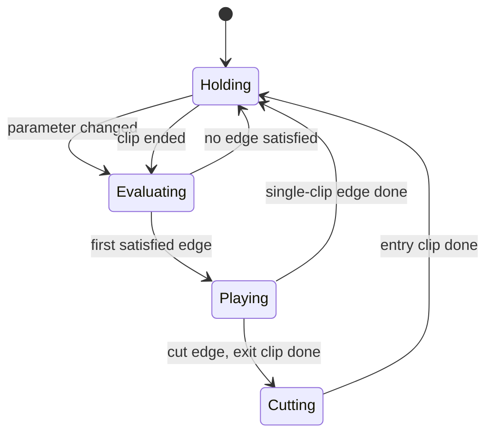

# feat: Live scene-worlds

## Summary

Add a `/live` route where a character inhabits a room built from short looping clips, driven by a
server-owned state machine of Parameters and conditions. A World is a portable folder under the data
dir; a Scene owns one camera; a scene change is a Cut — an exit clip, the camera change on the join,
then an entry clip. Authoring happens on a top-down floorplan that derives camera coverage and
reports the three failures that break a World.

---

## Problem Frame

The repo has a worked example of exactly this subsystem shape — Monitors owns a store, a service that
joins the hub by registering, its own wire messages and its own panel — so most of this plan is
mirroring that. Three pieces have no precedent anywhere in the codebase and carry the risk:

- **No media route.** `server/src/http.ts` has a hardcoded MIME table with no video types, and nothing
  in the repo parses a `Range:` header or answers `206`. `server/src/storage/byte-range.ts` reads like
  the answer and is not — it is a log-tailer helper.
- **No client routing.** `ui/src/main.tsx` renders `App` unconditionally; there is no router, no
  `popstate` listener, no `location.pathname` read anywhere in `ui/src`.
- **No drawn geometry.** The only canvas in the codebase is offscreen in `ui/src/face-image.ts`,
  transcoding a picked file. Nothing has ever been drawn for a user to look at.

The manifest store is where the repo's most-repeated lesson bites hardest. A World is portable by
design, so it will be opened by a build older than the one that wrote it — and a store that rebuilds
its cache by naming fields deletes what it does not recognise on the next write, silently and
permanently.

---

## Requirements Trace

| Origin | Where it lands |
|---|---|
| R1, R2 | U7 (route, picker) |
| R3, R4, R5, R17 | U2 (store, load-time validation) |
| R6–R10 | U2 (persisted shape), U6 (derived coverage) |
| R11–R16 | U2 (persisted shape), U5 (playback semantics) |
| R18–R21 | U5 (runtime) |
| R4 (last-open pointer) | U2 (owns the file) |
| R22 | U8 (player) |
| R23–R25, R29 | U9 (floorplan) |
| R26–R28 | U6 (derivation), U9 (presentation) |
| R30 | U1, U3 (every mutation on the wire) |
| R31 | U4 (clip route) |
| F1 | U9 end to end |
| F2 | U5 + U8 |
| F3 | U6 + U9 |
| AE1 | U6 |
| AE2 | U6 |
| AE3 | U6 |
| AE4 | U2, U8 |
| AE5 | U3 |

---

## Key Technical Decisions

**KTD1. The runtime lives on the server, not in the browser.** Parameters are settable by an agent
over the protocol, and an agent-set Parameter must move the character whether or not a browser is
open. So the state machine owns current State and evaluates conditions server-side, and broadcasts
the State to whoever is watching; the browser plays the clip it is told to play. Putting the machine
in React would make the protocol a remote control for a UI rather than the thing the UI also drives,
which inverts the parity rule. It also sidesteps `React.StrictMode` double-invoking mount effects in
dev, which would otherwise double-fire transitions.

**KTD1a. The server is the timing authority, so a clip duration is persisted.** The runtime's second
trigger is "the current clip ended", and if that signal only ever arrives from a browser then a
headless World takes exactly one edge and freezes — possibly mid-Cut, with the camera already
changed and the destination State never reached. That would contradict the whole reason for KTD1. So
each clip assignment records a duration in the manifest, and the runtime drives clip-end from its own
timer seeded by it. The duration is captured by the browser at assignment time from `loadedmetadata`
and sent with the assign message: the server stores a number it was given and still inspects no
video, which keeps the origin's "processes no video" constraint intact. A client's clip-end report is
demoted to a resync signal, never the authority.

**KTD2. Geometry derivation lives in `shared/`, not in the UI.** Cone coverage, screen-direction
checking and dead-end analysis are pure functions over the manifest. Putting them in `shared/src/`
means the server can answer "what is wrong with this World" over the protocol (parity for R26–R28)
and the floorplan can draw from the same result. It is also the only way they are testable: the
component suite runs under jsdom, which implements no SVG layout — no `getBBox`, no `getScreenCTM` —
so geometry inside a component cannot be asserted. Precedent: `ui/src/layout.ts` and
`ui/src/vision-rows.ts` are pure modules tested under node while their components only render.

**KTD3. A World directory is a readable server-derived slug, and the display name lives in the
manifest.** R3 wants a folder a person recognises when they copy it; AGENTS.md hard-requires that
client-supplied ids that become file paths are validated. Both hold if the client supplies a *name*
and never a path segment: the server derives the directory segment with the `safeSegment` idiom from
`server/src/storage/jsonl.ts`, adding a numeric suffix on collision. This is the same reasoning that
exempts Monitor ids from the UUID guard — the id is server-generated. Path confinement in U2 still
runs regardless, because a copied-in World's manifest is untrusted whatever the folder is called.

**KTD4. The clip route is carried by the host check, not by the token.** A `<video>` element sends no
`Origin` and cannot present the per-boot WS token, and `allowsOrigin` in `server/src/origin.ts`
returns true for a missing `Origin` by design so agents keep protocol access. So `allowsHost` is what
actually defends this route — the same accepted trade already made for `/api/vision/stream`, not
parity with the socket. Recording it here so a later reader does not assume the stronger gate.

**KTD5. The route lives under `/api/`.** The SPA fallback in `server/src/http.ts` is greedy — any
unmatched path returns `index.html` with a 200 — and `ui/vite.config.ts` proxies only `/api` and
`/ws` to the core. A clip route anywhere else is swallowed in production and unproxied in dev.

**KTD6. The manifest is rebuilt by spreading the parsed value.** Never by naming fields. Every branch
that assigns the cache — fresh World, parsed World, invalid-manifest fallback — shares one empty
constant so the branches cannot disagree. A confinement rejection marks the State incomplete without
rewriting the manifest, so a rejected clip path is not deleted from the author's work.

**KTD7. Sequenced so the runtime is provable before the editor exists.** U1–U8 land a World that
plays from a hand-seeded manifest; U9 adds the surface that authors one. This means the state machine,
the clip route and the player are all verifiable against a folder created by hand, well before the
floorplan is drawable.

---

## High-Level Technical Design

Ownership and data flow. The manifest is the durable state of a World; HAL's own data holds only the
last-open pointer, and everything else is derived or live.



The transition cycle. Conditions are evaluated on exactly two triggers, and a Cut is the one edge
that plays two clips.



`Evaluating` never chains: one satisfied edge is taken, then the machine holds until a trigger fires
again. That is R21, and it is what keeps a missing edge a visible dead end rather than an infinite
search.

---

## Output Structure

```
server/src/live/
  service.ts          WorldService — protocol handling, broadcast
  runtime.ts          WorldRuntime — conditions, current State, transitions
  clips.ts            clip resolution and confinement
server/src/storage/
  worlds.ts           WorldStore — manifest load, validate, mutate, persist
shared/src/
  worlds.ts           World data shapes
  world-geometry.ts   coverage, screen direction, reachability
ui/src/
  route.ts            pure path parsing and navigation
  components/LivePane.tsx
  components/Floorplan.tsx
  components/ClipPlayer.tsx
```

The per-unit file lists are authoritative; this tree is the shape, not a constraint.

---

## Implementation Units

Landing order follows the declared dependencies, not the numbering: **U1, U2, U5, U6, U3, U4, U7, U8,
U9.** The runtime and the geometry module are pure and land before the service that calls them; the
service and the clip route then make a hand-seeded World reachable, and the UI follows.

### U1. World data shapes and wire messages

**Goal:** Declare the World domain on the wire so both sides compile against one contract.

**Requirements:** R30 (wire messages); the data type definitions that U2 persists and U5 runs, for
R6–R21.

**Dependencies:** none.

**Files:** `shared/src/types.ts`, `shared/src/worlds.ts`

**Approach:** Data shapes (`World`, `Scene`, `Camera`, `Position`, `WorldState`, `Edge` with its three
kinds, `Parameter`) go in `shared/src/worlds.ts` and are re-exported where the message interfaces need
them. Messages are declared as individual interfaces and added to the two unions in
`shared/src/types.ts`, grouped under a banner comment like every other subsystem. Follow the
draft/patch split Monitors uses — the client supplies a name and a patch, never an id or a path.
Client messages must cover every mutation the floorplan can make (R30): list worlds, create, open,
place and move a Position, place and aim a camera, strike a derived pairing, add and edit an edge,
assign a clip, edit conditions, set a Parameter. Server messages carry the World, the derived reports,
and the live State.

Two shapes exist for KTD1a. A clip assignment carries a duration in milliseconds alongside its path.
And one further client message reports clip end — carrying the World id, the State id and the runtime
generation it was issued for, so a stale or duplicated report is identifiable as such. It belongs
here rather than appearing in U8, so U8 only wires the UI side of a message that already exists.

**Patterns to follow:** the Monitor message family in `shared/src/types.ts`; `MonitorDraft` /
`MonitorPatch` for the shape split.

**Test scenarios:** Test expectation: none — type declarations only. The exhaustive `switch` in
`ui/src/store.ts` and `npm run typecheck` are the gate, and U3 covers the messages behaviourally.

**Verification:** `npm run typecheck` passes; the UI store fails to compile until U7 handles the new
server messages, which is the intended signal.

---

### U2. WorldStore

**Goal:** Load, validate and persist a World manifest without losing fields it does not recognise.

**Requirements:** R3, R4, R5, R17; persisted shape for R6–R21.

**Dependencies:** U1.

**Files:** `server/src/storage/worlds.ts`, `server/src/paths.ts` (add the `worlds/` resolver),
`server/test/storage/worlds.test.ts`. The last-open pointer is `worlds/last-open.json`, owned here.

**Approach:** One directory per World under `worlds/` in the data dir, holding `world.json` and
`clips/`. Load rebuilds by spreading the parsed value and re-adding only fields needing a default —
never by naming fields (KTD6). One shared empty-World constant across the fresh, parsed and
invalid-manifest branches. Writes go through `writeJsonAtomic`; mutations go through a per-World
promise-chain lock modelled on `ConversationStore`, because the World is the unit of write and a
floorplan drag produces bursts of small mutations to one manifest.

Load-time validation is one pass that reports rather than throws, modelled on `usable()`/`normalize()`
in `server/src/storage/monitors.ts`. It covers both halves of R17: clip paths are confined to the
World's own `clips/` (resolve both sides with `fs.realpath`, then require `path.relative` to be
neither absolute nor `..`-leading — the prefix check in `server/src/http.ts` is the weaker precedent
and should not be copied), and every numeric field from the manifest is checked with
`Number.isFinite`. Guards are written acceptance-shaped, never as negations, so a `NaN` field fails
closed. A rejected path marks the State or edge incomplete and is left in the manifest untouched.

Creating a World derives its directory slug server-side from the supplied name (KTD3). Two Windows
details belong in that derivation rather than being discovered later: the collision check compares
lowercased candidates, because the filesystem folds case and two Worlds must not resolve to one
directory; and the reserved device names (`CON`, `PRN`, `AUX`, `NUL`, `COM1`–`COM9`, `LPT1`–`LPT9`)
are substituted the same way disallowed characters already are, so an ordinary name does not fail
World creation with an error that names nothing.

An unparseable manifest loads read-only. `readJson` returns null for malformed JSON exactly as it does
for a missing file, so a World that fell back to the empty constant would have a hand-edited
`world.json` permanently replaced by the next ordinary mutation — the same permanent-loss shape the
spread-rebuild exists to prevent, triggered by a stray comma. A World in that state refuses every
mutation and reports why, and issues no write at all.

R4's last-open pointer lives here, in `worlds/last-open.json` written through `writeJsonAtomic` — it
is the one piece of World state outside a World folder, and giving it to the store keeps it under the
same atomic-write discipline as everything else. A pointer naming a World that no longer exists
degrades to the picker rather than failing.

**Patterns to follow:** `server/src/storage/monitors.ts` for load-time repair; `ConversationStore`'s
per-id lock in `server/src/storage/conversations.ts`; `server/src/storage/jsonl.ts` `safeSegment`.

**Test scenarios:**
- Creating a World writes a directory and a manifest; a second World with the same name gets a
  distinct directory.
- Round-trips positions, cameras, edges and parameters across a restart — a fresh store instance
  re-reads what the previous one wrote.
- **Covers R3.** A manifest seeded on disk with an unknown extra key keeps that key after an
  unrelated mutation is made through a newly-opened store and read back by a third instance. This is
  the reopen-mutate-reopen shape; a single round trip in one process proves nothing because the cache
  read is the cache just written.
- Every persisted field individually survives the same reopen-mutate-reopen cycle.
- A manifest naming a clip path outside the World (`../` form) loads, reports that State incomplete,
  and still has the offending path present in the file afterwards.
- A manifest naming an absolute clip path is rejected the same way.
- A symlink inside `clips/` pointing outside the World is rejected.
- A manifest with a non-finite camera field loads, reports the camera unusable, and that camera covers
  no Positions rather than all of them.
- A malformed (non-JSON) manifest leaves the World listable and reports it unreadable rather than
  throwing.
- A mutation attempted against that unreadable World is refused, and the bytes on disk are byte-for-byte
  unchanged afterwards.
- A display name that folds onto an existing World's slug gets a distinct directory; a name matching a
  Windows reserved device name still produces a usable directory.
- The last-open pointer survives a restart, and degrades to no-World-open when it names a World that
  has been deleted.
- **Covers AE4.** A World with one Scene, one clip and no edges loads and is playable.
- Two concurrent mutations to one World serialize — both land, neither is lost.

**Verification:** A World folder can be created, hand-edited on disk, reopened, mutated through the
store, and still carries every field it started with.

---

### U3. WorldService

**Goal:** Put the whole World domain on the protocol, and broadcast changes to watchers.

**Requirements:** R30, AE5.

**Dependencies:** U1, U2, U5, U6. The service is the only thing that talks to the protocol, so it
calls the runtime to apply a Parameter change and the geometry module to attach the derived reports
to what it broadcasts.

**Files:** `server/src/live/service.ts`, `server/src/app.ts`, `server/test/live/service.test.ts`

**Approach:** Mirror `server/src/monitors/service.ts`: a structural hub interface so tests can fake it,
a constructor registering `onMessage` (with the mandatory `.catch`) and `onConnection`, a `handle()`
switch whose cases end by broadcasting, and `start()`/`stop()`. Constructed in `startApp` alongside
the Monitor service, stopped in `close()`.

Two things to get right. Every broadcast payload names *which* World it describes, and every cache the
service holds is keyed by World id — v1 may open one World at a time, but a value that belongs to a
World must not be stored as though it belonged to the app. And the connect-time greeter must sit on
the admitted-socket path, not on the raw `connection` event, so an unadmitted socket receives nothing.

**Patterns to follow:** `server/src/monitors/service.ts` end to end; `server/src/app.ts` construction
order and `close()`.

**Test scenarios:**
- Listing worlds returns what the store holds; creating one broadcasts the updated list.
- **Covers AE5.** Setting a Parameter over the protocol produces the same State transition as setting
  it from the UI path — assert the broadcast State, not just that the message was accepted.
- Each mutation message (place Position, aim camera, add edge, assign clip, edit condition, strike a
  pairing) changes the store and broadcasts the result. A mutation applied to the store but not
  broadcast is a dead control, so assert both halves.
- A malformed mutation message is ignored without throwing and without mutating.
- A clip-end report is handed to the runtime with its World, State and generation intact; a report
  whose generation is stale changes nothing.
- Assigning a clip persists the duration the client supplied with it.
- An unadmitted socket that sends nothing receives nothing after a World broadcast fires — connect,
  stay silent, broadcast, settle, assert the received list is empty.
- A broadcast payload identifies its World.

**Verification:** An agent holding the WS token can create a World, place a Position and a camera, add
an edge and set a Parameter without a browser open.

---

### U4. Clip HTTP route

**Goal:** Serve clip bytes to a `<video>` element, from inside a registered World only.

**Requirements:** R31.

**Dependencies:** U2.

**Files:** `server/src/http.ts`, `server/src/live/clips.ts`, `server/src/app.ts`,
`server/test/live/clip-route.test.ts`

**Approach:** A route under `/api/live/clip` (KTD5), placed before the static block. Guarded by
`allowsHost` and `allowsOrigin` from `server/src/origin.ts` — called, not reimplemented, because two
copies of one rule drift. The World and clip are named by query parameters and resolved through the
same confinement helper U2 uses, so an unconfined path is not expressible rather than merely checked.
Confinement is the floor, not the whole rule: the route serves only clips the open World's manifest
actually references, so dropping an unrelated file into `clips/` does not make it network-reachable.

`startApp` builds the HTTP server before the service exists, so the route takes a lazy accessor the
way the camera source already does — `createHttpServer` gains a `worlds: () => WorldStore | null`
option, and `startApp` constructs the store before the HTTP server. The store is U2's, so this adds
no dependency on the service.

Net-new work: a video MIME table (`.mp4`, `.webm`) kept separate from the static one, and
Range support — parse `Range:`, stream with `createReadStream({start, end})`, answer `206` with
`Content-Range` and `Accept-Ranges: bytes`, and `416` when unsatisfiable. The existing static path
reads whole files into memory, which is wrong for video.

**Patterns to follow:** the `/api/vision/stream` block in `server/src/http.ts` for guard shape and the
503-when-not-holding response.

**Test scenarios:**
- A clip inside a registered World returns 200 with a video content type.
- A `Range: bytes=0-99` request returns 206 with a correct `Content-Range` and exactly 100 bytes.
- An open-ended `Range: bytes=100-` returns the remainder.
- An unsatisfiable range returns 416.
- A request naming a path outside the World returns 404 or 403, not bytes — including the `../` form
  and an absolute path.
- A file present in `clips/` but not referenced by the manifest is not served.
- A request for an unregistered World returns 404.
- **Host guard.** A foreign `Host` header returns 403 — driven through `node:http` with an explicit
  header, because `fetch` treats `Host` as forbidden, silently drops it, and would make the test pass
  while proving nothing.
- A foreign `Origin` returns 403; an absent `Origin` returns 200.

**Verification:** A browser plays a clip from a World folder; a request naming a file one directory up
gets nothing.

---

### U5. WorldRuntime

**Goal:** Evaluate conditions and decide what is on screen.

**Requirements:** R18, R19, R20, R21; F2.

**Dependencies:** U1, U2.

**Files:** `server/src/live/runtime.ts`, `server/test/live/runtime.test.ts`

**Approach:** A pure-as-possible machine over the loaded World: current State, current Parameter
values, and a `step()` seam so tests need not wait for real clip durations. Clip end is the runtime's
own event, fired by a timer seeded from the duration recorded on the clip assignment (KTD1a) — so a
World advances with no browser attached. A client's clip-end report is a resync signal: it carries the
World id, State id and generation it was issued for, and any report whose triple does not match the
current one is discarded. That is what keeps two open tabs, or one tab reloading mid-clip, from
advancing the machine twice — which would be the chaining R21 forbids, arriving by the back door.

Conditions are evaluated on exactly two triggers — a Parameter changed, or the current clip ended —
and the first satisfied
edge is taken. One edge per evaluation, never a chain (R21). A Cut is the one edge that plays two
clips: the exit holds the outgoing Scene, the camera changes on the join, the entry plays in the
incoming Scene, and the machine only reaches its destination State when the entry ends.

Transitions span awaits, so each one takes a generation on start and checks it after every await; a
Parameter change mid-transition supersedes the in-flight one rather than letting a stale clip land in
a State the machine has left. A clip that fails to resolve faults the transition and says so, rather
than leaving the previous loop running as though it succeeded.

**Execution note:** the `step()` seam must not become the only thing tested — at least one scenario
drives the real timer path, since a seam every test uses leaves the production trigger uncovered.

**Patterns to follow:** the superseded-worker and generation-counter discipline in
`docs/solutions/exclusive-device-one-owner-many-consumers.md`.

**Test scenarios:**
- A Parameter change satisfying one edge takes it; the State and clip change.
- A Parameter change satisfying no edge leaves the State alone — assert after a bounded wait, since
  this is the negative case where a fixed delay is the assertion.
- A clip ending with an exit-time edge takes it with no Parameter change; a clip ending with none
  loops the same clip again.
- Two Parameters both non-default, with edges whose conditions read each one — a suite that varies one
  Parameter with the others pinned cannot see the interaction, so at least one scenario sets both.
- **Covers F2.** A Cut plays exit then entry, reports the Scene change on the join, and arrives at the
  destination State only after the entry clip ends.
- **Covers R21.** Setting the destination Parameter from two hops away takes one edge and holds; it
  does not chain to the destination in one evaluation.
- Driving the full couch → booth → couch circuit terminates and returns to the start State — a claim
  about the tenth transition, not the first.
- A Parameter change during a transition supersedes it; the superseded clip does not land.
- A missing clip on the destination State faults the transition and reports it.
- **Covers R16.** A Cut between two States at the same Position plays exit then entry with no travel
  clip between them, distinguishing a re-frame from a Cut that also moves the character.
- **No client attached.** With no socket watching, a Parameter change drives a full Cut through to its
  destination State — the headless case KTD1 exists for, and the one a browser-sourced clip-end signal
  would silently fail.
- Two identical clip-end reports for the same State and generation advance the machine once.
- A clip-end report naming a superseded generation is discarded.

**Verification:** A hand-seeded World runs its circuit from Parameter changes alone, with no UI.

---

### U6. World geometry

**Goal:** Derive coverage and report the three failures that break a World.

**Requirements:** R9, R10, R26, R27, R28; AE1, AE2, AE3; F3.

**Dependencies:** U1.

**Files:** `shared/src/world-geometry.ts`, `server/test/live/world-geometry.test.ts`

**Approach:** Pure functions over the manifest (KTD2). Coverage is Position-in-cone given origin,
facing, field of view and range, minus any pairing the author struck. Screen direction compares a Cut's
recorded exit and entry frame edges and flags a pair that reads as the character reversing.
Reachability walks the graph over the enumerated Parameter value space and reports States with no
satisfiable edge out for some allowed value.

Two hazards worth naming in the code. The cone test must state the property it depends on — a cone
crossing 0°/360° is the variant that breaks a first implementation that happened to work. And the
struck-pairing list is an exemption list: a strike whose underlying pairing no longer exists, because
a camera moved or a Position was deleted, must surface rather than sit silently, or moving the camera
back leaves a State quietly missing.

Each report states what it does not claim. Reachability's honest form is "no satisfiable edge out for
these enumerated values", not "this graph is fine".

**Patterns to follow:** `ui/src/layout.ts` and `ui/src/lens.ts` as pure derivation modules with node
tests.

**Test scenarios:**
- **Covers AE1.** Two overlapping cones over three Positions yield five States, and the shared Position
  is reported as needing a clip from each camera.
- A Position beyond a camera's range is not covered by it.
- A cone spanning 0°/360° covers the Positions inside it and not those outside.
- A camera with a non-finite facing covers nothing.
- A struck pairing is excluded from coverage; a strike whose camera has since moved away is reported
  as stale.
- A Position covered by no camera is reported.
- **Covers AE2.** A Cut exiting right and entering left passes; a return Cut also exiting right is
  flagged reversed.
- **Covers AE3.** A State whose only outbound edges require one Parameter value is reported as having
  no way out for the other allowed values.
- Reachability over two Parameters with multiplying value sets — the cross-product case, which testing
  one Parameter at a time cannot support.
- A World with no edges at all reports every State as a dead end rather than throwing.

**Verification:** The reports name real gaps in a hand-built World and stay quiet on a complete one.

---

### U7. Client routing and the `/live` shell

**Goal:** Reach `/live` in the browser and pick a World.

**Requirements:** R1, R2.

**Dependencies:** U1, U3.

**Files:** `ui/src/route.ts`, `ui/src/App.tsx`, `ui/src/store.ts`, `ui/src/components/LivePane.tsx`,
`ui/test/route.test.ts`, `ui/test/components/LivePane.test.tsx`. The test split is forced by
`vitest.config.ts`: only `ui/test/components/**` runs under jsdom, so the node-side test can cover
path parsing but nothing touching `window`, `history` or `popstate`.

**Approach:** A pure `ui/src/route.ts` parsing `location.pathname` to a small union, subscribing to
`popstate`, and exposing `navigate()`. `App.tsx` chooses between `LayoutShell` and `LivePane` inside
the existing error boundary, keeping the topbar and settings drawer above the switch — `/live` is an
alternative to the three-pane body, not a fourth pane, so the rail and collapse machinery stay out of
it. A crash in the live surface must not take the base HAL page down with it.

`ui/src/store.ts` gains World fields and the matching `case` arms; its `switch` has no `default`, so
the new server messages are a compile error until handled. `LivePane` with no World open renders the
picker.

Add the link from the base page to `/live`.

**Patterns to follow:** `ui/src/layout.ts` as the pure-module-plus-component split;
`ui/src/components/LayoutShell.tsx` for a body that mounts without a WebSocket.

**Test scenarios:**
- `parseRoute` maps `/`, `/live` and an unknown path to the right union member — pure, node.
- `navigate` pushes and `popstate` restores, asserted from the jsdom side, since a node test has no
  `history` to push onto.
- A deep load of `/live` renders the live surface, not the chat shell.
- **Effect frequency.** Mounting the pane sends the world-list request exactly once; several rerenders
  with different state still send exactly one.
- The same holds with a deliberately unstable `send` — the component must not depend on its caller
  memoising.
- With no World open, the picker lists worlds and creating one sends a create message with the typed
  name.
- Queries are scoped with `within` on a per-World testid rather than by index.

**Verification:** Loading `http://localhost:9000/live` directly shows the picker; the base page links
to it; the chat shell still works.

---

### U8. Clip player

**Goal:** Put the current State's clip on screen and cross the join without a stall.

**Requirements:** R22; F2, AE4.

**Dependencies:** U4, U5, U7.

**Files:** `ui/src/components/ClipPlayer.tsx`, `ui/test/components/ClipPlayer.test.tsx`

**Approach:** Two video elements, muted and `playsinline`, one visible while the other preloads the
next clip; swap on `ended` rather than on a timer. The server owns which State is current (KTD1), so
the player reacts to a broadcast rather than deciding anything. Effects must be idempotent —
`ui/src/main.tsx` wraps in `StrictMode`, so a mount effect that starts playback fires twice in dev.

The player reports clip end back over the protocol as a resync signal only — the server's own timer is
the authority (KTD1a), and the report carries the World, State and generation so the runtime can
discard a stale or duplicated one. On assigning a clip, the player supplies its duration from
`loadedmetadata`, which is how a duration reaches the manifest without the server touching video.

**Test scenarios:**
- The current State's clip is the one requested from the clip route, with the World named.
- A State change swaps the visible element rather than reassigning the same element's source.
- A Cut plays exit then entry in order.
- Clip end is reported once per clip, not once per rerender.
- A clip that fails to load surfaces a fault rather than leaving the previous clip looping — drive it
  with a fake media element that emits `error`.
- A fake media element must emit `canplay` asynchronously; a synchronous fake hides the ordering bugs
  this unit exists to avoid.
- **Covers AE4.** A World with one clip and no edges loops it without error.

**Verification:** Watched in a browser against a hand-seeded World, the join between two clips shows no
black frame and no stall.

---

### U9. Floorplan editor

**Goal:** Author a World on a top-down plan and see what is wrong with it.

**Requirements:** R23, R24, R25, R26, R27, R28, R29; F1, F3.

**Dependencies:** U3, U6, U7.

**Files:** `ui/src/components/Floorplan.tsx`, `ui/src/components/LivePane.tsx`,
`ui/test/components/Floorplan.test.tsx`

**Approach:** Inline SVG, drawing Positions as points, cameras as origins with cones, and edges as
lines between Positions. All geometry comes from `shared/src/world-geometry.ts` — the component
positions and renders, it does not derive. Selecting an edge opens a side panel for its conditions and
clip assignments. Live Parameter values and the current State render alongside, which is what makes
"why is it just standing there" answerable.

The three reports render as marks on the plan, not only as a list, since their whole value is spatial.

Two layout traps to avoid, both already recorded in the repo: a flex or grid child defaults to
`min-height: auto` and will refuse to shrink, so a long condition list will push the page instead of
scrolling inside its panel; and pan/zoom transforms computed in JS must stay a transform or a custom
property, with the stylesheet owning everything else, or the layout ends up with two sources of truth.

**Test scenarios:**
- Placing a Position sends the mutation with its coordinates; the drawn plan reflects the broadcast
  result, not local state.
- Aiming a camera sends the mutation; coverage marks update from the derived report.
- **Covers AE2.** A World whose return Cut reverses direction renders the warning — assert the rendered
  flag, not that the manifest holds the two frame edges.
- A Position covered by no camera renders its warning mark.
- A dead-end State renders its warning mark.
- Selecting an edge opens its condition panel; editing a condition sends the mutation.
- Live Parameter values render and update on broadcast.
- Effect frequency: mounting requests the World once across rerenders, including with an unstable
  `send`.
- All queries scoped with `within` on per-entity testids — the surface is full of near-identical
  repeated controls, which is the worst case for positional queries.

**Verification:** **Covers F1.** Starting from an empty World, place three Positions and two cameras,
assign the couch idle, add the walk, the Cut, the booth idle and the mirrored return — then drive the
circuit by changing one Parameter and watch it complete.

---

## Scope Boundaries

### Deferred for later (from origin)

- Generating clips inside the app, and any local video-model integration.
- Take history — rejected generations with prompts and seeds.
- A node-graph canvas as a second authoring view.
- HAL driving Parameters from narration, vision or monitors.
- Audio, and more than one character in a World.
- Capture or streaming output.

### Outside this feature's identity (from origin)

- Not a 3D engine. Nothing is rendered or simulated at runtime.
- Cuts are hard cuts. No blending, easing or crossfades.
- Worlds are never shared or merged.

### Deferred to follow-up work

- Watching a World directory for changes made outside HAL. The authoring loop drops clips in by hand,
  so a second writer is expected, but v1 rescans on open rather than live.
- Running more than one World at once. The store and every broadcast are keyed by World from the first
  commit so this stays cheap, but v1 opens one.
- Extracting a `shared/` workspace. Already on the repo's roadmap; this plan uses the existing tsconfig
  include and does not touch it.

---

## Risks and Dependencies

- **The manifest store is the highest-risk unit.** A field-naming rebuild deletes what an older build
  does not recognise, and a portable World makes that loss travel between machines. The unknown-key
  survival test in U2 is the guard; it is the one no field-naming implementation can pass.
- **The clip route is a new unauthenticated local surface.** It rests on the host check alone (KTD4).
  This is an accepted residual, not a closed one — the per-boot token is still owed on local media
  surfaces generally.
- **Range support is net-new.** Nothing in the repo answers 206, so this is written from scratch
  rather than copied, and video seeking exercises it immediately.
- **The floorplan has no in-repo precedent.** Combined with jsdom implementing no SVG layout, anything
  that is not a pure function is untestable — which is why KTD2 is a constraint rather than a
  preference.
- **Version skew during development.** This change touches the wire contract and adds a router, which
  is the exact combination that produces a black page when the UI is rebuilt under a running server.
  Restart after any `shared/src/types.ts` change, and do not rebuild under the live instance on 9000.
- **A persisted duration can drift from the file.** The runtime's timer trusts a number the manifest
  holds, so replacing a clip with a longer take without reassigning it makes the machine cut early.
  The clip-end resync report from a watching browser is what corrects it when someone is looking; with
  nobody watching, it stays wrong until the clip is reassigned.
- **Prompt surface.** If any World text ever reaches a model, `server/test/templates/surface.test.ts`
  fails unless it is a Phrase. HAL-driven Parameters are deferred, so this should not bite v1.

---

## Open Questions (deferred to implementation)

- Whether Parameter values persist across restarts or reset to their declared defaults, and whether a
  World reopens running or holding at its default State.
- What a second watcher sees when it joins a World mid-clip — the current clip from the start, or from
  an elapsed offset the broadcast would have to carry.
- What the runtime does when it arrives at a State whose clip has gone missing since load — U2 covers
  load-time reporting, U5 faults the transition, but the resting behaviour is a judgement call best
  made against a real one.
- Whether the floorplan needs an author-visible ordering on a State's outbound edges. Raised in review
  at low confidence: "first satisfied edge" makes precedence load-bearing, and today it falls out of
  manifest order. Revisit once two edges genuinely compete in a real World.
- How the manifest versions as Worlds outlive the code. The spread-rebuild makes forward-compat safe;
  an explicit version field is only needed once a field changes meaning rather than being added.

---

## System-Wide Impact

- `shared/src/types.ts` gains a message family; `ui/src/store.ts`'s exhaustive switch will not compile
  until the new server messages are handled, which is the intended enforcement.
- `server/src/http.ts` gains a route before the static block, and its MIME handling stops being a
  single table.
- `server/src/app.ts` gains a service in the existing construction order, with a matching `stop()` in
  `close()`.
- `ui/src/App.tsx` gains a top-level branch. The chat shell's behaviour is unchanged, but every
  existing component test now mounts inside a wider container, so index-based queries anywhere in the
  UI suite become more fragile.
- No change to inference, providers, narration, vision or monitors.

---

## Sources and Research

- Origin requirements: `docs/brainstorms/2026-09-01-live-scene-worlds-requirements.md`
- `AGENTS.md` — parity rule, origin and token rules, storage cache-rebuild rule, the four mandatory
  test helpers.
- `docs/solutions/rebuilding-a-cache-field-by-field-turns-a-read-into-a-delete.md` — the manifest
  store's core hazard, and the reopen-mutate-reopen test shape.
- `docs/solutions/loopback-binding-is-not-an-origin-check.md` — why the clip route calls the shared
  predicates, and why the Host test must use `node:http`.
- `docs/solutions/a-gate-that-checks-one-direction-is-half-a-gate.md` — the greeter must sit behind
  admission.
- `docs/solutions/exclusive-device-one-owner-many-consumers.md` — generation counters for transitions
  that span awaits.
- `docs/solutions/a-threshold-guard-written-as-a-negation-fails-open-on-nan.md` — acceptance-shaped
  guards for manifest numerics.
- `docs/solutions/a-completeness-guard-is-only-as-honest-as-its-exemptions.md` — struck pairings are an
  exemption list and need their own staleness check.
- `docs/solutions/an-index-based-query-couples-a-test-to-unrelated-components.md` — scoped queries in
  the floorplan suite.
- `docs/solutions/rebuilding-assets-under-a-running-server-is-a-version-skew.md` — the black-page trap
  during development.
- `docs/solutions/splitting-a-singleton-leaves-every-lookup-keyed-to-the-old-one.md` — key every cache
  and payload by World from the first commit.
- Closest structural analogue to mirror: `server/src/monitors/` end to end, with
  `server/src/storage/monitors.ts` for load-time repair and `server/src/storage/conversations.ts` for
  the per-entity lock.
