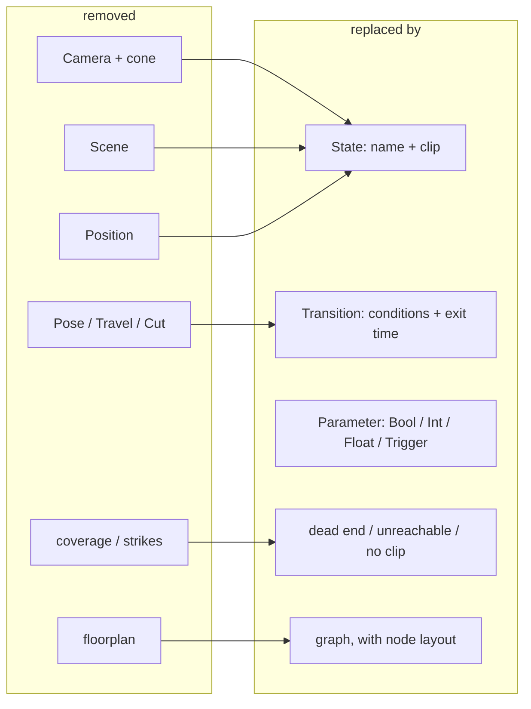
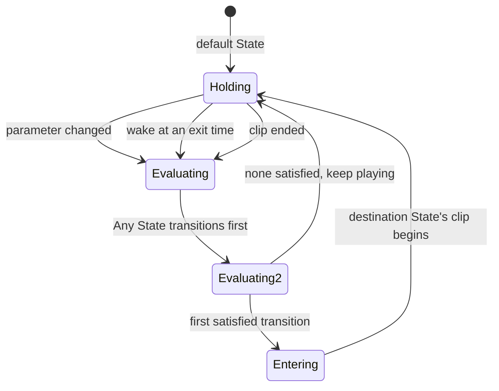

# feat: Live as a pure state machine

## Summary

Replace the World's camera model with a Unity-style animation state machine. A State is a named
node holding one looping clip; a transition is instant and carries AND-ed conditions plus Has Exit
Time; parameters are Bool, Int, Float and Trigger. Cameras, Scenes, Positions and cone coverage are
deleted. Clips are chosen by browsing a folder and copied into the World on pick.

---

## Problem Frame

The subsystem shipped on `feat/live-scene-worlds` derives States from camera geometry and authors
the machine in the floorplan's side panel. The origin brief removes the derivation, which removes
the reason the geometry existed. What is left is the machine — which is already the right shape,
and already tested.

That makes this a replacement of the model rather than a rebuild of the subsystem. These survive
unchanged in shape and keep their tests: the store's spread-rebuild and per-World lock, clip path
confinement, the `/api/live/clip` route with its Range support and host guard, the service's
hub-and-broadcast structure, and the two-element player. What changes is the manifest they carry.

Three things in the brief have no precedent anywhere in this repo and carry the risk:

- **Reading a directory the app does not own.** Every `readdir` in `server/src` today reads either
  the data dir or a path from an env var. Browsing a folder the user names is a new capability, and
  it arrives over a protocol that already permits shell execution — so it is not a privilege
  increase, but it is a new surface.
- **Copying a file into the data dir from outside it.** Nothing in the app does this. The clip route
  and the store both assume every path they touch is one they created.
- **A timer that fires partway through a clip.** The runtime's timer fires at clip end only. Exit
  Time as a fraction means waking at 0.75 of a duration, and doing so on every loop.

The manifest is where the care goes, for the reason the previous plan recorded: a World is portable
and will be opened by a build that does not share its shape. This change is the first one that
alters what a field *means* rather than adding one, which is exactly the trigger the previous plan
named for introducing a version marker.

---

## Requirements Trace

| Origin | Where it lands |
|---|---|
| R1, R2, R3 | U1 (shapes), U2 (store) |
| R4 | U1, U4 (Any State evaluation) |
| R5 | U1 (persisted layout), U6 (dragging) |
| R6 | U6 |
| R7, R8, R9, R10 | U1 (shape), U4 (semantics) |
| R11, R12 | U4 (order), U6 (reorder control) |
| R13 | U2 (persisted), U4 (honoured), U6 (control) |
| R14, R15, R16, R17 | U1 (types), U2 (declare), U4 (evaluate, consume) |
| R18 | U5 |
| R19, R20, R21, R22 | U4 |
| R23, R24, R25, R26, R27 | U5 (server), U7 (browser) |
| R28, R29, R30 | U3 (derive), U6 (render) |
| R31 | U2 (report), U6 (render) |
| F1 | U6 + U7 end to end |
| F2 | U4 + U6 |
| F3 | U4 (Any State, Trigger) + U6 |
| AE1, AE2 | U4 |
| AE3 | U4 |
| AE4 | U4 |
| AE5 | U4 |
| AE6 | U5 |
| AE7 | U3, U6 |

---

## Key Technical Decisions

**KTD1. The manifest gains a version, and an older shape is reported rather than silently emptied.**
The previous plan deferred a version field until "a field changes meaning rather than being added".
That is this change: `states` now holds nodes with clips rather than Scene/Position pairings, and
`edges` becomes `transitions`. A World written by the shipped build would spread-rebuild into a
World with zero states and no explanation. So the manifest carries a version number, a World whose
version this build does not understand loads read-only, and the picker says why. The spread-rebuild
still applies within a version.

**KTD2. Dead-end analysis sweeps only the types that have an enumerable value space.** Bool and
Trigger have two values each; Int and Float have no enumerable space. Sweeping the cross-product of
Bools and Triggers is honest; claiming a Float leaves a State with no way out is not. A condition
over a numeric parameter is therefore treated as satisfiable, and the report states that it is a
claim about the enumerated types only. This follows the shipped module's discipline of each report
saying what it does not claim.

**KTD3. Exit Time is computed server-side from the recorded duration; the client still only reports
clip end.** The server is the timing authority (unchanged from the shipped design), so a transition
with an exit time of 0.75 fires when the runtime's own timer reaches 0.75 of the clip's recorded
length. The browser is not asked to report progress — a progress stream would make the client the
clock, which is the inversion the original design exists to avoid. The client's clip-end report
stays a resync signal only.

**KTD4. A looping State wakes at each distinct exit time, then at the end.** A State's outbound
transitions may carry several exit times. The runtime computes the sorted set of distinct exit
fractions for the current State, wakes at each in turn, evaluates, and finally wakes at the clip's
end. Exit times below 1 are re-checked on every loop, matching Unity.

**KTD5. Any State is a flag on the transition, not a pseudo-node in the manifest.** A transition
carries `fromAny: true` instead of a `from` State. Storing a pseudo-State would mean inventing an id
that every consumer has to special-case, and the graph view can render the node from the flag. The
evaluation order — Any State first, then the current State's own — lives in the runtime.

**KTD6. Browsing lists a directory; it does not walk the drive.** One request names a folder and
gets back its video files and immediate subfolders, so the client drives navigation a level at a
time. A recursive walk of a user-named root is an unbounded amount of work behind one message, on a
protocol with no cancellation. The library root is remembered in settings, following
`captionerEndpoint` and `recogniserEndpoint` as the precedent for a user-supplied path.

**KTD7. Copying is server-side and lands inside the World's own `clips/`.** The client sends the
source path; the server copies through the same atomic-write discipline the rest of storage uses,
into a name derived with the existing `safeSegment` idiom, and returns the relative path it wrote.
The clip route's confinement rule is untouched — what changes is that a file can now arrive in
`clips/` by a route other than the user's file manager.

**KTD8. Sequenced so the machine is provable before the browser exists.** U1–U4 land a World that
runs from a hand-seeded manifest, exactly as the shipped version was sequenced. U5–U7 add the
surfaces; U8 removes what the model replaced.

---

## High-Level Technical Design

What is removed, and what replaces it. The left column is deleted outright.



The evaluation cycle. Two triggers as before, but the clip-end trigger becomes a set of wake points,
and Any State is checked first.



`Evaluating` never chains: one transition is taken, then the machine holds until a trigger fires
again. Unchanged from the shipped runtime, and still what keeps a missing transition a visible dead
end rather than an infinite search.

Sketch of the manifest shape, directional rather than a schema:

```
World { version, id, name, defaultStateId, states[], transitions[], parameters[] }
State { id, name, clip: { path, durationMs } | null, x, y }
Transition { id, from | fromAny, to, conditions[], hasExitTime, exitTime, muted, solo, order }
Condition { parameter, op, value }        // op depends on the parameter's type
Parameter { name, type, defaultValue }    // bool | int | float | trigger
```

---

## Output Structure

```
shared/src/
  worlds.ts           rewritten: the new domain
  world-graph.ts      new: conditions, dead ends, reachability (replaces world-geometry.ts)
server/src/live/
  runtime.ts          rewritten semantics, same seams
  service.ts          new message cases
  library.ts          new: browse a folder, copy a clip in
ui/src/
  graph.ts            extended: default marker, Any State node, layout from the manifest
  components/StateGraph.tsx
  components/ClipBrowser.tsx
```

Deleted: `shared/src/world-geometry.ts`, `ui/src/floorplan.ts`,
`ui/src/components/Floorplan.tsx`, and their tests.

---

## Implementation Units

Landing order follows the dependencies: **U1, U2, U3, U4, U5, U6, U7, U8.**

### U1. The new World shapes and wire contract

**Goal:** Declare the state-machine domain so both sides compile against one contract.

**Requirements:** R1–R5, R7–R10, R14–R17; the shape U2 persists and U4 runs.

**Dependencies:** none.

**Files:** `shared/src/worlds.ts`, `shared/src/types.ts`

**Approach:** Rewrite `shared/src/worlds.ts`. Remove `Camera`, `Scene`, `WorldPosition`, `Pairing`,
`EdgeKind`, `ReversedCut` and the coverage fields of `WorldReports`. Add `ParameterType`, a typed
`Parameter`, a `Condition` whose operator set depends on the parameter's type, `Transition` with
`fromAny`, `hasExitTime`, `exitTime`, `muted`, `solo` and `order`, and a `State` carrying a name, an
optional clip and its `x`/`y`. `World` gains `version` and `defaultStateId`.

Messages: replace `add-scene`, `aim-camera`, `strike-pairing` and the edge family with
`add-state`, `update-state` (name, position, clip), `set-default-state`, `add-transition`,
`update-transition`, `reorder-transitions`, and a typed `set-parameter`. Add the two library
messages (`browse-clips`, `import-clip`) and their replies. Keep `report-clip-end` and
`report-clip-duration` as they are.

**Patterns to follow:** the existing World message family in `shared/src/types.ts`; the
draft/patch split it already uses.

**Test scenarios:** Test expectation: none — type declarations only. `npm run typecheck` and the
exhaustive switch in `ui/src/store.ts` are the gate; U4 and U5 cover the messages behaviourally.

**Verification:** `npm run typecheck` fails in the UI store until the new server messages are
handled, which is the intended signal.

---

### U2. WorldStore for the new model

**Goal:** Persist the machine, and refuse a manifest this build does not understand.

**Requirements:** R1, R2, R3, R5, R13, R14, R15, R31.

**Dependencies:** U1.

**Files:** `server/src/storage/worlds.ts`, `server/test/storage/worlds.test.ts`

**Approach:** Keep the spread-rebuild, the per-World lock, `writeJsonAtomic`, the slug derivation,
the last-open pointer and `resolveClipPath` exactly as they are — all of them survive the model
change and all of their tests should keep passing. Replace the pure edit functions: `addState`,
`updateState`, `setDefaultState`, `addTransition`, `updateTransition`, `reorderTransitions`,
`declareParameter` typed. Delete `addScene`, `aimCamera`, `strikePairing` and the edge functions.

Add the version gate (KTD1): a manifest whose `version` is absent or higher than this build's loads
read-only with a reason, alongside the existing unreadable case. A World created now writes the
current version. The spread-rebuild continues to protect unknown keys within a version.

Deleting a State must not leave transitions pointing at it; the store drops the orphans in the same
mutation rather than leaving the graph to render dangling arrows.

**Patterns to follow:** the current `server/src/storage/worlds.ts` end to end — this unit changes
what it stores, not how it stores it.

**Test scenarios:**
- A State round-trips its name, clip and node position across a reopen-mutate-reopen cycle with
  three separate store instances.
- **Covers R3.** A manifest carrying an unknown extra key keeps it after an unrelated mutation made
  through a newly-opened store and read back by a third. The shipped test, retargeted.
- A manifest with no version loads read-only and reports why; the bytes on disk are unchanged after
  a refused mutation.
- A manifest with a version above this build's does the same.
- A manifest at the current version loads normally.
- Deleting a State removes the transitions that referenced it, and leaves unrelated ones alone.
- A transition's `muted`, `solo` and `order` survive a restart.
- A typed Parameter round-trips its type and default; a declared default outside the type's domain
  is corrected rather than stored.
- `reorderTransitions` with an id that is not in the State's outbound set is refused without
  mutating.
- A clip path escaping the World is still reported incomplete and still left in the file.

**Verification:** A hand-written manifest at the current version can be created, edited on disk,
reopened, mutated and still carry every field. A manifest from the shipped build opens read-only and
says so.

---

### U3. Graph analysis

**Goal:** Answer what is wrong with a machine, without geometry.

**Requirements:** R28, R29, R30; AE7.

**Dependencies:** U1.

**Files:** `shared/src/world-graph.ts`, `server/test/live/world-graph.test.ts`. Deletes
`shared/src/world-geometry.ts` and `server/test/live/world-geometry.test.ts`.

**Approach:** Pure functions over the manifest, keeping the shipped module's posture that each
report states what it does not claim. `conditionsHold` gains typed comparison: `is` / `is not` for
Bool and Trigger, and `>` `<` `==` `!=` for Int and Float. Dead-end analysis sweeps the cross
product of Bool and Trigger values only (KTD2), and a condition over a numeric parameter counts as
satisfiable. Reachability is a walk from `defaultStateId` over transitions, with an Any State
transition making its destination reachable from everywhere. Missing-clip becomes a property of a
State rather than of a derived pairing.

Keep the enumerated-space bound the shipped module already has, for the same reason: a manifest
declaring many Bools multiplies.

**Patterns to follow:** `shared/src/world-geometry.ts` as it stands — this unit keeps its shape and
replaces its subject.

**Test scenarios:**
- A Bool condition holds and fails as expected; `is not` inverts it.
- Numeric operators compare correctly, and a non-finite stored value fails the condition rather than
  passing it.
- A Trigger condition holds when the Trigger is set.
- **Covers AE7.** A State with transitions out but none in, which is not the default, is reported
  unreachable; the default State never is.
- A State reachable only through an Any State transition is not reported unreachable.
- A State whose only outbound transition requires a Bool to be true is reported as having no way out
  when that Bool is false.
- A State whose only outbound transition compares a Float is not reported as a dead end, because the
  space is not enumerable.
- A World declaring many Bools returns no dead-end report rather than sweeping a combinatorial space.
- A State with no clip is reported; a State with one is not.
- A World with no transitions at all reports every non-default State unreachable without throwing.

**Verification:** The reports name real gaps in a hand-built machine and stay quiet on a complete
one.

---

### U4. WorldRuntime

**Goal:** Run the machine: typed parameters, triggers, exit times, Any State.

**Requirements:** R11, R12, R13, R17, R19, R20, R21, R22; F2, F3; AE1–AE5.

**Dependencies:** U1, U2, U3.

**Files:** `server/src/live/runtime.ts`, `server/test/live/runtime.test.ts`

**Approach:** Keep the generation discipline, the supersede-on-change behaviour, the `step()` seam
and the headless clock — all of them were reviewed and all of their reasons still hold. Replace what
the machine evaluates.

Parameter values become typed, seeded from each parameter's declared default. Setting one validates
against its type. A Trigger set to true is consumed — reset to false — when a transition whose
conditions read it is taken (R17), and not otherwise.

Evaluation order: Any State transitions first, then the current State's own in their stored order,
taking the first satisfied one (R11, R12). A muted transition is skipped; when any transition out of
a State is soloed, only soloed ones are considered (R13).

Wake points replace the single clip-end timer (KTD4): compute the distinct exit fractions among the
current State's eligible transitions, wake at each against the recorded duration, evaluate, and wake
finally at the end. Conditions on a transition with an exit time are checked only at or after that
point (R9). The Cut phase disappears — there is one clip playing and no join.

**Execution note:** the `step()` seam must not become the only thing tested; at least one scenario
drives the real timer through an exit time, since a seam every test uses leaves the production
trigger uncovered. This is the shipped unit's note and it still applies.

**Patterns to follow:** the current `server/src/live/runtime.ts` — generation counters checked after
every await, `emit()` silent once stopped, durations clamped where they enter.

**Test scenarios:**
- **Covers AE1.** A transition with exit time 0.75 on a four-second clip fires three seconds in, not
  at the end.
- **Covers AE2.** The same transition with an already-true condition does nothing at one second, and
  the condition is checked at three.
- An exit time below 1 fires again on the next loop.
- Two transitions with different exit times both get their wake point, in order.
- **Covers AE3.** A Trigger is consumed by the transition that reads it, reads false afterwards, and
  does not fire the transition a second time until set again.
- A Trigger set while no transition reads it stays set.
- **Covers AE4.** An Any State transition and a current-State transition, both satisfied on one
  evaluation, resolve to the Any State one.
- **Covers AE5.** With one transition soloed, the other outbound transitions are ignored; clearing
  the solo restores them.
- A muted transition is never taken even when its conditions hold.
- Transition order decides between two satisfiable transitions; reordering changes the outcome.
- A numeric condition takes the transition when the comparison holds and not otherwise.
- A parameter change during an in-flight transition supersedes it; the superseded clip does not land.
- **No client attached.** A Parameter change drives the machine through two States with nothing
  watching.
- A State whose clip will not resolve faults and rests, rather than leaving the previous clip
  looping.
- Two identical clip-end reports advance the machine once; a stale generation is discarded.
- The machine starts at `defaultStateId`, not at the first State in the file.

**Verification:** A hand-seeded machine runs a loop, takes an exit-time transition partway through a
clip, and answers a Trigger from any State — all with no UI.

---

### U5. WorldService and the clip library

**Goal:** Put the machine and the clip library on the protocol.

**Requirements:** R18, R23, R24, R25, R26, R27; AE6.

**Dependencies:** U1, U2, U3, U4.

**Files:** `server/src/live/service.ts`, `server/src/live/library.ts`, `server/src/app.ts`,
`server/src/storage/settings.ts`, `server/test/live/service.test.ts`,
`server/test/live/library.test.ts`

**Approach:** The service keeps its shape — structural hub, handler with the mandatory `.catch`,
greeter behind admission, every payload keyed by World, store failures reported rather than
swallowed. Replace the mutation cases with U2's new ones and add the two library cases.

`library.ts` is new and does two things. **Browse** takes a folder and returns its immediate video
files with their sizes, plus its immediate subfolders, so the client navigates a level at a time
(KTD6). It refuses nothing by path — the protocol already permits more than this — but it does
refuse to follow into anything that is not a directory, and it reports a folder it cannot read
rather than throwing. **Import** copies a named source file into the open World's `clips/`, deriving
the destination name with `safeSegment`, refusing a non-video extension, and returning the relative
path. A name that already exists gets a numeric suffix rather than overwriting.

The library root is remembered in settings beside the existing endpoint strings, so browsing opens
where it left off.

Clip duration is not read here — the server still inspects no video. The browser shows duration by
loading metadata client-side, and the existing `report-clip-duration` path corrects the manifest at
first play.

**Patterns to follow:** `server/src/live/service.ts` end to end; `list-vision-devices` in
`shared/src/types.ts` as the request/reply shape for enumerating something; `safeSegment` in
`server/src/storage/jsonl.ts`; `writeFileAtomic` in `server/src/storage/atomic.ts`.

**Test scenarios:**
- Browsing a folder returns its video files and subfolders, and omits unrelated file types.
- Browsing a folder that does not exist reports the failure instead of throwing.
- Browsing a path that is a file, not a folder, is refused.
- **Covers AE6.** Importing a file outside the World copies it into `clips/`, returns a relative
  path, and leaves the source untouched.
- Importing a second file of the same name does not overwrite the first.
- Importing a non-video file is refused.
- Importing when no World is open is refused with a reason.
- A file whose name would not survive as a path segment is imported under a safe name.
- Each mutation message changes the store and broadcasts the result — both halves asserted.
- Setting a typed Parameter over the protocol produces the same transition as setting it from the
  UI, asserted on the broadcast State.
- Setting a Parameter to a value its type does not allow is refused without mutating.
- An unadmitted socket receives nothing after a broadcast.

**Verification:** An agent holding the WS token can browse a folder, import a clip, build a machine
and drive it, with no browser open.

---

### U6. The graph view

**Goal:** Author the whole machine in the graph.

**Requirements:** R6, R11, R12, R13, R16, R28, R29, R30, R31; F1, F2, F3.

**Dependencies:** U1, U3, U5.

**Files:** `ui/src/graph.ts`, `ui/src/components/StateGraph.tsx`, `ui/src/store.ts`,
`ui/test/graph.test.ts`, `ui/test/components/StateGraph.test.tsx`

**Approach:** Extend what exists rather than rewriting it. Node layout comes from the manifest's
`x`/`y` instead of being derived from Scene columns, with the derived positions kept only as the
starting arrangement for a State that has none yet. Dragging a node sends `update-state` on release,
one write per drag, following the floorplan's pointer discipline before it is deleted.

The graph gains: the default State marked and settable, an Any State node rendered from the
`fromAny` flag with its transitions drawn from it, an ordering control on a State's outbound
transitions, mute and solo toggles on the transition panel, and a condition editor whose operator
list follows the parameter's type. Reports render as marks: no clip, dead end, unreachable.

`ui/src/store.ts` gains the library reply state and the new server messages. Its switch has no
default, so the new messages are a compile error until handled — and the runtime floor added
earlier means an old client degrades rather than blanking.

**Patterns to follow:** the current `ui/src/graph.ts` and `ui/src/components/StateGraph.tsx`; the
per-entity testid discipline the component tests already use.

**Test scenarios:**
- A node renders per State with its name and clip; a State with no clip is marked.
- The default State is marked, and setting another sends `set-default-state`.
- An Any State node renders when a transition carries the flag, and its arrow is drawn from it.
- Dragging a node sends one `update-state` on release, not one per pointer move.
- Node positions come from the manifest; a State with none is placed without overlapping another.
- Selecting a transition opens its panel; muting sends the patch and the arrow renders muted.
- Soloing one transition marks the others as inactive.
- Reordering a State's transitions sends `reorder-transitions` with the new order.
- The condition editor offers `is` / `is not` for a Bool and the four comparisons for a Float.
- Changing a condition's operator sends the patch.
- A dead-end State and an unreachable State each render their mark.
- Effect frequency: mounting requests the World once across rerenders, including with an unstable
  `send`.
- All queries scoped with `within` on per-entity testids.

**Verification:** **Covers F1, F2, F3.** Starting from an empty World, create three States, assign
their clips, chain them with exit-time transitions, declare a Bool and a Trigger, add a condition,
add an Any State transition, and drive the machine by changing values.

---

### U7. The clip browser

**Goal:** Find a clip by looking, not by typing a path.

**Requirements:** R23, R24, R25, R26, R27.

**Dependencies:** U5, U6.

**Files:** `ui/src/components/ClipBrowser.tsx`, `ui/src/components/StateGraph.tsx`,
`ui/test/components/ClipBrowser.test.tsx`

**Approach:** A panel that lists the current folder's video files and subfolders, filters by
filename as you type, and navigates into a subfolder or up. Picking a file sends `import-clip` and,
when the copy comes back, assigns the returned relative path to the selected State. A clip already
inside the open World is assigned directly without a copy (R26).

Duration is read client-side from `loadedmetadata` on a hidden element and shown beside each file,
which is the same mechanism the player already uses and keeps the server out of video.

**Patterns to follow:** `ui/src/components/ClipPlayer.tsx` for reading metadata without a visible
element; the settings drawer's field patterns for the library root.

**Test scenarios:**
- The browser lists files and folders from the broadcast reply, not from local state.
- Typing filters the list by filename; clearing restores it.
- Clicking a folder browses into it; the up control browses to the parent.
- Picking a file sends `import-clip` naming the source and the State.
- A clip already inside the World is assigned without sending `import-clip`.
- A duration renders once metadata loads, and its absence does not block the list.
- A browse failure renders the reason rather than an empty folder.
- Effect frequency: opening the browser requests one listing, including with an unstable `send`.

**Verification:** A clip is assigned to a State entirely by browsing, and a copy of it exists in the
World's `clips/`.

---

### U8. Remove the camera model

**Goal:** Delete what the machine replaced, and re-point the documents.

**Requirements:** the origin's Scope Boundaries; the vocabulary change.

**Dependencies:** U6, U7.

**Files:** deletes `ui/src/floorplan.ts`, `ui/src/components/Floorplan.tsx`,
`ui/test/floorplan.test.ts`, `ui/test/components/Floorplan.test.tsx`; modifies
`ui/src/components/LivePane.tsx`, `ui/src/styles.css`, `CONCEPTS.md`, `AGENTS.md`,
`docs/residual-review-findings/feat-live-scene-worlds.md`

**Approach:** Remove the cameras tab and the tab strip with it — one surface again. Delete the
floorplan module, component and their tests, and the cone styles.

`CONCEPTS.md` loses Scene, Position, Coverage and the three edge kinds, and its State, Transition
and Parameter entries are rewritten. `AGENTS.md`'s subsystem paragraph is rewritten: the geometry
sentence goes, and the manifest-version rule replaces it. The residuals file keeps the entries that
survive — the clip route's host guard, hard links, the per-process lock, multi-range, the fault
resting behaviour, mid-request deletion — and drops the coverage-related ones, with a line saying
which brief removed them.

This unit is last so that nothing is deleted until its replacement is proven.

**Test scenarios:** Test expectation: none beyond the suite staying green — this unit removes code
and updates prose. The signal is that no test references the deleted modules and the full suite
passes.

**Verification:** No file in `ui/src` or `shared/src` mentions Scene, Position, cone or coverage;
`/live` renders one authoring surface; the suite and typecheck are green.

---

## Scope Boundaries

### Deferred for later (from origin)

- Frame-edge continuity — recording which edge of frame a clip leaves and enters through, and
  warning when a pair reads as a reversal. Returns as a State property when it returns.
- Sub-state machines.
- Layers.
- Interruption sources and ordered interruption.
- HAL driving Parameters from narration, vision or monitors.

### Outside this feature's identity (from origin)

- Not a 3D engine, and now not a floorplan either. Nothing spatial is modelled.
- Hard cuts. No transition duration, blending or crossfade.
- No clip generation. Clips arrive as finished files.
- Worlds are never shared or merged.

### Deferred to follow-up work

- Migrating a shipped-format manifest. The version gate reports it; nothing converts it.
- Deleting a World from the picker. Absent today and not added here.
- A recursive search across a whole library root, as opposed to listing one folder at a time.
- Thumbnails in the clip browser. Duration is read client-side; a poster frame is more work than
  this brief earns.

---

## Risks and Dependencies

- **The manifest changes shape, and that is the change the version gate exists for.** The risk is
  not the shipped test World — it is a build that reads a World it half-understands. The gate is a
  refusal, not a repair, and U2's tests are what hold it.
- **Reading and copying files outside the data dir is new.** It arrives on a protocol that already
  permits shell execution through `add-monitor`, so it is not a privilege increase, and the token
  gate is what protects both. It deserves a line in the residuals file rather than a new mechanism.
- **Exit Time makes the runtime's timing multi-point.** The shipped runtime had one wake per clip;
  this has several, each with a generation. The generation discipline is the existing defence and
  the tests that cover superseding must be kept, not rewritten.
- **Deleting a State can orphan transitions.** Handled in U2, but it is the kind of thing that
  passes review and fails on a real graph, so its test is named explicitly.
- **The suite currently has a flake.** One run in four during the previous session reported a single
  failure that three subsequent runs did not reproduce, and it was never identified. It may resurface
  here and should not be assumed to be new work.
- **Version skew during development.** This changes the wire contract again. Restart the core after
  any `shared/src/types.ts` change, and do not rebuild `ui/dist` under a running instance.

---

## Open Questions (deferred to implementation)

- Whether `browse-clips` should return a folder's video files only, or every file with the videos
  marked — the first is less noise, the second makes a mis-named file visible.
- How a State's default node position is chosen when several are created before any is dragged.
- Whether the ordering control on a State's transitions is drag-to-reorder or up/down buttons.
- Whether `solo` clears automatically when the World is closed, as Unity's preview-only framing would
  suggest, or persists as the plan currently has it.
- What the graph does when a machine outgrows one canvas, before sub-state machines exist.

---

## System-Wide Impact

- `shared/src/types.ts` gains and loses messages; `ui/src/store.ts`'s exhaustive switch will not
  compile until the new ones are handled, which is the intended enforcement. Its runtime floor means
  an older client degrades rather than blanking.
- `server/src/storage/settings.ts` gains one field for the library root, and settings are broadcast
  whole — the root is a path, not a secret, so no redaction is needed.
- `server/src/app.ts` is unchanged in shape; the service constructor gains the settings store.
- The clip route, the store's confinement and the player are untouched. Their tests should pass
  throughout, and a failure in them is a signal that this change reached further than intended.
- No change to inference, providers, narration, vision or monitors.

---

## Sources and Research

- Origin requirements: `docs/brainstorms/2026-09-02-live-state-machine-requirements.md`
- Superseded plan: `docs/plans/2026-09-01-001-feat-live-scene-worlds-plan.md`, and its accepted
  residuals in `docs/residual-review-findings/feat-live-scene-worlds.md`
- Unity Manual, [Transition settings](https://docs.unity3d.com/2020.3/Documentation/Manual/class-Transition.html)
  — Has Exit Time and Exit Time as normalized time, conditions AND-ed and checked after the exit
  time, one transition active at a time.
- Unity Manual, [Animation Parameters](https://docs.unity3d.com/2020.3/Documentation/Manual/AnimationParameters.html)
  — the four types, and a Trigger being "reset by the controller when consumed by a transition".
- Unity Manual, [Animation States](https://docs.unity3d.com/Manual/class-State.html) — the Motion on
  a state, the default state, and Solo / Mute.
- `AGENTS.md` — the storage cache-rebuild rule, the origin and token rules, and the four mandatory
  test helpers.
- `docs/solutions/rebuilding-a-cache-field-by-field-turns-a-read-into-a-delete.md` — why the
  spread-rebuild survives the model change, and why a version gate is the right answer to a shape
  change rather than a wider rebuild.
- `docs/solutions/a-completeness-guard-is-only-as-honest-as-its-exemptions.md` — why the dead-end
  report states which types it swept.
- `docs/solutions/exclusive-device-one-owner-many-consumers.md` — the generation discipline the
  multi-wake runtime keeps.
- `server/src/vision/capture.ts` and `server/src/watchers/claude-code.ts` — the only places the app
  reads a directory it did not create, and the nearest precedent for a configured external path.
