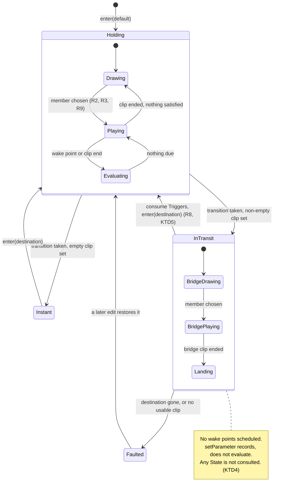

# feat: Clip sets on States, and clips on transitions

## Summary

A State owns one clip today and loops it verbatim, so every idle is the same three seconds
forever. A transition owns no clip at all and resolves instantly, so every move between States is a
hard cut.

This gives both of them an ordered **set** of clips. A State draws one each time its clip loops,
never the same one twice running. A transition with a non-empty set plays one as a **bridge** — an
uninterruptible clip that runs to the end and lands in the destination State. A transition with an
empty set keeps today's instant cut, so nothing that exists changes behaviour.

The manifest goes to version 3 and v2 Worlds migrate rather than being refused.

---

## Problem Frame

The DJ-booth World being built has a couch, a booth and a dance floor. `couch idle` wants eight or
ten idle variations — a shift, a nod, a look around — because one idle looped forever reads as a
frozen puppet. Walking from the couch to the booth wants to be seen, not cut to, and it wants two or
three different walks for the same reason.

Neither is expressible now. The machine's shape is right; what it holds is too narrow.

**Why a bridge rather than an entry/exit pair.** The camera model this replaced had Cuts made of an
exit clip and an entry clip, joined at a camera change. There are no cameras now, so a move between
States is one continuous piece of footage. One clip, not two.

---

## Requirements

| ID | Requirement |
|---|---|
| R1 | A State holds an ordered set of clips, zero or more. |
| R2 | Each time a State's clip loops, one member is drawn uniformly at random. |
| R3 | A draw never repeats the member that just played, unless the set has one member. |
| R4 | A transition holds an ordered set of clips, zero or more. |
| R5 | A transition with an empty set is taken instantly, exactly as today. |
| R6 | A transition with a non-empty set draws one member and plays it as a bridge before the destination State begins. |
| R7 | A bridge is uninterruptible: nothing is evaluated while it plays, and it always lands. |
| R8 | Conditions are evaluated afresh at the destination once a bridge lands. |
| R9 | An unusable member is skipped by the draw; a State or transition faults only when no member is usable. |
| R10 | `world-live` says when the machine is in transit, and which transition it is crossing. |
| R11 | A World written at version 2 opens as version 3, each State's single clip becoming a one-item set. |
| R12 | A clip is assigned into a set by browsing, and a set's order is authored. |
| R13 | The graph reports a State with no clips, and separately a State whose clips are all unusable. |

---

## Key Technical Decisions

### KTD1 — `clips: ClipRef[]` replaces `clip`, rather than joining it

Keeping both would give every reader two places to look and a rule about which wins. The blast
radius of replacing it is known and enumerated in U2's file list; the blast radius of two sources of
truth is not.

`docs/solutions/a-lane-is-a-property-of-the-machine-not-of-the-app.md` is the governing learning: when
one value becomes a countable collection, every reader that assumed "the one" keeps working on the
first member and looks correct. A new picker function existing is not evidence the readers were
updated. U2 lists them exhaustively for that reason.

### KTD2 — The migration runs where the manifest is parsed, not "on open"

`WorldStore.mutate` re-reads the manifest from disk inside its lock and applies the edit to that
fresh read, not to the caller's in-memory World. A migration that ran only on open would be reverted
by the first mutation.

It therefore belongs in `rebuild()` — the single point a parsed value becomes a `World` — and must
**spread the parsed value first**, then override, per
`docs/solutions/rebuilding-a-cache-field-by-field-turns-a-read-into-a-delete.md`. Every branch that
produces a `World` gets the same treatment: the normal path, the migration path, and the
corruption fallback. That doc's own postscript is that the second instance of the bug lives in the
fallback branch.

### KTD3 — Migrating is a new precedent, and is justified because it invents nothing

The version gate was built to *refuse*: a camera-era manifest parses as a machine with no States, and
inventing States from Scene/Position pairings would have been a guess presented as the author's work.

This boundary is not that. `clip` → `[clip]` is total, reversible and adds no information. A
`clip: null` becomes `[]`, which is its own named rule rather than an inference — today a null clip
already means "legal, no clip", and an empty set means the same thing.

A v3 World opened by a v2 build still hits the existing refusal, unchanged.

### KTD4 — No other wait is armed while a bridge is in flight

This is the invariant the whole bridge design rests on, and it is written here because the residual
in `docs/residual-review-findings/feat-live-scene-worlds.md` about clip-end reports during a mid-clip
wake shows what happens without it: a report resolved the wrong wait and fired a transition early.

A bridge adds a third wait shape. So while a bridge generation is live:

- no exit-time wake points are scheduled,
- `setParameter` records the value but does not evaluate,
- Any State is not consulted — otherwise it is a backdoor around R7.

`reportClipEnd` keeps its existing one-report-per-generation contract; because the bridge holds the
only armed wait, a report can only resolve the bridge's own.

### KTD5 — A Trigger is consumed on landing, not at bridge start

Consuming at the start spends the flag before any State is reached, so a fault mid-bridge leaves the
machine parked with the Trigger gone and nothing to re-fire it — the exact failure a Trigger's design
exists to prevent, relocated.

Consuming on landing is safe precisely because of KTD4: nothing is evaluated during the bridge, so a
Trigger held `true` for its duration cannot be read twice or misfire. If the bridge faults, the
Trigger is still armed and the machine can be driven again.

### KTD6 — The last-drawn member is remembered in memory, not in the manifest

R3 needs to know what just played. Persisting it would mean a manifest write, a broadcast and a full
reports pass on every loop of every clip — against a store that just gained an `unchanged` short
circuit specifically to avoid writes that change nothing.

Memory is per State and per transition, and survives leaving and returning: coming back to `couch
idle` does not immediately replay the idle you last saw there. It resets on restart, which is
acceptable — one possible repeat after a restart is not a defect anyone can see.

### KTD7 — An exit time is a fraction of whichever member is playing

Each member has its own length, so `exitTime: 0.75` lands at a different absolute millisecond
depending on the draw. This is the only coherent reading — the alternative is a fixed millisecond
that means something different for every member — but it makes the panel's "Offered 75% of the way
through the clip" a statement about the clip currently playing rather than a fixed time. U7 updates
that copy.

### KTD8 — In transit is reported as a distinct shape, not as a State

`LiveState.stateId` naming the source during a bridge would be a lie the graph renders as a
highlighted node while different footage plays. Naming the destination early contradicts R8 and makes
the clip-end identity check ambiguous.

So `LiveState` gains an explicit in-transit shape carrying the transition's id, and the graph
highlights the edge rather than a node.

---

## High-Level Technical Design

The machine gains one phase. Everything left of `InTransit` is today's behaviour.

**Where the two draws happen.** `playThrough` already ends with `enter(this.stateId)` to loop — that
re-entry is the State draw, and needs no new scheduling. The bridge draw happens once, when the
transition is taken.

---

## Implementation Units

### U1. The set-shaped domain, and the migration

**Goal:** `clips` replaces `clip` on both a State and a transition, `WORLD_VERSION` becomes 3, and a
v2 manifest becomes a v3 one at the point it is parsed.

**Requirements:** R1, R4, R11.

**Dependencies:** none.

**Files:** modifies `shared/src/worlds.ts`, `shared/src/types.ts`, `server/src/storage/worlds.ts`;
tests in `server/test/storage/worlds.test.ts`.

**Approach:** `WorldState.clip: ClipRef | null` becomes `clips: ClipRef[]`. `Transition` gains
`clips: ClipRef[]`. `IncompleteClip` grows to name which member of which owner is unusable — it is
keyed one-per-State today and a set can have several independently broken members, and a transition
is a new owner of clip paths it has never had to describe.

The migration lives in `rebuild()` per KTD2, spreading first. Two rules, both explicit: a v2 State's
clip becomes a one-item set; a v2 `clip: null` becomes `[]`.

**Execution note:** Characterization first. Before changing the shape, add a test that opens a real
v2 manifest and asserts what it currently produces, so the migration is measured against recorded
behaviour rather than memory.

**Patterns to follow:** the spread-rebuild discipline documented in `server/src/storage/worlds.ts`'s
own comment on `rebuild()`; the version gate and `versionRefusal` beside it.

**Test scenarios:**
- A v2 manifest with a State holding one clip opens as v3 with a one-item set.
- A v2 State with `clip: null` opens with an empty set.
- A v2 manifest survives migration, a mutation, and a reopen **in a fresh `WorldStore`**, and an
  unknown top-level key and an unknown key on a State both survive all three.
- A v3 manifest opened where `WORLD_VERSION` is 2 is refused read-only, naming the newer build.
- The corruption-fallback branch produces a World whose States have `clips: []`, not `undefined`.
- A migrated World is written to disk only when something else mutates it — opening does not write.

**Verification:** an existing v2 World in the data dir opens, plays, and can be edited; its manifest
on disk is untouched until the first real edit.

---

### U2. Every reader of the old singular shape

**Goal:** nothing still assumes one clip per State, or that a transition has none.

**Requirements:** R1, R4.

**Dependencies:** U1.

**Files:** modifies `server/src/storage/worlds.ts` (`validate`, `resolveClipPath` callers,
`updateState`, `recordClipDuration`), `server/src/live/clips.ts` (`referencedClips`),
`shared/src/world-graph.ts` (`statesWithoutClip`), `server/src/live/runtime.ts`,
`server/src/live/service.ts`, `ui/src/components/StateGraph.tsx`, `ui/src/components/ClipPlayer.tsx`,
`ui/src/graph.ts`; tests in `server/test/storage/worlds.test.ts`,
`server/test/live/clip-route.test.ts`, `ui/test/graph.test.ts`.

**Approach:** enumerate and convert. `referencedClips` must return every member of every set on both
owners, or the clip route stops serving clips the manifest genuinely names. `validate` confines every
member. `recordClipDuration` corrects the member whose path matches, wherever it sits.

This unit is deliberately separate from U1 so the conversion is reviewable as a list rather than
buried in a shape change.

**Patterns to follow:** `docs/solutions/a-lane-is-a-property-of-the-machine-not-of-the-app.md` — the
existence of a picker is not evidence the readers were converted.

**Test scenarios:**
- The clip route serves a member that is second in a State's set.
- The clip route serves a member of a transition's set.
- The clip route refuses a path in the World's `clips/` that no set names.
- `validate` reports two independently broken members of one set as two entries.
- A duration measured for a member corrects that member and leaves its siblings alone.
- `statesWithoutClip` names a State with an empty set and does not name one with two clips.

**Verification:** grep finds no surviving reader of a singular `state.clip`.

---

### U3. Drawing a member, and the two reports

**Goal:** the pure logic — pick a member, and say what is wrong with a set.

**Requirements:** R2, R3, R9, R13.

**Dependencies:** U1.

**Files:** modifies `shared/src/world-graph.ts`; tests in `server/test/live/world-graph.test.ts`.

**Approach:** a `drawFrom(clips, lastPlayed, usable)` that excludes the last-played member unless
excluding it would leave nothing, and excludes members a caller reports unusable. Pure and injectable
so the randomness is testable — the caller supplies the random source, as `shared/` has no business
reaching for one.

`statesWithoutClip` keeps meaning "no clips assigned". A second report names a State or transition
whose set is non-empty and entirely unusable — today's "no clip" mark cannot distinguish "you have
not chosen one" from "the files you chose are gone", and those need different actions from the
author.

**Patterns to follow:** the purity split documented at the top of `shared/src/world-graph.ts` — jsdom
implements no SVG layout, so anything the graph needs to assert lives here.

**Test scenarios:**
- A two-member set never draws the same member twice running, over many draws.
- A one-member set draws that member every time, and R3 does not deadlock it.
- An empty set draws nothing.
- A set whose members are all unusable draws nothing rather than looping on a broken file.
- A set with one usable member and two broken draws only the usable one, repeatedly, without R3
  starving it.
- The all-unusable report names a State with two broken members; it does not name a State with one
  broken and one good.
- Over 1000 draws from a five-member set, every member appears — the exclusion rule does not strand
  one.

**Verification:** the draw is deterministic under an injected source, so a test can assert a
sequence rather than a distribution.

---

### U4. A State draws each loop

**Goal:** the looping half of the feature, with no bridge yet.

**Requirements:** R2, R3, R7 (partially — exit times against the drawn member), R9, KTD7.

**Dependencies:** U3.

**Files:** modifies `server/src/live/runtime.ts`; tests in `server/test/live/runtime.test.ts`.

**Approach:** `enter()` draws rather than reading a single clip, and remembers what it drew for that
State. `durationOf` and `wakePoints` already read `this.clip`, so they follow the draw with no
change of their own — which is what makes KTD7 fall out rather than being implemented.

`usable()` is consulted before a member is committed to, so a broken member is skipped at draw time
rather than faulting the State (R9).

**Execution note:** test-first. The no-repeat rule and the skip-broken rule are both easy to write
plausibly and get subtly wrong, and both are invisible in a one-member set — which is what every
existing fixture builds.

**Patterns to follow:** the generation discipline in `runtime.ts` (`bump`, `supersede`) — a draw
happens inside `enter`, which already bumps.

**Test scenarios:**
- A State with three clips plays a different member on each of the first several loops.
- A State with one clip loops it, unchanged from today.
- An exit time of 0.5 fires halfway through whichever member is playing, across members of different
  lengths.
- A State whose drawn member is missing skips it and plays a usable sibling, with no fault.
- A State whose members are all missing faults, and says so.
- Leaving a State and returning does not immediately replay the member that last played there.
- A restart may replay it — asserted as the accepted behaviour, so a future change to KTD6 is a
  deliberate one.

**Verification:** a World with several idle clips visibly varies between loops when watched.

---

### U5. The bridge

**Goal:** a transition with clips plays one, uninterruptibly, and lands.

**Requirements:** R5, R6, R7, R8, KTD4, KTD5.

**Dependencies:** U4.

**Files:** modifies `server/src/live/runtime.ts`; tests in `server/test/live/runtime.test.ts`.

**Approach:** `take()` gains a branch. With an empty set it behaves exactly as today. With a
non-empty set it draws a member, enters an in-transit phase under its own generation, and waits on
that clip alone.

Three things the existing code does that must be changed rather than inherited, each identified by
the flow analysis because each sits in code whose comment explains why it works as it does:

1. **`setWorld`'s no-restart fast path compares the playing clip against a State's clip.** During a
   bridge that never matches, so every unrelated edit — including the per-keystroke rename the fast
   path exists to absorb — would supersede and truncate the bridge. It needs an explicit in-flight
   branch: while a bridge is live, re-seat the World and leave the bridge alone unless the bridge's
   own transition or drawn member changed.
2. **`setParameter` unconditionally evaluates.** It must record the value and defer the evaluation
   until landing (KTD4).
3. **`take()` re-checks `conditionsHold` after its await.** That check exists for a filesystem race
   measured in milliseconds. A bridge stretches the window to seconds, and R7 says the bridge lands
   regardless — so the re-check does not apply to the bridge's own transition. It still applies to
   the instant path.

A fault surfaces on landing, not mid-bridge: interrupting a clip the design calls uninterruptible to
report a problem the author cannot act on until it ends buys nothing.

**Execution note:** test-first, and write the KTD4 invariant as its own test before the feature —
"nothing else is armed while a bridge is live" is the property everything else depends on.

**Patterns to follow:** `Pending.final` and the generation guards already in `runtime.ts`; the
`MIN_CLIP_MS` / `MAX_CLIP_MS` clamp, which the bridge's own duration must go through rather than
inventing a second timer authority.

**Test scenarios:**
- A transition with no clips is taken instantly, exactly as before.
- A transition with clips plays its clip and only then reports the destination State.
- A Parameter set mid-bridge is recorded, changes nothing until landing, and is honoured immediately
  on arrival.
- An Any State transition whose condition becomes true mid-bridge does not interrupt it.
- A Trigger that fired the bridge is still set mid-bridge and is cleared on landing.
- A bridge that faults leaves its Trigger armed, so the move can be driven again.
- An unrelated State rename mid-bridge does not restart or truncate the bridge.
- Editing the bridge's own transition mid-bridge does supersede it.
- The destination State deleted mid-bridge faults on landing, not before.
- A clip-end report during a bridge resolves the bridge's wait and nothing else.
- A bridge whose members are all unusable faults without playing.
- Two transitions with bridges in sequence: landing from one can immediately begin the next.

**Verification:** driving a Parameter over the protocol with no browser attached plays the bridge for
its full duration and then arrives.

---

### U6. The wire contract and the service

**Goal:** a client can see that the machine is in transit, and can author a set.

**Requirements:** R10, R12.

**Dependencies:** U5.

**Files:** modifies `shared/src/types.ts`, `server/src/live/service.ts`, `ui/src/store.ts`; tests in
`server/test/live/service.test.ts`, `ui/test/store.test.ts`.

**Approach:** `LiveState` gains the in-transit shape from KTD8. New messages add, remove and reorder
a clip within a set, on both owners; `import-clip` gains the owner it is assigning into, since it
currently names a State and nothing else.

`report-clip-end` needs to say whether it is reporting a State's loop or a bridge, or the runtime
cannot tell which wait a report is about when a State and a bridge share a generation number across
a restart.

**Patterns to follow:** the exhaustiveness check in `ui/src/store.ts`'s default branch — a new
`ServerMessage` that no reducer case handles must fail the typecheck, not fall through.

**Test scenarios:**
- Every new client message has a server case; the store's `never` check still compiles.
- Adding a clip to a State's set broadcasts the World and the set's new order.
- Reordering a set persists the order across a reopen.
- Removing the last clip from a set leaves an empty set, not a null.
- `import-clip` assigns into a transition's set as well as a State's.
- A client connecting mid-bridge is greeted with the in-transit shape, not a State.
- A refusal names which owner and which set it was about.

**Verification:** the protocol drives a full couch → walk → booth sequence with no browser attached.

---

### U7. Authoring a set

**Goal:** the graph can build and order both kinds of set, and the player plays a bridge.

**Requirements:** R12, R13, KTD7, KTD8.

**Dependencies:** U6.

**Files:** modifies `ui/src/components/StateGraph.tsx`, `ui/src/components/ClipPlayer.tsx`,
`ui/src/components/ClipBrowser.tsx`, `ui/src/graph.ts`, `ui/src/styles.css`; tests in
`ui/test/components/StateGraph.test.tsx`, `ui/test/components/ClipPlayer.test.tsx`,
`ui/test/components/ClipBrowser.test.tsx`.

**Approach:** the node panel and the transition panel both grow a clip list — add via the browser,
remove, reorder. A node shows how many clips it holds rather than one filename, and carries the two
distinct marks from U3.

`ClipPlayer` plays a bridge the same way it plays a State's clip; the in-transit shape tells it
which. The graph highlights the transition being crossed rather than a node.

The exit-time panel copy changes per KTD7: it describes the clip currently playing, not a fixed time.

**Test scenarios:**
- A node with three clips says so; a node with none carries the "no clips" mark.
- A node whose clips are all unusable carries a different mark from one with none.
- Adding a clip to a set sends the add message with the right owner.
- Reordering sends the order and does not send a spurious move.
- Removing a clip mid-list keeps the rest in order.
- The player swaps source when the machine goes in transit, and again on landing.
- The graph marks the transition as current while in transit and no node as current.
- The clip browser assigns into whichever set it was opened for.

**Verification:** measured against the running instance, not a screenshot — the node's clip count and
the current-transition highlight are read from the computed DOM.

---

### U8. The vocabulary and the residuals

**Goal:** the documents describe the machine that now exists.

**Requirements:** all, indirectly.

**Dependencies:** U7.

**Files:** modifies `CONCEPTS.md`, `AGENTS.md`,
`docs/residual-review-findings/feat-live-scene-worlds.md`.

**Approach:** `CONCEPTS.md`'s **Clip** entry becomes a set and gains the draw rule; **Transition**
gains the bridge; a new entry defines **in transit**. `AGENTS.md`'s subsystem paragraph gains the
bridge invariant from KTD4, which is the thing a future reader most needs to know before touching
`runtime.ts`.

The residual about a mid-clip report being dropped rather than deferred is revisited: a bridge is the
third wait shape it anticipated, and the entry should say how the invariant resolves it.

**Test expectation:** none — this unit changes prose. The signal is that no document describes a
State as holding one clip.

**Verification:** `CONCEPTS.md` and `AGENTS.md` match the shipped code, checked against the diff
rather than from memory.

---

## Scope Boundaries

**Not in this plan:**

- Blending or crossfading. Every join stays a cut; a bridge is a clip, not a transition effect.
- Weighting which member is likelier, or conditions that choose a specific member. The draw is
  uniform.
- Shared, named clip sets. A set belongs to the State or transition that plays it; assigning the same
  file to two transitions costs nothing on disk, since clips are already copied into the World.
- Bridges with their own exit times or wake points. A bridge plays whole.

### Deferred to Follow-Up Work

- Reading a clip's duration server-side so the browser can show it before import. Already recorded as
  a residual; a set makes it more valuable, not less, but it is a separate change.
- A per-viewer browse cursor. Unrelated, and already recorded.

---

## Open Questions

Deferred to implementation, deliberately:

- Whether the in-transit shape carries the drawn member's path or the client resolves it from the
  transition. Depends on what `ClipPlayer` turns out to need to avoid a second round trip.
- Whether the two U3 reports render as two marks or one mark with two reasons. A judgment best made
  against the drawn graph.

---

## Risks

| Risk | Mitigation |
|---|---|
| A reader of the old singular shape survives and works on the first member, looking correct until a set has two. | U2 is a separate, enumerable unit for exactly this; the governing learning says a picker's existence is not coverage. |
| The migration is reverted by the first mutation, because it ran on open rather than at parse. | KTD2, and a test that reopens in a **fresh** store after a mutation. |
| A bridge is truncated by an unrelated edit, because the re-seat fast path does not know about it. | Called out as U5's first required change, with its own test. |
| A Trigger is spent by a bridge that then faults. | KTD5 consumes on landing; tested directly. |
| Existing fixtures all build one-clip States, so the new behaviour is untested behind a green suite. | `docs/solutions/a-removed-precondition-blinds-every-test-that-set-it.md`: new fixtures start multi-member rather than extending single-clip ones. |

---

## Verification

The feature is done when, against a running instance:

- `couch idle` holds several clips and visibly varies between loops.
- `couch idle → booth` plays a walk that runs to the end, with a Parameter flipped mid-walk changing
  nothing until it lands.
- A World authored before this change opens, plays and edits without being touched on disk until
  edited.
- The suite and both typechecks are green, and each new rule has a test that fails without its fix.
