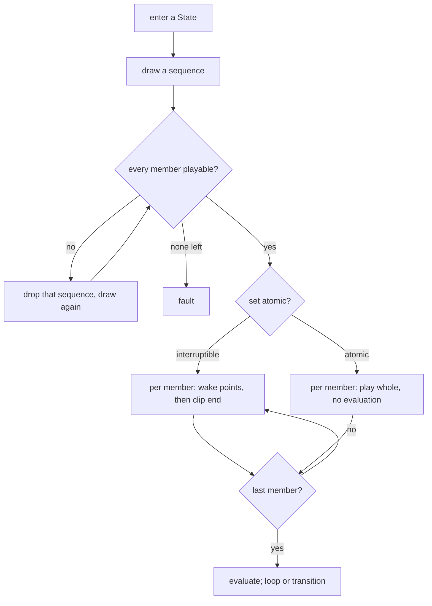

# feat: Clip sequences on States and transitions

## Summary

A clip set becomes a set of sequences. The draw picks a sequence and the runtime plays its
clips in order, on both States and transitions. A State's set carries an atomicity switch
defaulting to today's interruptible behaviour; a transition's set is always atomic. Manifests
move to version 4 at read time, with every existing clip read as a one-clip sequence.

---

## Problem Frame

A clip set is a bag: `drawFrom` picks one member uniformly, avoiding the one that just
played. It cannot express "these two, in this order" — which is what a bridge of *stand* then
*walk* needs, and what a three-beat idle needs on a State.

Two properties constrain the fix. The runtime owns the clock: `playThrough` sleeps to each
wake point and then to the clip's end, and every wait is guarded by a generation so a
superseded pass cannot resolve a live one. And a crossing evaluates nothing at all —
`reportClipEnd` refuses a client report while `crossing` is set, because the server's timer is
the authority for a bridge. A sequence is a second clip boundary inside both of those, so it
is the generation guard and the crossing invariant that decide the shape, not the data model.

The store already migrates forward: `migrateEntries` and `migratedVersion` bring a
pre-version-3 manifest up on load, and `rebuild` spreads the parsed value rather than naming
fields. Version 4 follows that path rather than inventing one.

---

## Requirements

Carried from the origin document (see origin: `docs/brainstorms/2026-09-02-clip-sequences-requirements.md`).
R1–R15 are that document's IDs and are referenced by unit below.

- The model: R1–R5 — sets hold sequences, the draw picks a sequence, a one-clip sequence is
  today's clip, empty sets are unchanged, version rises with a read-time migration.
- Playback: R6–R10 — the atomicity switch, per-clip exit time when interruptible, no
  evaluation at all when atomic, transitions always atomic, a Parameter set mid-run acted on
  when the run lands.
- Authoring: R11–R13 — one flat list with a link control and a run bracket, reorder controls on
  a transition's set, everything reachable over the protocol.
- Reporting: R14–R15 — a sequence with an unplayable member leaves the draw whole, and the
  reports name an owner with nothing left to draw.

Added during planning:

- R16. An atomic State run has no length ceiling. A run longer than the bridge ceiling is
  reported, not refused, so the author sees the freeze they authored.

---

## Key Technical Decisions

**Version 4, migrated on load, one-way.** `migratedVersion` already promotes an old manifest to
the current version on the way in, and `versionRefusal` refuses to *write* a foreign version.
Widening `OLDEST_MIGRATABLE`'s window to cover 3 means a version-3 World loads, plays and saves
as version 4 with no conversion step — and stops loading in the previous build, which is the
same trade the version-3 bump made.

**A sequence is a wrapper, not a flag.** `ClipRef[]` becomes `ClipSequence[]` where a sequence
holds `clips: ClipRef[]`. The atomicity switch rides on the owner's set rather than on a
sequence, matching what the brainstorm settled; the wrapper is what leaves room to move it
per-sequence later without a second version bump.

**`drawFrom` picks sequences; the avoid-repeat key becomes the sequence.** `lastPlayed` holds a
clip path today. It becomes a sequence identity, so "never the one that just played" keeps
meaning a whole gesture rather than a member of one.

**A run is a chain of waits under one generation.** `playThrough` gains an outer walk over the
drawn sequence's members. The generation guard after every await stays exactly as it is — a
superseded run returns at its next member boundary, which is what already happens at a clip
boundary today.

**Atomic means the wake-point schedule is empty.** An atomic set computes no wake points and
does not offer a clip-end evaluation until the last member ends. This reuses the mechanism that
already makes a State with no clip never wake, rather than adding a second suppression path.

**A client is told the member, not just the clip.** `LiveState.clip` keeps naming what should be
on screen. What is added is which member of which run it is, so `reportClipEnd` can refuse a
report for a member that is not the one being waited on — the same triple check that already
stops two tabs advancing the machine twice. The flat-vs-union residual on `LiveState` is not
addressed here.

**A sequence is excluded whole.** `usableDraw` resolves candidates in parallel today. It gains
a member-level fold: a sequence is a candidate only when every member resolves. A set with no
surviving sequence faults exactly as an all-broken set does now.

---

## High-Level Technical Design

The draw and playback path, with the atomic branch:

A transition's bridge takes the atomic branch unconditionally, inside the existing `crossing`
guard — the run replaces the single bridge wait and nothing else about the crossing changes.

---

## Implementation Units

### U1. The sequence in the manifest, and the migration to version 4

**Goal:** `WorldState.clips` and `Transition.clips` hold sequences; a version-3 manifest loads
as one-clip sequences.

**Requirements:** R1, R3, R4, R5.

**Dependencies:** none.

**Files:** `shared/src/worlds.ts`, `server/src/storage/worlds.ts`,
`server/test/storage/worlds.test.ts`.

**Approach:** Add `ClipSequence` and change both owners' `clips` to `ClipSequence[]`. Bump
`WORLD_VERSION` to 4 and widen the migration window so `migrateEntries` wraps each bare
`ClipRef` in a one-clip sequence. `cleanClips` becomes a sequence validator: it drops a
malformed sequence, drops a malformed member within one, and drops a sequence left empty.
`MAX_CLIPS_PER_SET` continues to bound the set — decide whether it counts sequences or total
members and state it in the constant's comment.

**Patterns to follow:** `migrateEntries` and `migratedVersion` for the read-time promotion;
`rebuild`'s spread for fields this build does not name.

**Execution note:** Add the reopen-and-write-again test before changing the store — a persisted
field that survives one write and not the next is the failure this area has already had.

**Test scenarios:**
- Covers R5. A version-3 manifest on disk loads with each clip as a one-clip sequence and its
  version reported as 4.
- Covers R5. That same World, saved and reloaded, still holds the sequences and has not lost the
  atomicity field or any key the build does not name.
- A version-2 manifest still migrates forward through the widened window.
- A version-5 manifest is still refused rather than written.
- A sequence whose members are all malformed is dropped; a sequence with one malformed member
  keeps its surviving members.
- A set exceeding the size bound is clamped, and the bound's unit matches its documented meaning.

**Verification:** An existing World in the data dir opens, plays and saves without the author
seeing any change.

---

### U2. The draw picks a sequence

**Goal:** `drawFrom` returns a sequence; avoid-repeat is per sequence; a sequence with any
unplayable member leaves the draw.

**Requirements:** R2, R14.

**Dependencies:** U1.

**Files:** `shared/src/world-graph.ts`, `server/src/live/runtime.ts`,
`server/test/live/world-graph.test.ts`, `server/test/live/runtime.test.ts`.

**Approach:** `drawFrom` takes sequences and the last-played sequence identity. `usableDraw`
folds member verdicts per sequence rather than filtering a flat list — keep the single
`Promise.all` over all members so a set of ten sequences is still one round of filesystem
reads. `lastPlayed` stores the drawn sequence's identity; `commitDraw` still records only what
actually reached the screen.

**Patterns to follow:** the existing `usableDraw` parallel resolve, and `commitDraw`'s rule that
a clip abandoned before playing is not remembered.

**Test scenarios:**
- Covers R2. A set of two sequences never draws the same one twice running; a set of one draws
  it every time.
- Covers R14. A set holding a three-member sequence and a one-member sequence, with one member
  of the long sequence unresolvable, only ever draws the short one.
- Covers R14. When no sequence survives, the draw returns nothing and the caller faults.
- A sequence abandoned before its first member played is not recorded as last-played.

**Verification:** Repeated entries into a State cycle through its sequences without repeating a
run back to back.

---

### U3. The runtime plays a run

**Goal:** `playThrough` walks the drawn sequence's members under one generation, looping the
whole run.

**Requirements:** R7 (interruptible timing), R3.

**Dependencies:** U2.

**Files:** `server/src/live/runtime.ts`, `server/test/live/runtime.test.ts`.

**Approach:** Wrap the current single-clip body in a walk over the run's members. Each member
computes its own wake points and its own end wait; the generation check after every await is
unchanged. `enter` re-draws at the end of a completed run, not between members. The broadcast
updates per member so a watching client plays the right file.

**Test scenarios:**
- Covers AE2. A State with an interruptible three-member run and an outgoing transition at exit
  time 0.75 offers that transition three times per pass, at each member's three-quarter point.
- A run whose second member is reached after the World is edited underneath it returns at that
  boundary rather than playing on.
- A transition without Has Exit Time taken during the second member cuts that member, as it cuts
  a clip today.
- A one-member run behaves identically to a single clip: same wake points, same loop.
- Covers R3. A clip-end report naming a member that is not the one being waited on is refused.

**Verification:** A World with a three-clip idle plays the three in order and repeats the run.

---

### U4. Atomicity on a State's set

**Goal:** A State's set carries the switch; an atomic run suppresses all evaluation until it
lands.

**Requirements:** R6, R8, R10, R16.

**Dependencies:** U3.

**Files:** `shared/src/worlds.ts`, `server/src/storage/worlds.ts`,
`server/src/live/runtime.ts`, `server/test/live/runtime.test.ts`.

**Approach:** Add the switch to `WorldState` and to `StatePatch`, defaulting to interruptible so
migrated Worlds are unchanged. When atomic, `wakePoints` returns empty for every member and the
clip-end evaluation is offered only after the last member. A Parameter set mid-run follows the
crossing precedent: recorded and broadcast, evaluated on landing. A client clip-end report is
refused for the duration of an atomic run, the same reason `reportClipEnd` refuses one during a
crossing.

**Test scenarios:**
- Covers AE3. A Parameter changed during the first member of an atomic three-member run changes
  nothing until the run ends, then is evaluated once.
- Covers R8. An Any State transition whose conditions hold throughout an atomic run does not fire
  until the run ends.
- Covers R8. An exit time set on a transition out of an atomic State produces no mid-run wake.
- Covers R6. A migrated World's States are interruptible and behave as before.
- A Trigger raised during an atomic run is still armed when the run ends and is consumed once.
- An atomic run superseded by a World edit still returns at a member boundary.

**Verification:** Setting a Parameter part-way through an atomic idle visibly waits for the
gesture to finish.

---

### U5. A transition's bridge plays a run

**Goal:** A multi-clip bridge plays its members in order inside the existing crossing, always
atomic.

**Requirements:** R9, R10.

**Dependencies:** U3.

**Files:** `server/src/live/runtime.ts`, `server/test/live/runtime.test.ts`.

**Approach:** `cross` draws a sequence and waits each member in turn, holding `crossing` for the
whole run. Everything the crossing already does at its end — re-resolving the destination,
re-verifying the landing clip, consuming Triggers against the current transition, committing the
draw — happens once, after the last member, in the order it happens today. No switch is read
here.

**Test scenarios:**
- Covers AE1. A two-member bridge plays both members whole and then lands, with no evaluation
  between them.
- A client clip-end report arriving between the two members is refused.
- A Parameter set during the bridge is recorded and evaluated on landing, once.
- A destination State deleted during the second member faults rather than landing.
- A bridge whose drawn sequence has an unplayable member draws a different sequence; a set with
  none playable faults with the existing message.
- A Trigger held through a multi-member bridge is consumed on landing, and survives a bridge that
  faults.

**Verification:** The two-clip bridge from the origin document plays stand then walk, then the
destination State begins.

---

### U6. Reports: unusable sequences and long atomic runs

**Goal:** The reports name an owner with nothing drawable, and warn about an atomic run longer
than the bridge ceiling.

**Requirements:** R14, R15, R16.

**Dependencies:** U1, U2.

**Files:** `shared/src/world-graph.ts`, `shared/src/worlds.ts`,
`server/test/live/world-graph.test.ts`.

**Approach:** `allClipsUnusable` counts at sequence granularity: an owner is named when every
sequence has at least one broken member. `IncompleteClip` already carries an index into the
owner's set — extend it to locate the member within its sequence so the panel can point at the
right row. Add a long-run report keyed on owner, computed from the sum of a sequence's member
durations against the existing bridge ceiling, and only for atomic sets.

**Test scenarios:**
- Covers AE5, AE6. An owner with one broken member in one of two sequences is not named; one with
  a break in both is.
- Covers R15. A State with sequences but nothing drawable is reported as unusable, not as having
  no clip.
- Covers R16. An atomic set whose longest run exceeds the ceiling is reported; the same set marked
  interruptible is not; a transition set of the same length is reported under the existing bridge
  rule.
- The incomplete-clip entry locates the broken member within its sequence.

**Verification:** The reports pane names a World whose atomic idle runs for a minute.

---

### U7. The protocol: link, split, and the switch

**Goal:** Every set edit the panel performs is expressible over the wire.

**Requirements:** R13, R6.

**Dependencies:** U1.

**Files:** `shared/src/types.ts`, `server/src/storage/worlds.ts`, `server/src/live/service.ts`,
`server/test/live/service.test.ts`.

**Approach:** `StatePatch` and `TransitionPatch` continue to carry the whole next array, now of
sequences — linking and splitting are expressed by the array the client sends, so no new message
type is needed and the whole-array primitive an agent uses stays one shape. `StatePatch` gains the
atomicity switch. `import-clip` appends a one-clip sequence.

**Patterns to follow:** the existing patch handlers in `updateState` and `updateTransition`; the
`ClipOwner` shape that already addresses both owners.

**Test scenarios:**
- A patch that replaces two one-clip sequences with one two-clip sequence is stored and broadcast.
- The reverse split is stored.
- A patch setting the atomicity switch on a State is stored; the same field on a transition patch
  is rejected or ignored, and the test names which.
- A patch carrying a malformed sequence is cleaned rather than refused wholesale.
- `import-clip` appends a one-clip sequence to the named owner's set.

**Verification:** An agent can build a two-clip bridge over the protocol with no UI involved.

---

### U8. The panel: one list, link controls, run brackets

**Goal:** The author links and splits adjacent rows, sees the runs, and reorders both owners'
sets.

**Requirements:** R11, R12, R6.

**Dependencies:** U7.

**Files:** `ui/src/components/StateGraph.tsx`, `ui/src/styles.css` (or the live pane's stylesheet),
`ui/test/components/StateGraph.test.tsx`.

**Approach:** Flatten the set to rows for rendering, with a link/unlink control between adjacent
rows and a bracket spanning each run of two or more. Linking sends the merged array; unlinking
sends the split. Reordering moves a whole run when the row is part of one, and the transition
panel gains the same ↑/↓ the State panel has. The State panel gains the atomicity switch with copy
saying what it costs. Replace the "the order is yours to arrange" note, which is now false.

**Patterns to follow:** `useClipEdit`'s wait-for-the-round-trip guard — every new control is
disabled while an edit is in flight, for the reason that guard exists.

**Test scenarios:**
- Linking two adjacent rows sends one array holding one two-member sequence.
- Unlinking a run of three at its middle sends two sequences.
- Reordering a row inside a run moves it within the run; reordering a run moves the whole run.
- The transition panel's reorder controls send the reordered set.
- Every link, split, reorder and switch control is disabled while an edit is in flight.
- Toggling the atomicity switch sends exactly one patch.

**Verification:** Screenshot of a State panel showing a bracketed two-clip run and the switch.

---

### U9. Documentation

**Goal:** The vocabulary and the agent guide describe what the machine now does.

**Requirements:** none directly; required by the repo's own conventions.

**Dependencies:** U1–U8.

**Files:** `CONCEPTS.md`, `AGENTS.md`, `docs/residual-review-findings/feat-live-clip-sets-and-bridges.md`.

**Approach:** Add **Sequence** to the live vocabulary and rewrite **Clip set** — it currently says
a set is "a bag with a stable arrangement rather than a sequence", which this change makes false.
Add the atomicity switch to the State entry and note that a transition's set is always atomic.
Update the `server/src/live/` paragraph in the agent guide. Discharge the two residuals this
change closes: presentational order, and the missing transition reorder controls.

**Test expectation:** none — documentation.

**Verification:** No sentence in `CONCEPTS.md` or `AGENTS.md` describing clip sets is still true
only of the pre-sequence behaviour.

---

## Scope Boundaries

**Deferred for later** (from origin)

- One-shot States as a way to compose sequences out of the graph.
- Element-addressed set operations; the whole-array patch and its two-client race stay.
- Weighted draws, or a fixed rotation instead of a random pick.
- Blending or crossfading between members.

**Deferred to follow-up work**

- The `LiveState` flat-vs-union residual. U3 adds what a client needs to identify a member without
  restructuring the shape.
- Moving the atomicity switch from the set to the sequence. The wrapper in U1 leaves room; nothing
  here needs it.

---

## Risks

**A member boundary is a second place a stale wait can resolve.** The subsystem has already had a
bug where two armed waits let a report resolve the wrong one. Every member boundary must re-check
the generation the same way a clip boundary does, and U3 and U5 each carry a test for a run
superseded mid-way.

**Migration is one-way.** A World opened by this build no longer loads in the previous one. This
matches the version-3 bump and is stated in U1 rather than discovered.

**An atomic run with no ceiling can freeze the machine for as long as the author's clips run.**
Chosen deliberately; U6's report is what makes the cost visible instead of hidden.

---

## Sources & Research

- `shared/src/worlds.ts` — `WORLD_VERSION`, `WorldState`, `Transition`, `ClipRef`, `LiveState`,
  the patch types, `MAX_CLIPS_PER_SET`.
- `server/src/storage/worlds.ts` — `migrateEntries`, `migratedVersion`, `versionRefusal`,
  `rebuild`, `cleanClips`.
- `server/src/live/runtime.ts` — `playThrough`, `wakePoints`, `draw`/`commitDraw`/`usableDraw`,
  `cross`, `reportClipEnd`, the generation guard.
- `shared/src/world-graph.ts` — `drawFrom`, `allClipsUnusable`, `worldReports`.
- `ui/src/components/StateGraph.tsx` — `NodePanel`, `TransitionPanel`, `useClipEdit`,
  `TransitionOrder`.
- `docs/solutions/rebuilding-a-cache-field-by-field-turns-a-read-into-a-delete.md` — why U1's
  reopen-and-write-again test comes first.
- `docs/residual-review-findings/feat-live-clip-sets-and-bridges.md` — the two residuals U8 and U9
  discharge.
