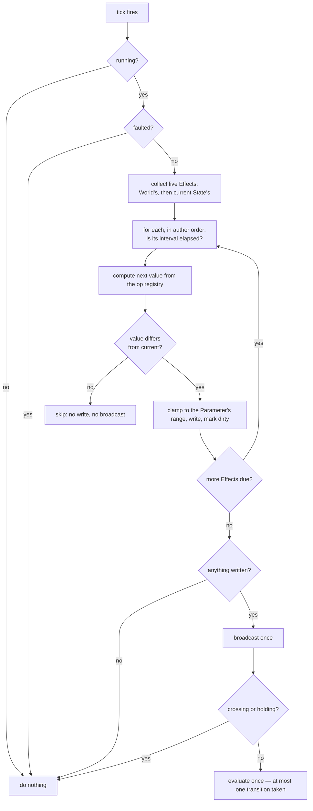
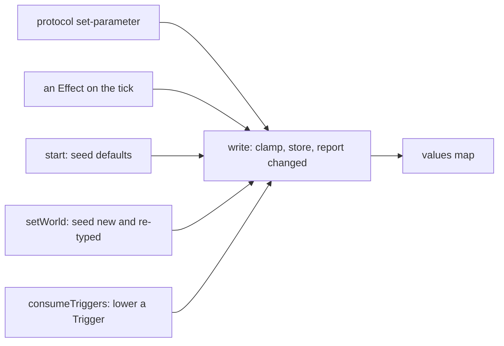

# feat: Effects — a World changes its own Parameters over time

## Summary

An Effect applies one named operation to one Parameter on an interval. Effects attach
to a State, where they run while the machine is in it, or to the World, where they run
whatever the machine is doing. A single ticker walks every live Effect, applies the
writes due, and evaluates the machine once. Parameters gain an optional range, and
every write — including the seeding of defaults at start — is clamped to it.

---

## Problem Frame

The machine already advances on its own clock: exit time and clip end fire from the
server's timer with nothing watching. What no World can do is change a *Parameter*
with time, so nothing conditions read can express "because time passed" (see origin:
`docs/brainstorms/2026-09-02-parameter-effects-requirements.md`).

Two properties of the runtime shape the work more than the feature description does.

**Writing is not evaluating.** `setParameter` writes and then evaluates, unless a
crossing or an atomic run is holding — in which case it records and broadcasts without
acting. Effects inherit that rule rather than introducing a second one.

**Evaluation is where the danger is.** `onTrigger` claims a generation with
`supersede()` before `take()` awaits anything. A write that evaluates on every fire
would let a fast Effect supersede an in-flight transition repeatedly and starve the
move entirely. Evaluating once per tick instead of once per write is what makes the
feature safe, and it is the plan's central structural decision.

The origin document's own assumption that Parameter writes already funnel through one
method is false: `start()`, `setWorld()` and `consumeTriggers()` all write the value
map directly. The single clamped write path is therefore construction, not a refactor.

---

## Requirements

Carried from the origin document. R1–R25 are that document's IDs.

- The Effect: R1–R8 — shape, the seven-op vocabulary and its single registration point,
  type applicability, discarded impossible results, ops that require a declared range,
  no Effects on Triggers, interval validation, an Effect-count bound.
- Scope and timing: R9–R14 — a State's Effects run per visit not per clip loop, none
  fire while crossing, World Effects suspend under a fault, per-tick order and a single
  evaluation, no-change writes evaluate nothing, writes during a crossing act on
  landing.
- Parameters: R15–R19 — optional range, every write clamped including seeding,
  narrowing re-clamps, an unusable range degrades and reports, no range means today.
- Safety and reporting: R20–R22 — one ticker with a stated lifecycle, a second-order
  cascade cap, a report for an Effect naming a missing Parameter.
- Authoring: R23–R25 — both scopes editable, a live write must not overwrite an edit in
  progress, everything reachable over the protocol.

Added during planning:

- R26. A `bounce` Effect remembers its direction in memory, not in the manifest. At a
  value between the bounds nothing on disk says which way it was travelling.

---

## Key Technical Decisions

**The tick owns evaluation; `setParameter` keeps owning single writes.** A new internal
write path applies a value and reports whether it changed anything, without evaluating.
`setParameter` becomes that write plus an evaluation, so the protocol path behaves
exactly as it does now. The tick applies every due write through the same path and then
evaluates once. This is what makes R12 and R13 true rather than aspirational, and it
keeps the existing single-write behaviour untouched.

**The ticker is a field beside `pending`, not a second `pending`.** `pending` is the
clip wait, cleared by `supersede` and `clearPending`. The tick is a separate handle,
armed in `start` and cleared in `stop` only. Nothing else touches it. Stating that as a
rule matters more than usual here: every timing bug this subsystem has had came from
one wait being cleared by something that should not have cleared it.

**Effect liveness is computed per tick, not cached.** On each tick the runtime asks
which Effects are live — the World's always, the current State's only when the machine
is seated in a State and not crossing — rather than maintaining an armed set across
`enter`, `setWorld` and `cross`. A cache would need invalidating in five places; the
computation is a filter over a short array.

**A visit id, not a call count, defines "entered".** `enter()` runs once per clip loop,
so an interval keyed to `enter` would restart on every loop and a five-second Effect on
a three-second clip would never fire. The runtime gains a monotonic visit counter that
increments only on arriving at a State from elsewhere. A State Effect's interval is
measured from the visit's start.

**One op registry, in shared.** Each op is an entry naming which Parameter types it
applies to, whether it needs a declared range, and how it computes the next value from
the current one plus its operand. Validation, the panel's offerability rule (R3, R5) and
the runtime all read that one table, which is what makes adding an op a one-file change.

**A range is validated on the way in and again on the way out.** `declareParameter`
cleans a range the client supplied; the load path treats a manifest's unusable range as
absent and reports it. Both are needed because a World arrives from another machine
with a manifest nobody validated.

---

## High-Level Technical Design

One tick, in order:

The clamp point, and what routes through it:

---

## Implementation Units

### U1. The Effect and the range in the manifest

**Goal:** `Effect` exists, both owners carry a list of them, and an Int or Float
Parameter carries an optional range.

**Requirements:** R1, R15, R19.

**Dependencies:** none.

**Files:** `shared/src/worlds.ts`, `server/src/storage/worlds.ts`,
`server/test/storage/worlds.test.ts`.

**Approach:** Add `Effect` (target Parameter name, op, operand, interval) and
`effects?: Effect[]` to `WorldState` and `World`. Add `min?: number` and `max?: number`
to `Parameter`. All four fields optional, so a World written before this change parses
unchanged and `WORLD_VERSION` does not move — the manifest's own rule bumps for changed
meaning, not for additions, and `rebuild`'s spread already carries unknown keys.

**Patterns to follow:** `rebuild`'s spread and the note above it; `cleanClips` for the
shape of a client-input sanitiser that rebuilds rather than trusts.

**Execution note:** Add the reopen-and-write-again test before the store changes — a
persisted field that survives one write and not the next is the failure this area has
had.

**Test scenarios:**
- Covers AE14. A World authored before this change loads, saves and reloads with no
  effects and no ranges, and its version is unchanged.
- A World carrying effects and ranges survives a load, an unrelated mutation and a
  reopen with both intact.
- A manifest whose `effects` is not an array, or holds a non-object entry, loads with
  those entries dropped and the rest kept.
- A Parameter carrying `min` without `max` keeps the one bound it has.

**Verification:** An existing World in the data dir opens and plays with no change the
author can see.

---

### U2. The op registry

**Goal:** One table defines every operation: which types it applies to, whether it needs
a range, and how it computes the next value.

**Requirements:** R2, R3, R4, R5, R6, R26.

**Dependencies:** U1.

**Files:** `shared/src/effects.ts` (new), `shared/src/types.ts`,
`server/test/live/effects.test.ts` (new).

**Approach:** A record keyed by op name — `set`, `add`, `multiply`, `random`, `copy`,
`toggle`, `bounce` — each entry naming applicable Parameter types, whether a declared
range is required, and a pure function from current value, operand and context to the
next value. Triggers are not an applicable type for any op (R6). `bounce` takes a
direction from the context and returns the next direction alongside the value, which is
what U4 stores in memory. A computed result the target type cannot hold — a fractional
Int, a non-finite Float — is returned as "no value", which the caller treats as a
discard rather than a coercion (R4).

**Technical design (directional):** an entry is roughly
`{ types, needsRange, apply(current, operand, ctx) -> { value, direction? } | null }`.
The null return is the discard path; `ctx` carries the Parameter's range, the source
Parameter's value for `copy`, the random source, and the current bounce direction.

**Patterns to follow:** `shared/src/world-graph.ts` for pure shared logic with an
injected random source, which is what makes a draw assertable in a test.

**Test scenarios:**
- Covers AE6. `bounce` from 0 in a 0..2 range yields 1, 2, 1, 0, 1, 2 across six
  applications, reversing at each bound.
- `bounce` starting mid-range travels in the direction it is given rather than guessing.
- Covers AE7. `add 1` on a 0..2 range yields 1, 2, 2, 2 — it pins where `bounce`
  reflects.
- `multiply` by 1.5 on an Int returns no value rather than a fractional one.
- `add` that would reach a non-finite Float returns no value.
- `random` on a Parameter with no declared range is not applicable.
- `copy` between Parameters of different types is not applicable.
- `toggle` applies to a Bool and not to an Int, a Float or a Trigger.
- No op declares a Trigger among its applicable types.

**Verification:** Adding a hypothetical eighth op requires an edit to this file and
nowhere else.

---

### U3. The clamped write path

**Goal:** One method applies a value: clamped, validated, reporting whether anything
changed. Every writer routes through it.

**Requirements:** R13, R16, R17, R18.

**Dependencies:** U1.

**Files:** `server/src/live/runtime.ts`, `shared/src/world-graph.ts`,
`server/test/live/runtime.test.ts`.

**Approach:** A private write that clamps to the Parameter's usable range, rejects a
value the type cannot hold, stores it, and returns whether it differed from what was
there. `setParameter` becomes that write plus the existing evaluation, so the protocol
path is unchanged in behaviour. The three direct writers — `start()` and `setWorld()`
seeding defaults, `consumeTriggers()` lowering a Trigger — route through it too, which
is what makes R16 true at boot rather than only after the first Effect fires. A range
helper in `world-graph.ts` answers whether a declared range is usable and clamps to it,
treating a non-finite bound or a min above its max as no range at all (R18).

**Test scenarios:**
- Covers AE8. An agent setting a ranged Parameter past its max over the protocol leaves
  it holding the max.
- Covers AE9. A Parameter whose stored default is outside its range holds the clamped
  value from the moment the World starts.
- Covers AE13. A Parameter whose manifest carries a min above its max behaves as
  though it declared no range.
- A non-finite bound is treated as absent rather than producing NaN from the clamp.
- Narrowing a range under a running World re-clamps the live value on the next re-seat.
- A write producing the value already held reports no change.
- A Trigger lowered by consuming a transition still lowers.
- Covers AE14. Every existing runtime test passes unchanged, since no existing World
  declares a range.

**Verification:** No path writes the values map directly; the clamp cannot be bypassed
by adding a caller.

---

### U4. The ticker

**Goal:** One repeating tick applies every due Effect and evaluates the machine once.

**Requirements:** R9, R10, R11, R12, R14, R20, R26.

**Dependencies:** U2, U3.

**Files:** `server/src/live/runtime.ts`, `server/test/live/runtime.test.ts`.

**Approach:** A tick handle armed in `start` and cleared in `stop`, and touched nowhere
else — not by `supersede`, not by `setWorld`, not by a fault. Each tick computes the
live Effect list (the World's always; the current State's only when seated and not
crossing), walks it in order applying due writes through U3's path, and evaluates once
if anything changed. Per-Effect state — last fired, and `bounce` direction — lives in a
map beside `lastPlayed`, keyed by owner and position, in memory for the same reason
that one is: persisting it would mean a write and a broadcast on every tick. A visit
counter increments only on arriving at a State from elsewhere; a State Effect's interval
is measured from the visit, so a clip loop does not restart it. While the World holds a
fault, the tick does nothing (R11).

**Execution note:** Write the "a five-second Effect fires on a three-second clip"
scenario first. It is the one the naive implementation fails.

**Test scenarios:**
- Covers AE1. A State with a 2000ms Effect and a shorter clip raises its Parameter twice
  across five seconds, the clip looping throughout.
- Covers AE2. Leaving and returning to that State puts the first rise a full interval
  after the arrival.
- Covers AE3. A State Effect does not fire during a crossing out of its State.
- Covers AE4. A World Effect fires throughout a bridge, and the machine evaluates once
  on landing.
- Covers AE5. A faulted World writes nothing on a tick and emits no second fault.
- Covers AE10. Two Effects on one State — set, then add — leave the Parameter at the
  sum, and do so even when a transition is conditioned on the intermediate value.
- Covers AE11. An Effect writing the value already held evaluates nothing and broadcasts
  nothing.
- Covers AE12. Two States whose Effects drive each other move the machine at most once
  per tick.
- A transition that becomes eligible from a tick's write is taken once, not once per
  Effect in the batch.
- An Effect firing faster than the destination's usability check does not prevent the
  transition completing.
- The tick survives a transition, a World edit and a supersede; it stops on `stop` and
  fires nothing afterwards.
- The tick does not hold the process open (it is unref'd, as the clip wait is).
- `bounce` direction survives across ticks within a visit.

**Verification:** A World with a bouncing Effect visibly walks its value up and down
with nothing driving it.

---

### U5. Reports and the graph

**Goal:** The World reports an Effect naming a missing Parameter, and an unusable range.

**Requirements:** R18, R22.

**Dependencies:** U1.

**Files:** `shared/src/world-graph.ts`, `shared/src/worlds.ts`,
`server/test/live/world-graph.test.ts`.

**Approach:** Two additions to `WorldReports`, computed in `worldReports` alongside dead
ends and unreachable States: Effects whose target Parameter is not declared, and
Parameters whose declared range is unusable. Both are pure functions over the World, so
the server answers them over the protocol and the graph draws the same result.

**Patterns to follow:** `statesWithoutClip` and `allClipsUnusable` — each report states
what it claims and no more.

**Test scenarios:**
- An Effect naming a Parameter that does not exist is reported, with its owner.
- An Effect on a World with no Parameters at all is reported rather than throwing.
- A Parameter with min above max is reported; one with a usable range is not.
- A World with no Effects reports neither, and the existing reports are unchanged.

**Verification:** Deleting a Parameter an Effect writes surfaces in the reports pane
rather than silently doing nothing.

---

### U6. The protocol

**Goal:** Effects and ranges are authorable over the wire.

**Requirements:** R7, R8, R25.

**Dependencies:** U1, U2.

**Files:** `shared/src/types.ts`, `server/src/storage/worlds.ts`,
`server/src/live/service.ts`, `server/test/live/service.test.ts`.

**Approach:** `StatePatch` gains `effects`, and a World-level message sets the World's.
`DeclareParameterMessage` carries an optional range. The store sanitises both the way
`cleanClips` sanitises a set: an interval that is not a finite positive number is
replaced by the default and one below the floor is raised to it, written as a positive
test so a NaN cannot pass through a negated comparison — the failure
`docs/solutions/a-threshold-guard-written-as-a-negation-fails-open-on-nan.md` records.
A set exceeding the Effect-count bound is refused whole rather than trimmed, matching
what an oversized clip set does.

**Test scenarios:**
- A patch adding two Effects to a State is stored and broadcast.
- A patch setting the World's Effects is stored and broadcast.
- An interval of NaN, of a string, of zero and of a negative number each land on the
  default rather than passing through.
- An interval below the floor is raised to the floor.
- A set exceeding the Effect-count bound is refused and the World is unchanged.
- An Effect naming an op this build does not know is dropped, and the rest are kept.
- Declaring a Parameter with a range stores it; declaring one with min above max stores
  no range.
- An Effect edit that does not mention a field leaves that field untouched.

**Verification:** An agent can author a bouncing `dj_swing` end to end with no UI.

---

### U7. The panel

**Goal:** Effects are authorable on both scopes, ranges are editable, and a live write
does not eat an edit in progress.

**Requirements:** R23, R24.

**Dependencies:** U6.

**Files:** `ui/src/components/StateGraph.tsx`, `ui/src/styles.css`,
`ui/test/components/StateGraph.test.tsx`.

**Approach:** An Effect editor rendered in two places — a State's panel and the
Parameters panel for the World's — sharing one component the way the clip-set editor is
shared across both owners. The op picker offers only ops applicable to the target
Parameter's type and range, read from U2's registry, so offerability is derived rather
than restated. The Parameters panel's number input becomes uncontrolled while focused
and re-syncs on blur, so a ticking Effect cannot overwrite what the author is typing.
Range fields sit with the Parameter.

**Patterns to follow:** `ClipSetEditor` for a shared editor across two owners;
`useClipEdit` for holding controls until the round trip lands.

**Test scenarios:**
- Adding an Effect to a State sends one patch carrying the whole next list.
- Adding an Effect to the World sends the World-level message.
- The op picker offers `bounce` for a ranged Int and not for one with no range.
- The op picker offers no op for a Trigger.
- Typing in a Parameter's number field is not overwritten when a new live value arrives
  mid-edit; the field re-syncs once focus leaves.
- Every Effect control is disabled while an edit is in flight.
- Editing a range sends it with the declare message.

**Verification:** Screenshot of a State panel with a bouncing Effect and a ranged
Parameter; the value visibly walks while the panel is open.

---

### U8. Documentation

**Goal:** The vocabulary and the agent guide describe the mechanism.

**Requirements:** none directly; the repo's own convention.

**Dependencies:** U1–U7.

**Files:** `CONCEPTS.md`, `AGENTS.md`.

**Approach:** Add **Effect**, **Effect scope** and **Parameter range** to the live
vocabulary, and state the two rules a reader needs: the machine evaluates once a tick,
and an Effect never fires on arrival. Update the `server/src/live/` paragraph in the
agent guide with the ticker's lifecycle and the single clamped write path, since both
are invariants a future change could silently break.

**Test expectation:** none — documentation.

**Verification:** No sentence in either file describing Parameters is true only of the
pre-Effect behaviour.

---

## Risks

**The tick is a second armed timer in a subsystem whose bugs all came from that.** The
mitigation is that it is cleared by exactly one thing (`stop`) and never by `supersede`,
plus a test that the tick survives a transition and a World edit. U4 carries it.

**Routing default-seeding through the clamp is a behaviour change**, not an addition:
an existing World whose stored default sits outside a range it later declares will hold
a different value than it did. Only reachable once a range is declared, and stated in
U3 rather than discovered.

**`bounce` direction lives in memory**, so a restart mid-walk resumes in the default
direction rather than the one it was travelling. Consistent with the draw's avoid-repeat
memory, and invisible in practice.

**Evaluating once a tick means a threshold crossing waits up to one tick.** Chosen
deliberately; the tick period is a constant to be measured, and it is the price of the
starvation and cascade fixes together.

---

## Scope Boundaries

**Deferred for later** (from origin)

- An expression language; a per-Effect clamp; Effects on transitions; Effects reading
  anything outside the World; mute and solo on an Effect; attribution showing which
  Effect last wrote a value.

**Deferred to follow-up work**

- Whether several Effects firing on one tick should coalesce their broadcast. The plan
  broadcasts once per tick when anything changed, which is already the coalesced shape;
  the open question is whether that is enough under a fast interval.
- Whether removing a Parameter should strip the Effects that write it or only report
  them. Removing a Parameter already strips conditions naming it, so the two halves
  answer the same action differently until this is settled.

---

## Open Questions

**Deferred to implementation**

- The tick period, the interval floor, the Effect-count bound and the cascade cap's
  number. Constants to measure against a real World; the plan names where each lives so
  changing one is a single edit.
- Whether the visit counter belongs on the runtime or can be derived from the existing
  generation. The generation bumps per clip loop, so it cannot serve directly, but there
  may be a cheaper signal than a new counter.

---

## Sources & Research

- `shared/src/worlds.ts` — `Parameter`, `ParameterValue`, `PARAMETER_TYPES`,
  `WorldState`, `World`, and the note on when `WORLD_VERSION` moves.
- `server/src/live/runtime.ts` — `setParameter`, `onTrigger` claiming a generation
  before `take` awaits, `enter` running once per clip loop, `start`/`setWorld` seeding
  values directly, `consumeTriggers`, the `crossing` and `holding` guards, `pending`,
  `supersede`, and the unref'd clip timer.
- `server/src/storage/worlds.ts` — `rebuild`'s spread, `declareParameter`,
  `removeParameter`, `cleanClips` as the sanitiser pattern, the clip-set count bound.
- `shared/src/world-graph.ts` — `valueFits`, `worldReports`, `statesWithoutClip`,
  `allClipsUnusable`.
- `server/src/live/service.ts` — the `declare-parameter`, `remove-parameter` and
  `set-parameter` handlers, and `worldReports` at the broadcast site.
- `ui/src/components/StateGraph.tsx` — `ParametersPanel` binding a number input to the
  live value, `ClipSetEditor`, `useClipEdit`.
- `docs/solutions/a-threshold-guard-written-as-a-negation-fails-open-on-nan.md` — why
  U6's interval guard is a positive test.
- `docs/residual-review-findings/feat-live-scene-worlds.md` — "Resting loudly beats
  looping quietly", the rule U4 preserves under a fault.
