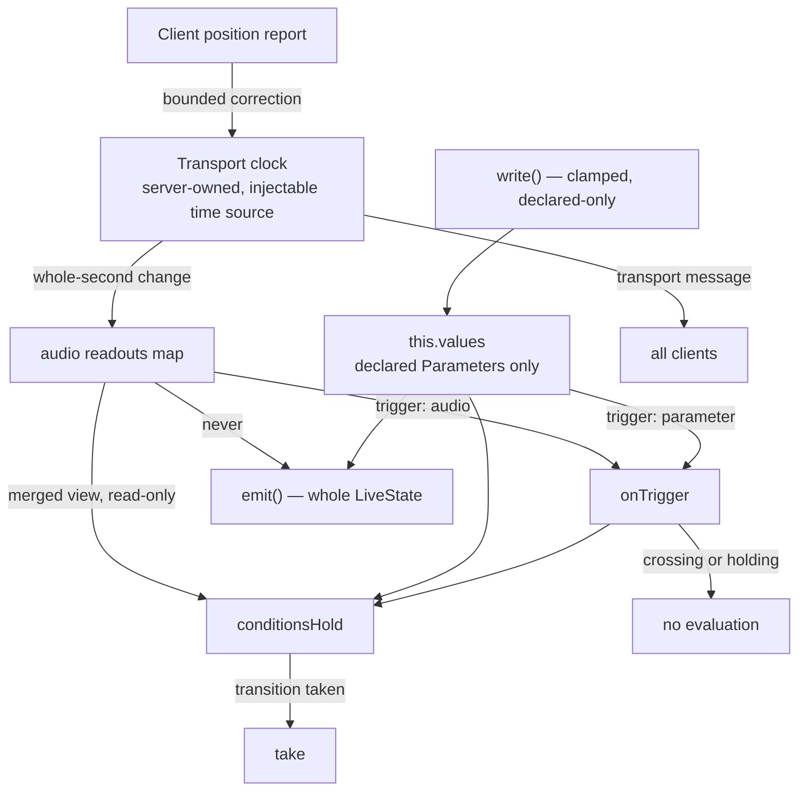
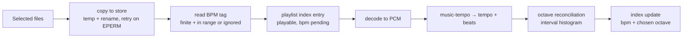
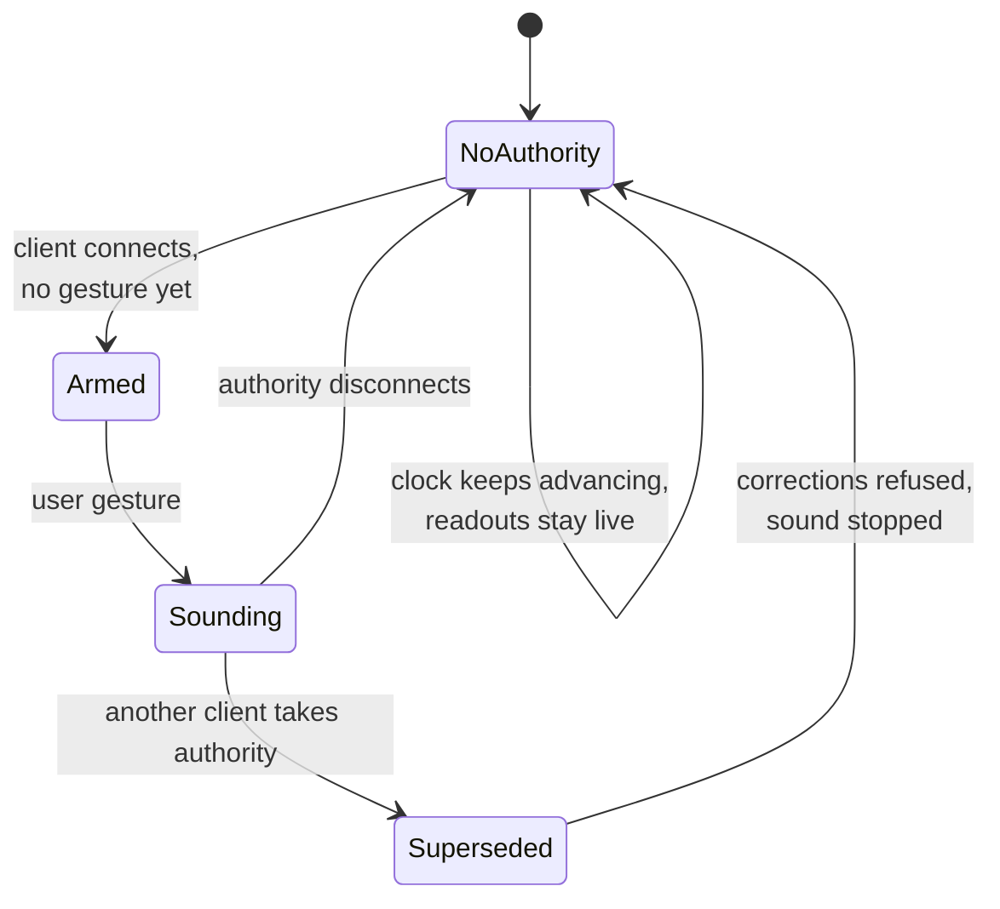

# feat: Live audio soundtrack

## Summary

Add an audio player to `/live` that plays FLAC and MP3 from named playlists, with each World naming
one, and expose the playing track's length, remaining time, BPM, playlist position and playlist
length as reserved read-only Parameters the state machine evaluates on. Audio lives in a shared store
beside `worlds/`, the server owns the transport clock, and tempo is measured in-process at import.

---

## Problem Frame

The `/live` state machine runs silently. Its clocks — exit times, Effect intervals, clip ends — are
all internal, so a World cannot be driven by anything the audience can also hear. The origin document
frames the readouts as the point of the feature rather than as decoration around a player.

Three facts about the existing runtime shape this plan more than anything in the requirements.

The machine evaluates on a closed four-value trigger union, and its single clamped write path
(`write` in `server/src/live/runtime.ts`) refuses any name absent from `world.parameters`. `AGENTS.md`
records that this path had to be *built* after three sites were found writing `this.values` directly,
and names "the machine evaluates once a tick, not once a write" as load-bearing with a test that fails
without it. A second write path for audio would re-introduce exactly what that work removed.

`live()` serialises `parameters: {...this.values}` and every `emit()` broadcasts the whole `LiveState`.
Anything landing in that map is broadcast on every emit, so a once-a-second readout placed there
turns a steady-state World into a continuous broadcaster.

`LoadedWorld.readable` is one axis: `false` makes `mutate` refuse every write *and* `lookupClip` serve
nothing. The origin document's collision rule chose read-only to keep the author able to fix the
problem, which in this codebase achieves the opposite.

---

## Requirements

Traceability to the origin document (`docs/brainstorms/2026-09-03-live-audio-soundtrack-requirements.md`).
Origin R-IDs are cited per unit; this section records only where the plan **departs from or sharpens**
the origin, since restating 34 requirements adds nothing.

- **Origin R21 is superseded** by KTD-3 below. A manifest declaring a name under the reserved
  qualifier no longer loads read-only — the declaration is dropped from the loaded World, left
  untouched on disk, and named in the World's reports. The origin document is amended to match as
  part of U1 so the two do not drift.
- **Origin R30/R31 are sharpened** to a committed choice: `music-tempo` for beat extraction plus an
  octave-reconciliation layer built here (KTD-6). The origin's escape hatch — ship no detector rather
  than a dishonest one — remains live and is the fallback if U8's acceptance thresholds are not met.
- **Origin R27's "own channel"** is realised as a transport message distinct from `world-live`
  (KTD-2), because the existing broadcast carries whole machine state.
- The reserved names are settled: `audio.playing`, `audio.bpm`, `audio.remaining`, `audio.length`,
  `audio.track`, `audio.tracks` (KTD-1). This closes the origin's first blocking open question.

---

## Key Technical Decisions

**KTD-1. Audio readouts live outside `this.values`, in a parallel map merged only for condition
reads.** The runtime gains an `audio` readouts record and a merged view used by `conditionsHold`;
`this.values` keeps holding declared Parameters only. This is what makes three requirements
simultaneously satisfiable: `write`'s declared-Parameter guard stays untouched (no second write path),
`live()` keeps broadcasting only declared Parameters (satisfying origin R27), and the readouts still
reach evaluation. Names are dotted — `audio.playing` and friends — so the qualifier is visible in the
picker, sorts the six together, and is trivially refused in an authored name.

**KTD-2. A fifth trigger, `"audio"`, and an evaluation path that does not emit.** `onTrigger` gains
the variant and honours `crossing` and `holding` exactly as the existing four do — `AGENTS.md` names
that invariant load-bearing, and a new entry point that skipped it would become the way around it.
Unlike `setParameter` and `onEffectTick`, the audio path does not fall through to `this.emit()` when no
transition is taken; transport state reaches clients on its own message instead. Readouts change at
most once a second (whole-second remaining time), so this is a bounded wake, not a tick.

**KTD-3. A reserved-qualifier declaration is dropped from the loaded World and reported, never
refused.** `rebuild` filters declarations under the qualifier out of `world.parameters` while leaving
the manifest bytes alone, and `worldReports` gains a field naming what was dropped. This reuses the
store's existing idiom for a rejected clip path — "the path is the author's work" — and keeps the
World writable, which is the only way the author can rename the offending Parameter. Supersedes
origin R21.

**KTD-4. The server owns the transport clock behind an injectable time source.** Track length is read
at import and persisted; the runtime advances position from its own timer; a client's position report
is a bounded correction, refused outside a tolerance the way `reportClipEnd` refuses a stale
generation. The injectable source is not a testing afterthought: `docs/solutions/test-suite-flakes-under-load.md`
records this suite's fixed-sleep failures, and origin AE7/AE8 are boundary assertions that must be
tested by advancing fake time.

**KTD-5. The audio store is a sibling of `worlds/` with its own confinement and its own lock.**
`server/src/paths.ts` gains `audioDir(dataDir)`; tracks and playlist indexes live under it; every
playlist index write is serialised per playlist. Concurrent BPM results landing on one index is N
read-modify-write cycles against one file — `docs/solutions/windows-hardening-patterns.md` records
that the last writer wins and the rest vanish.

**KTD-6. `music-tempo` for beats, octave reconciliation built here.** `music-tempo` is MIT, pure JS,
Node-native with no `AudioContext`, and its default window covers 60–200 BPM. It returns a bare tempo
*and* the beat timestamps, which is what makes the origin's octave requirement satisfiable: the
reconciliation layer histograms inter-beat intervals, looks for competing peaks at half and double the
reported tempo, and reports the chosen octave with the alternative alongside it. The alternative,
`essentia.js`, gives candidates and a tempo histogram for free but is AGPLv3 against a repo with no
licence file, and its npm publish is years behind its repo.

**KTD-7. Decode to PCM in-process via the WASM decoder family.** `music-tempo` takes PCM, so FLAC and
MP3 both need decoding first; `@wasm-audio-decoders/*` covers both with no native binary and no system
library, keeping the in-process constraint intact across Windows, macOS and Linux.

**KTD-8. The audio byte route mirrors `/api/live/clip` exactly, residual included.** Both predicates
called in order, range handling, `no-store`, `nosniff`. `allowsOrigin` answers true for a missing
Origin by design so an `<audio>` element can play, which means `allowsHost` is the actual defence —
the same accepted trade `docs/residual-review-findings/feat-live-scene-worlds.md` records for the clip
route, and the same existence-oracle residual, now over track filenames. Recorded, not silently
inherited.

---

## High-Level Technical Design

### Where audio enters the machine

The load-bearing question of this plan: how a readout reaches evaluation without touching the write
path or the broadcast.

The two edges that matter are the ones that do not exist: readouts never reach `write()`, and never
reach `emit()`.

### The import pipeline

Each stage can fail or be superseded independently; the track is usable from stage two onward.

Everything from decode onward is generation-counted: the playlist or the track can be deleted while
detection is in flight.

### Audio authority lifecycle

One owner, many consumers — the shape `docs/solutions/exclusive-device-one-owner-many-consumers.md`
already names, with its four traps.

The clock and the sound are separate states on purpose: the origin document requires a World running
unattended to take the same transitions it would with a page open.

---

## Implementation Units

### U1. Reserved audio readouts reach evaluation

- **Goal:** the six readouts exist, are offered to conditions, wake the machine, and never touch the
  write path or the broadcast — driven by a stub source, with no audio anywhere yet.
- **Requirements:** origin R20, R22, R23, R25, R26, R27, R28; supersedes origin R21 per KTD-3.
- **Dependencies:** none. This is the risky core and is deliberately first.
- **Files:** `shared/src/audio.ts` (new), `shared/src/world-graph.ts`, `shared/src/worlds.ts`,
  `server/src/live/runtime.ts`, `server/src/storage/worlds.ts`,
  `docs/brainstorms/2026-09-03-live-audio-soundtrack-requirements.md` (amend R21),
  `server/test/live/audio-readouts.test.ts` (new), `server/test/live/world-graph.test.ts`
- **Approach:** `shared/src/audio.ts` is the single registration point for the six names, their types,
  the qualifier, `isReservedName()`, and the nothing-playing values — the same one-place-to-edit shape
  `shared/src/effects.ts` has. The runtime holds `audio: Record<string, ParameterValue>` beside
  `this.values`; a merged accessor feeds `conditionsHold` only. `onTrigger` gains `"audio"`, checks
  `crossing`/`holding` first like every other trigger, and returns without emitting. `rebuild` filters
  reserved-qualifier declarations out of `world.parameters`; `worldReports` gains three fields — the
  dropped declarations, conditions on a numeric readout with no `audio.playing` test, and conditions
  comparing a readout for equality.
- **Execution note:** write the "does not broadcast" and "does not evaluate during a crossing" tests
  before the trigger, then make them pass. Both are absence assertions and both are easy to write
  green by accident afterwards.
- **Patterns to follow:** `shared/src/effects.ts` for the closed registry; the existing `onTrigger`
  guard order in `server/src/live/runtime.ts`; `worldReports` in `shared/src/world-graph.ts` — one
  exported pure function per field, one line in the object literal; `rebuild`'s spread discipline in
  `server/src/storage/worlds.ts`.
- **Test scenarios:**
  - Covers AE2. A World whose audio conditions all test `audio.playing`: with the readouts at their
    nothing-playing values, no audio-conditioned transition is taken.
  - Covers AE1. A World with a transition conditioned only on `audio.remaining` below five: the
    reports name it on load, with nothing playing and with a track playing alike.
  - Covers AE9. A transition comparing `audio.remaining` for equality is named in the reports on load.
  - Covers AE3. A manifest declaring `audio.bpm`: the loaded World's `parameters` does not contain it,
    the reports name it, the World is writable, and re-reading the file from disk shows the
    declaration still present.
  - A readout change with a satisfied condition takes the transition; the same change with no
    satisfied condition produces no `world-live` broadcast at all.
  - A readout change during a crossing evaluates nothing; the same during an atomic run evaluates
    nothing; both evaluate on arrival.
  - `write()` refuses a reserved name, and no code path places a reserved name in `this.values`.
  - An Effect targeting `audio.bpm` is refused, and is not reported as a dangling Effect (its target
    exists; it is simply not writable).
  - Dead-end sweep behaviour is unchanged: `audio.playing` is not swept, and `sweptTypes` is what it
    was before this unit.
- **Verification:** a World with audio conditions behaves identically to today when the readouts hold
  their nothing-playing values, and the suite passes with the whole audio subsystem otherwise absent.

### U2. The readouts in the authoring UI

- **Goal:** conditions can be written against the readouts; nothing offers them as a write target.
- **Requirements:** origin R20, R22; supports origin R23, R26 (reports rendered).
- **Dependencies:** U1
- **Files:** `ui/src/components/StateGraph.tsx`, `ui/src/store.ts`,
  `ui/test/components/StateGraph.test.tsx`
- **Approach:** the condition picker lists the reserved readouts after the World's own, visually
  grouped by the qualifier. The Effect target `writable` filter and the Parameter panel's controls
  exclude them; the panel shows them as live read-only values. The three new report kinds render
  beside the existing `danglingEffects` / `unusableRanges` / `longAtomicRuns` prose sections.
- **Patterns to follow:** the `writable` filter at the Effect target offer rule in
  `ui/src/components/StateGraph.tsx`; the existing report prose sections; `LiveNumberField` for
  read-only numeric display.
- **Test scenarios:**
  - The condition Parameter picker contains all six reserved names alongside the World's own.
  - The Effect target picker contains none of them — a negative assertion over the rendered options,
    not over a flag.
  - The Parameter panel renders `audio.bpm` with no editable control and no set-parameter send.
  - A World with a dropped reserved declaration renders the report text naming it.
  - Selecting a reserved readout in a condition offers only the operators its type allows.
- **Verification:** an author can write `audio.remaining <= 5` in the editor, and cannot write an
  Effect that targets it.

### U3. The audio store and playlists

- **Goal:** a shared store beside `worlds/` holding tracks and named playlists, with confinement,
  atomic writes and per-playlist serialisation.
- **Requirements:** origin R9, R10, R11, R13, R15
- **Dependencies:** U1 (for the shared vocabulary only)
- **Files:** `server/src/paths.ts`, `server/src/storage/audio.ts` (new), `shared/src/worlds.ts`
  (`World.playlistId`), `shared/src/types.ts`, `server/src/live/service.ts`,
  `server/test/live/audio-store.test.ts` (new), `server/test/storage/worlds.test.ts`
- **Approach:** `audioDir(dataDir)` as a sibling of `worldsDir`. A playlist is a JSON index holding an
  ordered list of entries — store-relative forward-slash path, duration, BPM state, unplayable state.
  Playlist ids follow `worldSlug`'s rules including the `RESERVED` device-name check. `World` gains an
  optional `playlistId`; `rebuild` spreads it rather than naming it. Every index write goes through
  `writeJsonAtomic` under a per-playlist lock.
- **Patterns to follow:** `worldsDir`/`dataDir` in `server/src/paths.ts`; `worldSlug`, `validWorldId`,
  `confined`, `withLock` and `RESERVED` in `server/src/storage/worlds.ts`; `writeJsonAtomic` from
  `server/src/storage/atomic.ts`.
- **Test scenarios:**
  - Covers AE12. A World naming a playlist the store does not hold loads, runs, reports the missing
    reference, and the reference survives on disk.
  - A World manifest carrying `playlistId` survives an unrelated mutation and a reopen — write, close,
    reopen, mutate something else, reopen, assert the reference is still there.
  - A playlist id that is a Windows device name is refused; a colliding playlist name nudges rather
    than overwrites.
  - Two concurrent index writes against one playlist both land.
  - A playlist path escaping the store is refused with a reason.
  - Deleting a World removes no track and no playlist.
- **Verification:** a playlist survives a server restart, and a World reopened after an unrelated edit
  still names it.

### U4. Browsing and import

- **Goal:** find audio on the drive over the existing WS surface, copy it into the store, read its
  tag, and add it to a playlist.
- **Requirements:** origin R11, R12, R19, R29; sets up R33, R34
- **Dependencies:** U3
- **Files:** `server/src/live/audio.ts` (new — `audioMime`), `server/src/live/audio-library.ts` (new),
  `server/src/live/service.ts`, `shared/src/types.ts`,
  `server/test/live/audio-import.test.ts` (new)
- **Approach:** `audioMime` is the single extension gate, used by both the browser listing and the byte
  route so what is offered and what is served cannot drift — the rule `videoMime` already establishes.
  Import copies to a temp name then renames, with the Windows EPERM/EBUSY retry policy, so a
  half-copied FLAC is never observable in the store. A multi-track commit is one message carrying the
  selection. Tag BPM is validated with `Number.isFinite` and the R31 range at the boundary and ignored
  with a recorded reason otherwise — never stored as `NaN` or `0`.
- **Patterns to follow:** `listFolder`, `importClip` and its collision nudging in
  `server/src/live/library.ts`; the `browse-clips` / `import-clip` cases in `server/src/live/service.ts`
  including `sendTo` rather than broadcast for a listing; the retry policy in
  `docs/solutions/windows-hardening-patterns.md`.
- **Test scenarios:**
  - A folder listing includes `.flac` and `.mp3` and excludes video and everything else.
  - Importing three tracks in one commit adds three entries in the order selected.
  - A copy interrupted before rename leaves no entry and no partial file in the store.
  - A tag reading `740` is ignored with a reason; a tag reading `NaN` after parse is ignored; a tag
    reading `174` is kept.
  - Two imports of the same filename produce two distinct store paths.
  - A listing for an unreadable folder returns the error rather than throwing, and does not disturb
    another client's current folder.
- **Verification:** a playlist built from a folder of FLACs holds every track with a store-relative
  path and no absolute path anywhere in the index.

### U5. The audio byte route

- **Goal:** serve a track's bytes to an `<audio>` element with range support and the clip route's
  checks.
- **Requirements:** origin R18
- **Dependencies:** U3
- **Files:** `server/src/live/audio.ts`, `server/src/http.ts`,
  `server/test/live/audio-route.test.ts` (new),
  `docs/residual-review-findings/feat-live-audio-soundtrack.md` (new)
- **Approach:** `/api/live/audio` mirrors `/api/live/clip` structurally — both predicates in order,
  GET/HEAD only, lookup, `parseRange`, `no-store`, `nosniff`. The lookup authorises against the
  playlist index the way `lookupClip` authorises against `referencedClips`: a stray file in the store
  is not reachable. The residual — no per-boot token, error events usable as an existence oracle for
  track filenames — is written down in a new residual-findings file rather than inherited silently.
- **Patterns to follow:** `server/src/http.ts` `/api/live/clip` block, called predicates not
  reimplemented; `lookupClip` and `parseRange` in `server/src/live/clips.ts`.
- **Test scenarios:**
  - A foreign Host is refused 403; a missing Origin is allowed (the documented trade).
  - POST is refused 405.
  - A track present in the store but named by no playlist is not served.
  - A range request returns 206 with correct `content-range`; an unsatisfiable range returns 416
    before any body; a zero-length file does not throw after headers are sent.
  - `nosniff` and `no-store` are present on every response.
  - A path escaping the store is refused.
- **Verification:** an `<audio>` element seeks within a 40MB FLAC without loading it whole.

### U6. The server-owned transport

- **Goal:** the clock, the playlist advance, the arming rule, and the readouts it publishes.
- **Requirements:** origin R2, R3, R5 (server half), R14, R21 (whole-second exposure), R24, R25, R27
- **Dependencies:** U1, U3
- **Files:** `server/src/live/transport.ts` (new), `server/src/live/runtime.ts`,
  `server/src/live/service.ts`, `shared/src/types.ts`,
  `server/test/live/transport.test.ts` (new)
- **Approach:** the transport owns position, advances on an injectable time source, and pushes readout
  updates into the runtime's audio map on whole-second boundaries. A World with a playlist arms it only
  when the transport holds no track; a paused track still occupies it. Wire messages cover play, pause,
  next, previous, seek, volume, stop, start-this-World's-playlist, and a position correction — all
  `ClientMessage`s, so an agent reaches them exactly as the pane does. An unplayable track is skipped;
  the skip is bounded so a playlist of entirely unplayable tracks cannot spin, using the minimum-dwell
  reasoning already recorded for clip-end reports. Transport state broadcasts on its own message, never
  through `world-live`.
- **Execution note:** build the injectable time source first and never introduce a wall-clock sleep in
  these tests; this suite has a recorded history of load-dependent flakes in exactly this shape.
- **Patterns to follow:** the `Pending`/`wait`/`supersede`/generation discipline in
  `server/src/live/runtime.ts`; `reportClipEnd`'s refusal set as the model for refusing a position
  correction; `waitFor` from `server/test/wait.ts`.
- **Test scenarios:**
  - Covers AE7. A State whose only exit is `audio.remaining <= 5` moves at the boundary, mid-clip,
    without waiting for the clip to end.
  - Covers AE8. The same transition with the boundary passing during a bridge is taken on arrival.
  - Covers AE5. A track playing under World A: switching to World B arms nothing and the track
    continues.
  - Covers AE6. Starting World B's playlist from the transport stops A's track and begins B's first.
  - Covers AE11. A playlist whose third file is missing plays the fourth and leaves the third in place
    marked unplayable.
  - A playlist of entirely unplayable tracks stops rather than spinning.
  - A position correction inside tolerance adjusts the clock; one outside it is refused and the clock
    is unchanged.
  - Remaining time changes exactly once per second of advance, and a change that leaves the whole-second
    value equal produces no trigger.
  - Pausing does not open the arming gate.
  - With no client attached, the clock advances and audio-conditioned transitions are taken.
- **Verification:** a World with a `audio.remaining <= 5` exit moves at the same point on every track,
  attended or not.

### U7. Audio authority and browser playback

- **Goal:** exactly one client sounds; the gesture gate is honest; corrections flow from the authority
  only.
- **Requirements:** origin R4, R5, R6, R8
- **Dependencies:** U5, U6
- **Files:** `server/src/live/transport.ts`, `server/src/live/service.ts`,
  `ui/src/components/AudioPlayer.tsx` (new), `ui/src/store.ts`,
  `server/test/live/transport.test.ts`, `ui/test/components/AudioPlayer.test.tsx` (new)
- **Approach:** authority is granted by the server and carried on the transport message. The four traps
  from `docs/solutions/exclusive-device-one-owner-many-consumers.md` apply directly: a superseded client
  stops sounding and its corrections are refused; a disconnected authority does not leave the readouts
  reporting a live position that nothing is advancing — the clock keeps running, the *sound* state does
  not; the authority election must be checked on the inbound transport command too, or a read-only
  client drives the transport it should only display; and the connect-time greeting carrying transport
  state goes behind the same token gate as every other push.
- **Patterns to follow:** `ClipPlayer.tsx`'s ref discipline and its de-dupe before reporting;
  `WorldService.greet`; the four traps in the exclusive-device learning.
- **Test scenarios:**
  - Covers AE4. A fresh page with a World that has a playlist: the machine runs, the enable-sound
    control is offered, the readouts report nothing playing, and the first track begins on the gesture
    and not before.
  - A second client connecting shows the transport read-only and produces no sound.
  - A non-authority client's transport command is refused.
  - A non-authority client's position correction is refused.
  - The authority disconnecting stops sound, leaves the clock advancing, and does not leave a stale
    position reported as live.
  - A blocked-playback failure renders distinctly from a per-track unplayable state.
  - The player component survives an unstable `send` without an unbounded request loop.
- **Verification:** two `/live` tabs open, one plays, and switching authority does not double the audio.

### U8. Tempo detection with octave reconciliation

- **Goal:** measure BPM in-process at import and say which octave was chosen.
- **Requirements:** origin R29, R30, R31, R33, R34
- **Dependencies:** U3, U4
- **Files:** `server/src/live/tempo.ts` (new), `server/src/storage/audio.ts`, `package.json`,
  `server/test/live/tempo.test.ts` (new)
- **Approach:** decode to PCM with the WASM decoder family, run `music-tempo` for tempo plus beat
  timestamps, then reconcile: histogram the inter-beat intervals, look for competing peaks at half and
  double the reported tempo, and record both the chosen value and the alternative with their weights.
  Detection is queued per track, generation-counted against playlist and track deletion, and bounded in
  concurrency. An unmeasured BPM is `null` — never `0`, never `NaN` — and a condition on `audio.bpm` is
  not satisfied by an unmeasured track. Range checks are written as acceptances (`!(x >= lo)`), not
  negations, so a non-finite value fails closed.
- **Execution note:** measure real drum & bass, dub and breaks files before wiring the result into the
  index. If reconciliation cannot reliably distinguish 174 from 87 on that material, take origin R31's
  branch — ship no detector — rather than lowering the bar.
- **Patterns to follow:** `server/src/deadline.ts` for bounding a decode on a slow disk, and its
  per-caller answer discipline (a timed-out check is not "unplayable"); the generation counter in
  `server/src/live/runtime.ts`.
- **Test scenarios:**
  - Covers AE10. A 174 BPM track with no tag reports either 174, or 87 explicitly labelled as the
    half-time reading — never 87 presented as the tempo.
  - A synthetic click track at a known tempo in the 60–200 range is measured within tolerance at the
    correct octave.
  - A track deleted mid-detection produces no index write.
  - A playlist deleted mid-detection produces no index write.
  - An undecodable file marks the track unplayable and does not stall the queue.
  - An unmeasured track's BPM is absent, and `audio.bpm < 100` is not satisfied while it is playing.
  - A decode exceeding the deadline is reported as unmeasured, not as unplayable.
  - Importing twenty tracks leaves all twenty playable before any BPM lands.
- **Verification:** a folder of real drum & bass imports, plays immediately, and reports tempi in the
  170s rather than the 80s.

### U9. The player and playlist editor

- **Goal:** the surfaces — transport, playlist building, BPM editing.
- **Requirements:** origin R2, R7, R8, R12, R32
- **Dependencies:** U4, U6, U7, U8
- **Files:** `ui/src/components/AudioPlayer.tsx`, `ui/src/components/PlaylistEditor.tsx` (new),
  `ui/src/components/AudioBrowser.tsx` (new), `ui/src/components/LivePane.tsx`, `ui/src/store.ts`,
  `ui/test/components/PlaylistEditor.test.tsx` (new)
- **Approach:** the browser accumulates a selection across picks and commits once — the one place this
  deliberately diverges from `ClipBrowser`, which commits on first pick and closes. Building a
  twenty-track playlist through a close-on-add dialog is the failure this avoids. The playlist shows
  per-track BPM state — measured, pending, hand-set, unplayable — and the BPM field refuses an
  out-of-range edit with its reason. Volume persists across World switches within the session.
- **Patterns to follow:** `ClipBrowser.tsx`'s stale-listing `wanted` ref and its reuse of
  `worldResults` for the error line; `ui/src/store.ts` reducer conventions — server branch returns
  state literals only.
- **Test scenarios:**
  - Covers AE13. Removing two tracks from a playlist two Worlds reference names both Worlds and the
    invalidated conditions at the moment of the edit.
  - The browser stays open across picks and commits the accumulated selection in one send.
  - A stale listing arriving after the user navigated elsewhere is discarded.
  - A BPM edit of `740` is refused with a reason; `174` is accepted and wins over detection.
  - A pending BPM renders distinctly from a measured `0`.
  - Volume set in World A is still set after switching to World B.
  - Transport controls are disabled on a non-authority client.
- **Verification:** build a playlist from a real folder, play it, and watch a World change state on the
  music.

---

## Scope Boundaries

Carried from the origin document:

- The graph never commands playback beyond a World arming its playlist into an empty transport.
- No beat, downbeat or track-end Triggers, and no beat-level synchrony.
- No crossfading, gapless playback, cue points or multi-deck mixing.
- No waveform display or audio visualiser.
- No audio in the video clips themselves.

### Deferred to Follow-Up Work

- A backup convention for the shared audio store. This plan *states* the gap; it does not close it.
  `docs/worlds/README.md`'s manifest-only convention does not reach the store, and
  `docs/solutions/a-scratch-data-dir-is-safe-until-you-invite-the-user-into-it.md` records what that
  class of gap has already cost.
- Garbage collection of tracks no playlist names.
- Closing the per-boot-token debt on local media surfaces, owed by the clip route and the vision
  stream before this route joins them.

---

## Risks & Dependencies

- **The detector may not clear its own bar.** U8 is the one unit that can fail on its merits rather
  than on execution. Its execution note takes origin R31's branch rather than lowering the threshold,
  and U1–U7 and U9 all ship usefully with hand-entered tempos, so the failure is contained to one unit.
- **New dependencies:** `music-tempo` (MIT) and the `@wasm-audio-decoders` family. Both are pure
  JS/WASM with no native binary and no system library, preserving the in-process constraint on all
  three target OSes. Install footprint and Windows behaviour should be confirmed in U8 before the rest
  of the unit is built.
- **A new evaluation entry point is the highest-risk change in U1.** `AGENTS.md` names the
  crossing/holding invariant load-bearing and records that `holding` needed the same treatment as
  `crossing` in both `onTrigger` and `setParameter`. The absence tests in U1 exist for this and should
  be checked against pre-change code.
- **Every site that iterates `world.parameters` is a place the readouts can silently go missing** —
  the condition picker, the Effect target filter, the panel, the dead-end sweep, the dangling-Effect
  check, `cleanConditions`. `docs/solutions/extending-a-catalogue-is-not-auditing-it.md` is explicit
  that adding entries proves nothing about the sites that were never in the catalogue; U1 and U2 carry
  enumeration tests rather than spot checks.
- **`live()` broadcasts whatever lands in `this.values`.** If a later change moves readouts into that
  map for convenience, origin R27 breaks silently and the only symptom is broadcast volume.

---

## System-Wide Impact

- **Wire contract:** new `ClientMessage`s for transport and playlist operations, new `ServerMessage`s
  for transport state and playlist listings. Agent-native parity makes these non-optional rather than
  a UI convenience.
- **Manifest:** `World` gains an optional `playlistId`. A field added, not a field whose meaning
  changed, so `WORLD_VERSION` does not move — but an older build must keep the field through a
  load-modify-write cycle, which the U3 round-trip test asserts.
- **Data dir:** a new top-level `audio/` directory beside `worlds/`. It is outside the World backup
  convention; see Deferred.
- **New HTTP surface:** one route, carrying the clip route's accepted residual, newly recorded.
- **Reports:** three new kinds, rendered in the graph panel beside the existing three.

---

## Open Questions

**Resolve during implementation**

- Whether `@wasm-audio-decoders` handles the FLAC variants in the target library, and its actual
  install footprint on Windows. U8 confirms before the unit is built out.
- The position-correction tolerance, and the minimum-dwell bound for skipping unplayable tracks. Both
  have existing precedent in the clip-end refusal set; the numbers are measured, not chosen.

**Deferred to a later plan**

- The audio store's backup convention.
- Whether the per-boot-token debt on local media surfaces gets paid.

---

## Sources & Research

- `docs/brainstorms/2026-09-03-live-audio-soundtrack-requirements.md` — origin.
- `server/src/live/runtime.ts` — the trigger union, the five `onTrigger` call sites, the single clamped
  `write` path, `emit`/`live`, the `Pending`/`supersede`/generation discipline, `step()` and the
  injectable `random` as precedent for an injectable clock.
- `shared/src/world-graph.ts` — `conditionsHold`, `worldReports` and its one-function-per-field shape,
  `valueSpace`/`deadEnds` and the other sites that iterate `world.parameters`.
- `server/src/storage/worlds.ts` — `rebuild`'s spread rule, `confined`, `resolveClipPath`,
  `versionRefusal`, `withLock`, `RESERVED`, and the `readable`/`readOnlyReason` coupling that
  supersedes origin R21.
- `server/src/live/library.ts`, `server/src/live/clips.ts`, `server/src/http.ts` — the browse/import/
  serve triangle this feature parallels, including `videoMime` as the single gate shared by the browser
  and the route.
- `ui/src/components/ClipBrowser.tsx` — commits on first pick and closes; the one behaviour U9
  deliberately diverges from.
- `docs/solutions/exclusive-device-one-owner-many-consumers.md` — the four lifecycle traps U7 is
  written against.
- `docs/solutions/rebuilding-a-cache-field-by-field-turns-a-read-into-a-delete.md` — why U3 carries a
  reopen-mutate-reopen test for `playlistId`.
- `docs/solutions/extending-a-catalogue-is-not-auditing-it.md` — why U1 and U2 enumerate rather than
  spot-check.
- `docs/solutions/a-flag-nothing-reads-looks-shipped.md` — why U2's assertions are consumer-side and
  negative.
- `docs/solutions/a-threshold-guard-written-as-a-negation-fails-open-on-nan.md` — why every BPM and
  remaining-time bound is written as an acceptance.
- `docs/solutions/windows-hardening-patterns.md` — the copy-then-rename retry policy and per-entity
  write serialisation in U3 and U4.
- `docs/solutions/test-suite-flakes-under-load.md` — why U6 gets an injectable time source before it
  gets behaviour.
- `docs/residual-review-findings/feat-live-scene-worlds.md` — the clip route's accepted residual, the
  confinement edges `realpath` does not cover, and the minimum-dwell reasoning U6 reuses.
- BPM detector landscape (2026-09-03): `music-tempo` (MIT, pure JS, Node-native, 60–200 default,
  returns beats) chosen over `essentia.js` (clears both bars natively via `RhythmExtractor2013`
  candidates and `BpmHistogramDescriptors`, but AGPLv3 against a repo with no licence file, and an npm
  publish years behind its repo). `web-audio-beat-detector`, `realtime-bpm-analyzer` and
  `bpm-detective` are browser-only — hard `AudioContext`/`AudioWorklet` dependencies — and return a
  bare number.
