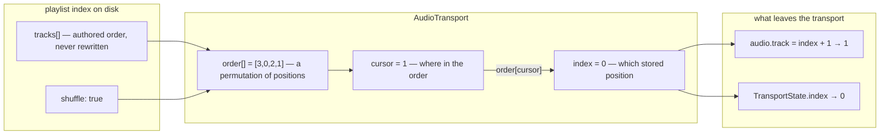
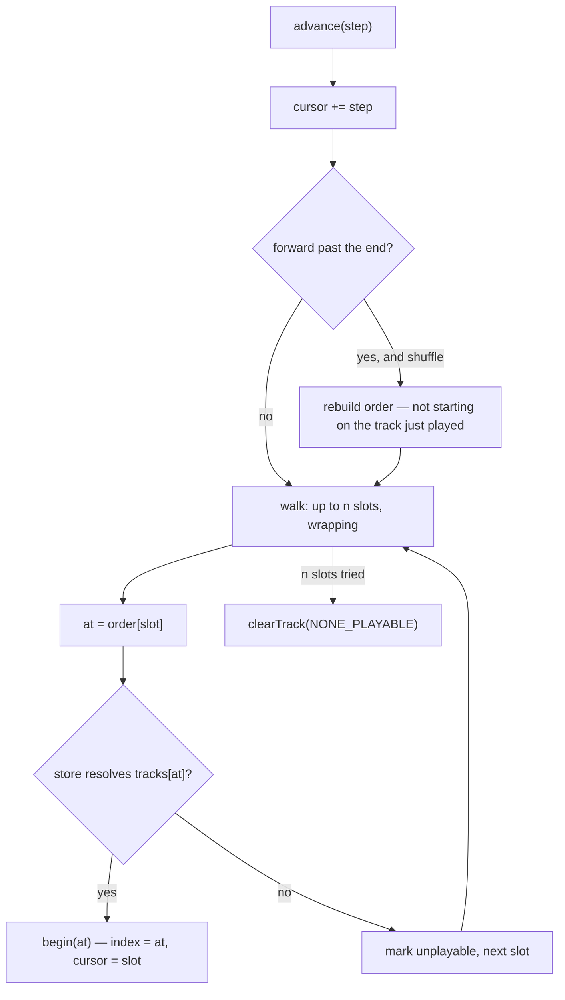

# feat: Playlist shuffle, playing-track mark, and click-to-play

## Summary

Three additions to the `/live` soundtrack. A playlist gains a **shuffle** switch, saved with the
playlist and read by the transport. The playlist view **marks the track that is sounding**. Clicking
a track in the playlist the transport is holding **starts that track**.

The shuffle switch does not reorder the saved playlist. The transport gains a **play order** — a
permutation of positions it walks instead of counting — and the authored order on disk is never
touched. That one decision is what keeps the existing readouts, the unplayable-skip walk and the
position-condition impact reports all true without changes to any of them.

---

## Problem Frame

The transport plays a playlist by counting: `advanceFrom(this.index + step, step)` walks positions in
the stored array, wrapping, one pass, skipping what will not resolve
(`server/src/live/transport.ts`). Three things are anchored to that count and each would break in a
different way if shuffle were implemented as "reorder the tracks":

- **The `audio.track` readout is the stored position** (`this.index + 1`). Worlds condition on it. If
  shuffle permuted the array, `audio.track eq 3` would name a different track every cycle while
  appearing to name a fixed one.
- **The impact reports reason about stored positions.** `indexConditions` and
  `unreachableIndexConditions` (`shared/src/world-graph.ts`) answer "what did this edit cost the
  Worlds that play this playlist" by handing every position the playlist can produce to the same
  `clauseHolds` the runtime evaluates with. A permutation held only in the transport would make those
  answers quietly wrong.
- **The one-pass bound in `walk` is the guard against a dead playlist spinning at filesystem speed.**
  Any advance that is "roll a die and try again" has no pass to be bounded by.

A play order — `order: number[]`, identity when shuffle is off — leaves all three alone. The walk is
still exactly one pass over `n` entries; the index it lands on is still a stored position; the
readouts and the impact reports never learn that shuffle exists.

The other two features are already reachable. `TransportState` carries `playlistId`, `index` and
`path` on every broadcast, and `PlaylistEditor` already reads live state (it compares
`world.playlistId === playlist.id`). The transport command set is a closed union built by name in
`transportCommandFor` (`server/src/live/audio-service.ts`), which is where a "play this one" command
belongs.

---

## Requirements

No upstream requirements document. `docs/brainstorms/2026-09-03-live-audio-soundtrack-requirements.md`
is the parent feature's brief and names none of these three; it is research input, and the origin
requirements it does state are constraints this plan must not break:

- **Origin R3 — the transport belongs to no World.** Shuffle is a property of a playlist and the
  order is a property of the transport. Neither reaches a World manifest.
- **Origin R14 — a track that cannot be played is still the author's ordering work.** Extended here:
  the authored *order* is also the author's work. Shuffle never rewrites `tracks`.
- **Origin R6 — exactly one client sounds.** Click-to-play is a transport command and is gated on the
  audio authority, inbound as well as outbound. The shuffle switch is a playlist edit and is not.
- **Origin R17 — an edit says what it cost the Worlds that play the playlist.** Turning shuffle on is
  an edit of that class and reports like a reorder.
- **Origin R23/R34 — a readout is absent or true, never a placeholder number.** Unchanged: the
  readouts do not learn about shuffle at all.

Success criteria:

1. A playlist can be set to shuffle, the setting survives a restart, and every World naming that
   playlist plays it shuffled.
2. Under shuffle, a pass plays every track exactly once before any track repeats.
3. The playlist view shows which track is sounding, and only when the view is showing the playlist
   the transport is holding.
4. Clicking a track in that playlist starts it, from a client that is allowed to make a sound, and is
   refused from one that is not.
5. `audio.track`, the impact reports, and the unplayable-skip bound behave exactly as they do today.

---

## Key Technical Decisions

**KTD-1 — Shuffle is a field on the Playlist.** `Playlist.shuffle?: boolean` in
`shared/src/audio.ts`, written to the playlist's index file. `CONCEPTS.md` records that a playlist
belongs to no World and several Worlds may name the same one, so this is shared by every World naming
it — chosen deliberately over a per-World field beside `playlistId`, and over a session-only toggle
that a reload would lose. Absent means off; the field is optional so no existing index file has to be
rewritten.

**KTD-2 — Read it as an acceptance, not a coercion.** `rebuild` in `server/src/storage/audio.ts`
spreads what is on disk and then rebuilds the fields it owns. A playlist index is hand-editable, so
`shuffle` is rebuilt as `base.shuffle === true` — a hand-typed `"no"` is a string and must not become
a truthy switch. This is the shape `usableBpm` uses for the same reason
(`docs/solutions/a-threshold-guard-written-as-a-negation-fails-open-on-nan.md`).

**KTD-3 — The transport walks a play order; the stored order is never rewritten.** A private
`order: number[]` holding every position `0..n-1` exactly once. Identity when shuffle is off. `index`
stays the *stored* position of the held track, so `readouts()`, `state()`, `adopt()` and every client
display are untouched. A private `cursor` says where in the order that track sits.

**KTD-4 — A permutation, not a roll per advance.** Every track plays once per pass; the order is
rebuilt when a forward advance wraps past the end. A fresh order avoids putting the track that just
played first when the playlist holds more than one, so a reshuffle cannot produce an immediate
repeat. An independent roll per advance was rejected on three counts: it repeats, it gives `previous`
no meaning, and it has no pass for `walk`'s one-pass bound to bound.

**KTD-5 — `previous` walks the order, not a play history.** Under shuffle the order *is* the history
for everything except a direct click, and a click moves the cursor to that track's slot — so
"previous" after a click means the slot before it in the current order. One piece of state instead of
two. A backwards wrap past slot 0 does **not** reshuffle: reshuffling on the way backwards would
change what you are walking back through as you walk it.

**KTD-6 — The order lives in the transport and is not persisted.** A restart reshuffles. Persisting a
permutation would mean a second source of truth for ordering in the playlist file, and
`docs/solutions/a-fix-to-what-a-picker-offers-is-not-a-fix-to-what-it-keeps.md` is the recorded cost
of a second, quieter copy of authored data.

**KTD-7 — The shuffle source is injected like the clock.** `TransportOptions` already takes `time`
for exactly this reason. Add an optional `shuffle?: (n: number) => number[]` (default: a
Fisher–Yates over `Math.random`) so tests pin an order rather than sampling one.

**KTD-8 — "Play this track" names the track by path.** `{ command: "play-track", playlistId, path }`,
refused unless `playlistId` is the loaded playlist and `path` is in it — the refusal set
`reportEnd` and `reportPosition` already use, for the same hazard: an index the client is holding may
name a different track by the time the message lands, after an edit it has not seen yet. It reaches
the transport through `transportCommandFor` so an unknown name is still refused by name.

**KTD-9 — Two different gates, on purpose.** Click-to-play is a transport command and goes through
the inbound authority check every transport command goes through
(`docs/solutions/a-gate-that-checks-one-direction-is-half-a-gate.md`). The shuffle switch is a
playlist index edit and is *not* authority-gated, because `reorder-playlist` and `remove-track` are
not either — editing a playlist and sounding one are separate permissions today and this plan does
not move that line.

**KTD-10 — Turning shuffle on reports impact like a reorder.** `playlistImpacts` in
`server/src/live/service.ts` chooses `indexConditions` for `reorder-playlist` and
`unreachableIndexConditions` otherwise. Shuffle makes nothing unsatisfiable and changes what every
position-naming condition points at — the reorder question exactly. The branch becomes a set
membership rather than a second `===`.

---

## High-Level Technical Design

Directional, not implementation specification.

What the transport holds, and which half of it shuffle touches:

One advance, and where the existing guards still sit:

The one-pass bound and the generation check are unchanged: the loop still runs at most `n` times and
still returns early when `this.advancing !== generation`. Only what `at` is derived from changes.

---

## Implementation Units

### U1. Shuffle is a field on the playlist

**Goal:** the setting exists, parses safely, persists, and is on the wire.

**Requirements:** success criterion 1; KTD-1, KTD-2, KTD-9, KTD-10.

**Dependencies:** none.

**Files:**
- `shared/src/audio.ts` — `shuffle?: boolean` on `Playlist`; a `setPlaylistShuffle` pure edit beside `setTrackUnplayable`
- `shared/src/types.ts` — `SetPlaylistShuffleMessage` in `ClientMessage`
- `server/src/storage/audio.ts` — `rebuild` accepts `shuffle`
- `server/src/live/audio-service.ts` — the `set-playlist-shuffle` case, through `editPlaylist`, then `reportPlaylistImpact`
- `server/src/live/service.ts` — the impact branch takes a set of reorder-question actions
- `server/test/live/audio-store.test.ts`, `server/test/live/service.test.ts`

**Approach:** the edit goes through `editPlaylist` like `reorder-playlist` — one index write, broadcast
both halves, then the impact report. `PlaylistSummary` does **not** gain the field; the picker lists
names and counts and nothing else reads it there.

**Patterns to follow:** `reorder-playlist` in `server/src/live/audio-service.ts` end to end;
`setTrackUnplayable` for the pure-edit shape (returns the same object when nothing changed, so
`update` skips the write).

**Test scenarios:**
- An index file with `"shuffle": true` loads with `shuffle === true`; one with no field loads without it.
- An index file with `"shuffle": "yes"` loads as **not** shuffled — the acceptance form, not a truthy coercion.
- `set-playlist-shuffle` on a playlist writes the file, broadcasts `playlist` and `playlists`, and answers `playlist-result` with `ok`.
- Setting it to the value already held answers `ok` and does not rewrite the file.
- `set-playlist-shuffle` naming a playlist that does not exist answers `ok: false` with the store's reason.
- Turning shuffle on for a playlist a World names with an `audio.track` condition produces a `playlist-impact` listing that World and that condition — the `indexConditions` answer, not the unreachable one.
- Turning shuffle on for a playlist whose Worlds hold no position condition produces no impact entry.
- Hand-editing the file to add an unknown key and then toggling shuffle preserves the unknown key (the spread rebuild).

### U2. The transport plays an order, not a count

**Goal:** shuffle actually changes what plays next, and nothing else changes.

**Requirements:** success criteria 1, 2, 5; KTD-3 through KTD-7.

**Dependencies:** U1.

**Files:**
- `server/src/live/transport.ts` — `order`, `cursor`, `reorder()`, `walk` over the order, `TransportOptions.shuffle`, `shuffle` on `TransportState`
- `shared/src/types.ts` — `TransportState.shuffle`
- `server/test/live/transport.test.ts`

**Approach:** `load` builds the order after adopting the tracks. `advanceFrom(from, step)` becomes an
advance over cursor slots; `walk` resolves `tracks[order[slot]]`. `begin(at)` records both the stored
index and the slot it came from. `adopt` — which already re-finds the held track by path after an
outside edit — rebuilds the order for the new length and re-points the cursor at the held track's
slot; a held track that has gone leaves `index` at `-1` exactly as today. `refreshed` therefore
carries a shuffle toggle into a playing transport for free, which is the half that
`docs/solutions/editing-state-a-running-process-caches-loses-the-edit.md` records going missing.

**Execution note:** the readout and impact behaviour under shuffle is the part most likely to regress
silently. Write the "readouts are unchanged under shuffle" assertions before the order exists, so
they are seen failing for the right reason.

**Test scenarios:**
- With shuffle off, advancing walks stored positions in order and wraps — the existing tests still pass unchanged.
- With shuffle on and a pinned order, `next` five times over a five-track playlist visits every track exactly once.
- A sixth `next` rebuilds the order and does not begin with the track that just played (playlist size > 1).
- A one-track playlist under shuffle wraps onto itself and `generation` still increments — the case KTD-4's "no immediate repeat" rule must not deadlock.
- `previous` immediately after `next` returns to the track that was playing, under shuffle and without it.
- `previous` at the first slot wraps to the last slot of the *current* order and does not reshuffle.
- Under shuffle, `audio.track` reports the **stored** position of the held track, not its slot — assert against a pinned order where the two differ.
- Under shuffle, a track whose file will not resolve is marked unplayable and the next *slot* is tried; a playlist whose files have all gone still stops after one pass with `NONE_PLAYABLE`.
- A `next` arriving while an advance is resolving paths still lands exactly one track (the generation check, under shuffle).
- Toggling shuffle on a playing playlist via `refreshed` keeps the held track sounding, keeps its position, and changes what plays next.
- Toggling shuffle off restores stored order from the held track's position.
- Appending a track to a playing shuffled playlist (the `refreshed` path) leaves the held track playing and includes the new track in the order.
- `TransportState.shuffle` is broadcast and is part of the change signature — toggling it forces a broadcast.

### U3. Play this track

**Goal:** one transport command that starts a named track in the loaded playlist.

**Requirements:** success criterion 4; KTD-8, KTD-9.

**Dependencies:** U2.

**Files:**
- `shared/src/types.ts` — `play-track` in `AudioTransportMessage.command`, plus its `path` and `playlistId` fields
- `server/src/live/transport.ts` — the `play-track` case
- `server/src/live/audio-service.ts` — `transportCommandFor` accepts it
- `server/test/live/transport.test.ts`, `server/test/live/audio-route.test.ts`

**Approach:** refused unless a track is held (`NOTHING_LOADED`), the named playlist is the loaded one,
and the path is in it — then it moves the cursor to that track's slot and begins it through the same
`walk`, so an unplayable clicked track is skipped and marked exactly as an advancing one is. It does
not arm, does not swap playlists, and is not an exception to the arming gate: `start-world-playlist`
remains the only command that reaches past it.

**Patterns to follow:** the refusal set in `reportEnd`; the command construction in
`transportCommandFor`; the authority check the other inbound transport commands already pass through.

**Test scenarios:**
- `play-track` naming a track in the loaded playlist begins it, bumps `generation`, and resets the position to 0.
- `play-track` from a client that is not the audio authority is refused, and the transport does not move.
- `play-track` naming a different playlist than the loaded one is refused and nothing changes.
- `play-track` naming a path not in the loaded playlist is refused.
- `play-track` on an empty transport answers `NOTHING_LOADED`.
- `play-track` naming a track whose file will not resolve marks it unplayable and lands on the next playable one rather than clearing the transport.
- Under shuffle, `next` after a `play-track` continues from the clicked track's slot in the current order, not from where the cursor was before.
- An unknown command name still answers "That is not a transport command."

### U4. The playlist view marks what is sounding and takes a click

**Goal:** the operator can see which track is playing and start another by clicking it.

**Requirements:** success criteria 3, 4.

**Dependencies:** U3.

**Files:**
- `ui/src/components/PlaylistEditor.tsx` — the playing mark on the row, the click handler
- `ui/src/styles.css` — the playing-row rule
- `ui/test/components/PlaylistEditor.test.tsx`

**Approach:** a row is the playing one when `audioTransport.playlistId === playlist.id` **and**
`audioTransport.path === track.path` — matched by path, not index, so a row cannot be marked by a
stale count. The track name becomes the click target for `play-track`; it is disabled, and does not
present itself as clickable, when the editor is not showing the loaded playlist or when this client is
not the audio authority. The existing per-row controls keep their current behaviour — a click on ↑, ↓,
`set` or `remove` must not also start a track.

**Patterns to follow:** `AudioPlayer`'s `holds.current.authority` guard before every `send`, and the
`data-testid` per row already used by the tempo and move controls.

**Test scenarios:**
- The row whose path matches the transport carries the playing mark; no other row does.
- No row is marked when the editor is showing a playlist the transport is not holding, even if a track of the same name is playing.
- No row is marked when the transport holds nothing.
- Clicking a track name sends `audio-transport` with `play-track`, the playlist id and that track's path.
- The click target is disabled and sends nothing when this client is not the audio authority.
- The click target is disabled and sends nothing when the shown playlist is not the loaded one.
- Clicking `remove`, `set`, ↑ or ↓ on a row sends only that row's own message.
- The component survives an unstable `send` — no unbounded effect (the house rule for this suite).

### U5. The shuffle switch, and saying it is on

**Goal:** the switch is reachable and its state is visible where the music is.

**Requirements:** success criterion 1.

**Dependencies:** U1 (the switch), U2 (`TransportState.shuffle` for the player).

**Files:**
- `ui/src/components/PlaylistEditor.tsx` — the switch beside the existing playlist tools
- `ui/src/components/AudioPlayer.tsx` — shuffle shown beside the position readout
- `ui/src/styles.css` — if the switch needs it
- `ui/test/components/PlaylistEditor.test.tsx`, `ui/test/components/AudioPlayer.test.tsx`

**Approach:** the switch sits with the playlist-level tools (rename, delete, "this World plays this"),
not with the transport buttons, because it is a saved property of the playlist rather than a transport
gesture — and it is not authority-gated for the same reason. The player shows shuffle from
`TransportState.shuffle`, which is the transport's own answer about what it is playing, rather than
from the loaded playlist object the pane may not be showing.

**Test scenarios:**
- The switch reflects `playlist.shuffle` and sends `set-playlist-shuffle` with the inverted value.
- The switch is enabled for a client that is not the audio authority (it is an edit, not a command).
- The player shows the shuffle state from `TransportState.shuffle`, and shows nothing about shuffle when the transport holds nothing.
- The player does not read shuffle from `state.playlist` — assert with a transport shuffled and a different playlist open in the editor.

---

## Scope Boundaries

- **Not** a repeat-one, repeat-all, or stop-at-end mode. The playlist already wraps and that is unchanged.
- **Not** a drag-to-reorder playlist. ↑/↓ stay as they are.
- **Not** a play history stack or a shuffle order visible to the operator.
- **Not** a crossfade, a queue, or "play next".
- **Not** a per-World shuffle setting. That fork was considered and closed by KTD-1; a later change of mind is a manifest field and a resolution rule, not a rewrite of this plan.
- **Not** a change to any audio readout, to what a World may condition on, or to the arming gate.
- **Not** persistence of the shuffled order across a restart (KTD-6).

### Deferred to Follow-Up Work

- Whether the `playlist-impact` report should also fire when shuffle is turned **off**, and whether an
  operator wants that noise. Shipped here as symmetric — both directions report — and worth revisiting
  once it has been used in a set.
- A path to the playing track when the list is long (scroll-into-view). The list is capped at 260px and
  shuffle makes the playing row jump; this is the first feature that makes that visible.

---

## Risks & Dependencies

- **The order and the stored index drifting apart.** The one real hazard in U2: two pieces of state
  that must agree, where today there is one. `begin` is the single place both are written, and
  `adopt` the single place both are re-derived. Any third writer is the defect.
- **`adopt` is called from two directions** — after the transport's own writes (a duration report, an
  unplayable mark) and from `refreshed` after an outside edit. A rebuild of the order that reset the
  cursor to 0 would restart the pass on every BPM measurement that lands.
- **A shuffle flag that nothing reads.** U1 can land and look complete on its own;
  `docs/solutions/a-flag-nothing-reads-looks-shipped.md` is this project's record of exactly that
  shape. U1's tests assert storage and broadcast; only U2's assert behaviour.
- **The playing mark is presentation, and presentation is what nothing asserts** — the same learning.
  U4's scenarios assert the mark's presence and absence, not its colour.
- **Colour is not verifiable by screenshot.** If the mark uses a colour, verify it with the computed
  style rather than by eye, and define it in one place —
  `docs/solutions/css-tracks-with-two-sources-of-truth.md`.

---

## System-Wide Impact

- **Worlds conditioning on `audio.track`** now have a playlist that can be shuffled under them. The
  readout stays truthful (it is the stored position of whatever is sounding), but a condition that
  effectively meant "the fourth track" now means "whenever the fourth track comes up". The
  `playlist-impact` report on the toggle (KTD-10) is what tells the operator that at the moment they
  flip it.
- **The playlist index file gains a field.** Older HAL builds reading a newer index ignore it and play
  in order; the spread rebuild preserves it on write either way.
- **`docs/worlds/README.md`'s manifest-only backup convention** is unaffected — this adds no new file
  and no new directory to the audio store.
- **`CONCEPTS.md`** gains no new entry: shuffle is a property of the existing **Playlist** entry and the
  play order is internal to the existing **Transport** entry. Both entries want a sentence once this
  ships.

---

## Open Questions

- **Does the reshuffle-avoiding-a-repeat rule (KTD-4) hold for a two-track playlist?** With `n = 2`
  the constraint forces a strict alternation, which is not shuffle in any meaningful sense but is
  also what anyone would expect. Named rather than special-cased.
- **Should `play-track` be allowed to arm an empty transport?** Refused here (KTD-8) because the
  arming rule is a World's, not a track's — but an operator clicking a track into a silent room and
  getting nothing is a plausible complaint. Revisit after use; it is one refusal to relax, not a
  redesign.

---

## Sources & Research

- `server/src/live/transport.ts` — the advance, the one-pass bound, the generation discipline, `adopt`, `refreshed`, and the publish signature every decision here is measured against.
- `server/src/live/audio-service.ts` — `transportCommandFor`, `editPlaylist`, `announcePlaylist`, `reportPlaylistImpact`.
- `server/src/live/service.ts` — `playlistImpacts` and the reorder-versus-removal question split KTD-10 extends.
- `shared/src/audio.ts` — the `Playlist` shape, the comment stating a playlist belongs to no World (the evidence behind KTD-1's cost), and `usableBpm`'s acceptance form (KTD-2).
- `server/src/storage/audio.ts` — `rebuild`'s spread-and-own-fields discipline and `update`'s re-read-under-lock.
- `shared/src/world-graph.ts` — `indexConditions` / `unreachableIndexConditions`.
- `ui/src/components/PlaylistEditor.tsx`, `ui/src/components/AudioPlayer.tsx` — the existing row controls, the authority guard, and where a switch belongs.
- `AGENTS.md` — the audio section: the authority election, the inbound-gate rule, and the deliberate playlist-surface choices not to tidy back.
- `CONCEPTS.md` — Playlist, Track, Transport, Audio authority.
- `docs/brainstorms/2026-09-03-live-audio-soundtrack-requirements.md` — the parent brief; R3, R6, R14, R17, R23/R34 are the constraints carried forward.
- `docs/solutions/a-flag-nothing-reads-looks-shipped.md`, `a-gate-that-checks-one-direction-is-half-a-gate.md`, `a-threshold-guard-written-as-a-negation-fails-open-on-nan.md`, `a-fix-to-what-a-picker-offers-is-not-a-fix-to-what-it-keeps.md`, `editing-state-a-running-process-caches-loses-the-edit.md`, `css-tracks-with-two-sources-of-truth.md`.
- No external research: the feature is internal to a subsystem with strong local patterns, and the one genuinely external question — what shuffle should mean — was settled by you rather than by prior art.
