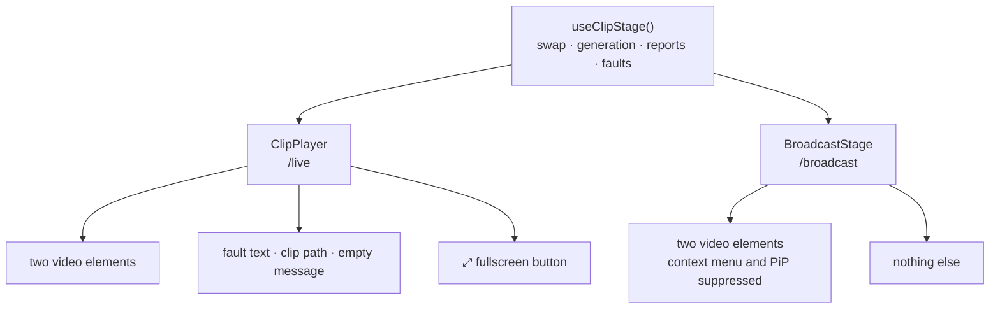
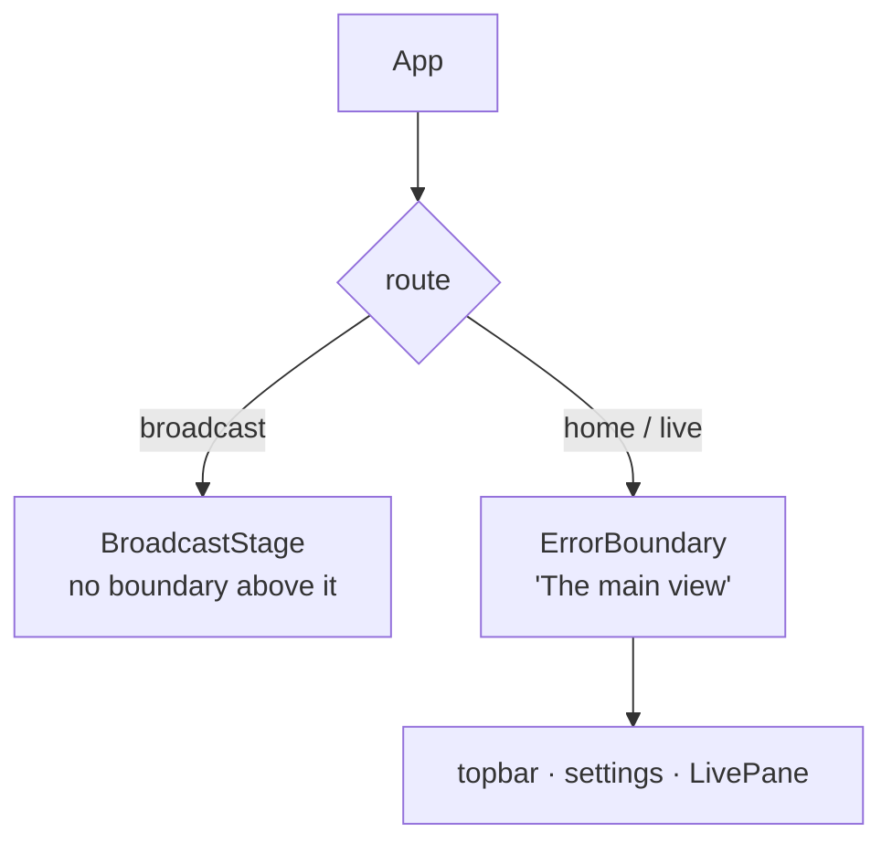
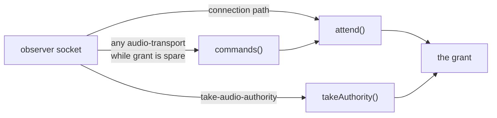

# feat: The broadcast surface

## Summary

Add `/broadcast`, a third route rendering the open World's video and nothing else. The clip engine is
extracted from `ClipPlayer` into a headless hook so the broadcast surface renders no text as a
property of its component rather than as a branch inside one. The server gains an observer role,
enforced at every door to the audio grant, that keeps the broadcast socket out of the election and
refuses its clip reports.

---

## Problem Frame

Broadcasting today means two `/live` windows with one fullscreened onto the output. Every failure
mode of `/live` is authored to be informative, and on the projector that is a leak: clip paths,
server fault text, runtime error messages, and the window title all reach the audience. Exiting
fullscreen — by Escape, by a crash, by the browser deciding to — reveals the entire operator
interface, because on `/live` that is what sits underneath.

See origin for the enumerated leaks and the containment framing.

---

## Requirements

Carried from origin. R1–R5 the surface, R6–R11 failure behaviour, R12–R16 the observer role. All
sixteen are in scope; none are deferred.

---

## Key Technical Decisions

**KTD1 — Extract a headless clip engine, do not branch inside `ClipPlayer`.** The swap, generation
bookkeeping and report logic move to a hook; `ClipPlayer` and the new broadcast stage each render it.
The alternative — a `chrome={false}` prop — leaves conditionals guarding the leak, each one edit from
failing open. With the extraction, the broadcast component contains no string at all.

**KTD2 — The existing suite is the evidence of behaviour preservation.**
`ui/test/components/ClipPlayer.test.tsx` must pass **unmodified** across U1; a test edited to
accommodate a refactor has stopped guarding what it was written for
(`docs/solutions/tests-that-lock-in-the-bug.md`).

*Corrected during execution.* This decision previously claimed the suite had a StrictMode-shaped hole
around the reporting guards, on the strength of the component's comment about "StrictMode
double-invoking a mount effect". Checked by removing both guards: two cases in `ClipPlayer.test.tsx`
fail, and a StrictMode test of the same property fails nothing. Both reports are raised from event
handlers, and StrictMode double-invokes effects, not handlers — so the dedupe was already
characterized and the proposed test would have been decoration that cannot fail. What the suite
genuinely never reached is the double-invoked *mount effect* itself, so U1 adds two small StrictMode
cases for that path instead, verified to fail when the `held` guard is removed.

**KTD3 — The observer gate belongs where the grant is issued, not where it is chosen.** Guarding
`elect()` is half a gate: nothing that hands out the grant consults it first.

*Refined during execution.* The plan named three doors — `attend()`, `takeAuthority()` and
`commands()`. Two are real: `takeAuthority` pushes onto `attending` itself, so it carries its own
check, and removing either that or `attend`'s makes a test fail. The third is not: `commands()`
grants by calling back into `attend()`, so its check was unreachable and every observer test passed
with it deleted. It was removed rather than kept as defence in depth — an unreachable guard no test
can fail is the shape `docs/solutions/a-flag-nothing-reads-looks-shipped.md` warns about. The
*behaviour* stays covered: the test that an observer cannot take the grant by sending a transport
command passes through whichever guard implements it.

**KTD4 — Observer membership lives on `WsHub`, beside `authed`.** Both services need the answer:
`AudioService` for the election, `WorldService` for the two clip reports. Putting it on the audio side
would make `WorldService` ask the audio service a question that is not about audio, widening the
deliberately narrow `WorldSide` seam. `authed` is the established precedent for per-socket membership
on the hub; mirror its collection type so entries do not accumulate one per reconnect.

**KTD5 — R14's two halves carry different weight.** `WorldRuntime.reportClipEnd` already discards a
duplicate report by triple, so refusing clip-end from an observer is defence in depth.
`report-clip-duration` has no such guard and is a manifest write, so refusing *that* is load-bearing
and gets the sharper test.

**KTD6 — The declaration must survive reconnection, so it is sent from the socket, not the component.**
`WsClient` auto-reconnects and re-authenticates. A declaration sent once on component mount lapses on
the first blip — including the server restarts that are routine here, since `npm run start` never
auto-reloads. `observe` is therefore sent from the connection-open path on every open, and the server
accepts it idempotently.

**KTD7 — The broadcast branch sits above the error boundary that already exists.** `ui/src/App.tsx`
wraps its route switch in `<ErrorBoundary label="The main view">`, whose fallback renders
`<code>{error.message}</code>` and "This is a fault in HAL" — the fourth leak the origin enumerates.
Placing the broadcast branch inside that switch puts that text on the projector on any render throw.
Above it, a throw unmounts to the page background instead, which is R9's required outcome reached by
having no code that could do otherwise. The broadcast tree gets no boundary of its own: one rendering
`null` still holds a fallback path a later edit could give something to say.

**KTD8 — The neutral title is the default, not the override.** `ui/index.html` ships
`<title>HAL 1000</title>`, so setting a neutral title from the route leaves the leak as what a
broadcast window shows until React commits — and permanently if the bundle fails to parse. Invert it:
the static title becomes neutral, and `/` and `/live` set "HAL 1000" from the route. A broadcast
window that never runs a line of JS is then still neutral.

**KTD9 — The no-text requirement is verified by what is painted, not by a DOM search.**
`docs/solutions/a-rule-that-is-right-for-the-whole-is-wrong-for-the-part.md` records the exact failure:
a substring search over rendered output finds nothing though the substring is visibly there. The
DOM-level assertions are kept as cheap unit checks; U6 is the evidence.

---

## High-Level Technical Design

The extraction, and where each surface's chrome lives:

The engine returns fault state to both callers; only `ClipPlayer` renders it. That asymmetry is the
design — the broadcast surface is not suppressing information, it is declining to ask for a renderer
for it.

Where the route switch sits relative to the boundary that already exists (KTD7):

Every door to the audio grant, and where the observer check goes (KTD3):

The first draft of this plan guarded only `elect()`, which none of these three paths consults before
assigning the authority.

---

## Implementation Units

Build order is U1 → U2 → U4 → U3 → U5 → U6. U-IDs are stable and are not renumbered; U4 precedes U3
because the route needs something to mount.

### U1. Extract the clip engine from `ClipPlayer`

**Goal.** Move the two-video swap, generation bookkeeping, clip-end and duration reporting, and fault
tracking into a headless hook. `ClipPlayer` becomes a renderer over it with its current output
unchanged.

**Requirements.** Enables R1, R3, R6–R8. No requirement is satisfied by this unit alone.

**Dependencies.** None.

**Files.**
- `ui/src/components/useClipStage.ts` (create)
- `ui/src/components/ClipPlayer.tsx` (modify — render only)
- `ui/test/components/ClipPlayer.test.tsx` (must pass unmodified)
- `ui/test/components/useClipStage.test.tsx` (create)

**Approach.** The hook owns the two element refs, `front`, `held`, `loaded`, `reported`, `measured`,
and the `failed` state, and returns the refs plus the handlers and the fault values. The per-element
discipline must survive intact: `loaded` is indexed per element precisely because `ended` may fire on
the demoted one. Fullscreen stays out of the hook — it is stage-container behaviour and each surface
reaches for it differently.

**Execution note.** Characterization-first. Write the StrictMode scenario below **before** the
extraction, against the current `ClipPlayer`, so it characterizes today's behaviour rather than the
new hook's.

**Patterns to follow.** `ui/src/layout.ts` and `ui/src/lens.ts` — the repo's precedent for pulling
logic out of a component into a pure module with its own suite.

**Test scenarios.**
- **Written first, against the unextracted component:** mounted inside `React.StrictMode`, a clip
  that ends produces exactly one `report-clip-end` and one `report-clip-duration` (KTD2 — the hole in
  the existing suite, which mounts with a bare `render`).
- A clip assignment loads into the back element and swaps on `canplay`, not before.
- Reassigning the same source does not reset playback; a changed source does.
- `ended` fired by the demoted element reports the clip *it* was issued, not the one now rendering.
- A second `ended` for the same triple is not reported twice.
- A duration differing by more than the tolerance reports once; a repeat does not.
- A duration within tolerance reports not at all.
- The existing `ClipPlayer.test.tsx` bridge cases pass with the file unmodified.

**Verification.** `npm test` green with `ClipPlayer.test.tsx` untouched in the diff.

---

### U2. The observer role on the wire and in the server

**Goal.** A client can declare itself an observer; the server then never grants it audio authority by
any path, and refuses its clip reports.

**Requirements.** R12, R13, R14, R15, R16.

**Dependencies.** None.

**Files.**
- `shared/src/types.ts` (modify — the `observe` client message)
- `server/src/ws.ts` (modify — observer membership beside `authed`, per KTD4)
- `server/src/live/audio-service.ts` (modify — the check in `attend`, `takeAuthority`, `commands`)
- `server/src/live/service.ts` (modify — handle `observe`; refuse clip reports from observers)
- `server/test/live/service.test.ts` (modify)
- `server/test/live/transport.test.ts` (modify)

**Approach.** Membership on `WsHub` beside `authed` (KTD4). The check goes at all three doors to the
grant (KTD3): `attend()` refuses to add an observer, `takeAuthority()` refuses an observer by name
using the existing `playlistResult(TAKE_ACTION, …, false, …)` shape rather than silently ignoring it,
and `commands()` returns false for one. `elect()` then needs no special case, because an observer is
never in `attending` to be chosen. A socket that declares `observe` while already holding the grant
follows the existing `leave()` path — release the transport, then re-elect — reusing the
superseded-owner ordering documented on `takeAuthority` rather than re-deriving it. `observe` is
idempotent: a second declaration on the same socket is not an error (KTD6 re-sends it on every
reconnect).

**R15 holds through the command gate, not through `attending`.** `AudioTransport.attendance` is
private to the transport and set only by its `attend`/`unattend`/`enable-sound` commands, which reach
it through `commands()`. Removing a socket from `attending` does not by itself close that path — the
refusal in `commands()` does. The first draft of this plan stated the mechanism wrongly and derived a
test that could not fail.

**Execution note.** Test-first for the three-door coverage: write the failing observer-takes-the-grant
cases before the fix.

**Patterns to follow.** `WsHub.authed` for membership-not-flag. `AudioService.leave()` for
release-then-re-elect ordering. `transportCommandFor`'s closed map for refusing by name.

**Test scenarios.**
- An observer connecting alone is not elected; the grant goes spare.
- An observer sending `take-audio-authority` does not get the grant, and a current authority keeps it.
- An observer sending any `audio-transport` command while the grant is spare is refused, is not added
  to `attending`, and is not elected.
- `AudioTransport.attendance` stays `"none"` when an observer sends `audio-transport {command:
  "attend"}` with the grant spare (R15 — the test the first draft could not have failed).
- An observer that declares *after* being elected releases the grant, and the next non-observer is
  elected.
- A non-observer connecting after an observer is elected normally.
- `report-clip-duration` from an observer does not write the manifest — assert the stored duration is
  unchanged, not merely that a result was refused (KTD5, the load-bearing half).
- `report-clip-end` from an observer does not advance the machine.
- Both reports from a non-observer still work exactly as before.
- A second `observe` on the same socket is accepted with no side effect.
- An observer disconnecting does not release a grant it never held and does not disturb the authority.
- An observer socket still receives ordinary broadcasts — this unit does not narrow what it is told.

**Verification.** With an observer and a non-observer connected in either order, and after the observer
has tried every path to the grant, the non-observer holds it and the transport behaves identically to
a single-client session.

---

### U4. The broadcast stage and its failure behaviour

**Goal.** The surface itself: video fitted to a black viewport, no text and no native media chrome in
any state, holding the last frame on failure and fading to black.

**Requirements.** R3, R4, R6, R7, R8, R10, R11.

**Dependencies.** U1.

**Files.**
- `ui/src/components/BroadcastStage.tsx` (create)
- `ui/src/styles.css` (modify)
- `ui/test/components/BroadcastStage.test.tsx` (create)

**Approach.** Renders the two video elements from `useClipStage` and nothing else — no conditional
text, no `aria-label` carrying prose, no `title` attributes. The hook's fault values are received and
ignored; comment that, because a later reader will otherwise "fix" the unused return.

**The video element's own chrome is a leak and must be closed.** A bare `<video>` still offers a
native context menu whose "Copy video address" and "Save video as…" resolve to
`/api/live/clip?world=<id>&clip=<path>` — the clip path and World id, which is leak #1 in the origin's
table reached by a path that is not a text node. Both elements get `onContextMenu` prevented,
`disablePictureInPicture`, and `controlsList="nodownload noremoteplayback"`.

**Fit is `object-fit: contain`,** matching `/live`'s existing `.clip-video` rule, whose comment records
the letterboxing as intentional. Contain never crops authored content, and the bars are invisible
against a true-black stage — which is why the background below is not optional.

**The black is set outside React.** `main.tsx` sets a `broadcast` class on `document.documentElement`
from `parseRoute` before `createRoot`, and `styles.css` gives `html.broadcast, html.broadcast body` a
`#000` background. Outside React it survives the unmount KTD7 relies on, and it leaves `/live`'s
`--bg: #050505` untouched. A class added by an effect would be removed by its cleanup at exactly the
moment the background has to be right.

**The fade arms on the held frame, not on the fault.** A clip that fails fails on the *back* element
while it preloads, and the front element keeps playing correctly — possibly for seconds. Arming the
timer off fault state would dip the picture to black mid-clip. Arm it when the front element actually
stops with nothing to swap in (its `ended` or `pause` while a fault is outstanding); cancel on the
next successful `canplay`. Holding the frame is then the two-element design doing its work: the failed
element never becomes front, so the front element ends and sits on its last decoded frame.

**Test scenarios.**
- With a clip assigned, both video elements render and nothing else does.
- The rendered tree contains zero text nodes — with a clip, with no clip, with a fault, and with no
  World open.
- No element carries a `title`, `alt`, `aria-label`, or `placeholder` whose value is prose.
- A `contextmenu` event on the stage is prevented.
- Both elements carry `disablePictureInPicture` and the `controlsList` value.
- A back-element load failure while the front clip is still playing does **not** start the fade.
- The front element ending with a fault outstanding arms the fade.
- A successful load cancels an armed fade before it completes (R8).
- A fault that persists past the interval leaves the stage faded out (R7).
- A clip error does not clear the element's `src` (R6).
- With no World open, and with a World open but nothing assigned, the surface renders the elements and
  no message (R10).
- A socket disconnect does not change the rendered tree beyond the fade (R11).

**Verification.** Covered properly by U6 — see KTD9. These assertions are necessary and not sufficient.

---

### U3. The route

**Goal.** `/broadcast` resolves to a third route, rendering the stage with no operator chrome and no
ancestor error boundary, under a neutral title.

**Requirements.** R1, R2, R5, R9.

**Dependencies.** U4.

**Files.**
- `ui/src/route.ts` (modify)
- `ui/src/App.tsx` (modify)
- `ui/src/main.tsx` (modify — the `broadcast` class before `createRoot`, and `observe` on ws open)
- `ui/index.html` (modify — the static title becomes neutral, per KTD8)
- `ui/test/route.test.ts` (modify)
- `ui/test/components/LivePane.test.tsx` (modify — its existing `routing` block)

**The route switch is already covered.** `ui/test/components/LivePane.test.tsx` imports `App` and
mounts it inside a `describe("routing")` block with an `afterEach` that resets `window.history`. The
broadcast cases go there. Do not create a second App-mounting suite: its history pushes would race
that one's cleanup. Note that `App` takes no props, so these assertions are about what the switch
mounts, not about injected state.

**Approach.** `Route` gains `"broadcast"` and `BROADCAST_PATH`. The broadcast branch goes **above**
the `ErrorBoundary` and the topbar (KTD7), not beside `LivePane`. `index.html`'s static title becomes
neutral and `/` and `/live` set "HAL 1000" from the route (KTD8). The `observe` declaration is sent
from the connection-open path in `main.tsx`/`App` — wherever `WsClient`'s open callback already sends
its opening requests — guarded on the broadcast route, so it re-fires on every reconnect (KTD6).

**Test scenarios.**
- `parseRoute("/broadcast")` and `"/broadcast/"` both resolve to broadcast; an unrecognised path still
  resolves to home.
- `navigate("broadcast")` pushes the path and fires the popstate listeners.
- On the broadcast route the topbar, the settings drawer trigger, and `LivePane` are each absent —
  assert absence by test id, not merely that the stage is present.
- **A stage that throws on the broadcast route renders no `render-error` test id anywhere in the tree
  (R9).** This fails today if the branch sits inside the existing boundary.
- The document title on the broadcast route contains neither "HAL" nor the open World's name, and the
  title in `index.html` as served is already neutral before any JS runs.
- Navigating to `/` or `/live` sets the HAL title.
- `observe` is sent when the socket opens on the broadcast route, and **again** after a reconnect.
- `observe` is not sent on `/` or `/live`.

**Verification.** Loading `/broadcast` directly renders the surface, and `curl` of that path shows a
neutral `<title>` in the served document.

---

### U5. Double-click fullscreen

**Goal.** The stage toggles fullscreen on double-click and leaves on Escape, with no visible control.

**Requirements.** Origin's fullscreen decision; supports R2 and R3 by rendering no button.

**Dependencies.** U4.

**Files.**
- `ui/src/components/BroadcastStage.tsx` (modify)
- `ui/test/components/BroadcastStage.test.tsx` (modify)

**Approach.** Mirror `ClipPlayer`'s fullscreen handling: request on the stage container rather than a
`<video>` (the swap would otherwise strand the fullscreened element), read state from
`fullscreenchange` rather than from the click, treat a refusal as an answer. The trigger is
`onDoubleClick` on the container, and nothing renders when `fullscreenEnabled` is false, since there
is no control to hide.

**Patterns to follow.** `ui/src/components/ClipPlayer.tsx`'s fullscreen block and its rationale for
fullscreening the container.

**Test scenarios.**
- Double-click requests fullscreen on the stage container, not on a video element.
- Double-click while fullscreened exits.
- A single click does nothing.
- A rejected `requestFullscreen` leaves the stage rendering normally and throws nothing.
- A `fullscreenchange` fired by Escape is reflected without a click.
- No button, and no text, is added to the tree in either state.

**Verification.** Double-clicking the stage in a real browser toggles fullscreen and Escape leaves it,
with no control visible in either state.

---

### U6. Verify by running it

**Goal.** Evidence that the surface contains what it claims, from a real browser rather than jsdom.

**Requirements.** Verification of R3, R4, R6, R7, R9, R13 — the ones a DOM assertion can pass while
the property is broken (KTD9).

**Dependencies.** U1–U5.

**Files.** None committed; this unit produces evidence. Screenshots may land in `.screenshots/`.

**Approach.** Rebuild, then boot (`npm run start`, port 9000 — it serves the built UI and does not
auto-reload). Open a World on `/live` with **at least two clips**, open `/broadcast` in a second
window, and check:

1. **Nothing but video is painted.** Read the computed styles of the stage's children and confirm the
   only painted boxes are the video elements — a text search can pass while text is on screen
   (`docs/solutions/a-rule-that-is-right-for-the-whole-is-wrong-for-the-part.md`).
2. **The background is true black.** Read the computed background of `html` and `body` on the
   broadcast route and confirm `#000`, not `#050505`. The letterbox bars are this colour.
3. **The audio grant landed on `/live`.** Open `/broadcast` *first*, then `/live`, and confirm
   `/live`'s transport controls are live on arrival with no `take`.
4. **The observer survives a restart.** With both windows open, restart the server. Confirm both
   reconnect and that `/live` — not the broadcast window — holds the grant afterwards. This is the
   case the role is most likely to be silently lost in, and no unit test covers a real reconnect.
5. **A clip end advances the machine once,** not twice, with both windows open.
6. **The failure look.** Rename a clip file mid-loop and observe the hold, then the fade. Use a World
   with two or more clips: in a single-clip loop both elements end up holding the same `src` and the
   player takes the `currentTime = 0` branch with no fetch, so the fault may never fire.
7. **The title.** Read the tab title and the OBS source list before and after React mounts.

Pick R7's interval here and record it.

**Verification.** A screenshot of `/broadcast` mid-fault alongside `/live` showing the same fault as
text, plus the computed-style reads from checks 1 and 2 — the screenshot is evidence for what is
present, not for a colour.

---

## Scope Boundaries

**In scope.** All sixteen origin requirements, the engine extraction, the three-door observer gate,
and the running verification.

**Deferred to follow-up work.**
- Narrowing what an observer socket is *told*. Nothing renders it today, so it is a smaller surface,
  not a fix.
- A link on `/live` that opens `/broadcast`.
- An `unobserve`, if an agent ever needs to stop being one on a live socket.

**Outside this feature.** Audio on `/broadcast` in any form. Multiple broadcast windows on different
Worlds. Any change to what `/live` renders — including its five leaks and its `--bg`, which stay as
they are.

---

## Risks

**The extraction destabilises a component with defect history.** Mitigation: KTD2 — the existing suite
passes unmodified, *and* the StrictMode characterization closes the hole that suite has, written
before the extraction.

**A fourth door to the grant appears later.** The three known paths are gated, but nothing structurally
prevents a fifth call site. Mitigation: the check lives in `attend()`, which every path to
`attending` already goes through; a new path that bypasses `attend()` is the thing to watch for in
review.

**R7's interval is unpicked.** Implement as a named constant, choose in U6 against real playback,
record what was chosen.

**The observer's traffic is discarded, not silenced.** Both surfaces mount the same engine, so the
broadcast window still sends two reports per clip that the server refuses. Harmless, but any report
added to the hook later is refused only if someone remembers to gate it.

---

## Open Questions

- **Should the observer role gate World mutations too?** `WorldService.handle()`'s switch
  (`open-world`, `set-parameter`, `set-world-playlist`, …) carries no authority check at all today, so
  an admitted broadcast socket could mutate the show. The broadcast client sends none of these, so
  this is defence against a future bug rather than a live hole — but the plan's own KTD3 argues that
  capability gates belong at the door. Raised by review; deliberately not in scope.
- **How long before a held frame fades (R7)?** Two to five seconds, picked in U6.
- **Does the fade want an ease, and does it fade back in on recovery after completing?** Only the
  cancel-before-completion case is specified. Decided while looking at it in U6.

---

## Sources & Research

- `docs/brainstorms/2026-09-04-broadcast-surface-requirements.md` — origin.
- `docs/solutions/a-gate-that-checks-one-direction-is-half-a-gate.md` — KTD3.
- `docs/solutions/a-rule-that-is-right-for-the-whole-is-wrong-for-the-part.md` — KTD9, U6.
- `docs/solutions/a-flag-nothing-reads-looks-shipped.md` — why U6 exists.
- `docs/solutions/tests-that-lock-in-the-bug.md` — KTD2.
- `AGENTS.md` — the agent-native parity rule, which puts the observer role in the WS contract.
- Document review, 2026-09-04: six reviewers; the P0s (nothing sends `observe`; `elect()` is not the
  only door) and KTD7's already-existing error boundary came from it.
