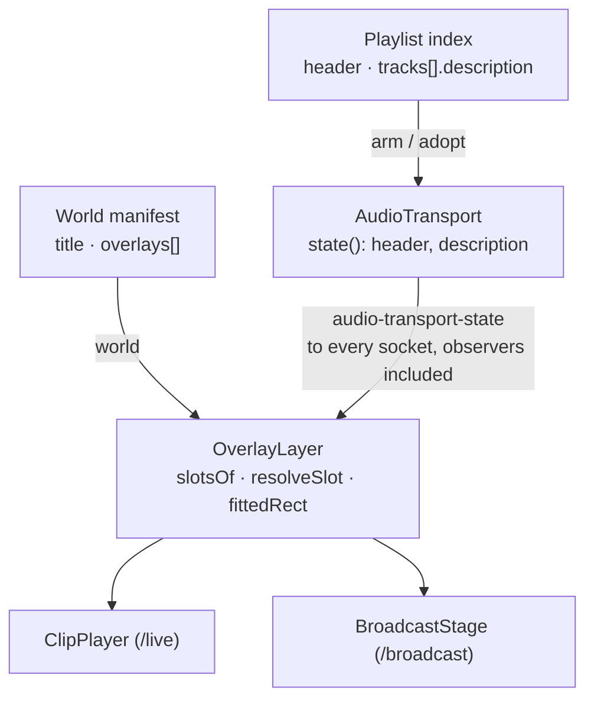
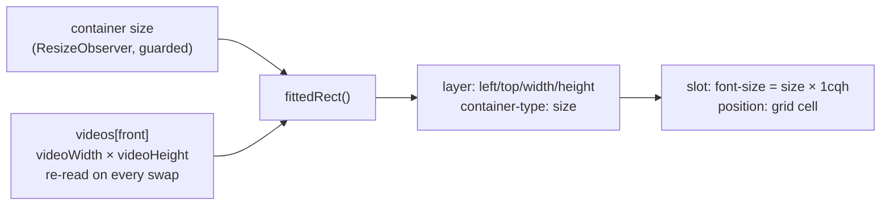
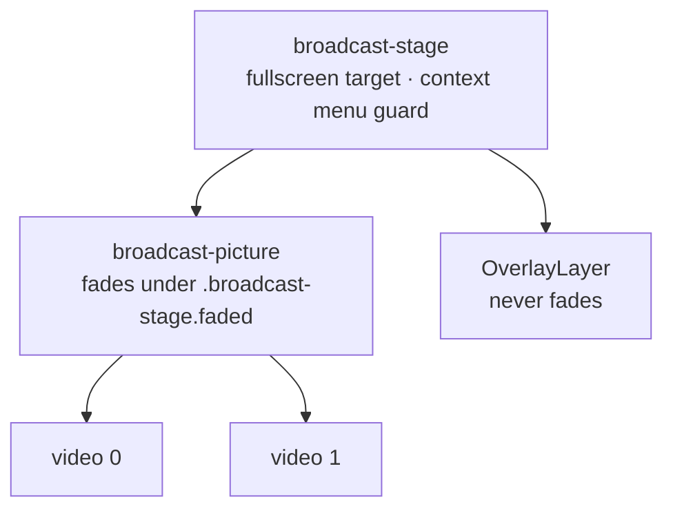

# feat: Video text overlays

## Summary

One overlay layer, mounted inside both stage containers, draws the open World's overlay slots over
the picture. The words come from three new optional fields — a title on the World, a header on the
playlist, a description on each track — and the look from a slot list on the World. The server
resolves the held track's words into the transport state so a broadcast window never needs the
playlist index, and the broadcast no-text test becomes an allowlist of the slots.

---

## Problem Frame

The output today carries no label and no track introduction, and the shipped `/broadcast` brief
promised it never would: its R3 bans every text node so that clip paths and fault text cannot
reach a projector. This feature is the deferral that brief named — overlays — and it has to add
the operator's own words without reopening the door to anyone else's. See origin for the framing.

---

## Requirements

Carried from origin, all twenty-six in scope. R1–R5 the data, R6–R12 the slots, R13–R19
rendering, R20–R22 the broadcast rule, R23–R26 authoring and parity. The origin's four flows and
ten acceptance examples are the verification targets; each unit names the ones it covers.

---

## Key Technical Decisions

**KTD1 — The overlay layer is sized to the fitted picture, not to the container.** Both stages
use `object-fit: contain`, so the video's box is smaller than its container whenever the aspect
differs, and a layer sized to the container would put "bottom left" in the letterbox bar and make
R18's proportions wrong. A pure function takes the container size and the front element's
intrinsic size and returns the fitted rect; the layer is positioned to it with inline style. With
no intrinsic size known — no clip, or black — the rect is the container, which is what lets the
title stay up over black (R22). The function lives in its own module with its own suite, the
`ui/src/layout.ts` precedent, because jsdom lays nothing out and the arithmetic is the whole
correctness claim.

**KTD2 — Size is a percentage of picture height, applied through container-query units.** The
layer is a size container and each slot's font size is `calc(<size> * 1cqh)`. That makes R18 a
property of CSS rather than of a resize listener, and R9's "relative to rendered height" literal.
`size` is stored as a number of percent, bounded 1–25.

**KTD3 — The server resolves the words; the transport state carries them.** `TransportState`
gains `header` and `description`, both `string | null`, filled from the held playlist and track.
The transport already snapshots the playlist on arm and re-adopts it on every rewrite, and every
client including an observer already receives this message, so R26 costs two fields and no new
message. The rewrite path — `announcePlaylist` → `refreshed()` → `adopt()` → `publish(true)` —
already publishes forced, and the publish signature is the whole state, so a text edit would
broadcast even unforced once `state()` carries the fields. Nothing in `publish` changes. The
title and slots reach a client on the `world` message the greeting already sends for the open
World; `apply` re-broadcasts it only when the edited World is the open one.

**KTD4 — Absent slots mean the defaults; an empty list means none. No version bump.**
`WORLD_VERSION` protects a key whose meaning changed (`shared/src/worlds.ts`, header comment), and
these are new optional keys. `slotsOf(world)` returns the three defaults when `overlays` is absent
and the stored list otherwise, so a World written before this feature satisfies R10 without a
write on open — the `shuffle`-absent-means-off idiom. R11's "remove every slot" is an explicit
`[]`. Two guards, as `effects` has two: `rebuild` names `overlays` through a lenient
`overlayEntries` that keeps every object-shaped entry whole (`effectEntries`' rule), and the
strict `cleanOverlays` is applied to `set-world-overlays` only. A strict guard at load would
answer `null` for a list holding one hand-edited `size: 30` and the next node drag would write
the World without its slots. A stored slot that is individually unusable is skipped at
resolution, never the list.

**KTD5 — Slots are addressed by position in the list and replaced whole.** Effects have no ids and
`set-world-effects` sends the whole next list; slots do the same. An agent then needs one message,
and there is no id to keep stable across a reorder. The three defaults are a constant in
`shared/src/overlays.ts`, not stored ids.

**KTD6 — The fade moves off the stage and onto the picture, in CSS only.** `.broadcast-stage.faded`
fades the whole container today. Origin R22 and F3 want the slots drawn over black during a
fault, so the two video elements move into a `.broadcast-picture` wrapper and the overlay layer
is its sibling. The `faded` class stays on the stage — ten assertions in
`ui/test/components/BroadcastStage.test.tsx` read it there — and the CSS moves: the 900ms
transition and `opacity: 0` go on `.broadcast-picture` under `.broadcast-stage.faded`. The fade
suite then passes unmodified. The stage stays the fullscreen target and the context-menu guard.

**KTD7 — The broadcast no-text test becomes an allowlist, and keeps its shape.** The existing
tree walker in `ui/test/components/BroadcastStage.test.tsx` stays; its assertion changes from
"no text nodes" to "every text node's nearest ancestor carrying `data-overlay-slot` exists and the
text equals that slot's resolved words". The attribute-prose check, the text-track silencing and
the context-menu guard are untouched. A string added anywhere else on the route still fails
(origin R21, AE6). This is a DOM test and is necessary, not sufficient — U6 is the evidence
(`docs/solutions/a-requirement-not-to-show-text-is-not-a-dom-requirement.md`).

**KTD8 — Empty text renders no element.** A slot whose source resolves to empty produces nothing in
the tree, not an empty `
`. That is R14 by construction and keeps the walker's allowlist exact:
there is never a slot element with nothing to say.

**KTD9 — Resolution is a pure shared function.** `resolveSlot(slot, world, transport)` in
`shared/src/overlays.ts` answers what a slot says. The layer calls it, the tests call it, and an
agent asking "what is on screen" can call it against the same two messages it already receives.

**KTD10 — Four messages, whole-value semantics, empty clears.** `set-world-title`,
`set-world-overlays`, `set-playlist-header`, `set-track-description`. An empty or whitespace
string removes the field rather than storing `""`, the way `bpm: null` clears a tempo. Text is
trimmed and bounded (`TEXT_MAX`, 200) at the store, never at the field alone, for the reason
`set-track-bpm` is refused in both places. Descriptions carry no playlist impact: no report is
raised.

**KTD11 — Colour is parsed and canonicalised, never normalised.** Slots go through `parseHex`
and `toHex` from `server/src/storage/colors.ts` for shape and canonical form, and a colour that
does not parse is refused. `normalizeColor` in the same file is not used: it lifts lightness to a
contrast floor against the chat pane background and rotates hues away from HAL's red and amber,
rules written so adapter text cannot pass for HAL's voice. Applied here they would silently
rewrite a black or red overlay the operator chose. Font is a free string bounded like a name,
defaulting to the page's own family.

---

## High-Level Technical Design

Where the words come from and where they are drawn:

How a slot is placed over a letterboxed picture (KTD1, KTD2):

The broadcast stage after KTD6:

---

## Implementation Units

Build order is U1 → U2 → U3 → U4 → U5 → U6. U-IDs are stable.

### U1. Shared shapes, defaults and resolution

**Goal.** The vocabulary in one module: the slot shape, the position and source sets, bounds, the
three default slots, `slotsOf`, `resolveSlot`, and the shape guards the stores call.

**Requirements.** R6, R7, R8, R9, R10, R14, R17; the types behind R1–R3 and R26.

**Dependencies.** None.

**Files.**
- `shared/src/overlays.ts` (create)
- `shared/src/worlds.ts` (modify — `title?`, `overlays?` on `World`)
- `shared/src/audio.ts` (modify — `header?` on `Playlist`, `description?` on `PlaylistTrack`)
- `shared/src/types.ts` (modify — `header`, `description` on `TransportState`)
- `server/test/live/overlays.test.ts` (create — shared modules are tested from `server/test`, as
  `world-graph.test.ts` is)

**Approach.** `OverlaySlot` is `{ position, source, text?, font, size, color }`. `POSITIONS` is the
nine-cell grid named `top-left` … `bottom-right`; `SOURCES` is `title | playlist-header |
track-description | text`. `TEXT_MAX` 200, `MAX_OVERLAYS` 20, `SIZE_MIN` 1, `SIZE_MAX` 25.
`DEFAULT_OVERLAYS` is title at `top-center`, header then description at `bottom-left`, white, the
page font, with provisional sizes of 5, 3 and 3.5 percent marked `provisional — replaced by U6
check 5`; until that check runs these are what ships. `slotsOf(world)` implements KTD4 and
returns `[]` for a null World, so the layer can mount before the first `world` message.
`resolveSlot` returns the trimmed text or `null`: title from the World, header and description
from the transport state (null-safe for a transport not yet received), `text` from the slot; a
stored slot whose position, source, size or colour is unusable resolves to `null`.
`overlayEntries(unknown)` is the lenient load guard of KTD4. `cleanOverlays(unknown)` mirrors
`cleanEffects`: an array of well-shaped slots or `null`, refusing an unknown position or source,
clamping nothing — a size outside the band is refused, for the reason `usableBpm` is an
acceptance (`docs/solutions/a-threshold-guard-written-as-a-negation-fails-open-on-nan.md`); a
colour goes through `parseHex`/`toHex` (KTD11). `cleanText` trims, bounds, and returns `undefined`
for empty.

**Patterns to follow.** `shared/src/audio.ts` for the registration-point comment and the
acceptance-not-negation guards; `shared/src/effects.ts` for a closed set exported once.

**Test scenarios.**
- `slotsOf` on a World with no `overlays` returns the three defaults; with `overlays: []` returns
  none; with a stored list returns it unchanged (KTD4).
- `resolveSlot` for each source: set text returns it trimmed; empty, whitespace and absent all
  return `null` (R14).
- `resolveSlot` for header and description with a transport holding no playlist returns `null`
  (R17); with `index -1` but a playlist loaded, header resolves and description is `null`.
- `cleanOverlays` refuses a position outside the grid, a source outside the set, a size of 0, 26,
  `NaN`, `Infinity` and a string; accepts 1 and 25; refuses a list longer than `MAX_OVERLAYS`.
- `cleanOverlays` on a `text` slot keeps `text`; on any other source drops a stray `text`.
- `cleanOverlays` stores `#000000` and `#e0301e` unchanged, canonicalises `#FFF` to `#ffffff`,
  and refuses `red` (KTD11 — no contrast lift, no hue rotation).
- `overlayEntries` returns `undefined` for absent, `[]` for a non-array, and keeps a list of five
  whole when one holds `size: 30`; `resolveSlot` on that one slot returns `null` and the other
  four resolve.
- `cleanText` at `TEXT_MAX` keeps it, at `TEXT_MAX + 1` cuts it, on whitespace returns `undefined`.

**Verification.** Typecheck passes with the three types extended and no consumer broken.

---

### U2. The stores keep and edit the words

**Goal.** Title and overlays survive every World write; header and description survive every
playlist write; four pure mutations exist for the service to call.

**Requirements.** R1, R2, R3, R4, R5, R11.

**Dependencies.** U1.

**Files.**
- `server/src/storage/worlds.ts` (modify — `rebuild` guard, `setWorldTitle`, `setWorldOverlays`)
- `server/src/storage/audio.ts` (modify — `rebuild`, `cleanTrack`, `setPlaylistHeader`,
  `setTrackDescription`)
- `server/test/storage/worlds.test.ts` (modify)
- `server/test/live/audio-store.test.ts` (modify)

**Approach.** In `worlds.ts`, `rebuild` names `title` through `cleanText` and `overlays` through
the lenient `overlayEntries` after the spread, exactly as `effects` is named through
`effectEntries`, so a hand-edited `overlays: "yes"` cannot reach the loaded World and a
well-formed list with one bad slot is neither refused nor deleted by the next save (KTD4).
`setWorldOverlays` is `setWorldEffects` with the strict `cleanOverlays`; `setWorldTitle` uses
`cleanText` and removes the key on empty. In `audio.ts`, `cleanTrack` shapes only the
client-supplied arrivals in `addTracks`; existing tracks are spread through untouched and
`rebuild` keeps them whole through `trackEntries`, so a stored description already survives
import and every index rewrite. `description` is not added to `cleanTrack` — an arrival never
carries one. `rebuild` names `header` after the spread. `setTrackDescription` finds the track by
path, as `setTrackBpm` does.

**Execution note.** The survival cases are regression guards and pass against the current store;
the fail-first discipline (the regression-test memory: a test that passes with the fix removed
covered nothing) is aimed at the two cases that can fail — `setTrackDescription` on a path the
playlist does not hold returns `null`, and `setPlaylistHeader` with whitespace removes the key.

**Test scenarios.**
- A manifest with `title` and `overlays` loads them and writes them back unchanged after an
  unrelated mutation such as `addState` (R5, AE8).
- A manifest with `overlays: "yes"` loads with `overlays: []` and the file is not rewritten.
- A manifest whose five slots include one with `size: 30` loads all five, and after `addState`
  still holds all five on disk (KTD4).
- A manifest from before the feature loads with no `title` and no `overlays`, and `slotsOf` on it
  gives the defaults (AE8).
- `setWorldTitle` with `"  "` removes the key; with a string longer than `TEXT_MAX` stores the cut.
- `setWorldOverlays` with `[]` stores `[]`; with a malformed list returns `null` and writes nothing.
- A playlist index with `header` and a track `description` loads both; after `renamePlaylist`,
  `reorderTracks`, `setTrackBpm`, `setTrackDuration`, `setTrackUnplayable` and `removeTrack` of
  another track, the description is still on its track (R4, AE9 by path).
- An import into a playlist that already has descriptions keeps them (`addTracks` spreads the
  existing tracks).
- `setTrackDescription` on a path the playlist does not hold returns `null`; with empty text
  removes the key.
- `setPlaylistHeader` round-trips through a save and load.

**Verification.** Every survival case above passes, and the two fail-first cases fail with their
mutation stubbed to return the playlist unchanged.

---

### U3. The wire, the services and the transport

**Goal.** The four messages exist and are handled; the transport reports the held playlist's
header and the held track's description to every client.

**Requirements.** R15, R16, R17, R25, R26; F4.

**Dependencies.** U2.

**Files.**
- `shared/src/types.ts` (modify — four `ClientMessage` members)
- `server/src/live/service.ts` (modify — the two World cases via `apply`)
- `server/src/live/audio-service.ts` (modify — the two playlist cases via `editPlaylist`)
- `server/src/live/transport.ts` (modify — `header` wherever `tracks` is assigned; `state()`)
- `server/test/live/service.test.ts` (modify)
- `server/test/live/transport.test.ts` (modify)

**Approach.** World cases mirror `set-world-effects`: `apply(name, worldId, mutation)`, which
answers on `world-result` and broadcasts the World. Playlist cases mirror `set-track-bpm` without
the impact report. The transport stores the header beside `this.tracks` everywhere `tracks` is
assigned — `load()`'s success and not-found branches, `stop`, and `adopt` before its `!held`
return — so an emptied transport reports `header: null`; `state()` adds `header` and
`description` from the held track. The rewrite path already publishes forced (KTD3); nothing in
`publish` changes. The observer needs nothing new: it already receives `audio-transport-state`
and the `world` greeting.

**Execution note.** The description-edit case below is a characterisation test of `refreshed()`
as it stands; it exists to pin that path, not to drive a fix.

**Test scenarios.**
- `set-world-title` on the open World answers `world-result` ok and the broadcast World carries the
  title; on a missing World it answers an error.
- `set-world-overlays` with a malformed list answers an error and the manifest is unchanged.
- `set-playlist-header` and `set-track-description` are echoed in the `playlist` broadcast.
- A track with a description is started: the transport state carries `description`; the next
  track without one carries `null` (AE1).
- The transport holding a playlist with a header reports it with `index -1`; after `stop`
  empties the transport, both fields are `null` (AE3).
- Editing the held track's description while it plays produces a new `audio-transport-state`
  with the new text (KTD3, characterisation).
- With a playlist holding a header sounding, `startPlaylist` of an id the store does not hold
  empties the transport and the next state carries `header: null` and `description: null`.
- `set-world-title` on a World that is not open answers `world-result` and broadcasts no `world`.
- Pausing does not clear `description` (AE2).
- Under shuffle, `description` belongs to the track at `path`, not to the position (AE9).
- An observer socket receives the transport state with both fields (F4).
- An unknown message type is still refused by the final `default`.

**Verification.** A client that has only ever received `world` and `audio-transport-state` can
compute every slot's text with `resolveSlot`.

---

### U4. The overlay layer on both stages

**Goal.** One component, mounted by `ClipPlayer` and `BroadcastStage`, that draws the resolved slots
over the fitted picture; the broadcast fade restructured; the allowlist test.

**Requirements.** R12, R13, R14, R18, R19, R20, R21, R22; F3.

**Dependencies.** U1, U3.

**Files.**
- `ui/src/overlay.ts` (create — `fittedRect`, pure)
- `ui/src/components/OverlayLayer.tsx` (create)
- `ui/src/components/ClipPlayer.tsx` (modify — mount the layer)
- `ui/src/components/BroadcastStage.tsx` (modify — picture wrapper, fade stays a stage class; mount the layer)
- `ui/src/styles.css` (modify)
- `ui/test/overlay.test.ts` (create)
- `ui/test/components/OverlayLayer.test.tsx` (create)
- `ui/test/components/BroadcastStage.test.tsx` (modify — allowlist)
- `ui/test/components/ClipPlayer.test.tsx` (modify — layer present, existing cases unmodified)

**Approach.** `fittedRect(container, intrinsic | null)` returns the contained rect, or the
container when intrinsic is null or zero. The layer observes the container with a
`ResizeObserver` only when `typeof ResizeObserver === "function"` — jsdom has none, and an
unguarded constructor would throw on mount in every existing stage test; the `silenceTextTracks`
guard in `useClipStage.ts` is the idiom — and otherwise reads the container's rect once on
mount. The fitted rect is recomputed in an effect keyed on `front` and on the container size,
reading `videoWidth`/`videoHeight` from `videos[front].current`; `loadedmetadata` fires on the
*back* element while it preloads and the swap on `canplay` raises no metadata event, so a layer
that read only the metadata event would keep the previous clip's aspect after every swap.
`loadedmetadata` on either element also triggers a recompute so the first clip is sized before
its swap. The layer always carries an explicit inline width and height, so `cqh` never resolves
against a zero-height container. The layer is
`position: absolute`, `container-type: size`, `pointer-events: none`, and lays its nine cells out
with a grid so two slots in one cell stack in list order (R12). Each rendered slot carries
`data-overlay-slot` and its resolved text as its only child; a slot resolving to `null` renders
nothing (KTD8). No `title`, no `aria-label`. In `BroadcastStage`, the two videos move into
`.broadcast-picture`; the `faded` class stays on the stage and the CSS fades the wrapper under
it (KTD6); the layer is the stage's other child. Double-click and the context-menu guard stay on
the stage.

**Patterns to follow.** `ui/src/layout.ts` for a pure module with a suite; `BroadcastStage.tsx`'s
comments for why every non-text leak is closed on the element.

**Test scenarios.**
- `fittedRect`: a 16:9 picture in a 4:3 container is letterboxed top and bottom, centred; a 4:3
  picture in a 16:9 container is pillarboxed; equal aspects fill; null intrinsic returns the
  container; a zero-height intrinsic returns the container.
- With the three defaults and a World title, a header and a description set, three slot elements
  render with exactly those strings (AE1, F1).
- A slot resolving to empty renders no element at all, and the layer's child count matches the
  count of non-empty slots (AE4, R14).
- Two slots at `bottom-left` render in list order (AE10).
- Style: a slot's inline or class-driven font size is expressed in `cqh`, its colour and font are
  the slot's, and the layer's inline rect matches `fittedRect` for a mocked container and
  intrinsic size (R18, AE5 at the unit level). The test file installs a minimal `ResizeObserver`
  stub so the mocked container size can be fed in.
- After a swap from a 16:9 clip to a 4:3 clip in the same container, the layer's inline rect
  matches `fittedRect` for the new clip, not the old one.
- With no `ResizeObserver` defined, the layer mounts and sizes to the container once.
- **BroadcastStage allowlist (KTD7):** with a title, header and description set, every text node
  under the stage sits under a `data-overlay-slot` ancestor and equals its slot's resolved text;
  with a stray string injected under the stage in a test-only render, the walker fails (AE6).
- With no World open, and with the World open but nothing assigned, the stage renders the slots
  the World provides and nothing else (R22).
- A clip failing and the fade completing leaves `faded` on the stage, the two videos inside
  `.broadcast-picture`, and the layer outside it with its text unchanged (AE7, F3).
- The attribute-prose, text-track, context-menu, Picture-in-Picture and every fade case pass
  unmodified.
- `ClipPlayer.test.tsx` passes unmodified; one added case asserts the layer is present under
  `clip-player`.

**Verification.** Both surfaces render the same slot strings from the same store state, and the
walker's allowlist rejects a string outside a slot.

---

### U5. Authoring on `/live`

**Goal.** The operator can set the title and the slot list on the World, and the header and each
track's description in the playlist editor.

**Requirements.** R23, R24; F1, F2.

**Dependencies.** U3.

**Files.**
- `ui/src/components/StateGraph.tsx` (modify — the World panel, beside "world effects")
- `ui/src/components/OverlayEditor.tsx` (create)
- `ui/src/components/PlaylistEditor.tsx` (modify)
- `ui/src/styles.css` (modify)
- `ui/test/components/StateGraph.test.tsx` (modify)
- `ui/test/components/PlaylistEditor.test.tsx` (modify)

**Approach.** `OverlayEditor` is `EffectEditor`'s shape: the whole list from the last broadcast,
one row per slot with position and source selects, a text input shown only for the `text` source,
a font input, a size number input, and `ColorField` for colour; add, remove, up and down; every
change sends `set-world-overlays` with the whole next list (KTD5). The title is an input above it
committing on blur and Enter, the `rename-playlist` idiom, sending nothing when unchanged. With no slots, the editor renders
`EffectEditor`'s muted empty message in its own words ("No slots. Nothing is drawn.") above the
add button. In `PlaylistEditor`, the header input sits under the playlist name, and each track
row gains a description input on its own line beneath the name — not squeezed into the existing
control row (`docs/solutions/a-label-may-be-squeezed-a-control-may-not.md`). Drafts are keyed by
path, as the tempo drafts are. Every text input carries `maxLength={TEXT_MAX}`, so the store's
bound is visible at the field rather than applied silently after the round trip.

**Test scenarios.**
- Typing a title and blurring sends `set-world-title` once; blurring unchanged sends nothing.
- Changing a slot's position sends `set-world-overlays` with the whole list and only that slot
  changed; add appends a default slot; remove drops one; up and down swap.
- Selecting the `text` source shows the text input; selecting another hides it.
- With `overlays: []` the empty message renders and the add button still works.
- The title, header, description and slot text inputs each carry `maxLength` equal to `TEXT_MAX`.
- A size typed outside 1–25 is refused beside the field and sends nothing, the `commitBpm` idiom.
- Committing a header sends `set-playlist-header`; committing a track description sends
  `set-track-description` with that track's path; empty sends empty.
- The row for the sounding track still carries `track-playing`, so the description input did not
  break the path match.
- Existing `PlaylistEditor` and `StateGraph` cases pass unmodified.

**Verification.** After U6's screenshot, the description row does not squeeze the play, tempo,
move and remove controls at the narrowest width `scripts/screenshot.mjs` renders.

---

### U6. Verify by running it

**Goal.** Evidence from a real browser, which is the only evidence for a rendered size, a colour,
or what a projector shows.

**Requirements.** R18, R20, R22 (AE5, AE6, AE7) — the ones a DOM test passes while the property is
broken.

**Dependencies.** U1–U5.

**Files.** None committed; screenshots may land in `.screenshots/`.

**Approach.** Rebuild, boot with `npm run start` on port 9000 (it does not auto-reload), open a
World with a title and an armed playlist with a header and descriptions on `/live`, and
`/broadcast` fullscreened in a second window. Then:

1. **AE5, measured.** Read the computed `font-size` of the title slot on both routes and divide
   each by its layer's rendered height; the two ratios agree. A screenshot is not evidence for a
   size (memory: `verify-hal-by-running-it`).
2. **Letterbox placement.** With a clip whose aspect differs from the window, confirm bottom-left
   text sits at the picture's corner, not the window's.
3. **AE7.** Rename the clip file mid-loop; the picture holds, fades, and the text stays at full
   opacity over black.
4. **AE1–AE3 by eye.** Advance through a track with and without a description, pause, empty the
   transport.
5. **Pick the default sizes** for the three slots against the output and replace the provisional
   values in `DEFAULT_OVERLAYS`. If the feature merges without this check, record that in
   `docs/residual-review-findings/` as the broadcast surface did, so the provisional numbers are
   a decision on record rather than an accident.
6. **Squeeze check** for U5 at the narrowest screenshot width.

**Verification.** The two computed ratios from check 1, the mid-fault screenshot from check 3, and
the three default sizes written into `shared/src/overlays.ts`.

---

## Scope Boundaries

**In scope.** All twenty-six origin requirements, the fade restructure KTD6 requires, and the
running verification.

**Deferred to follow-up work.**
- Text treatment beyond font, size and colour: shadow, outline, backing band. The origin defers
  them; note that white text on a bright clip will need one of them, and U6 will show whether
  the defaults already do.
- Animation of any kind, per-slot offsets, images and logos, clocks and timers.
- Track and playlist names as a source.
- Narrowing what an observer socket is told, carried over from the broadcast plan.

**Outside this feature.** Any change to sound or the state machine on either route. Any text an
operator did not type.

---

## Risks

**A field-by-field rebuild deletes what it does not name.** `cleanTrack` is that shape, but it
runs only on arrivals; the survival cases in U2 exist so that if a later change widens its reach,
the loss is caught (`docs/solutions/rebuilding-a-cache-field-by-field-turns-a-read-into-a-delete.md`).

**Test environment gaps.** jsdom evaluates no `cqh` and defines no `ResizeObserver`; the unit
tests can assert the expression and the guarded mount, not the pixel. Mitigation: U6 check 1 is
the measurement, and the plan does not claim the DOM test proves R18.

**World title over another World's header.** The transport belongs to no World, so after
switching Worlds with playback left alone, World B's title sits over World A's header. Settled
upstream by "data with the playlist, look with the World"; U6 looks at it once.

**The fade restructure touches a surface with defect history.** `BroadcastStage` had five
timing defects fixed in review. Mitigation: its existing suite passes with only the allowlist
assertion changed; the fade cases are unmodified.

**Two slots, one cell, and word-wrap.** Long descriptions at a large size wrap and can push a
stacked slot out of the picture. Deferred: `TEXT_MAX` bounds it, and U6 shows whether the
defaults are safe.

---

## Open Questions

- **Where exactly the slot editor sits.** Beside "world effects" in the World panel is the
  default; if that panel is already long on a real World, a collapsible section there is the
  fallback. Decided in U5 against the screenshot.
- **Default sizes and font.** Picked in U6.
- **Whether `text` slots want a second line.** A single-line input is planned; if the operator
  wants a two-line fixed caption, that is two slots in one cell today.
- **Should a title or description over `TEXT_MAX` be refused rather than cut?** The plan cuts at
  the store and bounds the field; an agent sending 300 characters is told ok and gets 200, which
  is the opposite of the `set-track-bpm` precedent it cites. Decided in U3.

---

## Sources & Research

- `docs/brainstorms/2026-09-05-video-text-overlays-requirements.md` — origin.
- `docs/plans/2026-09-04-002-feat-broadcast-surface-plan.md` — the surface this extends, its
  never-run U6, and KTD9's "a DOM search is not the evidence".
- `docs/solutions/a-requirement-not-to-show-text-is-not-a-dom-requirement.md` — KTD7.
- `docs/solutions/rebuilding-a-cache-field-by-field-turns-a-read-into-a-delete.md` — U2's
  `cleanTrack` risk.
- `docs/solutions/a-threshold-guard-written-as-a-negation-fails-open-on-nan.md` — U1's guards.
- `docs/solutions/a-label-may-be-squeezed-a-control-may-not.md` — U5's row layout.
- `server/src/live/transport.ts` — `state()`, `adopt`, and the publish signature KTD3 works
  around.
- `server/src/storage/worlds.ts` — `rebuild`, `setWorldEffects`, the `WORLD_VERSION` comment.
- `server/src/storage/audio.ts` — `rebuild`, `cleanTrack`, `setTrackBpm`.
- `server/src/storage/colors.ts` — `parseHex`, `toHex`, and why `normalizeColor` is not used (KTD11).
- `ui/src/components/StateGraph.tsx` — `EffectEditor`, the whole-list editing idiom U5 copies.
- `ui/src/components/useClipStage.ts`, `BroadcastStage.tsx`, `ClipPlayer.tsx` — the two surfaces
  and their shared engine.
- `AGENTS.md` — the agent-native parity rule behind R25.
