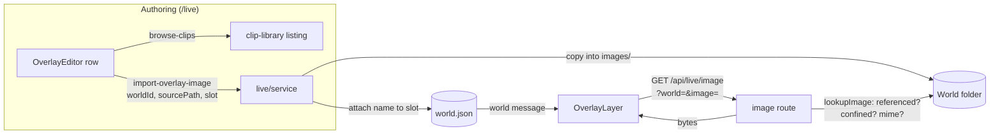

# feat: Overlay images, and a font list

## Summary

The World's overlay list gains a second kind of member. An image slot names a position, a file, a
size and an opacity, and every image slot draws as a layer beneath every text slot. The file is
browsed for and copied into the World in one message, the way a clip is, and served by a sibling of
the clip route. The text slot's font input becomes a list that does not discard a family it has
never heard of.

---

## Problem Frame

The shipped overlays put the operator's words on the picture and nothing else. A channel mark and a
plate behind the caption — the two things reached for after captions — both still mean compositing
the window in a second tool, which is what the overlay work existed to stop. The font control has a
narrower fault: a free text field over a family the browser resolves, so a typo draws in the page's
own font and says nothing. See origin for the framing.

---

## Requirements

Carried from origin, all twenty-nine in scope. R1–R5 the slot list, R6–R13 images on the picture,
R14–R20 choosing an image, R21–R23 fonts, R24–R26 the broadcast rule, R27–R29 authoring and parity.

Origin's Outstanding Questions are resolved here as KTD6 (formats), KTD7 (opacity), KTD3 (observer
delivery), KTD8 (the orphaned file), and U6/U7 (editor affordances and the family list).

---

## Key Technical Decisions

**KTD1. The guard branches on kind, and the editor's filter branches with it — in one unit.**
`OverlayEditor.write()` drops any slot `cleanSlot` refuses before sending, because the server refuses
a list whole. Extend the guard for a second kind without extending that filter's understanding in the
same breath and one image slot jams every edit to every text slot in the list. This is the defect
recorded three days ago in
`docs/solutions/a-lenient-load-and-a-strict-write-need-a-filter-between-them.md`, on a new input. U1
and U6 must not be split across the seam; U1 ships the guard, U6 ships the editor, and U1 carries the
test that a malformed image slot does not block a text edit.

**KTD2. Images are a second grid, not extra children of the nine cells.** `OverlayLayer` renders a
`.overlay-cell` per position and stacks that cell's slots in flow. An image added to a cell would
therefore become another row in the column, not a layer under it. R6 is met by rendering two grids
inside `.overlay-picture` — the image grid first, the text grid second — both anchored to the same
fitted rect. List order stays what it is for text, and layering is true by DOM order rather than by a
rule the drawing code keeps.

The three-by-three definition has to **move** for this to work. `.overlay-picture` is itself the grid
today, and its nine cells land in the right place purely by source order, carrying no `grid-area` —
so inserting two wrappers between them would make the wrappers the grid items and put everything in
the first two cells. The grid moves onto `.overlay-images` and `.overlay-text`, each
`position: absolute; inset: 0` with the existing template; `.overlay-picture` keeps only its
positioning, its `container-type: size` and the new `overflow: hidden`.

**KTD3. No new message carries a slot edit.** The editor already sends the whole list on every change
via `set-world-overlays`, and slots have no ids. An image slot's position, size and opacity therefore
reach the server, and reach an agent, through the message that exists. R28 needs exactly one new
message: the import. R29 needs no new message — an observer already receives the World, and the
image is fetched from a route, not pushed. It does get a test, in U5: an architectural argument that
nothing verifies is how a parity claim quietly stops being true.

**KTD4. Import copies and attaches in one message.** `import-clip` assigns the copied clip to its
owner in the same handler, on the stated ground that a file in `clips/` that nothing names is
unreachable through the route and invisible in the graph. `import-overlay-image` follows it: it names
the World and the slot index the image is for, and refuses before the copy if that index is not an
image slot. There is no free-standing "add to the library" step, and the copy is rolled back when the attach
fails, so no import leaves an orphan.

**KTD5. The path guard is the store's, called once.** `resolveClipPath` confines to the World
directory rather than to `clips/`, so it resolves `images/logo.png` unchanged and is reused verbatim
rather than copied. Both doors onto the World folder — the import and the route — resolve a stored
name through that one helper.

**KTD6. Accepted formats are PNG, JPEG, GIF, WebP and AVIF, by extension.** The extension gate is the
same table the route serves by, mirroring `videoMime`'s rule that what the browser offers and what the
route will draw cannot drift. Animation is not detected and not refused (R12): a still WebP and an
animated one are the same file to this build.

**KTD7. Opacity is a percentage, 0–100, absent meaning opaque.** Stated as an acceptance and negated
once, so `NaN` and `Infinity` fail closed — `usableSize`'s shape, for the reason
`docs/solutions/a-threshold-guard-written-as-a-negation-fails-open-on-nan.md` gives. Absent and `NaN`
are different answers: absent defaults to opaque, `NaN` refuses the slot. A `?? 1` fallback does not
distinguish them and must not be used.

**KTD8. Every pick re-copies, and an image the last slot stops naming is left on disk.** Choosing the
same file for a second slot in one World copies it again under a suffixed name; there is no
pick-from-what-this-World-already-has. Origin left that open, and the answer is the clip importer's:
one import, one file, no identity to reason about. Deleting it would be a write triggered
by an edit that did not ask for one, and on Windows a file the browser is still rendering throws
EBUSY. The route already refuses to serve anything the World does not reference, so an unreferenced
file is unreachable rather than exposed. Recorded as a deliberate leak of disk space.

**KTD9. A stored font that is not on the list is injected into that row's list.** The `<select>`'s
value must equal the stored family or the browser reports the first option, and the next `{ ...slot }`
spread then writes that family to disk — the failure
`docs/solutions/a-fix-to-what-a-picker-offers-is-not-a-fix-to-what-it-keeps.md` records one feature
earlier, where editing one field silently rewrote another. No edit path normalises `font`.

**KTD10. A missing image is an absent element, not an empty alt.** `onError` removes the `` from
the tree. The broadcast sweep already covers `alt`, `title` and `aria-label`, so a blank alt passes
the test while a broken image can still paint a platform glyph — the test is a mitigation and the
browser run is the evidence, exactly as
`docs/solutions/a-requirement-not-to-show-text-is-not-a-dom-requirement.md` describes.

---

## High-Level Technical Design

Where an image's bytes come from, and where its geometry comes from. The two paths meet only at the
stored name.



Draw order inside the fitted rect. Two grids, not one, is the whole of KTD2:

```
.overlay-picture  (container-type: size, overflow: hidden)
├── .overlay-images   ← 9 cells, image slots only, drawn first
│     └── 
└── .overlay-text     ← 9 cells, text slots only, unchanged
      └── .overlay-slot  (stacks in list order, as today)
```

---

## Implementation Units

### U1. The slot vocabulary gains a kind

**Goal:** One list holds two shapes, and every guard knows which it is looking at.

**Requirements:** R1, R2, R3, R4, R5, R10, R11.

**Dependencies:** none.

**Files:** `shared/src/overlays.ts`, `server/test/live/overlays.test.ts`.

**Approach:** A discriminated union over an optional `kind`, absent meaning text (R3), so no stored
World is rewritten. `cleanSlot` branches first on kind and then applies only that kind's rules: an
image slot has no `font`, `source`, `text` or `color` and must not be refused for lacking them; a
text slot is unchanged. `resolveSlot` answers text for text slots and null for image slots, and its
doc-comment stops claiming it answers for every member. `overlayEntries` keeps its leniency
untouched. Add `IMAGE_NAME_MAX`, `OPACITY_MIN`/`OPACITY_MAX` and a `usableOpacity` acceptance
alongside `usableSize` (KTD7), and an `imageSlots`/`textSlots` split the layer and the editor both
read so neither invents the partition.

The module's opening comment currently states that a slot is "text drawn over the video" and that a
new kind of caption "is an entry here and nothing else." Both become false. Rewrite them rather than
leaving a claim nothing runs.

**Patterns to follow:** `usableSize`'s single-negation acceptance; `effectEntries`/`overlayEntries`'s
lenient-load rule; the `shuffle`-absent idiom for a new optional key.

**Test scenarios:**
- A slot with no `kind` cleans as a text slot, unchanged from today. *Covers R3.*
- An image slot with position, image and size cleans, with opacity absent. *Covers R2, R10.*
- An image slot carrying a `font` or `color` has them dropped, the way a stray `text` is dropped on a
  non-text source.
- An image slot missing `image`, or with an empty or over-long name, is refused.
- Opacity of `NaN`, `Infinity`, `-1` and `101` are each refused; absent is accepted and stays absent
  on the way out. *Covers R10, KTD7.*
- A list mixing both kinds cleans whole; a list of only image slots cleans; an empty list cleans.
  *Covers R4, R5.*
- A list of `MAX_OVERLAYS + 1` mixed slots is refused, proving the bound is not per-kind. *Covers R4.*
- `resolveSlot` answers null for an image slot and is unchanged for all four text sources.
- **Invariant sweep.** Enumerate each existing overlay invariant — the size band, the position set,
  the `MAX_OVERLAYS` bound, the source exhaustiveness, "resolving a slot yields text" — and assert it
  against a member with no font, no source and no text. Every one of these held partly because every
  member was text; see `docs/solutions/a-safeguard-that-worked-by-accident-breaks-when-a-case-is-added.md`.

**Verification:** A hand-written manifest holding one text slot and one image slot loads, cleans and
round-trips through the strict guard with both members intact.

---

### U2. Image slots survive the store

**Goal:** Confirm a new optional field is not silently deleted by the next write, and fix the one
path where it is.

**Requirements:** R3, R5, R10, R15.

**Dependencies:** U1.

**Files:** `server/src/storage/worlds.ts`, `server/test/storage/worlds.test.ts`.

**Approach:** The store's load path is **already** spread-first, and its lenient overlay guard only
filters non-objects, so `kind`, `image` and `opacity` survive a load and re-save untouched; the
corruption-fallback branch refuses every write and so deletes nothing. The audit here is expected to
confirm that, not to fix it — but it must actually be run, because `kind`, `image` and `opacity` are
exactly the shape that disappears when a rebuild names fields: optional for backward compatibility,
therefore invisible to the compiler. See
`docs/solutions/rebuilding-a-cache-field-by-field-turns-a-read-into-a-delete.md`.

The path that does drop them is the guard's own named rebuild in U1, and the editor's slot spread.
This unit's round-trip test is what proves the whole chain, and its red bar belongs to U1: revert the
guard's kind branch and the round-trip loses `image` and `opacity`.

**Execution note:** Write the round-trip test before U1's guard change lands, and confirm it goes red
against the un-branched guard.

**Test scenarios:**
- Save a World with an image slot, reopen the store, make an **unrelated** edit, reopen again, and
  assert `kind`, `image` and `opacity` all survive. The reopen-and-read-only half of this test passes
  against the bug. *Covers R3, R5.*
- The same for a slot whose opacity is absent: it stays absent rather than acquiring a default on
  disk.
- A manifest written before this feature loads with its slots unchanged and gains no keys. *Covers R3.*
- A World whose manifest will not parse still lists and opens read-only, unchanged by the new fields.

**Verification:** The round-trip test goes red when U1's guard drops its kind branch.

---

### U3. The image route

**Goal:** A World's own image reaches a browser, and nothing else does.

**Requirements:** R13, R16, R19, R29.

**Dependencies:** U1.

**Files:** `server/src/live/images.ts`, `server/src/http.ts`, `server/test/live/images.test.ts`,
`server/test/http.test.ts`.

**Approach:** `imageMime` is a table of its own (KTD6), beside `videoMime` and for its stated reason.
`referencedImages(world)` collects every name the World's image slots hold, so a file dropped into
`images/` that no slot names is not network-reachable — the confinement is the floor, not the rule. It
walks the stored list loosely, taking any entry that carries an image name, rather than filtering
through the strict guard — `referencedClips`' rule, and for its reason: a slot the guard refuses for
an unrelated fault (a bad opacity) still legitimately names a file the operator imported, and a route
that refused it too would answer 404 for a second, unrelated cause. The layer does not draw a refused
slot, so nothing is reachable through this that the picture shows.
`lookupImage` mirrors `lookupClip`: load without the validate pass, check the reference set, resolve
through `resolveClipPath` (KTD5), check the mime, stat the file. The route sits at
`/api/live/image?world=&image=`, under `/api/` because the SPA fallback is greedy and Vite proxies
only `/api` and `/ws`, with the image name as a query parameter and never a path segment.

Re-derive the authorisation rather than copying it: an `` sends no Origin and cannot present the
per-boot token, so `allowsHost` is what defends the route, the same accepted trade already made for
the clip, audio and camera routes. State that in a comment and enumerate every way bytes leave.
`docs/solutions/a-gate-that-checks-one-direction-is-half-a-gate.md` is the reason this is written out
rather than inherited. No byte-range handling: an image is fetched whole.

**Test scenarios:**
- An image a slot names is served with the right mime and body. *Covers R16.*
- A file present in `images/` that no slot names answers 404. A file named by a slot but absent from
  disk answers 404. *Covers R13.*
- Path refusals, each written as an absence: `..` traversal, an absolute path, a Windows
  drive-relative `C:foo`, a UNC path, a URL-encoded traversal, and a symlink pointing outside the
  World. *Covers R16.*
- A name whose extension is not on the table answers 403 even when the file exists.
- A request from a disallowed Host is refused before any file is touched; a request with no Origin is
  allowed, matching the clip route.
- `POST` and `PUT` answer 405 with an `Allow` header.
- With no worlds store wired up, the route answers 503 rather than 404.

**Verification:** The negative path tests fail when `resolveClipPath` is replaced by a plain join.

---

### U4. Browsing for an image, and importing it

**Goal:** One message copies a chosen file into the World and attaches it to a slot.

**Requirements:** R14, R15, R17, R18, R19, R20, R28.

**Dependencies:** U1, U3.

**Files:** `shared/src/types.ts`, `server/src/live/library.ts`, `server/src/live/service.ts`,
`server/test/live/library.test.ts`, `server/test/live/overlays.test.ts`.

**Approach:** `listFolder` gains an images list beside its clips list, gated on `imageMime` so the
browser offers exactly what the route will draw, under the same per-kind `LIST_MAX` budget and the
same truncation report. `importOverlayImage` mirrors `importClip`: resolve and stat the source,
refuse a file the table does not know, `mkdir` the World's `images/`, run the collision-suffix loop
with its `MAX_NAME_ATTEMPTS` bound, and copy with `COPYFILE_EXCL`.

`import-overlay-image` carries the World, the source path and the index of the slot to attach to. It
refuses before the copy when the World is not open, when that index is out of range, or when that
slot is not an image slot — named refusals, not a fall-through to a true-sounding answer about
something else. The attach and the copy are one handler (KTD4), and the handler mirrors `import-clip`
on **both** sides of the copy: the index is re-checked inside the apply closure, and a failed apply
deletes the copied file the way `removeClipFile` does. Checking only before the copy is not enough,
because a slot index is a weaker address than a State id — a `set-world-overlays` arriving during the
copy can reorder or shorten the list, so a stale index either fails, orphaning the file, or attaches
the image to a different slot. Serialisation orders the writes; it does not make a stale index mean
the same slot. The manifest write goes through the
store's existing atomic write and per-entity serialisation, because an import and a concurrent slot
edit are two read-modify-write cycles on one `world.json`; see
`docs/solutions/windows-hardening-patterns.md`.

The remembered browse folder is the existing one at the worlds root, which is already shared across
Worlds (R18) and needs no new storage.

**Test scenarios:**
- Importing attaches the copied name to the named slot and leaves the file in the World's `images/`.
  *Covers R14, R15.*
- A second import of a file with the same basename yields two files under different names, both
  present. *Covers R20, AE9.*
- A source that is not an image is refused with a reason, and nothing is copied. *Covers R19, AE9.*
- Import into a slot index that is out of range, and into a text slot, are each refused with their own
  message, before any copy.
- Import into a World that is not open is refused.
- The same source imported into two Worlds produces two independent copies; replacing one leaves the
  other's **content hash** unchanged. Compare hashes, never names — the collision suffix makes a
  filename lie about identity in this codebase. *Covers R17, AE8.*
- `listFolder` reports images and folders with its budgets and its truncation flag intact, and still
  reports clips unchanged.
- A folder that cannot be read is reported, not thrown.
- The attach fails after the copy has landed: no file is left in `images/`.
- The slot list is reordered by a `set-world-overlays` arriving during the copy: the import refuses
  rather than attaching the image to whatever slot now holds that index.

**Verification:** An agent can add an image slot and fill it using only `set-world-overlays` and
`import-overlay-image`. *Covers R28.*

---

### U5. The layer draws the image grid

**Goal:** Images under text, sized off the picture, clipped at its edge, and gone when the file is.

**Requirements:** R6, R7, R8, R9, R10, R12, R13, R29.

**Dependencies:** U1, U3.

**Files:** `ui/src/components/OverlayLayer.tsx`, `ui/src/imageUrl.ts`, `ui/src/styles.css`,
`ui/test/components/OverlayLayer.test.tsx`.

**Approach:** Two grids inside `.overlay-picture`, image grid first, with the three-by-three
definition moved onto the two wrappers (KTD2). Each image renders as `height: {size}cqh; width: auto`,
so R8 is the same mechanism text already uses and inherits the existing size band.

An image cell is not a text cell. `.overlay-cell` is a flex column whose `align-items` defaults to
`stretch`, which would stretch a `width: auto` image to the cell's width against its explicit height
and distort it; and horizontal placement in the text cells comes from `text-align`, which does
nothing to a flex item, so every image would sit hard left whatever its position. The image cells
therefore take their own class rather than reusing `.overlay-cell`, and set `align-items` per column
— `flex-start`, `center`, `flex-end` — beside the `justify-content` rows the text cells already use.
Their own class, not a modifier, because placement would otherwise have two sources of truth on one
selector: `text-align` for text and `align-items` for images, each inert for the other kind. The
`2cqh 2cqw` inset is shared through a rule both classes carry, so the two grids stay registered. U8's height-ratio check
would pass on a stretched, mis-placed logo, so the alignment is asserted there too.

The layer renders `opacity: slot.opacity / 100` — storage is a percentage and the CSS property takes
0–1, so passing the stored number through unchanged yields `opacity: 50`, which a browser clamps to
fully opaque while a test asserting the rendered value still passes. Absent renders no opacity
property at all. `overflow: hidden` on `.overlay-picture` gives
R9, and no `cq`-valued padding, border or gap may be added to that element — it is the size
container, and a container unit inside its own padding resolves against the viewport, which is the
defect recorded for this component in
`docs/solutions/a-container-unit-in-the-containers-own-padding-measures-the-viewport.md`. Insets stay
on the cells.

`alt=""` and no `title`, matching the layer's existing rule that an attribute reading as prose is
text too. An `onError` drops the element from the tree entirely (KTD10), which is what R13 actually
requires. `pointer-events: none` is inherited from the layer, which also disposes of the drag ghost.
Slots are drawn from the cleaned slot, as text slots already are, so a hand-edited image slot the
guard refuses is skipped rather than drawn.

**Test scenarios:**
- **Fixture lists the image last.** An image slot listed after a text slot at the same position
  renders inside the image grid and the text renders inside the text grid, with the image grid first
  in document order. A fixture that listed the image first would pass whether or not the feature
  works. *Covers R6, AE2.*
- Two image slots at one position appear in list order within the image grid, asserted by their
  `data-overlay-image` index rather than by a positional query over the whole tree. *Covers R7, AE3.*
- The rendered style is the `cqh` **expression**, not a pixel count — jsdom lays nothing out, so the
  expression is all that can be asserted here, and asserting it stops a refactor switching units
  silently. *Covers R8.*
- A stored opacity of 50 renders as `0.5`, not `50`; a slot without one renders no opacity property.
  *Covers R10.*
- An image cell's computed alignment matches its position column, and an image narrower than its cell
  keeps its own width rather than stretching.
- Firing `error` on the image removes the element from the tree, and the sibling text slots keep their
  positions. Assert the element's absence — a "no text nodes" assertion passes on a correct build
  either way. *Covers R13, AE7.*
- A slot the guard refuses draws nothing and does not throw.
- Mounted as an observer would mount it — the World message and nothing the operator's window
  additionally loads — an image slot draws and requests its bytes from the route. *Covers R29.*
- With no World, and with a World whose list is empty, the layer mounts and draws nothing.

**Verification:** Unit tests pass; the geometry claims are U8's.

---

### U6. The editor holds two kinds of row

**Goal:** Add, fill and adjust an image slot without leaving `/live`.

**Requirements:** R5, R10, R11, R14, R23, R27.

**Dependencies:** U1, U4.

**Files:** `ui/src/components/OverlayEditor.tsx`, `ui/src/components/ImagePicker.tsx`,
`ui/src/styles.css`, `ui/test/components/OverlayEditor.test.tsx` (new — the editor has no tests today).

**Approach:** A row renders by kind. A text row is unchanged. An image row shows position, the chosen
image with a browse button, size, opacity, and the existing move and remove controls — no font, no
colour, no source (R11, R23). The `add slot` button gains a sibling that adds an image slot, rather
than a kind dropdown on a row: switching an existing slot's kind would have to decide what to do with
the fields of the kind being left, and neither answer is one an operator asked for.

`write()`'s filter and the `latest` ref are unchanged in shape but now pass image slots (KTD1). The
row warning needs care, because an image row has **two** states the guard cannot tell apart and the
editor must. A row just added has no image yet; a row whose file was deleted names one the World does
not hold. The guard refuses both, and showing the corrupted-slot warning on the first makes an
operator's first act on this feature look like an error they caused. A row with no image set shows a
quiet empty state and its browse button. The existing "cannot be drawn as stored and will be dropped
by the next edit" warning is reserved for a row naming an image the World does not hold — and it must
render there, or an operator with a broken slot watches the editor snap back with no reason given.

Once an import lands the row shows the imported filename, so an operator adjusting several image slots
can tell which file is on which. An import refusal surfaces through the same `refusal()` channel
`set-world-overlays` already uses, rather than being reported only server-side.

Image rows keep the move controls, which order images among themselves but never move one in front of
text. One muted line by the list says so — images always draw beneath text, and move orders within a
kind — because the arrows behave differently here than on the text rows the operator already knows,
and nothing else on screen would tell them.

The editor offers no way to type a path. An image arrives by browsing and being copied, so a typed
absolute path would be a second door onto the World with different confinement from the one the import
keeps. Agent parity does not need one: `import-overlay-image` takes a source path, which is where
"without browsing" already lives (R28).

The picker reuses the clip browser's shape: `browse-clips` for navigation, answered to the asking
socket as `clip-library`; the remembered root on open; and a commit that sends
`import-overlay-image` for the row's index, reporting through the same `worldResults` channel
`ClipBrowser` reads for `import-clip`.

**Test scenarios:**
- Adding an image slot sends a list whose new member is an image slot with a usable default size and
  no font or colour. *Covers R5.*
- An image row shows no font, colour or source control; a text row shows no opacity control.
  *Covers R11, R23.*
- **The jam test.** A World whose list holds one hand-built image slot the strict guard refuses:
  editing a *text* slot in the same list still sends a list, and the sent list omits only the
  refused slot. This is the three-day-old defect on a new input. *Covers KTD1.*
- A freshly added image row shows the empty state and its browse button, and **not** the
  corrupted-slot warning.
- A row naming an image the World does not hold shows the corrupted-slot warning.
- A successful import puts the imported filename on the row.
- A refused import surfaces its reason in the editor, not only server-side.
- Changing an image slot's opacity sends the whole list with only that field changed, and changing it
  to a value outside the band is refused in the editor with its reason rather than sent.
- Move up, move down and remove behave on an image row exactly as on a text row.
- Two edits made before the first broadcast returns are both carried, the `latest` ref's existing
  guarantee, with a mixed list.
- Choosing a file in the picker sends `import-overlay-image` naming that row's index.

**Verification:** An operator can add a logo and a band, adjust both, and remove one, with no page
reload. *Covers R27.*

---

### U7. The font list

**Goal:** Choose a family, and never lose one that was chosen elsewhere.

**Requirements:** R21, R22.

**Dependencies:** U1.

**Files:** `shared/src/overlays.ts`, `ui/src/components/OverlayEditor.tsx`,
`ui/test/components/OverlayEditor.test.tsx`, `server/test/live/overlays.test.ts`.

**Approach:** A `FONTS` list in the shared module beside `DEFAULT_FONT`, so the editor and any agent
read one catalogue. Families that ship on Windows with a sane fallback elsewhere, `DEFAULT_FONT`
included and first.

The `<select>` for a row whose stored family is not in `FONTS` gets that family injected as an extra
option for that row only, so the control's value equals the stored value (KTD9). Nothing on any edit
path normalises `font` — the guard's existing behaviour of accepting any bounded string stays, which
is what R22 means on disk.

The audit here is not "are these families right" but "where does a family reach the DOM": `FONTS`,
`DEFAULT_FONT`, `DEFAULT_OVERLAYS`, the editor's control, the layer's `fontFamily`, and any CSS
fallback stack. Enumerate the domain, not the catalogue.

**Test scenarios:**
- The control offers every member of `FONTS` and selects the stored family.
- **The gesture test.** A slot whose stored font is off-list: change that slot's **colour**, and
  assert the sent payload still carries the hand-edited family. Asserting the dropdown's render
  instead would pass while the bug ships. *Covers R22, AE10.*
- Reopening the editor after that edit still shows the hand-edited family. *Covers R22, AE10.*
- Choosing a family from the list sends it, and choosing the already-selected one sends nothing.
- The injected option appears for that row only, and not on a row whose family is on the list.
- A slot whose font is absent falls back to `DEFAULT_FONT`, unchanged from today.

**Verification:** The gesture test goes red when the select's value is coerced to a list member.

---

### U8. Prove it in a browser, and correct what the docs claim

**Goal:** The geometry claims have evidence, the broadcast guard is shown able to fail, and no
document still says a slot is text.

**Requirements:** R8, R9, R12, R24, R25, R26.

**Dependencies:** U5, U6, U7.

**Files:** `scripts/overlays-check.mjs`, `ui/test/components/BroadcastStage.test.tsx`, `CONCEPTS.md`, `AGENTS.md`,
`docs/residual-review-findings/feat-overlay-images-and-fonts.md`.

**Approach:** jsdom lays nothing out, so the existing browser check is the only evidence for a share
of the picture's height. Extend it to place a synthetic image slot and print its rendered height as a
share of the picture's height on `/live` and on a 1080p `/broadcast`, before and after an aspect swap
(R8, AE4), and to assert the `<video>` rect is unchanged with an over-wide band present (R9, AE5).
Add a run with the image file deleted, which is the real evidence for R13 that the DOM test can only
mitigate.

The broadcast allowlist test is a completeness guard, and every recorded failure of such a guard has
lived in an exemption. Do not exempt image elements by shape. Prove the guard can fail: give a slot a
non-empty `alt` in a test build and watch it go red. See
`docs/solutions/a-completeness-guard-is-only-as-honest-as-its-exemptions.md`.

`CONCEPTS.md`'s Overlays entry defines a slot as "one piece of text drawn over the video" and lists
only Text sources. Rewrite it for two kinds, and add Image slot and the image layer's ordering.
`AGENTS.md`'s line about the overlay check gains the image measurement. The browser check fails loudly when `ffmpeg` is absent rather than skipping its image measurement.
A skipped check that exits clean is how an unverified requirement comes to look verified, which is the
one failure this whole unit exists to prevent.

Record what this feature leaves open as a residual findings file: KTD8's undeleted file; that the
already-recorded directory-browsing surface now enumerates image files as well as videos, though the
directories it can reach are unchanged; and that an import has no size ceiling, exactly as clip import
has none.

**Execution note:** For every regression test written across U1–U7, revert the fix and confirm the
test goes red. The repo has recorded this failing five times in one feature, twice by an agent that
had just been told the rule; see `docs/solutions/tests-that-lock-in-the-bug.md`.

**Test scenarios:**
- Every text node on `/broadcast` belongs to a text slot, with a mixed list drawing images and text.
  *Covers R24, R25.*
- A slot given a non-empty `alt` in a test build fails that test. *Covers R25.*
- A fault, a fade to black and an empty World leave the image slots drawing and add no text.
  *Covers R26.*
- An animated image keeps looping across a track change, a pause and a fault. *Covers R12, AE11.*
- Browser check: an image asked to be *n*% of the picture's height measures *n*% on both routes,
  across an aspect swap. *Covers R8, AE4.*
- Browser check: an over-wide band is clipped and the video's rect is unchanged. *Covers R9, AE5.*
- Browser check: with the file deleted, no element, glyph or string appears where the image was.
  *Covers R13, AE7.*

**Verification:** `scripts/overlays-check.mjs` prints matching ratios for an image slot on both
routes. Needs `ffmpeg` on PATH and a `npm run build` first.

---

## Scope Boundaries

**In scope.** Everything origin lists as in scope: image slots with position, file, size and opacity;
the image layer beneath the text layer; browse-and-import into the World; the curated font list; both
routes from the same layer; the broadcast rule restated.

**Deferred for later.** Carried verbatim from origin: per-track artwork and any image resolving from
the transport; full-frame plates; animation HAL drives; a width or stretch control; opacity or other
treatment on text; a shared image library across Worlds; per-slot alignment beyond the named
positions; shipping or serving font files.

**Outside this feature.** Any change to `/broadcast`'s sound or state machine; any text an operator
did not type; any change to how text slots resolve their words.

**Deferred to follow-up work.** Renaming `resolveClipPath` to say what it actually confines (the World
directory, not `clips/`) — a rename touching every caller does not belong in this change.

Removing an image file when the last slot stops naming it is **not** on that list: KTD8 decides
against it, and nothing here is waiting to build it later.

---

## Risks & Dependencies

- **The editor jam is the highest-likelihood defect.** It has already happened once on this exact
  code path, and adding a kind is a new way to reach it. KTD1 pairs the guard and the filter; the jam
  test in U6 is the guard against a regression.
- **Every existing overlay invariant currently holds partly by accident**, because every member has
  been text. A green suite before the change is weak evidence. U1's invariant sweep is the answer.
- **jsdom cannot prove any geometry claim.** R8, R9, AE4 and AE5 rest entirely on U8's browser check,
  which needs `ffmpeg` and a built bundle. If that check cannot run, those requirements are unverified
  and must be reported as such rather than inferred from green unit tests.
- **Verification must not run against a scratch data dir** the harness may delete, because this
  feature invites the operator to browse and import real files. State the data dir before starting an
  instance; see `docs/solutions/a-scratch-data-dir-is-safe-until-you-invite-the-user-into-it.md`.
- **Windows file locking.** The copy must tolerate a source the operator has open, and the manifest
  write rides the existing atomic write and per-entity lock.
- **A partial land is coherent, not broken.** U1–U5 without U6 leaves image slots authorable over the
  protocol but not in the editor, which is the agent-native order this repo already builds in. The one
  pairing that must not be split is U1 with U6 (KTD1). U7 and U8 are independent of the image work
  and can land in either order.

---

## Sources & Research

- `docs/brainstorms/2026-09-05-overlay-images-and-fonts-requirements.md` — origin.
- `docs/brainstorms/2026-09-05-video-text-overlays-requirements.md`,
  `docs/plans/2026-09-05-001-feat-video-text-overlays-plan.md` — the slot list this extends.
- `docs/solutions/a-lenient-load-and-a-strict-write-need-a-filter-between-them.md` — KTD1.
- `docs/solutions/a-fix-to-what-a-picker-offers-is-not-a-fix-to-what-it-keeps.md` — KTD9.
- `docs/solutions/a-requirement-not-to-show-text-is-not-a-dom-requirement.md` — KTD10.
- `docs/solutions/a-container-unit-in-the-containers-own-padding-measures-the-viewport.md` — U5's CSS
  constraint.
- `docs/solutions/a-gate-that-checks-one-direction-is-half-a-gate.md` — U3's authorisation.
- `docs/solutions/rebuilding-a-cache-field-by-field-turns-a-read-into-a-delete.md` — U2.
- `docs/solutions/a-safeguard-that-worked-by-accident-breaks-when-a-case-is-added.md` — U1's sweep.
- `docs/solutions/a-threshold-guard-written-as-a-negation-fails-open-on-nan.md` — KTD7.
- `docs/solutions/tests-that-lock-in-the-bug.md`,
  `docs/solutions/a-completeness-guard-is-only-as-honest-as-its-exemptions.md` — U8's revert sweep and
  the exemption rule.
- `docs/solutions/a-scratch-data-dir-is-safe-until-you-invite-the-user-into-it.md`,
  `docs/solutions/windows-hardening-patterns.md` — verification and file handling.
- `docs/solutions/a-comment-is-a-claim-and-nothing-runs-it.md` — why U1 and U8 rewrite the comments
  this feature falsifies.

External research: none. The work is local file handling, an existing route shape and DOM layout,
with no external contract or third-party surface.
