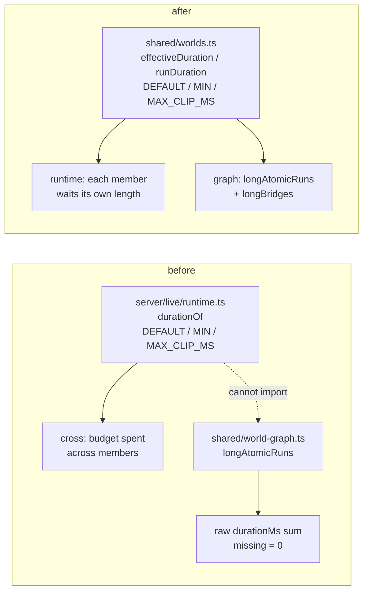
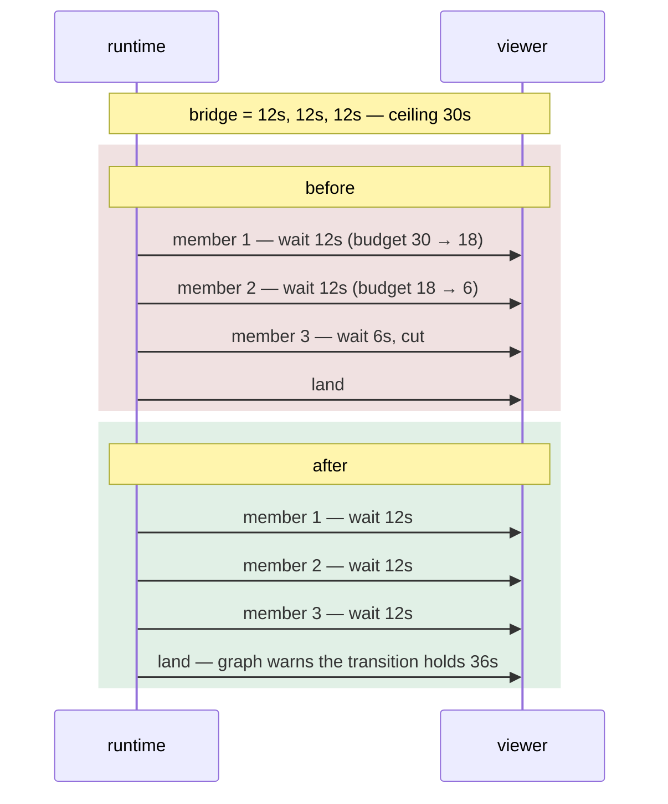

# fix: A bridge plays what was linked

## Summary

Remove the total clamp from a crossing so a bridge plays every clip its author linked, whole.
Demote `MAX_BRIDGE_MS` from an enforcement bound to a reporting threshold, and add a graph
warning naming the transitions whose bridges hold the World longer than a crossing was meant
to. One clip-duration rule moves into `shared/` so the report answers with what the machine
will actually do.

---

## Problem Frame

`cross()` in `server/src/live/runtime.ts` spends a thirty-second budget across the members of a
bridge. Once it is gone the remaining members are waited on for zero milliseconds: a bridge of
three twelve-second clips plays twelve, twelve, and then flashes its third clip and lands. The
author is told nothing — `longAtomicRuns` in `shared/src/world-graph.ts` reports over-long runs
on atomic States and deliberately excludes transitions, on the reasoning that a crossing is
already clamped and so cannot exceed what the report warns about.

That reasoning is sound about the freeze and silent about the video. The clamp buys its bound
by cutting a clip in half, which is the exact failure the subsystem's atomicity invariant
exists to prevent (see origin: `docs/brainstorms/2026-09-06-bridge-ceiling-and-linked-sequences-requirements.md`).

This is the shape recorded in `docs/solutions/a-rule-that-is-right-for-the-whole-is-wrong-for-the-part.md`:
a rule written for one scope applied at another. Bounding a *crossing* is right; spending that
bound *across members* silently reshapes the author's gesture.

---

## Requirements

Carried from the origin document. R-IDs are the origin's.

- **R1** — every member of a drawn bridge plays for its own duration; no budget crosses members.
- **R2** — `MAX_BRIDGE_MS` no longer clamps playback; it becomes the graph's reporting threshold.
- **R3** — a bridge member's duration is read through the same bounds a State's clip passes through.
- **R4** — the graph reports every transition whose drawn bridges could exceed `MAX_BRIDGE_MS`;
  a transition with several sequences is reported when any one of them exceeds it.
- **R5** — the report is a warning: never refuses the World, never blocks a save, never stops the crossing.
- **R6** — the report is a sibling of the atomic-State report and is surfaced the same way.
- **R7** — everything that makes a crossing uninterruptible is untouched.
- **R8** — a World authored before this change plays identically except where it was truncated.

---

## Key Technical Decisions

**One duration rule, in `shared/`.** `DEFAULT_CLIP_MS` and `MIN_CLIP_MS` live in
`server/src/live/runtime.ts`; `MAX_CLIP_MS` lives in `server/src/storage/worlds.ts`. A package
under `shared/` cannot import from `server/`, which is *why* `longAtomicRuns` sums raw
`durationMs` and counts a missing one as zero — not an oversight, a reach it could not make.
The three constants and a function that reads a clip's effective length move into
`shared/src/worlds.ts`, beside `MAX_BRIDGE_MS` which is already there. The runtime and the
graph then answer "how long is this run" through one function.

Rejected: duplicating the fallback in `shared/`. Two answers to one question is the defect this
plan is fixing, one level up.

**The existing long-runs report changes output.** Once an unmeasured clip counts as the
runtime's fallback rather than as zero, `longAtomicRuns` will name States it previously stayed
silent about. This is a deliberate behaviour change to a shipped report, chosen over two
reports disagreeing about run length. It needs its own test, not a silent ride along.

**`MAX_CLIP_MS` becomes the only backstop against a runaway crossing.** Nothing replaces the
total clamp — no per-member cap, no raised ceiling. A member is bounded by the same one-hour
bound every clip already passes through, so a corrupt manifest cannot produce an unbounded
freeze, and a bridge somebody authored is never cut.

**The report is per transition, not per sequence.** A transition holding a short run and a long
one is reported: any of its runs may be drawn, so the author needs to know the transition can
hold the World, not which draw does it.

**Nothing in the crossing's control flow moves.** The generation discipline, the mid-bridge
`setWorld` re-timing, the landing's re-verification, the Trigger consumed on landing and the
`reportClipEnd` refusal all stay exactly as they are. Only the wait length changes.

---

## High-Level Technical Design

Where a duration is read today, and where it is read after:

What the crossing does with a three-member bridge, before and after:

---

## Implementation Units

### U1. One clip-duration rule in `shared/`

**Goal.** Give the runtime and the graph a single function for a clip's effective length, and a
single function for a run's total.

**Requirements.** R3; enables R4.

**Dependencies.** None.

**Files.**
- `shared/src/worlds.ts` — add `DEFAULT_CLIP_MS`, `MIN_CLIP_MS`, `MAX_CLIP_MS`, `effectiveDuration(clip)`, `runDuration(sequence)`.
- `server/src/live/runtime.ts` — `durationOf` delegates; its own constant declarations go, re-exported from the new home so existing importers keep working.
- `server/src/storage/worlds.ts` — `MAX_CLIP_MS` re-exported from `shared/`, its two clamp sites unchanged in behaviour.
- `server/test/live/runtime.test.ts` — imports `MIN_CLIP_MS` and `MAX_BRIDGE_MS` from the runtime today; keep those import paths working.
- `shared/src/worlds.ts` tests, wherever the shared suite lives.

**Approach.** `effectiveDuration` is `durationOf`'s body moved verbatim: a missing, non-finite or
non-positive `durationMs` yields `DEFAULT_CLIP_MS`, and any other value is clamped to
`[MIN_CLIP_MS, MAX_CLIP_MS]`. `runDuration` sums `effectiveDuration` over a sequence's members
and returns 0 for a sequence with no members. Re-export rather than rewrite every import site —
this unit must be behaviour-neutral so U2 and U3 are the only places behaviour moves.

**Patterns to follow.** `MAX_BRIDGE_MS` and `sequenceKey` already live in `shared/src/worlds.ts`
and are imported by both the server and the graph; this is the same move for the same reason.

**Execution note.** Land this unit with the full suite green and no test rewritten. If a test
changes here, the move was not neutral.

**Test scenarios.**
- `effectiveDuration` with `durationMs` absent, `0`, `NaN`, `Infinity` and a negative → `DEFAULT_CLIP_MS` in every case.
- `effectiveDuration` with a value below `MIN_CLIP_MS` → `MIN_CLIP_MS`; above `MAX_CLIP_MS` → `MAX_CLIP_MS`; between → the value.
- `runDuration` over three members sums their effective lengths; over an empty member list → 0; over a sequence with one unmeasured member → `DEFAULT_CLIP_MS`.
- `runDuration` where one member is unmeasured and two are measured → the two lengths plus the fallback.

**Verification.** Typecheck passes across both tsconfigs and the existing suite is green with no
test edited.

---

### U2. A bridge plays every member whole

**Goal.** Remove the crossing's total budget so each member waits its own length.

**Requirements.** R1, R2, R3, R7, R8. Covers AE1, AE4, AE5, AE6.

**Dependencies.** U1.

**Files.**
- `server/src/live/runtime.ts` — the budget loop in `cross()`, and `bridgeMs()`.
- `server/test/live/runtime.test.ts` — two existing tests assert the clamp and must be rewritten.

**Approach.** The `budget` local and the `Math.min(..., budget)` go; each member waits
`effectiveDuration(member)`. `bridgeMs()` currently returns `Math.min(durationOf(clip), MAX_BRIDGE_MS)`
and is what the mid-bridge re-timing measures against — it returns the member's effective
duration instead. The comment above the loop explains the *old* rule and must be replaced, not
left standing: `docs/solutions/a-comment-is-a-claim-and-nothing-runs-it.md`.

Nothing else in `cross()` changes. The generation checks after every await, the `mine` identity
check before clearing `crossing`, the landing re-verification and the Trigger consumption stay
put.

**Patterns to follow.** The member loop in `playThrough()`, which already walks a run member by
member without a shared budget.

**Execution note.** Rewrite the two clamp tests to assert the new behaviour before changing
`cross()`, and watch them fail. Both currently pass *because* of the defect —
`docs/solutions/tests-that-lock-in-the-bug.md`, and the standing rule that a regression test
must fail without the fix.

**Test scenarios.**
- *Covers AE1.* A bridge of three members each at `MAX_BRIDGE_MS * 0.6` — the machine does not land until all three waits have been stepped through. This is the inversion of the existing "bounds the whole crossing rather than each of its clips" test at `server/test/live/runtime.test.ts:1594`, which asserts the crossing lands after one.
- The existing "caps how long a crossing can hold the machine" test at `:1164` uses a one-hour bridge clip and asserts the largest scheduled delay is `MAX_BRIDGE_MS`. Rewrite it to assert `MAX_CLIP_MS` — the backstop that remains — so the runaway case stays covered.
- *Covers AE4.* A bridge member with `durationMs: 0` waits `DEFAULT_CLIP_MS` and the crossing completes rather than faulting or landing instantly.
- *Covers AE5.* A Parameter set part way through a multi-member bridge is recorded, evaluated once at the landing, and does not shorten the crossing.
- *Covers R7.* `reportClipEnd` is refused for the whole length of a bridge now longer than the old ceiling — the refusal is not tied to the budget.
- *Covers R7.* A `setWorld` that re-measures the member currently crossing re-times the wait rather than superseding it, for a member beyond the old thirty-second point. Guards the `bridgeMs` change.
- *Covers AE6.* A single-clip bridge under the ceiling behaves exactly as before — same wait, same landing.
- A bridge whose total is under the ceiling is unaffected in wait count and length.

**Verification.** A multi-member bridge totalling more than thirty seconds plays every member for
its own length and lands; no test asserts a truncated member.

---

### U3. Report the transitions whose bridges hold the World

**Goal.** Add `longBridges` to the graph's derivations, and put `longAtomicRuns` on the shared
duration rule.

**Requirements.** R4, R5, R6. Covers AE2, AE3.

**Dependencies.** U1.

**Files.**
- `shared/src/world-graph.ts` — add `longBridges(world)`, wire it into `worldReports`, rewrite `longAtomicRuns` to use `runDuration`, and correct the comment that excludes transitions.
- `shared/src/worlds.ts` — add `longBridges: string[]` to `WorldReports` with a doc comment in the house style.
- `server/test/live/world-graph.test.ts` — the existing `longAtomicRuns` cases sit at `:520-560`.

**Approach.** `longBridges` mirrors `longAtomicRuns`' shape: filter `world.transitions`, keep any
whose `clips` hold a sequence whose `runDuration` exceeds `MAX_BRIDGE_MS`, map to transition ids.
No `atomic` check — a crossing is always atomic. The comment at `shared/src/world-graph.ts:606-609`
asserts a transition cannot exceed the ceiling; that claim is what this plan repeals, and leaving
it would leave a false statement guarding the code that disproves it.

`longAtomicRuns` switches from its inline reduce to `runDuration`, which is the behaviour change
named in the decisions: an unmeasured member now counts as the fallback rather than zero.

**Patterns to follow.** `unusableRanges` and `danglingEffects` in the same file — pure functions
over the World, assembled in `worldReports`, no I/O.

**Test scenarios.**
- *Covers AE2.* A transition holding one sequence totalling more than `MAX_BRIDGE_MS` is named; a transition under it is not.
- *Covers AE3.* A transition holding two sequences, one short and one over the threshold, is named once.
- A transition with an empty clip set — an instant cut — is never named.
- A transition whose single member exceeds the threshold on its own is named, so the report is not multi-member-only.
- A bridge of three members with no stored durations totals `3 × DEFAULT_CLIP_MS` and is *not* named, because that is under the threshold — the report answers with what the machine will do, not with zero.
- A State with an atomic run of unmeasured members is now named by `longAtomicRuns` where it previously was not. Assert this directly; it is the behaviour change, not a side effect.
- `longAtomicRuns` still ignores a non-atomic State, whatever its run length. Existing case at `:532`, must keep passing.
- `worldReports` returns `longBridges` for a World with no transitions as `[]`, never undefined.

**Verification.** A World with a thirty-six-second bridge reports that transition and still opens,
saves and runs.

---

### U4. Surface the report on the graph

**Goal.** Show the warning where the author is already looking.

**Requirements.** R5, R6.

**Dependencies.** U3.

**Files.**
- `ui/src/components/StateGraph.tsx` — a `raise("long-bridges", …)` section beside `raise("long-runs", …)` at `:146`.
- `ui/test/graph.test.ts` — no coverage exists for the long-runs section today; add for the new one.

**Approach.** Copy the `long-runs` section's shape exactly: a `data-testid`, an `h3`, one `
` per id, named through `transitionNamed` as the audio-conditions section already does for transitions. Wording states the cost and that nothing is refused, matching the sibling: the crossing holds the World for its whole length and cannot be interrupted, and the author chose it.

**Patterns to follow.** `raise("long-runs", …)` for the section, `raise("audio-unguarded", …)` for
naming a transition rather than a State.

**Test scenarios.**
- A World with a bridge over the threshold renders the section, naming the transition.
- A World with no over-long bridge does not render the section at all — `raise` is count-gated, so an empty list must produce no heading.
- Both reports firing at once render two distinct sections, so an author with a long State run and a long bridge sees both.
- The transition is named by its authored name rather than its id.

**Verification.** The section appears only when the report is non-empty, and reads as a warning.

---

### U5. Correct the record

**Goal.** Leave no document asserting the rule this change repeals.

**Requirements.** R2, R8.

**Dependencies.** U2, U3.

**Files.**
- `CONCEPTS.md` — the **Bridge** entry states the ceiling "bounds the whole crossing rather than each clip in it"; the **Plays whole** entry references it too.
- `AGENTS.md` — the `server/src/live/` section describes the bridge invariant.
- `docs/brainstorms/2026-09-02-clip-sequences-requirements.md` — leave as written; it is a dated record, not a live claim.

**Approach.** The Bridge entry keeps everything about uninterruptibility and gains the corrected
account of the ceiling: a bridge plays what was authored, and the ceiling names the point past
which the graph says so. Do not describe the old behaviour as a bug in the glossary — it states
what is true now.

**Test scenarios.** `Test expectation: none — documentation only.`

**Verification.** No sentence in `CONCEPTS.md` or `AGENTS.md` claims a crossing is clamped.

---

## Scope Boundaries

**In scope.** The crossing's wait loop, the ceiling's role, the new report and its surface, and
the one shared duration rule the report needs.

**Out of scope.**
- The State side of the reported symptom. Per-clip exit times on an interruptible run stay as designed; **plays whole** remains the switch.
- Any change to the **plays whole** switch, including narrowing what it suppresses.
- Making a crossing interruptible in any way.
- How a bridge is authored — linking, unlinking, the panel.

**Deferred to follow-up work.**
- Whether an interruptible State run should offer an exit time against the whole gesture rather than whichever clip is playing (origin: Deferred for later).
- Whether the **plays whole** label and helper text should mention linked clips (origin: Deferred for later).
- Whether the report belongs on the transition's line in the graph as well as in the warning list. The never-fires marks put a static mark on the line; this follows the atomic-run report instead.

---

## Risks & Dependencies

- **U1 is the risky unit, not U2.** Moving three constants across a package boundary touches
  `durationOf`, both storage clamp sites and the test suite's imports. A behaviour change smuggled
  in here would surface as a timing change somewhere unrelated. Hence the execution note: no test
  may change in U1.
- **`longAtomicRuns` gets louder.** A World whose clips have never been played may start reporting
  long runs on open. It is a warning and refuses nothing, but it is a visible change the author did
  not ask for.
- **`MAX_CLIP_MS` is now load-bearing.** It was a storage clamp; after U2 it is the only bound on
  how long a crossing can hold the machine. One hour is a long freeze. It is bounded, which the
  origin accepted, but it is worth knowing which constant now carries that weight.
- **`server/test/live/audio-readouts.test.ts:358`** carries a comment about a crossing holding for
  up to `MAX_BRIDGE_MS`. Check whether the test's premise still holds after U2.

---

## Open Questions

- Whether `runDuration` should be reused inside the runtime's own `playThrough`, which computes
  member durations one at a time. Not needed for this change; a later tidy at most.
- Whether the audio Transport notices a crossing longer than any previously possible. Not
  investigated, flagged in the origin.

---

## Sources & Research

- `docs/solutions/a-rule-that-is-right-for-the-whole-is-wrong-for-the-part.md` — the defect's shape.
- `docs/solutions/tests-that-lock-in-the-bug.md` — why the two clamp tests are rewritten, not deleted.
- `docs/solutions/a-comment-is-a-claim-and-nothing-runs-it.md` — why the excluding comment must go.
- `server/src/live/runtime.ts` — `cross()`, `bridgeMs()`, `durationOf()`, `playThrough()`.
- `shared/src/world-graph.ts` — `worldReports`, `longAtomicRuns`.
- `ui/src/components/StateGraph.tsx` — the `raise` report sections.
