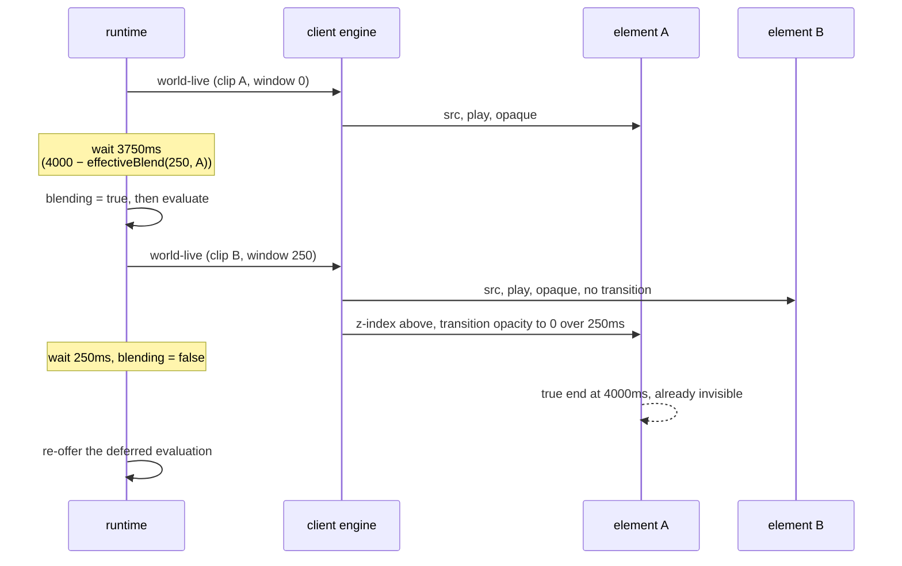
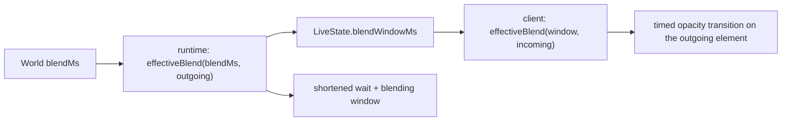

# feat: Clips dissolve into each other

## Summary

Give a World one blend length and make every clip boundary in it a dissolve. The machine
shortens each clip's final wait by that length, so the next clip is issued while the current one
is still playing and both are moving through the fade. The window doubles as the load budget the
boundary never had. A World that sets nothing keeps the hard cuts it has today, on the current
control flow rather than a degenerate case of the new one.

---

## Problem Frame

`playThrough` in `server/src/live/runtime.ts` awaits a clip's full duration, evaluates, then
issues the next one. The browser's second `<video>` element only starts loading at that instant,
so every boundary carries an unscheduled load-and-decode gap. `useClipStage.ts` swaps `front` on
`canplay`, and the two surfaces flip `.back`/`.front` between opacity 0 and 1 — an instant cut
between two files that were never graded against each other.

Two costs come out of that one moment. The frames either side of the boundary disagree, which
reads as static on the picture. And the gap has nothing covering it, which is what the operator
sees as a black flash. A dissolve alone would fade to black and back; a preload alone would leave
the mismatch. Shortening the machine's wait fixes both, because the time it frees is exactly the
time the load needed and exactly the time the dissolve needs.

The most repeated instance is a State looping one clip, cutting from that file's last frame to
its own first frame every few seconds for as long as the World is open.

---

## Requirements

Carried from `docs/brainstorms/2026-09-06-clip-blending-requirements.md`. R1–R5 the blend, R6–R10
and R15–R17 the machine, R11–R14 what must keep working. Acceptance examples AE1–AE9 are cited
per unit where a test enforces one.

---

## Key Technical Decisions

**The machine clamps against the outgoing clip; the client clamps against both.** R8 defines the
effective blend as the World's length or half the shorter of the two clips — but the incoming
clip is not known until evaluation, which is the thing being scheduled. Resolving the
circularity: the runtime shortens its wait by `effectiveBlend(blendMs, outgoing)`, which depends
only on what is already playing, and carries that window on the wire. The client dissolves over
`effectiveBlend(window, incoming)`, which is never larger. This answers the origin's deferred
question about where the effective blend is computed: both, at different clamps, and the
client's always wins.

The two differ only when the incoming clip is the shorter one, and then the remainder — the time
the incoming clip is on screen alone before its own boundary — is `outgoing_window −
incoming_window`, which is **zero** exactly when the incoming clip is at or below twice the blend
length. Such a clip fades up and immediately begins fading out, never displayed alone. That is not
an artifact of the asymmetry; it is what a blend longer than half a clip means, and U5's report is
the mitigation. The origin carries an open question about whether such a clip should blend at all.

**The blend gets its own field, not `holding`.** `holding` and `crossing` are separate fields in
`server/src/live/runtime.ts` — `holding` is the atomic-run hold, `crossing` is the bridge, and
every guard reads `this.crossing || this.holding`. Reusing `holding` fails twice. `playThrough`
assigns `this.holding = atomic` unconditionally at the head of every clip, which erases a window
raised at the previous boundary. And because R4 blends between the members of a sequence, a blend
window closing inside an atomic run would clear that run's own hold and make a plays-whole run
interruptible from its second member on. A boolean cannot have two overlapping owners. `blending`
is a third field; the four guard sites become `this.crossing || this.holding || this.blending`.

**Zero is skipped, not computed.** `wait()` installs a `pending` unconditionally, so a zero-length
window would arm a real pending at the head of every clip, resolve under `step()` ahead of the
clip wait, and shift the existing suite's timing. When the effective window is 0 the shortening
and the hold are both skipped outright — no field set, no wait armed, no pending installed — so
the no-blend path is the current control flow rather than a degenerate case of the new one.

**One element is made opaque, the other is transitioned, and the fading one is raised above.**
Three facts decide this, none of them in the engine. The visible opacity is set by
`className={index === front ? "front" : "back"}` in `ClipPlayer.tsx` and `BroadcastStage.tsx`, so
exactly one element can be visible and a blend cannot render at all without changing those files.
A `transition` on the shared `.clip-video` rule animates the class flip in both directions, rising
and falling together — the simultaneous fade R3 forbids. And neither surface sets `z-index`, so
DOM order alone decides stacking: element 1 always paints over element 0, while the outgoing
element alternates. The mechanism is therefore explicit rather than emergent — the incoming
element is made opaque with its transition suppressed, the outgoing element carries the timed
transition and a raised `z-index` for the window's duration, and the demote happens at the end of
the fade rather than at the swap.

A spike measured this mechanism over five boundaries per surface: the composite alpha never fell
below 1, the incoming element was never observed mid-rise, and the fading element carried the
higher `z-index` on every frame. `fadedIndices` came back `[0, 1]` — the dissolve happens on both
kinds of boundary, which is the whole reason the stacking is explicit.

**A browser script is the only evidence the blend works.** jsdom lays nothing out and plays no
media, so no unit test can prove two elements were on screen together at the right opacities.
`scripts/live-layout-check.mjs` and `scripts/overlays-check.mjs` already exist for this reason.
Neither can time a 250ms window from Node, so U7 records in-page and reads out once.

---

## High-Level Technical Design

One boundary, with `blendMs` 250 and a 4000ms outgoing clip:

`blending` is raised before the emit, not after, because `playThrough` awaits a clip-usability
check bounded by `CLIP_CHECK_MS` (2000ms) before it would otherwise be set — and for that whole
span the blend is on screen with nothing suppressing evaluation.

Where the two clamps diverge:

---

## Implementation Units

### U1. `blendMs` on the World

**Goal.** Add the field, its bound, and the one function that answers what a boundary blends for.
Nothing reads it yet.

**Requirements.** R1, R2, R8.

**Dependencies.** None.

**Files.**
- `shared/src/worlds.ts` — `blendMs?: number` on `World`; `MAX_BLEND_MS = 1000` (origin R2's authored range); `effectiveBlend(blendMs, clip)` returning `min(blendMs, effectiveDuration(clip) / 2)`.
- `server/src/storage/worlds.ts` — clamp `blendMs` on load and on write, as `MAX_CLIP_MS` is clamped.
- `shared/` test file for `worlds.ts`, wherever the shared suite lives.

**Approach.** Optional and absent-means-zero, following `atomic` on `WorldState`. No manifest
version moves — `versionRefusal` refuses only a version that is not this build's, and `rebuild`
spreads the parsed value, so an added optional field parses and round-trips unchanged. Note that
`effectiveDuration` floors at `MIN_CLIP_MS` (250), so `effectiveBlend` never returns below 125ms
for any clip the machine will actually wait on.

**Patterns to follow.** `effectiveDuration` and `runDuration` in `shared/src/worlds.ts` — same
file, same shape, same reason for living in `shared/`. `MAX_BRIDGE_MS` for a named threshold.

**Execution note.** Land with the full suite green and no existing test edited.

**Test scenarios.**
- Covers AE1. A World with no `blendMs` loads, writes back, and the manifest is byte-identical.
- `effectiveBlend(250, clip)` where the clip is 4000ms → 250; where it is 300ms → 150; where it is unmeasured → 125, the `MIN_CLIP_MS` floor halved, not zero.
- `effectiveBlend(0, clip)` → 0 for any clip.
- `blendMs` above `MAX_BLEND_MS` is clamped on load; a negative, `NaN` or non-finite value reads as 0.
- A World whose manifest carries `blendMs` survives a load-mutate-write round trip with the value intact.

**Verification.** Both tsconfigs typecheck and the existing suite is green with nothing edited.

---

### U2. The machine shortens its wait and holds through the blend

**Goal.** Free the window before each clip ends and evaluate nothing until it closes — at every
boundary R4 names, not only the ones that reach a final wait.

**Requirements.** R4, R6, R7, R10, R15, R16.

**Dependencies.** U1.

**Files.**
- `server/src/live/runtime.ts` — the final wait in `playThrough`; `rearmCrossing`; the emits in `take` and `cross`; the new `blending` field and the four guard sites.
- `shared/src/worlds.ts` — `blendWindowMs` on `LiveState`, named distinctly from the World's `blendMs` because the two differ at every clamped boundary.
- `server/test/live/runtime.test.ts`.

**Approach.** Four changes, and none of them is the one-line shortening a first reading suggests.

*The window.* `effectiveBlend(world.blendMs, currentClip)`. When it is 0, every change below is
skipped entirely — no shortening, no `blending`, no wait, no pending.

*Where it is subtracted.* Four wait sites, not one: `playThrough`'s final wait per member;
`rearmCrossing`, which recomputes a bridge member's live wait at its full length and is the
ordinary path for a freshly imported clip whose duration the browser has just corrected; and the
two emits that replace a clip still playing — the clip-less transition in `take` and the first
bridge member in `cross`, which arrive via `supersede()` and never reach a final wait. The rule
covering all of them: **any emit that replaces a clip still playing carries
`effectiveBlend(world.blendMs, the clip being replaced)`**, whether or not a wait was shortened
for it. That is what makes R4's six boundaries one rule rather than six cases.

*The hold.* `blending` is raised in `enter()` **before** the emit that issues the new clip, not
after — `playThrough` awaits `runUsable` under a 2000ms deadline before it would otherwise be
set, and the blend is on screen for that whole span. Its own wait, armed `final: false`, lowers
it. `supersede` clears it alongside `holding`.

*The landing.* `cross()` calls `onTrigger("arrival", 0)` immediately after `enter`, and
`onTrigger` returns false while anything is holding — so with the landing window up, that
once-only check is swallowed rather than deferred. The wait that lowers `blending` must re-run it,
or a Trigger set mid-bridge is left standing until the next boundary.

**Patterns to follow.** `crossing` and `holding` are each raised and lowered around a bounded
span with a guard reading both; `blending` is a third of the same shape rather than a new
mechanism.

**Execution note.** Test-first, and prove each test fails with the change reverted.
`docs/solutions/a-timer-spy-is-blind-in-a-suite-that-leaks-runtimes.md` was written today about
this exact file: a global timer spy saw delays from runtimes the suite never stopped, and an
assertion phrased as a lower bound passed while the defect stood. Assert armed delays as exact
values from a runtime this test constructs and stops.

That surface has since been measured rather than predicted. A spike that shortened the armed
delay of every clip in every test left **111 of 112 runtime tests green** — only the one asserting
an exact `Math.max(...delays)` noticed. The suite will not catch a regression in this unit, so the
revert check is not belt-and-braces; it is the only thing that works.

**Test scenarios.**
- Covers AE2. World `blendMs` 250, clip 4000ms → the armed final delay is exactly 3750ms.
- Covers AE2, AE8. A Trigger fired inside the window does not transition until the window closes, and is then evaluated against the clip issued at the boundary.
- Covers AE1. World `blendMs` absent → the armed final delay is the clip's full duration, no `blending` is set and no extra pending is installed. Every existing timing test passes unedited.
- A transition holding no clips, fired mid-clip, emits with a window computed from the clip it replaced — not zero.
- Entering a bridge shortens the wait on the clip being replaced exactly as a sequence member does.
- A re-measured bridge member re-arms to `length − window − played`, not `length − played`.
- A Parameter set while `runUsable` is in flight at a blend boundary is recorded and not acted on.
- An Any State transition whose condition becomes true inside the window does not fire until the window closes.
- A Trigger set during a bridge is consumed at the close of the landing window, not left standing.
- A three-member atomic run in a 250ms World is still uninterruptible at its second and third member boundaries.
- A clip-duration report carries the raw length the browser measured, not the shortened wait; the stored duration after a report is the file's length and the blend is applied on top of it (R10).
- Two boundaries in a row on the same clip do not compound the shortening — the second wait is computed from the stored duration, not the first shortened one (R10).
- `supersede` during a blend window clears `blending`; a faulted run does not leave the machine holding.

**Verification.** Armed delays are exact and read from a runtime the test constructed and stops.
Reverting any one of the four changes makes at least one test in this unit fail. This unit is safe
standing alone: it shortens waits and holds, and changes no evaluation rule.

---

### U9. The evaluation paths the window changes

**Goal.** Keep the boundary the last evaluation in a clip without losing a transition, restarting
a clip, or letting a client report cut the window short.

**Requirements.** R15, R17.

**Dependencies.** U2.

**Files.**
- `server/src/live/runtime.ts` — `wakePoints` and `sameSchedule`; `eligible`; `reportClipEnd`.
- `server/test/live/runtime.test.ts`.

**Approach.** Three changes that must land together. R17 drops wake points above `total − window`
from the schedule, and the filter alone breaks two things.

`sameSchedule` recomputes `wakePoints` unfiltered and compares against the stored schedule, so
without the same filter applied on both sides every unrelated edit fails the comparison and
supersedes the pass in flight — restarting the clip on every keystroke of a rename. Factor the
trailing filter into a helper taking the wake points and the clip's total, and apply it on both
sides.

`eligible` reads `const due = trigger === "clip-end" ? at >= 1 : at === fraction`. A dropped 0.99
wake point therefore means that transition is never offered again and the World deadlocks in the
State — a behaviour that works today would stop working. Its clip-end rule must widen to offer any
waiting transition whose exit fraction falls at or above the boundary fraction. **This is why the
three changes are one unit:** the filter without the widening is a regression, not a feature.

`reportClipEnd` refuses a report during a `crossing` and during an atomic run. The blend window is
the first hold with a live, reportable `pending` behind it, so it needs the same refusal.

**Patterns to follow.** `reportClipEnd`'s existing `crossing` and `atomic` refusals — the new one
sits beside them and reads the same way.

**Execution note.** Test-first, with the same revert discipline as U2. The `eligible` widening in
particular must be proven by a test that fails when only the wake-point filter is applied.

**Test scenarios.**
- Covers AE9. A transition with exit time 0.99 on a 4000ms clip in a 250ms World does not fire at 3960ms **and is taken at the 3750ms boundary** — it is never skipped.
- Applying the wake-point filter without the `eligible` widening leaves that transition unfired — asserted directly, so the coupling is proven rather than assumed.
- An unrelated `setWorld` edit during a blending World's clip does not supersede the pass in flight.
- A clip-end report arriving inside the window is discarded and the window still runs its full length.
- Covers AE1. A World with no blend filters no wake points, and `sameSchedule` compares exactly as it does today.

**Verification.** A World whose transitions all fired before this unit still has all of them fire
after it, at 250ms and at 0.

---

### U3. Name which elements are live, and which paints above

**Goal.** Stop a single index standing for "the element on screen" before there are two of them,
and give the engine the stacking control it does not currently have. Behaviour-neutral.

**Requirements.** R12.

**Dependencies.** None.

**Files.**
- `ui/src/components/useClipStage.ts` — expose the incoming and outgoing element indices alongside `front`.
- `ui/src/components/OverlayLayer.tsx` — measure against the named element rather than `front`.
- `ui/src/components/BroadcastStage.tsx` — its fade reset and its `index === front` checks name the element they mean.
- `ui/test/components/BroadcastStage.test.tsx`, `ui/test/components/useClipStage.test.tsx`, the overlay layer's tests.

**Approach.** With nothing blending the two names resolve to the same element, so every current
behaviour is unchanged and no test should need editing. Commit `7e84598` fixed the same shape for
the graph — the index that identifies a thing and the thing actually on screen are two questions.

**Patterns to follow.** The existing `front` plumbing through `OverlayLayer`'s props.

**Execution note.** Land with the full suite green and nothing edited.

**Test scenarios.**
- With nothing blending, the named incoming and outgoing elements are the same element, and the overlay measures the same box it measured before.
- The broadcast fade still arms on the visible element ending with a fault standing, and still resets when a new clip becomes visible.
- Covers AE1. A World with no blend behaves identically across the engine's existing suite, unedited.

**Verification.** Existing suite green, no test edited, typecheck clean.

---

### U4. The engine dissolves

**Goal.** Play both clips through the window and fade one across the other, on both surfaces,
identically.

**Requirements.** R3, R4, R5, R8, R11, R13, R14.

**Dependencies.** U2, U3.

**Files.**
- `ui/src/components/useClipStage.ts` — clamp the wire window against the incoming clip; drive the fade and its cancellation.
- `ui/src/components/ClipPlayer.tsx` and `ui/src/components/BroadcastStage.tsx` — the `index === front` className expressions, which are where visible opacity is actually decided.
- `ui/src/styles.css` — a `.blending-out` rule carrying the timed transition and a raised `z-index`; the `.back`/`.front` rules keep their current meaning.
- `ui/test/components/useClipStage.test.tsx`, `ui/test/components/ClipPlayer.test.tsx`, `ui/test/components/BroadcastStage.test.tsx`.

**Approach.** The transition never goes on the shared `.clip-video` rule — that animates the
class flip in both directions and produces the dark pulse R3 forbids. The incoming element is
made opaque with no transition; the outgoing element gets `.blending-out`, which carries the
timed opacity transition and a `z-index` above the incoming one. The `z-index` is not optional
polish: DOM order otherwise paints element 1 over element 0 on every boundary, so the fade would
be invisible on half of them.

Three timing cases the window creates:

- *Late `canplay`.* The swap still waits for it, and load latency is the whole reason the window exists. The fade duration is the window's **remaining** time at the moment `canplay` arrives, so the fade always completes before the outgoing clip's true end. A fixed-length fade started late outruns that end and freezes the outgoing element at partial opacity over the playing one.
- *Window expires first.* Degrades to the current hold-and-swap (R14) — no fault.
- *Reassignment mid-fade.* A duration report fires inside the window for any clip whose stored duration is off by more than the tolerance, which reaches `setWorld` and can supersede. An assignment landing mid-fade cancels the fade, restores the target element to full opacity, and cancels the pending demote.

Both elements stay `muted`, which is what permits autoplay (R13). A State looping one clip drives
the same file on both elements at different positions; the `held` same-source guard already loads
it once per element (R5).

**Patterns to follow.** The existing `show()` closure on `canplay` — the demote it performs moves
to the end of the fade.

**Test scenarios.**
- Mid-window, the incoming element is at full opacity and the outgoing one is in transit — never both below full.
- The dissolve behaves identically on a boundary where the outgoing element is index 0 and one where it is index 1.
- The incoming element reaches full opacity without transitioning — asserted on the applied class, not on a sampled value mid-rise.
- Covers AE6. A State holding one clip assigns the same source to both elements and both are playing during the window.
- Covers AE7. An incoming element that never reaches `canplay` within the window leaves the outgoing element holding its last frame; the swap happens when it is ready, with no fault raised.
- `canplay` at 200ms into a 250ms window produces a 50ms fade, and the outgoing element is fully transparent before it fires `ended`.
- Covers AE3. A wire window of 250 with a 300ms incoming clip produces a 150ms transition.
- A new clip assigned mid-window leaves the assigned element opaque and the other transparent, with no fade still running.
- Covers AE1. A wire window of 0 assigns, swaps and demotes exactly as the current engine does, with no class added and no transition applied.
- Both surfaces apply the same classes for the same window (R11).
- Both elements carry `muted` throughout; the incoming element's `play()` is not gated on the fade.
- A demoted element's late `ended` is still discarded on the generation check.

**Verification.** Suite green. Reverting the stacking change makes the alternating-boundary test
fail; reverting the transition-suppression makes the opacity-class test fail.

---

### U5. Report the clips too short to carry the blend

**Goal.** Make a clamped blend visible at authoring time.

**Requirements.** R9.

**Dependencies.** U1.

**Files.**
- `shared/src/world-graph.ts` — a `shortForBlend` derivation and its entry in `worldReports`.
- `shared/src/types.ts` — the field on `WorldReports`.
- `ui/src/components/StateGraph.tsx` — render it beside the existing warnings.
- The shared graph suite and the graph component's tests.

**Approach.** Every clip in every State set and every transition bridge whose `effectiveDuration`
is below twice the World's `blendMs`. Reported per clip rather than per State, because the fix is
to the footage or the number. Silent when `blendMs` is 0. This is the report that makes the
never-seen-alone case from the Key Technical Decisions visible to the author.

**Patterns to follow.** `longBridges` and `longAtomicRuns` in the same file: a pure function over
the World, an entry in `worldReports`, a line on the graph, and `effectiveDuration` so an
unmeasured clip counts as the fallback rather than as free.

**Test scenarios.**
- Covers AE4. A World at 250ms holding a 300ms clip reports that clip; a World at 250ms holding only 4000ms clips reports nothing.
- Covers AE1. A World with `blendMs` absent or 0 reports nothing, whatever its clip lengths.
- A clip exactly twice the blend length is not reported; one a millisecond under is.
- An unmeasured clip is measured as the fallback duration, not as zero.
- Clips in a transition's bridge are reported as well as clips in a State's set.

**Verification.** The report names exactly the clips `effectiveBlend` will clamp for the same
inputs.

---

### U6. Set the blend on a World

**Goal.** Give the author the control, and give an agent the same reach.

**Requirements.** R1, R2.

**Dependencies.** U1.

**Files.**
- `shared/src/types.ts` — `SetWorldBlendMessage`.
- `server/src/live/service.ts` — the handler, routed through `WorldService.apply`.
- `ui/src/components/StateGraph.tsx` — the control, beside the World's own Effects.
- The service's test file and the graph component's tests.

**Approach.** One scalar edit message on the World, the shape `set-world-title` already uses:
bounded by the store rather than by the field, so an agent and the control are held to one rule
(R2). A change takes effect at the next boundary — the pass in flight keeps the window it was
armed under, as `atomic` does for a run.

**Patterns to follow.** `SetWorldTitleMessage` and its handler; the World Effects editor's
placement in `StateGraph.tsx`. U5 and U8 also edit this file — sequence the three or expect a
conflict.

**Test scenarios.**
- A value inside the range is stored and broadcast; the World's manifest carries it.
- A value above `MAX_BLEND_MS` is clamped by the store, and a negative or non-finite value is stored as 0 — the same answer whether the sender is the control or an agent.
- Setting the blend mid-clip does not disturb the pass in flight; the next boundary uses the new value.
- Setting the blend on a World that is not open is refused, as other World edits are.
- The control renders the World's current value and round-trips a change through the store.

**Verification.** The protocol reaches the same outcome as the control, with no UI-only path.

---

### U7. Browser-measured blend check

**Goal.** Produce the only evidence that exists for what this feature looks like.

**Requirements.** Verifies R3, R5. Covers AE5.

**Dependencies.** U4.

**Files.**
- `scripts/blend-check.mjs`.
- `AGENTS.md` — the command and what it prints.

**Approach.** Boot a throwaway HAL with a seeded World of two known clips and a set blend, open
`/live` and `/broadcast`, and **record in the page**: a `requestAnimationFrame` loop pushing
`{ t, opacity, currentTime, zIndex }` for both elements into a window-scoped array, plus
`transitionstart`/`transitionend` timestamps. Node reads the array out once afterwards and is
used only to detect that a boundary happened, never to time it — a CDP round trip costs tens of
milliseconds with unbounded jitter against a 250ms window, and Node-side polling can miss the
window entirely between two samples. That is why the two existing scripts'
`page.evaluate`-between-sleeps pattern is the harness to borrow but not the sampling method.

Print, per surface: whether both elements were playing simultaneously, the minimum combined
opacity observed, whether the incoming element was ever seen mid-rise, which element carried the
higher `z-index`, and the measured transition duration against the configured one.

A seeded manifest's clip path is resolved against the **World root**, not against `clips/`, so it
reads `clips/red.mp4` and never `red.mp4`. A bare filename leaves the machine with no clip, both
elements on `back`, and nothing playing — which is indistinguishable from a blend that does not
work. The spike lost a run to exactly this.

**Patterns to follow.** `scripts/live-layout-check.mjs` for the throwaway-instance harness and the
seed; `scripts/overlays-check.mjs` for reporting the same measurement on both routes. Needs
`ffmpeg` on PATH — unlike the layout check, this one needs decodable media. `scripts/blend-check.mjs`
on the `spike/clip-blend` branch is a working draft of this unit and its measured baseline: five
windows per surface, 215–251ms against 250 configured, minimum composite alpha 1.

**Test scenarios.** `Test expectation: none — this unit is the test.`

**Verification.** Against a 250ms World: both elements playing together, minimum combined opacity
not below a single element's, the incoming element never observed mid-rise, the outgoing element
stacked above, measured duration within a frame of configured. Against a 0ms World: no overlap
reported. Run on a boundary where the outgoing element is index 0 and one where it is index 1.

---

### U8. Correct the record

**Goal.** Stop five documents and one product string asserting something that is no longer true.

**Requirements.** Origin's Dependencies and Assumptions.

**Dependencies.** U2, U4, U7.

**Files.**
- `CONCEPTS.md` — the Transition entry ends "There is never a blend"; add a `Blend` entry to the live-state-machine section.
- `AGENTS.md` — the `server/src/live/` paragraph on hard cuts and the crossing invariant; the new script under Commands.
- `ui/src/components/StateGraph.tsx` and its test — "No clips, so this transition is an instant cut." is rendered to the author and R4 makes it false; it is a cut only when the World sets no blend.
- `docs/brainstorms/2026-09-01-live-scene-worlds-requirements.md`, `docs/brainstorms/2026-09-02-live-state-machine-requirements.md` and `docs/brainstorms/2026-09-02-clip-sequences-requirements.md` — all three assert hard cuts or "There is never a blend".

**Approach.** The three briefs are historical records; annotate rather than rewrite, naming this
plan as what reversed the position. `CONCEPTS.md`, `AGENTS.md` and the StateGraph string describe
what is, and are corrected outright. The StateGraph copy is the one that is not documentation at
all — it is a wrong statement shown to the author in the product. The vocabulary entry lands here
and not earlier: a glossary describing an unshipped mechanism is the same fault in the other
direction.

**Patterns to follow.** U5 of `docs/plans/2026-09-06-001-fix-bridge-plays-whole-plan.md` did this
for the bridge ceiling, including the brief annotation.

**Test scenarios.** The StateGraph copy change carries a component test asserting the empty-set
transition's text reflects the World's blend. The rest is documentation.

**Verification.** No document describing current behaviour, and no string in the product, asserts
that a transition is instant or that there is never a blend. The three historical briefs keep
their text under an annotation naming this plan.

---

## Scope Boundaries

### Deferred for later

Carried from origin: per-transition and per-State blend lengths; blend curves; blends other than a
dissolve; a fade in on World open and out on close.

### Outside this product's identity

Carried from origin: no audio crossfade — clips are muted by construction and the soundtrack is a
separate transport; no re-encoding, inspection or generation of clips; not a compositor.

### Deferred to follow-up work

- Generalising what the engine exposes so a single visible-element index cannot be misread again.
  U3 fixes the current readers; the class stays reachable.
- Whether `MAX_BLEND_MS` and `MAX_BRIDGE_MS` should share a home or a rationale.
- Whether a clip at or below twice the blend length should blend at all, rather than being blended
  and reported. Open in the origin.

---

## Risks & Dependencies

**The black flash may not be load latency.** The origin records this as unreproduced. U7 is what
would show a flash surviving a non-zero blend. If it does, the cause is elsewhere and is a
separate investigation.

**Two clips decoding at once, on a machine also running vision and inference.** Measured on a
spike: both elements played through all ten observed windows across the two surfaces, the only
paused frames being at the very end of a window and always the fading element reaching its true
end. Headless chromium sustains it. A loaded machine running vision and inference alongside is
still unmeasured, and U7 is what would show that as one element stalling.

**The runtime tests are a measured false-pass surface.** Not a predicted one: a spike shortening
every clip's wait left 111 of 112 runtime tests green. U2's execution note is the mitigation and the revert check is
the proof — `docs/solutions/tests-that-lock-in-the-bug.md` records a test written from the
implementation certifying the defect it was meant to catch.

**Three hold fields, four guard sites.** `crossing`, `holding` and now `blending`. A missed guard
site lets a transition fire mid-blend and demand a third element; a missed `supersede` path holds
the machine forever. U2 covers both fault paths directly.

**The clip-end report stops being a late resync.** The final wait now always fires before the
browser's `ended`, so a report matches a superseded generation at every boundary and is discarded.
Nothing depends on it today, but this plan should not be read as preserving that path — and it
adds one refused message per boundary per open tab.

**Timer-driven UI tests.** `docs/solutions/timers-outrun-effects-inside-one-act.md` records timers
outrunning the effect a rerender scheduled inside one `act()` in the broadcast tests. U4's fade
assertions are on applied classes rather than sampled opacity values wherever possible, for
exactly that reason.

---

## Open Questions

**Deferred to implementation.**

- How the blend's per-element opacity composes with the broadcast surface's 900ms fade to black,
  which is an opacity transition on an ancestor. Nested opacity multiplies, so the fault fade may
  need to cancel an in-flight blend rather than run over it.
- Which element's intrinsic dimensions size the picture during a window when the two blending
  clips have different aspect ratios, given `object-fit: contain` on both.
- Whether `canplay` re-fires after the `held` guard's `currentTime = 0` branch on an
  already-buffered element, which is what the same-source loop depends on. Browser-dependent; U7
  is what would catch it not firing.

---

## Sources & Research

- `ui/src/components/useClipStage.ts` — the two-element engine, the per-element `loaded` record,
  and the `held` same-source guard.
- `ui/src/components/ClipPlayer.tsx`, `ui/src/components/BroadcastStage.tsx` — where visible
  opacity is actually decided, via `index === front`.
- `server/src/live/runtime.ts` — `playThrough`'s final wait, `rearmCrossing`, `take`, `cross`,
  `wakePoints`, `sameSchedule`, `eligible`, `reportClipEnd`, and the `crossing`/`holding` pair.
- `shared/src/worlds.ts` — `effectiveDuration`, `runDuration`, `MIN_CLIP_MS`, `MAX_BRIDGE_MS`,
  `LiveState`, and `WorldState.atomic` as the optional-field precedent.
- `shared/src/world-graph.ts` — `longBridges`, `longAtomicRuns`, `worldReports`.
- `shared/src/types.ts` — `SetWorldTitleMessage` as the World-scalar-edit precedent.
- `scripts/live-layout-check.mjs`, `scripts/overlays-check.mjs` — the browser-verification harness,
  and the sampling approach U7 must not reuse.
- `docs/solutions/a-timer-spy-is-blind-in-a-suite-that-leaks-runtimes.md`,
  `docs/solutions/timers-outrun-effects-inside-one-act.md`,
  `docs/solutions/hiding-a-media-element-keeps-what-unmounting-throws-away.md`,
  `docs/solutions/tests-that-lock-in-the-bug.md`.
- `docs/plans/2026-09-06-001-fix-bridge-plays-whole-plan.md` — the shape U8 follows.
- Branch `spike/clip-blend` — a throwaway proof of the mechanism and the browser check that
  measured it. Not for main: hardcoded window, no World field, no zero path, no hold.
