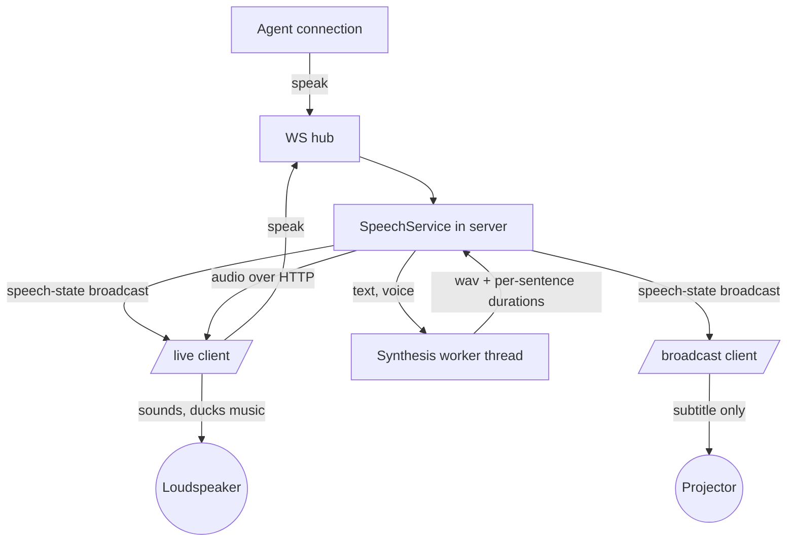
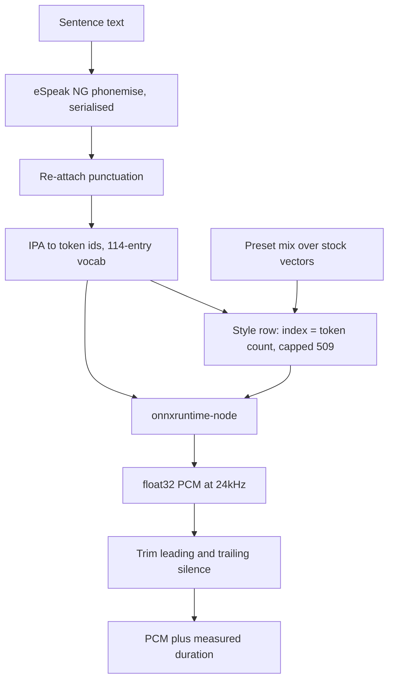

# feat: The character speaks

## Summary

Give `/live` a speech control — a line of text, a voice you authored, and a Speak button — and give
HAL a synthesiser to say it with. A voice is a named blend of stock Kokoro style vectors, authored
in the app by ear. Synthesis runs on a worker thread inside the server, not in a sidecar and not in
Python, because the model's whole boundary is three tensors and this repo already ships the runtime
that takes them.

---

## Problem Frame

HAL has never made a sound of his own. The character on the broadcast surface is whatever clip is
playing, and when it should be speaking there is nothing to speak with.

The origin brief planned around a Python sidecar, on the strength of two beliefs that research
contradicted. `recogniser/` is not a Python service — it is a TypeScript workspace on
`onnxruntime-node`, so a venv would be a new tooling axis rather than a precedent being followed,
in a repo whose entire build step is `npm install`. And Kokoro's ONNX boundary needs none of the
Python stack around it: `tokens int64[1,N]`, `style float32[1,256]`, `speed float32[1]` in,
`audio float32[N]` out.

What made the sidecar attractive was keeping a resident model off the request path. That problem
already has an answer here. `server/src/live/tempo-worker.ts` runs synchronous CPU-bound analysis on
a worker thread for exactly this reason — on the event loop, the deadline meant to bound the work
could not fire until the work had already finished.

---

## Requirements

Origin R-IDs are carried verbatim; this section records how each is satisfied. Every origin
requirement is claimed by a unit below.

**Voices**

- R1. A voice preset is a name, a weighted mix of stock voices, and a speed, rendering identically
  every time. (U1, U4)
- R2. Presets are authored in the app. (U8)
- R3. An unsaved preset can be auditioned against sample text. (U8)
- R4. Presets persist across restarts and are readable and writable over the protocol. (U4)
- R5. A preset naming a stock voice the model does not carry is refused at save, naming it. (U4)
- R6. One preset ships. (U4)

**Speaking**

- R7. `/live` carries the speech control, and speaking is a protocol message an agent can send. (U5, U8)
- R8. Any client may request speech; only the audio authority sounds it, under the gesture the
  transport already took. (U5, U6)
- R9. A new speak supersedes the line in flight. (U5)
- R10. The soundtrack ducks while a line sounds and returns after, by a configurable depth. (U6)
- R11. A speak with no attending authority is refused with a reason. (U5)
- R12. Text is length-bounded and an over-long request is refused. (U5)

**Subtitles**

- R13. The spoken line can be drawn over the picture on both surfaces, by a speech overlay slot. (U7)
- R14. The slot's presence in a World is the on/off control; a World without one draws no
  subtitle on either surface. (U7)
- R15. A subtitle is never written to the World manifest. (U7)
- R16. Text is split into sentences and each subtitle shows for its sentence's measured duration. (U2, U7)
- R17. A subtitle with nothing to say renders no element. (U7)

**Synthesis**

- R18. The model stays resident so an audition costs roughly the length of the line. (U3)
- R19. Leading and trailing silence is trimmed from every render. (U3)
- R20. HAL reports when synthesis is unavailable. (U3)
- R21. The phonemes a line will be read as are visible in the editor. (U2, U8)

---

## Key Technical Decisions

**KTD1 — A worker thread in `server/`, not a sidecar process, and no Python.** Supersedes the
origin's sidecar decision (see origin: `docs/brainstorms/2026-09-06-live-character-speech-requirements.md`).
Every input the Node route needs was verified: `phonemizer` on npm (2.6MB, no transitive
dependencies) produces IPA byte-identical to the Python phonemiser on the sample set, Kokoro's
vocab is a static 114-entry table, `voices-v1.0.bin` is a *stored* (uncompressed) zip of `.npy`
arrays, and `onnxruntime-node` is already vendored for `recogniser/` — declared in `recogniser/package.json`
and reachable from `server/` only by workspace hoisting, so U3 must declare it (and `phonemizer`)
in `server/package.json` rather than inherit it. The gain is no venv, no Python version pin, and
no second command to remember before the feature works.

The cost is a native fault. A 325MB model loads into HAL's own process tree, and an
`onnxruntime-node` abort takes HAL down with it — a worker thread does **not** isolate that, and an
earlier draft of this plan wrongly claimed it bounded a hang. Measured on this machine
(Node 22.13.1): terminating a worker holding an ORT session **during** `session.run()` killed the
whole process with exit code `3221226505` (`0xC0000409`, STATUS_STACK_BUFFER_OVERRUN) — no `exit`
event, no `terminate()` resolution. The control, terminating the same worker with a loaded session
and no run in flight, exited cleanly with code 1.

A **Node child process in this repo** — no Python, killable safely, crash contained — is the third
option and the only one that removes that cost. It is not taken now because the cancellation it buys
is not needed: Kokoro caps a sequence at 510 tokens, so a synthesis is bounded by its input rather
than by a clock, and U3 bounds the input instead. Revisit KTD1 if a native fault is ever observed in
practice, or if a GPU engine arrives.

**KTD2 — The worker follows `tempo-worker`, including its boot file.** `server/` runs from
TypeScript source with no build step, and a worker thread starts a module loader inheriting none of
the parent's hooks. `server/src/live/tempo-worker-boot.js` exists for that reason and registers both
the ESM and CJS `tsx` hooks — the CJS half is what lets the thread load `shared/`. Synthesis needs
the same boot shape. Do not hand a `.ts` entry to `new Worker`. And never call `terminate()` while
a `session.run()` is in flight — see KTD1 for what that costs.

**KTD3 — Model files are fetched on first use and digest-verified.** `recogniser/` already does
exactly this for SFace: fetch once at startup, verify against a published digest, and if it fails
the process still starts while `/health` explains what is unavailable. Kokoro's two files are
~353MB from the `model-files-v1.0` release of `thewh1teagle/kokoro-onnx`. An env flag disables the
fetch entirely, mirroring `HAL_RECOGNISER_FETCH_MODELS`.

**KTD4 — Duck by scaling the element's output, never by writing the transport's volume.** The
transport already carries a persisted `volume` that `AudioPlayer` applies to the element (origin
R2, R7). Ducking through that field would survive the line — and a speech that is superseded,
faults, or arrives while the client is unmounting would strand the music quiet with no way back.
The duck is a pure function of speech state — ducked if and only if an utterance is live on this
client — rather than an apply/release pair owned by each utterance. A supersede does not end speech,
it replaces it, so an outgoing utterance's release racing the incoming one's apply would either
strand the music loud under a line still being spoken or pump audibly on every supersede. As a state
function there is no release step to order. See `docs/solutions/suppressing-an-evaluation-is-half-of-deferring-it.md`.

**KTD5 — Speech state is one server-owned record, and the sounding destination is a seam.** The
server holds what is being said, in which voice, and which sentence is current. Clients render from
it: the authority sounds, every surface may subtitle.
**The current sentence advances on the sounding client's report of its own playback position**, the
correction shape `AudioPlayer` already uses for the transport clock — never on a server timer started
when the utterance was broadcast, which is ahead by the fetch, decode and start latency and would put
every subtitle in front of its own audio by more than the leading silence R19 trims.
What the seam buys the deferred `/broadcast` move is precise: it removes the protocol and state
rewrite. It does **not** touch the origin's actual blocker — a gesture requirement on a surface
deliberately built with no chrome to press. That move stays a feature, not a change of
destination.

**KTD6 — Sentence splitting is the timing mechanism, not a formatting nicety.** Per-phoneme timings
need a model exported to report durations; the shipped one refuses. Synthesising per sentence yields
each sentence's exact duration as a by-product, which is what R16 spends.

**KTD9 — Voice presets are global, not per World.** A World names a playlist and carries overlay
slots, so a voice looks like it belongs there too. It does not: a preset is the character's voice,
and the character is HAL rather than a show. Keeping presets in one store also keeps the editor
reachable from `/live` regardless of which World is open, and leaves the door open for a World to
*name* a default preset later without having to move where presets live. This answers an origin
question the plan had otherwise resolved only by implication.

**KTD8 — A subtitle is an overlay slot, a fifth entry in `SOURCES`.** Reverses the origin's
decision (see origin: `docs/brainstorms/2026-09-06-live-character-speech-requirements.md`), which
ruled slots out on the premise that they are manifest content, so a spoken line would rewrite the
World on every speak. The premise is false: `playlist-header` and `track-description` already
resolve from `transport`, not from the World. A slot says *where and how*, and is persisted; what it
says is resolved at draw time. `shared/src/overlays.ts` names this extension point in its own header
— a further kind of caption is one entry in `SOURCES` and nothing else.

The consequence worth stating is what it does to `/broadcast`. A World with **no speech slot never
puts a spoken word on its projector**, so the surface's charter holds literally rather than by
argument: it renders slots the operator arranged, exactly as before. The operator opts in per World,
the way they already do for `track-description`, which likewise draws text they never typed. The
slot's presence is the on/off control; there is no separate setting, and `DEFAULT_OVERLAYS` gains
nothing, so no existing World starts captioning when this ships. The cost is that silencing captions
mid-show is a World edit rather than one click.

**KTD7 — Phonemisation is serialised.** eSpeak NG holds process-global state; `kokoro-onnx` guards
it with a lock and notes that concurrent phonemisation returns corrupted phonemes. The WASM build
has no reason to differ — but that inheritance is assumed rather than measured, so U2 verifies it
  before relying on it. The worker is the **only** process-wide phonemisation entry point: R21's
  readout is a worker request too, never a direct call into `phonemes.ts` on the main thread. Two
  entry points would corrupt phonemes on precisely the surface that exists because the failure is
  silent.

---

## High-Level Technical Design

Component topology and who may do what:

The authority election decides which client reaches the loudspeaker. It does not decide who may
send `speak` — an agent declares `observe` and is refused the audio grant by construction, so
gating the request on the grant would make R7 unsatisfiable.

The synthesis pipeline inside the worker, one pass per sentence:

The style row is selected by token count, so a preset's 256-float blend is computed once per
preset and indexed per sentence — not recomputed per render.

---

## Implementation Units

### U1. Synthesis primitives

- **Goal:** The pure, testable core — read the voice pack, select a style row, blend a mix.
- **Requirements:** R1
- **Dependencies:** none
- **Files:** `shared/src/voices.ts`, `server/src/voice/vectors.ts`,
  `server/test/voice/vectors.test.ts`, `shared/test/voices.test.ts`
- **Approach:** `shared/src/voices.ts` owns the `VoicePreset` shape and mix normalisation, because
  the editor composes a preset and the server renders it and neither may hold its own idea of what
  a mix means. `server/src/voice/vectors.ts` reads `voices-v1.0.bin` as a zip central directory and
  slices each `.npy` payload — the entries are stored, not deflated, so no decompression is needed,
  but the reader must check the compression method rather than assume it. A voice is
  `(510, 1, 256)` little-endian float32 behind a plain ASCII header whose length is in the file;
  parse the header, do not assume its size.
- **Patterns to follow:** `recogniser/src/tensor.ts` for raw typed-array handling;
  `shared/src/worlds.ts` for a pure shared module with its own suite.
- **Test scenarios:**
  - A mix of one voice at weight 1 equals that voice's vector exactly.
  - A mix of two voices at 0.6/0.4 equals the weighted sum, elementwise, to float tolerance.
  - Weights that do not sum to 1 are normalised, and the result is identical to the same ratio
    normalised by hand.
  - A mix naming an unknown voice is rejected, and the error names the voice.
  - A mix with all weights zero is rejected rather than producing a zero vector.
  - Style row selection returns row `n` for `n` tokens, and row 509 for any count above it.
  - A voice pack entry that is deflated rather than stored is rejected with a stated reason, not
    read as garbage.
  - A truncated `.npy` header is rejected rather than producing a short vector.
- **Verification:** The suite reproduces, from the real voice pack, a blend the reference
  implementation produced — see U9 for where that oracle comes from.

### U2. Phonemiser and tokeniser

- **Goal:** Text to token ids, with sentence boundaries and punctuation intact.
- **Requirements:** R16, R21
- **Dependencies:** U1
- **Files:** `server/src/voice/phonemes.ts`, `server/src/voice/vocab.ts`,
  `server/test/voice/phonemes.test.ts`
- **Approach:** `vocab.ts` is the static 114-entry IPA-to-id table transcribed from Kokoro's
  `DEFAULT_VOCAB`, punctuation included (`;` 1, `:` 2, `,` 3, `.` 4, `!` 5, `?` 6). The npm
  `phonemizer` strips punctuation the Python tokeniser keeps, so this module re-attaches it. Measured:
  it returns an **array split on punctuation clauses**, not words — `"I am afraid, Dave."` comes back
  as `["aɪɐm ɐfɹˈeɪd", "dˈeɪv"]`. So alignment is by **clause index**, not word index: split
  the source on punctuation, require the clause counts to agree, and re-insert each boundary's own
  mark. Word-index alignment is not available and must not be attempted — eSpeak collapsed `"I am"`
  into a single `aɪɐm`, so source word count and phoneme token count genuinely differ. Refuse rather
  than guess when the clause counts disagree. Losing commas costs the prosody pauses that make a read sound like speech rather than a
  list. Sentence splitting happens here, ahead of phonemisation, because each sentence is a separate
  synthesis. A phonemised line that exceeds 510 tokens is split further rather than truncated.
  Expose the IPA for a line as its own function, which is what R21 renders.
- **Patterns to follow:** `shared/src/audio.ts` `normaliseTrackFilter` — one function both sides read
  a value by, rather than two parsers that can drift.
- **Test scenarios:**
  - A sentence with an internal comma yields the comma's token id at the clause boundary.
  - A clause-count mismatch between source and phonemiser output is refused, not guessed at.
  - A sentence whose words the phonemiser merges (`"I am"` into one token) still places punctuation
    correctly, because alignment is by clause and not by word.
  - A sentence ending in `?` yields id 6, and one ending in `.` yields id 4.
  - Three sentences in one input produce three token sequences, in order.
  - An abbreviation with an internal period does not split into two sentences.
  - Input with no terminal punctuation still produces one sentence.
  - A single sentence phonemising past 510 tokens is split, and no split is longer than the cap.
  - Empty and whitespace-only input produce no sentences rather than one empty one.
  - `Giga-shredder` phonemises to a form containing `ɹˈɛd`, and `Gigashredder` does not — the
    documented breakage is the fixture, so a phonemiser change that silently alters pronunciation
    fails here.
- **Verification:** IPA for the fixture set matches the reference strings recorded in U9.

### U3. The synthesis worker and model acquisition

- **Goal:** A resident model on a worker thread, and the files it needs.
- **Requirements:** R18, R19, R20
- **Dependencies:** U1, U2
- **Files:** `server/src/voice/worker.ts`, `server/src/voice/worker-boot.js`,
  `server/src/voice/models.ts`, `server/src/voice/synth.ts`, `server/src/voice/wav.ts`,
  `server/test/voice/synth.test.ts`, `server/src/readiness.ts`, `server/package.json`
- **Approach:** `worker-boot.js` is a second hand-written `.js` in the server for the reason the
  first one exists (KTD2) — copy `tempo-worker-boot.js`, including both loader registrations. The
  worker starts **lazily on the first synthesis or audition request, never at boot**, and stays
  resident thereafter; readiness reports on the presence of verified model files, not on a started
  thread. `synth.ts` on the main thread owns the lifecycle and the request queue.
  **A synthesis is bounded by its input, not by a clock.** Kokoro caps a sequence at 510 tokens, so
  refusing an over-long sentence before dispatch is what bounds the work — there is nothing to
  cancel, and cancelling is what crashes the process (KTD1). `withDeadline` is the wrong helper here
  and must not be used: it exposes no signal that the deadline fired and holds no handle on the
  worker. The shape to copy is `measureInWorker` in `server/src/live/tempo.ts` — one `finish()` that
  settles exactly once and handles `message`, `error` and `exit` alike, so a thread that dies on its
  own fails every queued request as unavailable rather than leaving the queue holding a slot for a
  worker that is gone. On a fault, orphan the worker, flip the readiness leg, and start a
  replacement lazily on the next request. An `<audio>` element cannot play raw float32 PCM, so `wav.ts` wraps the trimmed samples as 16-bit
  little-endian mono at 24kHz on the **main thread** — the worker boundary stays float32, and the
  topology diagram's `wav` label describes what leaves `synth.ts`, not what leaves the thread.
  Trim silence against an amplitude floor at both ends before returning;
  Kokoro pads every render, and untrimmed, every sentence lands late. `models.ts` fetches the two files once and leaves the service reporting unavailable rather than
  refusing to boot when it cannot. The readiness leg has a distinct **`fetching`** outcome while the
  download runs — the recogniser's leg already reports three outcomes rather than two, so this is an
  existing shape. Without it, a first run and a permanently broken install look identical to the
  operator, who cannot tell whether to wait or go and read a log. It does **not** copy `recogniser/src/models.ts` wholesale: that one
  does `Buffer.from(await res.arrayBuffer())` behind `AbortSignal.timeout(300_000)`, sized for a 37MB
  file. At 353MB that holds the body and its copy in HAL's heap at once and aborts any connection
  slower than about 1.2MB/s. Stream the response to the temp file while updating a
  `createHash("sha256")` incrementally, rename only on a digest **and** length match, and remove the
  temp file otherwise — keeping the recogniser's state vocabulary and atomic-rename discipline
  without its buffering or its timeout. The digest is the one published with the upstream release,
  not one computed from the copies already on this machine; a locally-derived digest attests the
  transfer and says nothing about provenance. Readiness gains a `voice` leg alongside `recogniser`.
- **Execution note:** The worker-death path is the one worth a failing test first — a queue that
  hangs forever and a queue that answers look identical until something dies.
- **Patterns to follow:** `measureInWorker` in `server/src/live/tempo.ts` for the single-settle
  worker protocol, and `tempo-worker-boot.js` for the boot; `recogniser/src/models.ts` for
  fetch-verify-degrade and `recogniser/test/models-required.ts` for its loud-skip test harness,
  which every scenario needing the Kokoro files runs inside; `server/src/readiness.ts` for the leg
  shape, which already reports three outcomes rather than two. Note `vitest.config.ts` sets a 15s
  `testTimeout` — the scenario that loads the session needs more.
- **Test scenarios:**
  - A short line returns PCM whose length is plausible for its duration at 24kHz.
  - Rendering a fixture line at the shipped preset matches a PCM digest recorded in U9 **before this
    unit existed**. Not a second call in the same process: that cannot fail for a deterministic
    function, so it is evidence about nothing, while R1's actual claim is identity across days,
    machines and dependency bumps.
  - Leading and trailing silence is absent from the returned buffer, and a line beginning with a
    plosive is not clipped by the trim.
  - A sentence over the token cap is refused before dispatch, and the worker is never asked to run it.
  - A worker killed out of band fails every queued and in-flight request as unavailable, flips the
    readiness leg, and a subsequent request succeeds against a lazily started replacement.
  - A booted server that has received no speak request has no synthesis thread.
  - The WAV header's sample rate, channel count and data length agree with the reported duration.
  - A model file failing its length check is rejected even when its digest matches.
  - Readiness reports `fetching` while the download runs and `unreachable` only once it has failed,
    and the speech control shows the difference.
  - With the model files absent and fetching disabled, the service reports unavailable and the
    server still starts.
  - A model file failing its digest is rejected and not written into place.
  - Readiness reports `unreachable` with no worker, `ok` with one, and does not report `ok` while
    the model files are missing.
  - Two concurrent requests do not interleave phonemisation (KTD7).
- **Verification:** With models present, a line synthesises end to end and readiness says `ok`;
  with them absent, the server boots and says why speech is unavailable.

### U4. Voice preset store and protocol

- **Goal:** Presets that persist, validate, and are reachable over the wire.
- **Requirements:** R1, R4, R5, R6
- **Dependencies:** U1
- **Files:** `server/src/storage/voices.ts`, `server/src/voice/service.ts`, `shared/src/types.ts`,
  `server/test/voice/presets.test.ts`
- **Approach:** A store beside `storage/audio.ts` and `storage/worlds.ts`, writing through
  `storage/atomic.ts`. Rebuild a loaded preset by spreading the parsed value and re-adding only
  defaulted fields — never by naming every field, or a key the file carries and the literal forgets
  is deleted on the next write. Validation refuses a mix naming a stock voice the loaded pack does
  not have (R5), which means the store's write path depends on the voice pack being readable; when
  it is not, refuse the save rather than accepting an unvalidatable preset. The shipped preset (R6)
  is a default resolved at read time, in the shape `shared/src/prompts.ts` already uses for shipped
  defaults — not a row written into the file on first boot, so a later change to it reaches an
  install that never touched it.
- **Patterns to follow:** `server/src/storage/worlds.ts` for spread-then-default and atomic writes;
  `docs/solutions/rebuilding-a-cache-field-by-field-turns-a-read-into-a-delete.md`;
  `docs/solutions/a-lenient-load-and-a-strict-write-need-a-filter-between-them.md`.
- **Test scenarios:**
  - A saved preset survives a store reopen, and reopening *and then writing again* preserves an
    unknown field the file carried.
  - A preset naming an unknown stock voice is refused, and the reply names the voice.
  - A preset with an out-of-range speed is clamped or refused — one, consistently, and the test
    pins which.
  - Two presets cannot share a name, and the collision is reported rather than overwriting.
  - Deleting a preset that a client is currently naming does not corrupt the store.
  - With no presets file, the list contains exactly the shipped preset.
  - The shipped preset is not written to disk by being read.
- **Verification:** Presets round-trip through a restart, and an unknown-voice mix cannot reach disk.

### U5. Speak protocol, supersede, and audio delivery

- **Goal:** The message, the server-owned speech state, and the route the audio arrives on.
- **Requirements:** R7, R8, R9, R11, R12
- **Dependencies:** U3, U4
- **Files:** `shared/src/types.ts`, `server/src/voice/service.ts`, `server/src/http.ts`,
  `server/src/ws.ts`, `server/test/voice/service.test.ts`
- **Approach:** `speak` carries the text and the preset name and is accepted from any admitted
  socket, including one that declared `observe` — the grant gates sounding, not speaking (KTD5). The
  service holds one current utterance: its sentences, their durations, which is current, and a
  generation counter. A new `speak` increments the generation, which is what supersedes the old one;
  a late result carrying a stale generation is discarded, the way a stale clip-end report already is.
  A supersede **dequeues**: the generation bump drops every not-yet-dispatched sentence of the old
  utterance at the moment it happens, not at result time. Discarding late results alone would leave
  the new line queued behind the old one's remaining sentences on a worker that runs one at a time —
  the audition loop stalling on exactly the impatient interaction it exists for.
  Audio is served on a route beside `/api/live/audio`, through the same `sendMedia` tail so the range
  handling and the `no-store`/`nosniff` pair cannot be added to one and forgotten on the other.
  `sendMedia` today takes `{ file, size, mime }` and ends in `createReadStream`, and nothing here is
  written to disk, so it gains a second body source — `{ bytes, size, mime }` — leaving `parseRange`,
  the header block and the HEAD handling untouched and slicing the buffer for a 206. The rendered
  utterance lives in the service keyed by generation and is dropped on supersede.
  The guard is its own: only the current utterance's audio is served, by generation, so a URL does not
  outlive the line.
  R11 is checked at the request, not at render time. The check is **not** `authority !== null`, which
  accepts a tab that has never been clicked — the state that answers the question is `soundingClient()`
  in `server/src/live/transport.ts` (`attendance === "ready" && soundError === null`), today private.
  `AudioService` exposes it as `canSound()` and the speech service refuses on that.
  R12's bound is **2000 characters**, named in the refusal.
- **Patterns to follow:** `server/src/live/audio-service.ts` for the service/authority split and the
  refusal set on inbound reports; the generation-guard shape in `server/src/live/runtime.ts`;
  `docs/solutions/a-gate-that-checks-one-direction-is-half-a-gate.md` for checking inbound as well as
  outbound.
- **Test scenarios:**
  - Covers AE2. A socket that declared `observe` sends `speak` and the utterance is broadcast.
  - Covers AE1. With no attending authority, `speak` is refused with a reason and no synthesis runs.
  - Covers AE3. A second `speak` mid-utterance supersedes the first; the first's remaining sentences
    are never broadcast and its late synthesis result is discarded.
  - Text over 2000 characters is refused, and the bound is named in the refusal.
  - Covers AE3. A supersede during a multi-sentence utterance dispatches the new utterance's first
    sentence before the old utterance's remaining sentences would have run.
  - A speak arriving while the authority holds the grant but has never gestured is refused —
    `canSound()` is false, and subtitles under silence is the exact failure R11 names.
  - The audio route serves an in-memory utterance, including a ranged request, with the same
    `no-store` and `nosniff` headers the file-backed routes send.
  - Empty or whitespace-only text is refused rather than producing a zero-sentence utterance.
  - The audio route serves only the current generation; a request for a superseded one is refused.
  - The audio route rejects a request from a disallowed origin on the same terms as the clip route.
  - An unadmitted socket receives no speech state at all.
- **Verification:** An agent connection can make the character speak; a stale audio URL cannot be
  replayed.

### U6. Client sounding and the duck

- **Goal:** The authority plays the line, and the music comes back.
- **Requirements:** R8, R10
- **Dependencies:** U5
- **Files:** `ui/src/components/SpeechPlayer.tsx`, `ui/src/components/AudioPlayer.tsx`,
  `ui/src/components/LivePane.tsx`, `ui/src/store.ts`, `shared/src/types.ts`,
  `ui/test/components/SpeechPlayer.test.tsx`
- **Approach:** A second element, owned by the same client that holds the grant, playing the current
  utterance. The duck is a multiplier the `AudioPlayer` applies over the transport's volume whenever
  an utterance is live on this client — never a write to `transport.volume`, and never an
  apply/release pair (KTD4).
  The gesture that unlocks sound is component-local state in `AudioPlayer` today (`gestured`, and
  `shouldSound = Boolean(authority && gestured && transport?.playing)`), which a sibling element
  cannot read. Lift it into the store as a client-local flag both players read. `SpeechPlayer` needs
  `AudioPlayer`'s rejected-`play()` path too — catch the rejection, surface the blocked notice, and
  report it — or a speak on a never-clicked authority tab produces subtitles under silence with
  nothing saying so. It also reports its playback position, which is what advances the current
  sentence (KTD5). The duck
  depth is a setting in dB with a shipped default of −12; the sibling project measured a 10dB duck
  leaving only 3–5dB of separation on loud beds, and 12dB down clearing 8dB everywhere. Guard the
  element write the way the existing volume effect does — jsdom implements `volume` and throws
  outside 0–1.
- **Patterns to follow:** `ui/src/components/AudioPlayer.tsx` for element ownership, the grant checks
  and the guarded volume write; `docs/solutions/hiding-a-media-element-keeps-what-unmounting-throws-away.md`
  if the element is ever conditionally rendered.
- **Test scenarios:**
  - Covers AE4. Music is at duck level while an utterance is live and back at the transport's volume
    after the last sentence.
  - Covers AE4. The music stays ducked across a supersede and returns only after the replacement's
    last sentence — a supersede is a replacement, not silence.
  - Covers AE4. The duck lifts when an utterance faults and when the grant moves, asserted separately.
  - A blocked `play()` releases the duck, surfaces the blocked notice, and reports the failure.
  - A client without the grant renders no speech element and makes no sound.
  - The duck multiplies the transport's volume rather than replacing it: changing the transport
    volume mid-utterance leaves the duck ratio intact and the post-utterance level correct.
  - A duck depth of 0dB leaves the music at level, and the setting's absence reads as the default.
  - A non-finite or out-of-range duck depth falls back to the default rather than muting — a
    threshold guard written as a negation fails open on NaN.
  - Unmounting mid-utterance does not leave a stale duck on a remounted player.
- **Verification:** Speech sounds on the authority only, and no path leaves the music quiet.

### U7. Subtitles on both surfaces

- **Goal:** The spoken line drawn by the overlay system, timed per sentence, authored per World.
- **Requirements:** R13, R14, R15, R16, R17
- **Dependencies:** U5
- **Files:** `shared/src/overlays.ts`, `ui/src/components/OverlayLayer.tsx`,
  `ui/src/components/OverlayEditor.tsx`, `ui/src/components/ClipPlayer.tsx`,
  `ui/src/components/BroadcastStage.tsx`, `server/test/live/overlays.test.ts`,
  `ui/test/components/BroadcastStage.test.tsx`
- **Approach:** Add `"speech"` to `SOURCES` and a case to `resolveSlot`, which gains a third live
  argument beside `world` and `transport` — the same shape `playlist-header` and
  `track-description` already have. `OverlayLayer` is the only production caller
  (`OverlayLayer.tsx:139`); the rest are tests. Nothing new is mounted, no second layer exists, and
  the `/broadcast` allowlist is untouched because a speech slot is a slot. The manifest never
  carries a spoken word (R15) — it carries where one would be drawn. `OverlayEditor` offers the new
  source in the same picker as the other four; `DEFAULT_OVERLAYS` deliberately does **not** gain
  one, so no existing World starts captioning when this ships. A slot resolving to nothing renders
  no element, which is already the layer's rule (R17).
  `TextSlot` also gains an **optional** `backing` — absent means none, the idiom `opacity` and `kind`
  already use, so no manifest is rewritten and every existing slot draws exactly as it does today.
  It is offered on every text slot rather than only on speech: a title is colour-picked once against
  material the operator chose, but a spoken line lands over whatever clip happens to be playing and
  cannot be recoloured per instance. Closed set, like every other overlay value.
- **Patterns to follow:** `shared/src/overlays.ts`'s own header note on extending `SOURCES` — the
  closed set exists so a new caption kind is one entry and no consumer drifts; `ui/src/overlay.ts`
  `fittedRect` for placement;
  `docs/solutions/a-container-unit-in-the-containers-own-padding-measures-the-viewport.md` before
  putting padding on the slot;
  `docs/solutions/a-requirement-not-to-show-text-is-not-a-dom-requirement.md`.
- **Test scenarios:**
  - Covers AE5. A three-sentence utterance draws three subtitles in turn, each while its own
    sentence is current.
  - Covers AE6. Speaking with a speech slot present leaves the World manifest byte-identical.
  - A World with no speech slot draws no spoken text on either surface, including while an
    utterance is live — the opt-in that keeps `/broadcast`'s charter true.
  - `resolveSlot` returns null for a speech slot with no utterance live, and for a null speech
    state, on the same terms `playlist-header` returns null for a held transport.
  - `/broadcast`'s existing no-text sweep passes with an utterance live and a speech slot present,
    with no new allowlist entry — the text sits under `data-overlay-slot` like every other slot.
  - A stored slot naming an unknown source is still refused rather than read as text.
  - The slot's authored colour, font and size apply to the spoken line as they do to a title.
  - A slot with no `backing` renders exactly the markup it renders today — the canonical form omits
    the field, and no existing manifest changes on its owner's next edit.
  - A slot with a backing renders it behind the words on both surfaces, and the backing carries no
    text of its own for the no-text sweep to find.
  - An unknown backing value is refused the way an unknown `kind` is, rather than read as none.
  - The layer renders over a blank stage, when the picture rect is the whole box.
- **Verification:** The broadcast no-text suite passes unchanged — not extended — because the
  subtitle is a slot and the allowlist never widened.

### U8. The voice editor

- **Goal:** Author a voice by ear.
- **Requirements:** R2, R3, R7, R21
- **Dependencies:** U4, U5, U6 — U6 wires the speech surface into `LivePane` and the store first,
  and both units edit those two files.
- **Files:** `ui/src/components/VoiceEditor.tsx`, `ui/src/components/SpeechPane.tsx`,
  `ui/src/components/LivePane.tsx`, `ui/src/store.ts`,
  `ui/test/components/VoiceEditor.test.tsx`, `ui/test/components/SpeechPane.test.tsx`
- **Approach:** Two surfaces in one sidebar card: the speech control (text, preset picker, Speak)
  and the editor behind it (add a stock voice, weight it, set speed, sample text, Audition, Save as). The editor is
  **collapsed behind a toggle and mounted only while open**, mirroring the `playlists` disclosure in
  `LivePane`. That column already holds the Parameters and Node panels and a conditional problems
  group, and `StateGraph.tsx` records nine stacked sections as what made it unreadable; a permanently
  expanded editor would crowd out panels the operator needs mid-World-edit. Weights are normalised
  before rendering, so each voice shows its **effective share** beside its raw weight — otherwise two
  voices at weight 1 read as "1 and 1" while sounding 50/50, and adding a third silently moves both
  to a third with no slider moving.
  Audition renders the unsaved mix without saving it, which means the speak path must accept an
  inline preset as well as a name — decided here rather than in U5 because it is the editor's
  requirement. The phoneme readout (R21) sits beside the sample text and updates with it: the
  failure it exists for is silent, so it has to be visible without being asked for. A component must
  survive an unstable `send` — depending on it in an effect once produced an unbounded request loop.
- **Patterns to follow:** `ui/src/components/PlaylistEditor.tsx` for a list-editing card;
  `ui/src/components/ModelOptions.tsx` for numeric fields; `ui/test/components/harness.tsx` for
  fixtures and a recording `send`.
- **Test scenarios:**
  - Adding a stock voice and setting weights sends the mix the sliders show.
  - Audition sends the unsaved mix, and saving then auditioning sends the name.
  - Save is disabled with no name, with no voices in the mix, and with all weights at zero.
  - A save refused by the server surfaces the server's reason rather than a generic failure.
  - The phoneme readout updates when the sample text changes and is requested once per change, not
    per render.
  - A readout requested during an in-flight synthesis is serialised behind it rather than running
    concurrently (KTD7).
  - Each voice in the mix shows its normalised share, and adding a third voice at equal weight moves
    the other two from 50% to 33% on screen without any slider moving.
  - Speak is disabled when synthesis is unavailable, and the readiness reason distinguishes a model
    still downloading from one that failed.
  - Speak and Audition show an in-flight state for the seconds a synthesis takes, cleared on
    completion, supersede and fault — a control that looks dead for several seconds reads as broken.
  - The editor is collapsed by default and its controls are not mounted while collapsed.
  - The control renders read-only with an explanation on a client that is not the audio authority,
    beside the existing take-authority affordance.
  - Re-rendering with a new `send` identity does not re-issue the phoneme request.
- **Verification:** A voice can be designed, auditioned, saved, and spoken without leaving `/live`.

### U9. Browser verification and the reference oracle

- **Goal:** Evidence for the claims jsdom cannot make, and a recorded oracle for the ones it can.
- **Requirements:** R10, R13, R16, R19
- **Dependencies:** the unit has two halves with different ordering. The **oracle-recording half has
  no dependencies and runs before U1** — U1 and U2 both verify against the fixtures it produces. The
  **browser-check half depends on U6 and U7.** Recording the oracle after the implementation exists
  defeats its entire purpose, so the two halves must not be scheduled together.
- **Files:** `scripts/speech-check.mjs`, `server/test/voice/fixtures/`, `AGENTS.md`
- **Approach:** Two separate things that both count as evidence, and neither substitutes for the
  other. The script boots a throwaway HAL, opens `/live` and `/broadcast`, speaks a multi-sentence
  line, and reports the music's RMS before, during and after the utterance via an `AnalyserNode` tapped off the
  soundtrack element — reading `element.volume` would only re-assert what U6 already asserts in jsdom
  and is not evidence about loudness — the subtitle's
  font size as a share of the picture height on both routes, how many subtitles appeared and for how
  long each, and whether any text node other than the subtitle appeared on `/broadcast`. jsdom plays
  no media and lays nothing out, so this is the only evidence for any claim about *level* or *size*.
  The oracle is the other half: record, from the reference Python implementation, the IPA for the
  fixture lines, a small number of blended style vectors, and a **digest of the rendered PCM** for one
  short line at the shipped preset — the audio matters because an `onnxruntime` upgrade that changed a
  kernel would move every voice with nothing noticing. Commit the **recording script** alongside the
  fixtures, plus a manifest pinning what it ran against (`kokoro-onnx`, `phonemizer`, eSpeak NG and
  the model digests), and state in the fixture directory that a fixture may only be re-recorded by
  re-running that script — never edited to match the Node output. Without the script the fixtures are
  unreproducible off this machine, and the first failure after a dependency bump gets "fixed" by
  updating the fixture, which destroys the guard.
  The recording step also runs a **differential pass**: a few hundred lines covering numbers, dates,
  currency, acronyms, proper nouns, hyphenation and abbreviations through both phonemisers, with the
  measured divergence rate written into this plan and every divergent case committed as a fixture
  carrying the Python IPA as expected. Fixtures recorded on the same handful of lines catch drift
  over time; they say nothing about coverage, and coverage is the risk — five matching lines is not
  an equivalence proof. This turns an unknown gap into a pinned one before U2 is designed around it. The Node
  implementation is then checked against a recording made before it existed, rather than against
  itself. Record the oracle first — the point is lost if it is captured from the implementation it is
  meant to check.
- **Execution note:** Record the fixtures before U1 and U2 are written, not after. The differential
  pass is part of that recording step and gates U2's design, so it runs first too.
- **Patterns to follow:** `scripts/blend-check.mjs` and `scripts/live-layout-check.mjs` for the boot,
  measure and report shape; `docs/solutions/byte-identity-needs-an-oracle-recorded-first.md`.
- **Test scenarios:** `Test expectation: none — this unit is the verification.` The oracle fixtures
  it produces are consumed by U1's and U2's suites.
- **Verification:** The script reports the music dropping and returning, three subtitles with
  plausible durations on both routes, and no unexpected text on `/broadcast`. `AGENTS.md` gains the
  script beside the other three checks.

---

## System-Wide Impact

- **A new native-model consumer in the server process.** `onnxruntime-node` is currently loaded only
  by `recogniser/`, a separate process. Loading a 325MB model inside HAL raises its resident set
  materially, and a native addon crash now takes HAL with it rather than a sidecar. The worker thread
  does **not** limit the blast radius: an ORT abort kills HAL, and terminating a worker mid-inference
  is itself such an abort (KTD1). This is an accepted cost of KTD1, not a mitigated one.
- **A fifth media route.** `/api/vision/stream`, `/api/live/clip`, `/api/live/image` and
  `/api/live/audio` all rest on the host check alone because their elements send no `Origin`.
  Speech audio is a fifth on that trade, and the token debt recorded in
  `docs/residual-review-findings/feat-live-audio-soundtrack.md` is owed a fifth time. Add it to that record rather than restating the trade in a new place.
- **`/broadcast`'s text allowlist does not grow.** An earlier draft widened it and justified the
  widening by calling a subtitle "operator text" — which was false, since `speak` is open to any
  admitted socket by design. Making the subtitle an overlay slot removes the question: the surface
  still renders only slots the operator arranged, and a World with no speech slot shows no spoken
  word. The charter holds literally rather than by argument.
- **Settings gain one field**, the duck depth, broadcast on every connection like the rest. The
  subtitle control is the slot's presence, not a setting.

---

## Risks & Dependencies

- **The phonemiser is a third-party espeak build, and pronunciation is a silent failure.** It matched
  the reference exactly on the sample set, but "matches on five lines" is not "matches everywhere". A
  version bump that changes IPA changes how the character sounds with nothing failing. The U9 oracle
  fixtures are the guard: they fail loudly on drift.
- **Punctuation re-attachment is the most likely source of a wrong-sounding read.** The JS phonemiser
  drops what the Python one keeps, so this is new code with no reference implementation to copy, on
  the path where an error is audible rather than visible.
- **Model download is ~353MB and pinned to a third-party release.** If the release moves, first-run
  acquisition breaks. The digest check turns that into a clear failure rather than a corrupt model.
  The files already exist on this machine, so a local copy is the fallback.
- **`speak` carries no rate limit.** Accepted deliberately: the server binds loopback only and the
  sockets are the operator and their own agents. The flood cost is already bounded — supersede
  dequeues, and nothing terminates the worker any more, so repeated requests cost one sentence of
  phonemisation each and cannot force a model reload. That bound is emergent rather than enforced,
  so a later change to the queue reopens it; build the limiter the day something untrusted can
  connect.
- **A native fault in `onnxruntime-node` takes HAL down**, not just synthesis. Nothing in this design
  mitigates that; KTD1 accepts it and names the child-process shape that would remove it.

---

## Scope Boundaries

**Deferred for later** (carried from origin)

- Moving audio output from `/live` to `/broadcast`. KTD5 leaves this a change of destination.
- HAL speaking on his own initiative. The `speak` message is what makes it possible later.
- The World machine reacting to speech — a `speaking` Parameter a State could transition on.
- Word-level subtitle synchronisation, which needs a re-exported model.
- Archiving rendered lines for reuse; every speak re-synthesises.

**Outside this feature's identity** (carried from origin)

- Cloud TTS.
- Voice cloning from a recording.

**Deferred to follow-up work** (plan-local)

- A `voice/` workspace. If synthesis ever needs to leave HAL's process — for memory, for a GPU
  engine, or because a native crash proves too costly — KTD1 is the decision to revisit, and the
  synthesis boundary in U3 is where the seam already is.
- Non-English voices. The pack carries them and the vocab supports them; nothing here exercises a
  language other than `en-us`, and the language would become a preset field.
- A/B comparison of two candidate mixes. The editor auditions one mix at a time, so comparing two
  means remembering slider positions or saving throwaway presets. Deferred until the by-ear loop has
  been used in anger — it needs a second preset slot in the editor and a workflow nobody has tried.

---

## Open Questions

Deferred to implementation, none blocking:

- Whether the shipped preset (R6) is a blend or a single stock voice. It is chosen by ear during U8
  and is the first real use of the editor.
- The exact silence-trim amplitude floor, which is measured against real renders in U3 rather than
  guessed here.
- Whether speech audio is delivered as a whole utterance or per sentence. Per sentence gives the
  first word sooner and makes supersede cleaner; whole-utterance is one fetch. It stays non-blocking
  because the sentence clock does not depend on it: KTD5 advances the current sentence from the
  playing element position, which works against one file or many. Decide against a measured
  first-word latency in U5.
- The divergence rate between the two phonemisers, unknown until U9 runs the differential pass. If it
  is high on a class this feature cares about, U2 gains a respelling table and the number belongs in
  this plan.

---

## Sources / Research

Measured against this machine during planning, not assumed:

- Kokoro ONNX boundary: `tokens int64[1,'sequence_length']`, `style float32[1,256]`,
  `speed float32[1]` → `audio float32['audio_length']`.
- `voices-v1.0.bin` is a zip of 54 `.npy` entries, `compress_type 0` (stored), each
  `(510, 1, 256)` `<f4`.
- `phonemizer` npm 1.2.1: 2.6MB installed, no transitive dependencies; IPA identical to
  `kokoro_onnx.tokenizer` on the fixture set including its documented `Gigashredder` breakage;
  it strips punctuation the Python tokeniser retains.
- `kokoro_onnx.config.DEFAULT_VOCAB` is 114 entries with punctuation at ids 1–6;
  `MAX_PHONEME_LENGTH` is 510.
- `create_timed` raises `continuous synthesis needs a model that reports durations` on the shipped
  model — the basis for KTD6.
- eSpeak NG's process-global state and the lock `kokoro_onnx.tokenizer` holds around it — KTD7.
- Blend determinism: the same mix and text produced bit-identical PCM across renders.

Repo breadcrumbs:

- `server/src/live/tempo-worker.ts`, `server/src/live/tempo-worker-boot.js` — the worker precedent
  and why the boot file is JavaScript.
- `server/src/deadline.ts` — why a deadline needs the work off the event loop.
- `recogniser/README.md`, `recogniser/src/models.ts` — fetch, verify, degrade rather than refuse.
- `ui/src/components/AudioPlayer.tsx`, `server/src/live/audio-service.ts` — the grant, the gesture,
  and the transport volume the duck must not overwrite.
- `ui/src/components/OverlayLayer.tsx`, `ui/src/overlay.ts` — the layer subtitles join and the rect
  they are placed on.
- `docs/residual-review-findings/feat-live-audio-soundtrack.md` — the media-route token debt.
