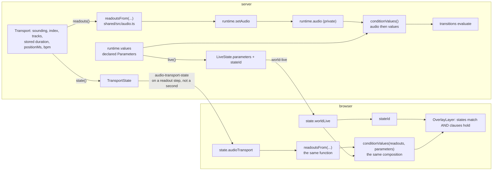
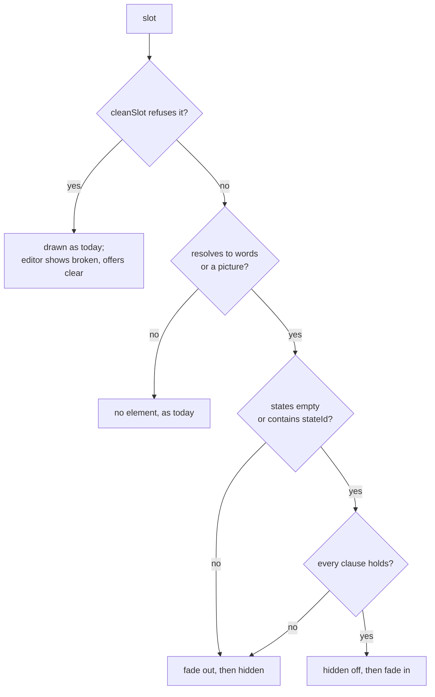
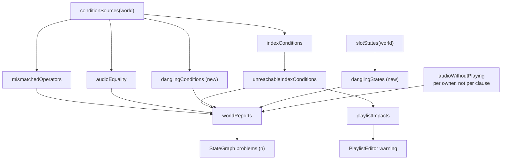

# feat: An overlay slot that says when it is drawn

## Summary

Give an overlay slot the two things a transition has for saying *when*: the States it applies to,
and the conditions that must hold. A slot naming no States and carrying no conditions is drawn
always, which is every slot on disk today, so no manifest is rewritten and no World changes what it
shows. The clause vocabulary, the operators per type, the "empty means always" rule and the picker
are the ones the state machine already uses.

A slot fades in and out over its own fade length, absent meaning an instant cut. The conditions are
evaluated in the browser, from values it already receives, and the runtime is not asked to decide
what is on screen. A slot that is not drawn keeps its element; it is not unmounted. Both `/live` and
`/broadcast` honour all of it through the one component that draws overlays on both, and the editor
row says whether the slot is being drawn right now.

---

## Problem Frame

An overlay slot today is unconditional: `slotsOf(world)` hands `OverlayLayer` the list and every
entry that resolves to something is drawn, for as long as the World is open. The only way to make a
caption come and go is to make its *words* come and go — which `speech`, `playlist-header` and
`track-description` do because they resolve from live state, and which `title` and `text` cannot do
at all, because their words are the operator's and are constant.

So a World can move between States on `energy gt 0.7`, and it can cut to a bridge with six seconds
of music left, but it cannot put a caption on the screen for either. The show has a vocabulary for
"when", and the layer drawn over the picture is the one part of the World that cannot speak it.

That vocabulary has two halves, and it is worth being precise about which is which, because the
first draft of this plan reached for only one. A transition says when it applies **structurally** —
`from` and `fromAny` are its position in the graph — and then filters that with **conditions**. A
slot has no position in the graph at all, so conditions alone would leave it unable to say the most
ordinary thing an operator wants: draw this lower third while the machine is in the interview State.

The workaround without the structural half is not a small one. A bool Parameter set by an Effect on
the State latches: leaving a State resets nothing, a State's Effects simply stop being live and the
Parameter keeps its last value, so every *other* State needs the inverse Effect and a State added
later silently breaks the caption. It is also not prompt — Effects fire on a shared 100ms clock with
a 250ms floor and never on arrival, so the caption would land at least a quarter-second after the cut
it is meant to label.

So a slot gets both halves. The rest of the vocabulary already exists and is exercised: `Condition`,
`opsFor`, `clauseHolds`, the reserved audio readouts, the two-optgroup picker, and five reports that
read conditions back to the operator. The work is to give the slot the same fields and let every one
of those things see them, without a second evaluator, a second picker, or a second definition of what
a readout says.

---

## Requirements

- **R1** An overlay slot may carry conditions in the existing `Condition` vocabulary. All clauses on
  a slot conjoin, exactly as on a transition.
- **R2** A slot may name the States it is drawn in. Naming none means every State, mirroring
  `fromAny` on a transition. States and conditions conjoin: both must be satisfied.
- **R3** A slot naming no States and carrying no conditions is drawn always. Absent is the canonical
  form for all three new fields: an empty list is not stored, and no World written before this gains
  a key on its next save.
- **R4** A slot that is not drawn is not visible, and becomes visible again the moment it is drawn,
  with no reload and no re-fetch of a picture.
- **R5** A slot carries its own fade length. Absent means an instant cut, which is what every World
  on disk gets and is the control case for the measurement.
- **R6** `/live` and `/broadcast` behave identically. Both draw through `OverlayLayer` and neither
  may diverge in cascade, timing or mechanism.
- **R7** A condition on a slot may name a declared Parameter or a reserved `audio.*` readout, and
  reads the value the machine last broadcast for it. The client is told at every instant a readout
  steps, so the two agree to within one delivery rather than by construction.
- **R8** The five report surfaces that read conditions back to the operator — mismatched operator,
  `audio` without `playing`, equality on a reserved readout, an unreachable playlist index, and the
  playlist-edit impact — see a slot's conditions as well as a transition's, and say which one they
  are talking about.
- **R9** A condition naming a Parameter the World no longer declares is reported, for both owners.
  So is a slot naming a State the World no longer holds. On a transition a stranded clause is a move
  that never fires; on a slot it is a caption that never appears, and nothing on the picture says why.
- **R10** The editor says whether a slot is being drawn right now, so that not-showing is
  distinguishable from unfilled and from broken without opening the projector.
- **R11** The condition rows in the editor are the transition editor's rows, not a second
  implementation of them.
- **R12** Every access to a stored `conditions`, `states` or `fadeMs` goes through the strict
  per-slot guard, so a hand-written manifest cannot take a surface to its error boundary.
- **R13** All of it is settable over the protocol by an agent, through the existing whole-list
  `set-world-overlays` message and no new one.

---

## Key Technical Decisions

### KTD1 — A slot names States the way a transition does, and filters with conditions the way a transition does.

`states?: string[]` beside `conditions?: Condition[]`. The list holds State ids; naming none means
any State, which is `fromAny` by another name and keeps the absent-means-everything rule the whole
overlay vocabulary already uses. The browser reads `live.stateId`, which it holds exactly and
unambiguously — no operator, no value type, no derivation.

The two halves conjoin, and the order they are written in the guard and evaluated in the layer is
States first: it is the cheaper test, and it is the one an operator will reach for most.

*Rejected:* a clause whose value names a State. It would widen `ParameterValue` from
boolean-or-number to include strings, which reaches `clauseHolds`, `opsFor`, every report and the
store's clamp — a change to the machine's own comparison vocabulary, for something the structural
form expresses better.

### KTD2 — The browser derives the audio readouts from the transport. They do not go on `LiveState`.

This was the fork in the request, and the answer is the one the codebase has already written down
twice. `WorldRuntime` keeps the readouts in a private `audio` map precisely so `live()` does not
carry them: a readout in `values` would be broadcast every time anything emits, once a second,
forever — origin R27 — and `server/test/live/transport.test.ts` pins it with *"does not broadcast
world-live for a readout change alone"*. Publishing them would mean either a stale field on the wire
(the exact shape of `docs/solutions/a-flag-nothing-reads-looks-shipped.md`) or emitting from
`setAudio`, which puts a World with a soundtrack into permanent transmission.

The precedent is `readoutValue(name, transport)` in `ui/src/components/StateGraph.tsx`, whose comment
records that reading the readouts out of `live.parameters` produced a panel that "showed the
nothing-playing fallback forever and was dead the day it was written". `TransportState` is already
broadcast on change and `OverlayLayer` already holds it.

**The derivation is not a plain field read, and the first draft of this plan was wrong to say so.**
`readouts()` computes `audio.length` and `audio.remaining` from the private `totalMs()`, which is
`Math.max(stored, MIN_TRACK_MS)` and answers 0 for anything that is not a finite positive number.
`TransportState.durationMs` is the stored number, uncapped and unchecked — its own comment says "the
stored number, not the paced one". A naive shared function would report `audio.length: 0` for a 300ms
track the machine calls 1, and would invent a key for a hand-edited `Infinity` where `readouts()`
leaves both absent. So the floor and the acceptance move to `shared/src/audio.ts` with the function,
and `transport.ts` imports them back. See U2 for the matrix that proves it.

*Rejected:* a `visible: boolean[]` computed by the runtime and shipped per slot. It puts a rendering
decision inside the machine, needs a broadcast on every readout change (the same R27 problem by
another door), and leaves the editor unable to say why a slot is hidden without asking the server.

### KTD3 — The transport tells the client when a readout steps, not when a second does.

R7's first draft promised the browser read "the same value the machine reads at that instant", and it
cannot. The server recomputes `ceil((total - position) / 1000)` on a live clock; `TransportState` is
re-broadcast only when `floor(positionMs / 1000)` changes. Those step at instants offset by
`total mod 1000`, so on a 3500ms track the machine's `remaining` drops to 1 at position 2500 while
the client, holding the message sent at 2000, still derives 2 until 3000. A slot conditioned
`audio.remaining lt 6` — authored to caption the very bridge a transition takes on the same clause —
would appear up to a second after the cut.

The fix is in `publish()`: broadcast when the *readout* signature changes as well as when the state
signature does. It costs at most the one message per second a second-granular readout already
implies, touches neither `LiveState` nor R27, and makes R7's weaker promise — same value, within one
delivery — actually true rather than aspirational.

### KTD4 — Value precedence is the runtime's, defined once.

`WorldRuntime.conditionValues()` is `{ ...this.audio, ...this.values }` — a declared Parameter wins
over a readout of the same name. The browser composes the same two maps in the same order, through
the same shared helper. In a World loaded through the store this is belt and braces: `runtime.write`
refuses reserved names and the store drops reserved declarations, so `values` cannot shadow a readout
in practice. It is defined anyway because a World built in memory can reach the state the store
prevents, and because one rule stated once is cheaper than two sides guessing.

Absent stays absent: `clauseHolds` fails every clause on an absent value, and that is the whole
reason `readouts()` omits `audio.bpm` rather than reporting zero.

### KTD5 — `conditionsHold` is widened, not copied.

It currently takes a `Transition`. It gains a sibling that takes `Condition[] | undefined`, and the
transition form delegates to it. "Empty means always" then has exactly one definition, and a slot
cannot re-derive it slightly differently.

### KTD6 — A fade per slot, absent meaning a cut.

`fadeMs?: number` on the slot, bounded the way every other stored number here is bounded, and absent
meaning zero. A World on disk therefore gets today's instant behaviour, which is also the control run
for the browser measurement.

Its own control rather than the World's `blendMs`, because the two are different events with
different right answers: `blendMs` is how hard the *picture* cuts, and an operator who wants a hard
picture cut and a soft caption — or a caption that lingers a beat past a bridge — cannot say so if
the two share a number. The earlier draft cited the overlay brief's recorded boundary ("animation HAL
would have to drive stays out") to justify an instant cut; that boundary was written when every slot
was drawn for as long as the World was open, so it was about gratuitous motion on a static layer.
Making appearance itself an event is what changes it, and a caption snapping on at a second boundary
reads as a glitch on a projector rather than as a cue.

### KTD7 — Not drawn means the element stays, fades, and then wears `hidden`.

`docs/solutions/hiding-a-media-element-keeps-what-unmounting-throws-away.md` is the rule and a
picture slot is the case: unmounting an `` re-fetches it on the way back, and a clause that
flaps re-fetches on every evaluation. The element stays.

The sequence is the mechanism. Going out: the fade class goes on, and `hidden` follows when the fade
ends. Coming in: `hidden` comes off first, then the fade class. With `fadeMs` absent both happen in
one step, which is why the zero case is the control and not a special path.

`hidden` rather than a class alone is a *testability* decision, from
`docs/solutions/a-testid-query-finds-hidden-elements.md`: `getByTestId` finds hidden elements and
jsdom applies no stylesheet, so a CSS-only hide would ship with component assertions that cannot
fail. `hidden` makes `queryByRole` and `toBeVisible` real.

**No new stylesheet rule is needed to hide, and the first draft was wrong to ask for one "in both
surface sections".** The overlay rules are a single shared block in `ui/src/styles.css`, not
duplicated per surface, and neither `.overlay-slot` nor `.overlay-image` declares `display` — so the
UA's `[hidden] { display: none }` already applies unopposed on both. Adding a full-specificity rule
would manufacture the very two-cascade-positions hazard
`docs/solutions/two-rules-of-equal-specificity-are-ordered-by-the-file-not-by-you.md` warns about,
for no behaviour. U7 asserts the computed `display` is `none` on both surfaces with no such rule
present; a rule gets added only if a later `display` declaration makes one necessary. The fade's own
opacity transition is a new rule, and that one *is* needed.

### KTD8 — A slot that stops being drawn leaves the flow, and its neighbours move.

Two slots at one position stack in a column — the default layout has exactly this shape, the playlist
header above the track description at bottom left. `hidden` takes the box out of the flow, so an
unconditioned neighbour moves the moment its sibling stops being drawn. That is the right default: a
reserved empty box would push other captions aside for a caption that is not there. But it is a
visible consequence during a show, so U7's control slot shares a position with a conditioned one and
reports its rect either side of the flip, and the fade covers the moment rather than the jump
arriving cold.

### KTD9 — A not-drawn slot still renders an element; a slot with nothing to say still does not.

`OverlayLayer` today drops a text entry whose resolved words are `null`. That stays: a slot with
nothing to say has no element, as now. What is new is the hidden element for a slot whose *words
exist* and which is not currently drawn. The two states are different facts and the DOM says so.

This adds hidden nodes to `/broadcast`. Neither overlay class sets `display`, so the UA rule holds, a
hidden node paints nothing, and it is invisible to window capture and to selection — the containment
property holds. The cost is that the surface's allowlist assertions become weaker evidence, because
they now count nodes the viewer never sees; U3 updates them deliberately rather than discovering them
as breakage.

### KTD10 — Overlay visibility is not suppressed by the machine's evaluation invariant.

While a crossing, an atomic run or a blend is live, the runtime evaluates nothing — no wake point, no
Parameter, not Any State. Overlay visibility is deliberately *not* joined to that: it is a rendering
of the values as they stand, computed in the browser, and it keeps updating through a bridge. The
invariant exists to stop the machine changing State mid-crossing, not to freeze the picture, and a
caption that lies for the length of a bridge is worse than one that does not.

The consequence is real and worth stating rather than discovering: an arrival Effect writes a
Parameter at the instant a blend window opens, so a caption can change while the picture is still
dissolving. That is the intended behaviour, and U3 and U7 each exercise it —
`docs/solutions/suppressing-an-evaluation-is-half-of-deferring-it.md` is about a hold that was decided
in prose and exercised by nothing.

Note the interaction with States: `stateId` still names the *source* State for the whole of a
crossing, so a slot scoped to the destination State appears when the crossing ends, not when it
begins. That is the same answer the machine gives about where it is, which is the point.

### KTD11 — One condition-source enumerator, and the notes say which owner they mean.

`clauses(world)` is private and walks `world.transitions`. Adding "…and also overlays" to each of the
five consumers is the version of this that regresses —
`docs/solutions/a-completeness-guard-is-only-as-honest-as-its-exemptions.md` records an audit that
found five and a guard that found fourteen. Instead `clauses` becomes an exported
`conditionSources(world)` yielding an owner alongside each clause, and every consumer reads it. It
walks `slotsOf(world)`, not `world.overlays` — the two differ for a World with no stored overlays,
and only the first matches the positions the editor's labels use.

The owner is **additive**: `AudioConditionNote` and `PlaylistIndexNote` keep `transitionId` as an
optional field and gain the owner beside it, so U4 typechecks and ships without waiting for U5 to
rewrite every render site. The owner names a transition id, or a slot's position in the list, which is
how the overlay vocabulary already addresses a slot.

### KTD12 — A bad stored field refuses the slot; a broken row can be cleared without losing the slot.

`cleanSlot` gains branches for all three fields, shaped exactly like `backing` (commit `c439b9a`, the
closest precedent — an optional field on a stored slot, landed with no store change at all): absent
stays absent, present-but-malformed **refuses the slot**, and an empty list or a zero fade is dropped
so the canonical form carries no key. The branch goes in **both** `cleanTextSlot` and
`cleanImageSlot`; `backing` lives only in the text one, so the precedent is a half-pattern here.

Refusing is the projector-safe direction, but it has a cost the first draft missed. `OverlayEditor`
sends the list with refused slots filtered out, because the server refuses a list whole — so a
manifest hand-written with one bad clause loses that slot's words, font, position and image the first
time the operator edits *any other slot*. R12 invites hand-writing and R13 invites an agent to write,
which is exactly the population that produces a malformed field. So the broken row gets a **clear**
control that rewrites the slot without the offending key, and the operator's work survives.

There is no half-authored state to protect on the happy path: the editor seeds a complete clause the
way the transition editor does, so a row is valid from the moment it is added.

---

## High-Level Technical Design

Where a slot's answer comes from, on each side:

The load-bearing claim of the drawing is that the two boxes named `readoutsFrom` are one function and
the two compositions are one helper. U2 exists to make that true and to prove it.

What decides whether one slot is drawn:

Which surfaces read a clause, after this work:

---

## Implementation Units

### U1. The three fields, and the guard that keeps them

**Goal:** `OverlaySlot` carries `conditions?`, `states?` and `fadeMs?`; `cleanSlot` keeps good ones,
drops empty ones and refuses malformed ones; and the store's existing clause repairs learn about the
new owner. Nothing draws them yet — the `blendMs` precedent, which landed its field in one commit and
its consumers in later ones.

**Requirements:** R1, R2, R3, R5, R12, R13.

**Dependencies:** none.

**Files:**
- `shared/src/overlays.ts` — the three fields, and their branches in **both** `cleanTextSlot` and
  `cleanImageSlot`.
- `server/src/storage/worlds.ts` — `removeParameter` and the re-type path in `declareParameter`
  currently filter stranded clauses out of `world.transitions` **only**. Both must walk
  `world.overlays` too, or deleting or re-typing a Parameter leaves a slot's clause behind and the
  caption goes permanently invisible — the failure R9 exists to prevent, from a repair the store
  already had.
- `server/test/live/overlays.test.ts` — the guard's cases.
- `server/test/storage/worlds.test.ts` — the persistence case and the two repairs.

**Approach:** one exported `isCondition(value)` predicate written as a single negated acceptance, per
`docs/solutions/a-threshold-guard-written-as-a-negation-fails-open-on-nan.md`: a string `parameter`,
an `op` in the closed set, a `value` that is a boolean or a finite number. `states` is an array of
non-empty strings; it is **not** checked against the World's States here, because the guard is per
slot and has no World — a State that does not exist is a report (U4), not a refusal. `fadeMs` is a
finite number in `[0, MAX_OVERLAY_FADE_MS]`, and zero is dropped.

Before writing the fields, grep for every place a slot or a World is rebuilt by *naming* its fields —
`docs/solutions/rebuilding-a-cache-field-by-field-turns-a-read-into-a-delete.md`. The store's load
path spreads (`...spread` first) so a slot key survives by construction, but `cleanSlot` itself
constructs a fresh object and any other constructor the grep finds must be checked.

**Patterns to follow:** `backing` on `TextSlot` (commit `c439b9a`) for the guard branch and the
absent-stays-absent spread; `removeParameter`'s existing transition filter for the two repairs.

**Test scenarios:**
- `cleanSlot` on a slot with none of the three fields returns an object with none of those properties
  (`not.toHaveProperty`), for a text slot and a picture slot.
- A well-formed clause list survives unchanged and keeps its order; so does a States list.
- `conditions: []`, `states: []` and `fadeMs: 0` are each dropped.
- Each malformed shape refuses the whole slot (`toBeNull`), on **both** slot kinds: `conditions` not
  an array, an entry that is not an object, a non-string `parameter`, an `op` outside the closed set,
  a `value` that is a string, `NaN` or `Infinity`; `states` not an array, an entry that is not a
  string, an empty-string entry; `fadeMs` negative, `NaN`, `Infinity`, or past the ceiling.
- A World whose manifest carries all three on a slot survives **a reopen, an unrelated edit, and
  another reopen** with them intact — the store convention, and the half that catches a field-by-field
  rebuild, since the drop happens on the next write rather than on the read.
- `removeParameter` strips a clause naming the removed Parameter from a slot as well as from a
  transition, and leaves the slot otherwise whole.
- The re-type path drops a slot clause whose operator the new type does not offer, matching what it
  already does for transitions.
- The lenient guard `overlayEntries` keeps an entry carrying a malformed field — refusing it is the
  strict guard's job, and the editor still has to show the row as broken.

**Verification:** typecheck and suite green; a manifest hand-written with all three fields loads, is
edited elsewhere in the World, saves, and still has them; deleting the Parameter it names leaves the
slot without the clause rather than with a dead one.

---

### U2. One definition of a readout, and one of the composition

**Goal:** the six reserved readouts are computed by one pure function usable on both sides, the two
value maps are composed in one place with the runtime's precedence, and the client is told whenever a
readout steps.

**Requirements:** R7.

**Dependencies:** none (parallel with U1).

**Files:**
- `shared/src/audio.ts` — `readoutsFrom(...)`, plus `MIN_TRACK_MS` and the positive-finite acceptance
  moved here from the transport.
- `shared/src/world-graph.ts` — `clausesHold(conditions, values)` with `conditionsHold(transition,
  values)` delegating to it, and `conditionValues(readouts, parameters)` for the precedence.
- `server/src/live/transport.ts` — `readouts()` delegates; `publish()` gains the readout signature in
  its broadcast trigger; `MIN_TRACK_MS` re-imported.
- `server/src/live/runtime.ts` — `conditionValues()` delegates to the shared composition.
- `server/test/live/audio-readouts.test.ts` — the oracle test.
- `server/test/live/transport.test.ts` — the new broadcast trigger, and the rules it must not break.
- `server/test/live/world-graph.test.ts` — `clausesHold` directly.

**Approach:** the function's input is not `durationMs` as stored but the same clamped, validated total
`totalMs()` produces, so the floor and the acceptance move to `shared/` with it. The absences are the
contract and must be preserved exactly — `audio.length` and `audio.remaining` only when the duration
is known, `audio.bpm` only when the tempo is, and the whole nothing-playing set when no track is held.
The ceiling on `remaining` stays a ceiling: "5" covers the last five seconds. State one rule for how
"nothing held" is detected from a `TransportState` — `readouts()` keys off `current()` being null and
`StateGraph.readoutValue` uses `!transport || transport.index < 0 || !transport.path`; the shared
function needs one answer, not two.

The broadcast change is one clause in `publish()`: send when the readout signature has changed as well
as when the state signature has. The no-broadcast rules it must not break are the `world-live` one (a
readout change must still not emit a World message) and the settled-World one (a transport that is not
moving must still go quiet).

**Execution note:** write the oracle test first, against the current implementation, before moving
anything.

*Deferred to implementation:* if the matrix shows `TransportState` cannot express one of the six even
with the floor restored — the likeliest candidate is a distinction between *held* and *sounding* that
`state()` flattens — do **not** widen `LiveState`. Add the missing readout to `TransportState`: it is
already the message that carries the transport, and R27 is untouched by it.

**Test scenarios:**
- **The oracle.** Copy the pre-move body of `Transport.readouts()` into the test file as a frozen
  reference and assert `readoutsFrom(...)` deep-equals it across the matrix, with `toEqual` so an
  extra key fails. A test comparing the shared function to the delegating `readouts()` would be
  `f(x) === f(x)` after the move and could never fail again — which is also why the earlier draft's
  revert instruction was backwards: reverting the delegation is what *restores* a real comparison, so
  a pass after a revert is the expected result, not evidence the test is empty.
- The matrix: nothing held; a track held but not sounding; a track sounding; a track of unknown
  duration; **a track whose stored duration is under `MIN_TRACK_MS`**; **a track whose stored duration
  is `Infinity`**; a track of unknown tempo; the last seconds of a track; the last track.
- A track whose length is not a whole number of seconds broadcasts a transport message at the instant
  `audio.remaining` steps, not only at the instant the second does.
- A readout change still broadcasts no `world-live` — the existing test, unchanged and still green.
- A settled transport still goes quiet.
- `clausesHold(undefined, {})` and `clausesHold([], {})` are both true, and `conditionsHold` on a
  transition with no conditions still is.
- A clause on an absent value is false, for every operator.
- `conditionValues` gives a declared Parameter precedence over a readout of the same name.

**Verification:** the whole `server/test/live/` suite green, in particular the transport tests that pin
readout absence and the no-`world-live`-for-a-readout rule.

---

### U3. The layer draws what the slot says, on both surfaces

**Goal:** a slot is visible exactly when its States match and its clauses hold; it fades if it says
to; both surfaces do the same thing.

**Requirements:** R2, R4, R5, R6.

**Dependencies:** U1, U2.

**Files:**
- `ui/src/components/OverlayLayer.tsx` — compose the values from `state.audioTransport` and
  `state.worldLive`, test States then clauses, drive the fade and `hidden`.
- `ui/src/components/StateGraph.tsx` — re-express `readoutValue` over the shared function so the panel
  and the layer cannot disagree. Its `UNKNOWN` sentinel stays a display concern of the panel.
- `ui/src/styles.css` — the opacity transition for the fade, in the one shared overlay block. **No
  `[hidden]` rule**; see KTD7.
- `ui/test/components/OverlayLayer.test.tsx` — the behaviour.
- `ui/test/components/BroadcastStage.test.tsx` — the allowlist assertions, which will see the new
  hidden nodes and are updated here rather than discovered later.

**Approach:** evaluate through the cleaned slot, never the raw one — the entry mapping already keeps
`cleanSlot(slot) ?? slot`, and every read of a stored field goes through the cleaned value because a
hand-edited manifest once took `/live` to its error boundary
(`docs/solutions/typed-test-fixtures-cannot-express-what-a-lenient-loader-admits.md`). A slot whose
`cleanSlot` returned null has no usable fields and is drawn as it is drawn today.

A missing `worldLive` — no World open, or the broadcast names another — means no `stateId` and an
empty parameter map, so a slot naming States or carrying clauses is not drawn. That is the safe
direction, and it is the same direction `clauseHolds` already takes on an absent value.

**Test scenarios:**
- A slot with none of the three fields is visible, on both surfaces — the unchanged-World case, which
  should be provable rather than assumed.
- A slot naming the current State is visible; naming another State it is hidden; naming none it is
  visible in every State.
- A slot conditioned on a declared Parameter is hidden when the value fails and visible when it holds,
  asserted with `queryByRole` / `toBeVisible`, never `queryByTestId`.
- States and conditions conjoin: matching State with a failing clause is hidden, and the reverse.
- The same for a slot conditioned on `audio.remaining`, driven by an `audio-transport-state` message
  alone with no `world-live` between — the case that would fail if the readouts had been read from
  `live.parameters`.
- **KTD10's case:** a `world-live` carrying a new `transitionId` and changed parameters updates the
  slot's visibility rather than freezing it, and a slot scoped to the destination State stays hidden
  until the crossing ends.
- A picture slot's `` is the *same node* before and after a flip in each direction (assert node
  identity, not presence), which is what says it was hidden rather than remounted.
- With `fadeMs` absent the element goes to `hidden` in one step; with `fadeMs` set the fade class is
  applied first and `hidden` follows, and coming back the order is reversed.
- A hostile fixture built with `as unknown as` — `conditions: 3`, `states: 7`, `fadeMs: "x"` — renders
  without throwing and the layer stays up.
- `/broadcast` renders no *visible* text node that is not a slot's authored words, with a
  not-currently-drawn slot present in the World.
- Both surfaces, same World, same values: the set of visible slots is equal.

**Verification:** component suite green, and the browser check in U7 — jsdom applies no stylesheet and
lays nothing out, so a component test cannot be evidence for what the operator sees.

---

### U4. One enumerator, and notes that name their owner

**Goal:** every report that reads conditions reads both sources through one walk and says which owner
each finding belongs to, and a slot naming a State the World does not hold is reported.

**Requirements:** R8, R9.

**Dependencies:** U1.

**Files:**
- `shared/src/world-graph.ts` — `conditionSources(world)` replacing the private `clauses`;
  `mismatchedOperators`, `audioEquality`, `indexConditions` and `unreachableIndexConditions` reading
  it; `audioWithoutPlaying` widened per owner; new `danglingConditions(world)` and
  `danglingStates(world)`; the `worldReports` assembly.
- `shared/src/worlds.ts` — the owner beside the now-optional `transitionId` on `AudioConditionNote`
  and `PlaylistIndexNote`, and the two new reports' fields on `WorldReports`.
- `server/test/live/world-graph.test.ts` — the cases.

**Approach:** `conditionSources` walks `world.transitions` and `slotsOf(world)`. The owner is additive
— `transitionId` stays and becomes optional — so this unit typechecks and lands without U5, which is
otherwise impossible: `StateGraph` reads `item.transitionId` today and would not compile.

`audioWithoutPlaying` stays per-owner rather than per-clause, because one `audio.playing` clause
protects the whole conjunction, and a slot's clause list is a conjunction in exactly the same way.

`danglingConditions` covers both owners: a clause naming a Parameter the World does not declare and
that is not a reserved readout. `danglingStates` covers slots only, because a transition's `from`
already has the graph's own reachability reports. Both skip reserved names the way `danglingEffects`
does. Note the store now repairs the Parameter case on the way through (U1), so the report catches
what a hand-written manifest or a mid-flight edit produced, not what the store let rot.

**Test scenarios:**
- Each of the five existing reports, given a World with the same defect on a transition *and* on a
  slot, returns both findings with the right owner.
- `conditionSources` on a World with no overlays yields exactly what the old private walk did — the
  existing world-graph cases pass unchanged apart from the owner field.
- `conditionSources` walks `slotsOf`, so a World with no stored overlays contributes the default
  slots' clauses (none) rather than throwing, and slot positions match what the editor labels.
- A slot `cleanSlot` refuses contributes no clauses and no States to any report: a broken slot is
  reported as broken by the editor, not as five condition faults.
- `danglingConditions` finds a clause naming a deleted Parameter on each owner, finds nothing for a
  reserved readout, and finds nothing for a declared one.
- `danglingStates` finds a slot naming a State id the World does not hold, and finds nothing for a
  slot naming none.
- A World with conditioned slots and no playlist produces no index findings.
- Completeness: one test that, for a World carrying the same clause on both owners, asserts no report
  returns findings for only one of them. It is the enumeration the guard exists for, and it fails
  loudly if a sixth report is added that walks transitions directly.

**Verification:** `server/test/live/world-graph.test.ts` green including its existing index-condition
cases, and typecheck green **without** U5 — the additive owner is what makes that true.

---

### U5. The operator is told, in both places conditions are reported

**Goal:** the `problems (n)` group and the playlist-edit warning name a slot when the finding is a
slot's.

**Requirements:** R8, R9.

**Dependencies:** U4.

**Files:**
- `ui/src/components/StateGraph.tsx` — the `raise(...)` sections, the `transitionNamed(id)` closure
  which has nothing to say for a slot, and a `slotNamed(index)` beside it; the two new report
  sections.
- `ui/src/components/PlaylistEditor.tsx` — the impact warning's prose.
- `shared/src/types.ts` — `PlaylistImpact`, if its shape carries the note type.
- `server/src/live/service.ts` — `playlistImpacts` needs no logic change once the two index reports
  enumerate both owners, but its per-World skip and its prose are re-read against a World whose only
  affected clauses are on slots.
- `ui/test/components/StateGraph.test.tsx`, `ui/test/components/PlaylistEditor.test.tsx`.

**Approach:** naming a slot is the one new piece of copy, and it is specified exactly rather than left
to the implementer, because several report sites must render it identically. `slotNamed(index)` is
`slot ${index + 1}` for a picture slot or a text slot with no words, and `slot ${index + 1} ("…")` for
a text slot with words, where the quoted part is the words cut to 24 characters with an ellipsis when
cut. 1-based, matching every other slot address the editor uses.

**Test scenarios:**
- A World whose only mismatched operator is on a slot shows the `mismatched-operators` section, and
  the text names a slot rather than reading as an unnamed transition.
- The same for `audio-unguarded`, `audio-equality`, `dangling-conditions` and `dangling-states`.
- A dangling condition on a slot and one on a transition are both listed, distinguishably.
- `slotNamed` renders the exact template: no words for a picture slot, quoted words for a text slot,
  and a 30-character caption cut to 24 with an ellipsis.
- The playlist-impact warning appears for a World whose only stranded index conditions are on slots —
  the case that would silently report nothing if `playlistImpacts` had been left walking transitions.
- The problems count includes slot findings.

**Verification:** component suite green; the sections render for a slot-only World.

---

### U6. The editor: shared condition rows, a States picker, a fade, and whether it is showing

**Goal:** one condition-row implementation used by both editors, the two new controls beside it, a way
to rescue a broken row, and a mark that says whether the slot is on screen right now.

**Requirements:** R2, R5, R10, R11, R13.

**Dependencies:** U1, U3 (for the composed values the mark reads).

**Files:**
- `ui/src/components/ConditionRows.tsx` — new; the rows lifted out of `TransitionPanel` with
  `OP_LABEL`, `typeOf`, `repoint` and `seedCondition`.
- `ui/src/components/StateGraph.tsx` — `TransitionPanel` mounts it; the local helpers go.
- `ui/src/components/OverlayEditor.tsx` — the rows, a States multi-select, a `SizeField` reuse for the
  fade, the clear control on a broken row, the not-showing-now mark, and a `setSlotFields` setter.
- `ui/test/components/StateGraph.test.tsx` — the existing `condition ${index} …` queries, which gain
  the owner suffix.
- `ui/test/components/OverlayEditor.test.tsx` — the new controls.

**Approach, and the decisions the review asked for:**

*Placement.* The rows mount as a new line inside the slot's `<li>`, after the colour field and the
picture picker, behind a per-slot disclosure that is collapsed when the slot has no States and no
conditions and open when it has either. An unconditioned slot's row therefore does not grow at all,
which matters because the row already carries two control lines, a colour field, a font field, a size
field and sometimes a picker, times up to `MAX_OVERLAYS` slots.

*Labels.* `ConditionRows` takes an `owner` string and renders `condition ${index} ${field} —
${owner}`, with `TransitionPanel` passing the transition's name and `OverlayEditor` passing
`slot ${index + 1}`. The condition index stays 0-based, matching `seedCondition` today; the slot
number stays 1-based, matching every other control on that row.

*Empty-state copy.* `TransitionPanel` shows "None — offered whenever it is evaluated." A slot is
drawn, not offered or evaluated, so the component takes an `emptyLabel` and the overlay editor passes
its own line rather than putting transition vocabulary on a caption.

*`editable`.* Today only the add button reads it and the selects are always live. In the overlay
editor every other control is explicitly disabled on a read-only World, so the extracted component
disables every control on the row, not just the button.

*Writing.* `setSlotFields` rebuilds the slot preserving its kind and omits a key entirely when its
value is empty — `write` sends the list **unfiltered** (it filters which slots go, not what is in
them), so relying on `cleanSlot` or the server to drop `conditions: []` would put an empty array on
the wire. Conditions, States and fade are common to both slot kinds, so they do not go through
`replaceText` / `replaceImage`, which are typed per kind on purpose so that a colour cannot be set on
a picture.

*The mark.* The row shows whether the slot is being drawn right now, from the same composed values
`OverlayLayer` uses, and says which half is failing — a State that does not match, or a clause that
does not hold. This replaces the earlier draft's "no per-slot preview in the editor" boundary, because
with States added there are now five ways for a slot to show nothing and the picture cannot tell them
apart.

*The clear control.* A row `cleanSlot` refuses shows the existing broken state and offers **clear
conditions** / **clear states**, which rewrite the slot without that key. Without it the write-side
filter deletes the whole slot — words, font, position, image — the next time any other slot is edited.

`repoint` comes across as it is. Its docstring records that spreading and swapping the name put three
unfireable clauses into a World in use, and
`docs/solutions/a-fix-to-what-a-picker-offers-is-not-a-fix-to-what-it-keeps.md` is the same lesson:
the gesture to test is changing a clause's Parameter *across a type boundary*, not the dropdown.

**Test scenarios:**
- Adding a condition to a slot sends one `set-world-overlays` whose slot carries one complete clause,
  and the row does not vanish — the write-side filter case.
- Removing the last condition sends a slot with **no** `conditions` property, asserted on the message,
  not on what the store holds.
- The same for the last State, and for a fade set back to zero.
- Re-pointing a clause from a `bool` Parameter to an `int` one changes the operator to a numeric one
  and the value to that Parameter's default, asserted on what is sent, in both editors.
- The two editors on screen at once do not collide: transition rows and a slot's rows are both
  reachable by their labels.
- On a read-only World every control on a condition row is disabled, in both editors.
- The disclosure is collapsed for a slot with nothing set and open for a slot with either.
- A row whose stored conditions are malformed shows the broken state, offers **clear conditions**, and
  clearing it sends a slot that keeps its words, font, position and image.
- A World with one condition-broken slot and one good slot still has both after an unrelated edit
  followed by that clear.
- The mark says showing for a slot whose State matches and clauses hold, and not-showing with the
  failing half named, for each of the two ways to fail.
- The States picker offers the World's States and no others, and a slot naming a removed State shows
  it as unknown rather than dropping it silently.
- The transition editor's behaviour is unchanged — the extraction is a refactor, and its tests pass
  with only the label suffix edited.

**Verification:** component suite green; the extraction changes no transition behaviour.

---

### U7. The browser says what the operator sees

**Goal:** evidence, on both surfaces, that a slot really disappears and comes back, that the fade
happens, that a neighbour's movement is known, and that nothing was hiding by accident.

**Requirements:** R4, R5, R6.

**Dependencies:** U3.

**Files:**
- `scripts/overlays-check.mjs` — extended. It already boots a throwaway HAL, opens both routes and
  measures per-slot geometry, which is most of the seed; a sibling script would duplicate that. If the
  World it needs diverges too far in practice, split then and say so in `AGENTS.md`.
- `AGENTS.md` — the script's line, with the measurement that matters.

**Approach:** a World carrying a conditioned text slot, a State-scoped picture slot, an unconditioned
control slot **at the same position as one of them**, and a fade on one; open `/live` and
`/broadcast`; flip the Parameter over the protocol, and separately drive a State change through an
arrival Effect so a blend window is open while the caption changes. Report the **computed** style and
client rect of every slot on each surface either side of every flip, the measured fade duration, the
control slot's rect, and whether the picture element's node identity survived.

The computed style is the point. A screenshot is not evidence for a visibility claim any more than it
is for a colour or a width, and the class list looks correct in both the working and the broken
cascade.

**Test scenarios:** *Test expectation: none — this unit is a measurement script and its output is the
evidence.* What it must print: per slot per surface, `display`, `visibility`, `opacity` and the client
rect before, during and after each flip; the measured fade against the configured `fadeMs`, with the
absent-fade slot showing no intermediate opacity at all; the control slot's rect either side, so the
stacked-neighbour movement KTD8 accepts is a recorded number rather than a surprise; and equality
between the two surfaces throughout.

**Verification:** run after `npm run build`. The positive check that replaces the earlier draft's
backwards revert step: with **no** `[hidden]` rule in the stylesheet, the computed `display` of a
not-drawn slot is `none` on both surfaces. If it is not, a later `display` declaration has landed on
an overlay class and a rule is then genuinely needed.

---

### U8. A slot names its States

**Goal:** the structural half of "when", verified as a whole rather than in pieces.

**Requirements:** R2, R9.

**Dependencies:** U1 (the field), U3 (the evaluation), U6 (the picker).

**Files:** none of its own — this unit is the seam through U1, U3, U4 and U6, and exists as a unit so
that its acceptance is not buried inside three others.

**Approach:** a World with three States and a slot named for one of them, driven around the graph, is
a single coherent check that no per-file test makes. If the field lands with U1/U3/U6 in one change,
this unit is its acceptance rather than its implementation.

**Test scenarios:**
- Driving a World around three States shows and hides the slot at each arrival, on both surfaces.
- A slot naming two States is drawn in both and hidden in the third.
- During a bridge between two named States the slot follows the *source* State, per KTD10, and
  switches when the crossing ends.
- A slot naming a State that is later removed is reported by `danglingStates` and draws nowhere.
- An agent setting `states` over `set-world-overlays` gets the same behaviour as the editor.

**Verification:** the three-State World behaves the same on `/live`, on `/broadcast`, and when driven
by an agent over the protocol rather than by the editor.

---

### U9. The fade

**Goal:** a slot appears and disappears over its own length, and a World that sets none still cuts.

**Requirements:** R5.

**Dependencies:** U3, U6.

**Files:**
- `shared/src/overlays.ts` — `MAX_OVERLAY_FADE_MS` beside the other bounds (the field itself is U1).
- `ui/src/components/OverlayLayer.tsx` — the sequencing in KTD7.
- `ui/src/styles.css` — the transition.
- `ui/test/components/OverlayLayer.test.tsx`, `scripts/overlays-check.mjs`.

**Approach:** the length is the slot's, per KTD6. The sequencing is the mechanism: fade class then
`hidden` going out, `hidden` off then fade class coming in, and with the field absent both collapse
into one step so the zero case is the control rather than a branch.

A slot whose condition flaps faster than its own fade must not stack transitions: the current values
are the target, and an interrupted fade reverses from where it is rather than restarting.

**Test scenarios:**
- With no `fadeMs` the element reaches `hidden` in one step and shows no intermediate opacity.
- With `fadeMs` set the class lands before `hidden` on the way out and after `hidden` is removed on the
  way in.
- A flip during a fade reverses rather than queueing, and the element ends in the state the values ask
  for.
- The ceiling is enforced by the guard, and a hand-written value past it refuses the slot (U1).
- The browser measurement reports a duration matching the configured length within tolerance, on both
  surfaces.

**Verification:** the measurement in U7, on both surfaces, with the absent-fade control in the same
run.

---

## Scope Boundaries

### In scope

Three fields on the slot, their guard and the store repairs that keep them honest; evaluation on both
surfaces; the fade; the reports, including two new ones; the shared editor rows with a States picker,
a fade control, a clear control and a showing/not-showing mark; and a browser measurement.

### Not in scope

- **No new operator, no new readout, no new Parameter type.** The clause vocabulary is the one that
  exists, and a clause value stays boolean-or-number.
- **No entrance, exit or motion beyond opacity.** A fade is a fade; slides, wipes and scale are the
  animation the overlay brief's boundary is about, and a file that animates itself still animates
  itself.
- **No conditions or States on the World's title, on `blendMs`, or on anything that is not a slot.**
- **No per-slot ordering or z-index control.** Pictures behind words by document order, as today.

### Deferred to follow-up work

- **The `?? "bool"` fallback in `typeOf`.** A clause naming a Parameter the World no longer declares
  is typed `bool` by the editor and offered `is` / `is not`. U1's store repair and U4's report make the
  situation rare and visible; changing what the picker offers for a name it cannot type is a separate
  decision about a pre-existing behaviour.
- **Reserving a not-drawn slot's box.** KTD8 lets the neighbour move and U7 measures it. If the
  measurement reads badly, holding the box is the alternative, and it is one rule.
- **A never-appears mark in the graph, beside the never-fires marks on a transition.** The editor row
  now says whether a slot is showing *now*; whether it could ever show, given the World's reachable
  States, is the graph's kind of question.

---

## Risks

- **The shared readout function still diverges somewhere the matrix does not reach.** The floor and
  the finiteness check are the two known ones and are handled; the oracle test is what makes a third
  fail loudly. Contingency stays: widen `TransportState`, never `LiveState`.
- **The new broadcast trigger in `publish()` talks more than expected.** It is bounded by the same
  second-granularity the readouts already have, and two existing tests pin the rules it must not break,
  but it is a change to how often a running show emits.
- **The note shape change in U4 ripples further than expected.** Making the owner additive keeps
  typecheck green without U5, which turns a big-bang into two changes; the risk is volume, not
  surprise.
- **U3, U5 and U6 all edit `StateGraph.tsx`** — `readoutValue`, the raise sections, and the
  `TransitionPanel` extraction — and hang off different predecessors. Expect conflicts if they are
  worked in parallel.
- **The broadcast allowlist tests weaken.** They now count nodes the viewer never sees. U3 updates
  them; the hazard is letting them go on reading as proof of what is on screen.
- **A slot conditioned on `audio.remaining` still steps at second granularity.** KTD3 makes the client
  agree with the machine; it does not make either finer. A caption cued on the last second is cued on
  a second boundary.

---

## Sources & Research

- `docs/solutions/a-flag-nothing-reads-looks-shipped.md` — why the readouts are not on `LiveState`.
- `docs/solutions/hiding-a-media-element-keeps-what-unmounting-throws-away.md` — hidden, not unmounted.
- `docs/solutions/a-testid-query-finds-hidden-elements.md` — why the `hidden` attribute.
- `docs/solutions/two-rules-of-equal-specificity-are-ordered-by-the-file-not-by-you.md` — why no
  stylesheet rule is added to hide, and why both surfaces are measured.
- `docs/solutions/a-completeness-guard-is-only-as-honest-as-its-exemptions.md` — one enumerator, not
  five branches.
- `docs/solutions/rebuilding-a-cache-field-by-field-turns-a-read-into-a-delete.md` — the grep before
  the fields are added, and why the test reopens twice.
- `docs/solutions/a-lenient-load-and-a-strict-write-need-a-filter-between-them.md` — why the broken row
  needs a clear control.
- `docs/solutions/typed-test-fixtures-cannot-express-what-a-lenient-loader-admits.md` — the hostile
  fixture.
- `docs/solutions/a-fix-to-what-a-picker-offers-is-not-a-fix-to-what-it-keeps.md` — the gesture to test
  when `repoint` moves.
- `docs/solutions/suppressing-an-evaluation-is-half-of-deferring-it.md` — why KTD10 is exercised and
  not only stated.
- `docs/residual-review-findings/feat-overlay-images-and-fonts.md` — the animation boundary this plan
  re-reads, and the lenient-load/strict-write pairing on the server's own import handler.
- Commit `c439b9a` (`backing` on `TextSlot`) — the precedent the three fields copy.
