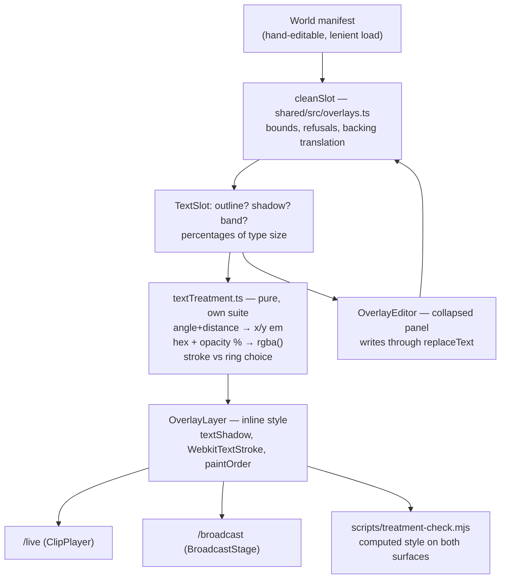

# feat: Outlines and shadows on text overlays

## Summary

A text slot gains two optional authored fields — an **outline** (colour, width) and a **shadow**
(colour, opacity, angle, distance, blur) — plus a **band** on/off. Absent means none, so every World
on disk draws exactly what it draws today and gains no key on its next save.

The three replace `backing`, which has been in the model since the speech feature and has never had
a control. A stored `backing` is translated once by the guard into the authored fields nearest to
what it draws, and is never written back. Every measurement is a percentage of the slot's own type
size, so a treated slot holds its proportions on `/live` and on `/broadcast` the way `size` already
does against the picture.

The derivation from stored numbers to drawn CSS lives in a pure module with its own suite — jsdom
lays nothing out and applies no stylesheet, so that module is where the arithmetic can be asserted,
and a browser check is where the appearance is settled.

---

## Problem Frame

A text slot's look is `font`, `size`, `color`. There is no way to ask for a coloured border or a
cast shadow, which is ordinary titling vocabulary. Nothing is broken; the reach is missing
(see origin).

`TextSlot.backing` (`shared/src/overlays.ts`) is the half-built version: the guard accepts
`"shadow" | "band"`, `OverlayLayer.tsx:501` turns it into a class, and `styles.css:3987` draws a
fixed four-offset black ring or a fixed black plate. No control writes it. `OverlayEditor.tsx`
never mentions it. It is reachable only by hand-editing a manifest or by an agent sending the
field — `scripts/speech-check.mjs:138` is the one place in the repo that does.

So this feature is not additive: it has to replace a vocabulary that is live in the guard, live in
the layer, live in the stylesheet and live in one script, while leaving what is on disk drawing
what it drew.

---

## Requirements

Carried from the origin document. R-IDs are the origin's.

| Requirement | Where it lands |
| --- | --- |
| R1–R4 outline: colour, width, absent means none, drawn outside the letterform | U1, U2, U3 |
| R5–R9 shadow: colour, opacity, angle, distance, blur | U1, U2, U3 |
| R10–R11 independent, drawn shadow → outline → fill | U2, U3 |
| R12 an untreated slot renders what it renders today | U1, U3, U6 |
| R13 measurements scale with the slot's type size | U2, U6 |
| R14 both take part in fade and `when` | U3 |
| R15 the band survives as an on/off and gains a control | U1, U4, U5 |
| R16 a stored `backing` is read once and never written back | U1 |
| R17 malformed refuses the slot; out of band refuses rather than clamps | U1 |
| R18–R20 collapsed per-slot panel, no keys when off, nothing on a picture slot | U5 |
| R21 reachable over the protocol, not UI-only | U1 (the wire is `set-world-overlays`, unchanged in shape) |
| R22 settled in a real browser on both surfaces | U6 |

Origin outstanding questions, resolved here: **starting values** are decided in KTD5; **an authored
band** stays deferred (KTD6); **sharing a look between slots** stays deferred (origin scope
boundary).

---

## Key Technical Decisions

**KTD1 — Three fields, not one treatment object.** `outline?`, `shadow?` and `band?` sit directly on
`TextSlot` beside `font`, `size` and `color`. A single `treatment` wrapper would nest the one thing
the editor edits per control and buy nothing: the fields are independent (R10), and a fourth
treatment later is a fourth key, exactly as a fourth `SOURCES` entry is one entry. This matches how
`states`, `conditions` and `fadeMs` were added flat rather than under a `when` object even though
the editor groups them in one panel.

**KTD2 — Every measurement is a percentage of the slot's type size.** `outline.width`,
`shadow.distance` and `shadow.blur` are stored as percentages, converted to `em` at render.
Percentages rather than raw `em` because `size` and `opacity` are already percentages and an
operator typing `0.04` into a box is authoring in a unit nothing else in this editor uses; `em` at
render rather than `px` because that is what makes the small player and a fullscreened
`/broadcast` agree, which is the property the whole layer is built on (`styles.css:3976`).

The referent differs from `size`'s — `size` is a percentage of *picture height*, these are
percentages of *type size* — so the editor labels them `% of type size` and the guard comments say
which is which. Two percentages with different referents in one panel is the one real readability
cost of this decision.

**KTD3 — The angle is clockwise from straight up, and distance 0 is the glow.** Stored as degrees
0–359, converted at render to `x = sin(θ)·d`, `y = −cos(θ)·d`. So 0° casts straight up, 135° down
and to the right, 180° straight down (R6). Distance 0 collapses both offsets to zero and the blur
alone remains, which is a glow — there is no glow mode and no fourth field (R7).

**KTD4 — The outline is a stroke painted behind the fill, with a measured fallback.** The intended
mechanism is `-webkit-text-stroke` plus `paint-order: stroke fill`, which paints the stroke first so
the fill covers its inner half and the letterform keeps its shape (R3). This is the one claim in
the plan that documentation cannot settle: whether the engine honours `paint-order` on this text,
and whether a `text-shadow` on the same element casts from the stroked outline or from the bare
glyph. **U6 measures both.** If either answer is wrong, the fallback is the ring of offsets
`backing-shadow` draws today, generated from the same authored numbers and merged into the one
`text-shadow` list with the drop shadow. The stored vocabulary does not change either way — this is
a choice inside U2, which is why U2 is a pure module with a suite rather than three lines inline in
the layer.

**Settled 2026-09-07 (U6).** `paint-order: stroke fill` works: the word keeps 92.9% of its white pixels with an 8%-of-type-size black stroke, and gains 5,816 black border pixels. The ring-of-offsets fallback is not needed. The measurement is in pixels rather than metrics — a stroke changes no layout metric in any engine, so the Range comparison this plan proposed would have reported the same width stroked or bare.

**KTD5 — Switching a treatment on writes visible values.** Resolves an origin outstanding question.
A control that writes nothing visible reads as broken. Enabling the outline writes
`{ color: "#000000", width: 4 }`; enabling the shadow writes
`{ color: "#000000", opacity: 90, angle: 135, distance: 4, blur: 6 }`. Both are black because black
over a picture is the case that always reads, and both are then fully editable. The numbers are the
neighbourhood of what `backing-shadow` draws today (0.03–0.06em), which is the one treatment in this
repo that has been looked at on a real output.

**KTD6 — The band stays fixed black.** It gains a control and nothing else. An authored band colour
and opacity is two more fields for a treatment nobody asked to author, and it is recorded as
deferred in the origin. The CSS rule keeps its current values and only its selector changes.

**KTD7 — A stored `backing` is translated to the nearest expressible authored form.** `"shadow"` →
`outline: { color: "#000000", width: 3 }`; `"band"` → `band: true`. The ring `backing-shadow` draws
is four blurred offsets and the new model has one shadow and one outline, so an exact reproduction
is not expressible — the translation is the same *kind* of mark at the same weight, slightly
crisper. This refines R16's "nothing it drew changes" to "nothing an operator would take as a
change", and the exposure is a hand-edited manifest or an agent's message, because no World authored
through the editor has ever carried the field. The translation lives in `cleanSlot`, so it happens
once, everywhere, and the key leaves the manifest on that World's next save.

**KTD8 — Ordering U1 before U4.** The stylesheet's `.backing-*` rules cannot be deleted until the
guard translates, or a hand-edited World loses its ring for the length of one commit. The guard and
the layer read the new fields before the old CSS goes.

---

## High-Level Technical Design

Where each piece of the derivation lives, and why it is not all in the layer:



The arithmetic sits in its own module because jsdom neither lays out nor applies a stylesheet: a
component test can assert that the layer set `text-shadow: 0.028em 0.028em ...` and that assertion
is about a string this code produced. What can be honestly asserted in Node is the derivation; what
can only be asserted in a browser is the appearance. The two are separated so each is tested where
it is true.

Angle convention, since it is the part most likely to be implemented backwards:

```text
            0° (up)
              │
   270° ──────┼────── 90° (right)
              │
           180° (down)

  x = sin(θ) · distance      y = −cos(θ) · distance
  135° → x positive, y positive → down and to the right
  distance 0 → x = y = 0 → blur only, an even glow
```

---

## Implementation Units

### U1. The vocabulary and the guard

**Goal.** `TextSlot` carries `outline?`, `shadow?` and `band?`; `backing` stops being a stored
concept and becomes a translation on read.

**Requirements.** R1, R2, R4, R5, R6, R7, R8, R9, R12, R15, R16, R17, R21.

**Dependencies.** None.

**Files.**
- `shared/src/overlays.ts` — the interfaces, the bounds, `cleanTextSlot`, the translation, the
  `usableShare` helper.
- `server/test/live/overlays.test.ts` — guard coverage.
- `server/test/voice/subtitles.test.ts` — the existing `describe("the optional backing")` block
  becomes the translation block.

**Approach.** `OverlayBacking` and `BACKINGS` are deleted as exported vocabulary; `isBacking` stays
as a private predicate used only by the translation. New shapes:

- `outline?: { color: string; width: number }` — `width` a percentage of type size, `OUTLINE_MAX 25`.
- `shadow?: { color: string; opacity?: number; angle: number; distance: number; blur: number }` —
  `distance` 0–`SHADOW_DISTANCE_MAX 50`, `blur` 0–`SHADOW_BLUR_MAX 100`, `angle` 0–359,
  `opacity` reusing `OPACITY_MIN`/`OPACITY_MAX` with absent meaning opaque.
- `band?: true` — a stored `false` is dropped to absent, `fadeMs: 0`'s rule, so "no band" has one
  shape.

Each object is present-but-malformed → refuse the slot (R17), the rule `backing` and `kind` already
follow. A width, distance or blur outside its band refuses rather than clamps, `usableSize`'s stated
reason. Guards are written as one acceptance negated once around the whole thing so `NaN` and
`Infinity` fail closed — `docs/solutions/a-threshold-guard-written-as-a-negation-fails-open-on-nan.md`.
A `width: 0`, `blur: 0` or `distance: 0` is legal and meaningful (0 blur is a hard edge, 0 distance
is a glow); only a `width: 0` outline is equivalent to absent, and it is kept rather than dropped so
the editor's own field can hold it while being typed.

The canonical form still omits everything absent, and the emitted literal keeps its current
field order with the three new keys spread conditionally.

**Patterns to follow.** `backing`'s branch in `cleanTextSlot` (commit `c439b9a`) for the
present-but-unknown refusal; `cleanWhen`'s branches for a nested value that may be dropped;
`usableOpacity`'s comment for why absent is the caller's decision and not the helper's.

**Test scenarios.**
- A slot with none of the three cleans to exactly the object it cleans to today — no new keys.
- Each field round-trips at its minimum and its maximum.
- `width`, `distance`, `blur`, `angle` and `opacity` one step outside their bands each refuse the
  whole slot; `NaN` and `Infinity` refuse for each.
- A non-hex outline or shadow colour refuses; a `#RGB` shorthand is canonicalised to `#rrggbb`.
- `outline` or `shadow` present as a string, an array or `null` refuses.
- `shadow` missing `angle`, `distance` or `blur` refuses; `shadow` missing `opacity` cleans with no
  `opacity` key.
- `band: false` cleans to a slot with no `band` key; `band: true` keeps it; `band: 1` refuses.
- Covers AE4. `backing: "shadow"` cleans to `outline: { color: "#000000", width: 3 }` and no
  `backing` key; `backing: "band"` cleans to `band: true`; `backing: "glow"` still refuses the slot.
- A slot carrying both `backing: "shadow"` and an authored `outline` keeps the authored one and
  drops `backing` — the authored field wins, stated once.
- `outline` and `shadow` on an image slot are dropped, the rule a `font` on a picture follows.
- `cleanOverlays` refuses the whole list when one slot's shadow is out of band, unchanged.
- `overlayEntries` keeps a slot with an out-of-band shadow, unchanged — the lenient load.

**Verification.** The guard suite passes; a manifest carrying `backing` loads and reports the
translated fields; no test asserts a `BACKINGS` export.

---

### U2. The derivation, as a pure module

**Goal.** Turn a stored outline and shadow into the CSS the layer applies, in one place with its own
suite.

**Requirements.** R2, R3, R6, R7, R8, R9, R11, R13.

**Dependencies.** U1.

**Files.**
- `ui/src/textTreatment.ts` — new.
- `ui/test/textTreatment.test.ts` — new.

**Approach.** Three exported functions, no React and no DOM:

- `shadowCss(shadow)` → a `text-shadow` value: offsets from angle and distance (KTD3), blur, and
  the colour as `rgba()` built from the stored hex and the opacity percentage. Percentages become
  `em` by dividing by 100.
- `outlineCss(outline)` → the stroke width in `em` and the colour, plus the paint order, as the
  properties the layer will set.
- `treatmentStyle(slot)` → the whole inline style fragment for a text slot, absent fields
  contributing nothing at all, so a slot with no treatment produces an empty object and the layer's
  spread adds no properties (R12).

The stroke-versus-ring choice of KTD4 lives behind `outlineCss`, so if U6's measurement sends it to
the ring, the change is one function body and its suite, and neither the layer nor the stored
vocabulary moves.

Numbers are rounded to a fixed number of decimal places on the way out, so the value is stable
across engines and a test can assert a string rather than a float.

**Patterns to follow.** `ui/src/overlay.ts` — a pure module with its own suite, for the stated
reason that jsdom lays nothing out and the arithmetic is the whole of what can be asserted.

**Test scenarios.**
- 0°, 90°, 180°, 270° at a known distance each produce the expected signed offsets; 135° produces
  positive x and positive y (down and right).
- Distance 0 produces `0em 0em` regardless of angle, and a non-zero blur — the glow.
- A percentage converts to `em` at 1/100 for width, distance and blur.
- Opacity absent produces a fully opaque colour; 0 produces a fully transparent one; 50 produces
  the half-alpha `rgba()`.
- A `#rrggbb` becomes the matching `rgb` triple in `rgba()`.
- A slot with no outline and no shadow produces an empty style object — asserted by key count, not
  by a truthiness check.
- A slot with only an outline produces stroke properties and no `text-shadow`, and vice versa.
- Both present produce both, and the shadow value does not contain the outline colour (R11's
  ordering is a paint concern, not a merge).
- Values round to the same string on repeated calls with equivalent floats.

**Verification.** The suite passes and nothing in it imports React or touches `document`.

---

### U3. Drawing it, on both surfaces

**Goal.** `OverlayLayer` applies the treatment inline, so `/live` and `/broadcast` cannot disagree.

**Requirements.** R3, R10, R11, R12, R13, R14.

**Dependencies.** U1, U2.

**Files.**
- `ui/src/components/OverlayLayer.tsx` — the text branch's `style` and `className`.
- `ui/test/components/OverlayLayer.test.tsx` — coverage.

**Approach.** The slot's `style` gains the spread from `treatmentStyle(slot)`, beside `fontFamily`,
`fontSize`, `color` and the fade. The `className` keeps `overlay-slot` and gains `overlay-band` only
when `band` is set; the `backing-${slot.backing}` expression goes.

Inline rather than a class per treatment because the values are authored per slot and there is no
finite set of them — and because an inline style cannot lose a cascade contest on one surface, which
is the failure `docs/solutions/copy-both-halves-of-a-mechanism.md` and the clip-blending review
already paid for once. The fade continues to set `opacity` and `transition` on the same element; a
shadow drawn on a partly-faded element fades with it because it is part of that element's paint
(R14), which is asserted rather than assumed.

Image slots are untouched.

**Patterns to follow.** The existing `style` composition on the same element; the `hidden`-not-
unmounted rule two branches up.

**Test scenarios.**
- A slot with no treatment renders the same `style` keys it renders today, and no `text-shadow` or
  stroke property — asserted on the element's inline style, not on a snapshot.
- Covers AE1. A slot with an outline renders the stroke width and colour and no `text-shadow`.
- Covers AE2. A slot with a shadow at distance 0 and a wide blur renders a `text-shadow` whose
  offsets are zero.
- A slot with both renders both.
- Covers AE3. A treated slot with a fade renders the treatment and the fade's opacity and transition
  on the same element, and the treatment does not change across the fade.
- A slot hidden by its `when` renders `hidden` and still carries its treatment properties, the
  hide-don't-unmount rule.
- A `band` slot carries the `overlay-band` class; a slot without it carries neither that nor any
  `backing-` class.
- An image slot renders no treatment properties.
- Both surfaces: the same assertions through `ClipPlayer` and `BroadcastStage`, so a future change
  cannot treat one and not the other.

**Verification.** Component suites pass; `overlay-slot` elements carry no `backing-` class anywhere
in the tree.

---

### U4. The stylesheet

**Goal.** Remove the two `.backing-*` rules and keep the band drawing what it draws.

**Requirements.** R15.

**Dependencies.** U1, U3 (KTD8 — the guard and the layer must read the new fields first).

**Files.**
- `ui/src/styles.css`.

**Approach.** `.overlay-slot.backing-shadow` is deleted outright: what it drew is now authored, and
leaving it would be a second, invisible source for the same property. `.overlay-slot.backing-band`
becomes `.overlay-slot.overlay-band` with its declarations and its container-query comment intact —
the padding note there
(`docs/solutions/a-container-unit-in-the-containers-own-padding-measures-the-viewport.md`) is still
load-bearing and must survive the rename.

No new rule sets `text-shadow`, `-webkit-text-stroke` or `paint-order` on `.overlay-slot`. A rule
that did would sit at a second cascade position for a property the layer sets inline, which is the
hazard `conditions-check` records for `display` and which
`docs/solutions/a-property-declared-twice-keeps-the-last-value-and-the-first-comment.md` and
`docs/solutions/two-rules-of-equal-specificity-are-ordered-by-the-file-not-by-you.md` both describe.

**Test expectation: none** — a selector rename with no behavioural change of its own. U3 asserts the
class name and U6 measures the drawn result.

**Verification.** No `backing-` string remains in `ui/src/`; the band's computed background is
unchanged in U6's run.

---

### U5. The editor panel

**Goal.** An operator can author both treatments, per slot, from a panel that is closed until they
open it.

**Requirements.** R1, R4, R5, R9, R15, R18, R19, R20.

**Dependencies.** U1.

**Files.**
- `ui/src/components/OverlayEditor.tsx` — a `TreatmentField` component and its open-set state.
- `ui/src/styles.css` — the panel's own rules, mirroring `.overlay-when-*`.
- `ui/test/components/OverlayEditor.test.tsx` — coverage.

**Approach.** A disclosure per text row, beside the existing `when` one, holding: a band checkbox;
an outline on/off with a `ColorField` and a width field; a shadow on/off with a `ColorField` and
four number fields (opacity, angle, distance, blur). Closed by default for every slot, `WhenField`'s
stated reason — a row already carries two control lines, a colour, a font and a size, times up to
`MAX_OVERLAYS`.

Every write goes through `replaceText`, which is already typed per kind so none of this can reach an
image slot (R20). Switching a treatment off deletes the key rather than writing a disabled object,
`withWhen`'s rule and for its reason: `write` filters which *slots* go, not what is inside them, so
an empty object would reach the wire and the canonical form of "no outline" is the one every
existing manifest has. Switching one on writes KTD5's values in a single message.

Number fields commit on blur or Enter through `SizeField`, not per keystroke — typing "12" would
otherwise send 1 and then 12, and the first is a frame of the wrong thing. `SizeField`'s `min`,
`max` and `step` props already carry this; the refusal message follows `commitSize`'s shape, refused
in the editor with its reason because the person is looking at the field.

Two `ColorField`s in one panel is a lot of vertical space — it renders a swatch palette plus a
custom picker. They sit at the bottom of the panel, after the numbers, so the fields an operator
adjusts repeatedly are not pushed below two palettes.

The open-set is cleared on reorder and on remove, exactly as `openWhen` and `picking` are, because
every panel addressing a row by index has to let go when the index changes meaning.

**Patterns to follow.** `WhenField` for the disclosure, the open-set and the panel markup;
`withWhen` for delete-the-key-on-empty; `commitSize` for a refused number; `FontField`'s note for
why a control's offered set is not its kept set.

**Test scenarios.**
- The panel is closed for every slot on first render, including a slot that already carries a
  treatment.
- Opening a row and enabling the outline sends one `set-world-overlays` whose slot carries KTD5's
  outline values.
- Disabling it sends a list whose slot has no `outline` key at all — asserted with `not.toHaveProperty`,
  not by checking for a falsy value.
- Editing width, angle, distance, blur and opacity each send the typed number, on blur and on Enter.
- A width above its maximum is refused in the editor with a message naming the band, and no message
  is sent.
- Typing into a number field sends nothing until blur or Enter.
- The band checkbox sends `band: true`, and clearing it sends a slot with no `band` key.
- An image row shows no treatment panel and no toggle.
- Reordering a row with an open panel closes it.
- Covers AE4. A row whose slot carries a stored `backing` shows the translated values in the panel,
  because the editor renders what the guard cleaned.
- A slot the guard refuses still shows its row and its unusable warning, and the treatment panel
  does not throw on it.

**Verification.** The editor suite passes; a manual open of `/live` shows a closed panel on every
row and no change to the two existing control lines.

---

### U6. The browser verification

**Goal.** Settle in a real browser, on both surfaces, what jsdom cannot say: that the treatment is
drawn, at the right scale, and outside the letterform.

**Requirements.** R3, R12, R13, R22.

**Dependencies.** U1–U5.

**Files.**
- `scripts/treatment-check.mjs` — new.
- `scripts/speech-check.mjs` — its seed at line 138 sends `backing: "band"`; move it to `band: true`.
- `AGENTS.md` — the Commands list, which documents each check script and the measurement that
  matters.

**Approach.** `scripts/conditions-check.mjs` is the closest precedent and the one to copy: boot a
throwaway HAL with synthetic clips of two aspects, seed a World, open `/live` and `/broadcast`,
read computed styles off `[data-overlay-slot]` elements, print, and exit non-zero on a
disagreement.

The seeded World carries four text slots at one position: an untreated control, an outline-only
slot, a shadow-only slot at 135°, and a glow (distance 0, wide blur). What is printed per surface:

- The computed `text-shadow`, `-webkit-text-stroke-width`, `-webkit-text-stroke-color` and
  `paint-order` of each slot, plus its `font-size` in pixels.
- Each treated measurement as a **share of that slot's own font size**, which is the number that
  must match across the two surfaces (R13) even though the pixel values will not.
- The control slot's properties, which must be `none` / `0px` — the evidence for R12.
- The rendered width of one word in the outlined slot against the same word in the control at the
  same font and size. **This is the R3 measurement**: if the stroke is eating the letterform rather
  than sitting outside it, the two widths are equal and the glyph is heavier; if the stroke is
  painted outside, the outlined word is wider by roughly twice the stroke width.
- Whether the shadow on the outlined slot casts from the stroke or from the bare glyph, read from
  the same word's ink extent — the second half of KTD4's unknown.

If the paint-order measurement fails, U2's `outlineCss` moves to the ring fallback and this script
is the thing that says so; the fallback's own measurement is the same word-width comparison.

**Test expectation: none** — the script *is* the test, and it is a script rather than a unit test
for the reason `AGENTS.md` already gives for the other four: jsdom applies no stylesheet, so an
assertion in the suite would be an assertion about a string this code produced.

**Verification.** The script runs green on both surfaces; the shares match across `/live` and
`/broadcast`; the control slot measures clean; `AGENTS.md` records the numbers that matter, the way
it does for the other checks.

---

## Scope Boundaries

**In scope.** The three fields, the guard and its translation, the derivation module, the layer, the
stylesheet, the editor panel, and the browser check.

### Deferred to Follow-Up Work
- Stacked shadows, named presets, and a look shared between slots (origin defers all three).
- An authored colour or opacity for the band (KTD6).
- Closing the `set-world-overlays` staleness window, which this widens and did not open
  (`docs/residual-review-findings/feat-overlay-when.md`).

**Outside this feature.** What text is drawn, where it may sit, which sources exist; any treatment
on a picture slot; any change to sound, the state machine, or what `/broadcast` may render.

---

## Risks and Dependencies

**The outline mechanism is unmeasured.** KTD4's whole point. Contained by putting the choice inside
one function with a suite, and by making U6 the thing that decides. The plan does not depend on the
answer.

**Deleting `.backing-shadow` before the translation lands would blank a hand-edited World's ring.**
KTD8 orders U1 and U3 before U4 for exactly this. It is a one-commit window and it is avoidable, so
avoid it.

**Two percentages with different referents.** `size` is a percentage of picture height; width,
distance and blur are percentages of type size. Mitigated by labelling in the editor and by naming
the referent in every guard comment, but it is a real cost of KTD2 and worth a second look during
review.

**An older build strips what it does not know.** A build without this feature drops the three fields
on any overlay edit, the property every optional field here has. Recorded, not fixed — the fix is
in the older build.

**`scripts/speech-check.mjs` seeds `backing`.** It keeps working through the translation, but it
should stop being the last caller of a vocabulary this feature removes. U6 moves it.

---

## Sources and Research

- `docs/brainstorms/2026-09-07-overlay-text-treatment-requirements.md` — the origin.
- `shared/src/overlays.ts`, `ui/src/components/OverlayLayer.tsx`, `ui/src/components/OverlayEditor.tsx`,
  `ui/src/styles.css` — the four files this changes and the comments that state their rules.
- `docs/plans/2026-09-07-001-feat-overlay-conditions-plan.md` — the immediately preceding feature on
  the same files, and the source of the `when` panel this borrows.
- `docs/solutions/a-lenient-load-and-a-strict-write-need-a-filter-between-them.md` — why `write`
  filters and why every edit builds on `current()`.
- `docs/solutions/a-fix-to-what-a-picker-offers-is-not-a-fix-to-what-it-keeps.md` — why a control's
  offered set is not its kept set.
- `docs/solutions/a-threshold-guard-written-as-a-negation-fails-open-on-nan.md` — the guard shape.
- `docs/solutions/a-property-declared-twice-keeps-the-last-value-and-the-first-comment.md` and
  `docs/solutions/two-rules-of-equal-specificity-are-ordered-by-the-file-not-by-you.md` — why no CSS
  rule sets a property the layer sets inline.
- `docs/solutions/a-container-unit-in-the-containers-own-padding-measures-the-viewport.md` — the
  band's padding comment, which must survive U4's rename.
- `scripts/conditions-check.mjs` — the shape U6 copies.
