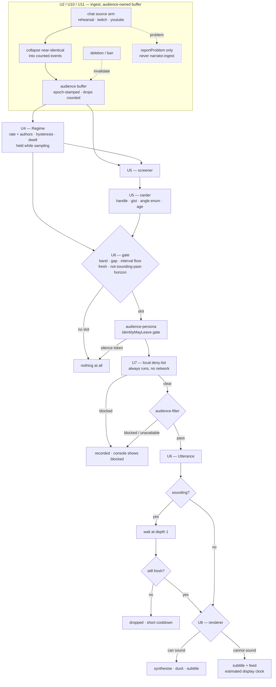
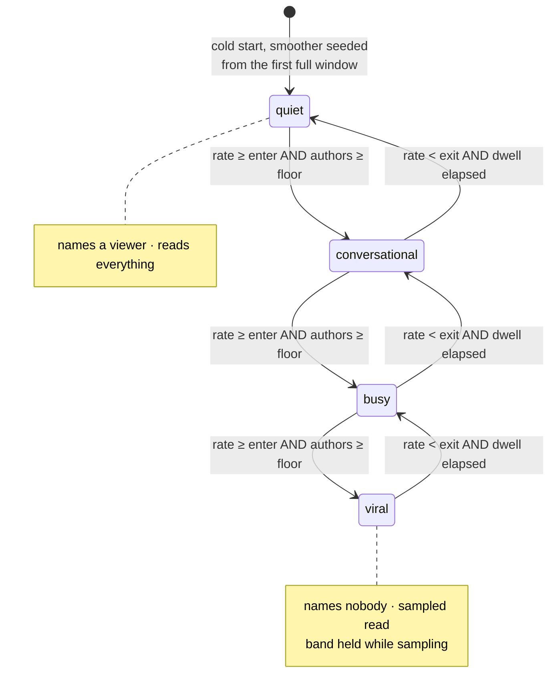

# feat: The character talks to her audience

## Summary

Give a World's character a livestream chat to read and a reason to speak. Chat arrives as a third
Monitor source arm but does not become monitor narration; a **Regime** measured from message rate and
how many separate people are typing decides whether she names a viewer or addresses the room; a
deterministic gate opens a speaking slot and only then is a model asked *what* to say. Reading and
carding stay on the machine, every line passes a filter with a local floor, and a rehearsal runner
drives the whole pipeline from a scripted transcript before either platform client exists.

---

## Problem Frame

The speech feature shipped a character who can say anything and never decides to. `speak` is on the
protocol, a preset renders the same audio every time, and a subtitle rides the overlay layer onto
`/broadcast` — but every word so far was typed by the operator.

Meanwhile `/broadcast` is pointed at OBS on YouTube and Twitch with viewers arriving. The audience is
small now and may not stay small, and the two ends fail in opposite directions: with three messages
in twenty minutes there is no room to address, and with four hundred a minute a named reply is
invisible and stale before the sentence ends.

Four things in the existing code shape the work more than the requirements do. `slotForRole` returns
`observation` for every non-chat role and there are two slots, so one new role would give the carder
and the persona the same destination. `MonitorService.pollOne` hands every poll result to
`MonitorNarrator` unconditionally, so inheriting the Monitor machinery wires viewer text to a second
model and into the shared feed by default. `MonitorRunner` is a single `poll()` with no teardown,
which suits a file tail and leaks a websocket. And `SpeechService` supersedes by dequeuing — the
stated reason the missing rate limit is safe, and the thing an autonomous speaker changes.

---

## What this plan deliberately does not do

An earlier draft carried a Regime with participation-weighted authors, two-window entry confirmation,
authored-time binning, a stated time-to-band target, and discard correction on both terms; a
per-author selection ban; and a believable-sound-duration bound. Each was added to close a real
failure, and each opened a worse one — the selection ban silenced her on a one-viewer channel, the
duration bound cut her off mid-line, authored-time binning read a throttled channel as quiet during
the surge. They are cut, and the failures they addressed are recorded in Risks with the simpler
answer this plan takes instead. The rule applied throughout: prefer a mechanism that **reports** a
condition over one that acts on it, until a real channel says otherwise.

---

## Requirements

Traceability is to `docs/brainstorms/2026-09-07-live-chat-persona-requirements.md`. All 52 origin
requirements are addressed: this plan implements 50, and R14 and R32 are deferred to follow-up work.

| Origin group | R-IDs | Where |
|---|---|---|
| Ingest | R1–R8 | U2 (arm, buffer, teardown), U3 (rehearsal), U10/U11 (platforms, quota, degradation) |
| Regime | R9, R9a, R10–R13, R15 | U4 |
| The decision to speak | R16–R21 | U6 (gate, lifecycle, orchestration), U5 (screener) |
| The persona | R22–R27 | U5 (cards, quarantine slot), U9 (World character) |
| Speaking and the World | R28–R31, R33 | U6 (Utterance), U8 (renderers, clock, reasons) |
| Moderation and the console | R34–R40 | U7 (filter, floor, corpus), U8 (rate limit, Stop), U13 (console, ledger) |
| Rehearsal | R41–R48 | U3 (runner, script), U7 (corpus) |
| Backends and locality | R49–R51 | U1 (roles, the audience slot), U7 (locality assertion) |

Deferred to a follow-up plan: **R14** and **R32** — the Regime and speaking readouts a World can
transition on.

**Beyond the origin, deliberately.** Moderation events — a deleted message, a banned author — appear
in no origin requirement. The origin now records them as a deferred question. This plan handles the
minimum that stops the worst outcome: a deletion invalidates a candidate before synthesis and appends
a tombstone to the ledger. It does not build a moderation pipeline.

---

## Key Technical Decisions

**Three audience roles over one new backend slot.** `slotForRole` maps every non-chat role to the
single `observation` slot, so one role would give the carder and the persona the same destination.
The roles are **audience-cheap** (collapse, Regime, screener, carder), pinned to `observation`;
**audience-persona**; and **audience-filter**. Persona and filter share one new `audience` slot and
are distinguished by **their own model settings on it**, not by separate slots — `BackendSettings`
carries endpoint, protocol and key, so a stricter filter model on the same server satisfies R34's
independence at a quarter of the surface cost. The limitation is stated rather than hidden: persona
and filter cannot live on different machines in this version.

**The cheap tier requires a loopback endpoint, and that is a real constraint on the operator.**
`isLocalEndpoint` accepts localhost, `127.0.0.1` and `::1` only, so a second machine on the operator's
own LAN is not local. An operator whose `observation` slot points at another box on their network
cannot run this feature until the cheap tier gets its own destination or an acknowledgement path. That
is a genuine limitation, not a detail — the earlier draft claimed such an operator was "not refused
this feature," which was false.

**A card carries a viewer's identity, so it passes the acknowledgement gate.** The handle is a third
party's identity leaving the machine. Every other sender of identity data calls
`identityMayLeave(endpoint, offMachineAcknowledged)`, and `origin.ts` records that the defect this
gate replaced was a third sender that never got the check. The persona and filter calls take the same
gate. (`offMachineAcknowledged` is one global boolean, not a per-slot thing.)

**Audience caps are clamped to narration's when they share a destination.** `contextCapFor` resolves
by `Math.max` over every target matching model and host, so a persona cap larger than narration's
would raise the `num_ctx` that narration, monitors and vision send — permanently, for a feature the
operator runs only during streams. Where the audience models resolve to narration's host and model,
their caps are clamped to `NARRATION_NUM_CTX`; where they resolve elsewhere, they carry their own.

**The chat arm bypasses `MonitorNarrator`, and takes its problem reporting with it.**
`MonitorService.pollOne` calls `narrator.ingest` unconditionally, which would put raw viewer text
through the monitor-role model and into the shared feed. But report-on-transition lives *inside*
`ingest` — the `problem` comparison, the recovery phrase, and the per-monitor state `forget` clears.
So a narrow `reportProblem(monitor, problem)` is extracted from `ingest`, keeping the transition state
and the `forget` semantics, and the chat arm calls that and nothing else.

**A chat event does not ride `MonitorEvent`, and the buffer is guarded like the narrator's.** Author
ids, handles and deletion kinds do not fit a shape every existing consumer reads, so chat events go to
an audience-owned buffer. That buffer loses `pollOne`'s stale-runner guard, which works only because
the payload travels in the return value — so events are stamped with the monitor id and a spawn epoch
and a write from a replaced runner is discarded, and `despawn` drops a disabled monitor's buffered
events the way it calls `narrator.forget`.

**The runner seam gains an async teardown.** `MonitorRunner` is `poll()` and nothing else; a websocket
is not self-limiting under that. `close()` returns a promise, `despawn` fires it with a `.catch`
because `despawn` is synchronous and an escaped rejection crashes the process, and the runner marks
itself closed so a late frame is not written to the buffer.

**Regime is rate and distinct authors, with hysteresis and a dwell. Nothing more.** Entry needs both
above threshold; exit needs the rate below a lower threshold and a dwell elapsed; bands are ordered
and never skip. Rate alone would put one viewer typing three hundred messages into a band where she
stops naming them, and the author term settles the chant question — forty people typing one word is
forty authors, one person repeating it is one.

Three simplifications, each replacing a mechanism that broke something:
- **Under a degraded read the band is held, not recomputed.** Sampling shrinks the author count as
  well as the rate, so correcting only the rate leaves the band unable to rise. Correcting both was a
  second estimator with its own error. Holding is one rule with no estimator at all.
- **A backlog is discarded, not binned.** After a quota outage the cursor resumes, and messages
  authored before the outage ended are dropped from the Regime's input rather than placed in
  authored-time bins — binning fixed the backlog case and created its mirror, where a throttled
  channel reads as quiet during the surge that throttled it.
- **No participation weighting and no two-window confirmation.** They were added against a sybil set
  buying a band. A raid and a sybil set are the same observation, so neither mechanism distinguishes
  them; what remains is an author-count threshold, which the plan already has. The hazard is recorded.

**She is asked what to say, never whether to speak.** Deciding whether a cycle earned a remark is a
prohibition-shaped question, and this project has measured six times that a prohibition becomes the
output. The gate is deterministic code; the model's one abstention is a positive silence token.

**Freshness is re-checked three times, and only lane-consuming outcomes reset the full gap.** Checks
at slot entry, at generation end, and at synthesis entry. An outcome that spent a model call — spoken,
blocked, declined, or aborted by chat preemption — resets the full gap. A stale drop takes a short
cooldown. **And no candidate is carded while a line is sounding past the freshness horizon**, because
carding a candidate that cannot survive the wait spends a model call to produce a drop; that is what
stops the short cooldown becoming a drop loop on the contended lane.

**Chat preemption aborts audience work, and abort is a named outcome.** Audience calls enqueue as the
existing `narration` class, so an operator chat turn aborts an in-flight persona generation — the
monitor narrator's `isAborted` treatment is the precedent. An aborted line resets the full gap and is
recorded; it is not retried, because the moment has moved.

**No per-author selection ban.** An earlier draft forbade one author from supplying consecutive
winning candidates, to stop a hostile viewer monopolising selection. On a one-viewer channel there is
no other author, so she would fall silent after one reply — the exact failure the Regime exists to
prevent. The monopoly hazard is real and is recorded in Risks; the filter and the gap are the
backstops for now.

**A line sounding implausibly long is reported, not acted on.** A stalled client that stops reporting
leaves "sounding" true forever. An earlier draft let the gate proceed past a bound derived from
sentence count — but sentence count is not proportional to sounding time (one unpunctuated sentence at
the character limit is the longest line the system can produce), and proceeding issues a `speak`,
which increments `generation` and abandons the line still playing. So the gate reports the condition
as a cannot-speak reason and waits. She stays quiet and the operator is told why, rather than being
cut off on air.

**An utterance waits at depth one; the operator still supersedes.** The queue holds one candidate and
a newer one replaces it; an operator `speak` supersedes everything as today; Stop clears the queue.
The per-sender minimum interval R38 asks for lands in U8 — and the gate reads it as a floor before
opening a slot, so no model call is spent on a line the voice service will refuse.

**A filter that cannot answer is a third verdict, and a local list always runs.** Pass, blocked with a
reason, or unavailable. A cheap local deny-list runs first and needs no network. A line the list
cannot clear and the filter cannot rule on is dropped and recorded. Fail-open was rejected: with no
hold, the filter is the only automated thing between her and the operator's accounts.

**An unconfigured slot is a stated refusal, never a silent fallback.** `chatBackendOf` falls back to
`backends.observation` when the chat endpoint is blank, and the new slot must not inherit that repair:
an unconfigured filter silently equal to the local persona would void R34's independence with no
signal. An unconfigured audience slot refuses the feature at start with a named reason. Separately,
when the filter's model equals the persona's on the same endpoint, the console says so — the model
being asked to catch the injection that just steered it is a degraded condition the operator should
see.

**The card is a shape firewall; `angle` is the field made structural.** A bounded gist is still
model-laundered attacker text, so `angle` is a closed vocabulary rather than free text. The corpus's
injection half asserts a **canary token** does not appear in the spoken line — the honest, decidable
form. Paraphrase-shaped injections are not covered by it, and U7 says so.

**A World names a global voice preset; it does not own one.** `CONCEPTS.md` states presets are
global. The World carries a character name, a bounded sheet and a preset *reference*, the way it
carries a playlist id, with the same not-found path.

**Ledger redaction is an appended tombstone, not a rewrite.** The inference log is append-only,
day-stamped JSONL, and swallows its own write errors. Rewriting a line in place while the audience
writer appends — during exactly the raid that makes both rates highest — can lose decision records
silently, and a day stamp cannot name a second file for one day. A deletion appends a tombstone the
reader applies. Rolling by size gains a sequence suffix and `fileFor` a branch for the audience kind.

**Platform tokens are stored the way inference keys are, and the reasoning is restated rather than
inherited.** A refresh token acts as the operator on a public platform, which is a larger blast radius
than an inference key. It stays plaintext in the data directory, because the directory already holds
the per-boot websocket token and the machine is the trust boundary either way — but the file is
written with owner-only permissions, the scopes requested are the narrowest that work (chat read and
moderation events; no channel management, no broadcast control), and revocation is a documented
operator action rather than an assumed one.

**Refresh is single-flight.** One in-flight refresh per platform; every other caller awaits it. Where
the provider rotates refresh tokens, two concurrent refreshes present the same token twice and Google
treats reuse as compromise and invalidates the grant — atomic persistence does not help, because both
writes succeed. One driver, not two: refresh on a 401, not on a schedule.

---

## High-Level Technical Design

### The pipeline, and where each stage resolves



### Destinations

```
tier              slot            locality              model setting
audience-cheap    observation     isLocalEndpoint       narrationModel (shared)
audience-persona  audience        identityMayLeave      personaModel
audience-filter   audience        identityMayLeave      filterModel

persona and filter share one endpoint and differ by model.
they cannot live on different machines in this version.
```

### The Regime band machine



---

## Output Structure

```
server/src/audience/
  source.ts        the chat source seam, the normalised event, the audience buffer
  rehearsal.ts     the scripted runner and script parsing
  regime.ts        rate, authors, bands, hysteresis, dwell
  screener.ts      candidate selection
  cards.ts         the carder, the card shape, the angle vocabulary
  gate.ts          slot opening and the Utterance lifecycle
  filter.ts        verdicts, the local deny-list, the locality assertion
  service.ts       the per-cycle orchestration, the ledger, Stop, console messages
  twitch.ts        EventSub over websocket
  youtube.ts       liveChatMessages polling, quota accounting, degradation
  oauth.ts         the code exchange and the single-flight refresh
server/src/storage/
  feed-credentials.ts   the token-set store
scripts/
  audience-check.mjs    the browser verification
```

---

## Implementation Units

U-IDs are stable; they are not in execution order, the phases are.

### Phase A — the pipeline, provable with no network

### U1. The audience roles, the audience slot, and the lane

**Goal:** Give the three tiers their destinations without breaking the two-slot assumptions spread
through the codebase.

**Requirements:** R49, R51 (partial — the assertion is U7)

**Dependencies:** none

**Files:**
- `server/src/providers/resolve.ts` — the three roles; cheap pins to `observation`; persona and filter
  resolve the `audience` slot; both join `contextCapFor`'s targets with caps clamped to
  `NARRATION_NUM_CTX` when they share narration's destination
- `shared/src/types.ts` — the `audience` `BackendSlot`; `personaModel` and `filterModel`; the
  `Readiness` field for the new slot
- `server/src/storage/settings.ts` — the slot's persistence, the two model settings, validation
- `server/src/storage/backend-keys.ts` — the slot's key
- `server/src/providers/probe.ts` — the slot-to-role map
- `server/src/readiness.ts` — the new slot's probe and its readiness leg
- `server/src/chat.ts` — the per-slot `models` broadcast
- `ui/src/store.ts` — `models` and `modelsError` are `Record<BackendSlot, …>` and hard-code two keys
- `ui/src/components/SettingsPanel.tsx` — a new `audience` category (distinct from `chat`, which
  already names the conversation feature); the slot's card; the two model pickers; `BackendCard`'s
  "same as other slot" control, which is meaningless with three
- `server/src/logging/inference.ts` — an `InferenceKind` per tier
- `shared/src/templates.ts` — template roles for persona, carder and filter with slot vocabularies
- `server/test/providers/resolve.test.ts`, `server/test/storage/settings.test.ts`,
  `ui/test/components/SettingsPanel.test.tsx`

**Approach:** `slotForRole` gains real branching. **No settings migration is needed** —
`mergeBackends` falls back to `DEFAULT_BACKENDS[slot]` per slot and `withKeyFlags` iterates the
constant, so an existing settings file survives the addition; do not write one. An unconfigured
`audience` slot refuses the feature with a named reason rather than falling back to `observation` the
way `chatBackendOf` does for chat.

**Test scenarios:**
- audience-cheap resolves to `observation` for every settings shape; persona and filter resolve to
  `audience` and are unaffected by the observation endpoint changing.
- An existing two-slot settings file loads, gains the audience slot at its default, and survives a
  subsequent write.
- With the persona model on narration's host and model but a larger declared cap, narration's request
  still carries `NARRATION_NUM_CTX` — the clamp assertion.
- With the persona model on a different host, it carries its own cap.
- An unconfigured audience slot produces a named refusal, not a silent fallback to observation.
- Readiness for an unconfigured audience slot does not change the global models leg.
- A settings patch carrying the slot's key leaves no key inside any `Settings` object.

**Verification:** typecheck passes across `ui/` and `server/`; an existing settings file loads
unchanged; and narration's context cap is provably unaffected by an audience model on its host.

---

### U2. A chat source arm, a guarded buffer, a teardown, and the problem reporter

**Goal:** Let the Monitor machinery schedule a chat feed without letting the Monitor pipeline consume
it, and keep the problem reporting the bypass would otherwise delete.

**Requirements:** R1, R3, R4, R5, R8

**Dependencies:** none

**Files:**
- `shared/src/types.ts` — the third `MonitorSource` arm (channel identity and a credential reference,
  never a token)
- `server/src/monitors/monitor.ts` — `close(): Promise<void>` on `MonitorRunner`; a poll-interval hint
- `server/src/monitors/narrator.ts` — extract `reportProblem(monitor, problem)` from `ingest`, keeping
  the transition state and `forget` semantics
- `server/src/monitors/service.ts` — runner selection; route a chat result to the buffer and call
  `reportProblem` instead of `ingest`; fire `close()` with a `.catch` from `despawn`; drop the
  monitor's buffered events there too; re-arm the timer from the hint
- `server/src/storage/monitors.ts` — `usable()` and `normalizeSource()` learn the arm and rebuild a
  chat source field by field
- `server/src/audience/source.ts` — the normalised event (author id, display name, text, at, kind) and
  the buffer, with a monitor id and spawn epoch on every event
- `server/src/app.ts` — construct the buffer and inject it into `MonitorService`
- `shared/src/phrases.ts` — an `audience` phrase group and a problem phrase per failure kind
- `ui/src/monitors.ts`, `ui/src/components/MonitorsPanel.tsx` — the third kind in the picker, and
  **hide verbosity and severity for a chat source** (they have no meaning without narration, and a
  patch to either triggers `needsRespawn`, which tears down a live websocket mid-stream)
- `server/test/audience/source.test.ts`, `server/test/monitors/service.test.ts`,
  `server/test/monitors/narrator.test.ts`, `server/test/storage/monitors.test.ts`

**Execution note:** add a characterisation test for the current `pollOne` → `narrator.ingest` path
before changing it.

**Test scenarios:**
- A chat monitor's poll produces no `NarrationEntry` and no monitor-role inference call; a file
  monitor on the same service still produces both.
- A chat monitor's problem reports on transition, once, and clears on the next successful poll.
- A chat monitor reporting a problem, disabled and re-enabled with the problem still present, reports
  it again — the `forget` semantics survive the extraction.
- A poll in flight when the monitor is disabled contributes nothing to the band: its events carry a
  stale epoch and are discarded.
- `despawn` drops the monitor's buffered events; the Regime sees nothing from a disabled monitor.
- Disabling and re-enabling calls `close()` once, and a rejection from `close()` does not crash.
- Forty near-identical messages inside the window produce one event with count 40 and a span. Covers
  AE4. Forty different messages produce forty events.
- A deletion event invalidates the buffered message it names.
- A client sending an extra token-shaped field on a chat source finds it absent from the stored file
  and from the next monitors broadcast.
- A chat monitor renders no verbosity and no severity control.

**Verification:** a chat monitor runs on the Monitor schedule, fills the buffer, reports its own
faults in persona, contributes nothing to narration, and leaves nothing behind when disabled.

---

### U3. The rehearsal runner and the script format

**Goal:** Drive the ingest from a transcript, with no network and no credentials.

**Requirements:** R41, R42, R48

**Dependencies:** U2

**Files:** `server/src/audience/rehearsal.ts`, `docs/` (the script format),
`server/test/audience/rehearsal.test.ts`

**Approach:** A script states message text, author and timing. Two clocks: wall-clock so prose can be
judged by ear, and accelerated for logic. Determinism claims about band and slot sequences move to
U6, where those stages exist — this unit proves only that the same script produces the same events.

**Test scenarios:**
- A script with three messages at stated gaps produces three events at those times against an
  injected clock.
- The same script run twice produces the same event sequence.
- A malformed script reports a problem in persona and does not throw.
- A rehearsal contacts no network: assert no fetch and no socket is attempted.
- A rehearsal attaching while a live chat monitor is enabled is refused with a stated reason.

**Verification:** a scripted transcript fills the buffer twice, identically, with no network access.

---

### U4. Regime: rate, authors, hysteresis and dwell

**Goal:** Turn a window of events into a stable named band.

**Requirements:** R9, R9a, R10, R12, R13, R15

**Dependencies:** U2

**Files:** `server/src/audience/regime.ts`, `shared/src/types.ts` (the band union and thresholds),
`server/src/storage/settings.ts`, `server/test/audience/regime.test.ts`

**Approach:** A smoothed message rate over a trailing window plus the count of distinct author ids in
it. Entry needs both above threshold; exit needs the rate below a lower threshold and a dwell elapsed;
bands are ordered and never skip. While the ingest reports it is sampling, the band is **held** rather
than recomputed. Messages authored before a resumed outage ended are discarded rather than binned.
Cold start begins at quiet with the smoother seeded from the first full window.

**Execution note:** implement test-first. The failure modes are oscillation and latching.

**Test scenarios:**
- Cold start reports quiet, and reports quiet rather than an undefined band before the first window.
- Covers AE2. A single burst on a quiet channel does not change the band, and does not change it back.
- A rate held steadily between the exit and entry thresholds keeps the current band from either
  direction — the hysteresis assertion the burst case does not make.
- A band change is refused before the dwell has elapsed even when the rate has crossed.
- One author emitting 300 messages in ten minutes does not leave conversational. Covers R9a.
- Forty authors emitting one message each within a few seconds reaches a busier band.
- While sampling is reported active, the band does not change in either direction.
- A backlog resumed after an outage is discarded and does not move the band.
- An event with a missing timestamp uses its arrival time rather than being dropped.

**Verification:** a replayed rate profile produces a band sequence with no oscillation at any
crossing, and the one-author case never leaves conversational.

---

### U5. Cards and the screener

**Goal:** Select candidates, and make the card the only thing a speaking model sees.

**Requirements:** R18, R25, R26, R27, R49 (the cheap tier)

**Dependencies:** U1, U4

**Files:** `server/src/audience/screener.ts`, `server/src/audience/cards.ts`,
`shared/src/prompts.ts` (the card slot, the persona preamble, the angle vocabulary),
`shared/src/phrases.ts`, `shared/src/templates.ts`,
`server/test/audience/{cards,screener}.test.ts`, `server/test/templates/surface.test.ts`

**Approach:** The screener is deterministic — direct address, question shape, novelty, repeat count,
recency — and emits candidate references, never free text. The carder is the last stage seeing raw
text, runs on audience-cheap, and emits a stable handle, a bounded gist, an `angle` from a closed
vocabulary, and an age.

**Test scenarios:**
- A message instructing the character produces a card whose angle is the instruction-attempt value and
  whose gist describes rather than instructs. Covers AE6.
- A display name containing markup, newlines or an instruction never appears in any card field.
- Card fields truncate at their bounds visibly.
- The carder refuses to run when its endpoint is not local, with a stated reason.
- The screener returns nothing for routine chatter and the addressed message when one exists.
- A single author on a quiet channel supplies winning candidates on consecutive cycles — there is no
  per-author ban, and the one-viewer case must keep working.
- `surface.test.ts` stays green with the new files nominated and accounted for, not exempted.

**Verification:** the surface guard passes, and no test can construct a path from raw viewer text to
the persona's message.

---

### U6. The gate, the Utterance lifecycle, and the per-cycle orchestration

**Goal:** Decide in code whether to speak, and own the loop.

**Requirements:** R16, R17, R19, R20, R21, R28, R30, R31, R45

**Dependencies:** U4, U5

**Files:**
- `server/src/audience/gate.ts`
- `server/src/audience/service.ts` — the orchestration, with the filter behind an interface U7 fills
- `server/src/app.ts` — construct the audience service, its start/stop and its cycle timer
- `shared/src/types.ts` — the Utterance shape and the sensitivity union
- `shared/src/worlds.ts` — the character field the gate reads
- `shared/src/prompts.ts`, `server/src/storage/settings.ts`
- `server/test/audience/{gate,service}.test.ts`

**Approach:** The gate reads the band, the gap since her last line, the per-sender minimum interval as
a floor, whether a line is sounding, and freshness. Attendance is not a gate term. Eagerness
multiplies the band's gap but never below the interval floor, so no model call is spent on a line the
voice service would refuse.

Precedence, stated once. Freshness at slot entry, generation end, and synthesis entry. No candidate is
carded while a line has been sounding past the freshness horizon. Spoken, blocked, declined and
aborted reset the full gap; a stale drop takes a short cooldown. A sounding line that has run past a
plausible duration is **reported** as a cannot-speak reason and waited on — never proceeded past,
because proceeding issues a `speak` that abandons the line still playing.

Determinism: wall-clock and accelerated rehearsals agree on band and slot-open sequences; freshness
outcomes agree only with generation and synthesis stubbed to a scripted duration; the accelerated run
does not exercise the sounding wait or the third freshness check.

**Execution note:** implement test-first.

**Test scenarios:**
- Covers AE1. Quiet band, one viewer's question: a slot opens and the line names them; a silence token
  produces nothing spoken, drawn or fed, but a ledger record.
- Covers AE10. Fresh at generation start, stale at generation end: dropped before synthesis.
- Stale while waiting behind a sounding line: dropped at synthesis entry.
- A stale drop is not re-offered; a gap-suppressed candidate is.
- While a line has been sounding past the freshness horizon, no candidate is carded — assert the
  carder is not called.
- Over a replayed busy profile she speaks at least a stated number of times, and no more often than
  the gap allows.
- A single viewer on a quiet channel receives more than one reply over ten cycles.
- Covers AE3. A band change while sounding does not alter that line.
- A chat turn arriving during generation aborts it; the outcome resets the full gap and is recorded.
- Eagerness raised so the band gap falls below the minimum interval opens no slot and spends no call.
- A line sounding past a plausible duration reports a cannot-speak reason and does not issue a `speak`.
- The gate opens no slot when the World carries no character. Covers AE5.
- The same rehearsal script twice produces the same band and slot-open sequences.

**Verification:** the ordering scenarios pass against an injected clock; the busy soak bounds her from
both directions; and the one-viewer soak proves she keeps talking.

---

### U7. The filter, the local floor, the locality assertion, and the corpus

**Goal:** Something between her and the operator's accounts that works when the network does not.

**Requirements:** R34, R35, R36, R46, R47, R49, R50, R51

**Dependencies:** U1, U6

**Files:** `server/src/audience/filter.ts`, `server/src/origin.ts` (reused —
`isLocalEndpoint` and `identityMayLeave`; no new check is written),
`server/src/storage/settings.ts` (re-run the assertions on a destination change),
`shared/src/phrases.ts`, `docs/` (the corpus format and a safe sample),
`server/test/audience/filter.test.ts`

**Approach:** Pass, blocked with a reason, or unavailable. A local deny-list runs first and always. The
locality assertion calls `isLocalEndpoint` on audience-cheap's endpoint; the persona and filter calls
pass `identityMayLeave` because a card carries a viewer's handle. Both are re-run on a settings change
touching the destination. When the filter's model equals the persona's on the same endpoint, the
console reports degraded independence.

The corpus lives in the operator's data directory, uncommitted; the repo carries the format and a safe
sample. Three parts: must-block, must-pass (without which a block-everything filter passes every
check), and an injection half in the form (injection text, canary token) whose assertion is that the
canary does not appear in the spoken line. That covers planted-token injections and not paraphrase
attacks, and this unit says so.

**Test scenarios:**
- A deny-list match is blocked with the filter backend unreachable.
- Unavailable on a locally-cleared line results in no speech and a recorded drop.
- A blocked line produces no synthesis — assert the synthesiser is never called.
- Covers AE7. Blocked is marked on the operator's surface, distinguishable from having nothing to say,
  and reaches no text node of `/broadcast`.
- The must-pass half passes; the injection half's canary never appears in a spoken line.
- audience-cheap refuses to start when its endpoint is not local, naming the tier and the endpoint; a
  blank endpoint gets its own reason rather than being reported as off-machine.
- A card send is refused when the persona endpoint is off-machine and the acknowledgement is unset.
- Repointing an endpoint while running stops the pipeline with the same reason.
- Filter model equal to persona model on one endpoint reports degraded independence.
- A filter timeout is unavailable rather than a hang.

**Verification:** the corpus sample runs with every must-block line blocked, every must-pass line
passed, and no canary spoken, with the filter backend unreachable for half the run.

---

### Phase B — speaking

### U8. Renderers, the subtitle clock, the rate limit and Stop

**Goal:** Turn an Utterance into something the audience receives, including where nothing can sound.

**Requirements:** R29, R31, R33, R37, R38

**Dependencies:** U6

**Files:** `server/src/voice/service.ts` (admit an unheard utterance past the `canSound()` refusal;
keep the `onClose` sweep from silencing it; the per-sender minimum interval),
`server/src/audience/service.ts`, `shared/src/types.ts` (Stop, the unheard flag, the reason union),
`ui/src/persona.ts`, `server/test/voice/service.test.ts`, `server/test/audience/render.test.ts`

**Approach:** Two shipped guards destroy an unheard utterance: the `canSound()` refusal before
synthesis, and `onClose`, which calls `silence()` whenever an utterance exists and `canSound()` is
false — true by definition for a subtitle-only line, so any client's disconnect wipes it. An `unheard`
flag is read by both. Sentence boundaries come from `splitSentences`; display duration is estimated
from character count and recorded as estimated. Stop clears the queue and stops speech, and does not
stop the ingest — the console says so and names where the ingest toggle is. Reasons report on
transition.

**Test scenarios:**
- Covers AE8. Nothing attending: a subtitle is drawn, a feed entry written, and the reason stated.
- A client disconnecting mid-subtitle leaves the subtitle up.
- The subtitle-only line clears after its estimated duration.
- The reason reports once on transition over ten quiet cycles.
- An operator `speak` supersedes a sounding autonomous line; an autonomous utterance waits.
- Stop clears a waiting utterance and stops the sounding line, leaving ingest running.
- Two autonomous utterances inside the minimum interval: the second is refused with a reason.

**Verification:** with no client attending, a rehearsal produces subtitles on `/broadcast` that appear,
clear, and survive an unrelated tab closing.

---

### Phase C — the live platforms

### U12. Credentials: the callback route, the token set, and single-flight refresh

**Goal:** Get and keep the tokens both platforms need, on a machine with no public callback.

**Requirements:** R2 (prerequisite), R5

**Dependencies:** U1

**Files:** `server/src/audience/oauth.ts`, `server/src/storage/feed-credentials.ts`,
`server/src/storage/settings.ts`, `server/src/http.ts` (the callback route),
`server/src/app.ts` (registering it), `ui/src/components/` (the connect flow),
`server/test/audience/oauth.test.ts`, `server/test/storage/feed-credentials.test.ts`

**Approach:** The callback is a route on the existing server, not a second listener — it inherits
`allowsHost`/`allowsOrigin` the way every other route in `http.ts` does, and a redirect navigation
carries no Origin so the host check is the operative one. The registered redirect is therefore the
app's own port, and connecting requires the configured port to match the registration. PKCE
throughout; the state parameter is checked. Refresh is single-flight, driven by a 401 and not by a
schedule. The store holds a token set per platform, written owner-only, with the narrowest scopes that
work.

The connect flow's states: not connected; **pending, with the consent screen open in the browser**;
connected, naming the account; denied, with the reason; expired or revoked, surfaced on the audience
console through the same problem path as any other ingest fault, not only as a settings badge.

**Test scenarios:**
- A completed authorisation stores a token set and reports connected; no token appears in a broadcast
  payload.
- A denied consent reports a reason and stores nothing.
- Three concurrent 401s issue exactly one refresh request and one write, and the grant survives.
- The rotated refresh token is persisted before the retry.
- A revoked grant is terminal, reported on the console, and does not retry.
- The callback route rejects a mismatched state parameter, and a request with a foreign Host.
- The has-credential flag cannot be asserted by a client sending it.

**Verification:** an operator can connect, disconnect and reconnect an account from the app, sees a
pending state while the browser is at the consent screen, and never sees a token in a client payload.

---

### U10. Twitch: EventSub over websocket

**Goal:** Read a Twitch channel's chat and moderation events through the audience source seam.

**Requirements:** R2, R3, R5

**Dependencies:** U2, U12

**Files:** `server/src/audience/twitch.ts`, `server/test/audience/twitch.test.ts`

**Approach:** A websocket needs no public callback and requires a **user** access token. Subscriptions
are created over HTTPS against the welcome's session id inside its grace period. Message, deletion and
ban subscriptions are created together. A planned reconnect carries subscriptions over; an unplanned
disconnect disables them and they are recreated against the new session as one atomic recovery. Frames
are read into the buffer without per-message work inline. `close()` tears the socket down and marks
the runner closed.

**Test scenarios:**
- A welcome with no subscription inside the grace period surfaces as a problem, not a hang.
- An unplanned disconnect recreates subscriptions; a planned reconnect does not re-subscribe and drops
  no events across the handover.
- A deletion and a ban each normalise into the shared event shape with the target identified.
- A display-name change mid-stream does not produce a second author identity.
- A burst of several hundred frames per second does not block the connection's reported liveness.
- After `close()`, a late frame is not written to the buffer.

**Verification:** the client attaches against recorded fixtures and survives a simulated unplanned
disconnect without duplicate subscriptions.

---

### U11. YouTube: polling, quota accounting and degradation

**Goal:** Read a YouTube live chat within an undocumented quota, and degrade rather than stop.

**Requirements:** R2, R3, R5, R6, R7, R8

**Dependencies:** U2, U12

**Files:** `server/src/audience/youtube.ts`, `server/test/audience/youtube.test.ts`

**Approach:** Poll `liveChatMessages.list`, honouring the returned interval as a floor by
construction. Deletions and bans arrive in-band as typed messages, and the type enum is open — the
switch degrades to the rendered display text rather than throwing. The per-call quota cost is not
published, so it is calibrated once against the operator's project and remaining units are computed
from observed spend; hours-remaining is out of scope. Daily exhaustion and short-window throttling are
different failures — branch on the reason string with a safe default. Recovery resumes from the held
cursor, and messages authored before the outage ended are dropped from the Regime's input.

Degradation is ordered: honour the platform interval, then sample, then poll at cycle boundaries only.
While sampling or polling at cycle boundaries, the ingest reports that it is sampling and the Regime
holds the band.

**Test scenarios:**
- A returned interval shorter than the floor is honoured; no poll is issued early.
- Daily exhaustion stops polling, holds the cursor, reports, and resumes without replaying.
- Short-window throttling backs off and resumes without a terminal report.
- An unrecognised reason takes the safe default.
- An unknown message type degrades to the display text.
- Each degradation step past the first reports that sampling is active.
- A revoked grant is terminal and does not continue to burn quota.
- Remaining units come from observed spend; no hours-remaining figure is produced.

**Verification:** the client degrades through the stated steps under a simulated ceiling, and the
Regime holds its band throughout.

---

### Phase D — surfaces and proof

### U9. The character on the World

**Goal:** Give the character somewhere to live that travels with the World.

**Requirements:** R22, R23, R24

**Dependencies:** U6

**Files:** `shared/src/worlds.ts`, `server/src/storage/worlds.ts`, `ui/src/components/`,
`CONCEPTS.md`, `server/test/storage/worlds.test.ts`

**Approach:** A name, a bounded sheet, and a global preset's id. Between U6 and U9 the gate reads a
hand-editable unvalidated object off disk, because `rebuild()` spreads unknown manifest keys through —
so U9's normalisation is what makes the field trustworthy, and the two units should land close
together. The editor follows the existing profile field's near-and-over-bound treatment.

**Test scenarios:**
- Covers AE5. A World with no character speaks nothing and draws nothing with chat busy.
- A World naming a missing preset reports a problem and does not speak.
- A sheet over the bound is refused at save with the bound named.
- The store round-trips a character through a reopen and a subsequent write.
- A World's manifest is byte-identical before and after a line is spoken.

**Verification:** a World with a character speaks; the same World without one is silent, nothing else
changed.

---

### U13. The console, the dials, and the ledger

**Goal:** Something readable at a glance while the operator is also running a stream.

**Requirements:** R19 (the dial's surface), R33, R39, R40

**Dependencies:** U6, U7, U8

**Files:** `ui/src/components/AudiencePane.tsx`, `ui/src/components/SettingsPanel.tsx`,
`ui/src/store.ts`, `ui/src/audience-rows.ts`, `server/src/audience/service.ts`,
`server/src/logging/inference.ts`, `ui/test/components/AudiencePane.test.tsx`

**Approach:** The pane leads with a persistent status line — the cannot-speak reason, or that she is
speaking freely — in the shape `SpeechPane` uses for its blocked reason. Below it:

- **Band and why**, where the *why* is the two figures the band was computed from, rendered as a
  sentence: the smoothed rate and the author count, plus "held while sampling" when it is.
- **Remaining units**, shown only for a platform that meters. On Twitch the row is absent, not zero.
- **Recent decisions**, each with a labelled outcome: spoken, blocked with reason, declined, dropped
  stale, aborted, unheard.
- **Stop**, with copy saying it leaves the ingest running and naming where the ingest toggle is.

The eagerness dial is a segmented control with a sentence of consequence copy, stating that eagerness
scales the gap within a band and has less effect as chat gets busier. Band thresholds sit in one named
fieldset with a rationale sentence, the way the vision numbers do — not as loose fields.

The ledger reuses the inference log. The audience kind rolls by age and size, with a sequence suffix
in the filename and a `fileFor` branch. A deletion appends a **tombstone** the reader applies; nothing
is rewritten in place.

**Test scenarios:**
- Each cannot-speak reason renders at three intensities; a missing key fails to compile.
- The status line shows the current reason, not the most recent decision.
- The band row renders the rate and author figures, and says so when the band is held.
- The remaining-units row is absent for a Twitch-only feed.
- Each decision entry carries its outcome label; the six outcomes are distinguishable.
- The blocked marker appears in no `/broadcast` text node.
- The pane survives an unstable `send`.
- A deletion appends a tombstone; the original record is not rewritten, and a reader applying
  tombstones does not surface the deleted body.
- The audience kind rolls at its size bound with a sequence suffix; other kinds are untouched.

**Verification:** an operator can read at a glance whether she can speak and why, press Stop and see
her fall silent while the feed keeps reading, and trace any spoken line back to its chat.

---

### U14. The browser verification

**Goal:** Measure, in a real browser, the claims jsdom cannot make.

**Requirements:** the success criteria; AE7 and AE8's surface claims

**Dependencies:** U8, U13

**Files:** `scripts/audience-check.mjs`, `AGENTS.md`

**Approach:** The established check-script shape: a header naming which claims the suite cannot prove
and why, a fresh port per run, a throwaway data dir with a seeded World, the built server spawned,
chromium on both routes, named measurements, non-zero exit on failure. Driven by a rehearsal script,
so every claim is about the pipeline downstream of the buffer — it measures nothing about a live feed,
and the header says so.

Measured: that a line from a rehearsal script sounds on `/live` and subtitles on `/broadcast`; that
the soundtrack's level drops while she speaks and returns; that the subtitle-only path draws and
clears with nothing attending and survives an unrelated tab closing; and that the blocked marker
appears on `/live` and in no text node of `/broadcast`.

**Test scenarios:** `Test expectation: none -- this unit is the verification.`

**Verification:** the script runs green from a clean checkout after `npm run build`.

---

## System-Wide Impact

- **`BackendSlot` becomes three.** Settings type, store, key store, probe map, readiness, the models
  broadcast, `ui/src/store.ts`'s two `Record<BackendSlot, …>` literals, and `BackendCard`'s
  "same as the other slot" control all assume two today. No settings migration is needed.
- **`MonitorRunner` gains a lifecycle.** Every existing runner acquires a no-op `close()`.
- **`MonitorNarrator` gains a narrow entry point.** `reportProblem` is extracted from `ingest` so a
  monitor can report a fault without being narrated.
- **`MonitorService` branches on source kind.** The first place a monitor does not become narration.
- **The inference log gains three kinds, a retention policy for one, and a tombstone reader.**
- **The provider lane gains three consumers** whose contention now varies with chat volume. Every
  latency bound in this plan is measured against that lane and none is conditioned on it.
- **The observation sources stay three.** The narrator bypass is what keeps that true.

---

## Risks & Dependencies

- **One viewer can dominate selection.** With no per-author ban, a viewer posting a fresh direct
  question every few seconds wins candidate selection repeatedly. The gap and the filter bound the
  damage; the ban that would have fixed it silenced her on a one-viewer channel, which is worse. If a
  real channel shows this, the fix is a decaying penalty that yields when no other author has spoken —
  not a hard exclusion.
- **A sybil set can buy a band.** A raid and a sybil set are the same observation, so the author floor
  cannot distinguish them. Accepted: the cost is she addresses a room that is partly fake.
- **The band holds rather than tracking while sampling.** Deliberate, and it means a genuine surge
  during quota pressure is under-reported until sampling stops.
- **A stalled sounding client makes her quiet.** Reported, not worked around. The alternative cut her
  off mid-line.
- **The attendance defect.** Reloading `/live` mid-stream silences the room at the next track
  boundary. Reported, not repaired.
- **The LAN operator is refused.** The cheap tier needs a loopback endpoint; an observation slot on
  another machine on the operator's own network cannot run this feature.
- **The quota cost is unknown.** Remaining units are only as good as the one-time calibration.
- **The consent screen is an operator prerequisite with lead time**, and the OAuth redirect must match
  the app's configured port.
- **Terminating a synthesis takes the process down.** Every bound here is a length bound or a report.
- **Rehearsal proves nothing upstream of the buffer.**
- **The surface guard will go red before it goes green.**

---

## Scope Boundaries

**Deferred to follow-up work**

- R14 and R32 — the Regime and speaking readouts a World can transition on. They need a second
  reserved namespace beside the audio qualifier, with an idle-value trap: if quiet encodes as zero and
  the idle value is zero, a "quiet chat" clause holds on a World with no chat attached. Nothing about
  her speaking depends on them, but the origin's second Key Flow outcome is not delivered until they
  land.
- A destination or an acknowledgement path for the cheap tier, so a LAN observation slot is usable.
- Persona and filter on different machines.
- A decaying per-author selection penalty, if a real channel needs it.
- Hours-remaining as a quota projection.
- Push-based YouTube streaming over gRPC.
- Posting text back into chat; memory of individual viewers; repairing the attendance defect; moving
  audio output to `/broadcast`; archiving rendered audio.

**Outside this feature's identity**

- Asking the model whether it should speak.
- Raw viewer text reaching the persona or the filter.
- A hold or delay line before speech.

---

## Open Questions

**Deferred to implementation**

- The band thresholds, the author floors, the smoothing window, the dwell, the short cooldown, the
  freshness horizon and the plausible-duration figure. All measured against a real channel; the
  rehearsal runner replays a profile to choose them.
- The per-band character bound on an utterance.
- Whether the local deny-list ships with entries or only a format.
- Whether two live feeds may attach at once. This plan assumes one and refuses a rehearsal alongside a
  live feed, but does not prevent two chat monitors — if both are wanted, the Regime and the gate need
  a stated owner.
- Whether a candidate she has already answered needs marking; the novelty signal is computed over
  messages, not over what she has said.

---

## Sources / Research

- `docs/brainstorms/2026-09-07-live-chat-persona-requirements.md` — the origin.
- `docs/ideation/2026-09-07-live-chat-persona-ideation.md` — the ideation.
- `docs/residual-review-findings/feat-live-character-speech.md` — the sounding precondition, the
  supersede-is-a-dequeue rule, and why `speak` carries no rate limit today.
- `docs/spikes/2026-09-04-attendance-silences-unattended-playback.md` — reproduced and unfixed.
- `docs/solutions/the-window-is-a-property-of-the-destination-not-of-the-role.md` — and note that
  `contextCapFor` resolves by max, which is why the audience caps are clamped.
- `docs/solutions/a-lane-is-a-property-of-the-machine-not-of-the-app.md`
- `docs/solutions/an-instruction-that-fights-its-own-input-loses.md` — why the model is asked what and
  never whether, and why `angle` is an enum.
- `docs/solutions/suppressing-an-evaluation-is-half-of-deferring-it.md`
- `docs/solutions/terminating-a-worker-during-a-native-call-aborts-the-process.md`
- `docs/solutions/a-completeness-guard-is-only-as-honest-as-its-exemptions.md`
- `docs/solutions/assert-the-effect-not-the-existence.md`
- `CONCEPTS.md` — and the global-voice-preset statement this plan extends.
- Twitch EventSub: the websocket transport needs a user access token; deletions and bans are separate
  subscription types; an unplanned disconnect disables subscriptions.
- YouTube `liveChatMessages.list`: the interval is returned per response; the per-call quota cost is
  not published; daily exhaustion and short-window throttling differ; the message-type enum is open;
  a Testing-status consent screen expires refresh tokens in seven days; refresh-token reuse revokes
  the grant.
